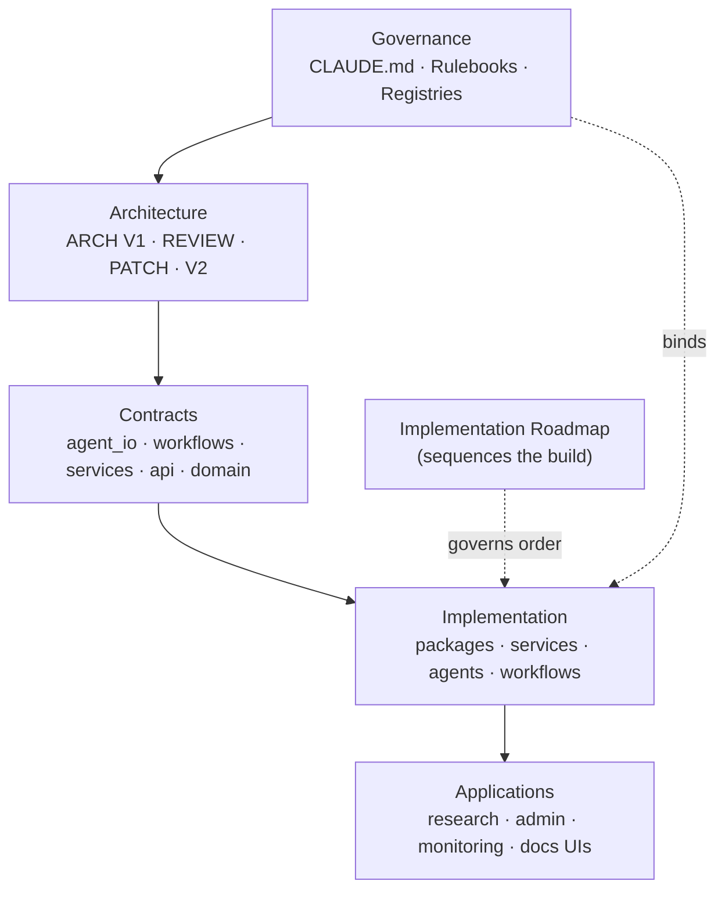
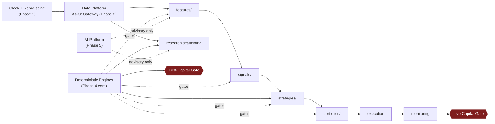

# PROJECT_INDEX.md — Canonical Repository Map

> **What this file is.** The single entry point and navigation map for this repository, for humans
> and AI systems alike. Read [`CLAUDE.md`](CLAUDE.md) (the Constitution) and this file, and you can
> find everything else.
>
> **What this file is NOT.** It is **not** a governance document, **not** an architecture document,
> and **not** a rulebook. It carries **no normative authority**. It _points to_ the authoritative
> documents and **never duplicates their contents** (DOC-1). Where this index and any governed
> document diverge, the governed document prevails and this index is corrected.
>
> **Maintainer:** ARB / PE. **Status:** Established (Phase 0). **Nature:** navigational (support tier).

---

## Table of Contents

1. [Repository Overview](#repository-overview)
2. [Repository Philosophy](#repository-philosophy)
3. [Repository Principles](#repository-principles)
4. [Reading Order](#reading-order)
5. [Authority Hierarchy](#authority-hierarchy)
6. [Governance Hierarchy](#governance-hierarchy)
7. [Documentation Hierarchy](#documentation-hierarchy)
8. [Repository Structure](#repository-structure)
9. [Directory Map](#directory-map)
10. [Document Index](#document-index) — [Architecture](#architecture-documents) · [Rulebooks](#rulebooks) · [Standards](#standards) · [Contracts](#contracts) · [Registries](#registries) · [Governance & Operations](#governance-documents--operations) · [Research](#research-documents) · [Implementation](#implementation-documents) · [ADR](#adr-documents) · [Repository Navigation](#repository-navigation-documents)
11. [Module Map](#module-map) — [Applications](#applications) · [Services](#services) · [Packages](#packages) · [Agents](#agents) · [Workflows](#workflows) · [Shared Components](#shared-components) · [Infrastructure](#infrastructure) · [Deployment](#deployment) · [Tests](#tests)
12. [Dependency Map](#dependency-map)
13. [Reading Paths by Role](#reading-paths-by-role)
14. [AI Navigation](#ai-navigation)
15. [Document Maintenance](#document-maintenance)

---

## Repository Overview

This repository is an **institutional quantitative research platform** — a reproducible,
statistically honest, machine-scale scientific institution that discovers, validates, retires, and
deploys quantitative alpha such that every conclusion is trustworthy enough to steward
institutional capital.

- **The unit of value** is the _validated hypothesis with an unbroken evidence trail_, not the trade.
- **The one rule that explains the rest:** **AI proposes and narrates; deterministic engines decide
  and execute; humans are accountable and approve** (the authority spine, Architecture V2 §4).
- **Current state:** the governance corpus and the **Phase 0 repository foundation** are
  established (structure, contracts, placeholders, documentation — no business logic yet). Full
  detail lives in the [Directory Map](docs/repository/DIRECTORY_MAP.md) and
  [Module Index](docs/repository/MODULE_INDEX.md).

Full mission/vision/philosophy are defined in [`CLAUDE.md`](CLAUDE.md) and are not restated here.

## Repository Philosophy

Defined authoritatively in [`CLAUDE.md`](CLAUDE.md) → _Philosophy_ and _Core Principles_. In brief
(pointers, not restatements): the system is a research institution, not a trading bot; the adversary
is ourselves (self-deception and irreproducibility); naming a problem is not solving it (every
guarantee has an enforcement mechanism, CP-1); determinism is the default and intelligence the
exception; everything consequential is immutable, versioned, provenance-bearing, and auditable.

## Repository Principles

The binding principles are `CLAUDE.md` **CP-1..8** (Core Principles), **AI-1..8** (AI Governance),
and **FB-1..14** (Forbidden Practices) — entrenched and non-waivable. The structural expression of
those principles is [Architecture V2](docs/architecture/architecture_v2.md) §3. This index does not
enumerate them; consult those sources directly.

## Reading Order

The recommended **navigation** sequence (distinct from the **authority** order below):

1. [`CLAUDE.md`](CLAUDE.md) — the Constitution (what governs).
2. **`PROJECT_INDEX.md`** (this file) — the map (where everything is).
3. [Architecture V2](docs/architecture/architecture_v2.md) — what the system is.
4. [Architecture Review](docs/architecture/architecture_review.md) — why the invariants exist.
5. [Architecture Patch Plan](docs/architecture/architecture_patch_plan.md) — the correctness/enforcement sequence.
6. [Implementation Roadmap](docs/implementation/implementation_roadmap.md) — what is built, in what order.
7. The relevant [Rulebook](#rulebooks) / [Registry](#registries) / [Contract](#contracts) for your module.

Role-specific paths are in [Reading Paths by Role](#reading-paths-by-role).

---

## Authority Hierarchy

> **Navigation order ≠ authority order.** For _finding_ things, start at this index. For _deciding
> which document wins_, the Constitution's **Table of Authority** governs. This index inserts no new
> tier and overrides nothing.

```
        ENTRY / NAVIGATION                         AUTHORITY (governs conflicts)
   ┌──────────────────────────┐            ┌──────────────────────────────────────┐
   │  CLAUDE.md (Constitution) │  ← read →  │  Tier 1 · CLAUDE.md      (SUPREME)     │
   │            ↓             │            │            ↓                          │
   │  PROJECT_INDEX.md (map)  │  (no       │  Tier 2 · Architecture Canon          │
   │            ↓             │  authority)│           (ARCH V1 · REVIEW · PATCH · V2)│
   │  Architecture V2         │            │            ↓                          │
   │            ↓             │            │  Tier 3 · Rulebooks (+ Standards)     │
   │  Rulebooks / Standards   │            │            ↓                          │
   │            ↓             │            │  Tier 4 · Agent Contracts             │
   │  Contracts               │            │            ↓                          │
   │            ↓             │            │  Tier 5 · Workflow Contracts          │
   │  Registries / Operations │            │            ↓                          │
   │            ↓             │            │  Tier 6 · Source Code   (LOWEST)      │
   │  ADR / Roadmap / Impl.   │            └──────────────────────────────────────┘
   └──────────────────────────┘
```

**Conflict resolution (per `CLAUDE.md` Table of Authority & Decision Hierarchy):**

1. A **lower tier MUST NOT contradict a higher tier**; a conflicting lower-tier artifact is void until reconciled.
2. Within Tier 2, precedence for change-law is ARCH → PATCH (change sequence) → REVIEW (rationale); the target-state blueprint is Architecture V2.
3. **Registries, operational frameworks, the ADR-governance rulebook, and the Implementation
   Roadmap are subordinate instruments**: registries and operations instantiate architecture
   patches under their governing rulebooks; the Roadmap sequences construction and is governed by
   Tiers 1–2. None overrides a higher tier.
4. **Deterministic engines outrank LLM agents** for any decision; **humans with governance authority
   outrank all automated systems** for governance and capital decisions.
5. On any conflict where ambiguity remains, the **more conservative interpretation** (the one that
   better preserves reproducibility, point-in-time correctness, statistical integrity, and
   separation of powers) prevails (`CLAUDE.md` PR-CONF-1).
6. **This index (`PROJECT_INDEX.md`) never wins a conflict** — if it disagrees with any governed
   document, the governed document is right and this file is corrected.

## Governance Hierarchy

The governance corpus, tier by tier, with each document's home. Full descriptions and clause
citations are in the [Governance Index](docs/repository/GOVERNANCE_INDEX.md); the per-document rows
are in the [Document Index](#document-index) below.

| Tier | Role                                                                    | Documents                                                                                                                                                                                                                                      |
| ---- | ----------------------------------------------------------------------- | ---------------------------------------------------------------------------------------------------------------------------------------------------------------------------------------------------------------------------------------------- |
| 1    | Constitution (supreme)                                                  | [`CLAUDE.md`](CLAUDE.md)                                                                                                                                                                                                                       |
| 2    | Architecture Canon                                                      | [ARCH V1](docs/architecture/hedgefund-research-os-architecture.md) · [REVIEW](docs/architecture/architecture_review.md) · [PATCH PLAN](docs/architecture/architecture_patch_plan.md) · [Architecture V2](docs/architecture/architecture_v2.md) |
| 3    | Rulebooks & Standards                                                   | [Rulebook Framework](docs/rulebooks/rulebook_framework.md) + 8 rulebooks + [Coding Standards](docs/standards/coding_standards.md) + [ADR Governance](docs/architecture/adr/adr_governance.md)                                                  |
| 4    | Agent Contracts                                                         | [`agent_contracts.md`](docs/contracts/agent_contracts.md)                                                                                                                                                                                      |
| 5    | Workflow Contracts                                                      | [`workflow_contracts.md`](docs/contracts/workflow_contracts.md)                                                                                                                                                                                |
| —    | Operational governance (instantiations, subordinate to their rulebooks) | [Registries](#registries) · [Operations](#governance-documents--operations) · [Agent Evaluation](docs/evaluation/ai_agent_evaluation_framework.md)                                                                                             |
| —    | Build sequence (governed by Tiers 1–2)                                  | [Implementation Roadmap](docs/implementation/implementation_roadmap.md)                                                                                                                                                                        |
| 6    | Source Code                                                             | this repository                                                                                                                                                                                                                                |

## Documentation Hierarchy

- **Normative documents** (govern behavior): Tiers 1–5 above, plus the operational governance
  instruments. Owned by domain leads / committees; amendable only per the Constitution's Amendment
  Procedure (ADR-driven).
- **Navigational documents** (help you find and build; carry no authority): this file, and
  everything under [`docs/repository/`](docs/repository/) — the [Architecture Map](docs/repository/ARCHITECTURE_MAP.md),
  [Directory Map](docs/repository/DIRECTORY_MAP.md), [Development Guide](docs/repository/DEVELOPMENT_GUIDE.md),
  [Governance Index](docs/repository/GOVERNANCE_INDEX.md), [Module Index](docs/repository/MODULE_INDEX.md),
  plus [`README.md`](README.md) and [`CONTRIBUTING.md`](CONTRIBUTING.md).
- **Decision records:** [`docs/adr/`](docs/adr/) — immutable once accepted (ADR-1).

---

## Repository Structure

Top-level layout (technology-independent). Each directory carries its own `README.md` with the full
Purpose / Scope / Responsibilities / Allowed / Forbidden / Ownership / Dependencies / Governance
block; this index links to the group, not the prose.

```
platform/
├── CLAUDE.md                  # Tier-1 Constitution (supreme)
├── PROJECT_INDEX.md           # this file — the map
├── README.md · CONTRIBUTING.md
├── docs/                      # the governance corpus (Tiers 1–5) + navigation + ADRs
├── apps/                      # human consoles (act only via governed APIs)          [Phase 7]
├── services/                  # one backend service per bounded context               [Phases 2–8]
├── packages/                  # shared libraries & SDKs (depend on contracts)         [Phases 0–6]
├── agents/                    # registered, contract-bound AI agents (propose/narrate)[Phase 5]
├── contracts/                 # the contract registry (agent_io/workflows/services/api/domain)
├── workflows/                 # Tier-5 workflow definitions (orchestrate, never decide)[Phase 6]
├── datasets/ experiments/ features/ signals/ strategies/ portfolios/   # registry-governed artifacts
├── shared/                    # shared kernel: ontologies · vocabulary · enums
├── configs/                   # config + environment separation (secrets by reference)
├── infrastructure/            # vendor-neutral substrate (bus+ACLs · stores · identity)[Phase 1]
├── deployment/                # paper-first, token-gated release & rollback           [Phase 8]
├── tests/                     # golden · conformance · integration · e2e · unit
├── tools/ scripts/ examples/  # build tooling · automation · reference patterns
```

## Directory Map

The authoritative directory index (responsibility, owner, governance per directory) is
[docs/repository/DIRECTORY_MAP.md](docs/repository/DIRECTORY_MAP.md). Its one-line summary:

| Directory                                                                                                                                                         | Responsibility                 | Owner       | Layer / Phase         |
| ----------------------------------------------------------------------------------------------------------------------------------------------------------------- | ------------------------------ | ----------- | --------------------- |
| [`apps/`](apps/)                                                                                                                                                  | Human consoles; never decide   | PE          | UI · 7                |
| [`services/`](services/)                                                                                                                                          | Bounded-context backends       | per service | Layers 5–9 · 2–8      |
| [`packages/`](packages/)                                                                                                                                          | Shared libs & SDKs             | PE/HSRE     | Cross-cutting · 0–6   |
| [`agents/`](agents/)                                                                                                                                              | Registered AI agents           | HAI         | Layer 3 · 5           |
| [`contracts/`](contracts/)                                                                                                                                        | Contract registry              | ARB         | Contracts Spine · 0/1 |
| [`workflows/`](workflows/)                                                                                                                                        | Tier-5 workflows               | HSRE        | Layer 4 · 6           |
| [`datasets/`](datasets/) [`experiments/`](experiments/) [`features/`](features/) [`signals/`](signals/) [`strategies/`](strategies/) [`portfolios/`](portfolios/) | Registry-governed artifacts    | HD/HQ/HPR   | Layers 5–6 · 2–4      |
| [`shared/`](shared/)                                                                                                                                              | Shared kernel                  | ARB/PE      | Cross-cutting · 1     |
| [`configs/`](configs/)                                                                                                                                            | Config & env separation        | PE/HSRE     | Cross-cutting · 0     |
| [`infrastructure/`](infrastructure/)                                                                                                                              | Vendor-neutral substrate       | HSRE        | Cross-cutting · 1     |
| [`deployment/`](deployment/)                                                                                                                                      | Release & rollback             | HSRE/HPR    | Layer 9 · 8           |
| [`tests/`](tests/)                                                                                                                                                | Golden/conformance/e2e         | PE          | Cross-cutting         |
| [`tools/`](tools/) [`scripts/`](scripts/) [`examples/`](examples/)                                                                                                | Build tooling & patterns       | PE          | Build-time            |
| [`docs/`](docs/)                                                                                                                                                  | Governance corpus + navigation | ARB         | Tiers 1–5             |

---

## Document Index

> Columns: **Document · Purpose (hook, not a summary) · Location · Owner · Dependencies · Related ·
> Authority · Status.** Purpose lines are pointers; the document itself is authoritative. Governance
> documents carry Status **Proposed (binding upon ARB ratification)** as stated in their own
> headers; navigational/skeleton artifacts are **Established (Phase 0)**.

### Architecture Documents

| Document                        | Purpose                                                     | Location                                                                                                           | Owner             | Dependencies                   | Related                 | Authority        | Status                 |
| ------------------------------- | ----------------------------------------------------------- | ------------------------------------------------------------------------------------------------------------------ | ----------------- | ------------------------------ | ----------------------- | ---------------- | ---------------------- |
| Constitution                    | The supreme governing law                                   | [CLAUDE.md](CLAUDE.md)                                                                                             | Constitutional    | —                              | all                     | Tier 1 (supreme) | In force               |
| Architecture V1 (ARCH)          | The system design of record; invariants §8                  | [docs/architecture/hedgefund-research-os-architecture.md](docs/architecture/hedgefund-research-os-architecture.md) | ARB               | CLAUDE.md                      | REVIEW, PATCH, V2       | Tier 2           | Historical (of record) |
| Architecture Review (REVIEW)    | Independent adversarial audit; findings C1–C6, M\*          | [docs/architecture/architecture_review.md](docs/architecture/architecture_review.md)                               | Independent audit | ARCH                           | PATCH, V2               | Tier 2           | Accepted               |
| Architecture Patch Plan (PATCH) | V1→V2 migration law; patches, phases, release gates §5      | [docs/architecture/architecture_patch_plan.md](docs/architecture/architecture_patch_plan.md)                       | ARB               | ARCH, REVIEW                   | V2, Roadmap             | Tier 2           | Proposed               |
| Architecture V2 (ARCH-V2)       | Governance-mature target-state blueprint (9 layers, spines) | [docs/architecture/architecture_v2.md](docs/architecture/architecture_v2.md)                                       | ARB               | CLAUDE.md, ARCH, REVIEW, PATCH | all rulebooks/contracts | Tier 2           | Proposed               |

### Rulebooks

_(Rulebook Framework is Tier-3 meta; each rulebook translates constitutional rules into
domain-enforceable checks. Codes are rule-ID prefixes.)_

| Document                              | Purpose                                    | Location                                                                             | Owner     | Dependencies  | Related                  | Authority | Status   |
| ------------------------------------- | ------------------------------------------ | ------------------------------------------------------------------------------------ | --------- | ------------- | ------------------------ | --------- | -------- |
| Rulebook Framework                    | Defines the rulebook system (RB-NN, codes) | [docs/rulebooks/rulebook_framework.md](docs/rulebooks/rulebook_framework.md)         | ARB/GRC   | CLAUDE.md, V2 | all rulebooks            | Tier 3    | Proposed |
| STAT · Statistics (RB-01)             | Multiple-testing, deflation, significance  | [docs/rulebooks/statistics.md](docs/rulebooks/statistics.md)                         | HR (+GRC) | Framework     | VAL, RMET                | Tier 3    | Proposed |
| RMET · Research Methodology (RB-02)   | Scientific method, pre-registration        | [docs/rulebooks/research_methodology.md](docs/rulebooks/research_methodology.md)     | HR        | Framework     | STAT, FAR                | Tier 3    | Proposed |
| DATA · Data Quality (RB-06/07)        | Ingestion, certification, quality          | [docs/rulebooks/data_quality.md](docs/rulebooks/data_quality.md)                     | HD        | Framework     | PIT, Dataset Gov         | Tier 3    | Proposed |
| FAR · Factor Research (RB-09/10)      | Feature/factor & alpha research            | [docs/rulebooks/factor_research.md](docs/rulebooks/factor_research.md)               | HQ        | Framework     | Feature/Signal Reg       | Tier 3    | Proposed |
| BKT · Backtesting (RB-11)             | Institutional backtest realism             | [docs/rulebooks/backtesting.md](docs/rulebooks/backtesting.md)                       | HQ        | Framework     | STAT, PORT               | Tier 3    | Proposed |
| PORT · Portfolio Construction (RB-12) | Net-of-cost optimization                   | [docs/rulebooks/portfolio_construction.md](docs/rulebooks/portfolio_construction.md) | HPR       | Framework     | RISK, Portfolio Reg      | Tier 3    | Proposed |
| RISK · Risk Management (RB-13)        | Limits, halts, kill-switch                 | [docs/rulebooks/risk_management.md](docs/rulebooks/risk_management.md)               | HPR       | Framework     | PORT, Execution          | Tier 3    | Proposed |
| AIGOV · AI Governance (RB-15)         | AI capability class, isolation, provenance | [docs/rulebooks/ai_governance.md](docs/rulebooks/ai_governance.md)                   | HAI       | Framework     | Agent Contracts/Registry | Tier 3    | Proposed |

### Standards

| Document                        | Purpose                    | Location                                                                           | Owner | Dependencies     | Related              | Authority | Status   |
| ------------------------------- | -------------------------- | ---------------------------------------------------------------------------------- | ----- | ---------------- | -------------------- | --------- | -------- |
| CODE · Coding Standards (RB-20) | How to code/structure/test | [docs/standards/coding_standards.md](docs/standards/coding_standards.md)           | PE    | Framework        | Contracts, Dev Guide | Tier 3    | Proposed |
| ADG · ADR Governance (RB-25)    | How decisions are recorded | [docs/architecture/adr/adr_governance.md](docs/architecture/adr/adr_governance.md) | ARB   | CLAUDE.md, V2 §9 | docs/adr/            | Tier 3    | Proposed |

### Contracts

| Document                 | Purpose                                      | Location                                                                     | Owner                | Dependencies    | Related                   | Authority | Status   |
| ------------------------ | -------------------------------------------- | ---------------------------------------------------------------------------- | -------------------- | --------------- | ------------------------- | --------- | -------- |
| Agent Contracts (AGC)    | Tier-4 agent I/O, authority, isolation rules | [docs/contracts/agent_contracts.md](docs/contracts/agent_contracts.md)       | HAI                  | AIGOV, V2 §5.3  | Agent Registry, `agents/` | Tier 4    | Proposed |
| Workflow Contracts (WFC) | Tier-5 orchestration, staged chain           | [docs/contracts/workflow_contracts.md](docs/contracts/workflow_contracts.md) | HSRE (+domain leads) | Agent Contracts | `workflows/`              | Tier 5    | Proposed |

### Registries

_(Operational sources of truth; each subordinate to its governing rulebook and to Architecture V2;
each governs a repository artifact directory.)_

| Document                 | Purpose                             | Location                                                                   | Owner | Governs                      | Related                      | Authority           | Status   |
| ------------------------ | ----------------------------------- | -------------------------------------------------------------------------- | ----- | ---------------------------- | ---------------------------- | ------------------- | -------- |
| Agent Registry (REG)     | Agent existence & governance status | [docs/registry/agent_registry.md](docs/registry/agent_registry.md)         | HAI   | [`agents/`](agents/)         | Agent Contracts, AIGOV, Eval | Operational (P4-02) | Proposed |
| Portfolio Registry (PFR) | Portfolio snapshots & lineage       | [docs/registry/portfolio_registry.md](docs/registry/portfolio_registry.md) | HPR   | [`portfolios/`](portfolios/) | PORT, RISK                   | Operational         | Proposed |
| Dataset Governance (DSG) | Dataset certification & registry    | [docs/data/dataset_governance.md](docs/data/dataset_governance.md)         | HD    | [`datasets/`](datasets/)     | DATA, PIT                    | Operational         | Proposed |
| Feature Registry (FRG)   | Feature marketplace & lineage       | [docs/research/feature_registry.md](docs/research/feature_registry.md)     | HQ    | [`features/`](features/)     | FAR, Leakage Harness         | Operational         | Proposed |
| Signal Registry (SIG)    | Signal lifecycle                    | [docs/research/signal_registry.md](docs/research/signal_registry.md)       | HQ    | [`signals/`](signals/)       | FAR, isolation barrier       | Operational         | Proposed |
| Strategy Registry (STR)  | Strategy lifecycle & retirement     | [docs/research/strategy_registry.md](docs/research/strategy_registry.md)   | HQ    | [`strategies/`](strategies/) | Validation, Portfolio        | Operational         | Proposed |

### Governance Documents & Operations

| Document                    | Purpose                                     | Location                                                                                             | Owner    | Dependencies          | Related                                   | Authority   | Status   |
| --------------------------- | ------------------------------------------- | ---------------------------------------------------------------------------------------------------- | -------- | --------------------- | ----------------------------------------- | ----------- | -------- |
| Experiment Tracking (EXG)   | Experiment registration & Trial-Ledger link | [docs/research/experiment_tracking_governance.md](docs/research/experiment_tracking_governance.md)   | HR       | STAT, RMET            | [`experiments/`](experiments/)            | Operational | Proposed |
| Execution Governance (EG)   | Paper-first, token-gated execution          | [docs/operations/execution_governance.md](docs/operations/execution_governance.md)                   | HSRE/HPR | RISK, V2 §5.9         | `services/execution-service/`, Deployment | Operational | Proposed |
| Production Monitoring (MON) | Independent monitoring, parity, halts       | [docs/operations/production_monitoring.md](docs/operations/production_monitoring.md)                 | HSRE     | Execution Gov         | `services/monitoring-service/`            | Operational | Proposed |
| Incident Response (IR)      | Incident handling & escalation              | [docs/operations/incident_response_governance.md](docs/operations/incident_response_governance.md)   | HSRE     | Monitoring            | DR/BCP                                    | Operational | Proposed |
| Disaster Recovery (DR-BCP)  | Tested RPO/RTO, continuity                  | [docs/operations/disaster_recovery_governance.md](docs/operations/disaster_recovery_governance.md)   | HSRE     | Incident Response     | Deployment                                | Operational | Proposed |
| AI Agent Evaluation (EVAL)  | Model/agent eval gate & drift               | [docs/evaluation/ai_agent_evaluation_framework.md](docs/evaluation/ai_agent_evaluation_framework.md) | HAI/MRC  | AIGOV, Agent Registry | `packages/ai-runtime/`                    | Operational | Proposed |

### Research Documents

The research-lifecycle documents are the Feature/Signal/Strategy Registries and Experiment Tracking
(indexed under [Registries](#registries) and [Operations](#governance-documents--operations)),
governed by RB-02 · RMET and RB-09/10 · FAR. Research artifact directories:
[`experiments/`](experiments/) · [`features/`](features/) · [`signals/`](signals/) ·
[`strategies/`](strategies/) · [`portfolios/`](portfolios/) · [`datasets/`](datasets/).

### Implementation Documents

| Document                     | Purpose                                                | Location                                                                                       | Owner    | Dependencies         | Related                  | Authority      | Status   |
| ---------------------------- | ------------------------------------------------------ | ---------------------------------------------------------------------------------------------- | -------- | -------------------- | ------------------------ | -------------- | -------- |
| Implementation Roadmap (IMP) | Build sequence Phases 0–8; gates; deliverable registry | [docs/implementation/implementation_roadmap.md](docs/implementation/implementation_roadmap.md) | ARB + PE | CLAUDE.md, V2, PATCH | all rulebooks/registries | Build sequence | Proposed |

### ADR Documents

| Document             | Purpose                        | Location                                                                           | Owner | Dependencies     | Related     | Authority      | Status      |
| -------------------- | ------------------------------ | ---------------------------------------------------------------------------------- | ----- | ---------------- | ----------- | -------------- | ----------- |
| ADR Governance (ADG) | The rules for decision records | [docs/architecture/adr/adr_governance.md](docs/architecture/adr/adr_governance.md) | ARB   | CLAUDE.md, V2 §9 | docs/adr/   | Tier 3 (RB-25) | Proposed    |
| ADR Repository       | Accepted decisions (immutable) | [docs/adr/](docs/adr/)                                                             | ARB   | ADR Governance   | all changes | Records        | Established |
| ADR Template         | Starting point for a new ADR   | [docs/adr/0000-template.md](docs/adr/0000-template.md)                             | ARB   | ADR Governance   | —           | Template       | Established |

### Repository Navigation Documents

_(Non-normative; created in Phase 0; carry no authority.)_

| Document           | Purpose                                  | Location                                                                     | Owner   | Related            | Authority    | Status      |
| ------------------ | ---------------------------------------- | ---------------------------------------------------------------------------- | ------- | ------------------ | ------------ | ----------- |
| Repository README  | Front door & quick map                   | [README.md](README.md)                                                       | PE      | this index         | Navigational | Established |
| Contribution Guide | How to contribute (governed act)         | [CONTRIBUTING.md](CONTRIBUTING.md)                                           | PE      | Dev Guide          | Navigational | Established |
| Architecture Map   | Directories ↔ Architecture V2 layers    | [docs/repository/ARCHITECTURE_MAP.md](docs/repository/ARCHITECTURE_MAP.md)   | ARB     | V2                 | Navigational | Established |
| Directory Map      | Every directory's responsibility & owner | [docs/repository/DIRECTORY_MAP.md](docs/repository/DIRECTORY_MAP.md)         | ARB     | V2 §2              | Navigational | Established |
| Development Guide  | The canonical build workflow & gates     | [docs/repository/DEVELOPMENT_GUIDE.md](docs/repository/DEVELOPMENT_GUIDE.md) | PE      | Roadmap, RB-20..25 | Navigational | Established |
| Governance Index   | Corpus index in tier order               | [docs/repository/GOVERNANCE_INDEX.md](docs/repository/GOVERNANCE_INDEX.md)   | ARB/GRC | CLAUDE.md          | Navigational | Established |
| Module Index       | Deliverable-registry view of modules     | [docs/repository/MODULE_INDEX.md](docs/repository/MODULE_INDEX.md)           | ARB/PE  | Roadmap Part G     | Navigational | Established |

---

## Module Map

> High-level map of the buildable modules. Detail (owner, dependencies, phase, governance) is in the
> [Module Index](docs/repository/MODULE_INDEX.md). All modules are **Phase 0 scaffolding
> placeholders** — no business logic yet.

### Applications

Human consoles under [`apps/`](apps/) — act **only** through governed APIs (Architecture V2 §6.2):
[research-web](apps/research-web/) · [admin-web](apps/admin-web/) (approvals/sign-off) ·
[monitoring-web](apps/monitoring-web/) · [docs](apps/docs/). _(Phase 7)_

### Services

Bounded-context backends under [`services/`](services/):
[research](services/research-service/) · [dataset](services/dataset-service/) ·
[feature](services/feature-service/) · [signal](services/signal-service/) ·
[strategy](services/strategy-service/) · [portfolio](services/portfolio-service/) ·
[backtesting](services/backtesting-service/) · [validation](services/validation-service/) ·
[risk](services/risk-service/) · [execution](services/execution-service/) ·
[monitoring](services/monitoring-service/).

### Packages

Shared libraries & SDKs under [`packages/`](packages/):
[core-domain](packages/core-domain/) · [shared-types](packages/shared-types/) ·
[contracts](packages/contracts/) · [utilities](packages/utilities/) ·
[configuration](packages/configuration/) · [logging](packages/logging/) ·
[observability](packages/observability/) · [security](packages/security/) ·
[validation](packages/validation/) · [workflow-engine](packages/workflow-engine/) ·
[ai-runtime](packages/ai-runtime/) · [research-sdk](packages/research-sdk/) ·
[data-sdk](packages/data-sdk/).

### Research Modules

Registry-governed research artifacts: [`experiments/`](experiments/) · [`features/`](features/) ·
[`signals/`](signals/) · [`strategies/`](strategies/) · [`portfolios/`](portfolios/) ·
[`datasets/`](datasets/) — plus the research services above. _(Phases 2–4)_

### AI Modules

Advisory-only, isolation-aware: [`agents/`](agents/) (13 registered agents) +
[`packages/ai-runtime/`](packages/ai-runtime/), governed by the
[Agent Registry](docs/registry/agent_registry.md), [Agent Contracts](docs/contracts/agent_contracts.md),
and [Agent Evaluation](docs/evaluation/ai_agent_evaluation_framework.md). **No AI decides.** _(Phase 5)_

### Deterministic Engines (the core — Phase 4)

The **only** place consequential quantitative decisions are made (Architecture V2 §5.6/§6.3):
[validation-service](services/validation-service/) (Trial Ledger, gauntlet, holdout, replication,
scientific gate) · [backtesting-service](services/backtesting-service/) ·
[portfolio-service](services/portfolio-service/) · [risk-service](services/risk-service/) ·
[execution-service](services/execution-service/). These must run with **all AI suspended** (AV2-20).

### Shared Libraries

The shared kernel [`shared/`](shared/) (ontologies · vocabulary · enums) plus the cross-cutting
packages (core-domain, shared-types, utilities, configuration, logging, observability, security,
validation).

### Workflows

Tier-5 orchestrations under [`workflows/`](workflows/): [research-discovery](workflows/research-discovery/) (WFC-43) ·
[feature-research](workflows/feature-research/) (WFC-44) · [backtesting](workflows/backtesting/) (WFC-45) ·
[validation](workflows/validation/) (WFC-46) · [risk-review](workflows/risk-review/) (WFC-47) ·
[portfolio-construction](workflows/portfolio-construction/) (WFC-48) ·
[production-deployment](workflows/production-deployment/) (WFC-49).

### Agents

Registered roster (all `propose`/`narrate` only — none `decide`, REG-9): RD-001..004
(research-discovery), FD-001/002 (feature-discovery), AN-001 (analysis), VN-001
(validation-narrator), RN-001 (risk-narrator), PN-001 (portfolio-narrator), DO-001
(documentation), EN-001 (engineering), MO-001 (monitoring-narrator). See
[`agents/`](agents/) and the [Agent Registry](docs/registry/agent_registry.md).

### Infrastructure

Vendor-neutral substrate [`infrastructure/`](infrastructure/): [bus](infrastructure/bus/)
(partitioned topics + ACLs, isolation barrier) · [artifact-store](infrastructure/artifact-store/) ·
[identity](infrastructure/identity/) · [temporal-store](infrastructure/temporal-store/). _(Phase 1)_

### Deployment

[`deployment/`](deployment/): [release](deployment/release/) · [rollback](deployment/rollback/) ·
[environment-promotion](deployment/environment-promotion/) — paper-first, token-gated,
release-gated (IMP-29). _(Phase 8)_

### Tests

[`tests/`](tests/): [golden](tests/golden/) (hard gate for decision engines) ·
[conformance](tests/conformance/) (Architecture V2 §12 invariants) ·
[integration](tests/integration/) · [e2e](tests/e2e/) · [unit](tests/unit/).

---

## Dependency Map

**Governance → Architecture → Contracts → Implementation → Applications** (authority and build flow):



**Build/runtime dependency order** (a module is never built before its foundation's guarantees are
enforced — IMP-20; arrows = "depends on / gated by"):



**Contract & layer boundary rule:** components interact **only through contracts**; direct
cross-layer access to internals and any circular dependency are PROHIBITED (AV2-13, IMP-12). The
canonical dependency graphs are owned by [Architecture V2](docs/architecture/architecture_v2.md) §4
and the [Implementation Roadmap](docs/implementation/implementation_roadmap.md) Part D — this map
mirrors them and defers to them on any discrepancy.

---

## Reading Paths by Role

Each path is an ordered list of **existing** documents.

**New Contributor** →
[README.md](README.md) →
[CLAUDE.md](CLAUDE.md) (Philosophy, Core Principles, Forbidden Practices) →
this index →
[CONTRIBUTING.md](CONTRIBUTING.md) →
[Development Guide](docs/repository/DEVELOPMENT_GUIDE.md) →
[Directory Map](docs/repository/DIRECTORY_MAP.md).

**Researcher** →
[CLAUDE.md](CLAUDE.md) (Scientific Method, Research Lifecycle, Statistical Integrity) →
[RMET](docs/rulebooks/research_methodology.md) →
[STAT](docs/rulebooks/statistics.md) →
[FAR](docs/rulebooks/factor_research.md) →
[Experiment Tracking](docs/research/experiment_tracking_governance.md) →
[Feature](docs/research/feature_registry.md)/[Signal](docs/research/signal_registry.md)/[Strategy](docs/research/strategy_registry.md) Registries →
[BKT](docs/rulebooks/backtesting.md).

**AI Agent** → see [AI Navigation](#ai-navigation). Start:
[CLAUDE.md](CLAUDE.md) (AI Governance AI-1..8) →
this index →
[AIGOV](docs/rulebooks/ai_governance.md) →
[Agent Contracts](docs/contracts/agent_contracts.md) →
[Agent Registry](docs/registry/agent_registry.md).

**Software Engineer** →
[CLAUDE.md](CLAUDE.md) (Software Engineering & Coding Standards) →
[Architecture V2](docs/architecture/architecture_v2.md) →
[CODE](docs/standards/coding_standards.md) →
[Development Guide](docs/repository/DEVELOPMENT_GUIDE.md) →
[Contracts](docs/contracts/) →
[Module Index](docs/repository/MODULE_INDEX.md).

**Reviewer** →
[CLAUDE.md](CLAUDE.md) (Code Review Standards CR-1..4, Forbidden Practices) →
[Development Guide](docs/repository/DEVELOPMENT_GUIDE.md) (gates) →
the module's governing rulebook →
[ADR Governance](docs/architecture/adr/adr_governance.md).

**Architect** →
[CLAUDE.md](CLAUDE.md) (Architecture Principles) →
[Architecture V2](docs/architecture/architecture_v2.md) →
[Architecture Review](docs/architecture/architecture_review.md) →
[Architecture Patch Plan](docs/architecture/architecture_patch_plan.md) →
[ADR Governance](docs/architecture/adr/adr_governance.md) →
[Architecture Map](docs/repository/ARCHITECTURE_MAP.md).

**Operator** →
[CLAUDE.md](CLAUDE.md) (Risk, Deployment, Reliability) →
[Execution Governance](docs/operations/execution_governance.md) →
[Production Monitoring](docs/operations/production_monitoring.md) →
[Incident Response](docs/operations/incident_response_governance.md) →
[Disaster Recovery](docs/operations/disaster_recovery_governance.md).

---

## AI Navigation

> A dedicated protocol for AI assistants operating in this repository. AI systems are bound by
> `CLAUDE.md` **AI-1..8** and the [AI Governance rulebook](docs/rulebooks/ai_governance.md); this
> section only tells you how to _navigate_, never how to _decide_.

**1. Documents you MUST read first (in this order), before acting:**

1.  [`CLAUDE.md`](CLAUDE.md) — especially _AI Governance_ (AI-1..8), _Forbidden Practices_
    (FB-1..14), _LLM Usage Policy_, and _Decision Hierarchy_.
2.  **`PROJECT_INDEX.md`** (this file) — to locate everything else.
3.  For any consequential task, the governing **Rulebook / Registry / Contract** named in the
    relevant [Document Index](#document-index) row.

**2. How to resolve authority.** Use the [Authority Hierarchy](#authority-hierarchy). A lower tier
never overrides a higher tier. **Deterministic engines outrank you on every decision; humans with
governance authority outrank all automated systems.** You **propose and narrate** — you never
decide significance, validation, risk, allocation, promotion, or execution (AI-1..4, FB-1..4). If
two documents appear to conflict, prefer the higher tier and the more conservative reading
(PR-CONF-1); if still unclear, stop and surface it — do not resolve it by acting.

**3. How to interpret cross-references.** Citations are of the form `CP-1`, `AV2-13`, `RB-01 · STAT`,
`P2-09`, `WFC-46`, `AGT-VN-001`. Resolve them to their owning document via the
[Governance Index](docs/repository/GOVERNANCE_INDEX.md) / [Document Index](#document-index).
**A citation is a pointer, not a summary — read the target; never infer a rule's content from its
ID.** If a citation cannot be resolved, treat the dependent work as blocked until it is corrected
(per the Constitution's citation rule). Never treat this index or any `README` as authoritative
over the document it cites.

**4. How to plan implementation work.** Follow the
[Development Guide](docs/repository/DEVELOPMENT_GUIDE.md) and the
[Implementation Roadmap](docs/implementation/implementation_roadmap.md): confirm the phase/build
order permits the work (IMP-20; do not build a dependent before its foundation's guarantees are
enforced), meet **Definition of Ready**, work contract-first, and satisfy every gate to
**Definition of Done**. Locate the module's home via the
[Directory Map](docs/repository/DIRECTORY_MAP.md) and [Module Index](docs/repository/MODULE_INDEX.md).

**5. Boundaries you must respect while navigating.** Never access the OOS/holdout vault or
validation outcomes if you are (or are acting for) a generation agent (AI-5, isolation barrier
`P2-07`); read data only through the As-Of Gateway (PIT-1); never introduce secrets or raw vendor
data (FB-14); record provenance for anything consequential you produce (AI-8).

**6. If you change the repository,** update this index per [Document Maintenance](#document-maintenance)
and record non-obvious decisions as ADRs — but propose only; a human/governance actor approves.

---

## Document Maintenance

**Owner.** This file is owned by **ARB / PE** (Architecture Review Board with the Principal
Engineer). It is a navigational document and carries no authority; its correctness obligation is to
_resolve_ to the current corpus (DOC-4).

**When PROJECT_INDEX.md MUST be updated** (non-exhaustive):

- A governed document is **added, moved, renamed, superseded, or retired**.
- A **top-level directory or major module** is added, moved, or removed.
- A **new registered agent or workflow** is added, or the roster changes.
- An **owner** of a document or directory changes.
- A **phase completes** or a **release gate** is crossed (status changes).

**How new documents are added.**

1. The document is created and ratified under its own tier's process (rulebooks via the Rulebook
   Framework; architecture via ADR + Patch; etc.) — **not** by editing this index.
2. Once ratified, add a row to the correct [Document Index](#document-index) table and, if it governs
   a directory, note the mapping. Keep Purpose to a one-line hook; **never copy the document's
   content here** (DOC-1).
3. Ensure every new link **resolves** (DOC-4); a broken reference is a defect that blocks merge.

**How deprecated documents are handled.** Follow the Constitution's _Deprecation Policy_ (DEPR-1..3)
and _Versioning Policy_: mark the row **Superseded** (do not delete history while live artifacts
depend on it), point to the successor, and record the change in an ADR. A superseded governance
document is marked superseded in its own header, never silently removed.

**Consistency rule.** This index must stay consistent with the corpus it maps (DOC-3). If it ever
disagrees with a governed document, the governed document is authoritative and this index is the
defect to be fixed. The repository skeleton it describes is regenerated (not hand-drifted) via
[`tools/scaffolding/generate_foundation.sh`](tools/scaffolding/generate_foundation.sh); keep this map
in step with that generator.

---

_End of PROJECT_INDEX.md — the canonical navigation and indexing document for this repository. It is
the map, not the law: `CLAUDE.md` governs, the Architecture Canon defines, the Rulebooks and
Contracts rule, and the deterministic engines and accountable humans decide. This index only helps
every human and AI find them. Where it and any governed document diverge, the governed document
prevails and this file is corrected._
