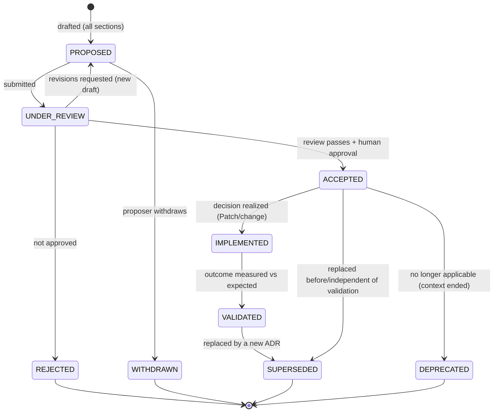
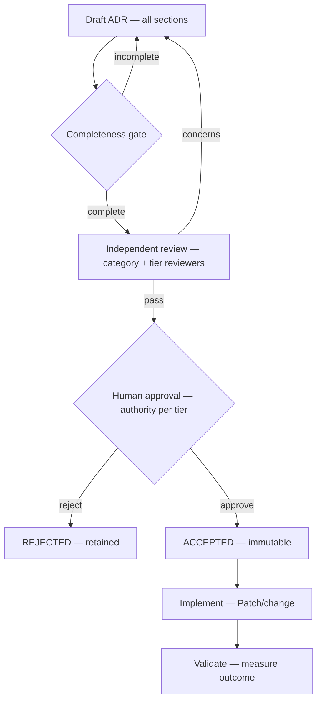

# Architecture Decision Record (ADR) Governance

| Field             | Value                                                                                                                                   |
| ----------------- | --------------------------------------------------------------------------------------------------------------------------------------- |
| **Document ID**   | ADR-GOVERNANCE                                                                                                                          |
| **Realizes**      | RB-25 · ADR (Architecture Decision Records rulebook)                                                                                    |
| **Clause prefix** | `ADG`                                                                                                                                   |
| **Owner**         | Architecture Review Board (**ARB**)                                                                                                     |
| **Co-signers**    | Governance & Risk Committee (**GRC**), Head of AI (**HAI**), Principal Engineer (**PE**), and the domain lead whose ADR is under review |
| **Governed by**   | `CLAUDE.md` (ADR-1..4, AM-1..4); Architecture V2 (§9); RB-23 · DOC; the Architecture Patch Plan                                         |
| **Version**       | 1.0.0                                                                                                                                   |
| **Status**        | PROPOSED (binding upon ARB ratification)                                                                                                |
| **Last Ratified** | — (pending)                                                                                                                             |

> **Location & reconciliation.** This governance _document_ is placed at `docs/architecture/adr/adr_governance.md` per the authoring instruction. **The ADR _records_ repository is `docs/adr/`**, as fixed by the Constitution (`CLAUDE.md` ADR-1) — that constitutional location is authoritative and is **not** overridden here. This document defines _how ADRs are governed_; the ADRs themselves live in `docs/adr/`.

> **Nature.** This is the institutional **memory system for significant decisions** — technical, architectural, research-infrastructure, and governance. It is not documentation-in-general, not meeting minutes, not an implementation manual. It operationalizes the Constitution's ADR and amendment rules and is referenced by every rulebook that requires an ADR for deviations.

> **Reading note.** Technology-independent. No code, no vendor decisions. Each major section carries **Purpose · Responsibilities · Boundaries · Acceptance · Failure · Cross-refs**, with embedded RFC 2119 rules (`ADG-n`). **Every important architectural, research-infrastructure, or governance decision MUST have an ADR.**

---

## 1. Purpose

To define the immutable governance for recording, reviewing, approving, and preserving significant decisions, so the institution answers — permanently and auditably — **what was decided, why, what alternatives were weighed, who approved it, what the consequences are, and whether it can be reversed.** ADRs are the institution's long-term decision memory: they prevent re-litigating settled questions, preserve the _why_ behind the architecture, and make decision-making transparent and accountable across a ten-year horizon and across human and AI contributors.

Its governing intent is `CLAUDE.md` ADR-1..4 (ADR requirements), AM-1..4 (amendments require ADRs), and AR-1 (architecture changes are governed decisions): decisions are evidence-based, human-approved, immutable once accepted, and traceable.

## 2. Scope & Boundaries

- **Purpose.** Define ADR philosophy, structure, lifecycle, decision authority, categories, AI-assisted governance, quality gates, and the ADR memory repository.
- **Responsibilities.** Ensure every significant decision is recorded to standard, reviewed, human-approved, immutable, linked, and preserved.
- **Boundaries (references only, never restated):**
  - **Documentation standards (formatting, reference integrity)** → **RB-23 · DOC**.
  - **The architecture change _process_ and evolution/migration** → **Architecture V2 §9** + the **Patch Plan** (an architecture change traces to a Patch ID _and_ an ADR).
  - **Constitutional amendment procedure** → `CLAUDE.md` **AM-1..4** (amendments are recorded as ADRs; this framework governs the ADR, not the constitutional authority to amend).
  - **AI role boundaries in decisions** → **RB-15 · AIGOV**; **audit-trail integrity** → **RB-27 · SEC** (`P1-09`).
  - **What decisions each domain owns** → the respective rulebooks (STAT/DATA/RMET/FAR/BT/PORT/RISK/AIGOV/CODE/…).
- **Acceptance.** Every significant decision has a conforming, human-approved, immutable ADR in `docs/adr/`. **Failure.** A significant decision made without an ADR, or an ADR edited after acceptance. **Cross-refs.** `CLAUDE.md` ADR-1..4, Architecture V2 §9.

## 3. Constitutional & Governance Basis

Traces to: `CLAUDE.md` **ADR-1..4** (structure, immutability, deviation-recording, invariant ratification), **AM-1..4** (amendment via ADR), **AR-1..4** (architecture governance), **DOC-1..4** (documentation), **AI-3/4** (AI not approving/overriding), **HO-1** (human accountability), **CP-2** (immutability), **CP-5** (separation), **CP-7** (audit), **DE-1**; Architecture V2 §9; Patch Plan §5 (deviations require ADRs citing Patch IDs); ARCH §2.18 (docs/ADRs). Every rulebook's "deviation requires an ADR" clause feeds this framework.

---

## Clause Format

**Pivotal clauses** carry the full block: _Purpose · Rationale · Acceptance · Failure · Refs_. **Supporting clauses** carry RFC 2119 force plus a one-line rationale. Every clause has a stable ID (`ADG-n`, continuous).

---

# PART A — ADR PHILOSOPHY

## Decision Transparency

- **ADG-1 (MUST).** Every significant decision MUST be recorded openly with its reasoning and rejected alternatives; decisions made without a transparent record are PROHIBITED for significant matters. _Rationale:_ CP-7, ADR-2; opacity breeds re-litigation and hidden risk. _Acceptance:_ an ADR exists and is discoverable. _Failure:_ a significant decision with no record. _Refs:_ ADG-10.

## Decision Traceability

- **ADG-2 (MUST).** Every ADR MUST be traceable to the context that prompted it, the artifacts it affects, and the decisions it supersedes or depends on; ADRs form a connected decision graph. _Rationale:_ CP-6; traceable decisions preserve the _why_. _Refs:_ ADG-58.

## Decision Accountability

- **ADG-3 (MUST).** Every ADR MUST name a single accountable human owner and its approver(s); AI MUST NOT be recorded as an approver or accountable party (HO-1, AI-3). _Rationale:_ accountability is human and non-delegable. _Refs:_ ADG-25.

## Evidence-Based Decisions

- **ADG-4 (MUST).** Significant decisions MUST be supported by evidence (analysis, experiments, measurements, review) proportionate to their consequence and reversibility; assertion or authority alone is insufficient. _Rationale:_ SM-3, CP-1; the platform is evidence-driven. _Acceptance:_ the ADR's Validation section carries proportionate evidence. _Failure:_ a high-consequence ADR with no evidence. _Refs:_ ADG-16, ADG-40.

## Reversible vs Irreversible Decisions

- **ADG-5 (MUST).** Every ADR MUST classify its decision as **reversible (two-way door)** or **irreversible/high-cost-to-reverse (one-way door)**; irreversible decisions MUST carry heightened scrutiny (more reviewers, stronger evidence, explicit human sign-off). _Rationale:_ proportion scrutiny to consequence; irreversibility is the key risk dimension. _Acceptance:_ reversibility classified; scrutiny matches. _Failure:_ an irreversible decision approved with two-way-door scrutiny. _Refs:_ ADG-24, ADG-42.

## Long-Term Knowledge Preservation

- **ADG-6 (MUST).** ADRs MUST be preserved permanently as immutable institutional memory; superseded ADRs are retained (marked superseded), never deleted. _Rationale:_ ADR-1, CP-2; the decision history is a permanent asset (REVIEW Missing #9 analog for decisions). _Refs:_ ADG-60.

---

# PART B — ADR STRUCTURE

- **ADG-7 (MUST).** Every ADR MUST contain **all** mandatory sections below; an ADR missing any is not acceptable. The sections answer the six mandatory questions (what/why/alternatives/who/consequences/reversible). _Rationale:_ ADR-2; a complete, uniform record. _Acceptance:_ all sections present and substantive. _Failure:_ an incomplete ADR reaching ACCEPTED. _Refs:_ §Quality.

**Mandatory ADR structure:**

| Section          | Fields                                                                                | Answers            |
| ---------------- | ------------------------------------------------------------------------------------- | ------------------ |
| **Metadata**     | ADR Identifier · Title · Status · Date · Owner · Reviewers · Category · Reversibility | who/when/status    |
| **Context**      | Problem · Background · Constraints · Requirements                                     | why now            |
| **Decision**     | Chosen solution · Reasoning · Authority (approver)                                    | what & why         |
| **Alternatives** | Rejected alternatives · Reasons for rejection                                         | what else, why not |
| **Consequences** | Positive impacts · Negative impacts · Trade-offs                                      | what follows       |
| **Validation**   | Evidence · Experiments · Measurements · Review results                                | proof              |
| **References**   | Architecture docs · Rulebooks · Contracts · Previous ADRs · Patch IDs                 | linkage            |

- **ADG-8 (MUST).** The **Alternatives** section MUST document genuinely-considered options with honest reasons for rejection; an ADR presenting only the chosen option (no real alternatives) is inadmissible. _Rationale:_ prevents post-hoc rationalization; alternatives are the evidence of due consideration. _Refs:_ ADG-38 (AI must not remove alternatives).
- **ADG-9 (MUST).** The **Consequences** section MUST state negative impacts and trade-offs honestly, not only benefits; hiding downsides is PROHIBITED. _Rationale:_ CP-7, RMET-11; honest consequences enable sound governance. _Refs:_ ADG-37.
- **ADG-10 (MUST).** The **References** section MUST cite the governing documents and any Patch ID; broken references block acceptance (DOC-4). _Rationale:_ ADR-2, DOC-4; unresolved references break the decision graph. _Refs:_ ADG-58.

---

# PART C — ADR LIFECYCLE

- **ADG-11 (MUST).** Every ADR MUST follow the lifecycle below; transitions are gated, approved, and recorded, and an ACCEPTED ADR is immutable (a change is a new superseding ADR). _Rationale:_ ADR-1; governed, immutable lifecycle. _Refs:_ ADG-13.

**Lifecycle governance table:**

| State        | Meaning                   | Approver                             | Immutable?     |
| ------------ | ------------------------- | ------------------------------------ | -------------- |
| PROPOSED     | drafted, not yet reviewed | owner                                | no (draft)     |
| UNDER_REVIEW | in review                 | reviewers                            | no (draft)     |
| ACCEPTED     | approved, binding         | **human authority (ARB/GRC/domain)** | **yes**        |
| IMPLEMENTED  | decision realized         | owner attests                        | yes            |
| VALIDATED    | outcome measured          | owner + reviewer                     | yes            |
| SUPERSEDED   | replaced by new ADR       | ARB                                  | yes (retained) |
| REJECTED     | not approved              | reviewers                            | yes (retained) |
| WITHDRAWN    | pulled by proposer        | owner                                | yes (retained) |
| DEPRECATED   | context no longer applies | ARB                                  | yes (retained) |

- **ADG-12 (MUST).** Allowed transitions are exactly those in the diagram; **an ACCEPTED ADR MUST NOT be edited** — corrections/changes create a new ADR that supersedes it (ADR-1). _Rationale:_ CP-2; immutability preserves the true decision history. _Acceptance:_ no post-acceptance edits; supersession creates new ids. _Failure:_ an edited accepted ADR. _Refs:_ ADG-6.
- **ADG-13 (MUST).** Transition to ACCEPTED requires: completeness (all sections), review pass, evidence proportionate to consequence/reversibility, and **explicit human approval** by the authority for the ADR's category and reversibility. _Rationale:_ ADR, HO-1; acceptance is the binding, human-accountable gate. _Refs:_ ADG-24.
- **ADG-14 (MUST).** SUPERSEDED/DEPRECATED ADRs MUST link to their successor/rationale and remain retained and discoverable. _Rationale:_ ADG-6; superseded decisions are still memory. _Refs:_ ADG-60.

---

# PART D — DECISION AUTHORITY

## Humans — MUST

- **ADG-15 (MUST).** Humans MUST approve critical architecture, research-infrastructure, and governance decisions and MUST own final accountability for them (HO-1, AI-3). _Rationale:_ accountability cannot be delegated to AI. _Acceptance:_ every ACCEPTED ADR has a human approver. _Failure:_ an ADR accepted without human approval. _Refs:_ ADG-13.
- **ADG-16 (MUST).** The approving authority MUST be commensurate with consequence and reversibility (ADG-24): irreversible/high-consequence ADRs require senior/board-level (ARB + GRC, and MRC for AI-risk) approval. _Rationale:_ proportion authority to stakes. _Refs:_ ADG-24.

## AI — MUST

- **ADG-17 (MUST).** AI systems MUST, when assisting: analyze options, provide evidence, and identify risks — as advisory input to the human decision (AIGOV-14). _Rationale:_ AI's legitimate role is advisory analysis. _Refs:_ ADG-31.

## AI — MUST NOT

- **ADG-18 (MUST NOT).** AI systems MUST NOT create binding architectural decisions. _Rationale:_ AI-3; decisions are human-approved. _Refs:_ ADG-15.
- **ADG-19 (MUST NOT).** AI systems MUST NOT approve their own recommendations (or any ADR). _Rationale:_ AI-3, CP-5; self-approval is void. _Refs:_ ADG-15.
- **ADG-20 (MUST NOT).** AI systems MUST NOT modify ADR history. _Rationale:_ CP-2, ADR-1; ADR history is immutable institutional memory. _Refs:_ ADG-12.

- **ADG-21 (MUST).** Enforcement of ADR authority (immutability, approval, no-AI-approval) MUST be deterministic (repository controls, review gates); an AI MUST NOT be the authority enforcing ADR governance. _Rationale:_ AIGOV-E-2. _Refs:_ §Enforcement.

---

# PART E — ADR CATEGORIES

- **ADG-22 (MUST).** Every ADR MUST be assigned exactly one primary category below; the category routes it to the correct owning authority and reviewers. _Rationale:_ categories align decisions with domain accountability. _Refs:_ ADG-16.

| Category                 | Domain                                | Primary authority | Reviewers    |
| ------------------------ | ------------------------------------- | ----------------- | ------------ |
| **Architecture**         | system structure, layers, boundaries  | ARB               | domain leads |
| **Data**                 | data governance, PIT, quality         | HD                | ARB, GRC     |
| **Research Methodology** | scientific process, pre-registration  | HQ/HR             | GRC          |
| **Quantitative Model**   | statistical/validation/model choices  | HQ                | GRC, MRC     |
| **Risk**                 | limits, kill-switches, risk framework | HPR               | GRC          |
| **AI Governance**        | agent/model/prompt/memory policy      | HAI               | MRC, GRC     |
| **Security**             | threat model, controls, secrets       | CISO              | ARB          |
| **Infrastructure**       | platform, storage, compute, scaling   | HSRE              | ARB          |
| **Agent**                | agent contracts, roster, authority    | HAI               | ARB, MRC     |

- **ADG-23 (MUST).** Category-specific decisions MUST NOT be accepted without the category's owning authority's approval (e.g., a Risk ADR requires HPR/GRC; an AI-Governance ADR requires HAI/MRC). _Rationale:_ CP-5; domain accountability. _Refs:_ ADG-16.

## Reversibility & Consequence Tiering

- **ADG-24 (MUST).** Every ADR MUST be tiered by consequence × reversibility; the tier sets required evidence, reviewers, and approval level. _Rationale:_ proportion scrutiny to risk (tiered governance, `P5-05` analog). _Refs:_ ADG-5.

| Tier           | Consequence × reversibility                                          | Required scrutiny                                                  |
| -------------- | -------------------------------------------------------------------- | ------------------------------------------------------------------ |
| **T-Critical** | high consequence, irreversible / capital-safety / invariant-touching | strongest evidence; ARB + GRC (+ MRC) approval; independent review |
| **T-High**     | high consequence, reversible OR moderate irreversible                | strong evidence; ARB + domain lead                                 |
| **T-Standard** | moderate, reversible                                                 | evidence proportionate; domain lead + one reviewer                 |
| **T-Low**      | low, easily reversible                                               | lightweight; single reviewer                                       |

- **ADG-25 (MUST).** A decision that **weakens or touches a constitutional invariant** (reproducibility, PIT, separation of powers, statistical integrity, security) is **T-Critical** and additionally requires ratification per the Constitution's amendment procedure (`CLAUDE.md` AM-1..4); such a decision MUST NOT weaken an entrenched clause. _Rationale:_ AM-2, AR-4; invariants are protected. _Refs:_ ADG-16.

---

# PART F — AI-ASSISTED DECISION GOVERNANCE

## AI MAY

- **ADG-26 (MAY).** AI MAY: summarize options; analyze trade-offs; generate ADR drafts; and identify risks — all as advisory input labeled as AI-produced with provenance (AIGOV-14/26). _Rationale:_ AI accelerates analysis at the fuzzy edge. _Refs:_ ADG-31.

## AI MUST NOT

- **ADG-27 (MUST NOT).** AI MUST NOT become the final decision authority (ADG-18). _Rationale:_ AI-3.
- **ADG-28 (MUST NOT).** AI MUST NOT hide uncertainty; AI-assisted analysis MUST surface confidence and unknowns (AIGOV-29). _Rationale:_ automation bias; hidden uncertainty misleads approvers. _Refs:_ ADG-4.
- **ADG-29 (MUST NOT).** AI MUST NOT fabricate evidence, citations, measurements, or alternatives (AIGOV-28). _Rationale:_ fabrication corrupts the decision record — a terminal integrity violation. _Refs:_ ADG-8.
- **ADG-30 (MUST NOT).** AI MUST NOT remove or suppress alternatives; the human owner MUST verify the alternatives set is complete and honest. _Rationale:_ ADG-8; suppressing options biases the decision. _Refs:_ ADG-8.

- **ADG-31 (MUST).** AI-drafted ADR content MUST be reviewed and owned by a human before it can advance; the human owner is accountable for the content regardless of AI authorship. _Rationale:_ HO-1, CODE-68 analog; AI drafts, humans own. _Refs:_ ADG-15.

---

# PART G — ADR QUALITY

- **ADG-32 (MUST).** Every ADR MUST be: **understandable, traceable, evidence-based, reviewable, and maintainable.** _Rationale:_ ADR is memory; low-quality ADRs are useless memory. _Acceptance:_ passes the quality checklist. _Failure:_ an unclear/untraceable/unevidenced ADR accepted. _Refs:_ ADG-34.

## ADR Review Process

- **ADG-33 (MUST).** Every ADR MUST be independently reviewed before acceptance by reviewers appropriate to its category and tier (ADG-22/24); the reviewer MUST be independent of the proposer for T-High/T-Critical (CP-5). _Rationale:_ CR-1; independent review catches weak reasoning and hidden trade-offs. _Refs:_ ADG-33-below.

## ADR Quality Gates

- **ADG-34 (MUST).** An ADR MUST pass the quality gate before ACCEPTED. _Rationale:_ CP-1; gates enforce quality. _Refs:_ ADG-13.

**ADR quality-gate checklist (all MUST pass):**

- [ ] All mandatory sections complete and substantive (ADG-7).
- [ ] Category + reversibility + tier assigned; scrutiny matches tier (ADG-22, ADG-24).
- [ ] Genuine alternatives with honest rejection reasons (ADG-8).
- [ ] Negative consequences and trade-offs stated (ADG-9).
- [ ] Evidence proportionate to consequence/reversibility (ADG-4).
- [ ] References resolve (docs/rulebooks/contracts/prior ADRs/Patch IDs) (ADG-10).
- [ ] AI-assisted content labeled; uncertainty surfaced; no fabrication; alternatives intact (ADG-26..31).
- [ ] Independent review passed; human approver of correct authority (ADG-33, ADG-15).
- [ ] Invariant-touching decisions routed through amendment procedure (ADG-25).

## ADR Audit Process

- **ADG-35 (MUST).** ADRs MUST be periodically audited (cadence GRC-governed): sampling accepted ADRs for quality, checking that significant decisions have ADRs (no undocumented significant decisions), verifying immutability, and confirming superseded chains are intact. _Rationale:_ CP-7; unaudited memory decays and gaps form. _Refs:_ ADG-28-audit.
- **ADG-36 (MUST).** Any significant decision discovered without an ADR MUST trigger retroactive recording and a process-improvement review; undocumented significant decisions are an integrity gap. _Rationale:_ ADR-3; the record must be complete. _Refs:_ ADG-1.

---

# PART H — ARCHITECTURAL MEMORY GOVERNANCE

## ADR Repository Structure

- **ADG-37 (MUST).** ADRs MUST reside in the constitutional ADR repository `docs/adr/` (per `CLAUDE.md` ADR-1), one ADR per file, immutable once accepted. _Rationale:_ ADR-1; a single canonical, immutable store. _Acceptance:_ every ADR is a file in `docs/adr/`. _Failure:_ ADRs scattered or mutable. _Refs:_ ADG-6.

## ADR Numbering

- **ADG-38 (MUST).** ADRs MUST use a stable, sequential, immutable identifier `ADR-NNNN` (zero-padded, monotonically increasing); an identifier MUST NOT be reused, even for rejected/withdrawn ADRs. _Rationale:_ stable ids anchor the decision graph and citations. _Acceptance:_ ids unique and never reused. _Failure:_ a reused or mutable id. _Refs:_ ADG-2.

## ADR Searchability

- **ADG-39 (MUST).** ADRs MUST be discoverable via an index keyed by id, title, category, status, tier, and date; the index MUST be kept current. _Rationale:_ memory unfindable is memory unusable. _Refs:_ ADG-40.

## ADR Linking

- **ADG-40 (MUST).** ADRs MUST link bidirectionally where relations exist: supersedes/superseded-by, depends-on, relates-to, and to Patch IDs, rulebooks, and contracts; the decision graph MUST be navigable. _Rationale:_ ADG-2; linkage is the memory's structure. _Refs:_ ADG-14.

## ADR Deprecation

- **ADG-41 (MUST).** An ADR whose context no longer applies MUST be marked DEPRECATED with rationale and retained; it MUST NOT be deleted or silently ignored. _Rationale:_ ADR-1; deprecated decisions still explain past states. _Refs:_ ADG-6.

## ADR Archiving

- **ADG-42 (MUST).** Superseded/deprecated/rejected/withdrawn ADRs MUST be archived (retained, discoverable, immutable) — never purged; the full decision history is permanent. _Rationale:_ CP-2, ADG-6; the institution's memory is not editable by removal. _Refs:_ ADG-37.

---

## Responsibility Matrix (RACI)

| ADR activity                  | AI            | Reviewers     | Owner (human) | Authority (ARB/GRC/domain)   |
| ----------------------------- | ------------- | ------------- | ------------- | ---------------------------- |
| Draft ADR / analyze options   | R (assist)    | —             | **A/R**       | I                            |
| Identify risks / alternatives | R (assist)    | C             | A             | I                            |
| Independent review            | assist        | **R**         | C             | A                            |
| Approve (accept)              | ✗ (forbidden) | R (recommend) | C             | **A/R**                      |
| Implement decision            | —             | —             | **R**         | A                            |
| Validate outcome              | narrate       | R             | **R**         | A                            |
| Supersede/deprecate           | propose       | R             | R             | **A**                        |
| Edit accepted ADR             | ✗             | ✗             | ✗             | ✗ (forbidden — new ADR only) |

---

## Enforcement & Verification

| Clause group                                      | Enforcement mechanism                                            | Owner                           |
| ------------------------------------------------- | ---------------------------------------------------------------- | ------------------------------- |
| ADR-required for significant decisions (ADG-1,36) | Change/architecture gate: significant change without ADR blocked | ARB, Architecture V2 §9         |
| Completeness & quality gate (ADG-7,34)            | ADR quality gate before acceptance                               | ARB, RB-23 · DOC                |
| Immutability (ADG-12,20,42)                       | Repository write-protection post-acceptance; supersede-only      | repository control, RB-27 · SEC |
| Human approval / no-AI-approval (ADG-15,18,19)    | Approval gate; AI cannot approve                                 | ARB, RB-15 · AIGOV              |
| Reference integrity (ADG-10,40)                   | Link-resolution check (fail on broken refs)                      | RB-23 · DOC                     |
| Invariant-touching → amendment (ADG-25)           | Route to constitutional amendment procedure                      | GRC (`CLAUDE.md` AM)            |
| Audit (ADG-35,36)                                 | Periodic ADR audit + tamper-evident history                      | GRC, RB-27 · SEC                |

- **ADG-E-1 (MUST).** Every clause enforcing immutability, human-approval, or the ADR-required rule MUST be enforced deterministically and fail-closed (`P1-09` audit integrity). _Rationale:_ CP-1, DE-1. _Refs:_ ADG-21.

## Exceptions & Waivers

- **ADG-W-1 (MUST).** No exception MAY be granted to: ADR immutability (ADG-12), human approval (ADG-15), no-AI-approval (ADG-19), no-editing-history (ADG-20), or any `CLAUDE.md` entrenched clause (AM-2). Non-waivable.
- **ADG-W-2 (MAY).** ADR process parameters (tier thresholds, reviewer counts, audit cadence) MAY be changed only by ARB + GRC, recorded as a versioned parameter set with rationale (itself an ADR), applied prospectively.
- **ADG-W-3 (MUST).** Any temporary process waiver MUST itself be recorded as an ADR. _Rationale:_ the ADR system governs its own exceptions.

## Ratification Criteria

Ratifiable only when: every clause has a stable ID, RFC 2119 phrasing, and an enforcement mechanism; no clause contradicts `CLAUDE.md` (esp. ADR-1..4, AM-1..4), Architecture V2, or peer rulebooks; the ADR repository location honors `CLAUDE.md` ADR-1 (`docs/adr/`); immutability, human approval, and no-AI-approval are preserved; all cross-references resolve; ARB approval with GRC co-sign obtained.

## Success Metrics

- **SM-1.** 100% of significant architecture/research-infra/governance decisions have conforming ADRs (ADG-1, ADG-36).
- **SM-2.** 0 edited-after-acceptance ADRs; 0 reused identifiers (ADG-12, ADG-38).
- **SM-3.** 0 AI-approved ADRs; 100% ACCEPTED ADRs with a human approver of correct authority (ADG-15, ADG-19).
- **SM-4.** 100% ADRs with genuine alternatives, honest consequences, and proportionate evidence (ADG-4, ADG-8, ADG-9).
- **SM-5.** 0 broken references in accepted ADRs; decision graph navigable (ADG-10, ADG-40).
- **SM-6.** 100% superseded/deprecated ADRs retained and linked (ADG-14, ADG-42).
- **SM-7.** Invariant-touching decisions routed through the amendment procedure (ADG-25).

## Dependencies & Related Documents

- **Governed by:** `CLAUDE.md` (ADR-1..4, AM-1..4); Architecture V2 (§9); RB-23 · DOC.
- **Feeds / referenced by:** every rulebook's "deviation requires ADR" clause; the Architecture Patch Plan (deviations cite Patch IDs + ADRs); Architecture change process (V2 §9).
- **Depends on:** RB-27 · SEC (tamper-evident audit/immutability), RB-15 · AIGOV (AI-assist limits), RB-23 · DOC (doc/reference standards).
- **Architecture references:** ARCH §2.18; Architecture V2 §9; Patch Plan §5; REVIEW (decision-memory rationale).

## Change Log & Version History

| Version | Date    | Author (role) | Change                                                   |
| ------- | ------- | ------------- | -------------------------------------------------------- |
| 1.0.0   | pending | ARB           | Initial ADR Governance framework (realizes RB-25 · ADR). |

---

## Glossary (ADR-specific)

Terms in `CLAUDE.md` and rulebook glossaries are not redefined.

- **ADR (Architecture Decision Record)** — An immutable, human-approved record of a significant decision: what, why, alternatives, who, consequences, reversibility (ADG-7).
- **Reversibility (two-way / one-way door)** — Whether a decision is cheaply reversible (two-way) or high-cost/irreversible (one-way); drives scrutiny (ADG-5).
- **Consequence × Reversibility Tier** — T-Critical/T-High/T-Standard/T-Low, setting required evidence/reviewers/approval (ADG-24).
- **Supersession** — Replacing an accepted ADR with a new one (never editing the old); the old is retained and linked (ADG-12).
- **Decision Graph** — The network of ADRs linked by supersedes/depends-on/relates-to and to Patches/rulebooks/contracts (ADG-40).
- **Invariant-Touching Decision** — A decision affecting a constitutional invariant; T-Critical and routed through the amendment procedure (ADG-25).
- **ADR Repository** — `docs/adr/`, the constitutional, canonical, immutable store of ADRs (ADG-37).

---

_End of ADR Governance. It is the institutional memory system for significant decisions: every important architecture, research-infrastructure, and governance decision has an immutable, human-approved ADR that records what was decided, why, what alternatives were weighed, who approved it, the consequences, and whether it can be reversed. AI may assist analysis and drafting but never approves, hides uncertainty, fabricates evidence, removes alternatives, or edits history. ADRs live in `docs/adr/` per the Constitution, are immutable once accepted, and are preserved forever. Binding upon ARB ratification._
