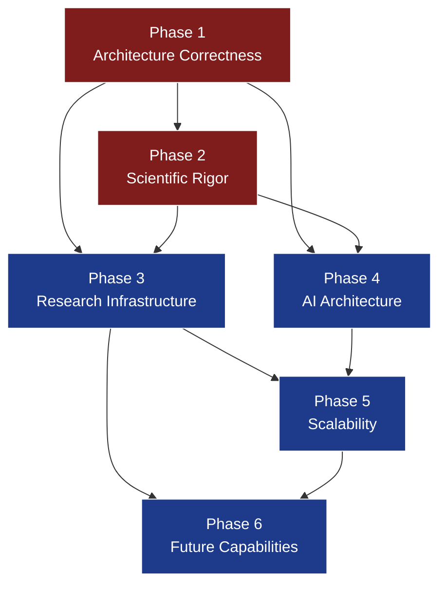
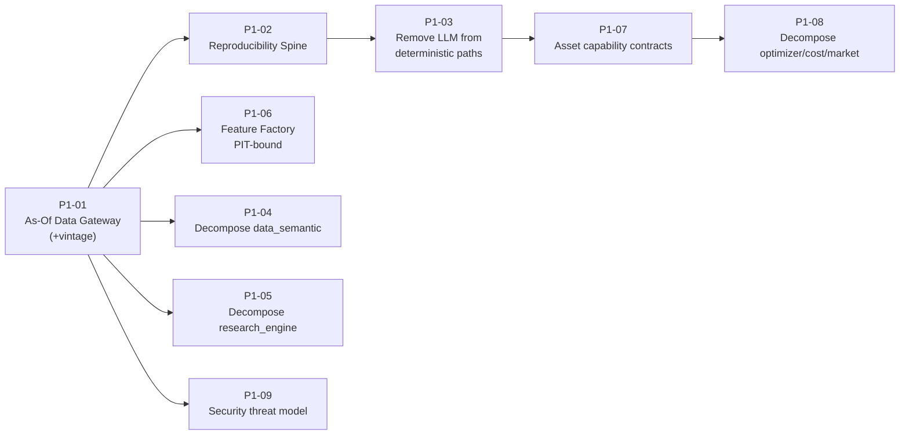

# Architecture Patch Plan — AI Hedge Fund Research OS (V1 → V2)

> **Status:** PLANNING ONLY. No implementation. `architecture.md` must not be modified until patches are executed in V2.
> **Source of truth:** this document governs the Architecture V2 migration. Every V2 change must trace to a Patch ID below.
> **Inputs consumed:** `docs/architecture/hedgefund-research-os-architecture.md` (the V1 architecture) and `docs/architecture/architecture_review.md` (the independent audit).
> **Method:** every _justified_ review finding was extracted, de-duplicated, conflict-resolved, and converted into an atomic patch. Weak/politeness-driven proposals were dropped (see §"Rejected Proposals"). Each patch is independently reviewable and independently implementable.

---

## 0. How to Read This Document

- **Atomicity rule:** one patch = one architectural improvement. No patch bundles unrelated changes.
- **Traceability:** each patch cites the review finding IDs it resolves (e.g., `C1`, `M3`, `Missing #6`).
- **Priority:** `CRITICAL` (blocks capital, real or paper) › `HIGH` › `MEDIUM` › `LOW`.
- **Complexity:** T-shirt size + rough engineering-months (1 EM = 1 senior engineer-month). `S`≈1, `M`≈2–3, `L`≈4–6, `XL`≈7–12.
- **Phases** are execution waves, not teams. A later-phase patch may not begin until its declared cross-phase dependencies land.

### Phase model

| Phase | Theme                    | Intent                                                                                                       |
| ----- | ------------------------ | ------------------------------------------------------------------------------------------------------------ |
| **1** | Architecture correctness | Make the foundations _actually_ enforce what V1 only asserted. Nothing else is trustworthy until this lands. |
| **2** | Scientific rigor         | Make research statistically honest and reproducible — enforced, not aspirational.                            |
| **3** | Research infrastructure  | Build the registries, factories, ontologies, and lifecycle systems that let alpha be discovered and retired. |
| **4** | AI architecture          | Put LLMs only where they belong; make agents governed, evaluated, and safe.                                  |
| **5** | Scalability              | Survive 10 years and billions in artifacts, spend, and throughput.                                           |
| **6** | Future capabilities      | Meta-research, governed self-improvement, resilience.                                                        |

---

## 1. Migration Order (Mermaid)

### 1.1 Phase-level dependency graph



### 1.2 Phase 1 critical-path ordering (the gate everything waits on)



### 1.3 Cross-phase critical spine (the "do-not-skip" chain to first capital)

```mermaid
graph LR
    G1["P1-01 As-Of Gateway"] --> S1["P2-01 Trial Ledger"]
    S1 --> S2["P2-02 Multiple-Testing Enforcer"]
    G1 --> S3["P2-03 Leakage Harness"]
    S2 --> S4["P2-05 Holdout/Embargo Mgr"]
    S4 --> S5["P2-06 Purged CV"]
    S2 --> S6["P2-07 Generator↔Validator Isolation"]
    S5 --> S7["P2-08 Replication Engine"]
    S6 --> S8["P2-09 Pre-Capital Scientific Governance"]
    S7 --> S8
    S8 --> CAP(["FIRST CAPITAL GATE"])
    class CAP fill:#065f46,stroke:#fff,color:#fff;
```

---

## 2. Patch Index

| ID    | Title                                                  | Priority | Phase | Complexity | Resolves             |
| ----- | ------------------------------------------------------ | -------- | ----- | ---------- | -------------------- |
| P1-01 | As-Of Data Gateway + Vintage/Restatement Model         | CRITICAL | 1     | XL         | C1                   |
| P1-02 | Deterministic Reproducibility Spine                    | CRITICAL | 1     | L          | C4                   |
| P1-03 | Remove LLMs from Deterministic Critical Paths          | CRITICAL | 1     | L          | C3, AI               |
| P1-04 | Decompose `data_semantic` God-Layer                    | HIGH     | 1     | L          | M1                   |
| P1-05 | Decompose `research_engine` God-Layer                  | HIGH     | 1     | M          | M1                   |
| P1-06 | Feature Factory (PIT-bound feature computation)        | CRITICAL | 1     | L          | C1, Special          |
| P1-07 | Asset Capability Contracts (split universal adapter)   | HIGH     | 1     | L          | M2                   |
| P1-08 | Decompose `optimizer`/`cost_model`/`market_model`      | MEDIUM   | 1     | M          | M2                   |
| P1-09 | Security Threat Model & Alpha-Exfil Controls           | HIGH     | 1     | L          | M6                   |
| P1-10 | Feedback-Loop Coupling Governance                      | HIGH     | 1     | M          | M3                   |
| P2-01 | Immutable Trial Ledger                                 | CRITICAL | 2     | L          | C2, Special          |
| P2-02 | Multiple-Testing Control / Statistical Budget Enforcer | CRITICAL | 2     | M          | C2, Special          |
| P2-03 | Leakage Test Harness                                   | CRITICAL | 2     | M          | C1, Missing #2       |
| P2-04 | Net-Alpha-From-Discovery Enforcement                   | HIGH     | 2     | M          | Quant                |
| P2-05 | Holdout & Embargo Manager (one-shot OOS protocol)      | CRITICAL | 2     | L          | C6, Special          |
| P2-06 | Purged / Combinatorial Cross-Validation Framework      | HIGH     | 2     | M          | Missing #14, Special |
| P2-07 | Generator↔Validator Adversarial Isolation Barrier     | CRITICAL | 2     | M          | Quant, AI            |
| P2-08 | Independent Replication Engine                         | CRITICAL | 2     | L          | Missing #4, Special  |
| P2-09 | Pre-Capital Scientific Governance Gate                 | HIGH     | 2     | M          | C5                   |
| P3-01 | Idea Registry                                          | HIGH     | 3     | M          | Special              |
| P3-02 | Hypothesis Registry Hardening                          | HIGH     | 3     | M          | Special              |
| P3-03 | Experiment Registry                                    | HIGH     | 3     | M          | Special              |
| P3-04 | Research Journal & Timeline                            | MEDIUM   | 3     | M          | Special              |
| P3-05 | Rejected/Failed Research Database                      | HIGH     | 3     | M          | Missing #9, Special  |
| P3-06 | Factor Ontology                                        | MEDIUM   | 3     | M          | Special              |
| P3-07 | Feature Marketplace                                    | MEDIUM   | 3     | M          | Special              |
| P3-08 | Alpha Factory                                          | HIGH     | 3     | L          | Special              |
| P3-09 | Factor Lifecycle & Retirement Service                  | HIGH     | 3     | M          | Missing #6, Special  |
| P3-10 | Regime Lab (cross-cutting regime service)              | HIGH     | 3     | L          | New #7, Special      |
| P3-11 | Crowding & Capacity Intelligence                       | HIGH     | 3     | L          | M4, New #8           |
| P3-12 | Explainability / Economic-Rationale Lab                | MEDIUM   | 3     | M          | New #15, Special     |
| P3-13 | Research Scorecards                                    | MEDIUM   | 3     | S          | Special              |
| P3-14 | Knowledge Graph Formalization                          | MEDIUM   | 3     | M          | Special              |
| P3-15 | Research-to-Production Parity Harness                  | HIGH     | 3     | M          | Missing #15          |
| P3-16 | Backtest Realism: Borrow / Fills / Capacity            | HIGH     | 3     | L          | M4                   |
| P4-01 | Model Registry + Golden-Set Eval Gate                  | HIGH     | 4     | M          | New #10, Special     |
| P4-02 | Agent Registry Hardening                               | MEDIUM   | 4     | M          | Special              |
| P4-03 | Trust & Quarantine Layer for Ingested Text             | HIGH     | 4     | M          | C3, New #11          |
| P4-04 | Agent Role Rationalization (SRP + decision authority)  | HIGH     | 4     | M          | AI, M1               |
| P4-05 | Blackboard Aggregation & Arbiter Protocol              | MEDIUM   | 4     | M          | AI                   |
| P4-06 | Memory Redesign: Confidence, Contradiction, Scoping    | HIGH     | 4     | L          | M3, AI               |
| P4-07 | Research Prioritization as Transparent Optimization    | MEDIUM   | 4     | M          | AI                   |
| P5-01 | Artifact Lifecycle, Tiering & GC                       | MEDIUM   | 5     | M          | M5                   |
| P5-02 | Contract Decomposition into Bounded Contexts           | MEDIUM   | 5     | XL         | M3                   |
| P5-03 | Temporal Store / As-Of Query Performance               | MEDIUM   | 5     | L          | Scale                |
| P5-04 | Message Bus Partitioning & Domain Topics               | MEDIUM   | 5     | M          | Scale                |
| P5-05 | Human-in-the-Loop Tiered Autonomy                      | HIGH     | 5     | M          | M7                   |
| P5-06 | Research Cost Governance & ROI Accounting              | MEDIUM   | 5     | M          | M5                   |
| P6-01 | Meta-Research Engine                                   | MEDIUM   | 6     | L          | Special              |
| P6-02 | Governed Self-Improvement Loop                         | MEDIUM   | 6     | M          | Special              |
| P6-03 | Disaster Recovery & Business Continuity                | HIGH\*   | 6     | L          | Missing #13          |

> `*` P6-03 is `MEDIUM` while pre-live but becomes `CRITICAL` before any live-capital go-live; it is scheduled in Phase 6 but its priority escalates at the live gate.

**Special-review coverage:** every one of the 23 named systems maps to a patch — Idea Registry→P3-01, Hypothesis Registry→P3-02, Experiment Registry→P3-03, Research Journal→P3-04, Research Timeline→P3-04, Immutable Trial Ledger→P2-01, Alpha Factory→P3-08, Feature Factory→P1-06, Feature Marketplace→P3-07, Factor Ontology→P3-06, Knowledge Graph→P3-14, Explainability Lab→P3-12, Model Registry→P4-01, Agent Registry→P4-02, Regime Lab→P3-10, Replication Engine→P2-08, Holdout Manager→P2-05, Purged CV→P2-06, Multiple Testing Control→P2-02, Factor Retirement→P3-09, Meta Research→P6-01, Self Improvement→P6-02, Research Scorecards→P3-13.

---

# PHASE 1 — ARCHITECTURE CORRECTNESS

---

### P1-01 — As-Of Data Gateway + Vintage/Restatement Model

- **Priority:** CRITICAL
- **Resolves:** C1 (PIT is a slogan, not a mechanism)

**Problem Statement.** V1 asserts point-in-time correctness ~8× but specifies no primitive that enforces it. Any consumer can issue a non-as-of read and reintroduce lookahead; restated fundamentals, time-varying sector/index/symbology mappings, and feature recomputation are all unguarded leakage vectors.

**Root Cause.** PIT correctness was treated as a _property to be respected by discipline_ rather than a _chokepoint enforced by the data layer_. `bitemporal_writer` stamps `knowledge_time` but nothing forces reads to filter on it.

**Why current architecture is insufficient.** `data_semantic/pit_engine` is described as an "as-of query engine" but coexists with direct feature-store and entity-graph access paths, so the guarantee is bypassable. There is no vintage model for restatements and no enforcement that reference data (sectors, index membership, symbology) is queried as-of.

**Business Impact.** A single undetected lookahead bug can validate a fake strategy that loses capital in production — the canonical way institutional research destroys money.
**Research Impact.** Every downstream result is untrustworthy until reads are provably as-of; invalidates historical work if discovered late.
**Statistical Impact.** Eliminates look-ahead and survivorship-by-reference-data biases at the source.
**Risk if ignored.** Systemic, silent corruption of all research; a career-ending, fund-ending failure mode.

**Proposed Solution.**

- _Architectural Changes:_ Introduce a mandatory **As-Of Data Gateway** — the ONLY read path to any historical data. Every query requires an `as_of` timestamp; the gateway physically cannot return records with `knowledge_time > as_of`. Add a **vintage store** modeling `(event_time, knowledge_time, value)` for all restatable data, and extend as-of semantics to reference data (sector, index membership, symbology, universe).
- _Affected Components:_ `data_semantic/*`, `data_ingestion/bitemporal_writer`, all research/factor/backtest consumers.
- _New Components:_ `data_semantic/asof_gateway`, `data_semantic/vintage_store`, `data_semantic/reference_asof`.
- _Modified Components:_ `pit_engine` becomes the gateway's engine; `feature_store`, `entity_graph`, `universe`, `symbology` lose direct-read APIs.
- _Deprecated Components:_ all direct (non-as-of) data-read interfaces.

**Migration Strategy.** (1) Build gateway alongside existing reads. (2) Instrument and log every legacy direct read. (3) Route consumers through gateway one bounded context at a time. (4) Flip direct reads to hard-fail. (5) Backfill vintage store from `raw_vault`.
**Dependencies.** None (foundational). Blocks: P1-06, P2-01, P2-03, P2-05, everything statistical.
**Backward Compatibility.** Breaking by design. Legacy artifacts must be re-derivable through the gateway; a compatibility shim runs during migration then is removed.
**Complexity Estimate.** XL (8–11 EM).
**Risks.** Performance regression on as-of joins (mitigated by P5-03); migration surface is the entire read layer.
**Acceptance Criteria.** No code path can read data without an `as_of`; a red-team query attempting a future read fails closed; restated series return the correct historical vintage for any `as_of`; P2-03 leakage harness passes on a canonical fixture set.
**Future Extensions.** Tick-granularity vintages; multi-vendor vintage reconciliation.

---

### P1-02 — Deterministic Reproducibility Spine

- **Priority:** CRITICAL
- **Resolves:** C4

**Problem Statement.** V1 defines reproducibility as `(code + data snapshot + config)` but this is insufficient (no environment/seed/hardware capture) and is contradicted by LLM agents whose outputs are non-deterministic.

**Root Cause.** Reproducibility was declared as an invariant without a mechanism that captures the full determinism surface.

**Why current architecture is insufficient.** Numerical results depend on library/BLAS versions, RNG seeds, and hardware; LLM lineage makes any artifact non-reproducible under the stated definition. No hermetic build or seed capture exists.

**Business/Research/Statistical Impact.** Without exact reproduction, no result can be audited, re-validated after a data fix, or defended to an investment committee/regulator. Reproducibility is the precondition for statistical auditing.
**Risk if ignored.** Undebuggable P&L divergence; inability to prove any historical claim.

**Proposed Solution.**

- _Architectural Changes:_ Define a **Run Manifest** artifact capturing `{code hash, dependency lockfile hash, container image digest, RNG seeds, hardware class, as_of dataset refs, config hash, and — for any LLM step — model id+version+params+prompt hash+output hash}`. Mandate hermetic, seed-pinned execution for all numerical work. Classify every artifact as `deterministic` or `stochastic(LLM)`; stochastic artifacts are reproducible only to their recorded output, never re-derived numerically.
- _New Components:_ `platform/run_manifest`, `platform/hermetic_runner`.
- _Modified Components:_ `orchestration/run_ledger`, `backtesting/backtest_registry`, all agent runners.
- _Deprecated Components:_ the informal 3-tuple reproducibility claim.

**Migration Strategy.** Wrap all compute jobs in the hermetic runner; backfill manifests for active artifacts; mark legacy artifacts `unverified`.
**Dependencies.** Pairs with P1-03 (LLM classification). Enables P2-08 (replication).
**Backward Compatibility.** Additive metadata; legacy artifacts flagged, not deleted.
**Complexity Estimate.** L (4–6 EM).
**Risks.** GPU non-determinism may force CPU-deterministic modes for validation-critical steps (accepted trade-off).
**Acceptance Criteria.** Any deterministic artifact re-runs bit-identically from its manifest on a clean host; every stochastic artifact carries model+prompt+output hashes.
**Future Extensions.** Content-addressed cache keyed on manifest for compute reuse.

---

### P1-03 — Remove LLMs from Deterministic Critical Paths

- **Priority:** CRITICAL
- **Resolves:** C3, AI-review (agents that should not decide)

**Problem Statement.** V1 routes LLM agents into statistical/portfolio/risk _decision_ paths (`overfitting_auditor`, `robustness_examiner`, `risk_supervisor`, `risk_analyst`, `allocation_strategist`). These must be deterministic, testable, and auditable.

**Root Cause.** "LLM agent" was adopted as the default unit of work instead of the exception.

**Why current architecture is insufficient.** Non-deterministic judgment in validation/risk paths destroys reproducibility, injects prompt-injection risk into control functions, and cannot be formally verified.

**Business/Research/Statistical Impact.** An LLM must never decide a risk halt, a PBO verdict, or an allocation. Removing it restores determinism and auditability to the fund's control surface.
**Risk if ignored.** Silent, unreproducible, gameable decisions in the exact places that must be provably correct.

**Proposed Solution.**

- _Architectural Changes:_ Establish the rule **"LLMs propose and narrate; deterministic engines decide."** Convert each affected agent into a deterministic computation engine (validation stats, risk checks, optimization) plus an optional _narrator_ LLM that only explains the deterministic output. LLMs remain first-class only at fuzzy edges (literature mining, hypothesis drafting, human-readable reporting, priority _proposals_).
- _Affected Components:_ `agents/validation_agents/*`, `agents/portfolio_agents/*`, `agents/governance_agents/risk_supervisor`.
- _New Components:_ deterministic engines under `validation/`, `portfolio/`, `governance/` (relocating the _decision_).
- _Modified Components:_ the listed agents become narrators.
- _Deprecated Components:_ LLM decision authority in validation/risk/allocation.

**Migration Strategy.** For each agent: extract the decision into a deterministic engine, add golden tests, demote the agent to narration, then cut the decision edge.
**Dependencies.** P1-02. Feeds P2-02, P2-06, P4-04.
**Backward Compatibility.** Behavioral change; outputs become deterministic. Narratives preserved for humans.
**Complexity Estimate.** L (4–6 EM).
**Risks.** Some "judgment" was doing useful fuzzy work; must be re-expressed as explicit rules/metrics (a feature, not a loss).
**Acceptance Criteria.** No validation/risk/allocation decision depends on an LLM output; all such decisions have golden-set unit tests; narrators cannot alter decisions.
**Future Extensions.** Formal verification of risk-limit engines.

---

### P1-04 — Decompose `data_semantic` God-Layer

- **Priority:** HIGH
- **Resolves:** M1

**Problem Statement.** `data_semantic/` owns feature store, PIT engine, universe, calendars, entity graph, lineage, and catalog — ≥5 services with different scaling profiles and owners fused into one layer.

**Root Cause.** Layer-as-folder framing hid that these are independent bounded contexts.

**Why current architecture is insufficient.** Coupled deploy/scaling/ownership; the entity graph alone is a product; changes ripple across unrelated concerns.

**Business/Research/Statistical Impact.** Enables independent scaling and ownership; reduces blast radius of changes; prerequisite for P5-03.
**Risk if ignored.** A monolith that becomes the primary bottleneck and change-contention point.

**Proposed Solution.**

- _Architectural Changes:_ Split into bounded contexts: **As-Of/Vintage service** (P1-01), **Feature Store**, **Universe & Reference-Data service**, **Calendar service**, **Entity Graph service**, **Lineage service**, **Data Catalog**. Each with its own contract and lifecycle.
- _New Components:_ the above as independent services.
- _Modified Components:_ `data_semantic` becomes a namespace, not a shared codebase.
- _Deprecated Components:_ the monolithic layer boundary.

**Migration Strategy.** Extract lowest-coupling services first (calendar, catalog), then entity graph, then feature store; keep interfaces stable via contracts.
**Dependencies.** P1-01. Coordinated with P5-02.
**Backward Compatibility.** Interface-preserving; internal restructuring.
**Complexity Estimate.** L (4–6 EM).
**Risks.** Over-fragmentation; mitigate by keeping shared as-of semantics centralized in P1-01.
**Acceptance Criteria.** Each service deploys and scales independently; no cross-service direct DB access.
**Future Extensions.** Entity graph as a standalone research product.

---

### P1-05 — Decompose `research_engine` God-Layer

- **Priority:** HIGH
- **Resolves:** M1

**Problem Statement.** `research_engine/` fuses idea intake, literature, experiment design, the multiple-testing ledger, the research DAG, and the decision log. The trial ledger is a compliance-grade control that must not share a codebase with brainstorming.

**Root Cause.** Everything "research" was co-located regardless of criticality or lifecycle.

**Why current architecture is insufficient.** A compliance-grade, append-only statistical control (trial ledger) co-located with mutable intake invites accidental or deliberate tampering and coupling.

**Business/Research/Statistical Impact.** Isolating the trial ledger and registries is prerequisite to Phase 2/3 rigor.
**Risk if ignored.** The single most important statistical control is fragile and bypassable.

**Proposed Solution.**

- _Architectural Changes:_ Split into: **Idea Registry** (→P3-01), **Hypothesis Registry** (→P3-02), **Experiment Registry** (→P3-03), **Trial Ledger** (→P2-01, isolated + append-only), **Research Graph/Journal** (→P3-04), **Decision/Rejected-Research store** (→P3-05), **Literature service**.
- _New Components:_ the registries (built in later phases; this patch defines the seams).
- _Modified Components:_ `research_engine` becomes a namespace over independent services.
- _Deprecated Components:_ the monolithic research layer.

**Migration Strategy.** This patch establishes module boundaries and interfaces only; the concrete registries are delivered in Phases 2–3.
**Dependencies.** Enables all P2/P3 registry patches.
**Backward Compatibility.** Structural; interfaces defined here are honored by later patches.
**Complexity Estimate.** M (2–3 EM).
**Risks.** Premature boundaries; mitigate by validating seams against P2/P3 designs before freezing.
**Acceptance Criteria.** Trial ledger lives in an isolated, independently permissioned module; registries have distinct contracts.
**Future Extensions.** Per-registry access policies.

---

### P1-06 — Feature Factory (PIT-Bound Feature Computation)

- **Priority:** CRITICAL
- **Resolves:** C1 (recomputation leakage), Special: Feature Factory

**Problem Statement.** V1's `feature_store` is "versioned" but feature _recomputation_ is the classic leakage vector: recomputing a feature today over history can bake in future-aware logic (e.g., full-sample normalization). No mechanism binds feature computation to per-point `knowledge_time`.

**Root Cause.** Features were treated as stored values, not as _computations with a temporal contract_.

**Why current architecture is insufficient.** Storing feature versions doesn't prevent a computation from reading beyond a point's as-of horizon during (re)materialization.

**Business/Research/Statistical Impact.** Guarantees every feature value is a pure function of data available at its `knowledge_time` — closing the largest silent leakage channel.
**Risk if ignored.** Leaky features that pass validation and fail live.

**Proposed Solution.**

- _Architectural Changes:_ Introduce a **Feature Factory**: feature definitions are declarative transforms executed _only_ through the As-Of Gateway (P1-01), where every input read is bounded by the point's `as_of`. Ban global/full-sample statistics unless explicitly expanding-window. Every materialized feature carries the manifest (P1-02) and lineage. Feature definitions are versioned and immutable.
- _New Components:_ `feature_engineering/feature_factory`, feature-definition DSL/spec.
- _Modified Components:_ `data_semantic/feature_store` becomes storage for factory outputs only.
- _Deprecated Components:_ ad-hoc feature computation with direct data access.

**Migration Strategy.** Re-express existing features as factory definitions; run both, diff, cut over; leakage-scan (P2-03) each on migration.
**Dependencies.** P1-01, P1-02. Enables P3-07 (marketplace), P4/portfolio.
**Backward Compatibility.** Breaking for feature authorship; existing values re-materialized.
**Complexity Estimate.** L (4–6 EM).
**Risks.** Some legacy features may be revealed as leaky (desired outcome).
**Acceptance Criteria.** No feature can read beyond its `as_of`; every feature has a definition version + manifest; leakage harness passes.
**Future Extensions.** Streaming feature materialization; feature backfill scheduler.

---

### P1-07 — Asset Capability Contracts (split the universal adapter)

- **Priority:** HIGH
- **Resolves:** M2

**Problem Statement.** One `asset_adapters/contract` cannot span equities, options, futures, crypto, macro, and alt-data. It forces a lowest-common-denominator interface that leaks asset specifics into the core, and wrongly places non-tradable feeds (macro, alt-data) behind a trading adapter.

**Root Cause.** Over-generalization: a single interface for fundamentally different instruments.

**Why current architecture is insufficient.** Options need vol-surface/greeks/expiry/margin; futures need roll/continuous-contract logic; crypto needs on-chain/24-7/exchange-idiosyncratic fees & custody; macro/alt-data are not tradable at all.

**Business/Research/Statistical Impact.** Correct per-asset semantics are prerequisite for backtest realism (P3-16) and multi-asset expansion.
**Risk if ignored.** An `if asset_type == ...` swamp; corrupted backtests; blocked expansion.

**Proposed Solution.**

- _Architectural Changes:_ Replace the monolithic contract with **à-la-carte capability contracts**: `MarketData`, `Tradability`, `CostModel`, `CorporateActions`, `RiskModel`, `Settlement/Custody`, `Derivatives(vol-surface/greeks/expiry)`, `Roll(futures)`. An asset class implements only the capabilities it has. **Non-tradable feeds (macro, alt-data) are removed from the adapter hierarchy** and modeled as pure data sources feeding the Feature Factory.
- _New Components:_ capability-contract interfaces; per-asset capability implementations.
- _Modified Components:_ `asset_adapters/*`.
- _Deprecated Components:_ the universal `contract`; macro/alt-data as "adapters."

**Migration Strategy.** Define capability interfaces; refactor US-equities adapter first as reference; migrate others; delete the universal contract.
**Dependencies.** P1-03 (deterministic engines consume these). Enables P3-16.
**Backward Compatibility.** Breaking for adapter authors; core consumers depend on capabilities they need.
**Complexity Estimate.** L (4–6 EM).
**Risks.** Capability sprawl; mitigate with a small, curated capability catalog.
**Acceptance Criteria.** No core module branches on `asset_type`; options/futures/crypto specifics live only in their capability implementations; macro/alt-data no longer implement trading contracts.
**Future Extensions.** New asset class = new capability implementations, zero core change.

---

### P1-08 — Decompose `optimizer` / `cost_model` / `market_model`

- **Priority:** MEDIUM
- **Resolves:** M2

**Problem Statement.** Monolithic `optimizer`, `cost_model`, and `market_model` hide incompatible sub-models (mean-variance vs risk-parity vs robust/Bayesian; impact in illiquid small-caps vs options vs crypto perps).

**Root Cause.** Genericity where the domains are fundamentally different.

**Why current architecture is insufficient.** Leads to conditional swamps and corrupts backtest realism by averaging incompatible microstructures.

**Business/Research/Statistical Impact.** Correct, per-context models improve portfolio quality and backtest fidelity.
**Risk if ignored.** Unmaintainable modules within ~3 years; unrealistic cost/impact assumptions.

**Proposed Solution.**

- _Architectural Changes:_ Define narrow strategy interfaces (`Optimizer`, `CostModel`, `MarketImpactModel`) with per-family/per-asset implementations selected by capability (P1-07) and regime (P3-10). No shared "one model to rule them all."
- _New Components:_ implementation families behind the interfaces.
- _Modified Components:_ `portfolio/optimizer`, `backtesting/cost_model`, `backtesting/market_model`.
- _Deprecated Components:_ the monolithic implementations.

**Migration Strategy.** Extract current behavior as the first implementation; add alternatives incrementally.
**Dependencies.** P1-07; coordinates with P3-10, P3-16.
**Backward Compatibility.** Interface-preserving.
**Complexity Estimate.** M (2–3 EM).
**Risks.** Interface churn; stabilize via P5-02.
**Acceptance Criteria.** Each asset/regime uses an appropriate, independently tested model; no cross-asset averaging of impact.
**Future Extensions.** Pluggable third-party optimizers.

---

### P1-09 — Security Threat Model & Alpha-Exfil Controls

- **Priority:** HIGH
- **Resolves:** M6

**Problem Statement.** V1's security is a single sentence. For a system holding alpha (the crown jewels) and eventually trading real money, there is no threat model, no factor-definition access control, no secrets rotation/KMS, no supply-chain security, no tamper-evident audit mechanism.

**Root Cause.** Security treated as a folder, not a designed discipline.

**Why current architecture is insufficient.** Insider exfiltration of factor definitions = the entire firm value leaving; no exfil detection, watermarking, or least-privilege on the most sensitive artifacts.

**Business Impact.** Existential — stolen alpha destroys the firm's edge.
**Research/Statistical Impact.** Indirect but severe (poisoning/tampering corrupts research).
**Risk if ignored.** Catastrophic IP loss; unauditable decisions.

**Proposed Solution.**

- _Architectural Changes:_ Produce a formal **threat model** (insider exfil, prompt injection, data poisoning, supply chain, credential theft). Add least-privilege + need-to-know on factor/alpha artifacts, watermarking and access-anomaly detection, KMS-backed secret rotation and broker-credential isolation, dependency/supply-chain scanning, and **hash-chained, externally-anchored tamper-evident audit trail** (replacing the asserted-but-unspecified "tamper-evident").
- _New Components:_ `platform/security/threat_model`, `platform/security/exfil_detection`, hash-chained audit in `governance/audit_trail`.
- _Modified Components:_ `platform/secrets`, `platform/identity`, `governance/audit_trail`.

**Migration Strategy.** Threat model first; then controls prioritized by asset sensitivity (alpha defs → credentials → everything else).
**Dependencies.** Cross-cuts all phases; enables P4-03.
**Backward Compatibility.** Additive controls; may restrict some access (intended).
**Complexity Estimate.** L (4–6 EM).
**Risks.** Friction for researchers; mitigate with tiered access, not blanket lockdown.
**Acceptance Criteria.** Documented threat model; factor definitions under need-to-know with access logging; audit trail is hash-chained and independently verifiable; secrets rotate automatically.
**Future Extensions.** Hardware-backed keys; formal insider-risk analytics.

---

### P1-10 — Feedback-Loop Coupling Governance

- **Priority:** HIGH
- **Resolves:** M3

**Problem Statement.** V1 claims unidirectional flow but has unmanaged feedback loops: live TCA → backtest cost models (L8→L6), evaluation → memory → research prioritization. A miscalibrated cost model from live TCA can silently degrade all future backtests with no damping, versioning, or rollback.

**Root Cause.** Feedback loops exist but are undeclared, so no one owns their stability.

**Why current architecture is insufficient.** Uncontrolled feedback = drift and hidden instability; calibration changes are not versioned or reversible.

**Business/Research/Statistical Impact.** Prevents silent, compounding corruption of the backtest baseline and research direction.
**Risk if ignored.** Slow, invisible degradation of every future result.

**Proposed Solution.**

- _Architectural Changes:_ Explicitly register every feedback loop. Any calibration derived from downstream data (e.g., cost-model updates from TCA) is a **versioned, reviewable artifact** with staged rollout, A/B against the prior version, and one-click rollback. Memory→prioritization influence is gated by confidence weighting (P4-06).
- _New Components:_ `platform/calibration_registry`.
- _Modified Components:_ `backtesting/cost_model` (versioned calibrations), `evaluation/*`, `orchestration` (prioritization inputs).

**Migration Strategy.** Inventory loops; wrap each calibration in the registry; add rollback.
**Dependencies.** Relates to P4-06, P3-16.
**Backward Compatibility.** Additive.
**Complexity Estimate.** M (2–3 EM).
**Risks.** Governance overhead; keep it lightweight for low-impact loops.
**Acceptance Criteria.** No downstream-derived calibration reaches production un-versioned; every loop has an owner and rollback path.
**Future Extensions.** Automated loop-stability monitoring.

---

# PHASE 2 — SCIENTIFIC RIGOR

---

### P2-01 — Immutable Trial Ledger

- **Priority:** CRITICAL
- **Resolves:** C2, Special: Immutable Trial Ledger

**Problem Statement.** V1's multiple-testing "count" is a decorative counter, trivially reset/forked/ignored, and does not capture discarded trials — making all deflation math meaningless under an automated generator producing thousands of candidates.

**Root Cause.** Statistical-integrity accounting was modeled as a mutable number, not an immutable, comprehensive record.

**Why current architecture is insufficient.** A counter constrains nothing; without recording _every_ trial (including silently discarded ones) and their correlation structure, deflated metrics are wrong.

**Business/Research/Statistical Impact.** The foundation of honest multiple-testing control and deflated performance. Without it, discoveries are indistinguishable from noise.
**Risk if ignored.** Institutionalized p-hacking at machine scale.

**Proposed Solution.**

- _Architectural Changes:_ Build an **append-only, tamper-evident Trial Ledger** recording every trial — generated, discarded, or run — with its hypothesis linkage, feature set, as-of dataset, manifest (P1-02), and a **correlation-cluster id** (to model independent vs correlated trials). No delete, no reset; forks are detectable and disallowed. Automated generators MUST register every candidate before evaluation.
- _New Components:_ `research/trial_ledger` (isolated per P1-05).
- _Modified Components:_ all evaluation entry points must write to the ledger before running.
- _Deprecated Components:_ `research_engine/multiple_testing` counter.

**Migration Strategy.** Stand up ledger; make ledger-write a precondition for any backtest/validation run (enforced at the gateway); backfill known trials.
**Dependencies.** P1-01, P1-02, P1-05. Feeds P2-02.
**Backward Compatibility.** Breaking: evaluation requires ledger registration.
**Complexity Estimate.** L (4–6 EM).
**Risks.** Generators may try to evade registration; enforce at the only path that can run a trial.
**Acceptance Criteria.** No trial can execute without a ledger entry; ledger is append-only and hash-chained; correlation clusters are recorded.
**Future Extensions.** Cross-team/global ledger federation.

---

### P2-02 — Multiple-Testing Control / Statistical Budget Enforcer

- **Priority:** CRITICAL
- **Resolves:** C2, Special: Multiple Testing Control

**Problem Statement.** There is no enforced statistical budget; nothing refuses to promote a factor when the multiple-testing budget is exhausted, and deflation ignores trial correlation.

**Root Cause.** Multiple-testing "control" was recording, not enforcement.

**Why current architecture is insufficient.** Without a hard gate, deflation is advisory and ignored under pressure.

**Business/Research/Statistical Impact.** Turns multiple-testing control into an enforced promotion gate; produces correlation-aware deflated Sharpe / FDR.
**Risk if ignored.** False discoveries flow to capital.

**Proposed Solution.**

- _Architectural Changes:_ A **Budget Enforcer** consuming the Trial Ledger: allocates a family-wise error / FDR budget per research family, computes **correlation-aware effective number of trials**, and produces deflated metrics. The validation gate **refuses promotion** when significance does not survive the budget. Deterministic (per P1-03).
- _New Components:_ `validation/budget_enforcer`, `validation/deflation` (upgraded, correlation-aware).
- _Modified Components:_ `validation/validation_gauntlet` gate logic.

**Migration Strategy.** Implement enforcer; wire as a hard gate; calibrate budgets with research leadership.
**Dependencies.** P2-01, P1-03. Gates P2-09.
**Backward Compatibility.** Breaking: some previously "passing" factors now fail.
**Complexity Estimate.** M (2–3 EM).
**Risks.** Budget politics; mitigate with transparent, versioned budget policy.
**Acceptance Criteria.** Promotion is impossible when deflated significance fails; effective-trials accounts for correlation; verdicts cite budget consumption.
**Future Extensions.** Adaptive budgets by information content (ties to P4-07).

---

### P2-03 — Leakage Test Harness

- **Priority:** CRITICAL
- **Resolves:** C1, Missing #2

**Problem Statement.** No adversarial process detects future-information contamination in features/pipelines; Layer 5 attacks factors but never the data pipeline itself.

**Root Cause.** Leakage prevention relied on the (unenforced) PIT claim with no verification.

**Why current architecture is insufficient.** As-of enforcement (P1-01) reduces leakage but cannot catch logic errors; you need active detection.

**Business/Research/Statistical Impact.** Independent verification that features/factors carry no lookahead; blocks promotion on failure.
**Risk if ignored.** Subtle leaks pass validation and blow up live.

**Proposed Solution.**

- _Architectural Changes:_ A **Leakage Harness** running: predict-the-`as_of`-timestamp test (if a model can infer the timestamp from features, you're leaking), target-leakage scans, train/test contamination checks, and shuffle/null baselines. Runs automatically on every feature (P1-06) and factor; blocks promotion on failure. Deterministic.
- _New Components:_ `validation/leakage_harness`.
- _Modified Components:_ `factor_engineering`, `feature_factory` promotion gates.

**Migration Strategy.** Build harness with a fixture set of known-leaky and known-clean features; wire into promotion; scan the existing library.
**Dependencies.** P1-01, P1-06.
**Backward Compatibility.** Breaking: leaky legacy features fail.
**Complexity Estimate.** M (2–3 EM).
**Risks.** False positives; tune thresholds against fixtures.
**Acceptance Criteria.** Known-leaky fixtures are caught; no feature/factor promotes without passing.
**Future Extensions.** Continuous re-scan on data restatements.

---

### P2-04 — Net-Alpha-From-Discovery Enforcement

- **Priority:** HIGH
- **Resolves:** Quant-review (gross-alpha illusion)

**Problem Statement.** V1 discovers alpha gross, then applies costs later — manufacturing factors that die after costs and were never alpha.

**Root Cause.** Pipeline ordering (discover → validate → cost in backtest) defers economics past the point of selection.

**Why current architecture is insufficient.** Selecting on gross performance biases toward high-turnover, cost-fragile signals.

**Business/Research/Statistical Impact.** Selection occurs on net-of-cost expected value from the first screen; eliminates a whole class of illusory factors.
**Risk if ignored.** Wasted research and capital on signals that cannot survive costs.

**Proposed Solution.**

- _Architectural Changes:_ Inject a first-pass **cost/impact/borrow model** (per capability, P1-07) at the _discovery/screening_ stage so all ranking and selection use net expected value. Full realism still applies in backtest (P3-16), but nothing selects on gross-only.
- _New Components:_ `factor_engineering/net_alpha_screen`.
- _Modified Components:_ `factor_analytics`, `alpha_combination` ranking.

**Migration Strategy.** Add net screen; re-rank library; retire gross-only survivors that fail net.
**Dependencies.** P1-07, P1-08.
**Backward Compatibility.** Behavioral; changes rankings.
**Complexity Estimate.** M (2–3 EM).
**Risks.** Early cost model is approximate; acceptable as a screen, refined in backtest.
**Acceptance Criteria.** No factor is selected/ranked on gross-only performance; screen uses net expected value.
**Future Extensions.** Capacity-aware net screening (ties to P3-11).

---

### P2-05 — Holdout & Embargo Manager (one-shot OOS protocol)

- **Priority:** CRITICAL
- **Resolves:** C6, Special: Holdout Manager

**Problem Statement.** V1's single OOS vault is treated as reusable and guarded only by RBAC, which does nothing against iterative leakage ("run OOS, tweak, run again"). After dozens of tests the OOS is contaminated fund-wide with no replenishment.

**Root Cause.** OOS modeled as a static, reusable resource rather than a budgeted, one-shot, rotating one.

**Why current architecture is insufficient.** RBAC blocks access, not _iterative_ misuse by the humans/agents who design the pipeline.

**Business/Research/Statistical Impact.** Preserves the integrity of final validation — the last line before capital.
**Risk if ignored.** Systematic OOS contamination; final validation becomes theater.

**Proposed Solution.**

- _Architectural Changes:_ A **Holdout & Embargo Manager** that: partitions data into purged, embargoed, walk-forward folds; treats each final-OOS evaluation as a **budgeted, one-shot, audited event** (a fold is _burned_ after use); enforces per-hypothesis OOS-touch budgets; and **rotates/replenishes** OOS segments over time. Access requires a governance token (P2-09) and is logged immutably.
- _New Components:_ `validation/holdout_manager`.
- _Modified Components:_ `validation/oos_vault` → managed, rotating resource.
- _Deprecated Components:_ single reusable OOS vault.

**Migration Strategy.** Define fold scheme; migrate current OOS into managed folds; enforce one-shot access.
**Dependencies.** P1-01, P2-06 (CV). Gated by P2-09.
**Backward Compatibility.** Breaking: OOS access becomes budgeted/one-shot.
**Complexity Estimate.** L (4–6 EM).
**Risks.** Data scarcity for rotation in short-history assets; mitigate with CPCV (P2-06).
**Acceptance Criteria.** No unbudgeted OOS access; burned folds cannot be reused; OOS replenishes on schedule.
**Future Extensions.** Synthetic-data holdouts for scarce-history assets.

---

### P2-06 — Purged / Combinatorial Cross-Validation Framework

- **Priority:** HIGH
- **Resolves:** Missing #14, Special: Purged Cross Validation

**Problem Statement.** No time-series-correct CV; standard k-fold leaks across the temporal boundary and inflates results.

**Root Cause.** CV methodology unspecified; naive splits assumed.

**Why current architecture is insufficient.** Overlapping labels and serial correlation require purging and embargoing; PBO estimation requires combinatorial paths.

**Business/Research/Statistical Impact.** Correct OOS estimates and robust PBO; the standard defense against backtest overfitting.
**Risk if ignored.** Overstated performance; overfit factors promoted.

**Proposed Solution.**

- _Architectural Changes:_ Implement **Purged K-Fold + Embargo** and **Combinatorial Purged CV (CPCV)** as the standard evaluation substrate for all factor/strategy validation; produce PBO/CSCV estimates natively. Deterministic (P1-03).
- _New Components:_ `validation/cpcv`.
- _Modified Components:_ `validation/overfitting_tests`, `backtesting/engine` integration.

**Migration Strategy.** Implement framework; make it the default evaluation path; re-evaluate promoted factors.
**Dependencies.** P1-01, P2-05.
**Backward Compatibility.** Behavioral; changes reported metrics.
**Complexity Estimate.** M (2–3 EM).
**Risks.** Compute cost of combinatorial paths (scales with P5-03/compute_fabric).
**Acceptance Criteria.** All validation uses purged+embargoed splits; PBO reported per candidate.
**Future Extensions.** Nested CPCV for hyperparameter selection.

---

### P2-07 — Generator↔Validator Adversarial Isolation Barrier

- **Priority:** CRITICAL
- **Resolves:** Quant-review (arms race), AI-review

**Problem Statement.** The deepest flaw: an automated hypothesis generator receiving validation/OOS feedback will, over iterations, **learn to defeat the validator** rather than discover market truth — automated p-hacking.

**Root Cause.** The bus makes it trivial for the generator to subscribe to validation outcomes; no air-gap exists.

**Why current architecture is insufficient.** V1's whole premise (auto-generation + validation gauntlet with open feedback) structurally invites validator-overfitting and has no defense.

**Business/Research/Statistical Impact.** Prevents the factory from optimizing against its own referee — the difference between discovery and self-deception.
**Risk if ignored.** A machine that manufactures factors which pass validation and fail reality, at scale.

**Proposed Solution.**

- _Architectural Changes:_ Establish an **Isolation Barrier**: the generator is _blind_ to validation internals and OOS results. Only **aggregate, delayed, budgeted, deterministic** signals may cross (e.g., "family X exhausted its budget"), never per-candidate pass/fail on holdout. Every crossing consumes trial budget (P2-01/P2-02). Generator training/selection may use only in-sample, non-OOS signal.
- _New Components:_ `research/isolation_barrier`.
- _Modified Components:_ `agents/factor_agents/*`, bus topic ACLs, `orchestration/router`.

**Migration Strategy.** Cut generator subscriptions to validation/OOS topics; define the narrow allowed feedback channel; enforce via bus ACLs (P5-04) + governance.
**Dependencies.** P2-01, P2-02, P1-09 (ACLs). Interacts with P5-04.
**Backward Compatibility.** Breaking: removes feedback channels generators may currently use.
**Complexity Estimate.** M (2–3 EM).
**Risks.** Slower generator learning (intended); ensure legitimate in-sample feedback remains.
**Acceptance Criteria.** No generator can observe per-candidate OOS/validation outcomes; all cross-barrier signals are aggregate, delayed, and budget-charged.
**Future Extensions.** Formal information-leakage bounds on the barrier.

---

### P2-08 — Independent Replication Engine

- **Priority:** CRITICAL
- **Resolves:** Missing #4, Special: Replication Engine

**Problem Statement.** V1 promotes single-implementation discoveries; no independent re-derivation confirms a result before capital.

**Root Cause.** Reproducibility (re-run same code) was conflated with replication (independent confirmation).

**Why current architecture is insufficient.** A bug in one implementation is invisible to itself; only independent replication catches it.

**Business/Research/Statistical Impact.** No factor reaches capital without independent confirmation; catches implementation-specific artifacts.
**Risk if ignored.** Implementation bugs masquerade as alpha.

**Proposed Solution.**

- _Architectural Changes:_ A **Replication Engine** that re-derives a candidate's key results via an isolated, independent code path (ideally a different implementation/team), using the same as-of datasets (P1-01) and manifest (P1-02). Discrepancy beyond tolerance → automatic rejection. Deterministic.
- _New Components:_ `validation/replication_engine`.
- _Modified Components:_ promotion gate (`validation_verdicts`).

**Migration Strategy.** Build engine; require replication for all new promotions; backfill for live factors.
**Dependencies.** P1-01, P1-02, P2-06.
**Backward Compatibility.** Breaking: adds a mandatory gate.
**Complexity Estimate.** L (4–6 EM).
**Risks.** Cost of dual implementation; scope to key results, not everything.
**Acceptance Criteria.** No promotion without a passing independent replication; discrepancies auto-reject and alert.
**Future Extensions.** Cross-language replication for core signals.

---

### P2-09 — Pre-Capital Scientific Governance Gate

- **Priority:** HIGH
- **Resolves:** C5

**Problem Statement.** Governance guards the _execution_ door but leaves the _laboratory_ door open: no independent scientific sign-off that a discovery is sound before it can consume capital.

**Root Cause.** Governance modeled as trade-risk oversight, not scientific oversight.

**Why current architecture is insufficient.** The dangerous failure in a research fund is a corrupt discovery propagating to capital, which no execution-side control catches.

**Business/Research/Statistical Impact.** Independent gate requiring: passing budget enforcer (P2-02), CPCV (P2-06), leakage harness (P2-03), one-shot OOS (P2-05), replication (P2-08), and economic rationale (P3-12) before capital eligibility.
**Risk if ignored.** Unvetted science reaches the book.

**Proposed Solution.**

- _Architectural Changes:_ A **Pre-Capital Scientific Governance Gate** — a deterministic checklist gate plus independent human sign-off by a party with no incentive to pass the factor. Issues a capital-eligibility token consumed by `portfolio/`.
- _New Components:_ `governance/scientific_gate`.
- _Modified Components:_ `portfolio/` requires the token; `governance/approvals`.

**Migration Strategy.** Define the gate checklist; wire as a hard precondition to portfolio inclusion.
**Dependencies.** P2-02, P2-03, P2-05, P2-06, P2-08; P3-12.
**Backward Compatibility.** Breaking: portfolio inclusion now requires the token.
**Complexity Estimate.** M (2–3 EM).
**Risks.** Human bottleneck; mitigate via tiered autonomy (P5-05).
**Acceptance Criteria.** No factor enters a portfolio without a valid scientific-eligibility token; independent sign-off recorded in the audit trail.
**Future Extensions.** Post-deployment periodic re-certification.

---

# PHASE 3 — RESEARCH INFRASTRUCTURE

---

### P3-01 — Idea Registry

- **Priority:** HIGH · **Resolves:** Special: Idea Registry

**Problem Statement.** Raw ideas (pre-hypothesis) have no first-class, deduplicated home; V1's `idea_intake` is a folder, not a registry. **Root Cause.** Ideas treated as transient. **Why insufficient.** Without dedup and lineage, the same idea is re-tested repeatedly, inflating multiple-testing burden and wasting compute. **Business/Research/Statistical Impact.** Deduplicated idea capture reduces redundant trials (feeds P2-01) and preserves provenance. **Risk if ignored.** Redundant research; corrupted trial accounting.
**Proposed Solution.** _Changes:_ immutable **Idea Registry** capturing source (agent/human/literature), rationale, dedup fingerprint, and links to resulting hypotheses. _New:_ `research/idea_registry`. _Modified:_ `research_engine/idea_intake`. _Deprecated:_ ad-hoc intake.
**Migration.** Stand up registry; route all intake through it; dedup on write. **Dependencies.** P1-05. **Backward Compat.** Additive. **Complexity.** M. **Risks.** Dedup false merges; keep human override. **Acceptance.** Every idea has an immutable record + dedup fingerprint; duplicates are linked, not re-created. **Future.** Semantic dedup via embeddings (governed by P4-06).

---

### P3-02 — Hypothesis Registry Hardening

- **Priority:** HIGH · **Resolves:** Special: Hypothesis Registry

**Problem Statement.** V1's hypothesis registry exists but pre-registration and immutability are asserted, not enforced. **Root Cause.** Lifecycle not locked. **Why insufficient.** Without a locked pre-registration (success criteria fixed before results), post-hoc criteria drift enables p-hacking. **Impact.** Enforced pre-registration + immutable state transitions make hypotheses auditable and honest. **Risk if ignored.** Moving goalposts.
**Proposed Solution.** _Changes:_ enforce **pre-registration lock** (falsifiable prediction + success threshold + planned test frozen before any evaluation), immutable state machine (`proposed→preregistered→testing→judged→promoted/killed`), linkage to Idea Registry and Trial Ledger. _New:_ none (harden existing). _Modified:_ `research/hypothesis_registry`. _Deprecated:_ mutable hypothesis records.
**Migration.** Add lock + state machine; block evaluation without a frozen pre-registration. **Dependencies.** P1-05, P2-01. **Backward Compat.** Breaking for authorship flow. **Complexity.** M. **Risks.** Researcher friction; provide fast pre-reg tooling. **Acceptance.** No evaluation runs without a locked pre-registration; criteria are immutable post-lock. **Future.** Pre-registration templates per research family.

---

### P3-03 — Experiment Registry

- **Priority:** HIGH · **Resolves:** Special: Experiment Registry

**Problem Statement.** Experiments (a hypothesis instantiated into a concrete, versioned test) have no versioned registry distinct from hypotheses. **Root Cause.** Experiment vs hypothesis conflated. **Why insufficient.** One hypothesis spawns many experiments (universes, horizons, parameterizations); without versioning them, trial accounting and reproducibility break. **Impact.** Versioned experiments with manifests (P1-02) enable exact reproduction and correct trial counting. **Risk if ignored.** Untraceable experiment sprawl.
**Proposed Solution.** _Changes:_ immutable **Experiment Registry**: each experiment = {hypothesis ref, dataset as-of ref, feature set, CV scheme, manifest, trial-ledger id}. _New:_ `research/experiment_registry`. _Modified:_ `experiment_designer`. _Deprecated:_ ad-hoc experiment specs.
**Migration.** Route all experiment execution through the registry. **Dependencies.** P1-02, P1-05, P2-01, P2-06. **Backward Compat.** Breaking. **Complexity.** M. **Risks.** Overhead; automate registration. **Acceptance.** Every executed experiment is versioned, manifest-bound, and ledger-linked. **Future.** Experiment templates/pipelines.

---

### P3-04 — Research Journal & Timeline

- **Priority:** MEDIUM · **Resolves:** Special: Research Journal, Research Timeline

**Problem Statement.** No durable narrative record + chronological index of what was researched, when, why, and with what outcome. **Root Cause.** Research history treated as scattered logs. **Why insufficient.** Institutional memory and post-hoc audit require a coherent journal and timeline, not a decision_log. **Impact.** Auditable research history; feeds meta-research (P6-01). **Risk if ignored.** Lost institutional memory; repeated mistakes.
**Proposed Solution.** _Changes:_ a **Research Journal** (immutable narrative entries linked to ideas/hypotheses/experiments) with a derived **Timeline** index (temporal view). Journal is the record; timeline is its chronological projection. _New:_ `research/journal` (+ timeline view). _Modified:_ `research_graph`, `decision_log`. _Deprecated:_ scattered logs.
**Migration.** Aggregate existing logs into the journal; generate timeline view. **Dependencies.** P3-01/02/03. **Backward Compat.** Additive. **Complexity.** M. **Risks.** Journal bloat; use structured entries. **Acceptance.** Every research action produces a linked journal entry; timeline reconstructs any period. **Future.** Narrative auto-summarization (narrator LLM, non-authoritative).

---

### P3-05 — Rejected/Failed Research Database

- **Priority:** HIGH · **Resolves:** Missing #9, Special (implied)

**Problem Statement.** Failed research is a byproduct (`decision_log`) not a first-class, queryable corpus. **Root Cause.** Failures undervalued. **Why insufficient.** Failed research is training data for meta-research and prevents re-testing dead ideas; it also anchors correct multiple-testing accounting. **Impact.** Structured, searchable failures reduce redundant trials and power meta-research. **Risk if ignored.** The fund forgets what doesn't work and re-pays for it.
**Proposed Solution.** _Changes:_ a **Rejected Research DB**: structured records of killed ideas/hypotheses/factors with reason codes, evidence, and links. Queryable before new research starts. _New:_ `research/rejected_db`. _Modified:_ `decision_log` feeds it. _Deprecated:_ log-only failures.
**Migration.** Backfill from decision_log; require reason-coded rejection. **Dependencies.** P3-01/02/03. **Backward Compat.** Additive. **Complexity.** M. **Risks.** Reason-code discipline; enforce at rejection. **Acceptance.** Every rejection is structured and queryable; new ideas check against it. **Future.** "Have we tried this?" pre-flight check for generators.

---

### P3-06 — Factor Ontology

- **Priority:** MEDIUM · **Resolves:** Special: Factor Ontology

**Problem Statement.** No formal taxonomy of factor families/mechanisms; orthogonalization and dedup lack a shared vocabulary. **Root Cause.** Factors catalogued but not classified. **Why insufficient.** Without an ontology, "new" factors that are variants of known families evade the factor-zoo guard and inflate the zoo. **Impact.** Enables principled orthogonalization, correlation clustering (P2-01), and crowding analysis (P3-11). **Risk if ignored.** Factor-zoo bloat; miscounted independent trials.
**Proposed Solution.** _Changes:_ a **Factor Ontology** classifying factors by economic mechanism, data source, and construction; linked to correlation clusters. _New:_ `factor_engineering/ontology`. _Modified:_ `factor_zoo_guard`, `orthogonalization`. _Deprecated:_ flat factor catalog.
**Migration.** Classify existing library; wire into dedup/orthogonalization. **Dependencies.** P3-14 (KG). **Backward Compat.** Additive. **Complexity.** M. **Risks.** Ontology drift; version it. **Acceptance.** Every factor is classified; dedup uses ontology + correlation. **Future.** Auto-classification proposals (narrator LLM).

---

### P3-07 — Feature Marketplace

- **Priority:** MEDIUM · **Resolves:** Special: Feature Marketplace

**Problem Statement.** No discovery/reuse layer over features; researchers re-invent features, inflating trials and cost. **Root Cause.** Feature store lacks a discovery surface. **Why insufficient.** At scale, undiscovered features are re-built, wasting compute and corrupting trial counts. **Impact.** Reuse reduces redundant computation and trials; improves consistency. **Risk if ignored.** Duplicated, inconsistent features.
**Proposed Solution.** _Changes:_ a **Feature Marketplace** — searchable, documented, quality-scored catalog over Feature Factory (P1-06) outputs, with usage lineage. _New:_ `feature_engineering/marketplace`. _Modified:_ `data_catalog`. _Deprecated:_ opaque feature store.
**Migration.** Index existing features; add search/quality scores. **Dependencies.** P1-06. **Backward Compat.** Additive. **Complexity.** M. **Risks.** Stale listings; tie freshness to SLAs. **Acceptance.** Features are discoverable with quality/lineage; reuse is measurable. **Future.** Cross-desk feature sharing with access controls (P1-09).

---

### P3-08 — Alpha Factory

- **Priority:** HIGH · **Resolves:** Special: Alpha Factory

**Problem Statement.** V1 has `alpha_combination` but no orchestrated, governed _production line_ turning validated factors into portfolio-ready composite alphas with lifecycle and provenance. **Root Cause.** Alpha production modeled as a single blending step. **Why insufficient.** Composite alphas need versioned construction, net-alpha (P2-04), regime-conditioning (P3-10), and eligibility tokens (P2-09). **Impact.** A repeatable, auditable alpha production pipeline. **Risk if ignored.** Ad-hoc, unversioned alphas of unclear provenance in the book.
**Proposed Solution.** _Changes:_ an **Alpha Factory** orchestrating validated-factor intake → net screening → regime-aware combination → eligibility check → versioned composite-alpha artifact. _New:_ `alpha/alpha_factory`. _Modified:_ `factor_engineering/alpha_combination`. _Deprecated:_ ad-hoc blending.
**Migration.** Wrap combination in the factory; require eligibility tokens. **Dependencies.** P2-04, P2-09, P3-10. **Backward Compat.** Breaking for alpha authorship. **Complexity.** L. **Risks.** Over-engineering; keep pipeline stages minimal. **Acceptance.** Every composite alpha is a versioned artifact built only from eligible factors. **Future.** Regime-switching meta-models.

---

### P3-09 — Factor Lifecycle & Retirement Service

- **Priority:** HIGH · **Resolves:** Missing #6, Special: Factor Retirement

**Problem Statement.** V1 has decay analytics but **no lifecycle to retire** decayed/crowded factors in production. **Root Cause.** Factors given a birth, no death. **Why insufficient.** Alpha rots and crowds; dead factors silently bleed capital. **Impact.** Governed monitoring + retirement of decayed/crowded factors. **Risk if ignored.** Persistent losses from dead alpha.
**Proposed Solution.** _Changes:_ a **Factor Lifecycle Service** tracking live decay/crowding/correlation-to-book (from P3-11), with governed retirement transitions and portfolio unwind hooks. _New:_ `factor_engineering/lifecycle`. _Modified:_ `portfolio/` (respond to retirement), `governance/`. _Deprecated:_ decay-analytics-without-action.
**Migration.** Define lifecycle states; wire monitors → retirement → unwind. **Dependencies.** P3-11, P1-10. **Backward Compat.** Additive. **Complexity.** M. **Risks.** Premature retirement; require confirmation window. **Acceptance.** Decayed/crowded factors are flagged and retired on a governed path; portfolio unwinds cleanly. **Future.** Auto-rebalance on retirement.

---

### P3-10 — Regime Lab (cross-cutting regime service)

- **Priority:** HIGH · **Resolves:** New #7, Special: Regime Lab

**Problem Statement.** Regime analysis is buried as a validation checkbox; alpha is conditional but nothing conditions portfolio/risk/execution on regime. **Root Cause.** Regime treated as a test, not a truth. **Why insufficient.** Ignoring regime conditioning overstates unconditional edges and mis-sizes risk. **Impact.** First-class regime state consumed across research, portfolio, risk, execution. **Risk if ignored.** Strategies that work only in one regime deployed blindly.
**Proposed Solution.** _Changes:_ a **Regime Service** producing versioned, as-of regime states (deterministic classifiers) consumed cross-stack; validation reports conditional performance by regime. _New:_ `research/regime_lab`. _Modified:_ `validation/regime_analysis`, `portfolio`, `execution`, `backtesting`. _Deprecated:_ regime-as-validation-only.
**Migration.** Build regime classifiers as-of; expose service; wire consumers. **Dependencies.** P1-01. Consumed by P1-08, P3-08, P3-16. **Backward Compat.** Additive. **Complexity.** L. **Risks.** Regime overfitting (subject to P2 rigor). **Acceptance.** A single as-of regime state is consumable by all layers; conditional metrics reported. **Future.** Probabilistic/soft regimes.

---

### P3-11 — Crowding & Capacity Intelligence

- **Priority:** HIGH · **Resolves:** M4, New #8

**Problem Statement.** Capacity is a folder with no methodology; crowding (is our edge everyone else's factor?) is unaddressed — a top fund's #1 practical concern. **Root Cause.** The two things that actually kill institutional alpha were named, not designed. **Why insufficient.** Without capacity/crowding, sizing and retirement are blind. **Impact.** Detects crowding (correlation to known factors/peer behavior) and models capacity/impact decay; feeds sizing (P7) and retirement (P3-09). **Risk if ignored.** Over-allocation to crowded, low-capacity edges.
**Proposed Solution.** _Changes:_ a **Crowding & Capacity service**: capacity curves from impact models (P1-08), crowding signals from factor-correlation and market-structure proxies. _New:_ `research/crowding_capacity`. _Modified:_ `backtesting/capacity_model`, `portfolio/capital_allocation`. _Deprecated:_ capacity-as-folder.
**Migration.** Implement capacity methodology; add crowding proxies; wire to sizing/retirement. **Dependencies.** P1-08, P3-06. **Backward Compat.** Additive. **Complexity.** L. **Risks.** Crowding proxies are noisy; treat as risk inputs, not hard gates. **Acceptance.** Every deployed alpha has a capacity curve and crowding score feeding sizing. **Future.** Alt-data-based crowding detection.

---

### P3-12 — Explainability / Economic-Rationale Lab

- **Priority:** MEDIUM · **Resolves:** New #15, Special: Explainability Lab

**Problem Statement.** No requirement/evaluation of a defensible economic mechanism; factors can be pure data artifacts. **Root Cause.** Statistical significance treated as sufficient. **Why insufficient.** Constraining the search with economic priors is how top funds keep multiple-testing survivable; unexplained factors are fragile. **Impact.** Requires and evaluates an economic rationale before promotion (feeds P2-09). **Risk if ignored.** Fragile, unexplainable factors in the book.
**Proposed Solution.** _Changes:_ an **Explainability Lab**: attribution of _why_ a factor works, required economic-mechanism statement, and artifact-vs-mechanism diagnostics. _New:_ `research/explainability_lab`. _Modified:_ promotion gate (P2-09). _Deprecated:_ significance-only promotion.
**Migration.** Add rationale requirement to pre-registration (P3-02) and gate (P2-09). **Dependencies.** P2-09, P3-02. **Backward Compat.** Breaking for promotion. **Complexity.** M. **Risks.** Storytelling bias; require falsifiable mechanisms, not narratives. **Acceptance.** No promotion without an evaluated economic rationale. **Future.** Causal-inference diagnostics.

---

### P3-13 — Research Scorecards

- **Priority:** MEDIUM · **Resolves:** Special: Research Scorecards

**Problem Statement.** V1's `strategy_scorecards` conflate strategy scoring with _research-process_ scoring; the fund's true efficiency (hypothesis hit-rate, FDR) isn't first-class. **Root Cause.** Research productivity under-measured. **Why insufficient.** You can't improve research you don't measure. **Impact.** Standardized scorecards for research productivity, realized FDR, and process health. **Risk if ignored.** Blind to research efficiency; can't govern the factory.
**Proposed Solution.** _Changes:_ **Research Scorecards** covering hypothesis hit-rate, realized false-discovery rate, trial-budget consumption, and time-to-verdict. _New:_ `evaluation/research_scorecards`. _Modified:_ `evaluation/research_productivity`. _Deprecated:_ strategy-only scorecards.
**Migration.** Compute from Trial Ledger + registries. **Dependencies.** P2-01, P3-01/02/03. **Backward Compat.** Additive. **Complexity.** S. **Risks.** Metric gaming; keep metrics descriptive. **Acceptance.** Scorecards report FDR and productivity from ledger data. **Future.** Feeds meta-research (P6-01).

---

### P3-14 — Knowledge Graph Formalization

- **Priority:** MEDIUM · **Resolves:** Special: Knowledge Graph

**Problem Statement.** V1's knowledge graph is asserted inside memory but under-specified as a queryable, governed asset. **Root Cause.** KG treated as a memory implementation detail. **Why insufficient.** Ontologies (P3-06), entity relationships, and causal beliefs need a governed graph with provenance and confidence. **Impact.** A first-class, provenance-tagged graph linking entities, factors, hypotheses, and outcomes. **Risk if ignored.** Fragmented, untrustworthy relational knowledge.
**Proposed Solution.** _Changes:_ formalize a **Knowledge Graph service** with provenance + confidence on every edge, scoped access (P4-06), and integration with entity graph (P1-04) and ontology (P3-06). _New:_ `knowledge/knowledge_graph`. _Modified:_ `memory/knowledge_graph`. _Deprecated:_ implicit KG.
**Migration.** Extract KG from memory; add provenance/confidence. **Dependencies.** P1-04, P3-06, P4-06. **Backward Compat.** Additive. **Complexity.** M. **Risks.** Graph sprawl; enforce schema. **Acceptance.** Every edge carries provenance + confidence; queryable and scoped. **Future.** Causal graph reasoning.

---

### P3-15 — Research-to-Production Parity Harness

- **Priority:** HIGH · **Resolves:** Missing #15

**Problem Statement.** No proof that the signal computed in research equals the signal computed live — a classic silent P&L-bleed source. **Root Cause.** Research and production code paths diverge. **Why insufficient.** Even correct research fails if production recomputes signals differently. **Impact.** Continuous parity checks between research and live signal computation. **Risk if ignored.** Silent divergence bleeding P&L.
**Proposed Solution.** _Changes:_ a **Parity Harness** that recomputes production signals against research definitions on shared as-of inputs and alerts on drift beyond tolerance. _New:_ `execution/parity_harness`. _Modified:_ `execution`, `portfolio`. _Deprecated:_ unverified research→prod handoff.
**Migration.** Instrument production signal computation; diff vs research. **Dependencies.** P1-01, P1-06, P1-02. **Backward Compat.** Additive. **Complexity.** M. **Risks.** Tolerance tuning. **Acceptance.** Any research↔prod signal divergence beyond tolerance alerts and blocks. **Future.** Auto-halt on parity breach.

---

### P3-16 — Backtest Realism: Borrow / Fills / Capacity

- **Priority:** HIGH · **Resolves:** M4

**Problem Statement.** V1 lists market impact but omits the hard parts: time-varying borrow availability/fees, participation-rate-conditioned fill probability (your orders move the price you model), derivatives corporate-action handling, and a real capacity methodology. **Root Cause.** Realism named, not modeled. **Why insufficient.** These omissions are exactly where naive backtests lie most. **Impact.** Credible net-of-cost, capacity-aware backtests. **Risk if ignored.** Overstated, unachievable performance.
**Proposed Solution.** _Changes:_ add **borrow/HTB modeling** (as-of availability + fees + recall), **participation-aware fill/impact feedback**, **derivatives corporate-action handling**, and a documented **capacity methodology**. Per capability (P1-07) and regime (P3-10). _New:_ `backtesting/borrow_model`, `backtesting/fill_model`. _Modified:_ `market_model`, `cost_model`, `capacity_model`, `universe_sim`. _Deprecated:_ naive impact/fill assumptions.
**Migration.** Add models incrementally; re-backtest promoted strategies. **Dependencies.** P1-07, P1-08, P3-10, P3-11. **Backward Compat.** Behavioral; lowers reported performance (correctly). **Complexity.** L. **Risks.** Model complexity; validate against live TCA (P1-10). **Acceptance.** Backtests model borrow, participation-aware fills, and derivative actions; capacity method documented and applied. **Future.** Agent-based market simulation.

---

# PHASE 4 — AI ARCHITECTURE

---

### P4-01 — Model Registry + Golden-Set Eval Gate

- **Priority:** HIGH · **Resolves:** New #10, Special: Model Registry

**Problem Statement.** No registry pinning which LLM/model version powers which agent, and no eval gate before model upgrades reach production agents — so an upgrade silently changes all agent behavior. **Root Cause.** Model versions untracked. **Why insufficient.** Agent behavior (and thus research) drifts invisibly on provider updates. **Impact.** Pinned models per agent + golden-set behavioral gate before upgrades. **Risk if ignored.** Untracked behavioral drift across the factory.
**Proposed Solution.** _Changes:_ a **Model Registry** pinning model id/version/params per agent, with a **golden-set eval gate** (behavioral regression suite) required before any model change. _New:_ `agents/model_registry`, `agents/eval_gate`. _Modified:_ `agents/base`, all agents. _Deprecated:_ implicit/latest model use.
**Migration.** Pin current models; build golden sets; gate upgrades. **Dependencies.** P1-02. **Backward Compat.** Additive. **Complexity.** M. **Risks.** Golden-set maintenance. **Acceptance.** No agent runs an unpinned model; no upgrade without passing the gate. **Future.** Canary rollouts of model upgrades.

---

### P4-02 — Agent Registry Hardening

- **Priority:** MEDIUM · **Resolves:** Special: Agent Registry

**Problem Statement.** V1's `agents/registry` lacks capability contracts, decision-authority metadata, and lifecycle governance. **Root Cause.** Registry as routing metadata only. **Why insufficient.** Without declared authority and contracts, SRP and decision-boundaries can't be enforced. **Impact.** Registry encodes each agent's single responsibility, I/O contract, and whether it may decide or only narrate (per P1-03). **Risk if ignored.** Uncontrolled agent authority creep.
**Proposed Solution.** _Changes:_ harden registry with capability contracts, `decides|narrates` authority flags, model-registry linkage (P4-01), and lifecycle states. _New:_ none. _Modified:_ `agents/registry`. _Deprecated:_ metadata-only registry.
**Migration.** Backfill contracts + authority flags for all agents. **Dependencies.** P1-03, P4-01. **Backward Compat.** Additive. **Complexity.** M. **Risks.** Contract churn. **Acceptance.** Every agent has a declared responsibility, contract, and authority flag enforced by the router. **Future.** Automated SRP linting.

---

### P4-03 — Trust & Quarantine Layer for Ingested Text

- **Priority:** HIGH · **Resolves:** C3 (prompt injection), New #11

**Problem Statement.** `literature_miner`/`company_researcher` ingest untrusted external text; adversarial content in a filing/news can steer research or poison memory. No trust boundary exists. **Root Cause.** Ingested content treated as trusted. **Why insufficient.** Prompt injection/data poisoning are unmitigated attack surfaces feeding research and memory. **Impact.** Sandboxed, provenance-tagged, quarantined ingestion prevents poisoning of research/memory. **Risk if ignored.** Adversarial text manipulates the research agenda or corrupts memory.
**Proposed Solution.** _Changes:_ a **Trust & Quarantine Layer**: untrusted text is sandboxed, scanned for injection patterns, provenance-tagged, and cannot directly influence hypotheses or memory without passing trust checks. _New:_ `agents/trust_layer`, `agents/injection_sentinel`. _Modified:_ ingestion agents, `memory_api`. _Deprecated:_ direct untrusted-text influence.
**Migration.** Route all external text through the layer. **Dependencies.** P1-09, P4-06. **Backward Compat.** Additive. **Complexity.** M. **Risks.** Over-blocking; tune with red-team fixtures. **Acceptance.** No untrusted text influences research/memory without passing trust checks; injection fixtures are caught. **Future.** Continuous adversarial red-teaming.

---

### P4-04 — Agent Role Rationalization (SRP + decision authority)

- **Priority:** HIGH · **Resolves:** AI-review (overlap/SRP), M1

**Problem Statement.** Overlapping/duplicated agents (`experiment_designer` as both module and agent; fuzzy `factor_critic`/`overfitting_auditor`/`skeptic`; overlapping `research_director`/`portfolio_manager`/`budget_governor` authority) and agents that should not decide. **Root Cause.** Agent roster grew without a responsibility map. **Why insufficient.** Overlap causes conflicting outputs and unclear authority. **Impact.** A clean responsibility map with single-owner decisions and defined precedence. **Risk if ignored.** Conflicting, unauditable agent decisions.
**Proposed Solution.** _Changes:_ produce an authoritative **agent responsibility map**: collapse duplicate `experiment_designer`; crisply bound `factor_critic`(economics narration) vs deterministic `overfitting`/`robustness` engines (P1-03) vs `skeptic`(adversarial hypothesis generation only); define precedence among `research_director`(proposes priorities), `budget_governor`(enforces budget), and remove the unbounded `portfolio_manager` meta-agent's authority. Remove `system_critic` LLM (→ human + metrics). _Modified:_ `agents/*`. _Deprecated:_ duplicate/unbounded/decision-making agents per P1-03.
**Migration.** Map roles; merge/retire agents; update registry (P4-02). **Dependencies.** P1-03, P4-02. **Backward Compat.** Breaking for agent topology. **Complexity.** M. **Risks.** Workflow disruption; stage per agent group. **Acceptance.** No two agents share a responsibility; every decision has one deterministic owner; no LLM decides risk/validation/allocation. **Future.** Formal responsibility-conflict detection.

---

### P4-05 — Blackboard Aggregation & Arbiter Protocol

- **Priority:** MEDIUM · **Resolves:** AI-review (blackboard has no arbiter)

**Problem Statement.** Multi-agent "immutable-append blackboard" collaboration has no arbiter or aggregation rule — "who decides when it's done and what the verdict is?" is undefined, producing consensus mush. **Root Cause.** Collaboration without a formal aggregation rule. **Why insufficient.** Debate without arbitration yields no decision or an implicit, unauditable one. **Impact.** Deterministic aggregation with a defined arbiter turns multi-agent input into an auditable decision. **Risk if ignored.** Ambiguous, unauditable collective outputs.
**Proposed Solution.** _Changes:_ define a **Blackboard Protocol**: each contributing agent writes a typed, scoped contribution; a deterministic **arbiter** (rule/metric-based, per P1-03) aggregates into a verdict with explicit completion criteria. _New:_ `agents/blackboard_arbiter`. _Modified:_ collaboration flows. _Deprecated:_ implicit consensus.
**Migration.** Add arbiter + completion criteria to each collaborative flow. **Dependencies.** P1-03, P4-04. **Backward Compat.** Behavioral. **Complexity.** M. **Risks.** Arbiter rigidity; keep rules explicit and versioned. **Acceptance.** Every collaborative flow produces a single arbitrated, auditable verdict with defined completion. **Future.** Weighted aggregation by track record.

---

### P4-06 — Memory Redesign: Confidence, Contradiction, Scoping

- **Priority:** HIGH · **Resolves:** M3 (memory poisoning), AI-review

**Problem Statement.** Memory feeds both generation and prioritization with no confidence weighting, contradiction quarantine, or strict scoping — a poisoned/contradictory memory silently biases research, and validation-derived knowledge can leak back to generators (breaking P2-07). **Root Cause.** Memory modeled as a trusted flat store. **Why insufficient.** Uncurated, unscoped memory compounds bad conclusions and violates the isolation barrier. **Impact.** Confidence-decayed, contradiction-quarantined, strictly-scoped memory that respects the generator↔validator air-gap. **Risk if ignored.** Compounding corruption and covert validator leakage.
**Proposed Solution.** _Changes:_ add **confidence scores with decay**, **contradiction quarantine** (conflicting beliefs are isolated and escalated, not silently merged), and **scoping/ACLs** so validation/OOS-derived memories are unreadable by generation agents (enforces P2-07). _New:_ memory confidence + quarantine subsystems. _Modified:_ `memory/memory_curator`, `memory/memory_api`. _Deprecated:_ flat trusted memory.
**Migration.** Add confidence/scoping; migrate existing memories with default confidence; enforce scopes. **Dependencies.** P2-07, P1-09. Enables P3-14. **Backward Compat.** Breaking for memory reads. **Complexity.** L. **Risks.** Over-quarantine; human review queue for contradictions. **Acceptance.** No cross-scope leakage to generators; contradictions are quarantined; beliefs carry decaying confidence. **Future.** Bayesian belief updating.

---

### P4-07 — Research Prioritization as Transparent Optimization

- **Priority:** MEDIUM · **Resolves:** AI-review (LLM director as single point of bias)

**Problem Statement.** `research_director` as an LLM meta-agent setting the agenda is a single point of cognitive failure and bias amplification. **Root Cause.** Prioritization delegated to opaque LLM judgment. **Why insufficient.** Agenda-setting must be auditable and grounded in expected value, not vibes. **Impact.** Prioritization becomes a transparent optimization (expected information gain vs cost/budget) with LLMs proposing, not deciding. **Risk if ignored.** Biased, opaque research direction.
**Proposed Solution.** _Changes:_ implement **prioritization as an explicit optimization** over the trial budget (P2-02), scorecards (P3-13), and rejected-research (P3-05); the LLM `research_director` proposes candidates and rationales, the optimizer decides (per P1-03). _New:_ `orchestration/priority_optimizer`. _Modified:_ `research_director` (proposer). _Deprecated:_ LLM-decided agenda.
**Migration.** Build optimizer; demote director to proposer. **Dependencies.** P1-03, P2-02, P3-05, P3-13. **Backward Compat.** Behavioral. **Complexity.** M. **Risks.** Objective mis-specification; keep it inspectable and adjustable. **Acceptance.** Agenda decisions are produced by an auditable optimizer; LLM cannot unilaterally set priorities. **Future.** Multi-objective/portfolio-of-bets optimization.

---

# PHASE 5 — SCALABILITY

---

### P5-01 — Artifact Lifecycle, Tiering & GC

- **Priority:** MEDIUM · **Resolves:** M5

**Problem Statement.** "Everything immutable forever" with millions of factor/backtest artifacts is a storage-cost time bomb and makes artifacts unqueryable. **Root Cause.** Immutability without lifecycle. **Why insufficient.** Unbounded growth = cost + cognitive overload. **Impact.** Tiered storage, retention policies, and queryable indices bound cost while preserving reproducibility. **Risk if ignored.** Runaway cost; unusable artifact sprawl.
**Proposed Solution.** _Changes:_ **lifecycle policies** (hot/warm/cold tiers), retention rules (keep manifests + verdicts forever, tier bulk intermediates), and a **queryable artifact index**. Immutability preserved; _accessibility_ tiered. _New:_ `platform/artifact_lifecycle`. _Modified:_ `artifact_registry`, storage. _Deprecated:_ undifferentiated immutable storage.
**Migration.** Classify artifact types; apply tiering; build index. **Dependencies.** P1-02. **Backward Compat.** Additive (access latency changes). **Complexity.** M. **Risks.** Retrieving cold artifacts is slow; document SLAs. **Acceptance.** Storage cost bounded; every retained artifact is discoverable; reproducibility inputs never GC'd. **Future.** Content-addressed dedup across artifacts.

---

### P5-02 — Contract Decomposition into Bounded Contexts

- **Priority:** MEDIUM · **Resolves:** M3 (contract waist coupling)

**Problem Statement.** The global `contracts/` "waist" is a single coupling point; every schema change ripples fund-wide and becomes the top blocking dependency. **Root Cause.** One global schema for all contexts. **Why insufficient.** At team scale, the waist is the primary organizational bottleneck. **Impact.** Per-bounded-context contracts with explicit, versioned inter-context translation break global coupling. **Risk if ignored.** Cross-team gridlock; migration hell.
**Proposed Solution.** _Changes:_ decompose `contracts/` into **per-context contracts** (data, research, factor, portfolio, execution, agent) with an **anti-corruption/translation layer** between contexts and enforced semantic versioning. _New:_ `contracts/<context>`, translation layer. _Modified:_ all consumers. _Deprecated:_ the monolithic global contract.
**Migration.** Carve contexts along P1-04/P1-05 boundaries; add translation; deprecate global schema gradually. **Dependencies.** P1-04, P1-05. **Backward Compat.** Managed via translation layer during transition. **Complexity.** XL (7–10 EM). **Risks.** Translation overhead; scope to real context boundaries only. **Acceptance.** No single global schema; context changes don't force fund-wide migrations; versions are explicit. **Future.** Contract registry with compatibility CI.

---

### P5-03 — Temporal Store / As-Of Query Performance

- **Priority:** MEDIUM · **Resolves:** Scale (PIT is first perf wall)

**Problem Statement.** As-of joins over bitemporal data at tick granularity across asset classes are the first _performance_ wall; V1 waves at "evolve to a temporal store." **Root Cause.** No performance plan for the as-of gateway. **Why insufficient.** Gateway (P1-01) correctness is worthless if it can't serve research at scale. **Impact.** A performant temporal store keeps the mandatory as-of path fast. **Risk if ignored.** The correctness chokepoint becomes the throughput bottleneck.
**Proposed Solution.** _Changes:_ introduce a **temporal/columnar store** optimized for as-of joins behind the P1-01 gateway interface; caching of common as-of slices; partitioning by asset/time. _New:_ `platform/temporal_store`. _Modified:_ `asof_gateway` backend. _Deprecated:_ naive as-of joins.
**Migration.** Implement behind stable gateway interface; migrate hot datasets first. **Dependencies.** P1-01. **Backward Compat.** Interface-preserving. **Complexity.** L. **Risks.** Store selection lock-in; keep gateway interface authoritative. **Acceptance.** As-of query latency meets research SLAs at target data volume. **Future.** Tick-level as-of at scale.

---

### P5-04 — Message Bus Partitioning & Domain Topics

- **Priority:** MEDIUM · **Resolves:** Scale (single bus bottleneck), enables P2-07 ACLs

**Problem Statement.** Every artifact-reference event through one undifferentiated bus becomes an ordering/coordination bottleneck; also, without topic ACLs the generator↔validator air-gap (P2-07) can't be enforced. **Root Cause.** One global bus, no partitioning or ACLs. **Why insufficient.** Scale + isolation both require domain topics with access control. **Impact.** Partitioned domain topics with ACLs scale throughput and enforce isolation barriers. **Risk if ignored.** Bus bottleneck; unenforceable isolation.
**Proposed Solution.** _Changes:_ partition the bus into **domain topics** (data, research, validation, portfolio, execution, governance) with ordering guarantees where needed and **ACLs** enforcing which agents may subscribe (enforces P2-07). _New:_ topic ACL layer. _Modified:_ `platform/message_bus`, `orchestration/router`. _Deprecated:_ single undifferentiated bus.
**Migration.** Define topics; migrate publishers/subscribers; apply ACLs. **Dependencies.** P2-07, P1-09. **Backward Compat.** Additive routing. **Complexity.** M. **Risks.** Topic proliferation; curate. **Acceptance.** Throughput scales horizontally; generators cannot subscribe to validation/OOS topics. **Future.** Multi-region bus.

---

### P5-05 — Human-in-the-Loop Tiered Autonomy

- **Priority:** HIGH · **Resolves:** M7

**Problem Statement.** An automated factory producing hundreds of candidates overwhelms any human gate; humans become rubber stamps or throughput collapses. No tiered-autonomy model exists. **Root Cause.** Human approval modeled as a single serialization point. **Why insufficient.** Uniform human gating doesn't scale and defeats the control. **Impact.** A tiered model (auto-approve low-risk within policy; escalate high-risk; sample-audit the rest) preserves control without throttling. **Risk if ignored.** Rubber-stamping or gridlock at the governance gate.
**Proposed Solution.** _Changes:_ define **autonomy tiers** by risk/impact: fully automated within policy envelopes, human sign-off for capital/limit changes, and statistical **sampling-audit** of automated decisions. Escalation criteria explicit. _New:_ `governance/autonomy_policy`. _Modified:_ `governance/approvals`, `orchestration`. _Deprecated:_ uniform human gating.
**Migration.** Classify decision types by risk; set tiers; add sampling audits. **Dependencies.** P2-09, P1-09. **Backward Compat.** Behavioral. **Complexity.** M. **Risks.** Mis-tiered risky decisions; conservative defaults + audit. **Acceptance.** Human effort scales sub-linearly with throughput; all capital/limit changes retain human sign-off; automated decisions are sample-audited. **Future.** Adaptive tiers by track record.

---

### P5-06 — Research Cost Governance & ROI Accounting

- **Priority:** MEDIUM · **Resolves:** M5

**Problem Statement.** An autonomous LLM factory incurs large compute/LLM spend with no per-experiment cost attribution or research ROI beyond a vague metric. **Root Cause.** `budget_governor` is a folder, not an accounting system. **Why insufficient.** Uncontrolled spend + no ROI = inefficient factory. **Impact.** Per-experiment cost attribution and research-ROI accounting enable rational budget allocation (feeds P4-07). **Risk if ignored.** Runaway spend; no efficiency signal.
**Proposed Solution.** _Changes:_ **cost attribution** per idea/experiment/agent-run (compute + LLM tokens) and **ROI accounting** (validated-alpha value vs research spend), integrated with prioritization (P4-07) and backpressure. _New:_ `platform/cost_accounting`. _Modified:_ `orchestration/budget_governor`, `observability`. _Deprecated:_ untracked spend.
**Migration.** Instrument runs with cost tags; build ROI reports. **Dependencies.** P1-02, P3-13. Feeds P4-07. **Backward Compat.** Additive. **Complexity.** M. **Risks.** Attribution accuracy; approximate is acceptable. **Acceptance.** Every experiment has attributed cost; research ROI is reported and feeds prioritization/backpressure. **Future.** Predictive cost budgeting.

---

# PHASE 6 — FUTURE CAPABILITIES

---

### P6-01 — Meta-Research Engine

- **Priority:** MEDIUM · **Resolves:** Special: Meta Research

**Problem Statement.** No system studies _what kinds of research work_ across all experiments — the compounding meta-advantage. **Root Cause.** Meta-analysis not designed. **Why insufficient.** Without meta-research, the factory doesn't learn to research better. **Impact.** Cross-experiment meta-analysis (using Trial Ledger, Rejected DB, Scorecards) improves search efficiency and reduces FDR over time. **Risk if ignored.** No compounding research-process improvement.
**Proposed Solution.** _Changes:_ a **Meta-Research Engine** analyzing the full experiment corpus for patterns in what discovers durable alpha; outputs feed prioritization (P4-07) and economic priors (P3-12). Deterministic analytics + LLM narration. _New:_ `evaluation/meta_research`. _Modified:_ prioritization inputs. _Deprecated:_ none.
**Migration.** Build atop registries once populated. **Dependencies.** P2-01, P3-05, P3-13, P4-07. **Backward Compat.** Additive. **Complexity.** L. **Risks.** Meta-overfitting (subject to same rigor). **Acceptance.** Meta-analyses are produced from the corpus and demonstrably inform prioritization. **Future.** Automated research-strategy discovery.

---

### P6-02 — Governed Self-Improvement Loop

- **Priority:** MEDIUM · **Resolves:** Special: Self Improvement

**Problem Statement.** V1's `self_improvement` proposes OS changes but lacks governance to prevent unsafe autonomous self-modification. **Root Cause.** Self-improvement without a control envelope. **Why insufficient.** Autonomous self-modification of a capital system is dangerous without gates. **Impact.** Self-improvement proposals are always human/governance-gated, sandboxed, and evaluated before adoption. **Risk if ignored.** Unsafe autonomous changes to a live financial system.
**Proposed Solution.** _Changes:_ a **Governed Self-Improvement Loop**: proposals (from meta-research/system metrics) are sandboxed, A/B-evaluated, and require human + governance approval (P5-05) before affecting production. Never self-modifies critical paths autonomously. _New:_ `evaluation/self_improvement` (governed). _Modified:_ `governance`. _Deprecated:_ ungoverned self-modification.
**Migration.** Wrap improvement proposals in the governance envelope. **Dependencies.** P5-05, P6-01. **Backward Compat.** Additive. **Complexity.** M. **Risks.** Over-restriction slows improvement; tier by impact. **Acceptance.** No self-improvement reaches production without sandboxed evaluation + human/governance sign-off. **Future.** Formal safety envelopes.

---

### P6-03 — Disaster Recovery & Business Continuity

- **Priority:** MEDIUM (→ CRITICAL at live go-live) · **Resolves:** Missing #13

**Problem Statement.** No DR/BCP design; mandatory before live trading (feed loss, broker/exchange outage, mid-session halt). **Root Cause.** Resilience unaddressed. **Why insufficient.** A live-trading system without DR/BCP is uninsurable and unsafe. **Impact.** Defined recovery objectives and playbooks for data, research, and trading continuity. **Risk if ignored.** Catastrophic outage with no recovery path.
**Proposed Solution.** _Changes:_ **DR/BCP design**: RPO/RTO targets, data/artifact backups + restore drills, broker-outage/exchange-halt/feed-loss playbooks, and kill-switch recovery procedures. _New:_ `ops/dr_bcp`. _Modified:_ `execution`, `platform/storage`, `governance/kill_switches`. _Deprecated:_ none.
**Migration.** Design pre-live; drill before any live capital. **Dependencies.** P1-09, execution/governance. **Backward Compat.** Additive. **Complexity.** L. **Risks.** Under-tested playbooks; mandate periodic drills. **Acceptance.** RPO/RTO met in drills; every outage class has a tested playbook before go-live. **Future.** Active-active multi-region.

---

## 3. Conflict Resolution & De-Duplication Log

Findings that appeared in multiple forms across the review were merged to preserve atomicity:

| Merged into       | Absorbed findings                                                                                                                                        |
| ----------------- | -------------------------------------------------------------------------------------------------------------------------------------------------------- |
| **P1-01**         | C1 "PIT slogan", vintage/restatement, reference-data lookahead, review New #1                                                                            |
| **P2-01 + P2-02** | C2 counter, "multiple-testing bias", "statistical budget", Special "Multiple Testing Control" + "Immutable Trial Ledger" (split into ledger vs enforcer) |
| **P2-05 + P2-06** | C6 OOS reuse, Special "Holdout Manager" + "Purged Cross Validation" (split into resource vs method)                                                      |
| **P1-03 + P4-04** | C3 "LLMs deciding", AI "agents that should not exist", SRP overlaps (split into _remove-decision-authority_ vs _role-map_)                               |
| **P3-04**         | "Research Journal" + "Research Timeline" (one bounded context: record + temporal index)                                                                  |
| **P3-11**         | M4 capacity + New #8 crowding (one intelligence service)                                                                                                 |

**Conflict resolved:** V1's "one OOS vault, RBAC-protected" vs review's "OOS is single-use." → Resolved in favor of **budgeted, one-shot, rotating folds (P2-05)**; RBAC alone is retained only as a coarse access control, not the integrity mechanism.

**Conflict resolved:** V1's "agents are the default unit of work" vs review's "LLMs are the exception." → Resolved in favor of **P1-03's rule (LLMs propose/narrate; deterministic engines decide)** across the whole plan.

## 4. Rejected / Deferred Proposals (weak or out-of-scope)

- **Full contract-waist teardown as a Phase-1 emergency (M3):** real problem, but decomposing all contracts before the bounded contexts stabilize (P1-04/P1-05) would be premature. **Deferred to P5-02.**
- **Replacing the message bus wholesale:** unjustified; partitioning + ACLs (P5-04) achieve the goals without a rewrite. **Rejected as over-scoped.**
- **Removing the entity graph / knowledge graph:** the review criticized their _placement and rigor_, not their existence. **Kept, formalized (P1-04, P3-14).**
- **Eliminating human approval to fix the bottleneck:** wrong direction; the fix is _tiered autonomy_ (P5-05), not less oversight. **Rejected.**

## 5. Governance of This Plan

- Each patch is executed as its own reviewable change set referencing its Patch ID; `architecture.md` is updated to **V2** only as patches land, one section per patch.
- **First-Capital Gate:** no factor may consume capital (paper or live) until the entire Phase-1 spine and the Phase-2 critical spine (P2-01, P2-02, P2-03, P2-05, P2-06, P2-07, P2-08, P2-09) are merged and green. This is a hard release gate.
- **Live-Capital Gate:** additionally requires P1-09, P3-15, P3-16, P5-05, and P6-03 at CRITICAL.
- Deviations from this plan require an ADR in `docs/` referencing the affected Patch IDs.

---

_End of Architecture Patch Plan. This document is the migration source of truth for Architecture V2. It does not itself modify the architecture._
