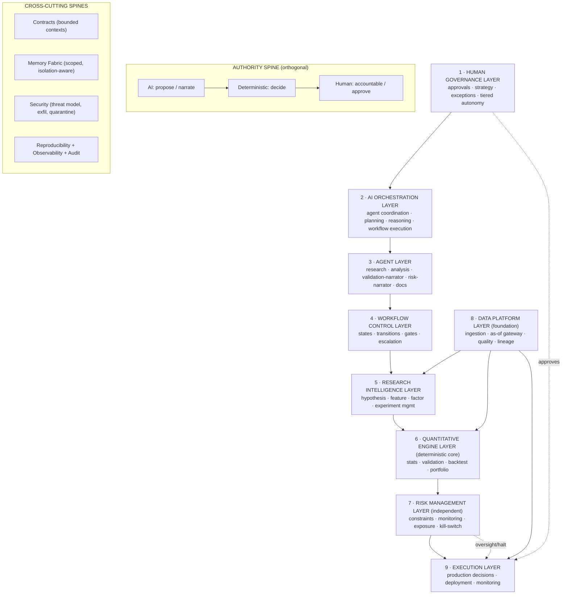
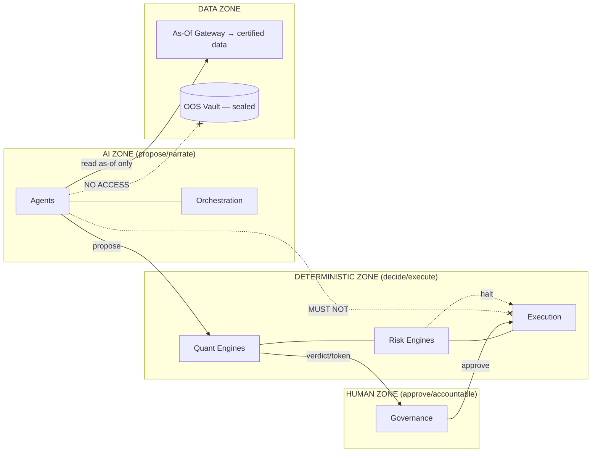
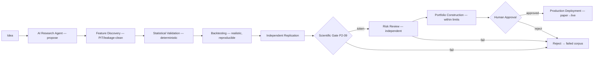
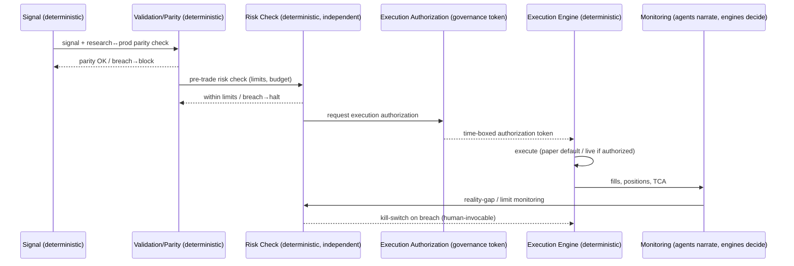
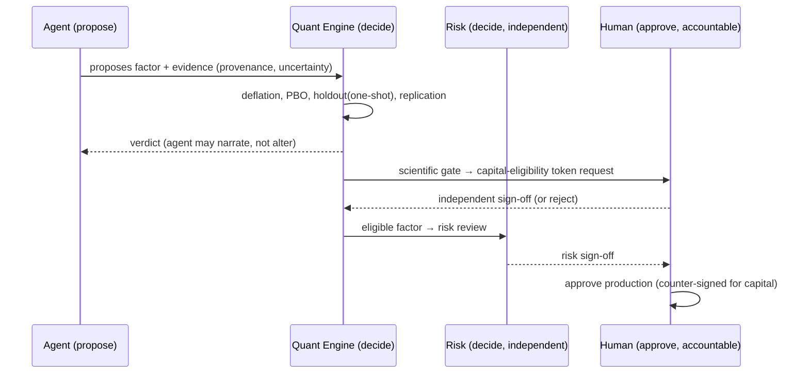

# Architecture V2 — The Governance-Mature Blueprint

### AI Hedge Fund Research Operating System

| Field            | Value                                                                                                                                                            |
| ---------------- | ---------------------------------------------------------------------------------------------------------------------------------------------------------------- |
| **Document ID**  | ARCH-V2                                                                                                                                                          |
| **Tier**         | 2 — Architecture (target-state blueprint)                                                                                                                        |
| **Rule prefix**  | `AV2`                                                                                                                                                            |
| **Owner**        | Architecture Review Board (**ARB**)                                                                                                                              |
| **Co-signers**   | GRC, HAI, HPR, HQ, HD, PE, CISO, HSRE                                                                                                                            |
| **Status**       | PROPOSED (binding upon ARB ratification)                                                                                                                         |
| **Relationship** | Evolution of V1 (`hedgefund-research-os-architecture.md`) via the Architecture Patch Plan; integrates the Constitution, Rulebooks, and Agent/Workflow Contracts. |

> **Nature of this document.** Architecture V2 is **not a rewrite**. It is the _target-state_ architecture the platform reaches when the Architecture Patch Plan (`architecture_patch_plan.md`) is executed and the governance corpus (Constitution, Rulebooks, Contracts) is in force. **V1 remains the historical architecture of record; its cross-cutting invariants (V1 §8) stand unchanged and are strengthened, never weakened, here.** Where V2 supersedes a V1 decision, it does so explicitly with justification and a Patch reference — never silently. V2 restates no rulebook or contract content; it defines _structure_ and cites the governance documents that own the _rules_.

> **Reading note.** Technology-independent. No code, no vendor designs, no language decisions. Each major section carries **Purpose · Responsibilities · Boundaries · Acceptance Criteria · Failure Conditions · Cross References**, with embedded RFC 2119 rules (`AV2-n`).

---

## 1. Authority & Governing Corpus

Architecture V2 sits at Tier 2 and is subordinate to the Constitution (`CLAUDE.md`). It is the structural expression of the entire governance corpus:

| Tier                   | Document(s)                                                                                                                                                   | V2 relationship                                          |
| ---------------------- | ------------------------------------------------------------------------------------------------------------------------------------------------------------- | -------------------------------------------------------- |
| 1 — Constitution       | `CLAUDE.md`                                                                                                                                                   | Supreme; V2 implements its invariants (§8) structurally. |
| 2 — Architecture       | V1 architecture, Review, **Patch Plan**, **this V2**                                                                                                          | V2 = V1 + patches, governance-integrated.                |
| 3 — Rulebooks          | STAT, RMET, DATA (DGOV/DQ), FAR (FEAT/FCTR), BT, PORT, RISK, AIGOV, CODE (+ forthcoming VAL, PIT, EXEC, DEPLOY, MODEL, PROMPT, AGENT, MEM, SEC, OBS, PERF, …) | Own the _rules_ each V2 layer must obey.                 |
| 4 — Agent Contracts    | `agent_contracts.md`                                                                                                                                          | Govern agents in the Agent Layer.                        |
| 5 — Workflow Contracts | `workflow_contracts.md`                                                                                                                                       | Govern the Workflow Control Layer.                       |

- **AV2-1 (MUST).** V2 MUST NOT contradict the Constitution, the V1 invariants (§8), any ratified Rulebook, or the Agent/Workflow Contracts; a conflict makes the conflicting V2 element void until reconciled via ADR. _Rationale:_ CP-1; the governance corpus is authoritative. _Refs:_ §9.

---

## 2. What V2 Is — Evolution from V1

V2 keeps V1's layered decomposition and invariants and **adds governance maturity**: it makes V1's _aspirational_ guarantees _structurally enforced_ (the central finding of the Architecture Review), and it overlays the human/AI/deterministic authority separation the Rulebooks require.

### 2.1 The three structural additions of V2

1. **Governance-first authority spine** — an explicit, orthogonal authority order (**AI proposes → deterministic engines decide → humans are accountable**) crossing every layer, replacing V1's implicit assumption that agents could act.
2. **Enforced invariants** — V1's "structurally enforced" slogans become mechanisms: the As-Of Gateway, Trial Ledger, Multiple-Testing Enforcer, Holdout Manager, Replication Engine, Isolation Barrier, Reproducibility Spine, and Scientific Gate (Patch Plan Phases 1–2).
3. **Contract-bound participation** — every agent operates under a Tier-4 contract; every critical activity runs through a Tier-5 workflow; no ungoverned action exists.

### 2.2 V1→V2 resolution map (Review findings → V2 structure)

| V1 weakness (Review)                           | V2 resolution (structure)                                                                                    | Patch                 |
| ---------------------------------------------- | ------------------------------------------------------------------------------------------------------------ | --------------------- |
| **C1** PIT was a slogan                        | **Data Platform Layer**: mandatory As-Of Gateway + vintage store; Feature Factory PIT-bound; Leakage Harness | P1-01, P1-06, P2-03   |
| **C2** Multiple-testing was a counter          | **Quantitative Engine Layer**: immutable Trial Ledger + deterministic Multiple-Testing/Budget Enforcer       | P2-01, P2-02          |
| **C3** LLMs in decision paths                  | **Authority spine**: deterministic-engine mandate; agents are narrators/proposers                            | P1-03                 |
| **C4** Reproducibility undermined              | **Reproducibility Spine** (cross-cutting): run manifests; stochastic-artifact recording                      | P1-02                 |
| **C5** Governance downstream of research       | **Human Governance Layer at the top** + Pre-Capital Scientific Gate                                          | P2-09                 |
| **C6** OOS reused                              | **Quantitative Engine Layer**: Holdout & Embargo Manager (one-shot, rotating)                                | P2-05, P2-06          |
| **Quant** generator defeats validator          | **Isolation Barrier** across Agent/AI-Orchestration/Memory layers                                            | P2-07                 |
| **M1/M2/M3** god-modules, genericity, coupling | **Domain-separated layers + capability contracts + bounded contexts**                                        | P1-04/05/07/08, P5-02 |
| **M4** capacity/crowding faked                 | **Research Intelligence + Risk Layers**: capacity/crowding intelligence                                      | P3-11                 |
| **M6/M7** security, human bottleneck           | **Security Boundary** + **tiered autonomy** in Human Governance                                              | P1-09, P5-05          |

- **AV2-2 (MUST).** Every V2 layer MUST implement the enforcement mechanisms mapped above; a layer that reverts an enforced guarantee to a prose promise is non-conformant. _Rationale:_ CP-1; the Review's central lesson. _Refs:_ §2.2.

---

## 3. Architecture Principles

- **AV2-3 · Governance-First Design (MUST).** Governance is designed in, not bolted on: every consequential action passes a gate owned by a Rulebook, and no path exists that bypasses governance. _Failure:_ any ungoverned consequential action. _Refs:_ §5.1, §7.
- **AV2-4 · Human Accountability (MUST).** A named human is accountable for every consequential outcome; humans approve critical transitions and cannot be reduced to rubber stamps (tiered autonomy). _Refs:_ §5.1, §6.2.
- **AV2-5 · Deterministic Execution Authority (MUST).** All consequential decisions and all execution are performed by deterministic, versioned, golden-tested engines; AI is never in a decision or execution path. _Refs:_ §6.3.
- **AV2-6 · AI Advisory Intelligence (MUST).** AI proposes and narrates at the fuzzy edges; it holds no decision authority. _Refs:_ §5.3, §11.
- **AV2-7 · Scientific Reproducibility (MUST).** Every deterministic result is reproducible from its manifest; every stochastic (AI) step is recorded to its output. _Refs:_ §5.10.
- **AV2-8 · Modular Architecture (MUST).** Components are replaceable behind contracts; nothing is coupled beyond its declared contract. _Refs:_ §5.9, §9.
- **AV2-9 · Domain Separation (MUST).** Discovery, adjudication, capture, and oversight are separated organizationally and technically (separation of powers). _Refs:_ §5.
- **AV2-10 · Auditability (MUST).** Every artifact and decision is immutable, provenance-bearing, and traceable end-to-end. _Refs:_ §5.10, §7.
- **AV2-11 · Scalability (MUST).** Bounded contexts scale independently; the platform survives industrial-scale AI throughput without eroding controls. _Refs:_ §10.
- **AV2-12 · Vendor Independence (MUST).** Models, data vendors, brokers, and infrastructure are swappable behind stable internal contracts; no core logic depends on a specific vendor. _Refs:_ §6.1, §10.

---

## 4. System Topology (V2)

V2 is organized as **nine functional layers** crossed by an **authority spine** and **cross-cutting spines** (Contracts, Memory, Security, Reproducibility/Observability, Audit). Data flows bottom-up (foundation → execution); authority flows orthogonally (AI proposes → deterministic decides → human accountable).

- **AV2-13 (MUST).** Layers MUST interact only through contracts (Cross-cutting: Contracts spine); direct cross-layer access to internals is PROHIBITED (SE-2, `P5-02`). _Rationale:_ M3; hidden coupling defeats modularity. _Refs:_ §5.9.
- **AV2-14 (MUST).** The authority spine MUST hold at every layer: no layer may let AI decide, or bypass a deterministic gate, or skip human approval where required. _Rationale:_ DE-1, HO-1. _Refs:_ §6.

---

## 5. The Nine Layers

> Each layer: **Purpose · Responsibilities · Boundaries · Acceptance · Failure · Cross-refs.** V1 origin and governing Rulebook are noted. Component "Forbidden responsibilities" are stated explicitly per Constitution ACON/AGC style.

### 5.1 Human Governance Layer (top authority)

- **V1 origin / governs:** V1 §2.10 Governance; RB-13 · RISK, GRC/ARB/MRC; `P2-09`, `P5-05`.
- **Purpose.** Hold ultimate accountability: approve critical transitions, set strategy and risk appetite, handle exceptions, and govern the platform.
- **Responsibilities.** Approvals (capital-eligibility sign-off, production deployment, capital increases, control changes); strategic direction and mandate; exception/waiver authority; risk-appetite and parameter setting; scientific and risk sign-off (independent of research).
- **Boundaries.** Humans MAY override or halt any AI/automated action; AI MUST NOT override a human governance decision. Human approval is mandatory at the gates in §6.2.
- **Acceptance.** Every critical transition carries a recorded human approval; tiered autonomy scales oversight without rubber-stamping.
- **Failure.** A capital-affecting action without human sign-off; humans reduced to rubber stamps.
- **Forbidden.** MUST NOT bypass statistical/risk controls via override (HO-3); overrides that defeat controls are void.
- **Cross-refs.** RB-13 · RISK, `CLAUDE.md` HO-1..4, `P5-05`, Workflow Contracts (approval gates).

- **AV2-15 (MUST).** Human approval MUST be required, recorded, and (for capital) counter-signed at: capital-eligibility issuance, production deployment, capital increases, control/limit changes, and any override of an automated block. _Rationale:_ HO-2, RG-3. _Refs:_ §6.2.

### 5.2 AI Orchestration Layer

- **V1 origin / governs:** V1 §2.12 Orchestration; RB-15 · AIGOV, RB-18 · AGENT; `P4-05/07`, `P2-07`.
- **Purpose.** Coordinate agents, plan and prioritize research, and drive workflow execution — as a transparent, governed optimization, not an autonomous authority.
- **Responsibilities.** Agent coordination and routing; research prioritization as an auditable optimization (AI proposes, optimizer/human decides); workflow execution driving (invoking the Workflow Control Layer); budget/backpressure governance; deterministic arbitration of multi-agent output.
- **Boundaries.** Orchestration MAY schedule and route but MUST NOT adjudicate gate decisions; the research agenda MUST NOT be set unilaterally by an LLM.
- **Acceptance.** Prioritization decisions are auditable optimizations; every multi-agent contribution resolves via a deterministic arbiter.
- **Failure.** An LLM sets the agenda; implicit multi-agent consensus without arbiter; a hidden workflow.
- **Forbidden.** MUST NOT decide gates, approve, execute, or let generators observe validation outcomes.
- **Cross-refs.** `P4-07` (prioritization), `P4-05` (arbiter), Workflow Contracts, RB-15 · AIGOV.

- **AV2-16 (MUST).** The Orchestration Layer MUST enforce the generator↔validator isolation barrier via bus topic ACLs (`P2-07`); generation agents MUST NOT receive validation/OOS signals. _Rationale:_ AD-3; the deepest quant risk. _Refs:_ §6.1.

### 5.3 Agent Layer

- **V1 origin / governs:** V1 §2.11 Agent Mesh; Tier-4 Agent Contracts, RB-15 · AIGOV, RB-18 · AGENT, RB-16/17/19; `P4-01/02/04`.
- **Purpose.** House the single-responsibility AI agents that propose and narrate at the fuzzy edges.
- **Responsibilities.** Research/discovery agents (propose ideas/hypotheses, literature synthesis); analysis agents (extract/summarize/classify, compute analytics — proposals); **validation-narrator** agents (explain deterministic verdicts, never adjudicate); **risk-narrator** agents (compute/explain risk analytics, never decide halts); documentation agents (draft reports/narratives); monitoring agents (surface metrics). Each is contract-bound (16-field contract), pinned to a model, versioned prompt, with a human owner.
- **Boundaries.** Every agent's authority ceiling is `propose` or `narrate`; **no agent holds decision authority.** Default-deny tools/data/topics; data only via the as-of read layer; no OOS access.
- **Acceptance.** 100% agents on ratified contracts, certified via eval gate, isolation-compliant; validation/risk agents provably cannot issue verdicts/decisions.
- **Failure.** A multi-responsibility agent; an agent deciding significance/risk/allocation/promotion; an isolation breach.
- **Forbidden.** MUST NOT decide/approve/execute; expand own permissions; modify own contract; access OOS; create hidden workflows.
- **Cross-refs.** `agent_contracts.md`, RB-15 · AIGOV, `P4-04` (role rationalization).

- **AV2-17 (MUST).** Validation, risk, and portfolio agents MUST be **narrator-only**; the deterministic engines in Layers 6–7 hold their decisions. _Rationale:_ REVIEW C3; "agents that should not decide." _Refs:_ §5.6, §5.7.

### 5.4 Workflow Control Layer

- **V1 origin / governs:** V1 §2.12 workflow_engine + saga_coordinator + run_ledger; Tier-5 Workflow Contracts; `P5-05`.
- **Purpose.** Manage the states, transitions, gates, and escalation through which all critical work moves.
- **Responsibilities.** Enforce the universal state machine (PROPOSED→…→COMPLETED + failure states); enforce declared transitions with pre/postconditions; invoke deterministic validation gates and human approval gates at each transition; coordinate compensation on failure; record the immutable workflow run history; enforce the staged research→production chain.
- **Boundaries.** Orchestrates but never adjudicates; every gate delegates to its owning engine/human.
- **Acceptance.** No completion without the mandatory validation gate; no stage-skip; full traceability per workflow instance; failed transitions leave consistent state (saga).
- **Failure.** A transition bypassing validation; research moved directly to production; inconsistent state after failure.
- **Forbidden.** MUST NOT contain decision logic; MUST NOT permit undeclared transitions.
- **Cross-refs.** `workflow_contracts.md`, RB-orchestration/ARCH §2.12.

- **AV2-18 (MUST).** No workflow MAY reach COMPLETED for a consequential activity without passing the deterministic validation gate and required human approvals; the staged research→production chain MUST NOT be skipped. _Rationale:_ RG-3, WFC-3/17. _Refs:_ §7.

### 5.5 Research Intelligence Layer

- **V1 origin / governs:** V1 §2.4 Research Engine + §2.5 Factor Engineering; RB-02 · RMET, RB-10/09 · FAR; `P3-01..08`, `P3-11/12`.
- **Purpose.** Produce and manage the research lifecycle: hypotheses, features, factors, composite alphas, and experiments.
- **Responsibilities.** Idea/Hypothesis registries with pre-registration lock; Experiment Registry + immutable manifests; Feature Factory (PIT-bound) + Feature Marketplace; factor construction, orthogonalization, ontology classification, redundancy control; Alpha Factory (net-of-cost, eligible-constituent composites); crowding/capacity intelligence; explainability/economic-rationale; research journal/timeline; failed-research corpus.
- **Boundaries.** Produces candidates and _descriptive_ analytics; does **not** adjudicate significance or acceptance (that is Layer 6). Generation is isolated from validation.
- **Acceptance.** Every candidate is registered, pre-registered, trial-counted, isolation-compliant, and net-of-cost defined; nothing is promoted without Layer-6 verdicts.
- **Failure.** Unregistered mining; generation seeing validation feedback; gross-alpha selection; factor-zoo bloat.
- **Forbidden.** MUST NOT validate its own output; MUST NOT access OOS; MUST NOT create alpha outside the governed pipeline.
- **Cross-refs.** RB-02 · RMET, RB-10/09 · FAR, `P3-*`.

- **AV2-19 (MUST).** The Research Intelligence Layer MUST be firewalled from the adjudication in Layer 6 (separation of generation and validation); the two MUST NOT share mutable state or feedback across the isolation barrier. _Rationale:_ CP-5, AD-3. _Refs:_ §6.1.

### 5.6 Quantitative Engine Layer (deterministic core)

- **V1 origin / governs:** V1 §2.6 Validation + §2.7 Backtesting + §2.8 Portfolio; RB-01 · STAT, RB-04 · VAL, RB-11 · BT, RB-12 · PORT; `P2-01..09`, `P3-16`, `P1-08`.
- **Purpose.** Make **all consequential quantitative decisions deterministically**: statistical significance, validation verdicts, backtest evidence, and portfolio construction.
- **Responsibilities.** Immutable Trial Ledger + Multiple-Testing/Budget Enforcer (deflation, correlation-aware); Validation Gauntlet (leakage harness, purged/CPCV, PBO); Holdout & Embargo Manager (one-shot, rotating OOS); Independent Replication Engine; Pre-Capital Scientific Gate (issues capital-eligibility tokens); institutional Backtest Engine (PIT clock, net-of-cost, participation-aware impact, borrow, capacity); deterministic Portfolio Optimizer (net-of-cost, within RISK limits). All engines are versioned, golden-tested, reproducible.
- **Boundaries.** This is the **only** place consequential quantitative decisions are made; AI MUST NOT be in these paths. It consumes eligible inputs; it does not generate ideas.
- **Acceptance.** Every significance/validation/promotion/allocation decision traces to a deterministic engine run with a manifest; no LLM in any decision path; OOS is one-shot; every promotion independently replicated.
- **Failure.** Any LLM-made verdict; undeflated significance; iterative holdout use; irreproducible result.
- **Forbidden.** MUST NOT accept ungoverned inputs; MUST NOT be altered by an agent; MUST NOT expose OOS to Layer 5.
- **Cross-refs.** RB-01/04/11/12, `P2-01..09`, `P3-16`.

- **AV2-20 (MUST).** The Quantitative Engine Layer's decisions MUST be deterministic, reproducible, and golden-tested; the platform MUST be able to operate this layer with all AI suspended. _Rationale:_ DE-1, AV2-5, AIGOV-61. _Refs:_ §6.3, §10.

### 5.7 Risk Management Layer (independent oversight)

- **V1 origin / governs:** V1 §2.10 Governance/Risk; RB-13 · RISK; `P1-03`, `P6-03`.
- **Purpose.** Independently bound loss and preserve capital across the platform, with authority to halt.
- **Responsibilities.** Define/enforce limits (exposure, leverage, liquidity, concentration, drawdown); risk budgeting (correlation-aware); model-risk framework; real-time monitoring and early warning; deterministic kill-switches/circuit-breakers; independent risk sign-off at promotion; DR/BCP readiness; operational/vendor/counterparty/cyber risk oversight.
- **Boundaries.** Independent of research and portfolio (CP-5); overrides the 1st line; kill-switch is human-invocable and never AI-gated.
- **Acceptance.** No production without independent risk sign-off; limits enforced pre-trade fail-closed; kill-switch drills pass; independence intact.
- **Failure.** Risk reporting to research; an AI-gated kill-switch; a hard-limit breach without halt.
- **Forbidden.** MUST NOT be overridden by the 1st line; MUST NOT delegate halts to AI.
- **Cross-refs.** RB-13 · RISK, `P1-03`, `P6-03`.

- **AV2-21 (MUST).** Risk oversight MUST be structurally independent and MUST retain unilateral authority to halt any strategy, sleeve, or the whole platform. _Rationale:_ RS-2, REVIEW C5. _Refs:_ §6.

### 5.8 Data Platform Layer (foundation)

- **V1 origin / governs:** V1 §2.2 Ingestion + §2.3 Semantic; RB-06/07 · DATA, RB-08 · PIT; `P1-01/06`, `P2-03`, `P5-01/03`.
- **Purpose.** Provide certified, point-in-time-correct, provenance-bearing data as the only foundation research may stand on.
- **Responsibilities.** Acquisition + immutable raw vault; canonicalization + symbology + corporate actions; bitemporal stamping; **As-Of Gateway** (the sole read path; fails closed without `as_of`); vintage store (restatements as new vintages); reference-data as-of; survivorship-safe universes; Feature Factory PIT-bound computation; Leakage Harness; data quality/certification; lineage capture; temporal store for performance; lifecycle/retention (reproducibility-critical data preserved).
- **Boundaries.** Research and agents read only certified, as-of data via the gateway; raw/uncertified/OOS data is never exposed to research or AI.
- **Acceptance.** No read without an `as_of` (fail-closed); reference data queried as-of; survivorship-safe; lineage resolvable; leakage harness passes.
- **Failure.** A non-as-of read; a vintage overwrite; survivorship-unsafe data certified; research reading raw data.
- **Forbidden.** MUST NOT serve non-as-of/uncertified data to research/AI; MUST NOT expose the OOS partition to the research/AI side.
- **Cross-refs.** RB-06/07/08, `P1-01/06`, `P2-03`.

- **AV2-22 (MUST).** All historical reads by every layer MUST pass through the As-Of Gateway; a read without an `as_of` MUST be impossible (fail-closed). _Rationale:_ PIT-1, REVIEW C1. _Refs:_ §6.4.

### 5.9 Execution Layer

- **V1 origin / governs:** V1 §2.9 Execution; RB-14 · EXEC, RB-30 · DEPLOY; `P3-15`, `P1-10`, ARCH §2.9.
- **Purpose.** Turn approved portfolios into orders — **paper-first by default**, live only under governance authorization — and measure realized quality.
- **Responsibilities.** OMS + execution algos + broker/venue adapters; paper/shadow engine (default); research↔production parity harness; realized TCA feeding governed cost-model calibration; position ledger + reconciliation; deterministic execution authority; rollback on trigger.
- **Boundaries.** Live execution is impossible without a time-boxed governance authorization token; kill-switch forces paper/halt; AI never executes.
- **Acceptance.** Default is paper; live requires token + risk sign-off + DEPLOY gate + Live-Capital Gate; parity monitored; reversible.
- **Failure.** Live trading without token; AI executing; unmanaged cost-model recalibration; irreversible deployment.
- **Forbidden.** MUST NOT execute without authorization; MUST NOT let AI decide/authorize execution.
- **Cross-refs.** RB-14 · EXEC, RB-30 · DEPLOY, `P3-15`, `P1-10`.

- **AV2-23 (MUST).** Execution MUST be deterministic and gated by a governance authorization token; the same engine MUST run backtest/paper/live differing only by injected clock and adapter. _Rationale:_ RS-4, `P3-15`; prevents research↔prod divergence. _Refs:_ §7.

### 5.10 Cross-Cutting Spines

- **Contracts Spine** (V1 §2.17; `P5-02`): per-bounded-context contracts + translation layer; the integration substrate; **Purpose** — make everything replaceable; **Forbidden** — a global monolithic schema (re-monolithization).
- **Memory Fabric** (V1 §6; `P4-06`, `P3-14`): scoped, confidence-decayed, contradiction-quarantined memory + knowledge graph; **Boundary** — validation/OOS memories unreadable by generation agents (isolation).
- **Security Spine** (`P1-09`, `P4-03`): threat model, alpha-exfil controls, least-privilege, tamper-evident hash-chained audit, secrets broker, untrusted-content quarantine; **Boundary** — see §6.5.
- **Reproducibility + Observability + Audit Spine** (`P1-02`, `P5-06`): run manifests, run ledger, cost attribution, drift/parity monitors, immutable audit trail; **Acceptance** — every deterministic artifact reproducible; every AI artifact recorded; every decision auditable.

- **AV2-24 (MUST).** The cross-cutting spines MUST apply uniformly to all layers; a layer MUST NOT opt out of reproducibility, provenance, security, or audit. _Rationale:_ CP-4/6/7. _Refs:_ §10.

---

## 6. Architectural Boundaries

### 6.1 AI Boundary

- **Purpose.** Bound what AI may touch.
- **AI MAY access:** certified, as-of data via the gateway; its contracted tools; scoped memory (non-OOS); artifacts within its workflow scope.
- **AI MUST NOT access:** the OOS/holdout vault; raw/uncertified data; validation/OOS outcomes (if a generation agent); another agent's internals; controls/gates it does not own.
- **Acceptance.** AI accesses only what its contract grants (default-deny); isolation barrier enforced by ACLs. **Failure.** Any OOS access or isolation breach. **Refs.** RB-15 · AIGOV, `P2-07`, `P4-03`.

### 6.2 Human Boundary

- **Purpose.** Fix where human approval is mandatory.
- **Mandatory human approval:** capital-eligibility issuance; production deployment; capital increases; control/limit changes; overrides of automated blocks; the Live-Capital Gate.
- **Acceptance.** Every listed transition has recorded (and, for capital, counter-signed) human approval. **Failure.** A capital-affecting action without human sign-off. **Refs.** HO-1..4, `P2-09`, `P5-05`.

### 6.3 Deterministic Boundary

- **Purpose.** Fix where deterministic systems hold sole authority.
- **Deterministic-only authority:** statistical significance; validation verdicts; multiple-testing budget; risk limits/halts; portfolio weights/allocation; promotion gates; order execution.
- **Acceptance.** Every such decision is a deterministic engine run; the platform operates these with AI suspended. **Failure.** Any AI-made or AI-altered decision in these domains. **Refs.** DE-1, `P1-03`, AV2-5.

### 6.4 Data Boundary

- **Purpose.** Control how data is accessed.
- **Rules.** As-Of Gateway is the sole read path; only certified data is served; reference data is as-of; the OOS partition is sealed from research/AI; access is least-privilege per sensitivity.
- **Acceptance.** No non-as-of read possible; OOS unreachable by research/AI. **Failure.** A raw/non-as-of read or OOS exposure. **Refs.** RB-06/07/08, `P1-01`.

### 6.5 Security Boundary

- **Purpose.** Protect sensitive operations and crown-jewel assets.
- **Rules.** Threat model maintained; factor/alpha definitions under need-to-know with exfil detection; secrets brokered/rotated; audit trail hash-chained + externally anchored; untrusted content quarantined; supply chain scanned.
- **Acceptance.** No secrets in repo/artifacts; audit tamper-evident; exfil monitored. **Failure.** Secret leak, unquarantined injection, or unlogged restricted access. **Refs.** RB-27 · SEC, `P1-09`, `P4-03`.

- **AV2-25 (MUST).** All five boundaries MUST be enforced by deterministic mechanism (ACLs, gates, tokens, identity), never by convention or by an AI policing another AI. _Rationale:_ CP-1, AIGOV-E-2. _Refs:_ §6.

---

## 7. System Flows

### 7.1 Research Flow (idea → production)

- **Purpose.** The staged, gated path from idea to capital.

- **Acceptance.** Each stage's gate passes before the next; a capital-eligibility token exists before Risk Review; human approval precedes production; no stage skipped. **Failure.** Any bypass of validation, replication, scientific gate, risk sign-off, or human approval. **Refs.** WFC-42..49, `P2-05..09`.

### 7.2 Production Flow (signal → monitored execution)

- **Purpose.** The runtime path a live signal takes, all deterministic and gated.

- **Acceptance.** No execution without parity+risk pass and a valid authorization token; kill-switch always available; monitoring active. **Failure.** Execution without token; AI in the decision path; unmonitored live strategy. **Refs.** RB-14 · EXEC, RB-13 · RISK, ARCH §2.9.

### 7.3 Authority sequence (a factor promotion)

- **AV2-26 (MUST).** Every consequential flow MUST realize the authority order **propose → decide → approve**; no flow may let an agent decide or execute. _Rationale:_ DE-1, HO-1. _Refs:_ §6.

---

## 8. Component Responsibility Matrix (RACI)

| Capability                            | AI Agents     | Deterministic Engines | Risk (independent) | Human Governance |
| ------------------------------------- | ------------- | --------------------- | ------------------ | ---------------- |
| Idea/hypothesis generation            | **R**         | —                     | —                  | A                |
| Feature/factor construction           | R             | R (compute)           | —                  | A                |
| Significance / validation / PBO       | —             | **R/A**               | C                  | A                |
| Backtest evidence                     | R (configure) | **R**                 | C                  | A                |
| Capital-eligibility (scientific gate) | —             | R (gate)              | C                  | **A**            |
| Risk limits / sign-off / halt         | narrate       | **R**                 | **R/A**            | A                |
| Portfolio construction/allocation     | narrate       | **R**                 | C (limits)         | A                |
| Execution / deployment authorization  | —             | **R**                 | C                  | **A**            |
| Monitoring / attribution              | narrate       | R                     | R                  | I                |
| Architecture change                   | propose       | —                     | C                  | **A (ARB)**      |

- **AV2-27 (MUST).** No cell grants AI a decision (bold-R) in a Decision/Control domain; such an assignment is void. _Rationale:_ AI-1..4. _Refs:_ §6.3.

---

## 9. Architectural Governance

- **Architecture Ownership.** The **ARB** owns the architecture; each layer has a domain lead accountable for its conformance. _Acceptance:_ every layer has a named owner. _Refs:_ AV2-1.
- **Architecture Review Process.** Changes are reviewed by the ARB (co-signed by affected domain leads and GRC/MRC for research/AI-risk impact) against the Constitution, invariants, and Rulebooks. _Failure:_ an architecture change merged without ARB review.
- **Architecture Change Process.** Every architecture change MUST trace to a Patch ID (extending the Patch Plan) and an ADR; changes MUST NOT weaken an invariant or collapse a separation-of-powers boundary. _Refs:_ AR-1..4, `CLAUDE.md` ADR-3.
- **Architecture Decision Records.** ADRs (RB-25 · ADR) record context, decision, alternatives, consequences, and references; accepted ADRs are immutable. _Refs:_ ADR-1..4.
- **Evolution Strategy.** V2 evolves by adding capabilities behind contracts and asset adapters; the asset-agnostic core never branches on asset class; new asset classes = new capability implementations. _Refs:_ CP-8, `P1-07`.
- **Migration Strategy.** V1→V2 proceeds by the Patch Plan phases (Correctness → Rigor → Research Infra → AI → Scale → Future); the **First-Capital Gate** and **Live-Capital Gate** are hard milestones; no capital flows until their required patches are green. _Refs:_ Patch Plan §5.

- **AV2-28 (MUST).** Architecture MUST NOT be modified autonomously by AI; architecture changes are human/ARB decisions recorded as ADRs + Patches. _Rationale:_ AI-4, §11. _Refs:_ §11.

---

## 10. Non-Functional Requirements

- **Reliability (MUST).** Multi-step operations use compensation (saga) leaving consistent state; the platform survives total AI suspension operating deterministic controls. _Refs:_ RE-1, AIGOV-61.
- **Performance (MUST).** The As-Of Gateway meets research latency SLAs at target volume (temporal store); optimizations never weaken correctness/PIT/reproducibility. _Refs:_ `P5-03`, PF-2.
- **Scalability (MUST).** Bounded contexts scale independently; the message bus is partitioned with ACLs; artifact growth is lifecycle-governed; human oversight scales via tiered autonomy. _Refs:_ `P5-01/04/05`, SC-1..4.
- **Security (MUST).** Threat-modeled; least-privilege; exfil detection; tamper-evident audit; secrets brokered; injection/poisoning quarantined. _Refs:_ `P1-09`, `P4-03`.
- **Observability (MUST).** Every run ledgered with cost attribution; drift/parity monitored; audit-grade telemetry. _Refs:_ `P5-06`, `P3-15`.
- **Maintainability (MUST).** Contract-bound, single-responsibility, low-coupling components; no god-modules or asset-branching in core. _Refs:_ RB-20 · CODE, M1/M2.
- **Reproducibility (MUST).** Deterministic artifacts reproducible from manifest; stochastic artifacts recorded to output; reproducibility-critical data never GC'd. _Refs:_ `P1-02`, `P5-01`.
- **Disaster Recovery (MUST → CRITICAL at go-live).** Tested RPO/RTO; outage/halt/feed-loss playbooks; kill-switch recovery; verified before any live capital. _Refs:_ `P6-03`, RE-3.

- **AV2-29 (MUST).** NFRs MUST be measured and gated in CI/operations; an NFR breach in a load-bearing property (reproducibility, PIT, security, DR-before-live) blocks the affected milestone. _Rationale:_ CP-1. _Refs:_ §9.

---

## 11. AI System Architecture Rules

**AI systems MUST:**

- **AV2-30.** operate through approved workflows (Tier-5) only (WFC-20).
- **AV2-31.** respect their agent contracts (Tier-4) and authority ceilings (AGC-32).
- **AV2-32.** maintain traceability (model/prompt/output provenance) (AIGOV-23).
- **AV2-33.** provide evidence and cite it where available (AIGOV-31).
- **AV2-34.** report uncertainty and distinguish facts from hypotheses (AIGOV-29/32).

**AI systems MUST NOT:**

- **AV2-35.** directly control production execution (AI-1, §6.3).
- **AV2-36.** bypass validation/decision engines (AI-4, §6.3).
- **AV2-37.** modify the architecture autonomously (AV2-28).
- **AV2-38.** change governance rules (AI-4; entrenched).

- **AV2-39 (MUST).** These AI rules MUST be enforced deterministically (contracts, ACLs, gates, tokens); enforcement MUST NOT depend on an AI. _Rationale:_ AIGOV-E-2. _Refs:_ §6.1.

---

## 12. Conformance & How V2 Closes the Review

- **AV2-40 (MUST).** V2 is conformant only if the Critical-tier patches are structurally present and enforced: As-Of Gateway (C1), Trial Ledger + Multiple-Testing Enforcer (C2), deterministic-engine mandate (C3), Reproducibility Spine (C4), Human Governance atop + Scientific Gate (C5), Holdout Manager (C6), and the Isolation Barrier (the generator-vs-validator flaw). _Rationale:_ the Review scored V1 58/100 precisely for lacking these; V2's institutional grade depends on their enforcement. _Acceptance:_ each is a live mechanism with a proof obligation, not a prose promise. _Failure:_ any reverts to a slogan. _Refs:_ §2.2, Review.

**Conformance checklist (V2 is not ratifiable until all hold):**

- [ ] As-Of Gateway is the sole read path; fails closed; vintages preserved (§5.8).
- [ ] Trial Ledger append-only; Multiple-Testing Enforcer gates promotion (§5.6).
- [ ] No LLM in any decision/execution path; engines golden-tested (§5.6, §6.3).
- [ ] Run manifests for deterministic artifacts; AI artifacts recorded (§5.10).
- [ ] Human Governance approves capital-eligibility/deployment; independent risk sign-off (§5.1, §5.7).
- [ ] Holdout one-shot + rotating; independent replication before capital (§5.6).
- [ ] Isolation barrier enforced across Agent/Orchestration/Memory (§6.1).
- [ ] Every critical activity runs through a Tier-5 workflow; every agent under a Tier-4 contract (§5.3, §5.4).
- [ ] Security boundary + tamper-evident audit; DR/BCP before live (§6.5, §10).

---

## 13. Cross References & Glossary

**Governing corpus:** `CLAUDE.md`; V1 architecture, Review, **Patch Plan**; Rulebooks STAT/RMET/DATA/FAR/BT/PORT/RISK/AIGOV/CODE (+ forthcoming); `agent_contracts.md`; `workflow_contracts.md`.
**Key patches realized:** `P1-01/02/03/06/07/08/09/10`, `P2-01..09`, `P3-06/08/09/10/11/12/15/16`, `P4-01..07`, `P5-01..06`, `P6-03`.

**Glossary (V2-specific).** Terms in the Constitution/Rulebook/Contract glossaries are not redefined.

- **Authority Spine** — The orthogonal order _AI proposes → deterministic decides → human accountable_ crossing every layer (§4).
- **Governance-Mature** — The state in which every V1 aspirational guarantee is a live enforced mechanism (§2).
- **Deterministic Core** — The Quantitative Engine + Risk + Execution zone where all consequential decisions/execution occur (§5.6, §6.3).
- **Boundary (AI/Human/Deterministic/Data/Security)** — The five enforced separations that make the platform safe (§6).
- **Staged Chain** — The mandatory research→production workflow sequence gated by tokens and human approval (§7.1).
- **Cross-Cutting Spine** — Contracts, Memory, Security, Reproducibility/Observability/Audit applied uniformly to all layers (§5.10).

---

_End of Architecture V2 — the governance-mature blueprint. It evolves V1 by making its invariants structurally enforced (per the Patch Plan) and by overlaying the human/AI/deterministic authority separation the Rulebooks and Contracts require. AI proposes and narrates; deterministic engines decide and execute; humans are accountable and approve; data is served only point-in-time; risk oversight is independent and can halt anything; and no research reaches capital except through the full staged, gated, auditable chain. V2 restates no rulebook — it is the structure through which the entire governance corpus operates. Binding upon ARB ratification; migrated to via the Architecture Patch Plan._
