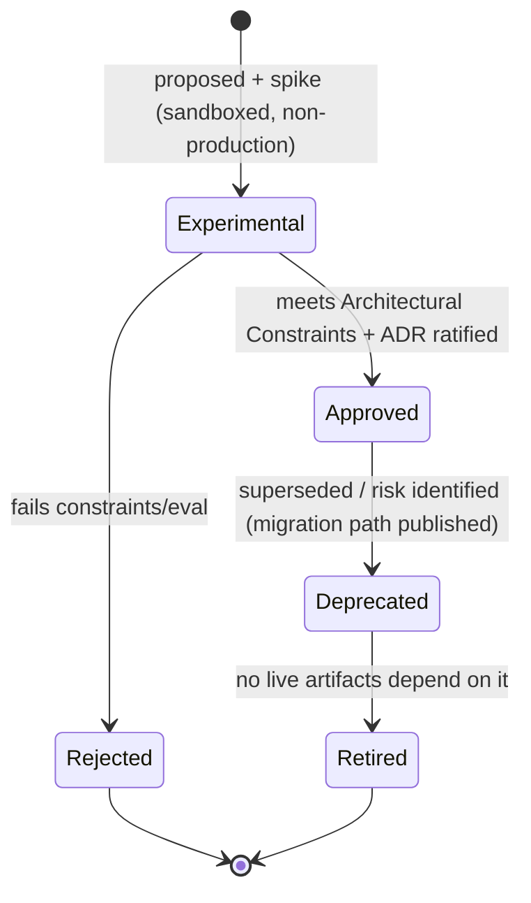

# Institutional Technology Decision Record (TDR)

### The Approved Production Technology Baseline for the Quantitative Research Platform

| Field             | Value                                                                                                                                               |
| ----------------- | --------------------------------------------------------------------------------------------------------------------------------------------------- |
| **Document ID**   | TECHNOLOGY-DECISION-RECORD                                                                                                                          |
| **Type**          | Canonical technology baseline (the technology realization of Architecture V2)                                                                       |
| **Clause prefix** | `TDR`                                                                                                                                               |
| **Owner**         | Principal Engineer (**PE**) + Architecture Review Board (**ARB**)                                                                                   |
| **Co-signers**    | CISO, HSRE, HAI, HD, HQ, HPR, GRC, MRC                                                                                                              |
| **Governed by**   | `CLAUDE.md`; **Architecture V2**; **Implementation Roadmap**; RB-20 · CODE; RB-15 · AIGOV; RB-25 · ADR (ADR Governance); Agent & Workflow Contracts |
| **Version**       | 1.0.0                                                                                                                                               |
| **Status**        | PROPOSED (binding upon ARB ratification)                                                                                                            |
| **Last Ratified** | — (pending)                                                                                                                                         |

> **Nature & authority.** This document answers **"which concrete technologies are approved, why,
> and under what constraints."** It is **subordinate** to the Architecture Canon and the Rulebooks:
> Architecture V2 is deliberately technology-independent; this TDR is the _bridge_ from that
> blueprint to an implementable stack. It is **not** an implementation guide, **not** a deployment
> guide, and **not** a tutorial. Where any technology choice here cannot satisfy a higher-tier
> guarantee (an ARCH §8 / V2 invariant, a Rulebook, or an AI-Governance rule), **the guarantee
> prevails and the technology is rejected** (AV2-1). This TDR never amends architecture.
>
> **Realization through ADRs.** Each category decision below **SHOULD** be ratified as a standing
> **ADR** (ADR-4 analog) under [ADR Governance](adr/adr_governance.md); material changes to this
> baseline **MUST** proceed by accepted ADR citing the affected `TDR-n` and any Patch IDs
> (ADR-3, AM-1). This document is the index and rationale; the ADRs are the immutable record.
>
> **Reading note.** RFC 2119 keywords per `CLAUDE.md`. Every selection is stated as _replaceable
> behind a contract_ (SE-3, AV2-12); naming a vendor here never couples core logic to it.

---

## 1. Purpose, Scope & Position

- **Purpose.** Convert the technology-independent Architecture V2 into an approved, versioned,
  swappable production technology stack that every future implementation **MUST** comply with.
- **Scope.** The official technology decisions for languages, build/monorepo, services, data,
  messaging, orchestration, AI, security, observability, delivery, and developer tooling; the
  compatibility matrix; the technology lifecycle; and the architectural constraints on all choices.
- **Boundaries (references only, never restated).** _What the system is_ → Architecture V2. _What
  is built and in what order_ → Implementation Roadmap. _How to code/test/review_ → RB-20 · CODE,
  RB-21 · TEST, RB-22 · REVIEW. _AI rules_ → RB-15 · AIGOV. _How decisions are recorded_ → ADR
  Governance.
- **Position in the hierarchy.** Tier-6 baseline (technology of the source layer), **governed by**
  Tiers 1–5. See `PROJECT_INDEX.md` → _Authority Hierarchy_. On conflict, the higher tier wins and
  this TDR is corrected.

- **TDR-1 (MUST).** No technology **MAY** be adopted in production unless it is listed **Approved**
  here (or by a superseding ADR) **and** demonstrably satisfies the [Architectural Constraints](#architectural-constraints).
  _Rationale:_ CP-1; unapproved tech is ungoverned. _Acceptance:_ every production dependency traces
  to an Approved entry. _Failure:_ a production component on an unlisted/Experimental technology.

---

## 2. Technology Decision Principles

The following principles govern every selection and are ordered by precedence when they tension.

- **TDR-2 · Governance & Architecture Fidelity (MUST).** A choice **MUST** support Architecture V2
  and **MUST NOT** weaken any invariant (PIT, reproducibility, separation of powers, statistical
  integrity, auditability). Fidelity outranks every other principle. _Refs:_ AV2-1, CP-1.
- **TDR-3 · Vendor Independence (MUST).** Every technology **MUST** sit behind a stable internal
  contract/adapter so it is replaceable; **no core logic depends on a specific vendor** (AV2-12,
  IMP-9). Managed/cloud services are permitted **only** behind an adapter, never as a core-logic
  dependency. _Refs:_ SE-3.
- **TDR-4 · Deterministic Execution (MUST).** The stack **MUST** make consequential decisions
  deterministic and reproducible: no ambient time/RNG (CS-3, PIT-4), seedable numerics, pinned
  toolchains, and hermetic builds. Determinism-critical kernels **MUST** be implementable in a
  language with strict numeric control. _Refs:_ DE-1, `P1-03`.
- **TDR-5 · Reproducibility (MUST).** Builds and artifacts **MUST** be reproducible from a Run
  Manifest: content-addressed artifacts, digest-pinned containers, committed dependency locks,
  recorded RNG seeds and hardware class. _Refs:_ CP-4, `P1-02`, RP-1.
- **TDR-6 · Scientific Computing (MUST).** The stack **MUST** provide first-class numerical,
  statistical, columnar, and time-series capability suited to institutional quant research. _Refs:_
  RB-01 · STAT, RB-11 · BT.
- **TDR-7 · AI-Native, Advisory-Only (MUST).** AI tooling **MUST** be model-pinned, provenance-
  recording, isolation-aware, and structurally incapable of holding decision authority (AI-1..8).
  _Refs:_ RB-15 · AIGOV.
- **TDR-8 · Auditability (MUST).** Every consequential action **MUST** be capturable in an immutable,
  tamper-evident (hash-chained) audit trail with who/what/when/why. _Refs:_ CP-7, SEC-4.
- **TDR-9 · Security & Least Privilege (MUST).** Secrets brokered by reference and rotated; crown-
  jewel assets under need-to-know; untrusted content quarantined; supply chain scanned/signed.
  _Refs:_ SEC-1..5, `P1-09`, `P4-03`.
- **TDR-10 · Observability (MUST).** Uniform, vendor-neutral telemetry (logs, metrics, traces, cost)
  across every layer; no layer opts out. _Refs:_ OB-1..4, AV2-24.
- **TDR-11 · Scalability (MUST).** Bounded contexts scale independently; the bus is partitioned with
  ACLs; storage is lifecycle-governed. _Refs:_ SC-1..4.
- **TDR-12 · Performance within Budget (MUST).** The as-of read path and decision engines meet
  measured latency/throughput budgets without weakening correctness. _Refs:_ PF-1..3, `P5-03`.
- **TDR-13 · Long-Term Maintainability & Operational Simplicity (SHOULD).** Prefer mature, open,
  widely-supported, boring technology; minimize the count of distinct systems; avoid a technology
  whose only merit is novelty. _Refs:_ RB-20 · CODE.
- **TDR-14 · Cost Awareness (SHOULD).** Prefer open-source, self-hostable, and efficient options;
  attribute compute/LLM cost; avoid license terms that impair vendor independence. _Refs:_ `P5-06`,
  OB-2.
- **TDR-15 · Developer Productivity (SHOULD).** A hermetic, reproducible, fast local loop and typed
  contracts that catch errors early. _Refs:_ IMP-6.

- **TDR-16 (MUST).** When principles conflict, resolve in precedence order **TDR-2 → TDR-3 → TDR-4/5
  → TDR-6..12 → TDR-13..15**; the more conservative (integrity-preserving) option wins (PR-CONF-1).

---

## 3. Approved Stack at a Glance

| Domain                           | Approved (primary)                                              | Approved alternative(s)         | Behind contract          |
| -------------------------------- | --------------------------------------------------------------- | ------------------------------- | ------------------------ |
| Backend language                 | **Python 3.12+**                                                | Rust (determinism/perf kernels) | service/engine contracts |
| Systems / deterministic kernels  | **Rust**                                                        | C++ (only if unavoidable)       | engine contract          |
| Frontend language                | **TypeScript**                                                  | —                               | API contracts            |
| IaC language                     | **OpenTofu (HCL)** + K8s manifests                              | Terraform                       | infra adapters           |
| Monorepo build                   | **Bazel** (hermetic)                                            | Pants                           | build config             |
| Package managers                 | **uv** (Py), **pnpm** (TS), **cargo** (Rust)                    | —                               | lockfiles                |
| Backend framework                | **FastAPI** (+ Pydantic)                                        | Litestar                        | OpenAPI/gRPC             |
| Frontend framework               | **React + Vite + TypeScript**                                   | Next.js (SSR needs)             | REST/OpenAPI             |
| UI components                    | **Design system on Radix + Tailwind + tokens**                  | —                               | `apps/`                  |
| Internal API                     | **gRPC + Protobuf** over mTLS                                   | Connect                         | `contracts/services`     |
| External API                     | **REST + OpenAPI (JSON)**                                       | —                               | `contracts/api`          |
| Events                           | **Apache Kafka** + Apicurio schema registry                     | Redpanda                        | `contracts/` schemas     |
| Relational / registries / audit  | **PostgreSQL 16**                                               | —                               | per-context schema       |
| Analytical (OLAP)                | **Iceberg + Parquet/Arrow**, query via **DuckDB**/**Trino**     | ClickHouse                      | data-sdk                 |
| Time-series / bitemporal vintage | **ArcticDB**                                                    | TimescaleDB                     | As-Of Gateway            |
| Vector store (RAG)               | **pgvector**                                                    | Qdrant                          | ai-runtime               |
| Knowledge graph                  | **PostgreSQL + Apache AGE**                                     | Neo4j                           | ai-runtime               |
| Object storage                   | **S3-compatible API** (MinIO ref, WORM)                         | any S3 vendor                   | artifact store           |
| Cache                            | **Valkey**                                                      | —                               | cache adapter            |
| Workflow orchestration           | **Temporal**                                                    | —                               | workflow-engine          |
| AI runtime / orchestration       | **In-house AI runtime + model gateway**                         | LangGraph (experimental)        | ai-runtime               |
| Identity (AuthN)                 | **Keycloak (OIDC/OAuth2)**                                      | any OIDC IdP                    | identity adapter         |
| Authorization (AuthZ)            | **Open Policy Agent (OPA)**                                     | Cedar                           | authz adapter            |
| Service identity                 | **SPIFFE/SPIRE + mTLS**                                         | —                               | mesh                     |
| Secrets                          | **OpenBao** (Vault-compatible)                                  | HashiCorp Vault                 | secrets broker           |
| Config                           | **Declarative files + schema validation**, secrets by reference | —                               | `packages/configuration` |
| Telemetry                        | **OpenTelemetry** (logs/metrics/traces)                         | —                               | observability spine      |
| Logs / Metrics / Traces          | **Loki / Prometheus / Tempo**, **Grafana** dashboards           | OpenSearch / Jaeger             | OTel                     |
| Alerting                         | **Prometheus Alertmanager**                                     | paging via adapter              | monitoring               |
| CI                               | **GitHub Actions** (ref) + Bazel remote cache                   | GitLab CI                       | pipelines-as-code        |
| CD                               | **Argo CD (GitOps)** + Argo Rollouts                            | Flux                            | GitOps                   |
| Testing                          | **pytest+Hypothesis / nextest+proptest / Vitest+Playwright**    | —                               | golden harness           |
| Docs                             | **Markdown + MkDocs Material + Mermaid**                        | Docusaurus                      | docs portal              |
| Containers                       | **OCI via Bazel rules_oci**, distroless, cosign, SBOM           | —                               | registry (digest)        |
| Deployment                       | **Kubernetes** + GitOps, paper-first, reversible                | —                               | deployment adapters      |
| Local dev                        | **Dev Containers + Bazel + compose/kind**                       | Nix (toolchain)                 | —                        |

Detailed decisions follow. Each carries **Purpose · Selected · Rationale · Alternatives ·
Trade-offs · Migration · Acceptance · Evolution**.

---

## 4. Programming Languages

### 4.1 Backend

- **Purpose.** The primary language for services, research code, and quantitative engines.
- **Selected.** **Python 3.12+** as the primary backend/research language; **Rust** for
  determinism-critical and performance-critical kernels (see §4.4).
- **Rationale.** Python is the lingua franca of scientific computing and AI, giving first-class
  numerical/statistical/columnar libraries and the deepest quant/ML ecosystem (TDR-6, TDR-7); strong
  typing is available via type hints + Pydantic + static checking (TDR-13).
- **Alternatives.**

  | Option          | Verdict      | Why not primary                                                                     |
  | --------------- | ------------ | ----------------------------------------------------------------------------------- |
  | Python 3.12+    | **Selected** | best scientific/AI ecosystem; typed enough with tooling                             |
  | Rust (sole)     | Adjunct      | unmatched determinism/safety but thin quant/ML ecosystem; slower research iteration |
  | Java/Kotlin/JVM | Rejected     | strong platform, weaker scientific/AI ecosystem; heavier research loop              |
  | Go              | Rejected     | great for services, poor numerical/scientific fit                                   |
  | C++             | Constrained  | only where an existing engine mandates it (§4.4)                                    |

- **Trade-offs.** Python's runtime non-determinism and GIL require discipline: pinned interpreter and
  BLAS, fixed numeric threading, seeded RNG, injected clock, and Rust for strict-determinism paths.
- **Migration.** All code is behind service/engine contracts; a module may be reimplemented in Rust
  without changing consumers (SE-3).
- **Acceptance.** Interpreter and scientific libraries pinned in lockfiles; static type-checking in
  CI; no ambient time/RNG (CS-3); deterministic engines reproduce bit-for-bit under their manifest.
- **Future Evolution.** Adopt free-threaded/JIT Python as it matures (Experimental → Approved via
  ADR); expand Rust coverage of the deterministic core over time.

### 4.2 Frontend

- **Purpose.** The language for human consoles (`apps/`).
- **Selected.** **TypeScript** (strict).
- **Rationale.** Type safety across the UI/contract boundary; ubiquitous ecosystem; generates
  cleanly from OpenAPI (TDR-13, TDR-15).
- **Alternatives.** Plain JavaScript (rejected — no type safety); Elm/ReScript (rejected —
  small ecosystem, hiring risk).
- **Trade-offs.** Build complexity; mitigated by shared tooling.
- **Migration.** UIs consume only versioned REST/OpenAPI contracts; the frontend is fully
  replaceable without touching services.
- **Acceptance.** `strict` TypeScript; API clients generated from contracts; no hand-rolled types
  for governed payloads.
- **Future Evolution.** Track TS releases; adopt typed RPC (e.g., Connect) if internal UI↔service
  typing is warranted.

### 4.3 Infrastructure & Scripting

- **Purpose.** Infrastructure-as-code and operational scripting.
- **Selected.** **OpenTofu (HCL)** + declarative Kubernetes manifests (Kustomize/Helm) for
  infrastructure; **Python** for tooling/generators; **POSIX shell (bash)** only for thin,
  reviewed bootstrap.
- **Rationale.** Declarative, versioned, reviewable infra (auditability); OpenTofu is the
  permissively-licensed, vendor-neutral Terraform-compatible choice (TDR-3, TDR-14).
- **Alternatives.** Terraform (BSL license — see prohibitions, use OpenTofu); Pulumi (imperative,
  rejected for governed infra); Ansible (adjunct for config only).
- **Trade-offs.** HCL is not general-purpose; acceptable for declarative infra.
- **Migration.** OpenTofu ↔ Terraform state-compatible; providers are adapters.
- **Acceptance.** All infra is code, reviewed via PR, reproducible; no click-ops.
- **Future Evolution.** Reassess per the OpenTofu/Terraform ecosystem trajectory.

### 4.4 Determinism-critical kernels

- **Purpose.** Guarantee bit-reproducible, side-effect-free computation for decision engines.
- **Selected.** **Rust** (no unsafe in decision paths without review), with `proptest` golden tests.
- **Rationale.** Memory safety, no GC pauses, explicit numerics, and reproducible builds make Rust
  ideal for the deterministic core (TDR-4, DE-2). Python calls Rust kernels via a typed FFI behind
  the engine contract.
- **Acceptance.** Golden-set tests reproduce identical outputs across runs given the manifest;
  numeric behavior pinned (fixed thread count, deterministic reductions).
- **Future Evolution.** Grow Rust coverage of Layer-6/7 engines as the platform matures.

---

## 5. Monorepo Strategy

- **Purpose.** House the whole polyglot platform in one governed repository with bounded contexts.
- **Selected.** A **single monorepo** (this repository) with one workspace per bounded context,
  each owning its contracts; cross-context access **only** through published contracts.
- **Rationale.** Atomic, contract-first change across contexts; one audit history; matches the
  established layout (`PROJECT_INDEX.md`, RO-1). Polyglot (Python/Rust/TS) under one hermetic build.
- **Alternatives.** Polyrepo (rejected — cross-cutting governance and atomic contract changes become
  hard, hidden coupling risk); submodules (rejected — brittle).
- **Trade-offs.** Requires a scalable build tool (Bazel, §7) and codeowners/ACLs; large repo.
- **Migration.** Contexts are independently buildable/releasable; a context could be extracted behind
  its contracts if ever required (SE-3).
- **Acceptance.** No direct cross-context internals access (AV2-13); each context owns its schema and
  contracts; CODEOWNERS map to the [Directory Map](../repository/DIRECTORY_MAP.md).
- **Future Evolution.** Introduce remote build cache/execution as scale demands.

---

## 6. Package Manager

- **Purpose.** Deterministic dependency resolution with committed locks.
- **Selected.** **uv** (Python), **pnpm** (TypeScript), **cargo** (Rust). All lockfiles committed;
  Bazel consumes them for hermetic builds.
- **Rationale.** Fast, lockfile-first, reproducible resolution across languages (TDR-5, TDR-15).
- **Alternatives.** Poetry/pip-tools (slower); npm/yarn (weaker store/perf than pnpm).
- **Trade-offs.** Three managers; unified by Bazel and CI policy.
- **Migration.** Locks are portable; managers are swappable as long as a lockfile is produced.
- **Acceptance.** No unpinned/`latest` dependency; lockfiles present and CI-verified; supply-chain
  scan clean.
- **Future Evolution.** Consolidate toward fewer managers as tooling converges.

---

## 7. Build System

- **Purpose.** Hermetic, reproducible, incremental builds across the polyglot monorepo — the
  concrete backbone of the Reproducibility Spine.
- **Selected.** **Bazel** (with remote cache; remote execution optional).
- **Rationale.** Hermetic, content-addressed, cache-correct builds directly realize `P1-02`
  (reproducible artifacts, container digests); first-class polyglot support (rules_python/rust/js/oci).
- **Alternatives.**

  | Option       | Verdict      | Why                                                       |
  | ------------ | ------------ | --------------------------------------------------------- |
  | Bazel        | **Selected** | strongest hermeticity/reproducibility; polyglot; scalable |
  | Pants v2     | Alternative  | excellent Python ergonomics; less polyglot breadth        |
  | Nx/Turborepo | Rejected     | JS-centric; weak hermeticity for Python/Rust              |
  | Make/scripts | Rejected     | not hermetic, not reproducible                            |

- **Trade-offs.** Bazel has a real learning curve (tension with TDR-13); justified because
  reproducibility is a **hard** constitutional gate (IMP-26) that no simpler tool guarantees.
- **Migration.** Build targets are declarative; a move to Pants would preserve lockfiles and outputs.
- **Acceptance.** Byte-identical rebuilds from a clean cache; every release artifact digest-pinned and
  recorded in its Run Manifest.
- **Future Evolution.** Enable remote execution and hermetic toolchains (Nix-provided) as scale grows.

---

## 8. Backend Framework

- **Purpose.** Serve typed APIs for the Python services.
- **Selected.** **FastAPI** + **Pydantic v2** (validation/serialization); **grpcio** for internal gRPC.
- **Rationale.** Async, OpenAPI-native, typed request/response — contract-first by construction
  (IMP-10); Pydantic gives schema validation aligned with `packages/validation` (structural only).
- **Alternatives.** Litestar (viable alternative), Flask/Django (heavier/less async-native).
- **Trade-offs.** ASGI operational model; mature and well-supported.
- **Migration.** Endpoints are generated from/checked against contracts; framework swap does not
  change the contract.
- **Acceptance.** Every external endpoint has an OpenAPI contract in `contracts/api`; every internal
  RPC a proto in `contracts/services`.
- **Future Evolution.** Adopt typed RPC gateways (Connect) if beneficial.

---

## 9. Frontend Framework

- **Purpose.** Build the human consoles (`apps/`).
- **Selected.** **React + Vite + TypeScript** (Next.js permitted where SSR/SEO is genuinely needed —
  e.g., the docs portal).
- **Rationale.** Mature ecosystem, fast dev loop, strong typing; internal consoles rarely need SSR
  (TDR-13, TDR-15).
- **Alternatives.** Angular/Vue/Svelte (rejected for ecosystem/hiring consistency, not merit).
- **Trade-offs.** SPA complexity; mitigated by the shared design system.
- **Acceptance.** UIs act **only** through governed REST/OpenAPI contracts; no back-doors (AV2 §6.2).
- **Future Evolution.** Revisit meta-framework choice as needs evolve.

---

## 10. UI Component Strategy

- **Purpose.** Consistent, accessible, governed UI building blocks.
- **Selected.** An **internal design system** package built on **Radix UI** primitives (headless,
  accessible) + **Tailwind CSS** + **design tokens**; data-viz via a typed charting layer
  (e.g., visx/Observable Plot) behind an internal charts contract.
- **Rationale.** Headless primitives + tokens maximize control, accessibility, and consistency while
  keeping components replaceable (TDR-3, TDR-13).
- **Alternatives.** MUI/Ant (opinionated, heavier restyling), bespoke from scratch (slower).
- **Acceptance.** All apps consume the internal design system; accessibility checks in CI.
- **Future Evolution.** Evolve tokens/themes centrally; components remain swappable.

---

## 11. API Strategy

- **Purpose.** Define how components communicate — contract-first and typed.
- **Selected.**
  - **Internal (service↔service):** **gRPC + Protocol Buffers** over **mTLS**, contracts in
    `contracts/services`. Strong typing + schema evolution rules (VER-1/2).
  - **External / UI-facing:** **REST + OpenAPI (JSON)**, contracts in `contracts/api`.
  - **Async / events:** **Kafka topics** with registered **Protobuf/Avro** schemas (§14).
  - **GraphQL:** **Not adopted** (Experimental at most) — a single typed contract path keeps
    governance simple and avoids ungoverned resolver sprawl.
- **Rationale.** Typed, versioned contracts are the integration substrate (AV2-13, IMP-10); proto
  gives strict internal typing, OpenAPI a clean external boundary.
- **Alternatives.** GraphQL (deferred — see above); REST-only internal (weaker typing); Thrift
  (smaller ecosystem than gRPC).
- **Trade-offs.** Two contract technologies (proto + OpenAPI); justified by different consumers.
- **Migration.** Breaking changes bump major and preserve historical artifacts (IMP-11); Connect/gRPC-
  web bridges the browser if ever needed.
- **Acceptance.** No inter-service call without a proto contract; no external call without OpenAPI;
  schema-compat checks in CI.
- **Future Evolution.** Reconsider GraphQL for read-heavy UI aggregation, gated by an ADR.

---

## 12. Database Strategy

> Each **bounded context owns its own schema/database**; direct cross-context DB access is
> **PROHIBITED** (SE-2). All historical/research reads route through the **As-Of Gateway**, never
> directly to a store (PIT-1, AV2-22).

### 12.1 Relational Database (OLTP · registries · audit · metadata)

- **Selected.** **PostgreSQL 16** (one logical DB/schema per context).
- **Rationale.** ACID, mature, extensible (pgvector, Apache AGE, bitemporal patterns), permissively
  licensed; ideal for the registries, run/trial ledgers, and the append-only audit trail (TDR-8).
- **Alternatives.** MySQL/MariaDB (weaker extension story); CockroachDB (adjunct for geo-scale).
- **Trade-offs.** Single-node write scaling; mitigated by per-context partitioning and read replicas.
- **Acceptance.** ACID; append-only + hash-chained audit tables (SEC-4); no shared cross-context DB.
- **Future Evolution.** Introduce Citus/logical sharding as volume grows (SC-2).

### 12.2 Analytical Database (OLAP)

- **Selected.** A **lakehouse**: **Apache Iceberg** tables over **Parquet** on object storage,
  **Apache Arrow** in memory; queried **embedded via DuckDB** and **distributed via Trino**.
- **Rationale.** Iceberg snapshots give immutable, versioned, time-travel tables (aligns with CP-2
  and reproducibility); columnar Parquet/Arrow suits research scale (TDR-6); DuckDB gives a fast
  in-process research engine, Trino scale-out.
- **Alternatives.** ClickHouse (excellent OLAP; kept as approved alternative for hot analytics);
  Snowflake/BigQuery (managed — allowed only behind an adapter, TDR-3).
- **Trade-offs.** Lakehouse operational surface; offset by open formats and reproducible snapshots.
- **Acceptance.** Analytical reads are snapshot-pinned and reproducible; formats are open (Arrow/
  Parquet/Iceberg).
- **Future Evolution.** Add ClickHouse for low-latency serving if budgets require.

### 12.3 Time-Series / Bitemporal Vintage Store

- **Selected.** **ArcticDB** over object storage as the versioned, **bitemporal** store backing the
  As-Of Gateway and the vintage/restatement model.
- **Rationale.** Purpose-built for versioned financial time-series with `event_time`/`knowledge_time`
  semantics — a direct fit for `P1-01` (As-Of + vintage) and DI-3 (restatements as new vintages).
- **Alternatives.** TimescaleDB (Postgres-native, approved alternative); kdb+ (proprietary — behind
  adapter only, TDR-3/14); InfluxDB (weaker bitemporal fit).
- **Trade-offs.** Another store; justified by the criticality of PIT correctness (REVIEW C1).
- **Acceptance.** No read without `as_of`; restatements never overwrite a vintage; fully reproducible.
- **Future Evolution.** Consolidate onto Iceberg bitemporal patterns if they mature to parity.

### 12.4 Vector Database (RAG)

- **Selected.** **pgvector** (in PostgreSQL) primary; **Qdrant** approved scale-out alternative.
- **Rationale.** Keeps the stack lean (reuse Postgres) while supporting scoped, isolation-aware
  retrieval; Qdrant for large corpora (TDR-11, TDR-13).
- **Acceptance.** Retrieval is scope/isolation-aware — **no OOS/validation memory to generation
  agents** (MEM-3, `P2-07`).
- **Future Evolution.** Promote Qdrant to primary if corpus scale demands.

### 12.5 Metadata / Catalog / Lineage Store

- **Selected.** **PostgreSQL** for the catalog, registries, and lineage graph, emitting the
  **OpenLineage** standard; **Apache AGE** for graph queries.
- **Rationale.** Lineage must invalidate downstream on any source defect (CP-6, DP-2); an open,
  queryable, ACID store makes lineage authoritative and auditable.
- **Alternatives.** OpenMetadata/DataHub (approved as future catalog UIs behind adapters).
- **Acceptance.** Complete feature/dataset lineage resolvable; defect propagation supported.
- **Future Evolution.** Add a catalog UI (OpenMetadata) as the corpus grows.

---

## 13. Object Storage

- **Purpose.** Immutable, content-addressed artifact and data-file storage.
- **Selected.** An **S3-compatible object store** (MinIO as the self-host reference; any S3 vendor
  behind the adapter), with **object-lock/WORM** for audit and reproducibility-critical artifacts.
- **Rationale.** Ubiquitous, vendor-neutral API; WORM gives tamper-evidence (SEC-4); content-
  addressing realizes the immutable artifact registry (`P1-02`, CP-2).
- **Alternatives.** Cloud-native buckets (allowed behind the same S3 adapter); Ceph (self-host scale).
- **Trade-offs.** Eventual-consistency edge cases; handled by content-addressing.
- **Acceptance.** Artifacts immutable + content-addressed; reproducibility-critical data never GC'd
  (RP-4, `P5-01`); lifecycle/tiering governed (SC-2).
- **Future Evolution.** Tiered storage classes as data ages.

---

## 14. Message Bus / Event Streaming

- **Purpose.** Asynchronous, durable, partitioned inter-component communication with ACLs enforcing
  the isolation barrier.
- **Selected.** **Apache Kafka** (protocol) — **Redpanda** approved as an operationally-simpler,
  Kafka-compatible implementation — with **Apicurio** schema registry and per-domain topics + ACLs.
- **Rationale.** Kafka's partitioned topics + ACLs are the direct mechanism for `P5-04` (bus
  partitioning) and the **generator↔validator air-gap** (`P2-07`, AC-3); durable, ordered, replayable.
- **Alternatives.** NATS/JetStream (lighter, weaker ecosystem/ACL maturity); RabbitMQ (weaker
  streaming/replay); cloud queues (behind adapter only).
- **Trade-offs.** Operational weight; Redpanda reduces it.
- **Acceptance.** Topic ACLs deny generation agents any validation/OOS topic (AV2-16); all agent
  comms via the bus + immutable references (AC-1); event schemas registered and versioned.
- **Future Evolution.** Tiered storage / geo-replication as throughput grows.

---

## 15. Workflow Orchestration

- **Purpose.** Durable, versioned workflows with saga compensation and a complete run history — the
  Workflow Control Layer realized (Tier-5 Workflow Contracts).
- **Selected.** **Temporal**.
- **Rationale.** Durable execution, deterministic replay, saga compensation, and versioned workflows
  map almost one-to-one onto WCON-1 (durable, compensating), WFC-16/19 (declared transitions, failure
  recovery), and the staged research→production chain. Temporal workflows **orchestrate**; every gate
  still delegates to a deterministic engine or human (WCON-2, AV2-18).
- **Alternatives.**

  | Option   | Verdict                   | Why                                                      |
  | -------- | ------------------------- | -------------------------------------------------------- |
  | Temporal | **Selected**              | durable + deterministic replay + saga; best fit for WCON |
  | Dagster  | Alternative (data assets) | asset/lineage-aware pipelines; complements, not replaces |
  | Airflow  | Rejected                  | scheduler, not durable-execution/saga engine             |
  | Prefect  | Rejected                  | lighter durability/compensation guarantees               |

- **Trade-offs.** Temporal's determinism constraints on workflow code (a feature here); operational
  footprint.
- **Migration.** Workflows are contract-defined (`contracts/workflows`); the engine is swappable
  behind `packages/workflow-engine`.
- **Acceptance.** No workflow reaches COMPLETED for a consequential activity without its deterministic
  validation gate and required human approvals (AV2-18); failed transitions leave consistent state.
- **Future Evolution.** Add Dagster for data-asset pipelines as an Experimental complement, ADR-gated.

---

## 16. AI Orchestration Framework

- **Purpose.** Run contract-bound, model-pinned, provenance-recording, **advisory-only** agents.
- **Selected.** An **in-house AI runtime** (`packages/ai-runtime`) over a **vendor-neutral model
  gateway**. Providers/models are **pinned in the Model Registry**; the default frontier family is
  **Claude** (e.g., `claude-opus-*` / `claude-sonnet-*`) at **pinned version IDs**, fully
  provider-swappable behind the gateway contract. The **deterministic arbiter** and every gate are
  in-house **deterministic code — never an LLM**.
- **Rationale.** AI Governance requires model pinning (AI-6, no "latest"), provenance (AI-8),
  isolation (`P2-07`), a deterministic arbiter (`P4-05`), and structural inability to decide
  (AI-1..4). Heavy opinionated agent frameworks risk smuggling models into control paths; a thin
  in-house runtime keeps authority deterministic (TDR-7).
- **Alternatives.** LangGraph (approved **Experimental** for graph structuring, never for authority);
  fully-managed agent platforms (rejected — opacity, pinning/provenance/isolation gaps).
- **Trade-offs.** More in-house code vs. governance guarantees; the guarantees are non-negotiable.
- **Migration.** Model providers are adapters; swapping a provider requires only a new pinned
  Model-Registry entry that passes the eval gate (`P4-01`).
- **Acceptance.** No AI in any decision/execution path; every invocation runs a pinned, eval-gated
  model with recorded model/prompt/output hashes (AI-8); isolation barrier enforced; the platform
  operates fully with **all AI suspended** (AV2-20).
- **Future Evolution.** Add local/open-weight models behind the gateway (pinned, eval-gated) for cost
  and sovereignty.

---

## 17. RAG / Knowledge Layer

- **Purpose.** Scoped, provenance-bearing retrieval and the knowledge graph.
- **Selected.** **pgvector** (embeddings) + **PostgreSQL/Apache AGE** (knowledge graph), embeddings
  via the model gateway; a thin in-house retrieval library (LlamaIndex approved **Experimental**).
- **Rationale.** Lean, auditable, and isolation-enforceable; the Memory Fabric must be scoped,
  confidence-decayed, and contradiction-quarantined (MEM-1/2, `P4-06`) with provenance on every asset
  and edge (KM-1).
- **Trade-offs.** In-house retrieval glue vs. governance control.
- **Acceptance.** Every retrieved item carries provenance/scope/confidence; **validation/OOS memories
  are unreadable by generation agents** (MEM-3); untrusted content passes the trust/quarantine layer
  before influencing research (AI-7, `P4-03`).
- **Future Evolution.** Promote Qdrant/Neo4j at scale; adopt a governed retrieval framework if it can
  meet isolation and provenance requirements.

---

## 18. Authentication & Authorization

- **Purpose.** Establish identity and enforce least-privilege, deterministic authorization.
- **Selected.** **Keycloak** (OIDC/OAuth2) for human/SSO identity; **Open Policy Agent (OPA)** for
  **deterministic, versioned, testable** authorization policy (RBAC/ABAC); **SPIFFE/SPIRE + mTLS**
  for service identity.
- **Rationale.** Authorization is a control and **MUST** be deterministic and golden-testable like any
  gate (DE-1); OPA policies are versioned code with tests. Governance approvals and overrides are
  recorded with identity (HO-2).
- **Alternatives.** Cedar (approved alternative policy engine); bespoke authz (rejected — untestable
  sprawl); cloud IAM only (behind adapter).
- **Trade-offs.** Policy-as-code learning curve; worth it for deterministic, auditable access.
- **Acceptance.** Default-deny; every consequential action authorized by a versioned policy; access to
  crown-jewel assets logged; **no AI is the authority enforcing access** (AV2-25).
- **Future Evolution.** Externalize richer ABAC as the org scales.

---

## 19. Secrets Management

- **Purpose.** Broker secrets by reference; never store them in the repo or artifacts.
- **Selected.** **OpenBao** (Vault-compatible; HashiCorp Vault approved alternative) — dynamic
  secrets, rotation, references resolved at runtime.
- **Rationale.** SEC-3 mandates brokered, rotated, reference-only secrets; OpenBao is the
  permissively-licensed broker (TDR-14).
- **Alternatives.** Cloud secret managers (behind the broker adapter); sealed-secrets (adjunct).
- **Acceptance.** **No secret or credential in the repository or any artifact** (FB-14, CODE-29);
  secrets rotated; access audited.
- **Future Evolution.** Adopt workload-identity federation to reduce static credentials.

---

## 20. Configuration Management

- **Purpose.** Versioned, schema-validated configuration with environment separation.
- **Selected.** **Declarative config-as-code** (TOML/YAML) in `configs/`, validated against schemas
  (Pydantic/JSON Schema via `packages/configuration`); environments `development/staging/production`;
  **secrets by reference** resolved from OpenBao at runtime.
- **Rationale.** Config is auditable, diff-able, and reproducible; environment separation enables
  independent, paper-first promotion (DEP-1).
- **Alternatives.** Dynamic config service (deferred — unnecessary complexity now); env-vars only
  (rejected — unschema'd).
- **Acceptance.** Config valid against schema; **no secret values in config** (only references);
  environments independently promotable.
- **Future Evolution.** Introduce a governed dynamic-config service if runtime tuning is required.

---

## 21. Observability — Logging, Metrics, Tracing, Monitoring, Alerting

> One telemetry standard across all layers; no layer opts out (AV2-24). The **audit trail is
> separate** from operational telemetry: immutable, hash-chained, WORM (SEC-4) — not just logs.

### 21.1 Logging

- **Selected.** **OpenTelemetry** structured logs → **Grafana Loki** (OpenSearch alternative).
- **Acceptance.** Structured, correlated (trace/span/run IDs); no secrets in logs; every task run
  recorded to the run ledger (OB-1).

### 21.2 Metrics

- **Selected.** **Prometheus / OpenMetrics** + OpenTelemetry metrics.
- **Acceptance.** Per-idea/experiment/agent **cost attribution** captured (OB-2, `P5-06`).

### 21.3 Tracing

- **Selected.** **OpenTelemetry** traces → **Grafana Tempo** (Jaeger alternative).
- **Acceptance.** Consequential flows traceable end-to-end (EXP-2).

### 21.4 Monitoring

- **Selected.** **Grafana** dashboards over Prometheus/Loki/Tempo; **production monitoring is
  independent** of research/portfolio and **halt-integrated** (RS-2).
- **Acceptance.** Drift and research↔production **parity** monitored (OB-3/4, `P3-15`); monitoring can
  trigger the deterministic kill-switch (never AI-gated, RS-3).

### 21.5 Alerting

- **Selected.** **Prometheus Alertmanager**; paging provider (Opsgenie/PagerDuty) behind an adapter.
- **Acceptance.** Critical alerts route to on-call and, for integrity/isolation/security, halt and
  escalate to GRC (WFC-41).
- **Common Rationale/Alternatives/Migration/Evolution.** OpenTelemetry keeps backends swappable
  (TDR-3); alternatives (ELK, Datadog, Jaeger) are adopters behind OTel; migration = repoint
  exporters; evolution = add SLO tooling and eBPF profiling as needed.

---

## 22. CI/CD

- **Purpose.** Enforce the governance gates on every change and deliver reproducibly and reversibly.
- **Selected.** **CI:** **GitHub Actions** (reference; GitLab CI alternative), pipelines-as-code,
  Bazel remote cache, **all gates fail-closed**. **CD:** **Argo CD (GitOps)** + **Argo Rollouts**
  (progressive, reversible).
- **Rationale.** CI is where RB-20..27 gates and the hard det/stat/repro gates run (IMP-22/26);
  GitOps makes deployment declarative, auditable, and **reversible** (DEP-3).
- **Alternatives.** Jenkins (heavier), Flux (GitOps alternative), Tekton (K8s-native CI).
- **Trade-offs.** CI-vendor coupling minimized by pipelines-as-code and Bazel doing the real work.
- **Acceptance.** A change **cannot merge** without passing architecture/coding/testing/docs/security/
  AI/human gates (Roadmap Part E); a failed/skipped required gate blocks merge (CR-4); deployments are
  reversible and GitOps-audited.
- **Future Evolution.** Add remote build execution and policy-as-code gate checks (OPA in CI).

---

## 23. Testing Framework

- **Purpose.** Prove correctness, especially **golden-set determinism** for decision engines.
- **Selected.** **pytest + Hypothesis** (Python), **cargo-nextest + proptest** (Rust), **Vitest**
  (TS unit) + **Playwright** (e2e); contract tests for proto/OpenAPI; a **golden-set harness** in
  `tests/golden`.
- **Rationale.** Property-based testing (Hypothesis/proptest) is uniquely suited to verifying
  determinism and invariants (CS-2, VS-1); golden tests are a **hard gate** (IMP-26).
- **Alternatives.** unittest/nose (weaker), Cypress (Playwright preferred).
- **Acceptance.** Decision engines have golden-set tests reproducing bit-for-bit from manifest; PIT/
  isolation covered by conformance tests (`tests/conformance`); no non-deterministic engine test.
- **Future Evolution.** Add mutation testing and fuzzing for the deterministic core.

---

## 24. Documentation Toolchain

- **Purpose.** Docs-as-code and the human documentation portal.
- **Selected.** **Markdown** (governing corpus) + **MkDocs Material** (portal) + **Mermaid**
  (diagrams); API docs generated from **OpenAPI**/**protobuf**; ADRs in `docs/adr`.
- **Rationale.** Matches the existing corpus; versioned, reviewable, reference-checkable (DOC-3/4).
- **Alternatives.** Docusaurus (approved alternative), Sphinx (Python-API adjunct).
- **Acceptance.** Governing docs cited and **all references resolve** (DOC-4); the portal builds from
  the repo.
- **Future Evolution.** Auto-publish API/contract docs from the build.

---

## 25. Containerization

- **Purpose.** Reproducible, minimal, signed runtime images.
- **Selected.** **OCI images built via Bazel `rules_oci`**, **distroless/minimal** base,
  **digest-pinned** (no mutable `latest`), **cosign**-signed with **SBOM** (Syft) and vuln scan
  (Trivy/Grype).
- **Rationale.** Reproducible, digest-pinned images realize the container-digest field of the Run
  Manifest (`P1-02`); distroless + signing + SBOM harden the supply chain (SEC-5, TDR-9).
- **Alternatives.** Dockerfile builds (less reproducible), Buildpacks/ko (language-specific).
- **Acceptance.** Every deployed image is digest-pinned, signed, SBOM'd, scan-clean; recorded in its
  manifest. **No `latest` tag in any environment.**
- **Future Evolution.** Provenance attestations (SLSA) end-to-end.

---

## 26. Deployment Strategy

- **Purpose.** Run the platform **paper-first**, reversibly, and gated for capital.
- **Selected.** **Kubernetes** (vendor-neutral) with **GitOps (Argo CD)** and **progressive delivery
  (Argo Rollouts)**; environments `dev/staging/prod` separated; live execution **token-gated**;
  human-invocable kill-switch.
- **Rationale.** Declarative, auditable, reversible deployments satisfy DEP-1..4; paper/shadow is the
  default and live requires a governance authorization token + release gates (RS-4, IMP-29).
- **Alternatives.** Nomad (lighter), bare VMs (rejected — weak reversibility), serverless (behind
  adapter for stateless edges only).
- **Trade-offs.** Kubernetes operational complexity; offset by GitOps and platform maturity.
- **Acceptance.** Paper-first default; **live impossible without a valid, time-boxed authorization
  token**; kill-switch human-invocable and **never AI-gated**; rollbacks tested; DR/BCP verified
  before live (`P6-03`).
- **Future Evolution.** Multi-region active/standby for DR maturity.

---

## 27. Local Development Environment

- **Purpose.** A hermetic, reproducible, fast local loop that mirrors production contracts.
- **Selected.** **Dev Containers** (OCI) + **Bazel** hermetic builds; local dependencies via
  **docker-compose** (or **kind** for a local cluster); toolchains pinned (optionally **Nix**).
- **Rationale.** Reproducible dev environments reduce "works on my machine" and align local builds to
  the reproducibility spine (TDR-5, TDR-15).
- **Alternatives.** Manual venvs (non-reproducible), full cloud dev-envs (later).
- **Acceptance.** A clean checkout builds hermetically; local runs use the same contracts and
  injected clock; no reliance on ambient host state.
- **Future Evolution.** Optional remote/cloud development environments.

---

## Technology Compatibility Matrix

### Mandatory integrations (every relevant component MUST)

- **TDR-17 (MUST).** Every service and job **MUST** emit **OpenTelemetry** telemetry and record each
  run in the run ledger (OB-1). _Refs:_ §21.
- **TDR-18 (MUST).** Every historical/research read **MUST** go through the **As-Of Gateway**
  (ArcticDB/Iceberg-backed) with an explicit `as_of`; direct store reads for history are PROHIBITED
  (PIT-1). _Refs:_ §12.
- **TDR-19 (MUST).** Every deterministic artifact and container **MUST** be **content-addressed /
  digest-pinned** and recorded in a **Run Manifest** produced by the **Bazel** build (`P1-02`).
  _Refs:_ §7, §13, §25.
- **TDR-20 (MUST).** Every secret **MUST** be resolved by reference from **OpenBao**; every
  inter-service call **MUST** be **mTLS + gRPC** and authorized by **OPA**. _Refs:_ §18, §19.
- **TDR-21 (MUST).** Every LLM call **MUST** run a **Model-Registry-pinned** model via the model
  gateway with recorded provenance; untrusted inputs **MUST** pass the quarantine layer. _Refs:_ §16,
  §17.
- **TDR-22 (MUST).** Every consequential workflow **MUST** run as a **Temporal** (Tier-5) workflow
  whose gates delegate to deterministic engines/humans. _Refs:_ §15.

### Prohibited combinations (MUST NOT)

- **TDR-23 (MUST NOT).** A service **MUST NOT** read another context's database directly (SE-2) — use
  its contract. _Refs:_ §12.
- **TDR-24 (MUST NOT).** A generation agent (or its bus identity) **MUST NOT** subscribe to any
  validation/OOS topic or read OOS storage/memory (isolation barrier, `P2-07`). _Refs:_ §14, §16, §17.
- **TDR-25 (MUST NOT).** An LLM/agent runtime **MUST NOT** sit in a decision/execution/authorization
  path (no AI in OPA policy authorship-as-authority, no AI-gated kill-switch) (AI-1..4). _Refs:_ §16,
  §18, §26.
- **TDR-26 (MUST NOT).** No mutable `latest` container/artifact tag in any environment; no unpinned
  model or dependency (AI-6, TDR-5). _Refs:_ §6, §16, §25.
- **TDR-27 (MUST NOT).** Secrets **MUST NOT** be embedded in configs, images, code, or logs. _Refs:_
  §19, §20, §21.

### Compatibility grid (selected axes)

| Producer ↓ / Consumer → | As-Of Gateway          | Kafka (ACL'd)                 | Temporal          | OPA/mTLS | OTel     | OpenBao     |
| ----------------------- | ---------------------- | ----------------------------- | ----------------- | -------- | -------- | ----------- |
| Deterministic engines   | read via gateway       | emit/consume (non-gen topics) | run as activities | required | required | required    |
| Research services       | read via gateway       | emit (gen topics only)        | orchestrated      | required | required | required    |
| AI runtime / agents     | **as-of only, no OOS** | **no validation/OOS topics**  | narrate steps     | required | required | required    |
| Apps (UIs)              | via REST/OpenAPI only  | ✗ (no direct bus)             | ✗                 | required | required | via backend |
| Execution               | read via gateway       | consume                       | run as workflow   | required | required | required    |

---

## Technology Lifecycle

- **TDR-28 (MUST).** Every technology occupies exactly one lifecycle state; only **Approved**
  technologies **MAY** be used in production. Promotion is gated and ADR-recorded.

| State            | Meaning                                             | May run in production? | Gate to leave                              |
| ---------------- | --------------------------------------------------- | ---------------------- | ------------------------------------------ |
| **Experimental** | Under evaluation in a sandbox                       | **No**                 | passes Architectural Constraints + ARB ADR |
| **Approved**     | Ratified baseline (this document)                   | **Yes**                | supersession ADR                           |
| **Deprecated**   | Being phased out; migration path published (DEPR-1) | Yes, time-boxed        | dependents migrated                        |
| **Retired**      | Removed; no live dependents (DEPR-2)                | No                     | —                                          |

- **TDR-29 (MUST).** A technology **MUST NOT** jump Experimental → production; it reaches production
  only as **Approved** (mirrors REG-14 / no-bypass). _Refs:_ IMP-24.
- **TDR-30 (MUST).** Deprecation **MUST** publish a migration path and preserve reproducibility of
  artifacts produced with the deprecated technology (DEPR-3). _Refs:_ RP-3.

---

## Architectural Constraints

Every technology choice **MUST** satisfy all of the following; a choice that cannot is rejected
regardless of merit (TDR-1, TDR-16).

- **TDR-31 (MUST).** **Supports Architecture V2.** Realizes a V2 layer/spine without weakening an
  invariant (§8/§12 of V2). _Failure:_ a choice that reverts an enforced guarantee to prose (AV2-2).
- **TDR-32 (MUST).** **Respects the Rulebooks.** Satisfies the domain rules of the layer it serves
  (STAT/DATA/PIT/FAR/BT/PORT/RISK/AIGOV/CODE …).
- **TDR-33 (MUST).** **Respects AI Governance.** Model-pinned, provenance-recording, isolation-aware,
  advisory-only; deterministic enforcement, never AI-policed (AI-1..8, AV2-39).
- **TDR-34 (MUST).** **Supports deterministic engines.** Enables versioned, golden-tested,
  reproducible decisions with no ambient non-determinism (DE-1..4).
- **TDR-35 (MUST).** **Supports auditability.** Enables immutable, provenance-bearing, tamper-evident
  records for consequential actions (CP-7, SEC-4).
- **TDR-36 (MUST).** **Remains replaceable.** Sits behind a stable internal contract/adapter; no core
  logic couples to the vendor (SE-3, AV2-12).
- **TDR-37 (MUST).** **License compatibility.** Core, swappable components **MUST** use OSI-approved
  permissive/open licenses; source-available restrictive licenses (SSPL/BSL) are **PROHIBITED** for
  core datastores/tools where they impair vendor independence — use the open fork. _Refs:_ TDR-3/14.

---

## Prohibited Technologies & Practices

Absolute unless superseded by an ADR that still satisfies the Architectural Constraints.

- **TDR-P-1.** LLMs/agent frameworks placed in any decision, execution, or authorization path (AI-1..4, FB-1..4).
- **TDR-P-2.** Unpinned or `latest` models, dependencies, or container tags in any environment (AI-6, TDR-5).
- **TDR-P-3.** Non-hermetic, non-reproducible builds for release artifacts (TDR-5, `P1-02`).
- **TDR-P-4.** Ambient time/RNG or hidden global mutable state in any consequential path (CS-3, PIT-4).
- **TDR-P-5.** Direct cross-bounded-context database/memory sharing (SE-2).
- **TDR-P-6.** Secrets in repo, images, config, or logs; unbrokered credentials (FB-14, SEC-3).
- **TDR-P-7.** A single global monolithic schema / god-service that re-monolithizes the contract waist (AR-3, `P5-02`, AP-5).
- **TDR-P-8.** SSPL/BSL-licensed core datastores/tools where they impair vendor independence (use open forks: Valkey not licensed-Redis, OpenSearch not licensed-Elasticsearch, OpenTofu not Terraform-BSL) (TDR-37).
- **TDR-P-9.** Proprietary vendor lock-in for core logic (managed services only behind adapters) (TDR-3).
- **TDR-P-10.** Mutable-in-place storage for artifacts that must be immutable/versioned (CP-2, AP-8).

---

## Decision Tables (consolidated)

| Decision            | Selected             | Runner-up   | Deciding factor                                                      |
| ------------------- | -------------------- | ----------- | -------------------------------------------------------------------- |
| Build system        | Bazel                | Pants       | hermetic reproducibility (hard gate `P1-02`)                         |
| Workflow engine     | Temporal             | Dagster     | durable execution + saga + deterministic replay (WCON)               |
| Message bus         | Kafka/Redpanda       | NATS        | partitioned topics + ACLs for isolation barrier (`P2-07`, `P5-04`)   |
| Bitemporal store    | ArcticDB             | TimescaleDB | native versioned event/knowledge-time (`P1-01`, DI-3)                |
| Analytical          | Iceberg+DuckDB/Trino | ClickHouse  | open, snapshot-reproducible formats (CP-2)                           |
| Authorization       | OPA                  | Cedar       | deterministic, versioned, golden-testable policy (DE-1)              |
| Secrets             | OpenBao              | Vault       | permissive license + reference brokering (SEC-3, TDR-14)             |
| AI orchestration    | In-house runtime     | LangGraph   | keep authority deterministic; pinning/provenance/isolation (AI-1..8) |
| Determinism kernels | Rust                 | C++         | safety + reproducible numerics without legacy weight                 |
| Telemetry           | OpenTelemetry        | vendor SDKs | backend-swappable, no lock-in (TDR-3)                                |

---

## Responsibility Matrix (RACI)

| Activity                               | AI         | Deterministic CI/gates | Engineering (PE/domain) | Governance (ARB/CISO/GRC)       |
| -------------------------------------- | ---------- | ---------------------- | ----------------------- | ------------------------------- |
| Propose a technology / spike           | R (assist) | —                      | **R**                   | A (ARB)                         |
| Evaluate vs. Architectural Constraints | assist     | R (checks)             | **R**                   | **A**                           |
| Ratify (Approved) via ADR              | ✗          | R (gate)               | C                       | **A (ARB + CISO for security)** |
| Enforce in CI (pinning, scans, gates)  | —          | **R**                  | A                       | A                               |
| Deprecate / retire                     | propose    | R (gate)               | **R**                   | **A**                           |

---

## Enforcement & Verification

| Constraint group                                     | Enforcement mechanism                                         | Owner    |
| ---------------------------------------------------- | ------------------------------------------------------------- | -------- |
| Approved-only in prod (TDR-1, TDR-28/29)             | CI dependency/allowlist gate; SBOM diff                       | PE, ARB  |
| Pinning & reproducibility (TDR-5, TDR-19, TDR-P-2/3) | Bazel hermeticity; lockfile + digest checks; manifest capture | PE       |
| Isolation & no-AI-in-decisions (TDR-24/25, TDR-P-1)  | Bus ACLs; OPA policies; architecture conformance tests        | HAI, GRC |
| Secrets & supply chain (TDR-20/27, TDR-P-6)          | Secret-scan; cosign/SBOM/vuln gates; OpenBao brokering        | CISO     |
| Contract-behind-vendor (TDR-3, TDR-36)               | Adapter/contract presence checks; dependency-direction lint   | ARB      |
| License policy (TDR-37, TDR-P-8)                     | License scanner in CI                                         | CISO, PE |

- **TDR-E-1 (MUST).** Every prohibition (TDR-P-*) and every mandatory integration (TDR-17..22) **MUST**
  be enforced by a deterministic, fail-closed CI/runtime check. *Rationale:* CP-1. *Refs:\* IMP-E-1.

---

## Amendment, Migration & Future Evolution

- **TDR-38 (MUST).** This baseline is amended **only** by an accepted ADR citing the affected `TDR-n`
  and any Patch IDs; entrenched `CLAUDE.md` clauses (AM-2) constrain every amendment. _Refs:_ AM-1,
  ADR-3.
- **TDR-39 (MUST).** A technology change **MUST NOT** reduce reproducibility, weaken PIT, collapse a
  separation-of-powers boundary, or place AI in a decision path — regardless of expedience (AR-4).
- **TDR-40 (SHOULD).** Reassess this baseline on a governed cadence (at minimum per major
  Implementation-Roadmap phase transition and per First-/Live-Capital Gate).

---

## Acceptance Criteria (TDR conformance)

Conformant only when **all** hold:

- [ ] Every production dependency is **Approved** and traces to a `TDR-n`/ADR (TDR-1).
- [ ] Every choice satisfies the **Architectural Constraints** (TDR-31..37).
- [ ] Mandatory integrations enforced; prohibited combinations blocked in CI (TDR-17..27, TDR-E-1).
- [ ] Builds/artifacts/containers are reproducible and digest-pinned (TDR-5, TDR-19).
- [ ] No AI in any decision/execution/authorization path; models pinned + provenance recorded (TDR-7/25).
- [ ] No secrets in repo/images/config/logs; license policy clean (TDR-27, TDR-37).
- [ ] Every technology is replaceable behind a contract (TDR-3, TDR-36).

## Failure Conditions

Non-conformant if **any** hold: an unapproved production technology (TDR-1); an unpinned/`latest`
dependency, model, or image (TDR-P-2); a non-reproducible release build (TDR-P-3); AI in a decision
path (TDR-P-1); cross-context DB sharing (TDR-P-5); a secret in the repo (TDR-P-6); a vendor coupled
into core logic without an adapter (TDR-P-9).

---

## Dependencies & Related Documents

- **Governed by:** [`CLAUDE.md`](../../CLAUDE.md); [Architecture V2](architecture_v2.md); [Implementation Roadmap](../implementation/implementation_roadmap.md); [RB-20 · CODE](../standards/coding_standards.md); [RB-15 · AIGOV](../rulebooks/ai_governance.md); [ADR Governance](adr/adr_governance.md).
- **Realizes (technology for):** the nine layers and cross-cutting spines of Architecture V2 §5/§6/§10; the Reproducibility Spine (`P1-02`), As-Of Gateway (`P1-01`), Trial Ledger/engines (`P2-*`), Isolation Barrier (`P2-07`), bus/ACLs (`P5-04`).
- **Navigated by:** [`PROJECT_INDEX.md`](../../PROJECT_INDEX.md); realized in [`packages/`](../../packages/), [`services/`](../../services/), [`infrastructure/`](../../infrastructure/), [`deployment/`](../../deployment/), [`contracts/`](../../contracts/).
- **Recorded through:** standing ADRs in [`docs/adr/`](../adr/).

## Change Log & Version History

| Version | Date    | Author (role) | Change                                                  |
| ------- | ------- | ------------- | ------------------------------------------------------- |
| 1.0.0   | pending | PE + ARB      | Initial Technology Decision Record (approved baseline). |

---

## Glossary (TDR-specific)

Terms in `CLAUDE.md`, the Architecture Canon, and prior glossaries (As-Of Gateway, Run Manifest,
Isolation Barrier, deterministic engine, Model Registry, capital-eligibility token) are not redefined.

- **Approved Baseline** — the set of technologies in Approved lifecycle state, mandatory for production (TDR-28).
- **Behind a Contract** — accessed only through a stable internal interface/adapter, making the technology replaceable (TDR-3).
- **Hermetic Build** — a build whose outputs depend only on declared, pinned inputs, yielding reproducible artifacts (TDR-5).
- **Model Gateway** — the vendor-neutral abstraction through which all LLM calls pass, enforcing pinning, provenance, and isolation (§16).
- **Mandatory Integration** — a cross-cutting technology every relevant component must use (telemetry, as-of reads, secrets broker, mTLS/OPA) (TDR-17..22).

---

_End of the Institutional Technology Decision Record. It converts the technology-independent
Architecture V2 into an approved, versioned, vendor-independent production stack: Python and Rust
behind hermetic Bazel builds; PostgreSQL, an Iceberg lakehouse, and ArcticDB for point-in-time data;
Kafka with ACLs for the isolation barrier; Temporal for durable governed workflows; an in-house,
model-pinned, advisory-only AI runtime; OpenBao, OPA, and mTLS for security; OpenTelemetry for
uniform observability; and Kubernetes GitOps for paper-first, reversible, token-gated delivery. Every
choice sits behind a contract, satisfies the Architectural Constraints, and is enforced by
deterministic, fail-closed gates. This TDR governs technology; it never governs architecture — where
they meet, the architecture and the Constitution prevail. Binding upon ARB ratification; amendable
only by accepted ADR._
