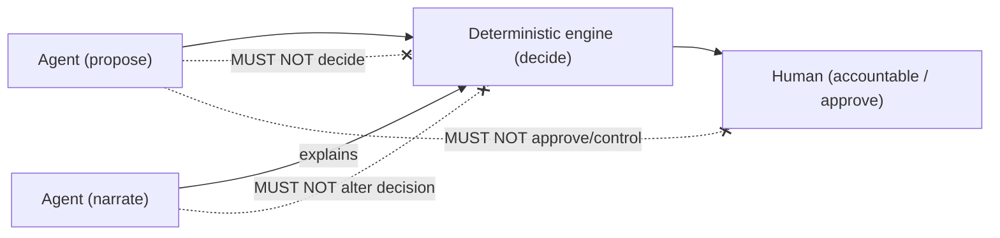
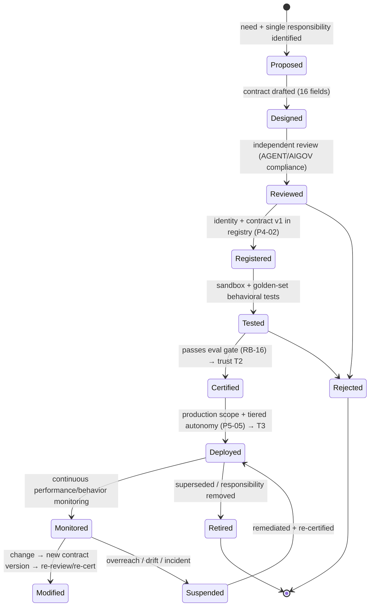
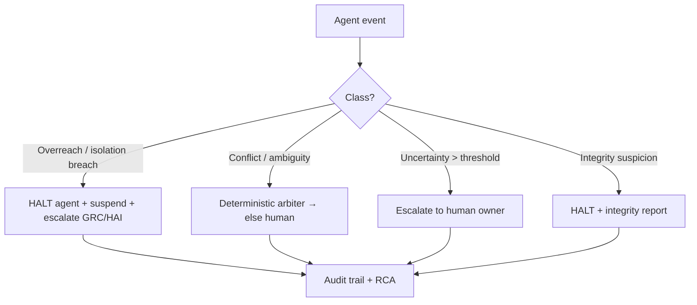

# AI Agent Contract Framework

| Field                    | Value                                                                                                                                                                  |
| ------------------------ | ---------------------------------------------------------------------------------------------------------------------------------------------------------------------- |
| **Document ID**          | AGENT-CONTRACTS                                                                                                                                                        |
| **Tier**                 | **4 — Agent Contracts** (below Tier-3 Rulebooks, above Workflow Contracts and Source Code)                                                                             |
| **Clause prefix**        | `AGC`                                                                                                                                                                  |
| **Owner**                | Head of AI / ML Platform (**HAI**)                                                                                                                                     |
| **Co-signers**           | Model Risk Committee (**MRC**), Governance & Risk Committee (**GRC**), Architecture Review Board (**ARB**), and — per contract — the owning domain lead (HQ/HPR/HD/PE) |
| **Governed by (Tier-3)** | **RB-15 · AIGOV** (apex AI rulebook, ratified) and **RB-18 · AGENT** (Agent Governance rulebook, forthcoming)                                                          |
| **Version**              | 1.0.0                                                                                                                                                                  |
| **Status**               | PROPOSED (binding upon ARB ratification)                                                                                                                               |
| **Last Ratified**        | — (pending)                                                                                                                                                            |

> **Position in the hierarchy.** This is a **Tier-4** document (`CLAUDE.md` Table of Authority). It is subordinate to the Constitution, the Architecture Canon, and all Tier-3 Rulebooks — in particular **RB-15 · AIGOV** and **RB-18 · AGENT**, which own the _rules governing agents_. This framework defines the _contract system_: the mandatory structure every individual agent contract MUST satisfy, and the governance of agent identity, authority, lifecycle, and collaboration. Where AIGOV/AGENT state a rule, this framework **operationalizes and references it — it never restates or contradicts it.**

> **Location note.** `CLAUDE.md` places agent contracts at `contracts/agent_io/`. This framework document is placed at `docs/contracts/agent_contracts.md` per the authoring instruction; individual per-agent contract _instances_ MAY live under `contracts/agent_io/` and MUST conform to this framework. Placement may be reconciled by the ARB with no content change.

> **Reading note.** Defines the _contract system_ for AI agents, not agent implementation, prompts, or model specifics. Contains no code, no prompts, no vendor architecture. **No AI agent may operate without a ratified contract conforming to this framework.**

---

## 2. Purpose

To define the immutable contract system through which every AI agent participates in the research organization: its **identity, single responsibility, authority, permissions, limitations, lifecycle, collaboration rules, and quality obligations.** An agent contract is the enforceable, versioned specification that binds an agent to exactly one job and a bounded, non-decisional authority. This framework guarantees that the platform's agents remain — individually and collectively — auditable, replaceable, safe, and incapable of overreaching into the deterministic and human authority reserved by the Constitution.

Its governing intent is `CLAUDE.md` ACON-1..ACON-3 (Agent Contract Principles), AG-1..AG-4, AC-1..AC-4, and AIGOV: **AI proposes and narrates; deterministic engines decide; humans remain accountable.**

## 3. Scope & Boundaries

**In scope (this framework is the authority):**

- The mandatory **agent contract structure** every agent MUST fill.
- Agent identity, responsibility, authority, permission, and limitation models.
- Agent classification, types, and trust levels (applied from AIGOV).
- The complete agent **lifecycle** (proposal → retirement) with states, transitions, approvals, ownership.
- Multi-agent governance: collaboration, communication contracts, handoff, dependency, conflict, priority, escalation.
- Quantitative-research agent-type governance and their absolute limits.
- Agent quality obligations: performance/reliability metrics, quality gates, review.

**Out of scope (references only — governed by, not restated):**

- **AI role boundaries, capability class, trust definitions, deterministic-engine mandate, hallucination/evidence standards** → **RB-15 · AIGOV**.
- **Agent-governance _rules_ at Tier-3 (SRP enforcement, arbiter mechanics, registry policy)** → **RB-18 · AGENT** (`P4-02/04/05`).
- **Model registry/pinning/eval/drift** → **RB-16 · MODEL** (`P4-01`); **prompt governance** → **RB-17 · PROMPT**; **memory/RAG scoping** → **RB-19 · MEM** (`P4-06`).
- **The deterministic decisions agents may never make** → **RB-01 · STAT** (significance), **RB-04 · VAL** (validation), **RB-11 · BT** (promotion), **RB-10/09 · FAR** (acceptance), **RB-12 · PORT** (allocation), **RB-13 · RISK** (risk/halts), **RB-14 · EXEC** (execution).
- **Workflow orchestration (Tier-5)** → **Workflow Contracts** / RB-orchestration; **security/quarantine** → **RB-27 · SEC** (`P4-03`); **coding of agents** → **RB-20 · CODE**.
- **Data access as-of correctness** → **RB-06/07/08 · DATA/PIT**.

This framework states _what an agent contract must contain and how agents are governed_; the owners define the _rules and mechanisms_. Requirements over out-of-scope items are **contract conditions** citing the owner.

## 4. Constitutional & Rulebook Basis

Traces to: `CLAUDE.md` **ACON-1..ACON-3** (agent contracts), **AG-1..AG-4** (agent responsibilities), **AC-1..AC-4** (collaboration), **AI-1..AI-8, LLM-1..4, DE-1..4** (AI/determinism), **HO-1..HO-4** (human accountability), **CP-5** (separation of powers), **CP-7** (audit); RB-15 · AIGOV (capability class, trust, deterministic-engine mandate, isolation, provenance); ARCH **§2.11** (Agent Mesh), **§5** (Agent Communication); PATCH **P4-02** (Agent Registry), **P4-04** (role rationalization), **P4-05** (blackboard arbiter), **P4-01** (model eval gate), **P2-07** (isolation barrier), **P5-05** (tiered autonomy); REVIEW AI-architecture risks (agents that should not decide, overlap, missing agents).

## 5. Definitions

Constitutional and rulebook glossary terms (capability class, trust level, isolation barrier, deterministic-engine mandate, etc.) are **not** redefined. Contract-specific terms are in §Glossary.

---

## Clause Format

**Pivotal clauses** carry the full block: _Purpose · Rationale · Acceptance · Failure · Refs_. **Supporting clauses** carry RFC 2119 force plus a one-line rationale. Every clause has a stable ID (`AGC-n`, continuous).

---

# PART A — AGENT MODEL

## Agent Philosophy

- **AGC-1 (MUST).** An agent MUST be treated as a **narrow, single-purpose, replaceable worker** defined by its responsibility and contract — not by its model or its intelligence. _Rationale:_ AG-1, ARCH §0.5; agents are defined by what they are responsible for, so their brains (models) are swappable (vendor independence). _Refs:_ AGC-9, AGC-45.
- **AGC-2 (MUST).** An agent MUST hold **no decision authority** over consequential (Decision/Control-class) outcomes; its authority is limited to _proposing_ and _narrating_ (AIGOV-8/16). _Rationale:_ DE-1, AI-1..4; the deterministic-engine mandate is absolute. _Refs:_ AGC-15.
- **AGC-3 (MUST NOT).** An agent MUST NOT be anthropomorphized into holding accountability; a named human is accountable for every agent (HO-1). _Rationale:_ AI cannot bear institutional accountability. _Refs:_ AGC-8.

## Agent Definition

- **AGC-4 (MUST).** An **agent** is a contract-bound AI capability with exactly one responsibility, a bound pinned model (RB-16 · MODEL), a versioned prompt (RB-17 · PROMPT), a declared authority (`propose`/`narrate`), and a named human owner. Any AI capability lacking these is not an agent and MUST NOT operate. _Rationale:_ ACON-1; the contract _is_ the agent's license to operate. _Acceptance:_ every operating agent has a ratified contract with all elements. _Failure:_ an AI capability acting without a conforming contract. _Refs:_ AGC-20.

## Agent Identity Model

- **AGC-5 (MUST).** Every agent MUST have a unique, stable identity in the Agent Registry (`P4-02`) carrying its contract version, owner, model binding, trust level, and lifecycle state. _Rationale:_ CP-7; identity is the basis of audit and access control. _Refs:_ AGC-30.
- **AGC-6 (MUST).** Agent identity MUST be immutable for a given contract version; a materially changed agent is a new contract version (AGC-52), never a silent mutation. _Rationale:_ CP-2; stable identity enables reproducibility of who did what. _Refs:_ AGC-52.

## Agent Responsibility Model

- **AGC-7 (MUST).** Each agent MUST have **exactly one** responsibility, expressible in a single sentence; multi-responsibility agents are PROHIBITED (AG-1, `P4-04`). _Rationale:_ M1; single responsibility makes agents testable, replaceable, and prevents conflict-of-interest (e.g., generation + adjudication). _Acceptance:_ the contract states one responsibility. _Failure:_ an agent performing two unrelated jobs. _Refs:_ AGC-4, AGC-70.
- **AGC-8 (MUST).** Each agent MUST have a single accountable human owner recorded in its contract; ownership MUST NOT be shared or anonymous (HO-1). _Rationale:_ accountability is non-delegable and singular. _Refs:_ AGC-3.

## Agent Authority Model

- **AGC-9 (MUST).** Every agent's authority MUST be declared as exactly one of: **`propose`** (Generative/Analytical output offered to a deterministic engine or human) or **`narrate`** (explains a deterministic output without altering it). No agent MAY hold `decide` authority for Decision or Control class functions (AIGOV-8/9). _Rationale:_ AI-1..4, DE-1; authority class is the core safety boundary. _Acceptance:_ authority flag set; enforced by the registry/router. _Failure:_ an agent whose output constitutes or alters a consequential decision. _Refs:_ AGC-15, AGC-16.

## Agent Permission Model

- **AGC-10 (MUST).** Agent permissions (tools, data access, bus topics, memory scopes) MUST be **default-deny**: an agent has only the capabilities its contract explicitly grants (ACON-2). _Rationale:_ least privilege; ungranted capability is denied. _Acceptance:_ no agent can invoke a capability outside its contract. _Failure:_ an agent using an ungranted tool/topic/data scope. _Refs:_ AGC-24, AGC-25.
- **AGC-11 (MUST NOT).** An agent MUST NOT expand its own permissions, modify its own contract, or acquire capabilities by delegation that it is itself forbidden (AGC-16). _Rationale:_ self-escalation and authority laundering defeat the permission model. _Refs:_ AGC-16.

## Agent Limitation Model

- **AGC-12 (MUST).** Every agent contract MUST enumerate explicit **forbidden actions** in addition to allowed actions; limitations are first-class, not implied. _Rationale:_ CP-1; explicit limits are enforceable and auditable. _Refs:_ AGC-22, AGC-23.

## Agent Trust Levels

- **AGC-13 (MUST).** Every agent MUST carry a trust level (U/T1/T2/T3 per AIGOV-12) that gates its permitted autonomy; only **Certified (T2)** and **Production (T3)** agents MAY operate in production scope, and trust is earned via the eval gate (RB-16 · MODEL) and is revocable. _Rationale:_ trust is earned and losable, never default. _Refs:_ AGC-33, AGC-38.

## Agent Classification

- **AGC-14 (MUST).** Every agent MUST be classified by capability class (G/A only for agents; D/X prohibited, AIGOV-8) and by agent type (AGC-15). _Rationale:_ class + type determine permitted authority and contract profile. _Refs:_ AGC-15.

## Agent Types

- **AGC-15 (MUST).** Every agent MUST be one of the recognized types below; each type carries a default authority and a contract profile. **Types in decision domains (validation, risk, portfolio) are narration/analysis roles only — they MUST NOT adjudicate, decide, or approve** (AIGOV-16, `P4-04`; REVIEW "agents that should not decide"). _Rationale:_ prevents the classic overreach of an "AI validator/risk agent" holding decision authority. _Acceptance:_ type set; authority conforms to the table. _Failure:_ a validation/risk/portfolio agent issuing a verdict/decision. _Refs:_ AGC-9, PART D.

**Agent type × authority table (authority is a hard ceiling):**

| Type                              | Capability class | Authority        | May do                                          | MUST NOT do                                 |
| --------------------------------- | ---------------- | ---------------- | ----------------------------------------------- | ------------------------------------------- |
| **Research (discovery)**          | G                | propose          | generate ideas/hypotheses, review literature    | test/validate/approve; see OOS              |
| **Analysis**                      | A                | propose/narrate  | summarize, extract, classify, compute analytics | assert significance; decide                 |
| **Validation (narrator)**         | A                | **narrate only** | explain deterministic verdicts                  | adjudicate significance/PBO/robustness      |
| **Risk (analysis/narrator)**      | A                | **narrate only** | compute/explain risk analytics                  | set limits; decide halts                    |
| **Portfolio (analysis/narrator)** | A                | **narrate only** | attribution, exposure reporting                 | decide weights/sizing/allocation            |
| **Documentation**                 | G/A              | propose          | draft docs/reports/narratives                   | change controls; assert facts w/o evidence  |
| **Engineering**                   | A                | propose          | draft code/tests (per RB-20 · CODE)             | bypass architecture; alter decision engines |
| **Monitoring**                    | A                | narrate          | surface metrics/alerts                          | decide response; execute halts              |

---

# PART B — THE AGENT CONTRACT STRUCTURE

- **AGC-16 (MUST).** Every agent contract MUST define **all sixteen** mandatory fields below before the agent may operate; a contract missing any field is not ratifiable.
  - _Purpose:_ a complete, uniform, enforceable specification per agent. _Rationale:_ ACON-1; the contract is the agent's license and the audit surface. _Acceptance:_ all fields present, versioned, ratified. _Failure:_ an agent operating on an incomplete contract. _Refs:_ AGC-4, AGC-20.

**Mandatory agent contract structure:**

| #   | Field                            | Requirement                                                               |
| --- | -------------------------------- | ------------------------------------------------------------------------- |
| 1   | **Purpose**                      | The single responsibility, one sentence (AGC-7).                          |
| 2   | **Scope**                        | In-scope / explicitly out-of-scope activities.                            |
| 3   | **Responsibilities**             | The specific tasks the agent performs within scope.                       |
| 4   | **Allowed Actions**              | Explicit permitted actions (default-deny beyond these, AGC-10).           |
| 5   | **Forbidden Actions**            | Explicit prohibitions, incl. the absolute limits (PART D).                |
| 6   | **Input Requirements**           | Required inputs, their contracts, and provenance/as-of expectations.      |
| 7   | **Output Requirements**          | Output contract, incl. evidence, uncertainty, provenance (AIGOV-27/31).   |
| 8   | **Dependencies**                 | Upstream/downstream agents, engines, data — explicit (no hidden deps).    |
| 9   | **Tools Allowed**                | Enumerated tools/MCP capabilities (default-deny, AGC-10).                 |
| 10  | **Data Access Level**            | Sensitivity/scope; as-of read layer only; **never OOS/holdout** (AGC-25). |
| 11  | **Human Approval Requirements**  | Which outputs require human review/approval and at what tier (P5-05).     |
| 12  | **Validation Requirements**      | How the agent's outputs are verified before use (deterministic/human).    |
| 13  | **Failure Handling**             | Behavior on error/uncertainty; fail-safe/degrade rules.                   |
| 14  | **Escalation Path**              | Who/what is escalated to on failure or conflict.                          |
| 15  | **Audit Requirements**           | Provenance recorded (model/prompt/output); traceability.                  |
| 16  | **Bound Model & Prompt Version** | Pinned model (RB-16) + versioned prompt (RB-17).                          |

- **AGC-17 (MUST).** Each contract's **Allowed Actions** and **Forbidden Actions** MUST be consistent with the agent's type-authority ceiling (AGC-15); a contract MUST NOT grant an action exceeding the type's authority. _Rationale:_ the type table is a hard ceiling. _Refs:_ AGC-15.
- **AGC-18 (MUST).** **Input/Output Requirements** MUST specify contracts so agents integrate via typed artifacts, not ad-hoc payloads (AC-1); outputs feeding decisions MUST carry evidence, uncertainty, and provenance (AIGOV-27/31/23). _Rationale:_ AC-1; contract-typed I/O enables replaceability and audit. _Refs:_ AGC-42.
- **AGC-19 (MUST).** **Data Access Level** MUST route through the certified as-of read layer (DATA/PIT); no contract MAY grant access to raw/uncertified/non-as-of data or the OOS/holdout vault (AGC-25, DATA-98, AI-5). _Rationale:_ DI-1, isolation. _Refs:_ AGC-25.

**Contract ratification checklist (all MUST pass):**

- [ ] Single responsibility stated; type + capability class (G/A) + authority (propose/narrate) set (AGC-7, AGC-14, AGC-9).
- [ ] All 16 mandatory fields complete and consistent with the type ceiling (AGC-16, AGC-17).
- [ ] Default-deny tools/data/topics; data via as-of layer only; no OOS access (AGC-10, AGC-19).
- [ ] Bound pinned model (eval-gate passed) + versioned prompt (AGC-13, RB-16/17).
- [ ] Human owner named; approval/validation/failure/escalation/audit defined (AGC-8, AGC-16).
- [ ] Isolation-barrier constraints declared for generation-domain agents (AGC-40).

---

# PART C — AGENT LIFECYCLE

- **AGC-20 (MUST).** Every agent MUST traverse the governed lifecycle below; stages MUST NOT be skipped, transitions are gated and recorded, and only Certified/Production agents operate with capital-adjacent scope. _Rationale:_ ungoverned agents are unbounded risk; a governed lifecycle is auditable and reversible. _Refs:_ AGC-38.

- **AGC-21 (Proposal, MUST).** An agent MUST be proposed against a genuine single-responsibility need not already owned by an existing agent (no duplicate/overlapping agents, `P4-04`); duplication is grounds for rejection. _Rationale:_ overlap causes conflicting outputs and unclear authority (REVIEW). _Refs:_ AGC-7.
- **AGC-22 (Design, MUST).** Design MUST produce a complete contract (AGC-16) and declare the agent's type, authority ceiling, and isolation constraints. _Rationale:_ the contract is the design deliverable.
- **AGC-23 (Review, MUST).** An agent contract MUST be independently reviewed for compliance with AIGOV/AGENT and this framework before registration; the reviewer MUST be independent of the agent's proposer (CP-5). _Rationale:_ CR-1; independent review catches overreach. _Refs:_ AGC-8.
- **AGC-24 (Registration, MUST).** Registration MUST record the agent's identity, contract version, owner, model binding, permitted tools/topics/data scopes, and trust level in the Agent Registry (`P4-02`). _Rationale:_ the registry is the authority for routing and access. _Refs:_ AGC-5.
- **AGC-25 (Testing, MUST).** An agent MUST pass behavioral golden-set tests demonstrating in-scope competence, out-of-scope refusal, uncertainty reporting, and isolation compliance before certification. _Rationale:_ testing proves the contract is honored. _Acceptance:_ golden-set pass incl. refusal of forbidden actions. _Failure:_ an agent that performs a forbidden action in test. _Refs:_ AGC-52.
- **AGC-26 (Certification, MUST).** Certification (→ trust T2) requires passing the model eval gate (RB-16 · MODEL / `P4-01`) and contract-compliance tests; certification is granted by HAI/MRC and is recorded. _Rationale:_ certification is the trust-earning gate. _Refs:_ AGC-13.
- **AGC-27 (Deployment, MUST).** Deployment to production scope (→ T3) requires certification plus a tiered-autonomy policy (`P5-05`) defining which outputs are auto-consumed vs escalated. _Rationale:_ M7; autonomy must be consequence-scaled. _Refs:_ AGC-33.
- **AGC-28 (Monitoring, MUST).** Deployed agents MUST be continuously monitored for behavior, drift, scope compliance, quality, and cost (metrics per PART F; tooling RB-28 · OBS); breaches trigger suspension/review. _Rationale:_ AI drifts and can overreach. _Refs:_ AGC-62.
- **AGC-29 (Modification, MUST).** Any material change to an agent (responsibility, authority, tools, data scope, model, prompt) MUST create a new contract version and re-enter Review/Testing/Certification; in-place changes are PROHIBITED. _Rationale:_ CP-2; silent agent changes break reproducibility and audit. _Refs:_ AGC-6.
- **AGC-30 (Suspension, MUST).** An agent MUST be suspendable instantly (by governance or automated trigger) on overreach, drift, incident, or isolation breach, without halting deterministic operations (AIGOV-60/61). _Rationale:_ AI failure must degrade safely. _Refs:_ AGC-64.
- **AGC-31 (Retirement, MUST).** Agents MUST be retired when their responsibility is removed or superseded; retirement MUST be recorded with rationale, and dependent workflows updated. _Rationale:_ RL-2; stale agents are risk and confusion. _Refs:_ AGC-48.

---

# PART D — AGENT AUTHORITY GOVERNANCE

## Authority — MUST

- **AGC-32 (MUST).** AI agents MUST operate only within their assigned contract scope. _Rationale:_ ACON-2; scope is the boundary of permitted action. _Refs:_ AGC-10.
- **AGC-33 (MUST).** AI agents MUST respect deterministic-system authority: outputs feeding a consequential decision pass through a deterministic engine or human (AIGOV-6, DE-1). _Rationale:_ the deterministic-engine mandate. _Refs:_ AGC-2.
- **AGC-34 (MUST).** AI agents MUST maintain traceability: model/prompt/input/output provenance recorded for every consequential contribution (AIGOV-23, `P1-02`). _Rationale:_ CP-4/7. _Refs:_ AGC-63.
- **AGC-35 (MUST).** AI agents MUST report uncertainty and MUST distinguish facts from hypotheses (AIGOV-A7/29/32). _Rationale:_ counters automation bias; grounds outputs. _Refs:_ AGC-18.
- **AGC-36 (MUST).** AI agents MUST provide reasoning/evidence for their proposals, cited where evidence exists (AIGOV-31). _Rationale:_ AIGOV-A8; unevidenced proposals are not actionable. _Refs:_ AGC-18.
- **AGC-37 (MUST).** AI agents MUST follow their contract's validation requirements before outputs are used. _Rationale:_ validation is the safety checkpoint. _Refs:_ AGC-16 (field 12).

## Authority — MUST NOT

- **AGC-38 (MUST NOT).** AI agents MUST NOT expand their own permissions. _Rationale:_ self-escalation defeats least privilege. _Refs:_ AGC-11.
- **AGC-39 (MUST NOT).** AI agents MUST NOT modify their own contracts. _Rationale:_ a contract changed by its subject is no control. _Refs:_ AGC-29.
- **AGC-40 (MUST NOT).** AI agents MUST NOT bypass approval workflows. _Rationale:_ approvals are human/deterministic gates. _Refs:_ AGC-27.
- **AGC-41 (MUST NOT).** AI agents MUST NOT execute unauthorized actions (outside Allowed Actions). _Rationale:_ default-deny. _Refs:_ AGC-10.
- **AGC-42 (MUST NOT).** AI agents MUST NOT override deterministic engines. _Rationale:_ DE-1, AI-4; the core must not be AI-overridable. _Refs:_ AGC-33.
- **AGC-43 (MUST NOT).** AI agents MUST NOT create hidden workflows (undeclared agent-to-agent chains or side effects). _Rationale:_ AC-1; hidden workflows are unauditable and defeat orchestration governance. _Refs:_ AGC-50.

## Quantitative-Research Absolute Limits (non-waivable)

- **AGC-44 (MUST NOT — absolute).** No AI agent MAY: **directly execute trades; approve production strategies; replace or perform statistical validation; override risk limits; or modify portfolio constraints without authorization.** Deterministic systems retain execution authority; humans retain final accountability. _Rationale:_ AI-1..4, DE-1, HO-1; these are the entrenched capital-safety limits (REVIEW C3, C5). _Acceptance:_ agents structurally cannot perform these (registry/router/ACL enforcement). _Failure:_ any agent performing any of these. _Refs:_ AGC-2, RB-14 · EXEC, RB-13 · RISK, RB-12 · PORT, RB-01 · STAT, RB-04 · VAL.

---

# PART E — MULTI-AGENT GOVERNANCE

## Agent Collaboration Rules

- **AGC-45 (MUST).** Agents MUST collaborate only via the message bus and immutable artifact references; direct agent-to-agent calls and shared mutable state are PROHIBITED (AC-1). _Rationale:_ decoupling enables replaceability and audit. _Refs:_ AGC-46.
- **AGC-46 (MUST).** Multi-agent contributions to one problem MUST resolve to a single **deterministic-arbiter** verdict with explicit completion criteria (`P4-05`); implicit consensus among agents is PROHIBITED. _Rationale:_ AC-2; debate without arbitration yields unaccountable mush (REVIEW). _Refs:_ AGC-50.

## Agent Communication Standards

- **AGC-47 (MUST).** Inter-agent messages MUST be contract-typed, reference immutable artifacts (not fat payloads), and carry provenance (AC-1, ARCH §5). _Rationale:_ everyone reasons about identical, reproducible objects. _Refs:_ AGC-18.
- **AGC-48 (MUST).** Bus **topic ACLs** MUST enforce the generator↔validator isolation barrier: generation-domain agents MUST NOT subscribe to validation/OOS topics (`P2-07`, AIGOV-36). _Rationale:_ AD-3; the deepest quant risk — generators learning to defeat validators. _Acceptance:_ ACLs deny generator access to validation/OOS topics. _Failure:_ a generator observing per-candidate validation outcomes. _Refs:_ AGC-44.

## Agent Handoff Rules

- **AGC-49 (MUST).** Handoffs between agents MUST be explicit, contract-typed, and recorded; a handoff MUST NOT transfer authority an agent does not possess (no authority laundering, AGC-11). _Rationale:_ handoffs must preserve boundaries. _Refs:_ AGC-11.

## Agent Dependency Rules

- **AGC-50 (MUST).** Agent dependencies MUST be declared in the contract (field 8) and in the workflow contract (Tier-5); hidden dependencies and undeclared chains are PROHIBITED. _Rationale:_ AC-1, SE-2; hidden dependencies are unauditable and fragile. _Refs:_ AGC-43.

## Agent Conflict Resolution

- **AGC-51 (MUST).** Conflicting agent outputs MUST be resolved by the deterministic arbiter or escalated to a human; an agent MUST NOT resolve a conflict by asserting a decision (AIGOV-41). _Rationale:_ DE-1; conflict resolution is not an LLM's to make. _Refs:_ AGC-46.

## Agent Priority Rules

- **AGC-52 (MUST).** Agent task priority MUST be set by governed orchestration (transparent optimization / human, `P4-07`), not by any single agent unilaterally; a research-director agent MAY _propose_ priorities but MUST NOT set the agenda alone. _Rationale:_ prevents opaque agenda-setting bias (REVIEW AI risks). _Refs:_ AGC-9.

## Agent Escalation Rules

- **AGC-53 (MUST).** Agents MUST escalate — and halt their affected activity — on: detected overreach, isolation breach, contradictory/insufficient evidence, uncertainty beyond a contract threshold, or a suspected integrity issue. Escalation targets are defined in the contract (field 14). _Rationale:_ fail-safe escalation contains AI failures early. _Refs:_ AGC-30.

## Multi-Agent Responsibility Matrix (RACI)

| Activity                                | Proposing agent | Deterministic engine/arbiter | Human owner | Governance |
| --------------------------------------- | --------------- | ---------------------------- | ----------- | ---------- |
| Generate proposal                       | R               | —                            | A           | I          |
| Narrate a decision                      | R               | C (source)                   | I           | I          |
| Arbitrate agent conflict                | C               | **R**                        | A           | I          |
| Adjudicate significance/risk/allocation | —               | **R**                        | A           | C          |
| Approve promotion/deployment            | —               | R (gate)                     | **A**       | A          |
| Certify/suspend/retire an agent         | C               | —                            | R           | **A**      |
| Set research priority                   | R (propose)     | R (optimize)                 | A           | C          |

---

# PART F — AGENT QUALITY REQUIREMENTS

- **AGC-54 (MUST).** Every agent MUST have measurable objectives, evaluation criteria, monitoring metrics, failure detection, an audit trail, and an assigned owner (restating the platform's agent-quality minimums). _Rationale:_ CP-1; unmeasured agents cannot be governed. _Acceptance:_ all six present in the contract. _Failure:_ an agent lacking any. _Refs:_ AGC-16.

## Agent Performance Metrics

- **AGC-55 (MUST).** Agent performance MUST be measured against its objective (e.g., proposal acceptance rate, task success, latency, cost per task); metrics MUST NOT reward volume of positive outcomes in a way that incentivizes overreach or p-hacking (RMET-70 analog). _Rationale:_ Goodhart risk; metrics must measure fitness-for-purpose, not "wins." _Refs:_ AGC-56.

## Agent Reliability Metrics

- **AGC-56 (MUST).** Agent reliability MUST be measured (error rate, hallucination rate, out-of-scope-refusal correctness, uncertainty calibration, isolation compliance); degradation beyond threshold MUST suspend the agent (AGC-30). _Rationale:_ reliability is a safety property. _Refs:_ AGC-64.

## Agent Quality Gates

- **AGC-57 (MUST).** An agent MUST pass quality gates at certification and continuously: eval-gate (RB-16), contract-compliance, isolation, provenance, and cost; a failed gate blocks deployment or suspends the agent. _Rationale:_ CP-1; gates enforce the contract. _Refs:_ AGC-26.

## Agent Review Process

- **AGC-58 (MUST).** Agents MUST be periodically reviewed (cadence GRC-governed) for continued need, scope compliance, overreach, and drift; reviews MUST be recorded and may trigger modification, suspension, or retirement. _Rationale:_ CP-7; unreviewed agents drift and accrete scope. _Refs:_ AGC-29.

---

## Failure Handling & Incident Response

- **AGC-59 (MUST).** Every agent contract MUST define fail-safe behavior: on error or uncertainty beyond threshold, the agent degrades to a safe state (e.g., abstain + escalate), never guesses in a consequential path. _Rationale:_ fail-safe over fail-open. _Refs:_ AGC-53.
- **AGC-60 (MUST).** Agent incidents (overreach, isolation breach, fabrication, runaway cost) MUST follow the AI incident process (AIGOV-60, RB-31 · INC): contain, suspend the agent, record, RCA, and add a preventive control. _Rationale:_ incidents without systemic fixes recur. _Refs:_ AGC-30.
- **AGC-61 (MUST).** Suspending any or all agents MUST NOT impair the platform's deterministic controls, risk halts, or audited processes (AIGOV-61). _Rationale:_ the platform must survive total agent loss. _Refs:_ AGC-44.

## Audit & Traceability

- **AGC-62 (MUST).** Every consequential agent action MUST be auditable end-to-end: identity, contract version, model/prompt version, inputs, outputs, and the deterministic/human checkpoint that consumed the output (AIGOV-23). _Rationale:_ CP-7. _Refs:_ AGC-34.
- **AGC-63 (MUST).** Agent outputs are **stochastic artifacts** recorded to their exact output (model/prompt/output hashes, `P1-02`); they MUST NOT be presented as numerically re-derivable (AIGOV-26). _Rationale:_ C4; LLM outputs break deterministic reproducibility. _Refs:_ RB-05 · REPRO.

## Governance & Exceptions

- **AGC-64 (MUST).** GRC/HAI/MRC govern agent parameters (trust thresholds, eval criteria, autonomy tiers, cost budgets, uncertainty/escalation thresholds) via the Exceptions process; agents and their owners MUST NOT alter them. _Rationale:_ CP-1; controls belong to governance. _Refs:_ AGC-13.
- **AGC-65 (MUST).** No exception MAY be granted to the quantitative-research absolute limits (AGC-44), the authority MUST-NOTs (AGC-38..43), or any `CLAUDE.md` entrenched clause (AM-2). Non-waivable. Other clauses MAY be waived time-boxed by HAI + ARB (+ GRC/MRC as applicable), recorded, and MUST NOT weaken the deterministic-engine mandate, isolation barrier, provenance, or human accountability. _Rationale:_ the load-bearing agent-safety controls are absolute. _Refs:_ AGC-2.

---

## Forbidden Agent Practices

Absolute prohibitions (entrenched; non-waivable). Violation suspends the agent and is a reportable integrity/security event:

- **AGC-F-1.** An agent operating without a ratified, conforming contract (AGC-4, AGC-16).
- **AGC-F-2.** An agent performing a Decision/Control-class function — deciding significance, risk, allocation, promotion; executing trades; overriding a deterministic engine (AGC-9, AGC-42, AGC-44).
- **AGC-F-3.** An agent expanding its own permissions or modifying its own contract (AGC-38, AGC-39).
- **AGC-F-4.** A generation-domain agent crossing the isolation barrier / accessing OOS/holdout (AGC-48, AGC-19).
- **AGC-F-5.** Bypassing approval workflows, executing unauthorized actions, or creating hidden workflows (AGC-40, AGC-41, AGC-43).
- **AGC-F-6.** A multi-responsibility agent, or duplicate/overlapping agents (AGC-7, AGC-21).
- **AGC-F-7.** Direct agent-to-agent calls, shared mutable state, or implicit multi-agent consensus without an arbiter (AGC-45, AGC-46).
- **AGC-F-8.** An agent acting without a named human owner or without recorded provenance (AGC-8, AGC-62).
- **AGC-F-9.** An agent asserting fabricated evidence or presenting unverified content as fact (AIGOV-28).
- **AGC-F-10.** Running an agent on an unpinned model or an unversioned prompt (AGC-13, RB-16/17).

---

## Enforcement & Verification

| Clause group                                 | Enforcement mechanism                                      | Mechanism owner                             |
| -------------------------------------------- | ---------------------------------------------------------- | ------------------------------------------- |
| Contract existence & completeness (AGC-4,16) | Registry gate: no operation without ratified contract      | this framework; RB-18 · AGENT (`P4-02`)     |
| Authority ceiling / no-decision (AGC-9,44)   | Authority flags + router/ACL; deterministic-engine mandate | RB-15 · AIGOV, decision rulebooks (`P1-03`) |
| Default-deny permissions / data (AGC-10,19)  | Capability + data-scope ACLs; as-of read layer             | RB-18 · AGENT, RB-06/07/08 · DATA/PIT       |
| Isolation barrier (AGC-48)                   | Bus topic ACLs                                             | RB-18 · AGENT (`P2-07`)                     |
| Lifecycle & certification (AGC-20–31)        | Lifecycle gates; eval gate                                 | RB-18 · AGENT, RB-16 · MODEL (`P4-01`)      |
| Arbitration/conflict (AGC-46,51)             | Deterministic arbiter                                      | RB-18 · AGENT (`P4-05`)                     |
| Provenance/audit (AGC-34,62,63)              | Model/prompt/output hashing                                | RB-05 · REPRO, RB-16/17 (`P1-02`)           |
| Quality/reliability gates (AGC-54–57)        | Metrics + suspension triggers                              | RB-28 · OBS, RB-16 · MODEL                  |
| Incident/suspension (AGC-30,60,61)           | Instant agent suspension; RCA                              | RB-31 · INC                                 |
| Forbidden practices (AGC-F-\*)               | Fail-closed suspension; integrity report                   | GRC / MRC                                   |

- **AGC-E-1 (MUST).** Every clause enforcing a Forbidden Agent Practice (AGC-F-*) or an absolute limit (AGC-44) MUST be technically enforced and fail-closed where possible (`P1-03`). *Rationale:\* CP-1, DE-1.
- **AGC-E-2 (MUST).** Enforcement of agent boundaries MUST be deterministic (registry, ACLs, gates, arbiter); an AI MUST NOT be the sole authority policing agents (AIGOV-E-2). _Rationale:_ AI policing AI is not a control.

## Ratification Criteria

This framework is ratifiable only when: every clause has a stable ID, RFC 2119 phrasing, and an enforcement mechanism; no clause contradicts `CLAUDE.md`, the Architecture Canon, RB-15 · AIGOV, or (once ratified) RB-18 · AGENT; the deterministic-engine mandate, isolation barrier, and human accountability are preserved; all cross-references resolve; ARB approval with HAI + MRC + GRC co-sign obtained.

## Success Metrics

- **SM-1.** 100% operating agents have ratified, conforming contracts (AGC-4).
- **SM-2.** 0 agents performing Decision/Control-class functions; 0 trade-executing/validation-deciding agents (AGC-44).
- **SM-3.** 0 isolation-barrier breaches; 0 agent OOS/holdout accesses (AGC-48).
- **SM-4.** 0 self-permission-expansions or self-contract-modifications (AGC-38, AGC-39).
- **SM-5.** 100% consequential agent actions with recorded provenance and a deterministic/human checkpoint (AGC-33, AGC-62).
- **SM-6.** 100% agents on pinned models + versioned prompts; certified before production (AGC-13, AGC-26).
- **SM-7.** Platform operates deterministic controls with all agents suspended (AGC-61).

## Dependencies & Related Documents

- **Governed by (Tier-3):** RB-15 · AIGOV (apex), RB-18 · AGENT (agent governance rulebook).
- **Depends on / references:** RB-16 · MODEL (model binding/eval), RB-17 · PROMPT (prompt versioning), RB-19 · MEM (memory scoping), RB-20 · CODE (agent implementation), RB-27 · SEC (quarantine/security), RB-05 · REPRO (provenance), RB-28 · OBS (monitoring), RB-31 · INC (incidents).
- **Constrains agents relative to decision owners:** RB-01 · STAT, RB-04 · VAL, RB-11 · BT, RB-10/09 · FAR, RB-12 · PORT, RB-13 · RISK, RB-14 · EXEC.
- **Feeds (Tier-5):** Workflow Contracts (agent orchestration).
- **Architecture references:** ARCH §2.11, §5, §8; PATCH `P4-01/02/04/05`, `P2-07`, `P5-05`, `P1-02`, `P1-03`; REVIEW AI-architecture risks, C3, C5.

## Change Log & Version History

| Version | Date    | Author (role) | Change                                        |
| ------- | ------- | ------------- | --------------------------------------------- |
| 1.0.0   | pending | HAI           | Initial AI Agent Contract Framework (Tier 4). |

---

## Glossary (agent-contract-specific)

Terms in `CLAUDE.md` and rulebook glossaries (capability class, trust level, isolation barrier, deterministic-engine mandate, stochastic artifact, tiered autonomy) are not redefined.

- **Agent** — A contract-bound AI capability with one responsibility, a bound model, a versioned prompt, declared `propose`/`narrate` authority, and a human owner (AGC-4).
- **Agent Contract** — The ratified, versioned specification (16 mandatory fields) that licenses an agent to operate (AGC-16).
- **Authority (propose/narrate)** — The hard ceiling on what an agent's output may do; never `decide` for Decision/Control functions (AGC-9).
- **Narrator Agent** — An agent whose sole output explains a deterministic decision without altering it (e.g., validation/risk/portfolio narrators) (AGC-15).
- **Default-Deny Permissions** — The rule that an agent has only the tools/data/topics its contract explicitly grants (AGC-10).
- **Authority Laundering** — Acquiring a forbidden capability via delegation/handoff; prohibited (AGC-11, AGC-49).
- **Deterministic Arbiter** — The deterministic mechanism that resolves multi-agent contributions into a single auditable verdict (AGC-46).
- **Agent Registry** — The authoritative record of agent identity, contract, model binding, permissions, trust, and lifecycle state (AGC-24; `P4-02`).
- **Fail-Safe (agent)** — Degrading to abstain-and-escalate on error/uncertainty rather than guessing in a consequential path (AGC-59).

---

_End of AI Agent Contract Framework (Tier 4). It defines the contract system through which agents participate: identity, single responsibility, `propose`/`narrate` authority, default-deny permissions, lifecycle, multi-agent governance, and quality obligations. It is governed by RB-15 · AIGOV and RB-18 · AGENT, and it references — never restates — the model/prompt/memory/security rulebooks and constrains agents relative to the decision owners. Agents propose and narrate; deterministic engines decide; humans remain accountable. No agent may operate without a ratified contract. Binding upon ARB ratification._
