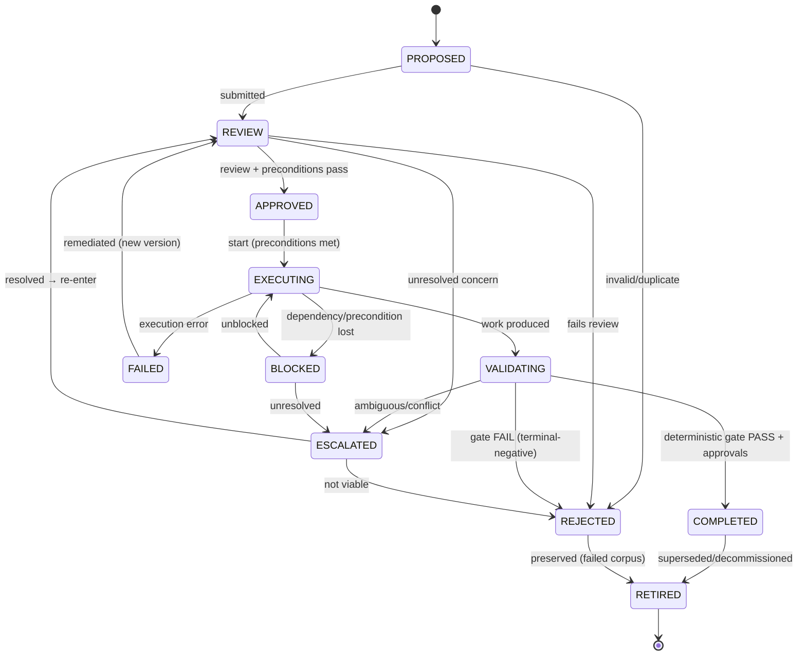
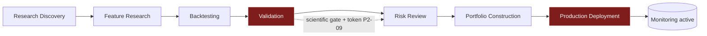

# Workflow Contract Framework

| Field                     | Value                                                                                                                              |
| ------------------------- | ---------------------------------------------------------------------------------------------------------------------------------- |
| **Document ID**           | WORKFLOW-CONTRACTS                                                                                                                 |
| **Tier**                  | **5 — Workflow Contracts** (below Tier-4 Agent Contracts, above Source Code)                                                       |
| **Clause prefix**         | `WFC`                                                                                                                              |
| **Owner**                 | Head of Platform / SRE (**HSRE**) for orchestration; each workflow additionally owned by its domain lead (HQ/HPR/HD/HAI)           |
| **Co-signers**            | Governance & Risk Committee (**GRC**), Architecture Review Board (**ARB**), and the domain leads whose gates a workflow chains     |
| **Governed by (Tier ≤3)** | `CLAUDE.md` **WCON-1..3**; the orchestration architecture (ARCH §2.12); and every decision rulebook whose gates a workflow invokes |
| **Version**               | 1.0.0                                                                                                                              |
| **Status**                | PROPOSED (binding upon ARB ratification)                                                                                           |
| **Last Ratified**         | — (pending)                                                                                                                        |

> **Position in the hierarchy.** This is a **Tier-5** document (`CLAUDE.md` Table of Authority). It is subordinate to the Constitution, Architecture Canon, all Tier-3 Rulebooks, and the Tier-4 Agent Contracts. Workflows **orchestrate** — they sequence and gate the work of AI agents (Tier-4), deterministic engines, and humans. A workflow **never contains decision logic**; it invokes the deterministic gates and human approvals defined by the owning rulebooks. This framework defines the _workflow contract system_ and references — never restates — those gates.

> **Location note.** `CLAUDE.md` places workflow contracts at `contracts/workflows/`. This framework document is placed at `docs/contracts/workflow_contracts.md` per the authoring instruction; individual workflow _instances_ MAY live under `contracts/workflows/` and MUST conform to this framework.

> **Reading note.** Defines the _workflow contract system_, not orchestration implementation, DAG engines, or tooling. Contains no code, no tool-specific designs. **No critical system activity may occur outside an approved workflow contract.**

---

## 2. Purpose

To define the immutable contract system through which work moves across the research organization: the valid **states, transitions, preconditions, postconditions, validation gates, approval gates, failure states, and recovery** for every critical activity — and the rules for how AI agents, deterministic engines, and humans participate. A workflow contract is the enforceable, versioned specification that guarantees work advances only through governed, gated, auditable steps, so that **no research reaches capital except through the full chain of deterministic validation and human approval.**

Its governing intent is `CLAUDE.md` WCON-1..3, RG-1..3, DEP-1..4, and RL-1: every process is a durable, gated, auditable workflow; a workflow orchestrates but never adjudicates; and consequential transitions require deterministic gates and human accountability.

## 3. Scope & Boundaries

**In scope (this framework is the authority):**

- The mandatory **workflow contract structure** every workflow MUST fill.
- The **universal workflow state machine**, allowed/forbidden transitions, and approval requirements.
- Workflow identity, ownership, responsibility, and authority models.
- Preconditions, postconditions, validation gates, approval gates, failure states, recovery.
- The specific **quantitative-research workflows** (discovery → feature → backtest → validation → risk → portfolio → deployment) as chained contracts.
- Multi-agent workflow governance: handoff, dependency, parallel/sequential execution, conflict, ownership transfer, escalation.
- Workflow audit and traceability requirements.

**Out of scope (references only — governed by, not restated):**

- **The decisions/gates inside workflows** — significance (RB-01 · STAT), validation/holdout/replication/scientific gate (RB-04 · VAL, `P2-05..09`), backtest evidence (RB-11 · BT), feature/factor acceptance (RB-10/09 · FAR), risk sign-off/limits/kill-switch (RB-13 · RISK), portfolio construction (RB-12 · PORT), release/rollback (RB-30 · DEPLOY), execution (RB-14 · EXEC).
- **Research _process_ rules** (pre-registration, idea/hypothesis lifecycle) → **RB-02 · RMET**.
- **Agent participation rules** → **Tier-4 Agent Contracts** + **RB-15 · AIGOV**, **RB-18 · AGENT**.
- **Orchestration _mechanism_** (DAG engine, scheduler, saga coordinator, run ledger, budget governor) → ARCH §2.12 / orchestration implementation.
- **Reproducibility/manifests** → **RB-05 · REPRO**; **audit-trail integrity** → **RB-27 · SEC** (`P1-09`); **data/as-of** → **RB-06/07/08 · DATA/PIT**.

This framework states _how work must flow and be gated_; the owners define the _gate logic_ and _mechanisms_. Requirements over out-of-scope items are **workflow conditions** citing the owner.

## 4. Constitutional & Rulebook Basis

Traces to: `CLAUDE.md` **WCON-1..3** (workflow contracts), **RG-1..3** (research/promotion governance), **DEP-1..4** (paper-first, reversible, gates), **RL-1** (lifecycle transitions), **AC-1..4** (collaboration), **AI-1..8, DE-1..4** (AI/determinism), **HO-1..4** (human accountability), **CP-5** (separation), **CP-7** (audit); the **First-Capital & Live-Capital Gates** (PATCH §5); ARCH **§2.12** (Orchestration), **§4** (Research Flow); PATCH **P2-05..P2-09** (validation/holdout/replication/scientific gate), **P5-05** (tiered autonomy), **P2-07** (isolation barrier), **P1-02** (reproducibility); REVIEW C5 (governance independence), C6 (holdout), the generator-defeats-validator risk.

## 5. Definitions

Constitutional, rulebook, and Agent-Contract glossary terms (capability class, trust, isolation barrier, deterministic-engine mandate, capital-eligibility token, etc.) are **not** redefined. Workflow-specific terms are in §Glossary.

---

## Clause Format

**Pivotal clauses** carry the full block: _Purpose · Rationale · Acceptance · Failure · Refs_. **Supporting clauses** carry RFC 2119 force plus a one-line rationale. Every clause has a stable ID (`WFC-n`, continuous).

---

# PART A — WORKFLOW MODEL

## Workflow Philosophy

- **WFC-1 (MUST).** Critical work MUST move only through **approved, gated, auditable workflows**; ad-hoc progression of consequential activity outside a workflow contract is PROHIBITED. _Rationale:_ WCON-1, RL-1; ungoverned flow is how controls get skipped. _Refs:_ WFC-4, WFC-20.
- **WFC-2 (MUST).** A workflow **orchestrates; it does not adjudicate.** It invokes deterministic gates and human approvals but MUST NOT itself contain the decision logic those gates own (WCON-2). _Rationale:_ CP-5, DE-1; embedding decisions in orchestration collapses separation of powers. _Acceptance:_ every gate in a workflow delegates to an owning engine/human. _Failure:_ a workflow that decides significance/risk/allocation/promotion inline. _Refs:_ WFC-30.
- **WFC-3 (MUST).** No research may reach capital except by traversing the **complete chain** of validation, replication, scientific governance, paper/shadow, risk sign-off, and release; skipping stages is PROHIBITED. _Rationale:_ RG-3, DEP-4, BKT-79; the staged chain is the institution's safety spine (REVIEW). _Refs:_ WFC-52, WFC-70.

## Workflow Definition

- **WFC-4 (MUST).** A **workflow** is a contract-bound, versioned, durable sequence of states and gated transitions with defined participants (agents/engines/humans), inputs, outputs, and completion criteria. Any critical activity lacking a conforming workflow contract MUST NOT proceed. _Rationale:_ WCON-1; the contract is the workflow's license to run. _Acceptance:_ every critical activity maps to a ratified workflow contract. _Failure:_ critical work with no workflow contract. _Refs:_ WFC-20.

## Workflow Identity Model

- **WFC-5 (MUST).** Every workflow **instance** MUST have a unique, immutable **workflow identifier** and reference its workflow-contract version; all events in the instance MUST link to this identifier. _Rationale:_ CP-7; the identifier is the spine of traceability. _Refs:_ WFC-80.
- **WFC-6 (MUST).** Workflow contracts MUST be versioned; a material change creates a new version, never a silent mutation of a running definition (WCON-1). _Rationale:_ CP-2; reproducible process history. _Refs:_ WFC-29.

## Workflow Ownership Model

- **WFC-7 (MUST).** Every workflow MUST have a single accountable **owner** (role); for gated transitions spanning domains, the gate's decision is owned by that domain's rulebook while the workflow owner remains accountable for orchestration. _Rationale:_ CP-7, WCON; single-point orchestration accountability. _Refs:_ WFC-8.
- **WFC-8 (MUST).** A workflow instance's ownership MUST be explicit at all times; ownerless running workflows are PROHIBITED. Ownership transfer MUST be recorded (WFC-49). _Rationale:_ accountability continuity. _Refs:_ WFC-49.

## Workflow Responsibility Model

- **WFC-9 (MUST).** Each workflow stage MUST declare its responsible participant(s) and the single accountable party for the transition out of that stage (RACI, PART E). _Rationale:_ clarity of who advances the work. _Refs:_ WFC-46.

## Workflow Authority Model

- **WFC-10 (MUST).** Authority within a workflow follows the constitutional order: **AI proposes/narrates → deterministic engines decide gates → humans approve critical transitions** (AIGOV-16, DE-1, HO-1). No participant MAY exercise authority beyond its class. _Rationale:_ the deterministic-engine mandate and human accountability govern every transition. _Acceptance:_ each transition's authority matches the participant class. _Failure:_ an agent advancing a gated transition. _Refs:_ PART D.

---

# PART B — THE WORKFLOW CONTRACT STRUCTURE

- **WFC-11 (MUST).** Every workflow contract MUST define **all sixteen** mandatory fields below before the workflow may run; a contract missing any field is not ratifiable.
  - _Purpose:_ a complete, uniform, enforceable specification per workflow. _Rationale:_ WCON-1; the contract is the license and audit surface. _Acceptance:_ all fields present, versioned, ratified. _Failure:_ a workflow running on an incomplete contract. _Refs:_ WFC-4.

**Mandatory workflow contract structure:**

| #   | Field                       | Requirement                                                       |
| --- | --------------------------- | ----------------------------------------------------------------- |
| 1   | **Workflow Purpose**        | The single process this workflow governs.                         |
| 2   | **Scope**                   | In-scope / explicitly out-of-scope activities.                    |
| 3   | **Owner**                   | The single accountable role (WFC-7).                              |
| 4   | **Participants**            | Agents (by contract), deterministic engines, human roles.         |
| 5   | **Required Inputs**         | Inputs with their contracts, provenance, as-of expectations.      |
| 6   | **Expected Outputs**        | Output artifacts with contracts (immutable, provenance-bearing).  |
| 7   | **Allowed Actions**         | Explicitly permitted actions per stage.                           |
| 8   | **Forbidden Actions**       | Explicit prohibitions (incl. stage-skipping, PART D).             |
| 9   | **State Model**             | The states this workflow uses (from the universal model, PART C). |
| 10  | **Transition Rules**        | Allowed transitions + their preconditions/postconditions.         |
| 11  | **Validation Requirements** | Deterministic gates invoked at each transition (owning rulebook). |
| 12  | **Approval Requirements**   | Human approval gates and their authority/tier (P5-05).            |
| 13  | **Audit Requirements**      | Traceability captured (PART F).                                   |
| 14  | **Failure Handling**        | Behavior on gate failure / error; fail-safe rules.                |
| 15  | **Escalation Path**         | Who/what is escalated to on failure/conflict.                     |
| 16  | **Completion Criteria**     | The postconditions defining COMPLETED.                            |

- **WFC-12 (MUST).** **Validation Requirements** (field 11) MUST delegate to the owning rulebook's deterministic gate (e.g., STAT/VAL for significance, BT for backtest evidence, RISK for risk sign-off); a workflow MUST NOT define its own validation logic (WFC-2). _Rationale:_ single source of truth for gates. _Refs:_ WFC-30.
- **WFC-13 (MUST).** **Approval Requirements** (field 12) MUST specify human approval for every critical transition (capital-affecting, control-changing, irreversible) at the appropriate autonomy tier (`P5-05`, HO-2). _Rationale:_ HO-1; critical transitions are human-accountable. _Refs:_ WFC-42.

**Workflow ratification checklist (all MUST pass):**

- [ ] All 16 fields complete; owner and participants named (WFC-11, WFC-7).
- [ ] State model conforms to the universal machine; transitions declared with pre/postconditions (WFC-14, WFC-16).
- [ ] Every gate delegates to an owning deterministic engine/human (WFC-12, WFC-13).
- [ ] Stage-skipping and unauthorized transitions structurally impossible (WFC-40, WFC-41).
- [ ] Failure states, recovery, and escalation defined (WFC-18, WFC-19).
- [ ] Full traceability captured (PART F).

---

# PART C — UNIVERSAL WORKFLOW STATE MACHINE

- **WFC-14 (MUST).** Every workflow MUST use the universal state model below (workflows MAY add domain sub-states but MUST map them to these); the happy path is `PROPOSED → REVIEW → APPROVED → EXECUTING → VALIDATING → COMPLETED`. _Rationale:_ a common state vocabulary makes all workflows auditable and composable. _Refs:_ WFC-16.

- **WFC-15 (MUST).** Terminal-negative outcomes (`REJECTED`, and `FAILED` not remediated) MUST be preserved with rationale in the failed-research/decision corpus (RB-02 · RMET / `P3-05`) or the incident record (RB-31 · INC), as applicable. _Rationale:_ SM-4, RL-2; failures are institutional evidence. _Refs:_ WFC-19.

## Transitions — Allowed & Forbidden

- **WFC-16 (MUST).** Only the transitions in the universal machine (and a contract's declared sub-transitions mapped to them) are allowed; any other transition is PROHIBITED. Every transition MUST satisfy its **precondition** before and establish its **postcondition** after. _Rationale:_ WCON-1; unconstrained transitions bypass gates. _Acceptance:_ the engine rejects undeclared transitions. _Failure:_ an out-of-band state change. _Refs:_ WFC-40.

**Transition governance table (representative):**

| Transition             | Precondition                                     | Gate authority                         | Approval               |
| ---------------------- | ------------------------------------------------ | -------------------------------------- | ---------------------- |
| PROPOSED → REVIEW      | conforming submission                            | —                                      | —                      |
| REVIEW → APPROVED      | preconditions + independent review pass          | deterministic checks                   | human (owner/reviewer) |
| APPROVED → EXECUTING   | inputs available, as-of valid, budget ok         | deterministic                          | — (or tiered)          |
| EXECUTING → VALIDATING | required outputs produced                        | —                                      | —                      |
| VALIDATING → COMPLETED | **deterministic gate PASS** + required approvals | **owning engine** (STAT/VAL/BT/RISK/…) | **human** (critical)   |
| any → ESCALATED        | uncertainty/conflict/anomaly                     | —                                      | human                  |
| any → BLOCKED          | precondition/dependency lost                     | deterministic                          | —                      |

- **WFC-17 (MUST NOT).** A workflow MUST NOT transition `EXECUTING`/`APPROVED` directly to `COMPLETED` bypassing `VALIDATING`; the deterministic validation gate is mandatory on the path to completion for any consequential workflow. _Rationale:_ DE-1, RG-1; skipping validation is the core integrity failure. _Refs:_ WFC-3.

## Preconditions & Postconditions

- **WFC-18 (MUST).** Every transition MUST declare explicit pre/postconditions that are machine-checkable; a transition whose precondition is unmet MUST NOT fire (fail-closed), and a transition whose postcondition is not established MUST roll back or escalate. _Rationale:_ CP-1; conditions are the enforceable contract of a transition. _Refs:_ WFC-16.

## Failure States & Recovery

- **WFC-19 (MUST).** Workflows MUST define behavior for `FAILED`, `BLOCKED`, and `ESCALATED`, including recovery procedures with **compensation** so partial failures leave the system consistent (saga semantics, ARCH §2.12); a failed multi-step transition MUST NOT leave inconsistent state. _Rationale:_ RE-1, WCON-1; consistency under partial failure is mandatory. _Acceptance:_ every failure state has a defined, tested recovery. _Failure:_ a failed workflow leaving inconsistent state (e.g., a promoted-but-not-risk-cleared strategy). _Refs:_ WFC-60.

---

# PART D — WORKFLOW AUTHORITY RULES

## AI Agents in Workflows — MUST

- **WFC-20 (MUST).** AI agents MUST operate only inside approved workflows and only in their contracted role (Tier-4 Agent Contracts). _Rationale:_ WCON-2, AGC-32. _Refs:_ WFC-4.
- **WFC-21 (MUST).** AI agents MUST respect workflow states — acting only in states where their role is permitted. _Rationale:_ state discipline prevents overreach. _Refs:_ WFC-16.
- **WFC-22 (MUST).** AI agents MUST provide the required outputs (with evidence, uncertainty, provenance) for their stage. _Rationale:_ AIGOV-27/31; incomplete outputs stall the gate. _Refs:_ WFC-11 (field 6).
- **WFC-23 (MUST).** AI agents MUST **stop when validation fails** and MUST NOT attempt to re-route around a failed gate. _Rationale:_ DE-1; a failed gate is a hard stop, not a suggestion. _Refs:_ WFC-25.
- **WFC-24 (MUST).** AI agents MUST escalate uncertainty beyond their contract threshold rather than proceed. _Rationale:_ fail-safe; guessing in a consequential path is dangerous. _Refs:_ WFC-53.

## AI Agents in Workflows — MUST NOT

- **WFC-25 (MUST NOT).** AI agents MUST NOT skip workflow stages. _Rationale:_ stages encode gates; skipping bypasses controls. _Refs:_ WFC-3.
- **WFC-26 (MUST NOT).** AI agents MUST NOT create unauthorized transitions. _Rationale:_ WFC-16; only declared transitions are valid. _Refs:_ WFC-16.
- **WFC-27 (MUST NOT).** AI agents MUST NOT approve their own output. _Rationale:_ CP-5; self-approval defeats separation. _Refs:_ WFC-42.
- **WFC-28 (MUST NOT).** AI agents MUST NOT bypass deterministic validation. _Rationale:_ AI-4, DE-1. _Refs:_ WFC-17.
- **WFC-29 (MUST NOT).** AI agents MUST NOT move research directly into production. _Rationale:_ RG-3, DEP; the staged chain is mandatory (REVIEW). _Refs:_ WFC-3, WFC-70.

## Deterministic Systems in Workflows — MUST

- **WFC-30 (MUST).** Deterministic engines MUST execute the defined validation/gate logic at each gated transition; the gate result is authoritative and MUST NOT be alterable by an agent (DE-1). _Rationale:_ the deterministic-engine mandate. _Acceptance:_ every gate outcome traces to a deterministic engine run. _Failure:_ an agent-altered gate result. _Refs:_ WFC-2.
- **WFC-31 (MUST).** Deterministic engines MUST enforce constraints (limits, budgets, eligibility, as-of) as fail-closed gate preconditions. _Rationale:_ CP-1; constraints are not advisory. _Refs:_ WFC-18.
- **WFC-32 (MUST).** Deterministic systems MUST retain execution authority; execution of orders/capital actions is deterministic, never AI (RS-4, AI-1). _Rationale:_ capital safety. _Refs:_ WFC-44.

## Humans in Workflows — MUST

- **WFC-33 (MUST).** Humans MUST approve critical transitions (capital-affecting, control-changing, irreversible) and MUST retain final accountability for workflow outcomes (HO-1/2). _Rationale:_ human accountability is non-delegable. _Refs:_ WFC-13.
- **WFC-34 (MUST).** Humans MUST resolve exceptions and `ESCALATED` states; an escalation MUST NOT be auto-resolved by an agent (AIGOV-41). _Rationale:_ exceptions require accountable judgment. _Refs:_ WFC-53.

---

# PART E — MULTI-AGENT WORKFLOW GOVERNANCE

## Agent Handoff Rules

- **WFC-35 (MUST).** Handoffs between participants MUST be explicit, contract-typed, recorded, and MUST NOT transfer authority a participant does not possess (AGC-49). _Rationale:_ handoffs preserve boundaries. _Refs:_ WFC-49.

## Agent Dependency Rules

- **WFC-36 (MUST).** All inter-stage and inter-agent dependencies MUST be declared in the workflow contract (field 10) and the participants' agent contracts; hidden dependencies and undeclared agent chains are PROHIBITED (AGC-50). _Rationale:_ AC-1; hidden dependencies are unauditable and fragile. _Refs:_ WFC-43.

## Parallel Execution Rules

- **WFC-37 (MUST).** Parallel stages MUST be independent (no shared mutable state) and their results combined only by a deterministic arbiter or a defined join with explicit conflict handling (AGC-46). _Rationale:_ uncontrolled parallelism creates races and hidden coupling. _Refs:_ WFC-39.

## Sequential Execution Rules

- **WFC-38 (MUST).** Sequential stages MUST enforce each stage's postcondition before the next begins; a downstream stage MUST NOT start on an unmet upstream postcondition. _Rationale:_ WFC-18; sequence integrity. _Refs:_ WFC-18.

## Conflict Handling

- **WFC-39 (MUST).** Conflicting participant outputs MUST be resolved by a deterministic arbiter or escalated to a human; conflicts MUST NOT be resolved by an agent asserting a decision (AIGOV-41). _Rationale:_ DE-1. _Refs:_ WFC-34.

## Workflow Ownership Transfer

- **WFC-40 (MUST).** Ownership transfer of a running workflow MUST be explicit, recorded, and MUST maintain continuous accountability (no ownerless interval). _Rationale:_ WFC-8; accountability continuity. _Refs:_ WFC-8.

## Escalation Management

- **WFC-41 (MUST).** Escalations MUST follow the workflow's defined escalation path, halt the affected progression, and be recorded with outcome; integrity/isolation/security escalations MUST reach GRC and halt immediately. _Rationale:_ CP-7; contained, recorded escalation. _Refs:_ WFC-53.

## Multi-Participant Responsibility Matrix (RACI)

| Workflow activity                 | AI agent | Deterministic engine | Human   | Governance |
| --------------------------------- | -------- | -------------------- | ------- | ---------- |
| Produce stage output              | R        | —                    | A       | I          |
| Execute a validation gate         | —        | **R**                | A       | C          |
| Advance a non-critical transition | C        | R (checks)           | A       | I          |
| Approve a **critical** transition | —        | R (gate)             | **A/R** | A          |
| Execute orders / capital action   | —        | **R**                | A       | A          |
| Resolve conflict/exception        | C        | R (arbiter)          | **A/R** | C          |
| Transfer workflow ownership       | —        | —                    | **R**   | A          |

---

# PART F — QUANTITATIVE RESEARCH WORKFLOWS

Each workflow below is a **contract profile** (condensed 16-field form). Every gate delegates to its owning rulebook; this framework defines only the flow and gating.

## End-to-End Research→Production Chain

- **WFC-42 (MUST).** The seven workflows below MUST chain in order; a candidate MUST clear each workflow's COMPLETED postcondition (and hold the required token) before the next begins. The **First-Capital Gate** and **Live-Capital Gate** (PATCH §5) are hard chain gates. _Rationale:_ RG-3, DEP-4; the chain is the safety spine. _Refs:_ WFC-3.

### WFC-43 · Research Discovery Workflow

- **Purpose:** transform registered hypotheses into validated research candidates. **Owner:** HQ. **Participants:** research/discovery agents (propose), deterministic checks, human owner.
- **Stages:** idea generation → data selection → feature discovery → research execution → evidence collection → review.
- **Gates (delegated):** pre-registration lock (RB-02 · RMET / `P3-02`); trial-ledger enrollment (STAT/EXP `P2-01`); as-of/leakage clean (RB-08 · PIT); isolation barrier for generation agents (`P2-07`).
- **Forbidden:** unregistered mining; generation agents seeing validation/OOS (WFC-25, AGC-48).
- **Completion:** a registered, pre-registered candidate hypothesis with collected evidence, independently reviewed.
- _Rationale:_ SM-2; discovery must be registered and isolated. _Refs:_ RMET-51, FAR-4.

### WFC-44 · Feature Research Workflow

- **Purpose:** create, test, evaluate, and accept/reject features. **Owner:** HQ. **Participants:** feature-engineering agents (propose), deterministic gates, human owner.
- **Stages:** feature creation → feature testing → feature evaluation → acceptance/rejection.
- **Gates (delegated):** as-of Feature Factory computation + leakage harness (RB-08 · PIT / `P1-06`, `P2-03`); significance (RB-01 · STAT); acceptance criteria (RB-10/09 · FAR / FAR-19).
- **Completion:** feature Accepted and registered in the Marketplace, or Rejected+preserved.
- _Rationale:_ FA-1..4; features are gated before reuse. _Refs:_ FAR-19.

### WFC-45 · Backtesting Workflow

- **Purpose:** produce realistic, reproducible backtest evidence. **Owner:** HQ. **Participants:** backtesting agents (propose/configure), deterministic engine, human owner.
- **Stages:** research preparation → backtest execution → performance analysis → validation requirements → result approval.
- **Gates (delegated):** PIT/leakage/survivorship (BT/PIT); net-of-cost + participation-aware impact + capacity (RB-11 · BT / BKT-42/48/53); reproducibility manifest (RB-05 · REPRO).
- **Forbidden:** gross/under-costed results; manual result editing; unregistered backtests (BKT-F-\*).
- **Completion:** an admissible, immutable backtest artifact (BKT admissibility checklist).
- _Rationale:_ BT-1..4. _Refs:_ BKT-79.

### WFC-46 · Validation Workflow

- **Purpose:** adversarially validate a candidate. **Owner:** GRC. **Participants:** validation _narrator_ agents (narrate only), deterministic validation engine, independent human sign-off.
- **Stages:** statistical validation → robustness testing → out-of-sample evaluation → failure criteria check.
- **Gates (delegated):** multiple-testing budget + deflation (STAT `P2-02`); purged/CPCV + PBO (STAT/BT `P2-06`); one-shot holdout (VAL `P2-05`); independent replication (VAL `P2-08`); **scientific gate → capital-eligibility token** (VAL `P2-09`).
- **Absolute:** agents MUST NOT adjudicate; the engine decides; the OOS is one-shot (WFC-28, STAT-53).
- **Completion:** a capital-eligibility token issued, or terminal `REJECTED`+preserved.
- _Rationale:_ VS-1..4, C6; validation is deterministic and one-shot. _Refs:_ AGC-15 (narrator), STAT.

### WFC-47 · Risk Review Workflow

- **Purpose:** independent risk clearance. **Owner:** HPR (2nd-line, independent of research). **Participants:** risk-analysis _narrator_ agents, deterministic risk engine, independent risk sign-off (RISK-45).
- **Stages:** risk assessment → exposure analysis → limit verification → approval.
- **Gates (delegated):** limits/budget/correlation (RB-13 · RISK); kill-switch/rollback criteria defined; DR/BCP verified for go-live (RISK-52).
- **Absolute:** independence (CP-5); agents narrate, humans decide; no LLM sets limits or decides halts (RISK-4).
- **Completion:** independent risk sign-off obtained, or `REJECTED`/`ESCALATED`.
- _Rationale:_ RS-1..4, C5. _Refs:_ RISK-65.

### WFC-48 · Portfolio Construction Workflow

- **Purpose:** construct an investable portfolio from eligible alphas. **Owner:** HPR. **Participants:** portfolio-analysis _narrator_ agents, deterministic optimizer, human PM.
- **Stages:** candidate selection → constraint verification → portfolio approval.
- **Gates (delegated):** eligibility tokens (PORT-17); within RISK limits/budget (PORT-20/39); net-of-cost deterministic optimization (PORT-36); capacity (PORT-33).
- **Absolute:** only eligible alphas; no LLM decides weights (PORT-F-4); construction never re-adjudicates alpha (PORT-3).
- **Completion:** an immutable portfolio snapshot within limits, risk-signed, ready for deployment gate.
- _Rationale:_ PS-1..4. _Refs:_ PORT-64.

### WFC-49 · Production Deployment Workflow

- **Purpose:** authorize and activate a portfolio/strategy in production. **Owner:** HSRE + GRC. **Participants:** deployment/monitoring agents (narrate), deterministic release gate + execution engine, human approvers.
- **Stages:** final validation → human approval → deployment authorization → monitoring activation.
- **Gates (delegated):** paper/shadow reality-gap + parity clean (BT/EXEC `P3-15`); independent risk sign-off (RISK-45); DEPLOY release gate (RB-30 · DEPLOY); execution authorization token (ARCH §2.9); **Live-Capital Gate** (PATCH §5).
- **Absolute:** paper-first default; live impossible without governance token; reversible + rollback (DEP-1..4); no LLM executes/deploys (WFC-29/32).
- **Completion:** production live under monitoring with active kill-switch/rollback and reality-gap tracking.
- _Rationale:_ DEP-1..4, RG-3. _Refs:_ BKT-82, RISK-65.

## Per-workflow gate ownership (single-source map)

| Workflow               | Primary gate owner(s)                   |
| ---------------------- | --------------------------------------- |
| Research Discovery     | RMET (`P3-02`), STAT/EXP (`P2-01`), PIT |
| Feature Research       | PIT (`P1-06`,`P2-03`), STAT, FAR        |
| Backtesting            | BT (`P3-16`), PIT, REPRO                |
| Validation             | STAT (`P2-02`), VAL (`P2-05/06/08/09`)  |
| Risk Review            | RISK (independent sign-off)             |
| Portfolio Construction | PORT, RISK (limits)                     |
| Production Deployment  | DEPLOY, RISK, EXEC (`P3-15`, PATCH §5)  |

---

# PART G — AUDIT & TRACEABILITY

- **WFC-50 (MUST).** Every critical workflow instance MUST record and retain, immutably: **workflow identifier; execution history (state transitions with timestamps); participant record; decision record (gate results + approvals); validation evidence (references); timestamp history; and failure history.** No critical workflow may operate without this traceability. _Rationale:_ CP-7, WCON-3; the workflow record is core to audit and reproducibility. _Acceptance:_ an auditor can reconstruct any instance end-to-end without consulting participants. _Failure:_ a critical workflow lacking any required record. _Refs:_ WFC-5.
- **WFC-51 (MUST).** Every workflow run MUST be recorded in the run ledger (ARCH §2.12) and link to the manifests of the artifacts it produced (RB-05 · REPRO / `P1-02`). _Rationale:_ CP-4/7; reproducibility and audit. _Refs:_ WFC-50.
- **WFC-52 (MUST).** Agent contributions within a workflow MUST carry model/prompt/output provenance (AIGOV-23, AGC-62); AI-influenced transitions MUST be attributable. _Rationale:_ AI provenance for audit. _Refs:_ WFC-22.

---

## Failure Handling, Recovery & Escalation

- **WFC-53 (MUST).** On gate failure or uncertainty beyond threshold, the workflow MUST enter `FAILED`/`ESCALATED` (fail-safe), never silently continue; recovery MUST re-enter through `REVIEW` (as a new version if the definition changed). _Rationale:_ fail-safe over fail-open; a failed gate is a stop. _Refs:_ WFC-19.
- **WFC-54 (MUST).** Suspending all AI agents MUST NOT prevent a workflow's deterministic gates, risk halts, and human approvals from operating (AIGOV-61). _Rationale:_ the platform must survive total agent loss. _Refs:_ WFC-32.

## Governance & Exceptions

- **WFC-55 (MUST).** GRC/HSRE govern workflow parameters (autonomy tiers, escalation thresholds, gate configurations by reference) via the Exceptions process; agents/owners MUST NOT alter them. _Rationale:_ CP-1; controls belong to governance. _Refs:_ WFC-13.
- **WFC-56 (MUST).** No exception MAY be granted to: the mandatory validation gate on the path to completion (WFC-17), the staged research→production chain (WFC-3), the no-AI-execution/approval rules (WFC-28/29/32), or any `CLAUDE.md` entrenched clause (AM-2). Non-waivable. Other clauses MAY be waived time-boxed by HSRE + GRC (+ domain lead), recorded, and MUST NOT weaken gating, staging, or human accountability. _Rationale:_ the load-bearing workflow-safety controls are absolute. _Refs:_ WFC-2.

---

## Forbidden Workflow Practices

Absolute prohibitions (entrenched; non-waivable). Violation halts the workflow and is a reportable integrity event:

- **WFC-F-1.** Running a critical activity outside a ratified workflow contract (WFC-1, WFC-4).
- **WFC-F-2.** Reaching `COMPLETED` without passing the mandatory deterministic validation gate (WFC-17, WFC-28).
- **WFC-F-3.** Skipping a workflow stage or the staged research→production chain (WFC-25, WFC-3, WFC-29).
- **WFC-F-4.** Creating an unauthorized/undeclared transition (WFC-26, WFC-16).
- **WFC-F-5.** An agent approving its own output or a critical transition (WFC-27, WFC-33).
- **WFC-F-6.** An agent altering, overriding, or bypassing a deterministic gate result (WFC-28, WFC-30).
- **WFC-F-7.** AI executing orders/capital actions or authorizing deployment (WFC-29, WFC-32).
- **WFC-F-8.** Hidden workflows / undeclared agent chains / hidden dependencies (WFC-36, AGC-43).
- **WFC-F-9.** A workflow lacking required traceability (WFC-50).
- **WFC-F-10.** Leaving inconsistent state after a failed multi-step transition (no compensation) (WFC-19).

---

## Enforcement & Verification

| Clause group                                 | Enforcement mechanism                                        | Mechanism owner                            |
| -------------------------------------------- | ------------------------------------------------------------ | ------------------------------------------ |
| Contract existence & completeness (WFC-4,11) | Orchestration gate: no run without ratified contract         | this framework; ARCH §2.12                 |
| State machine & transitions (WFC-14,16,17)   | Workflow engine rejects undeclared/gate-skipping transitions | ARCH §2.12                                 |
| Gate delegation (WFC-12,30)                  | Deterministic gate invocation per owning rulebook            | STAT/VAL/BT/FAR/PORT/RISK/DEPLOY           |
| Pre/postconditions (WFC-18)                  | Fail-closed condition checks                                 | this framework                             |
| Staged chain & tokens (WFC-3,42)             | Chain gates + capital-eligibility/authorization tokens       | VAL (`P2-09`), RISK, DEPLOY (PATCH §5)     |
| Agent participation (WFC-20–29)              | Agent contract + authority flags + bus ACLs                  | Tier-4 Agent Contracts, RB-15/18 (`P2-07`) |
| Recovery/compensation (WFC-19,53)            | Saga coordinator                                             | ARCH §2.12 (RE-1)                          |
| Traceability (WFC-50–52)                     | Run ledger + manifests + provenance                          | ARCH §2.12, RB-05 · REPRO                  |
| Forbidden practices (WFC-F-\*)               | Fail-closed halt; integrity report                           | GRC                                        |

- **WFC-E-1 (MUST).** Every clause enforcing a Forbidden Workflow Practice (WFC-F-*) or an absolute (WFC-3/17/28/29/32) MUST be technically enforced and fail-closed where possible. *Rationale:\* CP-1, DE-1.
- **WFC-E-2 (MUST).** Workflow enforcement (gating, state validity, transition legality) MUST be deterministic; an AI MUST NOT be the authority enforcing workflow rules. _Rationale:_ AIGOV-E-2; AI policing workflows is not a control.

## Ratification Criteria

This framework is ratifiable only when: every clause has a stable ID, RFC 2119 phrasing, and an enforcement mechanism; no clause contradicts `CLAUDE.md`, the Architecture Canon, the Tier-3 rulebooks, or the Tier-4 Agent Contracts; the mandatory validation gate, staged chain, deterministic-engine mandate, and human accountability are preserved; all cross-references resolve; ARB approval with HSRE + GRC (+ domain leads) co-sign obtained.

## Success Metrics

- **SM-1.** 100% critical activities run through ratified workflow contracts (WFC-4).
- **SM-2.** 0 completions bypassing the deterministic validation gate; 0 stage-skips (WFC-17, WFC-25).
- **SM-3.** 0 research-to-production jumps; 100% deployments through the full staged chain + tokens (WFC-3, WFC-42).
- **SM-4.** 0 agent-approved critical transitions; 0 AI-executed capital actions (WFC-27, WFC-29, WFC-32).
- **SM-5.** 100% critical workflows fully traceable (identifier→history→decisions→evidence→failures) (WFC-50).
- **SM-6.** 0 inconsistent states after failed transitions; recovery/compensation tested (WFC-19).
- **SM-7.** Deterministic gates and human approvals operate with all agents suspended (WFC-54).

## Dependencies & Related Documents

- **Governed by:** `CLAUDE.md` WCON-1..3; orchestration architecture (ARCH §2.12); Tier-3 rulebooks (gate owners); Tier-4 Agent Contracts.
- **Invokes gates owned by:** RB-01 · STAT, RB-04 · VAL, RB-11 · BT, RB-10/09 · FAR, RB-12 · PORT, RB-13 · RISK, RB-30 · DEPLOY, RB-14 · EXEC, RB-02 · RMET, RB-08 · PIT.
- **Depends on / references:** RB-05 · REPRO (manifests/run ledger link), RB-27 · SEC (audit-trail integrity), RB-31 · INC (failure→incident), RB-15 · AIGOV & RB-18 · AGENT (agent participation).
- **Architecture references:** ARCH §2.12, §4, §8; PATCH `P2-05..09`, `P5-05`, `P2-07`, `P1-02`, §5 (release gates); REVIEW C5, C6.

## Change Log & Version History

| Version | Date    | Author (role) | Change                                        |
| ------- | ------- | ------------- | --------------------------------------------- |
| 1.0.0   | pending | HSRE          | Initial Workflow Contract Framework (Tier 5). |

---

## Glossary (workflow-specific)

Terms in `CLAUDE.md`, rulebook, and Agent-Contract glossaries are not redefined.

- **Workflow** — A contract-bound, versioned, durable sequence of states and gated transitions with defined participants (WFC-4).
- **Workflow Contract** — The ratified, versioned specification (16 mandatory fields) licensing a workflow to run (WFC-11).
- **Gate (validation/approval)** — A transition precondition delegated to a deterministic engine (validation) or a human (approval); authoritative and non-bypassable (WFC-12, WFC-13).
- **Universal State Model** — The common states PROPOSED→REVIEW→APPROVED→EXECUTING→VALIDATING→COMPLETED plus failure states REJECTED/FAILED/BLOCKED/ESCALATED/RETIRED (WFC-14).
- **Precondition / Postcondition** — Machine-checkable conditions that must hold before/after a transition (WFC-18).
- **Compensation (saga)** — Recovery actions that restore consistency after a failed multi-step transition (WFC-19).
- **Staged Chain** — The mandatory ordered sequence of research→production workflows, gated by capital-eligibility and release gates (WFC-42).
- **Deterministic Arbiter** — The deterministic mechanism resolving parallel/conflicting participant outputs (WFC-37, WFC-39).
- **Workflow Identifier** — The unique, immutable id anchoring an instance's full traceability (WFC-5).

---

_End of Workflow Contract Framework (Tier 5). It defines how work moves through the organization: the workflow contract structure, the universal state machine, gated transitions, the staged research→production chain, multi-agent workflow governance, and full traceability. Workflows orchestrate; they never adjudicate — every gate delegates to its owning deterministic engine or human approver. It references — never restates — the Tier-3 rulebooks that own the gates and the Tier-4 Agent Contracts that govern participants. No critical activity operates outside an approved workflow; no research reaches capital except through the full staged chain. Binding upon ARB ratification._
