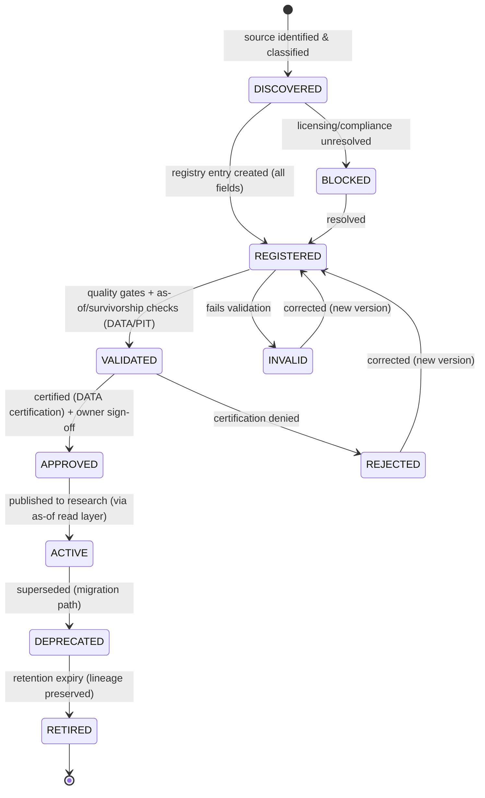
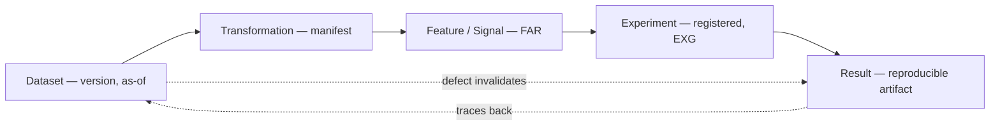

# Dataset Governance Framework

| Field             | Value                                                                                                                                                       |
| ----------------- | ----------------------------------------------------------------------------------------------------------------------------------------------------------- |
| **Document ID**   | DATASET-GOVERNANCE                                                                                                                                          |
| **Type**          | Operational dataset registry/governance (applies RB-06/07 · DATA + RB-08 · PIT at the dataset level)                                                        |
| **Clause prefix** | `DSG`                                                                                                                                                       |
| **Owner**         | Head of Data (**HD**)                                                                                                                                       |
| **Co-signers**    | Governance & Risk Committee (**GRC**), Head of Quantitative Research (**HQ**), Architecture Review Board (**ARB**), Head of Security (**CISO**, for access) |
| **Governed by**   | `CLAUDE.md`; Architecture V2 (§5.8); RB-06/07 · DATA; RB-08 · PIT                                                                                           |
| **Version**       | 1.0.0                                                                                                                                                       |
| **Status**        | PROPOSED (binding upon ARB ratification)                                                                                                                    |
| **Last Ratified** | — (pending)                                                                                                                                                 |

> **Position & authority.** This framework is the **operational dataset registry and governance system** — the dataset-level instantiation of the Data Governance & Quality rulebook (RB-06/07 · DATA) and the Point-in-Time rulebook (RB-08 · PIT). Those rulebooks own the _rules_ (quality dimensions, certification criteria, corporate actions, survivorship, as-of/vintage/lineage). **This document applies those rules to individual datasets**: it defines the dataset registry, registration standard, dataset lifecycle, dataset-level governance metadata, dataset↔experiment linkage, and dataset audit — the "what data exists and its status" system.

> **Reading note.** Technology-independent. Not a data-engineering guide, database-design, or pipeline-implementation document. No database technologies, vendor solutions, or pipeline code. Each major section carries **Purpose · Responsibilities · Boundaries · Acceptance · Failure · Cross-refs**, with embedded RFC 2119 rules (`DSG-n`). **Every dataset used in research MUST be governed (registered, certified, versioned, lineage-tracked); no dataset is used ungoverned.**

---

## 1. Purpose

To provide institutional control over research data at the dataset level: how each dataset is acquired, validated, classified, versioned, accessed, maintained, and retired — answering, per dataset: **what data exists, where it came from, whether it can be trusted, who owns it, which experiments use it, and whether results using it can be reproduced.** Dataset governance is the deterministic control that makes research data reliable, reproducible, and auditable.

Its governing intent is `CLAUDE.md` DI-1..3, DP-1..3, PIT-1..4, and CP-4/6/7: data is the foundation of all research; a dataset earns trust only through certification; and every result is pinned to an exact, as-of-correct, lineage-resolved dataset version.

## 2. Scope & Boundaries

- **Purpose.** Define dataset governance philosophy, classification, the registry requirements, dataset lifecycle, quality governance (applied), per-asset dataset rules, AI data-access governance, versioning, lineage, and audit.
- **Responsibilities.** Register datasets; track certification/quality status; classify; version; link datasets to experiments and lineage; govern access; preserve history; retire datasets.
- **Boundaries (references only, never restated):**
  - **Data quality dimension _definitions/measurement_, certification _criteria_, corporate actions _capture_, survivorship _rules_, schema governance, retention, data incidents, AI data-usage _rules_** → **RB-06/07 · DATA**.
  - **As-of read enforcement, vintage/restatement, lineage _query_, leakage harness** → **RB-08 · PIT** (`P1-01`, `P2-03`).
  - **Research-generated data (features/signals) _lifecycle & acceptance_** → **RB-10/09 · FAR**; **Feature Factory computation** → **RB-08 · PIT** (`P1-06`).
  - **Reproducibility manifests** → **RB-05 · REPRO** (`P1-02`); **dataset↔experiment record linkage** → **Experiment Tracking Governance**.
  - **Security/access _mechanism_, secrets, audit-trail integrity** → **RB-27 · SEC** (`P1-09`); **artifact lifecycle/tiering/GC** → **RB-29 · PERF** (`P5-01`).
  - **AI role boundaries** → **RB-15 · AIGOV**, Agent Contracts.
- **Acceptance.** Every research dataset has a conforming, certified, versioned, lineage-linked registry entry. **Failure.** A dataset used in research without a governed entry, or an uncertified dataset in use. **Cross-refs.** RB-06/07 · DATA, RB-08 · PIT, Architecture V2 §5.8.

## 3. Constitutional & Governance Basis

Traces to: `CLAUDE.md` **DI-1..3** (data integrity), **DP-1..3** (provenance), **PIT-1..4** (point-in-time), **CP-2/4/6/7** (immutability/reproducibility/provenance/audit), **VER-1/2, DEPR-1..3** (versioning/deprecation), **SEC-2** (access); RB-06/07 · DATA (DATA-\*), RB-08 · PIT; PATCH **P1-01** (As-Of Gateway/vintage), **P1-06** (Feature Factory), **P2-03** (leakage), **P5-01** (lifecycle/retention), **P1-02** (manifests); Architecture V2 §5.8; REVIEW C1 (leakage), DI, Missing #10 (data-quality SLA/restatement).

---

## Clause Format

**Pivotal clauses** carry the full block: _Purpose · Rationale · Acceptance · Failure · Refs_. **Supporting clauses** carry RFC 2119 force plus a one-line rationale. Every clause has a stable ID (`DSG-n`, continuous).

---

# PART A — DATA GOVERNANCE PHILOSOPHY

- **DSG-1 · Data As Research Foundation (MUST).** Datasets are the foundation of all research; a defect in a dataset propagates to every result derived from it, so datasets MUST be governed to the highest standard before any research use. _Rationale:_ DI, REVIEW C1; garbage data guarantees garbage research. _Acceptance:_ no research reads ungoverned data. _Failure:_ research on an ungoverned dataset. _Refs:_ DSG-16.
- **DSG-2 · Scientific Reproducibility (MUST).** Every dataset used in a result MUST be reproducibly identifiable by exact version and as-of state, such that the result can be re-derived years later. _Rationale:_ CP-4; ambiguous data breaks reproducibility. _Refs:_ DSG-46.
- **DSG-3 · Data Integrity (MUST).** Governed data MUST be trustworthy by certification, not by default; unverified data is untrusted. _Rationale:_ DI, DATA-3. _Refs:_ DSG-22.
- **DSG-4 · Data Transparency (MUST).** Every dataset's origin, transformations, quality, and limitations MUST be open and auditable; hidden data provenance or undisclosed limitations are PROHIBITED. _Rationale:_ CP-7, DP. _Refs:_ DSG-60.
- **DSG-5 · Data Lineage (MUST).** Every dataset MUST have resolvable lineage from source through transformations to the experiments and results that consume it. _Rationale:_ DP-1/2; lineage enables invalidation and audit. _Refs:_ PART H.
- **DSG-6 · Controlled Evolution (MUST).** Datasets MUST evolve only through governed versioning and deprecation; silent changes to data are PROHIBITED. _Rationale:_ CP-2, DEPR-1. _Refs:_ PART G.

---

# PART B — DATASET CLASSIFICATION

- **DSG-7 (MUST).** Every dataset MUST be classified into exactly one primary category below; classification (with trust tier and sensitivity per DATA) drives quality expectations, handling, and access. _Rationale:_ CP-8; classification aligns governance with data nature. _Refs:_ DSG-12.

| Category                    | Examples                                | Key governance concerns                                |
| --------------------------- | --------------------------------------- | ------------------------------------------------------ |
| **Market Data**             | prices · volume · order data            | as-of, corporate actions, session/calendar (per asset) |
| **Fundamental Data**        | financial statements · company metrics  | vintage/restatement, as-of reporting lag               |
| **Alternative Data**        | sentiment · macro · external indicators | provenance, licensing, poisoning, non-tradable         |
| **Derivatives Data**        | funding · open interest · options       | settlement, expiry, greeks/vol, roll                   |
| **Research-Generated Data** | features · signals · experiment outputs | leakage-clean, derived-provenance (FAR/PIT)            |

- **DSG-8 (MUST).** Each dataset MUST carry its **trust tier (T0–T3)** and **sensitivity (public/licensed/restricted)** per RB-06/07 · DATA; a derived dataset's trust tier MUST NOT exceed the minimum of its inputs (DATA-14). _Rationale:_ DATA-12/14; trust cannot be manufactured downstream. _Refs:_ DSG-22.
- **DSG-9 (MUST).** Research-Generated datasets MUST NOT be reintroduced as source data without provenance marking them derived (DATA-19); conflating derived signals with source data is PROHIBITED. _Rationale:_ DP; hides circularity/leakage. _Refs:_ DSG-5.

---

# PART C — DATASET REGISTRY REQUIREMENTS

- **DSG-10 (MUST).** Every dataset registry entry MUST contain **all** groups/fields below before ACTIVE; an entry missing any is not registrable. Fields referencing owned artifacts (schema, lineage, quality) MUST link to the authoritative source. _Rationale:_ DATA-27/28; a complete, uniform, discoverable governance record answering the six questions. _Acceptance:_ all fields present, discoverable, linked. _Failure:_ an incomplete or undiscoverable entry. _Refs:_ DSG-16.

**Dataset Registry Standard:**

| Group          | Fields                                                                          | Answers                  |
| -------------- | ------------------------------------------------------------------------------- | ------------------------ |
| **Identity**   | Dataset ID · Name · Description · Owner · Status                                | what/who/status          |
| **Source**     | Origin · Provider · Acquisition date · **Data lineage**                         | where from               |
| **Definition** | Schema (version) · Universe (as-of, survivorship-safe) · Time range · Frequency | what it is               |
| **Quality**    | Validation status · Known limitations · Quality metrics (per DATA)              | can it be trusted        |
| **Usage**      | Approved usage · Restricted usage · **Dependent experiments**                   | which experiments use it |
| **Versioning** | Dataset version · Change history · Compatibility information                    | reproducibility          |

- **DSG-11 (MUST).** The **Owner** field MUST name a single accountable human/role; ownerless datasets MUST NOT be ACTIVE (DATA-5). _Rationale:_ CP-7; ownerless data is unmanaged. _Refs:_ DSG-44.
- **DSG-12 (MUST).** The **Definition → Universe** MUST be as-of correct and survivorship-safe (RB-08 · PIT, DATA-56); the **Schema** MUST reference its version (DATA-24). _Rationale:_ PIT-2, FB-7; forward-looking universe/schema is silent bias. _Refs:_ DSG-30.
- **DSG-13 (MUST).** The **Usage → Dependent experiments** MUST be kept current (link to Experiment Tracking), enabling impact analysis on a data defect. _Rationale:_ DP-2; invalidation cascade requires knowing consumers. _Refs:_ DSG-58.

---

# PART D — DATA LIFECYCLE

- **DSG-14 (MUST).** Every dataset MUST follow the governed lifecycle below; stages MUST NOT be skipped, transitions are gated/recorded, and it MUST stay consistent with the DATA processing lifecycle (DATA-8). _Rationale:_ DATA-8, RL-1; a governed lifecycle is auditable. _Refs:_ DSG-15.

**Lifecycle transition rules:**

| Transition              | Precondition                                               | Approver            |
| ----------------------- | ---------------------------------------------------------- | ------------------- |
| DISCOVERED → REGISTERED | classified source + complete entry                         | data owner          |
| REGISTERED → VALIDATED  | quality dimensions met; as-of/survivorship pass (DATA/PIT) | deterministic gates |
| VALIDATED → APPROVED    | certification passed (DATA-85)                             | HD + owner (human)  |
| APPROVED → ACTIVE       | published via as-of read layer                             | deterministic       |
| ACTIVE → DEPRECATED     | replacement + migration path                               | HD                  |
| DEPRECATED → RETIRED    | retention expiry; reproducibility-critical preserved       | HD + GRC            |
| any → INVALID/REJECTED  | quality/certification failure                              | deterministic/HD    |

- **DSG-15 (MUST).** **No dataset MAY reach ACTIVE without certification (APPROVED)**; research reads only ACTIVE, certified datasets via the as-of read layer (DATA-85, DATA-44). _Rationale:_ DATA-3/85; certification is the trust gate. _Acceptance:_ research reads only ACTIVE datasets. _Failure:_ research on a non-ACTIVE/uncertified dataset. _Refs:_ DSG-3.
- **DSG-16 (MUST).** A dataset MUST be REGISTERED before any research or experiment uses it (fail-closed); use of an unregistered dataset is PROHIBITED. _Rationale:_ DSG-1; register-before-use is the anchor. _Refs:_ DSG-40.

---

# PART E — DATA QUALITY GOVERNANCE (applied)

> **Boundary note.** The _definitions and measurement methods_ of quality dimensions are owned by **RB-06/07 · DATA** (DATA-68..74). This framework requires that each dataset's registry entry **record status and gate** on them.

- **DSG-17 (MUST).** Each dataset's registry entry MUST record its status on all quality dimensions below and MUST meet each dimension's SLA (per DATA) before certification; any dimension below SLA blocks APPROVED. _Rationale:_ Missing #10; measured quality is enforceable quality. _Acceptance:_ all dimensions at/above SLA. _Failure:_ certifying a dataset below any SLA. _Refs:_ DSG-15.

**Quality dimensions (applied; measurement owned by DATA):**

| Dimension        | Purpose                           | Measurement (per DATA)                             | Acceptance                      | Failure                    |
| ---------------- | --------------------------------- | -------------------------------------------------- | ------------------------------- | -------------------------- |
| **Completeness** | expected records/fields present   | vs declared expectation (universe×calendar×fields) | ≥ SLA                           | gaps beyond SLA            |
| **Accuracy**     | values correct                    | vs authoritative reference (T0)                    | material discrepancies resolved | unresolved discrepancy     |
| **Consistency**  | internal & cross-source coherence | reconciliation checks                              | consistent                      | inconsistency unreconciled |
| **Timeliness**   | available within SLA of event     | event_time→knowledge_time lag                      | within SLA; lag recorded        | stale beyond SLA           |
| **Uniqueness**   | no undue duplicates               | declared keys                                      | duplicate rate ≤ SLA            | duplicates beyond SLA      |
| **Validity**     | conforms to schema/domain rules   | contract/type/range validation                     | contract-valid                  | schema/domain violation    |

- **DSG-18 (MUST).** Quality status MUST be **monitored continuously** for ACTIVE datasets (freshness/drift/anomaly per DATA/OBS); a breach raises an incident and may move the dataset toward review/deprecation (DATA-75/82/84). _Rationale:_ certified data can decay. _Refs:_ DSG-60.

---

# PART F — QUANTITATIVE RESEARCH DATA RULES (per asset class)

> **Boundary note.** Asset-class specifics are handled via capability adapters (CP-8, `P1-07`); the _standards_ are owned by RB-06/07 · DATA and RB-08 · PIT. This framework states the **dataset-registry governance requirements** per class.

### Equity Data

- **DSG-19 (MUST).** Equity datasets MUST evidence: **corporate actions** applied as-of correctly (splits/dividends/mergers), **survivorship-bias prevention** (as-of survivorship-free universe), and **delisted assets** preserved with delisting events (DATA-53/55/56). _Rationale:_ FB-7, ARCH §2.2; the top equity-data corruptions. _Acceptance:_ actions reconcile; dead names preserved; universe survivorship-safe. _Failure:_ present-adjusted prices, dropped delistings, or survivorship-filtered universe. _Refs:_ DATA-53..57.

### Crypto Data

- **DSG-20 (MUST).** Crypto datasets MUST evidence: **exchange-difference handling** (per-venue semantics, not blindly merged), **liquidity filtering** (illiquid/untradeable filtered or flagged), **abnormal-volume detection** (wash-trading/spike anomalies flagged), and **timestamp consistency** (as-of correct across 24/7 venues, no mis-alignment). _Rationale:_ DATA-2/59/84, CP-8; crypto data is venue-idiosyncratic and manipulation-prone. _Acceptance:_ venue semantics preserved; anomalies flagged; timestamps consistent. _Failure:_ merged cross-venue prices, unfiltered illiquid data, undetected abnormal volume, or timestamp mismatch. _Refs:_ DATA-60, DSG-12.

### Derivatives Data

- **DSG-21 (MUST).** Derivatives datasets MUST evidence: **funding accuracy** (funding rates as-of correct), **open-interest validation** (consistency/anomaly checks), and **settlement consistency** (expiry/settlement handled; option-chain and futures-roll corporate actions per DATA-54). _Rationale:_ REVIEW M4, DATA-54; derivatives carry expiry/settlement/roll complexity. _Acceptance:_ funding/OI validated; settlement/roll correct. _Failure:_ inaccurate funding, unvalidated OI, or mishandled settlement/roll. _Refs:_ DATA-54, BKT-19.

---

# PART G — DATA VERSIONING

### Dataset Version Rules

- **DSG-22 (MUST).** Every dataset MUST be immutably versioned and content-addressable such that a version denotes exactly one state forever; published data MUST NOT be mutated in place (DATA-39/41). _Rationale:_ CP-2/4; reproducibility requires stable dataset identity. _Refs:_ DSG-46.

### Schema Changes

- **DSG-23 (MUST).** Schema changes MUST be semantically versioned; **breaking changes bump the major version** and MUST NOT retroactively alter historical data interpretation (DATA-24, VER-1/2). _Rationale:_ the schema is a coupling surface; silent breaking changes corrupt downstream. _Refs:_ DSG-24.

### Backward Compatibility

- **DSG-24 (MUST).** Old dataset/schema versions MUST remain readable while any live artifact or reproducibility-critical result depends on them (DATA-26, DEPR-2). _Rationale:_ reproducibility of historical results. _Refs:_ DSG-25.

### Historical Preservation

- **DSG-25 (MUST).** All dataset versions and restatement vintages MUST be preserved (never overwritten); restatements create **new vintages**, not overwrites (DATA-16). Reproducibility-critical data MUST NOT be retention-expired while dependents exist (DATA-90, `P5-01`). _Rationale:_ PIT, CP-4; overwriting history destroys point-in-time correctness and reproducibility. _Acceptance:_ every version/vintage retrievable; no vintage overwrites. _Failure:_ a mutated or purged dataset with live dependents. _Refs:_ DSG-46.

- **DSG-26 (MUST).** **Research results MUST reference the exact dataset version (and as-of) consumed**; "the dataset" without a version is PROHIBITED (DATA-40). _Rationale:_ CP-4; ambiguous data references break reproduction. _Refs:_ DSG-2, EXG-13.

---

# PART H — DATA LINEAGE

- **DSG-27 (MUST).** Every dataset MUST have end-to-end lineage capturing the chain below; the lineage MUST be resolvable and enable a defect in any source to invalidate all downstream artifacts (DP-2; graph/query owned by RB-08 · PIT). _Rationale:_ DP-1/2, CP-6; lineage is the invalidation and audit backbone. _Acceptance:_ lineage resolvable source→result. _Failure:_ an orphaned or unresolvable-lineage dataset. _Refs:_ DSG-13.

- **DSG-28 (MUST).** Lineage MUST link datasets bidirectionally to transformations, features/factors (FAR), experiments (Experiment Tracking), and results, and to the reproducibility manifests (REPRO); the lineage graph MUST be navigable. _Rationale:_ CP-6; the research graph compounds institutional knowledge (`P3-14`). _Refs:_ DSG-58.
- **DSG-29 (MUST).** A dataset with unresolved lineage MUST NOT be certified (DATA-32). _Rationale:_ fail-closed provenance. _Refs:_ DSG-15.

---

# PART I — AI DATA ACCESS GOVERNANCE

## AI — MUST

- **DSG-30 (MUST).** AI systems MUST access only approved (ACTIVE, certified) datasets, respect data permissions (default-deny per sensitivity), record dataset usage, and preserve lineage (DATA-98, DP). _Rationale:_ DI-1, SEC-2; AI is not exempt from data law. _Acceptance:_ AI reads only ACTIVE datasets via the as-of layer; usage recorded. _Failure:_ AI reading unknown/uncertified data. _Refs:_ DSG-15.

## AI — MUST NOT

- **DSG-31 (MUST NOT).** AI systems MUST NOT use unknown/unregistered datasets. _Rationale:_ DSG-16; ungoverned data corrupts research. _Refs:_ DSG-16.
- **DSG-32 (MUST NOT).** AI systems MUST NOT modify source data. _Rationale:_ CP-2, DATA-42; source immutability. _Refs:_ DSG-22.
- **DSG-33 (MUST NOT).** AI systems MUST NOT remove or weaken data validation controls (DATA-32, CODE-32). _Rationale:_ validation is a control. _Refs:_ DSG-17.
- **DSG-34 (MUST NOT).** AI systems MUST NOT hide data limitations; known limitations MUST be surfaced (AIGOV-32). _Rationale:_ hidden limitations mislead research. _Refs:_ DSG-4.

- **DSG-35 (MUST).** AI data access MUST respect the isolation barrier and data boundary: generation agents MUST NOT access OOS/holdout partitions or raw/uncertified data (DATA-104, `P2-07`). _Rationale:_ AD-3, DI-1. _Refs:_ DSG-30.

---

# PART J — AUDIT REQUIREMENTS

- **DSG-36 (MUST).** Every dataset MUST maintain immutably: **dataset identity, owner, source history, validation history, access history, version history, and retirement history** — each event with actor, timestamp, and rationale. _Rationale:_ CP-7; the dataset record is core to data audit. _Acceptance:_ an auditor reconstructs a dataset's full governance timeline. _Failure:_ a missing/mutable history record. _Refs:_ DSG-38.
- **DSG-37 (MUST).** Dataset lifecycle events (certification, restatement, deprecation, deletion, restricted access) MUST be recorded in the tamper-evident audit trail (RB-27 · SEC / `P1-09`). _Rationale:_ CP-7, compliance. _Refs:_ DSG-36.
- **DSG-38 (MUST).** The registry MUST be reconcilable against datasets actually consumed by experiments; any experiment consuming an unregistered/uncertified dataset MUST be flagged, and the result invalidated. _Rationale:_ DSG-16; drift between registry and use is an integrity failure. _Refs:_ EXG-40.

---

## Responsibility Matrix (RACI)

| Dataset activity                    | AI agent                | Deterministic gates | Data owner (human) | Governance (HD/GRC)  |
| ----------------------------------- | ----------------------- | ------------------- | ------------------ | -------------------- |
| Discover/propose source             | R (assist)              | —                   | **A/R**            | I                    |
| Register dataset                    | R (submit)              | R (validate fields) | **A**              | I                    |
| Validate quality/as-of/survivorship | ✗ (forbidden self-cert) | **R**               | C                  | A                    |
| Certify (APPROVE)                   | ✗                       | R (gate)            | C                  | **A (HD)**           |
| Publish (ACTIVE)                    | —                       | **R**               | A                  | I                    |
| Access data                         | **R** (as-of layer)     | R (enforce ACLs)    | A                  | I                    |
| Deprecate/retire                    | propose                 | R (checks)          | R                  | **A**                |
| Edit certified data                 | ✗                       | R (deny)            | ✗                  | ✗ (new version only) |

---

## Acceptance Criteria (dataset → research-ready)

A dataset is **research-ready (ACTIVE)** only when **all** hold:

**Dataset governance checklist:**

- [ ] Registered with complete entry; classified + trust tier + sensitivity (DSG-10, DSG-8).
- [ ] Owner named; approved usage/restrictions defined (DSG-11).
- [ ] All quality dimensions at/above SLA (DSG-17).
- [ ] As-of correct; survivorship-safe; corporate actions applied (per class) (DSG-12, DSG-19..21).
- [ ] Immutably versioned; schema versioned; vintages preserved (DSG-22..25).
- [ ] Lineage resolvable end-to-end; manifests linked (DSG-27, DSG-29).
- [ ] Certified (DATA-85) + human owner sign-off; published via as-of layer (DSG-15).
- [ ] Dependent-experiment linkage tracked; access controls set (DSG-13, DSG-30).
- [ ] Continuous quality monitoring configured (DSG-18).

## Rejection / Invalidation Criteria

A dataset MUST be **rejected, invalidated, or blocked** if **any** hold:

- **DSG-39.** Used before registration/certification (DSG-15, DSG-16).
- **DSG-40.** Any quality dimension below SLA, or unresolved anomalies (DSG-17).
- **DSG-41.** Non-as-of, survivorship-unsafe, or corporate-action-incorrect (DSG-12, DSG-19..21).
- **DSG-42.** Unresolved lineage (DSG-29).
- **DSG-43.** Mutated in place, vintage overwritten, or unversioned reference (DSG-22, DSG-25, DSG-26).
- **DSG-44.** Ownerless, or licensing/compliance unresolved (DSG-11, BLOCKED).
- **DSG-45.** Consumed by an experiment while unregistered/uncertified (DSG-38).

---

## Anti-Patterns & Forbidden Practices

**Anti-patterns** (mirrors DATA-AP-\*, REVIEW):

- **DSG-AP-1.** Using "the dataset" without a pinned version/as-of (DSG-26).
- **DSG-AP-2.** Overwriting history on restatement instead of new vintage (DSG-25).
- **DSG-AP-3.** Survivorship-filtered universe / dropped delistings (DSG-19).
- **DSG-AP-4.** Merging cross-venue crypto prices; ignoring abnormal volume (DSG-20).
- **DSG-AP-5.** AI using unknown datasets or hiding limitations (DSG-31, DSG-34).
- **DSG-AP-6.** Deleting reproducibility-critical data with live dependents (DSG-25).

**Forbidden practices (non-waivable):**

- **DSG-F-1.** Research/AI using an unregistered or uncertified dataset (DSG-15, DSG-16; DI-1).
- **DSG-F-2.** Mutating source/certified data in place, or overwriting a vintage (DSG-22, DSG-25; CP-2).
- **DSG-F-3.** Survivorship-unsafe or non-as-of data certified (DSG-12, DSG-19; FB-7).
- **DSG-F-4.** Referencing data without an exact version/as-of in a result (DSG-26; CP-4).
- **DSG-F-5.** AI modifying source data, removing validation, or hiding limitations (DSG-32, DSG-33, DSG-34).
- **DSG-F-6.** Generation agents accessing OOS/holdout or raw data (DSG-35; AD-3).
- **DSG-F-7.** Deleting reproducibility-critical data while dependents exist (DSG-25; RP-4).

---

## Enforcement & Verification

| Clause group                                        | Enforcement mechanism                                    | Owner                                   |
| --------------------------------------------------- | -------------------------------------------------------- | --------------------------------------- |
| Register/certify-before-use (DSG-15,16)             | Registry + as-of read gate (fail-closed)                 | this framework, RB-06/07 · DATA         |
| Quality dimensions (DSG-17)                         | Certification quality gates                              | RB-06/07 · DATA                         |
| As-of/survivorship/corporate actions (DSG-12,19–21) | Data gates + leakage harness                             | RB-08 · PIT (`P1-01`,`P2-03`)           |
| Versioning/vintage/preservation (DSG-22–26)         | Immutable version store; retention policy                | RB-06/07 · DATA, RB-29 · PERF (`P5-01`) |
| Lineage (DSG-27–29)                                 | Lineage capture + resolution gate                        | this framework; RB-08 · PIT graph       |
| AI access/isolation (DSG-30–35)                     | As-of layer + ACLs; default-deny                         | RB-08 · PIT, RB-15 · AIGOV (`P2-07`)    |
| Audit history (DSG-36–38)                           | Immutable history + tamper-evident audit; reconciliation | RB-27 · SEC, Experiment Tracking        |
| Forbidden practices (DSG-F-\*)                      | Fail-closed; integrity report                            | GRC                                     |

- **DSG-E-1 (MUST).** Every clause enforcing a Forbidden Practice (DSG-F-*) MUST be deterministically gated and fail-closed. *Rationale:* CP-1, DE-1. *Refs:\* DSG-15.

## Exceptions & Waivers

- **DSG-W-1 (MUST).** No exception MAY be granted to: register/certify-before-use (DSG-15/16), source/vintage immutability (DSG-22/25), survivorship/as-of correctness (DSG-12/19), version pinning (DSG-26), isolation (DSG-35), or any `CLAUDE.md` entrenched clause (AM-2). Non-waivable.
- **DSG-W-2 (MAY).** GRC/HD-governed parameters (quality SLAs, retention windows, certification cadence, trust-tier criteria) MAY be changed only by GRC + HD, recorded (as an ADR), applied prospectively.
- **DSG-W-3 (MUST).** Any temporary waiver MUST be recorded on the dataset's registry entry and history. _Rationale:_ no hidden exceptions.

## Ratification Criteria

Ratifiable only when: every clause has a stable ID, RFC 2119 phrasing, and an enforcement mechanism; no clause contradicts `CLAUDE.md`, Architecture V2, RB-06/07 · DATA, RB-08 · PIT, or peer rulebooks; register/certify-before-use, immutability, as-of/survivorship correctness, version pinning, lineage, and isolation are preserved; all cross-references resolve; ARB approval with HD + GRC (+ CISO for access) co-sign obtained.

## Success Metrics

- **SM-1.** 100% research datasets registered + certified before use; 0 ungoverned-data usages (DSG-15, DSG-16).
- **SM-2.** 0 survivorship-unsafe/non-as-of datasets certified (DSG-12, DSG-19).
- **SM-3.** 0 vintage overwrites; 100% restatements as new vintages (DSG-25).
- **SM-4.** 100% results referencing exact dataset versions; 100% datasets lineage-resolvable (DSG-26, DSG-27).
- **SM-5.** 0 AI uses of unknown datasets; 0 source-data modifications by AI (DSG-31, DSG-32).
- **SM-6.** 0 reproducibility-critical datasets deleted with live dependents (DSG-25).
- **SM-7.** 100% datasets with complete immutable audit history; registry reconciles to experiment usage (DSG-36, DSG-38).

## Dependencies & Related Documents

- **Governed by:** `CLAUDE.md`; Architecture V2 (§5.8); RB-06/07 · DATA; RB-08 · PIT.
- **Depends on / references:** RB-05 · REPRO (manifests), RB-10/09 · FAR (research-generated data), RB-29 · PERF (retention/lifecycle), RB-27 · SEC (access/audit integrity), RB-15 · AIGOV (AI access), Experiment Tracking Governance (dataset↔experiment), RB-11 · BT & RB-01 · STAT (consumers).
- **Architecture references:** ARCH §2.2, §2.3; Architecture V2 §5.8; PATCH `P1-01`, `P1-06`, `P2-03`, `P5-01`, `P1-02`; REVIEW C1, DI, Missing #10.

## Change Log & Version History

| Version | Date    | Author (role) | Change                                |
| ------- | ------- | ------------- | ------------------------------------- |
| 1.0.0   | pending | HD            | Initial Dataset Governance Framework. |

---

## Glossary (dataset-specific)

Terms in `CLAUDE.md`, rulebook, and prior-framework glossaries (as-of, vintage, provenance, trust tier, certification, survivorship-safe) are not redefined.

- **Dataset** — A governed, classified, versioned, certified body of research data with a registry entry (DSG-10).
- **Dataset Registry Entry** — The authoritative governance record of a dataset's identity, source, definition, quality, usage, and versioning (DSG-10).
- **Research-Ready (ACTIVE)** — The lifecycle state a dataset reaches only after certification + owner sign-off; the only state research may read (DSG-15).
- **Dataset Version** — An immutable, content-addressable state of a dataset; results pin exact versions (DSG-22, DSG-26).
- **Vintage** — A version of a dataset's contents as known at a knowledge_time; restatements create new vintages (DSG-25).
- **Lineage Chain** — Dataset → Transformation → Feature → Experiment → Result, resolvable and invalidation-enabling (DSG-27).
- **Trust Tier / Sensitivity** — Governance attributes (T0–T3; public/licensed/restricted) driving handling and access (DSG-8).
- **Reproducibility-Critical Data** — Data (raw, certified vintages, manifests, lineage) that MUST NOT be retention-expired while dependents exist (DSG-25).

---

_End of Dataset Governance Framework. It is the operational dataset registry and governance system applying RB-06/07 · DATA and RB-08 · PIT at the dataset level: every research dataset is registered before use, classified, quality-gated, certified, immutably versioned, as-of and survivorship correct, lineage-resolved, and access-controlled — and every result pins the exact dataset version it consumed. AI accesses only approved datasets, never modifies source, never hides limitations, and never crosses the data/isolation boundary. Vintages and reproducibility-critical data are preserved; the lineage graph is navigable; the record is immutable. Binding upon ARB ratification._
