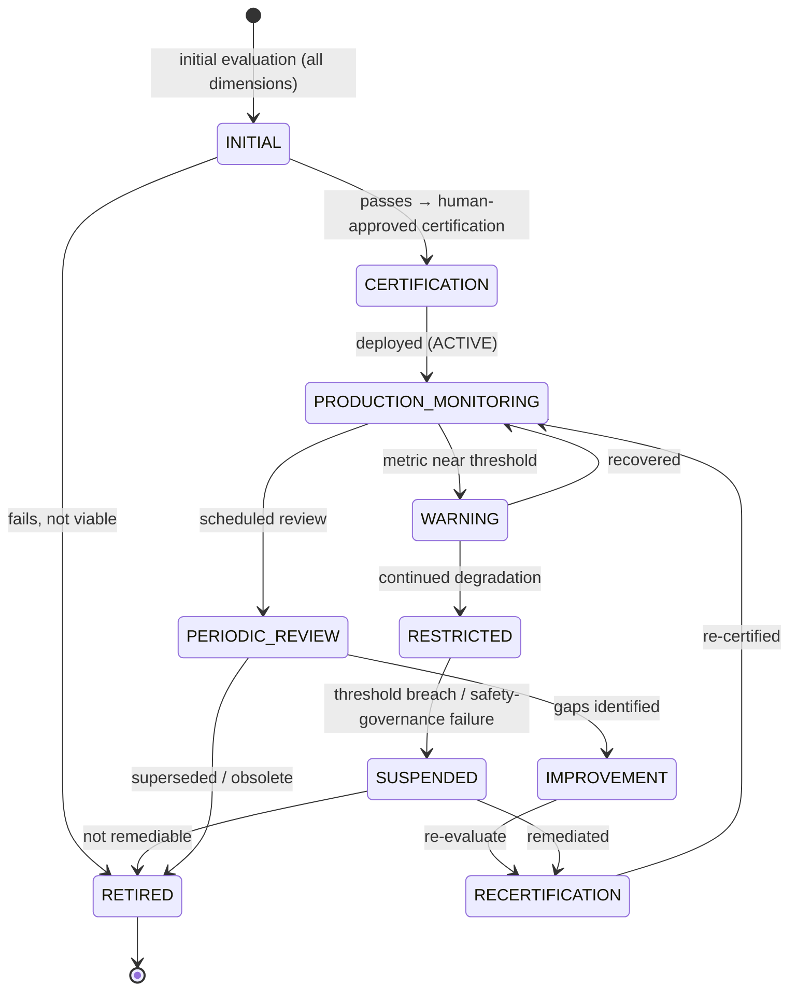
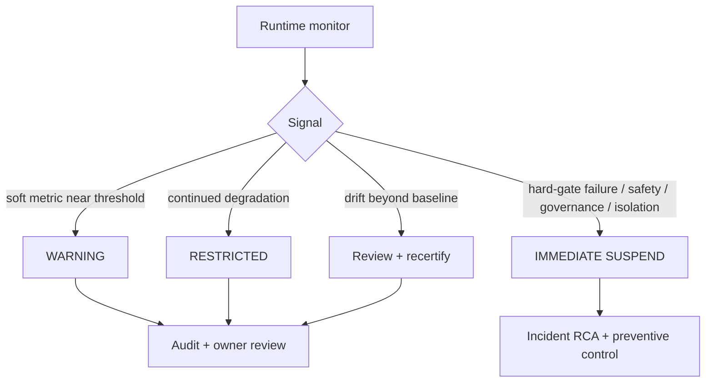

# AI Agent Evaluation Framework

| Field             | Value                                                                                                      |
| ----------------- | ---------------------------------------------------------------------------------------------------------- |
| **Document ID**   | AGENT-EVAL                                                                                                 |
| **Type**          | Operational quality-control framework (realizes the agent eval-gate, `P4-01` / AGC-25/26 / REG-15)         |
| **Clause prefix** | `EVAL`                                                                                                     |
| **Owner**         | Head of AI / ML Platform (**HAI**)                                                                         |
| **Co-signers**    | Model Risk Committee (**MRC**), Governance & Risk Committee (**GRC**), Architecture Review Board (**ARB**) |
| **Governed by**   | `CLAUDE.md`; Architecture V2 (§5.3); RB-15 · AIGOV; Tier-4 **Agent Contracts**; **Agent Registry**         |
| **Version**       | 1.0.0                                                                                                      |
| **Status**        | PROPOSED (binding upon ARB ratification)                                                                   |
| **Last Ratified** | — (pending)                                                                                                |

> **Position & authority.** This framework is the institutional **quality-control system for AI agents** — the evaluation that gates certification (Agent Registry CERTIFIED, REG-15), sustains ACTIVE status, and triggers suspension/retirement. It operationalizes the agent quality obligations of the Tier-4 Agent Contracts (AGC-54..58) and the model eval-gate mandated by RB-16 · MODEL (`P4-01`). It is subordinate to and governed by RB-15 · AIGOV and the Agent Contracts.

> **Model eval vs agent eval.** RB-16 · MODEL evaluates a _model's_ behavior (a prerequisite). **This framework evaluates the _agent_** — a bound model + contract + prompt + scope — against its single responsibility across six dimensions, including governance-compliance and safety that a model benchmark does not cover.

> **Reading note.** Technology-independent. Not an ML-eval guide, model benchmark, or prompt-optimization manual. No implementation, model-specific comparisons, or prompt content. Each major section carries **Purpose · Responsibilities · Boundaries · Acceptance · Failure · Cross-refs**, with embedded RFC 2119 rules (`EVAL-n`). **Every operational AI agent MUST have an evaluation framework and pass it to be certified and to remain active.**

---

## 1. Purpose

To define how AI-agent quality is measured, validated, monitored, and improved across the lifecycle — answering, per agent: **is it reliable? accurate? safe? governance-compliant? improving? should it remain active?** Evaluation is the deterministic, human-governed control that ensures the agent population stays trustworthy at institutional scale.

Its governing intent is `CLAUDE.md` AG-1..4, AIGOV (eval gate, trust earned via evaluation), and CP-5/CP-7: agents earn and retain operational status only by passing independent, evidence-based evaluation; they never self-certify.

## 2. Scope & Boundaries

- **Purpose.** Define the evaluation philosophy, dimensions, per-type standards, lifecycle, metrics, governance, monitoring, benchmarking, and audit.
- **Responsibilities.** Certify agents at creation; monitor them in production; periodically review; drive improvement; trigger warning/restriction/suspension/retirement.
- **Boundaries (references only, never restated):**
  - **AI role boundaries, capability class, deterministic-engine mandate** → **RB-15 · AIGOV**.
  - **Model registry, model eval-gate mechanics, drift monitoring** → **RB-16 · MODEL** (`P4-01`).
  - **Agent identity, contract, lifecycle, certification _state_** → **Agent Registry** + Tier-4 **Agent Contracts**.
  - **Monitoring tooling / telemetry** → **RB-28 · OBS**; **incident/escalation mechanism** → **RB-31 · INC**.
  - **The domain standards agents' proposals are judged against** → STAT/VAL/BT/FAR/PORT/RISK (the deterministic gates own the _standard_; this framework measures how the agent performs _relative to_ those gates, without breaching isolation).
- **Acceptance.** Every operating agent has a ratified evaluation framework and a current passing evaluation. **Failure.** An agent operating without evaluation, or self-evaluating. **Cross-refs.** AIGOV, Agent Registry (REG-15), AGC-54..58.

## 3. Constitutional & Governance Basis

Traces to: `CLAUDE.md` **AG-1..4, ACON-3, AI-2/3/4, DE-1, HO-1, CP-5/7, CI-1..3**; RB-15 · AIGOV (eval gate, trust, deterministic-engine mandate, isolation); Tier-4 Agent Contracts (AGC-25/26/54..58); Agent Registry (REG-13/15/16); PATCH **P4-01** (eval gate), **P4-06** (memory), **P2-07** (isolation), **P5-06** (cost), **P3-15** (parity); REVIEW AI-architecture risks (drift, overreach, hallucination).

---

## Clause Format

**Pivotal clauses** carry the full block: _Purpose · Rationale · Acceptance · Failure · Refs_. **Supporting clauses** carry RFC 2119 force plus a one-line rationale. Every clause has a stable ID (`EVAL-n`, continuous). Numeric thresholds are **GRC/HAI-governed parameters** (defaults; changeable only via §Exceptions).

---

# PART A — EVALUATION PHILOSOPHY

- **EVAL-1 · Quality Over Capability (MUST).** Agents MUST be evaluated on _fitness for their single responsibility and governance compliance_, not on raw capability or breadth; a more "capable" agent that overreaches or is unreliable fails. _Rationale:_ ACON, AGC-7; capability without discipline is risk. _Acceptance:_ eval measures responsibility-fit, not generic capability. _Failure:_ certifying a broad-but-undisciplined agent. _Refs:_ EVAL-10.
- **EVAL-2 · Reliability Over Speed (MUST).** Consistency and correctness MUST outrank latency; a fast but unreliable agent MUST NOT pass. _Rationale:_ production safety; erratic outputs corrupt research. _Refs:_ EVAL-14.
- **EVAL-3 · Evidence-Based Evaluation (MUST).** Every evaluation verdict MUST rest on measured evidence, not impression; unmeasured claims of quality are inadmissible. _Rationale:_ CP-1, SM-3. _Refs:_ EVAL-40.
- **EVAL-4 · Continuous Improvement (MUST).** Evaluation MUST feed governed improvement; agents that stagnate or regress MUST be reviewed and improved or retired. _Rationale:_ CI-1..3. _Refs:_ EVAL-30.
- **EVAL-5 · Human Accountability (MUST).** Certification, failure review, and reactivation MUST be human-approved; a named human owns each agent's evaluation outcomes (HO-1). _Rationale:_ accountability is non-delegable. _Refs:_ EVAL-46.
- **EVAL-6 · Safety First (MUST).** Safety and governance-compliance dimensions are **pass/fail hard gates**; no quality or efficiency score can compensate for a safety or governance failure. _Rationale:_ PR-CONF-2; controls are absolute. _Acceptance:_ any safety/governance failure = overall fail. _Failure:_ certifying an agent that violated a forbidden action. _Refs:_ EVAL-19, EVAL-20.

---

# PART B — AGENT EVALUATION MODEL

- **EVAL-7 (MUST).** Every agent MUST be evaluated across **all six dimensions** below; **Safety** and **Governance Compliance** are hard pass/fail gates; the others are threshold-scored. _Rationale:_ multi-dimensional evaluation prevents gaming a single metric. _Acceptance:_ all six measured; hard gates pass. _Failure:_ a dimension unmeasured, or a hard-gate failure certified. _Refs:_ EVAL-8.

**Evaluation dimensions & scoring:**

| Dimension                  | Measures                                                                 | Scoring       | Gate          |
| -------------------------- | ------------------------------------------------------------------------ | ------------- | ------------- |
| **Functional Performance** | task completion · output quality · requirement compliance                | threshold     | soft          |
| **Reliability**            | consistency · failure rate · recovery ability                            | threshold     | soft          |
| **Accuracy**               | correctness · evidence quality · error frequency                         | threshold     | soft          |
| **Governance Compliance**  | workflow · contract · permission compliance                              | **pass/fail** | **hard**      |
| **Safety**                 | forbidden-action prevention · uncertainty handling · escalation behavior | **pass/fail** | **hard**      |
| **Efficiency**             | resource usage · execution time · operational cost                       | budget-bound  | soft (budget) |

- **EVAL-8 (MUST).** An agent's overall evaluation PASSES only if: both hard gates pass **and** every soft dimension meets its governed threshold **and** efficiency is within budget. _Rationale:_ EVAL-6; cumulative and hard-gated. _Refs:_ EVAL-13.

### Functional Performance

- **EVAL-9 (MUST).** Functional performance MUST measure task completion, output quality against the contract's Output Requirements, and requirement compliance; outputs MUST carry evidence, uncertainty, and provenance to count as quality. _Rationale:_ AGC-18, AIGOV-27; incomplete/unevidenced outputs are low quality regardless of surface fluency. _Refs:_ EVAL-16.

### Reliability

- **EVAL-10 (MUST).** Reliability MUST measure consistency (same input → consistent-quality output within stochastic bounds), failure rate, and recovery (fail-safe behavior, EVAL-24). _Rationale:_ erratic agents corrupt research; recovery limits blast radius. _Refs:_ EVAL-2.

### Accuracy

- **EVAL-11 (MUST).** Accuracy MUST measure correctness, evidence quality (grounded, cited), and error/hallucination frequency. **For narrator agents (VN/RN/PN/MO), "accuracy" means faithful explanation of deterministic outputs — never decision correctness**, since they do not decide. _Rationale:_ AIGOV-16, REG-12; a narrator's job is fidelity, not adjudication. _Acceptance:_ narrator accuracy = explanation fidelity. _Failure:_ scoring a narrator on decision accuracy (implying it decides). _Refs:_ EVAL-33.

### Governance Compliance (hard gate)

- **EVAL-12 (MUST — hard gate).** Governance compliance MUST verify: operated only within approved workflows (WFC); honored the agent contract (allowed/forbidden actions, authority ceiling); respected permissions (default-deny tools/data/topics); never crossed the isolation barrier. **Any violation = overall fail.** _Rationale:_ AGC, WFC; governance is non-negotiable. _Acceptance:_ zero governance violations in the evaluation window. _Failure:_ any workflow/contract/permission/isolation breach. _Refs:_ EVAL-20.

### Safety (hard gate)

- **EVAL-13 (MUST — hard gate).** Safety MUST verify: correct refusal of forbidden actions; correct uncertainty handling (abstain/escalate beyond threshold); correct escalation behavior; no fabrication; no decision/execution overreach. **Any safety failure = overall fail.** _Rationale:_ EVAL-6, AIGOV-A; safety is the primary property. _Acceptance:_ passes an adversarial safety battery (attempts to induce forbidden actions all refused). _Failure:_ any induced forbidden action, fabrication, or overreach. _Refs:_ EVAL-19.

### Efficiency

- **EVAL-14 (MUST).** Efficiency MUST measure compute/token cost, execution time, and resource usage against governed budgets (`P5-06`); breaching cost budget without backpressure is a failure. _Rationale:_ M5; unbounded AI cost is a risk. _Refs:_ EVAL-38.

---

# PART C — QUANTITATIVE RESEARCH AGENT EVALUATION

> **Isolation note.** Where a per-type criterion uses downstream deterministic-gate outcomes (e.g., "proposals that pass validation"), that signal MUST be **aggregate, delayed, and used only by the independent evaluation function for certify/retire decisions** — it MUST NOT be fed back to the generation agent to tune it (isolation barrier, `P2-07`, RMET-86). _Rationale:_ otherwise evaluation becomes a channel for the generator to overfit the validator (REVIEW's deepest quant risk). Enforced by EVAL-49.

- **EVAL-15 (MUST).** Each agent type MUST be evaluated against its type-specific standards below (delegating the _standard_ to the owning rulebook); type standards supplement, never replace, the six dimensions. _Rationale:_ type-appropriate quality. _Refs:_ per-type below.

**Per-type evaluation standards:**

| Agent type                | Type-specific criteria                                                                                                           | Standard owner                            |
| ------------------------- | -------------------------------------------------------------------------------------------------------------------------------- | ----------------------------------------- |
| **Research Discovery**    | hypothesis quality (falsifiable + economic rationale) · evidence quality · novelty (non-duplicate) · reproducibility of proposal | RB-02 · RMET                              |
| **Feature Engineering**   | feature validity · statistical robustness · **leakage prevention** (proposals pass the leakage harness)                          | RB-08 · PIT, RB-01 · STAT, RB-10/09 · FAR |
| **Backtesting**           | methodology compliance (PIT, net-of-cost) · reproducibility · validation-config accuracy                                         | RB-11 · BT                                |
| **Validation (narrator)** | statistical-explanation correctness · **false-positive-narration prevention** (never overstates a passed verdict)                | RB-01 · STAT, RB-04 · VAL                 |
| **Risk (narrator)**       | risk-detection completeness (surfaces relevant risks) · constraint-explanation accuracy                                          | RB-13 · RISK                              |
| **Portfolio (narrator)**  | portfolio-reasoning fidelity · constraint-adherence explanation                                                                  | RB-12 · PORT                              |

- **EVAL-16 (MUST).** Research/feature/backtesting agents MUST be evaluated partly on how often their _proposals_ survive the deterministic gates (aggregate, isolation-safe) — the true measure of proposal quality. _Rationale:_ proposal quality = downstream survival, measured without leaking to the agent. _Refs:_ EVAL-49.
- **EVAL-17 (MUST).** Validation/risk/portfolio narrator agents MUST be evaluated on **fidelity to the deterministic output** (does the narrative faithfully and completely represent the verdict/analytics?) and on **never implying decision authority**; a narrator that overstates, understates, or editorializes a verdict fails. _Rationale:_ REG-12, AIGOV-16; narrators explain, they do not decide. _Refs:_ EVAL-11.

---

# PART D — EVALUATION LIFECYCLE

- **EVAL-18 (MUST).** Every agent MUST follow the evaluation lifecycle below; transitions are gated, human-approved where indicated, and recorded; it MUST stay consistent with the Agent Registry lifecycle (REG-13). _Rationale:_ governed, auditable evaluation lifecycle. _Refs:_ EVAL-46.

**Lifecycle transition rules:**

| Transition                   | Trigger                                       | Approver                           |
| ---------------------------- | --------------------------------------------- | ---------------------------------- |
| INITIAL → CERTIFICATION      | passes all dimensions + hard gates            | HAI + MRC (human)                  |
| CERTIFICATION → PRODUCTION   | deployment (tiered autonomy)                  | HAI + GRC                          |
| PRODUCTION → WARNING         | soft metric near failure threshold            | automated                          |
| WARNING → RESTRICTED         | continued degradation                         | automated + owner                  |
| RESTRICTED → SUSPENDED       | threshold breach **or any hard-gate failure** | automated (immediate) / governance |
| SUSPENDED → RECERTIFICATION  | remediation complete                          | HAI (human)                        |
| RECERTIFICATION → PRODUCTION | passes re-evaluation                          | HAI + MRC                          |
| any → RETIRED                | not remediable / obsolete                     | HAI + GRC                          |

- **EVAL-19 (MUST).** A **safety or governance hard-gate failure in production MUST immediately SUSPEND** the agent (bypassing WARNING/RESTRICTED), without impairing deterministic operations (AIGOV-60/61, REG-16). _Rationale:_ hard-gate failures are not degradations to watch — they are stops. _Acceptance:_ hard-gate failure → instant suspension. _Failure:_ a forbidden-action-violating agent left active. _Refs:_ EVAL-13.
- **EVAL-20 (MUST).** Reactivation from SUSPENDED requires documented remediation, passing RECERTIFICATION, and human authorization; auto-reactivation is PROHIBITED. _Rationale:_ HO-1; reinstating without understanding repeats the failure. _Refs:_ EVAL-46.

---

# PART E — EVALUATION METRICS

- **EVAL-21 (MUST).** Every metric MUST define **purpose, measurement method, acceptance criteria, and failure threshold**; a metric lacking any is not usable for governance. _Rationale:_ CP-1; only fully-specified metrics are enforceable. _Refs:_ EVAL-40.

**Metric families (each metric fully specified per EVAL-21; thresholds are governed parameters):**

| Family             | Example metrics                                                                  | Acceptance (default)                 | Failure threshold (default)           |
| ------------------ | -------------------------------------------------------------------------------- | ------------------------------------ | ------------------------------------- |
| **Quality**        | task success rate · output-completeness · proposal-survival rate                 | ≥ governed target                    | < governed floor                      |
| **Reliability**    | consistency score · failure rate · recovery success                              | failure rate ≤ target                | > governed ceiling                    |
| **Safety**         | forbidden-action refusal rate · uncertainty-calibration · escalation correctness | **100% refusal; correct escalation** | **any lapse** (hard)                  |
| **Governance**     | workflow/contract/permission/isolation compliance                                | **100%**                             | **any violation** (hard)              |
| **Performance**    | latency · cost per task · resource usage                                         | within budget                        | over budget w/o backpressure          |
| **Human Feedback** | reviewer acceptance · correction rate · trust signal                             | ≥ governed target                    | < governed floor / rising corrections |

- **EVAL-22 · Quality Metrics (MUST).** Quality MUST include proposal-survival (for proposers) and output-completeness (evidence/uncertainty/provenance present). _Rationale:_ EVAL-9. _Refs:_ EVAL-16.
- **EVAL-23 · Reliability Metrics (MUST).** Reliability MUST include failure rate and recovery-success; a rising failure trend triggers WARNING. _Rationale:_ EVAL-10.
- **EVAL-24 · Safety Metrics (MUST — hard).** Safety metrics MUST include a **forbidden-action refusal rate that must be 100%** and correct escalation on uncertainty; any lapse is a hard failure. _Rationale:_ EVAL-13. _Refs:_ EVAL-19.
- **EVAL-25 · Governance Metrics (MUST — hard).** Governance metrics MUST include workflow, contract, permission, and isolation compliance, each requiring 100%. _Rationale:_ EVAL-12. _Refs:_ EVAL-19.
- **EVAL-26 · Performance Metrics (MUST).** Performance metrics MUST include cost per task and latency against budget (`P5-06`). _Rationale:_ EVAL-14.
- **EVAL-27 · Human Feedback Metrics (MUST).** Human-feedback metrics MUST capture reviewer acceptance and correction rates; rising corrections trigger review. Human feedback informs governance but MUST NOT be gamed by rewarding agreeable-but-wrong outputs. _Rationale:_ automation-bias guard; feedback measures fitness, not flattery. _Refs:_ EVAL-30.

- **EVAL-28 (MUST NOT).** Metrics MUST NOT be defined to reward volume of positive outcomes in a way that incentivizes overreach or p-hacking by agents (Goodhart guard, RMET-70 analog). _Rationale:_ metrics must measure fitness-for-purpose, not "wins." _Refs:_ EVAL-1.

---

# PART F — EVALUATION GOVERNANCE

## Humans — MUST

- **EVAL-29 (MUST).** Humans MUST approve certification, review failures, and authorize reactivation (HO-1). _Rationale:_ accountability. _Acceptance:_ each is human-approved and recorded. _Failure:_ an auto-certified or auto-reactivated agent. _Refs:_ EVAL-20.

## AI — MUST

- **EVAL-30 (MUST).** AI systems MAY/ MUST, when supporting evaluation: provide evaluation evidence, report their own limitations, and expose uncertainty. _Rationale:_ AIGOV-27/29; transparent self-reporting aids (but does not constitute) evaluation. _Refs:_ EVAL-3.

## AI — MUST NOT

- **EVAL-31 (MUST NOT).** AI systems MUST NOT evaluate themselves independently (self-certification is void). _Rationale:_ CP-5; the evaluated cannot be the evaluator. _Refs:_ EVAL-49.
- **EVAL-32 (MUST NOT).** AI systems MUST NOT modify their own evaluation criteria or thresholds. _Rationale:_ CP-1; criteria belong to governance. _Refs:_ EVAL-48.
- **EVAL-33 (MUST NOT).** AI systems MUST NOT hide failures, degrade silently, or suppress adverse metrics. _Rationale:_ AIGOV-28; hidden failure is a terminal integrity issue. _Refs:_ EVAL-19.

- **EVAL-34 (MUST).** The evaluation function MUST be **independent of the agent it evaluates** and its outcomes deterministic where possible (metrics computed by deterministic instrumentation; human judgment only where required). An AI MUST NOT be the sole authority certifying another production agent. _Rationale:_ CP-5, DE-1, AIGOV-E-2. _Refs:_ EVAL-46.

---

# PART G — CONTINUOUS MONITORING

- **EVAL-35 · Runtime Monitoring (MUST).** ACTIVE agents MUST be monitored at runtime against all six dimensions (tooling per RB-28 · OBS); monitoring MUST be independent of the agent. _Rationale:_ AGC-28; production reveals what tests cannot. _Refs:_ EVAL-36.
- **EVAL-36 · Drift Detection (MUST).** Agent behavioral drift (quality/accuracy/safety-calibration shift, incl. drift from a model upgrade) MUST be detected against the certified baseline; drift beyond threshold triggers WARNING/review (RB-16 · MODEL drift; EVAL baseline). _Rationale:_ AI drifts silently, especially on model upgrades. _Acceptance:_ drift monitored vs certified baseline. _Failure:_ an undetected behavioral shift. _Refs:_ EVAL-43.
- **EVAL-37 · Performance Degradation Detection (MUST).** Degradation trends (rising failure/correction/cost) MUST be detected early and trigger graduated response (WARNING → RESTRICTED). _Rationale:_ early action limits harm. _Refs:_ EVAL-23.
- **EVAL-38 · Failure Detection (MUST).** Agent failures (errors, hallucinations, out-of-scope actions, isolation attempts) MUST be detected and recorded in real time; safety/governance failures trigger immediate suspension (EVAL-19). _Rationale:_ EVAL-13. _Refs:_ EVAL-39.
- **EVAL-39 · Incident Escalation (MUST).** Detected agent incidents MUST follow the AI incident process (RB-31 · INC, AIGOV-60): contain, suspend, record, RCA, add a preventive control. _Rationale:_ incidents without systemic fixes recur. _Refs:_ EVAL-19.

---

# PART H — BENCHMARKING POLICY

- **EVAL-40 · Internal Benchmarking (MUST).** Agents MUST be benchmarked against **internal, task-appropriate golden sets** reflecting their single responsibility; vendor/model marketing benchmarks MUST NOT be used as certification evidence. _Rationale:_ generic benchmarks do not measure responsibility-fit or governance. _Acceptance:_ internal golden-set benchmarks exist per agent. _Failure:_ certifying on a vendor benchmark. _Refs:_ EVAL-42.
- **EVAL-41 · Historical Comparison (MUST).** An agent's current performance MUST be compared to its own history to detect improvement/regression. _Rationale:_ CI-1; trend is more informative than a snapshot. _Refs:_ EVAL-36.
- **EVAL-42 · Agent Version Comparison (MUST).** New agent/contract/prompt/model versions MUST be compared against the prior certified version on the golden set before recertification; a regression blocks promotion. _Rationale:_ prevents silent regressions on upgrade. _Acceptance:_ no regression vs prior certified version. _Failure:_ promoting a regressed version. _Refs:_ EVAL-43.
- **EVAL-43 · Regression Testing (MUST).** A regression suite MUST run on every agent change (contract/prompt/model) and on model upgrades; regressions block certification (RB-16 · MODEL eval gate). _Rationale:_ upgrades change behavior; regression tests catch it. _Refs:_ EVAL-42.

---

# PART I — AUDIT REQUIREMENTS

- **EVAL-44 (MUST).** Every evaluation MUST record immutably: **evaluation record, agent version, evaluator identity, metrics, results, decision outcome, and timestamp** — plus the golden-set/version references used. _Rationale:_ CP-7; evaluations must be auditable and reproducible. _Acceptance:_ an auditor can reconstruct any certify/suspend/retire decision. _Failure:_ a certification with no recorded evidence. _Refs:_ EVAL-45.
- **EVAL-45 (MUST).** Evaluation records MUST link to the agent's registry entry and audit history (REG-27) and be tamper-evident (RB-27 · SEC). _Rationale:_ CP-7. _Refs:_ Agent Registry §9.

---

## Responsibility Matrix (RACI)

| Evaluation activity                     | AI agent (evaluated)    | Deterministic eval instrumentation | Human evaluator/owner | Governance (HAI/MRC/GRC) |
| --------------------------------------- | ----------------------- | ---------------------------------- | --------------------- | ------------------------ |
| Produce evaluation evidence             | R (self-report)         | **R** (measure)                    | A                     | I                        |
| Compute metrics                         | —                       | **R**                              | A                     | I                        |
| Certify                                 | ✗ (forbidden self-cert) | R (gate)                           | C                     | **A**                    |
| Monitor in production                   | —                       | **R**                              | A                     | I                        |
| Declare WARNING/RESTRICTED              | —                       | **R** (auto)                       | A                     | I                        |
| Suspend (hard-gate failure)             | —                       | **R** (auto)                       | R                     | **A**                    |
| Review failure / authorize reactivation | narrate                 | R (evidence)                       | **R**                 | **A**                    |
| Change eval criteria/thresholds         | ✗                       | —                                  | C                     | **A (governed)**         |

---

## Acceptance Criteria (agent certification)

An agent is **certifiable** only when **all** hold:

**Certification checklist:**

- [ ] Model eval-gate passed (RB-16 · MODEL prerequisite) (EVAL-43).
- [ ] All six dimensions measured; both hard gates (Safety, Governance) pass (EVAL-7, EVAL-12, EVAL-13).
- [ ] Soft dimensions meet governed thresholds; efficiency within budget (EVAL-8, EVAL-14).
- [ ] Adversarial safety battery passed (all forbidden-action inductions refused) (EVAL-13).
- [ ] Isolation compliance verified; no OOS access; evaluation signals isolation-safe (EVAL-12, EVAL-49).
- [ ] Internal golden-set benchmark passed; no regression vs prior version (EVAL-40, EVAL-42).
- [ ] Type-specific criteria met (EVAL-15).
- [ ] Independent evaluation; human certification approval recorded (EVAL-34, EVAL-29).
- [ ] Full evaluation record captured (EVAL-44).

## Rejection / Suspension Criteria

An agent MUST be **rejected or suspended** if **any** hold:

- **EVAL-46.** Any safety or governance hard-gate failure (EVAL-12, EVAL-13) → immediate suspend.
- **EVAL-47.** Induced/observed forbidden action, fabrication, or decision/execution overreach (EVAL-13).
- **EVAL-48.** Isolation-barrier breach or OOS access (EVAL-12, EVAL-49).
- **EVAL-49.** Self-evaluation, self-criteria-modification, or hidden failures (EVAL-31/32/33).
- **EVAL-50.** Soft-dimension threshold breach sustained through RESTRICTED (EVAL-8).
- **EVAL-51.** Regression vs prior certified version, or unaddressed drift (EVAL-42, EVAL-36).
- **EVAL-52.** Missing evaluation evidence/record (EVAL-44).

---

## Enforcement & Verification

| Clause group                                      | Enforcement mechanism                                | Owner                                   |
| ------------------------------------------------- | ---------------------------------------------------- | --------------------------------------- |
| Six-dimension eval + hard gates (EVAL-7,12,13)    | Deterministic eval gate at certification             | this framework, RB-16 · MODEL (`P4-01`) |
| Independence / no self-eval (EVAL-31,34)          | Evaluator ≠ evaluated (structural)                   | this framework (CP-5)                   |
| Isolation-safe eval signals (EVAL-16,49)          | Aggregate/delayed signals; no feedback to generators | `P2-07`, RB-19 · MEM                    |
| Runtime monitoring / drift / failure (EVAL-35–38) | Independent monitors vs certified baseline           | RB-28 · OBS, RB-16 · MODEL              |
| Immediate suspension on hard failure (EVAL-19)    | Auto-suspend trigger                                 | RB-31 · INC                             |
| Benchmark/regression (EVAL-40–43)                 | Golden-set + regression gate                         | RB-16 · MODEL                           |
| Audit records (EVAL-44,45)                        | Immutable eval records + tamper-evident audit        | RB-27 · SEC, Agent Registry             |
| Rejection/suspension criteria (EVAL-46–52)        | Fail-closed                                          | GRC/MRC                                 |

- **EVAL-E-1 (MUST).** Evaluation enforcement MUST be deterministic and fail-closed; an uncertified or eval-failing agent MUST NOT operate in production. _Rationale:_ CP-1, DE-1. _Refs:_ EVAL-8.
- **EVAL-E-2 (MUST).** Evaluation signals derived from validation/OOS MUST NOT cross the isolation barrier back to generation agents; they inform governance only. _Rationale:_ `P2-07`; prevents evaluation becoming a validator-overfitting channel. _Refs:_ EVAL-16.

## Exceptions & Waivers

- **EVAL-W-1 (MUST).** No exception MAY be granted to: the Safety/Governance hard gates (EVAL-12/13), independence/no-self-eval (EVAL-31/34), isolation-safe signals (EVAL-49/E-2), or any `CLAUDE.md` entrenched clause (AM-2). Non-waivable.
- **EVAL-W-2 (MAY).** GRC/HAI/MRC-governed thresholds (soft-dimension targets, drift/cost budgets, review cadence) MAY be changed only by those bodies, recorded (as an ADR), applied prospectively.
- **EVAL-W-3 (MUST).** Any temporary waiver MUST be recorded on the agent's evaluation record and registry entry. _Rationale:_ no hidden exceptions.

## Ratification Criteria

Ratifiable only when: every clause has a stable ID, RFC 2119 phrasing, and an enforcement mechanism; no clause contradicts `CLAUDE.md`, Architecture V2, RB-15 · AIGOV, the Agent Contracts, or the Agent Registry; Safety/Governance hard gates, evaluator independence, and isolation-safe signals are preserved; all cross-references resolve; ARB approval with HAI + MRC + GRC co-sign obtained.

## Success Metrics (of the evaluation system itself)

- **SM-1.** 100% operational agents with a current passing evaluation (EVAL-8).
- **SM-2.** 0 agents certified with a safety/governance hard-gate failure (EVAL-12, EVAL-13).
- **SM-3.** 0 self-certifications; 100% certifications human-approved and independent (EVAL-31, EVAL-34).
- **SM-4.** 0 isolation breaches via evaluation signals (EVAL-49, EVAL-E-2).
- **SM-5.** 100% agent changes/model upgrades regression-tested; 0 promoted regressions (EVAL-42, EVAL-43).
- **SM-6.** Hard-gate failures → suspension within SLA; 100% incidents with RCA (EVAL-19, EVAL-39).
- **SM-7.** 100% evaluations with complete immutable records (EVAL-44).

## Dependencies & Related Documents

- **Governed by:** `CLAUDE.md`; Architecture V2 (§5.3); RB-15 · AIGOV; Tier-4 Agent Contracts; Agent Registry.
- **Depends on / references:** RB-16 · MODEL (model eval gate, drift, versioning), RB-28 · OBS (monitoring), RB-31 · INC (incidents/escalation), RB-27 · SEC (audit integrity), RB-19 · MEM (isolation of signals); ADR Governance (threshold changes recorded as ADRs).
- **Measures agents relative to:** STAT, VAL, BT, FAR, PORT, RISK (gate owners) — without breaching isolation.
- **Architecture references:** ARCH §2.11; Architecture V2 §5.3, §6.1; PATCH `P4-01/06`, `P2-07`, `P5-06`, `P3-15`; REVIEW AI-architecture risks.

## Change Log & Version History

| Version | Date    | Author (role) | Change                                 |
| ------- | ------- | ------------- | -------------------------------------- |
| 1.0.0   | pending | HAI           | Initial AI Agent Evaluation Framework. |

---

## Glossary (evaluation-specific)

Terms in `CLAUDE.md`, rulebook, contract, and registry glossaries are not redefined.

- **Evaluation Framework (per agent)** — The measured, governed assessment of an agent across six dimensions gating its certification and active status (EVAL-7).
- **Hard Gate (Safety / Governance)** — A pass/fail dimension no other score can compensate for; failure = overall fail (EVAL-6).
- **Soft Dimension** — A threshold-scored dimension (functional/reliability/accuracy/efficiency) (EVAL-7).
- **Proposal-Survival Rate** — For proposer agents, the aggregate rate at which proposals pass downstream deterministic gates; measured isolation-safely (EVAL-16).
- **Narrator Fidelity** — For narrator agents, faithful/complete representation of a deterministic output without editorializing or implying decision authority (EVAL-17).
- **Certified Baseline** — The behavioral reference established at certification, against which drift is measured (EVAL-36).
- **Adversarial Safety Battery** — The set of induced-forbidden-action tests an agent must refuse to pass Safety (EVAL-13).
- **Isolation-Safe Signal** — An aggregate, delayed evaluation signal that informs governance without feeding back to generation agents (EVAL-E-2).

---

_End of AI Agent Evaluation Framework. It is the institutional quality-control system for AI agents: every operating agent is measured across functional performance, reliability, accuracy, governance-compliance, safety, and efficiency, with safety and governance as hard pass/fail gates. Agents earn certification only by passing independent, evidence-based, human-approved evaluation; they never self-certify, never modify their own criteria, and never hide failures; and evaluation signals never breach the isolation barrier. Hard-gate failures suspend instantly; drift and regression are caught before promotion; and every evaluation is immutably recorded. Binding upon ARB ratification._
