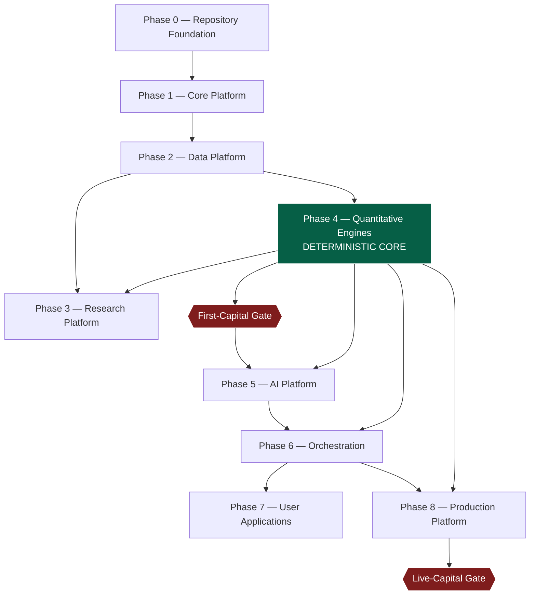
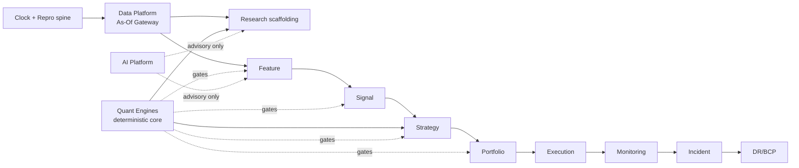
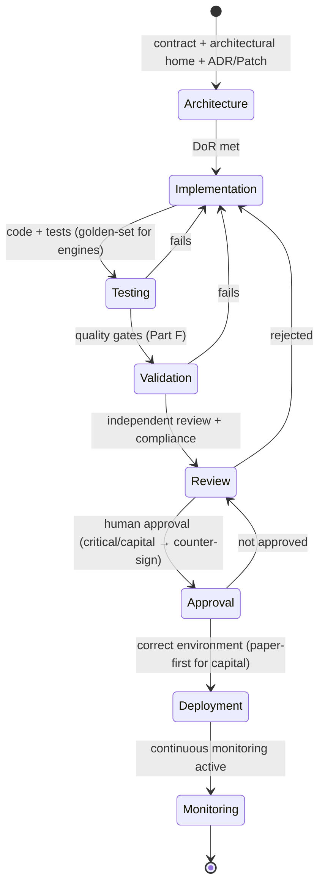
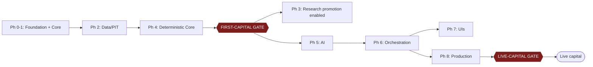

# Institutional Implementation Roadmap

| Field             | Value                                                                                                                                                                             |
| ----------------- | --------------------------------------------------------------------------------------------------------------------------------------------------------------------------------- |
| **Document ID**   | IMPLEMENTATION-ROADMAP                                                                                                                                                            |
| **Type**          | Canonical engineering implementation sequence                                                                                                                                     |
| **Clause prefix** | `IMP`                                                                                                                                                                             |
| **Owner**         | Architecture Review Board (**ARB**) + Principal Engineer (**PE**)                                                                                                                 |
| **Co-signers**    | GRC, HSRE, HQ, HPR, HD, HAI, CISO                                                                                                                                                 |
| **Governed by**   | `CLAUDE.md`; Architecture V1/V2; **Architecture Patch Plan** (correctness-enforcement sequence + release gates); all Rulebooks, Contracts, Registries, and Operational frameworks |
| **Version**       | 1.0.0                                                                                                                                                                             |
| **Status**        | PROPOSED (binding upon ARB ratification)                                                                                                                                          |
| **Last Ratified** | — (pending)                                                                                                                                                                       |

> **Nature & authority.** This roadmap answers **"what should be built, in what order, and why."** It is the canonical **build sequence** for the platform. It does **not** re-specify the architecture (that is Architecture V1/V2) and does **not** re-order the **correctness-enforcement sequence** (that is the Architecture Patch Plan). It **interleaves** the two: each build Phase declares which **Patch Plan patches** it must land and which **governance documents** govern it. Every future implementation decision MUST follow this roadmap. Where it and a higher-tier document conflict, the higher tier prevails and the roadmap is corrected.

> **Relationship to the Patch Plan.** The Patch Plan (`architecture_patch_plan.md`) sequences _what makes the platform correct and safe_ (Phases 1–6, the **First-Capital Gate** and **Live-Capital Gate**). This roadmap sequences _what to construct_ (Phases 0–8). The two are bound: no build Phase is COMPLETE until its declared patches are green, and no capital flows until the Patch Plan's gates are satisfied.

> **Reading note.** Technology-independent. No code, language/framework choices, or vendor technologies. Each major section carries **Purpose · Responsibilities · Acceptance Criteria · Failure Conditions · Cross References**, with embedded RFC 2119 rules (`IMP-n`). Mermaid diagrams, dependency graphs, state machines, RACI, and checklists are included where they clarify sequence.

---

## 1. Purpose

To transform the institutional governance framework into an executable, sequenced engineering plan — defining implementation phases, module dependencies, build order, engineering priorities, milestones, validation gates, acceptance criteria, and completion criteria — such that the platform is built **governance-first, contract-first, deterministic-core-before-AI, and capital-safe**, with every deliverable traceable to its governing documents.

Its governing intent is `CLAUDE.md` (the Constitution binds construction) and the Patch Plan (the enforcement mechanisms must be built into the right layers): the platform is assembled in an order that makes each guarantee real before the layer that depends on it exists.

## 2. Scope & Boundaries

- **Purpose.** Define the build phases (0–8), the module dependency model, implementation governance and quality gates, the deliverable registry, canonical engineering workflows, implementation risks, and success metrics.
- **Responsibilities.** Sequence construction; bind each Phase to its patches and governing documents; gate progression; ensure the deterministic core precedes AI and capital.
- **Boundaries (references only, never restated):**
  - **What the system is** → Architecture V1/V2; **the correctness/migration sequence + release gates** → Architecture Patch Plan.
  - **How to code/test/review/document/version** → RB-20 · CODE, RB-21 · TEST, RB-22 · REVIEW, RB-23 · DOC, RB-24 · GIT, RB-25 · ADR, RB-26 · NAME.
  - **Domain rules each deliverable must satisfy** → the relevant Rulebook/Registry/Contract/Operational framework (STAT, RMET, DATA, PIT, FAR, BT, PORT, RISK, AIGOV; Agent/Workflow Contracts; the six registries; Execution/Monitoring/Incident/DR governance).
- **Acceptance.** A build order in which every layer's guarantees are enforced before dependents exist; every deliverable traces to governing documents and patches. **Failure.** Building a dependent layer before its foundation's enforced guarantees exist (e.g., research before PIT; AI-decisions before deterministic engines; capital before gates). **Cross-refs.** Patch Plan §5, Architecture V2 §9.

## 3. Constitutional & Governance Basis

Traces to: `CLAUDE.md` **CP-1** (enforcement over intention), **CP-4/8**, **AR-1..4** (architecture governed change), **DE-1** (deterministic decisions), **SE-1..5** (engineering), **AM** (amendment via ADR); Architecture Patch Plan (all patches, gates); Architecture V2 (§9 governance, §12 conformance). Every build gate maps to a rulebook/framework enforcement clause.

---

## Clause Format

**Pivotal clauses** carry the full block: _Purpose · Rationale · Acceptance · Failure · Refs_. **Supporting clauses** carry RFC 2119 force plus a one-line rationale. Every clause has a stable ID (`IMP-n`, continuous).

---

# PART A — IMPLEMENTATION PHILOSOPHY

- **IMP-1 · Governance First (MUST).** The governance corpus (Constitution → Architecture → Rulebooks → Contracts) MUST exist and govern before code; construction implements governance, never the reverse. _Rationale:_ CP-1; code is the lowest tier. _Acceptance:_ every module traces to governing documents. _Failure:_ code that predates or contradicts its governance. _Refs:_ IMP-30.
- **IMP-2 · Architecture Before Code (MUST).** No module MAY be built without a ratified architectural home (Architecture V2 layer) and, if it changes architecture, an ADR + Patch ID. _Rationale:_ AR-1. _Refs:_ IMP-31.
- **IMP-3 · Deterministic Core Before AI (MUST).** The deterministic quantitative engines (statistics, validation, backtesting, risk, portfolio) MUST be built and enforced **before** any AI system is permitted to influence a decision; AI is layered on a working, testable deterministic core. _Rationale:_ DE-1, `P1-03`, REVIEW C3; AI must have deterministic engines to defer to. _Acceptance:_ Phase 4 complete before Phase 5 AI acts on decisions. _Failure:_ AI decision paths built before deterministic engines. _Refs:_ IMP-14, IMP-15.
- **IMP-4 · Scientific Integrity (MUST).** PIT correctness, leakage prevention, trial accounting, and reproducibility MUST be built into the foundations (data, engines) before research runs on them. _Rationale:_ REVIEW C1/C2/C4; retrofitting integrity is impossible. _Refs:_ IMP-12, IMP-14.
- **IMP-5 · Incremental Delivery (MUST).** The platform MUST be delivered in independently-valuable, testable increments, each passing its gates before the next depends on it. _Rationale:_ risk reduction; big-bang delivery fails. _Refs:_ IMP-9.
- **IMP-6 · Testability (MUST).** Every deliverable MUST be testable in isolation (injected dependencies, deterministic seams); untestable modules are not accepted. _Rationale:_ CODE-49; testability follows clean design. _Refs:_ IMP-42.
- **IMP-7 · Auditability (MUST).** Every deliverable and build event MUST be traceable (contracts, manifests, ADRs, Patch IDs); construction is itself auditable. _Rationale:_ CP-7. _Refs:_ IMP-50.
- **IMP-8 · Production Safety (MUST).** Nothing reaches capital except through the staged chain and the two release gates; paper-first is the default; execution is deterministic. _Rationale:_ DEP-1..4, RS-4; capital safety is non-negotiable. _Refs:_ IMP-24.
- **IMP-9 · Vendor Independence (MUST).** Modules MUST be built behind stable internal contracts so any vendor (model, data, broker, infra) is swappable; no core logic depends on a specific vendor. _Rationale:_ ARCH §0; portability. _Refs:_ IMP-11.

---

# PART B — IMPLEMENTATION PRINCIPLES

- **IMP-10 · Contract-First (MUST).** Contracts (schemas, interfaces) MUST be defined and ratified before the implementations that honor them; consumers depend on contracts, not implementations. _Rationale:_ SE-3, ARCH §2.17. _Refs:_ IMP-32.
- **IMP-11 · Interface Stability (MUST).** Public contracts MUST be stable and semantically versioned; breaking changes bump major and preserve historical artifacts (VER-1/2). _Rationale:_ CP-2, coupling control. _Refs:_ IMP-10.
- **IMP-12 · Dependency Minimization (MUST).** Modules MUST minimize dependencies and depend inward toward stable abstractions (CODE-22); hidden dependencies are PROHIBITED. _Rationale:_ SE-2, M3. _Refs:_ IMP-33.
- **IMP-13 · Module Independence (MUST).** Modules MUST be independently buildable, testable, and replaceable behind contracts (SE-3). _Rationale:_ modularity, scaling. _Refs:_ IMP-6.
- **IMP-14 · Iterative Development (SHOULD).** Modules SHOULD be built iteratively (contract → skeleton → tests → implementation → validation), each iteration gated. _Rationale:_ incremental delivery. _Refs:_ IMP-40.
- **IMP-15 · Backward Compatibility (MUST).** Changes MUST NOT break historical artifacts' interpretability or existing consumers without a governed migration (DEPR-*). *Rationale:* reproducibility, stability. *Refs:\* IMP-11.
- **IMP-16 · Deterministic Validation (MUST).** All consequential decisions MUST be implemented as deterministic, versioned, golden-tested engines (DE-1); AI is never in a decision path. _Rationale:_ the deterministic-engine mandate. _Refs:_ IMP-3.
- **IMP-17 · Reproducibility (MUST).** Every deterministic deliverable MUST be reproducible from its manifest; reproducibility is built in, not added (`P1-02`). _Rationale:_ CP-4. _Refs:_ IMP-45.

---

# PART C — IMPLEMENTATION PHASES

> Each Phase: **Purpose · Objectives · Deliverables · Dependencies · Validation Gates · Completion Criteria · Estimated Risk · Cross-refs.** "Lands (patches)" declares the Patch Plan patches the Phase MUST implement. Phases 0→8 are the _default_ order; the Dependency Model (Part D) is authoritative where parallelism is possible.

### Phase 0 — Repository Foundation

- **Purpose.** Establish the governed repository, standards, contract skeleton, and toolchain so all later work is compliant by construction.
- **Objectives.** Repository layout (per ARCH §2 / RB-26 · NAME); development standards enforced in CI (RB-20/21/22/23/24); shared contract framework skeleton (ARCH §2.17); configuration and secrets-reference model; documentation structure; ADR process live.
- **Deliverables.** Repo scaffolding; CI with coding/testing/review/doc/git/security gates; contract registry skeleton; config/environment separation; ADR repository (`docs/adr/`).
- **Dependencies.** Governance corpus (this exists).
- **Validation Gates.** CI enforces RB-20..26 gates; ADR governance operational; no secrets in repo (CODE-29).
- **Completion Criteria.** A change cannot merge without passing governance gates; contract-first workflow enforced.
- **Estimated Risk.** Low (foundational, well-understood).
- **Cross-refs.** RB-20..26, ADR Governance, `P5-02` (contract decomposition begins).

### Phase 1 — Core Platform

- **Purpose.** Build the platform substrate every layer stands on.
- **Objectives.** Domain model; shared libraries; configuration layer; **the reproducibility spine and PIT-safe clock**; message bus; artifact registry; identity/RBAC; state management; the contract framework.
- **Deliverables.** Central **clock authority** (injectable simulated/replay/real time); **artifact registry** (immutable, content-addressed); **message bus** (topics + ACLs); **identity/RBAC**; **Run Manifest + hermetic runner**; observability substrate.
- **Lands (patches).** **`P1-02`** (Reproducibility Spine), **`P1-03`** (determinism/stochastic separation established as an architectural boundary), `P5-04` (bus partitioning/ACLs foundation).
- **Dependencies.** Phase 0.
- **Validation Gates.** No ambient time/RNG access (CODE-40); deterministic artifacts reproducible from manifest; bus ACLs enforceable.
- **Completion Criteria.** Reproducibility spine + PIT-safe clock + identity + bus + artifact registry operational and tested.
- **Estimated Risk.** Medium (foundational correctness; hard to retrofit).
- **Cross-refs.** ARCH §2.1, V2 §5.10; RB-05 · REPRO; `P1-02/03`.

### Phase 2 — Data Platform

- **Purpose.** Provide certified, point-in-time-correct, provenance-bearing data — the only foundation research may stand on.
- **Objectives.** Ingestion (raw vault, connectors, normalizers, symbology, corporate actions, quality gates, bitemporal writer); **As-Of Gateway + vintage store**; dataset versioning; data-quality validation & certification; lineage; metadata/catalog; **Feature Factory (data side)**; **Leakage Harness**.
- **Deliverables.** **As-Of Gateway** (sole read path, fail-closed); vintage/restatement store; certification pipeline; survivorship-safe universes; lineage graph; data catalog; **Dataset Registry**.
- **Lands (patches).** **`P1-01`** (As-Of Gateway + Vintage), **`P1-06`** (Feature Factory PIT-bound), **`P2-03`** (Leakage Harness), `P1-04` (decompose data_semantic), `P5-01/03` (lifecycle, temporal store).
- **Dependencies.** Phase 1 (clock, manifests, registry).
- **Validation Gates.** No read without `as_of` (fail-closed); reference data as-of; survivorship-safe; leakage harness passing; reproducibility-critical data retained.
- **Completion Criteria.** All research/engine reads route through the certified As-Of Gateway; DATA/PIT/Dataset-Governance rules enforced.
- **Estimated Risk.** High (REVIEW C1 — the #1 way research dies; must be right).
- **Cross-refs.** ARCH §2.2/2.3, V2 §5.8; RB-06/07 · DATA, RB-08 · PIT, Dataset Governance; `P1-01/06`, `P2-03`.

### Phase 3 — Research Platform

- **Purpose.** Build the research lifecycle scaffolding: how ideas become registered, tracked, validated candidates (records/registries/workflow), consuming the Data Platform and the Quantitative Engines.
- **Objectives.** Research workflow; **Idea/Hypothesis/Experiment registries + Trial Ledger hooks**; **Feature Factory (definition/marketplace)**; **Signal generation lifecycle**; **Strategy lifecycle**; research journal; failed-research corpus; factor ontology; alpha factory; explainability.
- **Deliverables.** **Experiment Tracking**; **Feature Registry / Marketplace**; **Signal Registry**; **Strategy Registry**; research journal/timeline; ontology; Alpha Factory pipeline.
- **Lands (patches).** `P3-01/02/03/04/05/06/07/08/12`; **`P2-01`** (Trial Ledger — shared with Phase 4); `P2-07` (isolation-barrier hooks for generation).
- **Dependencies.** Phase 2 (data) and **Phase 4 (engines) for promotion** — see IMP-18 (interleave).
- **Validation Gates.** Register-before-run; pre-registration lock; trial-ledger enrollment; leakage-clean features; isolation barrier for generation; failed-research preserved.
- **Completion Criteria.** No research artifact exists/promotes without its registry entry, pre-registration, and (for promotion) the Phase-4 gates.
- **Estimated Risk.** High (scientific integrity; p-hacking surface).
- **Cross-refs.** ARCH §2.4/2.5, V2 §5.5; RB-02 · RMET, RB-10/09 · FAR; Experiment Tracking, Feature/Signal/Strategy Registries; `P3-*`.

### Phase 4 — Quantitative Engines (the deterministic core)

- **Purpose.** Build the deterministic engines that make **all consequential quantitative decisions** — the core that everything else defers to.
- **Objectives.** **Statistics engine** (deflation, multiple-testing budget); **Validation engine** (gauntlet, CPCV/PBO, holdout, replication, scientific gate); **Backtesting engine** (institutional realism); **Risk engine** (limits, kill-switch logic); **Portfolio engine** (net-of-cost optimization).
- **Deliverables.** **Immutable Trial Ledger**; **Multiple-Testing/Budget Enforcer**; **Holdout & Embargo Manager**; **CPCV/PBO framework**; **Independent Replication Engine**; **Pre-Capital Scientific Gate** (issues eligibility tokens); **Backtest engine** (borrow/fills/impact/capacity); **Risk limit engine + kill-switch**; **Portfolio optimizer**.
- **Lands (patches).** **`P2-01/02/05/06/08/09`**, **`P2-04`**, **`P3-16`**, **`P1-08`**, **`P1-03`** (all decision logic deterministic, golden-tested), `P3-10/11` (regime, capacity/crowding).
- **Dependencies.** Phase 1 (repro), Phase 2 (data). Enables Phase 3 promotion and Phase 8 capital.
- **Validation Gates.** Every decision deterministic + golden-tested; deflation enforced; PBO/holdout/replication gating; net-of-cost; **platform can run these engines with all AI suspended**.
- **Completion Criteria.** **This is the First-Capital Gate prerequisite** (Patch Plan §5): the Phase-1 spine + Phase-2/4 critical spine green. No factor may consume capital (paper or live) before this.
- **Estimated Risk.** High (the core; REVIEW C2/C6; the deepest quant risks live here).
- **Cross-refs.** ARCH §2.6/2.7/2.8, V2 §5.6/5.7; RB-01 · STAT, RB-11 · BT, RB-13 · RISK, RB-12 · PORT, RB-04 · VAL; **First-Capital Gate**.

### Phase 5 — AI Platform

- **Purpose.** Build the AI systems that propose and narrate at the fuzzy edges — **only after** the deterministic core exists for them to defer to.
- **Objectives.** Agent runtime; agent orchestration; context management; knowledge retrieval (RAG); tool execution; **agent governance enforcement** (contracts, authority flags, isolation, registry, evaluation).
- **Deliverables.** **Model Registry + eval gate**; **Agent Registry**; **Trust/Quarantine layer**; **rationalized agent roster** (narrators for validation/risk/portfolio); **deterministic arbiter**; **scoped Memory fabric**; **prioritization optimizer**; **Agent Evaluation** harness.
- **Lands (patches).** **`P4-01/02/03/04/05/06/07`**, **`P2-07`** (isolation barrier enforced end-to-end).
- **Dependencies.** **Phase 4 complete** (IMP-3 — AI defers to deterministic engines); Phase 1 (bus/identity), Phase 2 (as-of data).
- **Validation Gates.** No AI in any decision/execution path; every agent contract-bound, model-pinned, eval-gated; isolation barrier enforced (generators can't see validation/OOS); AI outputs provenance-recorded; **platform operates fully with all AI suspended**.
- **Completion Criteria.** AIGOV, Agent Contracts, Agent Registry, and Evaluation enforced; AI is advisory-only across the platform.
- **Estimated Risk.** High (REVIEW C3 — the LLM-in-decision-path failure; must be structurally impossible).
- **Cross-refs.** ARCH §2.11, V2 §5.2/5.3; RB-15 · AIGOV, Agent Contracts, Agent Registry, AI Agent Evaluation; `P4-*`, `P2-07`.

### Phase 6 — Orchestration Layer

- **Purpose.** Coordinate agents, engines, and humans through governed, durable workflows.
- **Objectives.** Workflow orchestration (durable DAGs, saga compensation, run ledger); scheduling; agent coordination; **approval engine** (tiered autonomy, human gates); governance enforcement (budget governor, gate routing).
- **Deliverables.** **Workflow engine** (Tier-5 Workflow Contracts realized); scheduler; **saga coordinator**; **run ledger**; **approval/tiered-autonomy engine**; budget governor + backpressure.
- **Lands (patches).** `P5-05` (tiered autonomy), `P5-06` (cost governance), orchestration of `P2-09` gates and `P4-07` prioritization.
- **Dependencies.** Phases 1, 4, 5.
- **Validation Gates.** Every critical activity runs through a Tier-5 workflow; no completion without the deterministic validation gate; human approval at critical transitions; compensation leaves consistent state; full run traceability.
- **Completion Criteria.** Workflow Contracts enforced; the staged research→production chain orchestrated end-to-end.
- **Estimated Risk.** Medium-High (coordination correctness; failure consistency).
- **Cross-refs.** ARCH §2.12, V2 §5.2/5.4; Workflow Contracts; `P5-05/06`.

### Phase 7 — User Applications

- **Purpose.** Provide human access, control, and the human-in-the-loop gates.
- **Objectives.** Research UI; Administration UI; Portfolio UI; Monitoring UI; Documentation portal.
- **Deliverables.** Human consoles surfacing registries, experiments, verdicts, portfolios, and monitoring; **approval/sign-off UIs**; documentation portal.
- **Dependencies.** Phases 2–6 (read/act via their contracts).
- **Validation Gates.** UIs act only through governed APIs/gates (no back-doors); approval UIs enforce human accountability + counter-sign; no UI bypasses a control.
- **Completion Criteria.** Humans can drive every consequential gate through governed interfaces; monitoring/approval visible.
- **Estimated Risk.** Medium (must not create control bypasses).
- **Cross-refs.** ARCH §2.16, V2; RB-20/23; human-in-the-loop (`P5-05`).

### Phase 8 — Production Platform

- **Purpose.** Operate live: execution, monitoring, alerting, incidents, recovery, and operational governance — the highest-consequence layer.
- **Objectives.** **Execution** (OMS, algos, adapters, paper engine, TCA, position ledger, reconciliation, parity); **Production Monitoring**; alerting; **Incident handling**; **Recovery (DR/BCP)**; operational governance; security hardening.
- **Deliverables.** **Execution engine** (paper-first, token-gated live, kill-switch); **parity harness**; **reconciliation**; **Production Monitoring** (independent, halt-integrated); **Incident Response** workflow; **DR/BCP** (tested RPO/RTO); security threat-model controls.
- **Lands (patches).** **`P3-15`** (parity), **`P1-10`** (calibration governance), **`P1-09`** (security), **`P6-03`** (DR/BCP), `P5-01` (lifecycle).
- **Dependencies.** All prior phases; deterministic core (Phase 4); risk (Phase 4) + portfolio (Phase 4).
- **Validation Gates.** Paper-first default; live impossible without governance authorization token; kill-switch human-invocable/never AI-gated; reversible; reconciliation clean; monitoring independent + halt-integrated; DR/BCP tested; separation of duties.
- **Completion Criteria.** **This is the Live-Capital Gate** (Patch Plan §5): additionally requires `P1-09`, `P3-15/16`, `P5-05`, `P6-03` at CRITICAL. No live capital before all are green.
- **Estimated Risk.** Highest (real capital; REVIEW C5/M6; DR/BCP mandatory).
- **Cross-refs.** ARCH §2.9/2.10, V2 §5.9; RB-14 · EXEC, RB-30 · DEPLOY; Execution/Monitoring/Incident/DR Governance; **Live-Capital Gate**.

---

## Phase dependency graph

- **IMP-18 (MUST).** Phase 3 (Research scaffolding) MAY begin in parallel with Phase 4, but **research promotion MUST NOT function until Phase 4 (deterministic engines) is complete and the First-Capital Gate is green**. _Rationale:_ research can be recorded without engines, but no result may be validated/promoted without them. _Refs:_ IMP-3.
- **IMP-19 (MUST).** Phase 5 (AI) MUST NOT build any decision/execution capability; AI is layered only after Phase 4 provides deterministic engines to defer to (IMP-3). _Rationale:_ the deterministic core precedes AI. _Refs:_ IMP-16.

---

# PART D — MODULE DEPENDENCY MODEL

- **IMP-20 (MUST).** Modules MUST be built respecting the dependency graph below; a module MUST NOT be built before the foundations it depends on are complete and their guarantees enforced. _Rationale:_ dependents inherit their foundations' correctness. _Acceptance:_ build order honors the graph. _Failure:_ a dependent built on an un-enforced foundation. _Refs:_ IMP-12.

- **IMP-21 (MUST).** The **data→research→feature→signal→strategy→portfolio→execution→monitoring** chain MUST be built in dependency order, with the **deterministic engines gating** feature/signal/strategy/portfolio acceptance at each step (the six registries + quant engines). _Rationale:_ the research-object chain is the platform's spine (the six registries + governance). _Refs:_ IMP-30.

---

# PART E — IMPLEMENTATION GOVERNANCE

- **IMP-22 (MUST).** Every deliverable MUST pass the governance gates below in order; a failed gate blocks progression (fail-closed). _Rationale:_ CP-1; construction is gated like everything else. _Refs:_ IMP-40.

**Implementation gates:**

| Gate                          | Requirement                                                                                                           | Owner            |
| ----------------------------- | --------------------------------------------------------------------------------------------------------------------- | ---------------- |
| **Definition of Ready (DoR)** | contract defined; architectural home + governing docs identified; acceptance criteria written; dependencies available | PE / domain lead |
| **Engineering Review**        | design reviewed; SRP, coupling, dependency direction (RB-20, RB-22)                                                   | PE               |
| **Architecture Compliance**   | conforms to Architecture V2; asset-agnostic core; invariants intact; ADR/Patch traced                                 | ARB              |
| **Testing**                   | required tests incl. golden-set for decision engines (RB-21)                                                          | PE               |
| **Documentation**             | governing docs cited; references resolve (RB-23)                                                                      | PE               |
| **Security**                  | secure-coding, secrets, deps scanned (RB-27 · SEC)                                                                    | CISO             |
| **AI Review**                 | if AI-touched: AIGOV limits, provenance, isolation (RB-15)                                                            | HAI              |
| **Human Approval**            | critical/capital-affecting changes human-approved + counter-signed                                                    | GRC              |
| **Definition of Done (DoD)**  | all gates green; deployed to the correct environment; monitored; auditable                                            | PE + ARB         |

- **IMP-23 · Definition of Ready (MUST).** No module MAY start without a ratified contract, an architectural home, governing documents, and acceptance criteria. _Rationale:_ IMP-10; unready work accrues rework and risk. _Refs:_ IMP-40.
- **IMP-24 · Definition of Done (MUST).** No module is DONE until all gates are green, it is reproducible/auditable, and (for capital-adjacent modules) its Patch-Plan patches are green and the applicable release gate is satisfied. _Rationale:_ CP-1, Patch Plan §5. _Acceptance:_ DoD checklist complete. _Failure:_ "done" work failing a gate. _Refs:_ IMP-8.

---

# PART F — QUALITY GATES

- **IMP-25 (MUST).** Every Phase MUST define and pass measurable quality gates across the dimensions below; unmeasured quality is not acceptable. _Rationale:_ CP-1, CODE-A1. _Refs:_ IMP-22.

| Quality dimension   | Gate (per Phase, thresholds governed)                              | Governing               |
| ------------------- | ------------------------------------------------------------------ | ----------------------- |
| **Functional**      | acceptance criteria met                                            | RB-21 · TEST            |
| **Deterministic**   | decision engines golden-tested; reproducible                       | DE-1, `P1-03`           |
| **Statistical**     | (research/engines) deflation/PBO/holdout enforced                  | RB-01 · STAT            |
| **Performance**     | latency/throughput within budget; as-of SLA                        | RB-29 · PERF (`P5-03`)  |
| **Security**        | secret-scan clean; deps scanned; threat-model controls             | RB-27 · SEC (`P1-09`)   |
| **Documentation**   | governing docs cited; references resolve                           | RB-23 · DOC             |
| **Reproducibility** | reproducible from manifest; reproducibility-critical data retained | RB-05 · REPRO (`P1-02`) |

- **IMP-26 (MUST).** The **Deterministic, Statistical, and Reproducibility** gates are **hard** for any research/engine/capital-adjacent deliverable; no other score compensates. _Rationale:_ these are the institution's integrity guarantees. _Refs:_ IMP-24.

---

# PART G — DELIVERABLE REGISTRY

- **IMP-27 (MUST).** Every implementation deliverable MUST be registered with module name, owner, dependencies, completion criteria, and governing documents; unregistered deliverables MUST NOT be built. _Rationale:_ CP-7; the deliverable registry is the build's source of truth. _Refs:_ IMP-50.

**Deliverable registry (representative — the authoritative set is maintained live):**

| Module                                                 | Owner     | Key dependencies         | Completion criteria                              | Governing documents                           |
| ------------------------------------------------------ | --------- | ------------------------ | ------------------------------------------------ | --------------------------------------------- |
| Clock + Repro spine                                    | PE/HSRE   | —                        | manifests reproduce; PIT-safe clock              | RB-05, `P1-02/03`                             |
| Artifact registry + bus + identity                     | HSRE      | Clock                    | immutable, ACL'd, auditable                      | ARCH §2.1                                     |
| As-Of Gateway + vintage store                          | HD        | Core Platform            | no non-as-of read; vintages preserved            | RB-08 · PIT, `P1-01`                          |
| Data ingestion + certification                         | HD        | As-Of Gateway            | certified, survivorship-safe, lineage            | RB-06/07 · DATA, DSG                          |
| Feature Factory + Leakage Harness                      | HD/HQ     | Data Platform            | as-of features; leakage-clean                    | `P1-06`, `P2-03`, FRG                         |
| Trial Ledger + MT Enforcer                             | HR/GRC    | Core Platform            | append-only; budget-gated                        | RB-01 · STAT, `P2-01/02`                      |
| Validation engine (gauntlet/holdout/replication/gate)  | GRC       | Trial Ledger, Data       | CPCV/PBO/one-shot holdout/replication/token      | RB-04 · VAL, `P2-05/06/08/09`                 |
| Backtest engine                                        | HQ        | Data, engines            | realism (borrow/fills/impact/capacity)           | RB-11 · BT, `P3-16`                           |
| Risk engine + kill-switch                              | HPR       | Portfolio, Execution     | deterministic limits; human-invocable halt       | RB-13 · RISK, `P1-03`                         |
| Portfolio optimizer                                    | HPR       | Engines, eligible alphas | net-of-cost, within limits                       | RB-12 · PORT, `P1-08`                         |
| Registries (Dataset/Feature/Signal/Strategy/Portfolio) | HD/HQ/HPR | respective layers        | register-before-use; lineage; immutable          | the six registry frameworks                   |
| Model/Agent Registry + Eval + Trust layer              | HAI/MRC   | Core, Data               | pinned/eval-gated; isolation; advisory-only      | RB-15 · AIGOV, Agent Contracts/Registry, Eval |
| Workflow engine + approval                             | HSRE      | Engines, AI              | Tier-5 contracts; staged chain; human gates      | Workflow Contracts, `P5-05`                   |
| Execution engine + parity + reconciliation             | HPR/HSRE  | Portfolio, Risk          | paper-first; token-gated; reversible; reconciled | Execution Governance, `P3-15`                 |
| Monitoring + Incident + DR/BCP                         | HSRE      | Production               | independent; halt-integrated; tested DR          | Monitoring/Incident/DR Governance, `P6-03`    |

---

# PART H — CANONICAL ENGINEERING WORKFLOW

- **IMP-28 (MUST).** Every deliverable MUST flow through the canonical engineering workflow below; stages MUST NOT be skipped, and it maps onto the Tier-5 Workflow Contracts for engineering work. _Rationale:_ WCON; a governed build workflow is auditable and safe. _Refs:_ IMP-22.

---

## Master Sequence & Release Gates (authoritative)

- **IMP-29 (MUST).** The build MUST honor the two Patch-Plan release gates as hard milestones: **First-Capital Gate** (after Phase 4 — the deterministic core + Phase-1/2 spine) before any factor consumes capital, paper or live; **Live-Capital Gate** (after Phase 8 — execution/monitoring/incident/DR + `P1-09/P3-15/16/P5-05/P6-03`) before any live capital. _Rationale:_ Patch Plan §5, DEP-4; these are non-negotiable. _Acceptance:_ no capital before its gate is green. _Failure:_ capital deployed before a gate. _Refs:_ IMP-8, IMP-24.

---

# PART I — IMPLEMENTATION RISK MANAGEMENT

- **IMP-30 (MUST).** Implementation risks MUST be tracked with likelihood, impact, mitigation, detection, and contingency; the highest risks MUST be de-risked earliest. _Rationale:_ build the riskiest correctness surfaces first. _Refs:_ IMP-4.

**Implementation risk register (representative):**

| Risk                               | Likelihood | Impact                | Mitigation                                         | Detection                | Contingency                                      |
| ---------------------------------- | ---------- | --------------------- | -------------------------------------------------- | ------------------------ | ------------------------------------------------ |
| PIT/leakage built incorrectly      | Med        | Critical              | build As-Of Gateway first (Ph 2); leakage harness  | leakage harness + audits | rebuild data layer; invalidate affected research |
| AI slips into a decision path      | Med        | Critical              | deterministic core first (Ph 4); AIGOV enforcement | AI-review gate; audits   | suspend AI capability; revert to deterministic   |
| Reproducibility not enforced early | Med        | High                  | repro spine in Ph 1                                | manifest checks          | retrofit is costly; halt promotions              |
| Contract-waist coupling            | Med        | High                  | contract-first; bounded contexts (`P5-02`)         | coupling metrics         | decompose contracts                              |
| Capital before gates               | Low        | Critical              | hard release gates (IMP-29)                        | gate enforcement         | block deployment                                 |
| Under-tested DR/BCP                | Med        | Critical (at go-live) | tabletop + live drills (Ph 8)                      | drill results            | delay live-capital                               |
| Scope/throughput outruns humans    | Med        | High                  | tiered autonomy (`P5-05`)                          | governance metrics       | throttle; add gates                              |
| Vendor lock-in                     | Med        | Med                   | contracts + adapters                               | dependency scans         | swap adapter                                     |

---

# PART J — SUCCESS METRICS

- **IMP-31 (MUST).** Success MUST be measured across the categories below on a governed cadence; metrics MUST NOT be gamed (safety/integrity precede velocity). _Rationale:_ CP-1, CI-1. _Refs:_ IMP-25.

| Category        | Metric                                                                        | Target                  |
| --------------- | ----------------------------------------------------------------------------- | ----------------------- |
| **Engineering** | phases delivered with all gates green                                         | 100% gated              |
| **Research**    | 0 unregistered/unreproducible research promotions                             | 100% compliant          |
| **Platform**    | as-of gateway coverage; reproducibility of deterministic artifacts            | 100%                    |
| **AI**          | 0 AI in decision/execution paths; platform operates AI-suspended              | 100%                    |
| **Operations**  | paper-first coverage; DR drills passing; parity clean                         | within governed targets |
| **Quality**     | golden-test coverage of decision engines; 0 secret leaks                      | 100% / 0                |
| **Governance**  | 0 capital before its release gate; 100% deliverables traced to governing docs | 100%                    |

---

## Responsibility Matrix (RACI)

| Roadmap activity                          | AI                    | Deterministic CI/gates | Engineering (PE/domain) | Governance (ARB/GRC) |
| ----------------------------------------- | --------------------- | ---------------------- | ----------------------- | -------------------- |
| Propose module / design                   | R (assist)            | —                      | **R**                   | A                    |
| Define contract (contract-first)          | assist                | R (validate)           | **R**                   | A (ARB)              |
| Implement                                 | R (assist, per RB-20) | —                      | **R**                   | I                    |
| Test / validate (quality gates)           | assist                | **R**                  | R                       | A                    |
| Architecture-compliance review            | —                     | R (checks)             | C                       | **A (ARB)**          |
| Human approval (critical/capital)         | ✗                     | R (gate)               | C                       | **A (GRC)**          |
| Advance release gate (First/Live-Capital) | ✗                     | R (gate)               | C                       | **A (GRC)**          |
| Deploy (paper-first)                      | ✗                     | **R**                  | A                       | A                    |
| Monitor                                   | narrate               | **R**                  | A                       | I                    |

---

## Acceptance Criteria (roadmap conformance)

The build is **roadmap-conformant** only when **all** hold:

- [ ] Governance-first: every module traces to governing documents + architectural home (IMP-1, IMP-2).
- [ ] Contract-first: contracts precede implementations; interfaces stable (IMP-10, IMP-11).
- [ ] Foundations before dependents: PIT/data before research; repro spine before engines (IMP-4, IMP-20).
- [ ] Deterministic core (Phase 4) before AI acts (Phase 5) (IMP-3, IMP-19).
- [ ] Every deliverable passes DoR → gates → DoD; hard quality gates enforced (IMP-22, IMP-26).
- [ ] First-Capital Gate before any capital; Live-Capital Gate before live (IMP-29).
- [ ] Paper-first; execution deterministic; DR tested before live (IMP-8).
- [ ] Full deliverable registry + traceability; risks tracked and de-risked earliest (IMP-27, IMP-30).

## Failure Conditions

The build is **non-conformant** if **any** hold:

- **IMP-32.** A dependent layer built before its foundation's guarantees are enforced (IMP-20).
- **IMP-33.** AI decision/execution capability built before/without the deterministic core (IMP-3).
- **IMP-34.** Research promotion enabled before the First-Capital Gate (IMP-18, IMP-29).
- **IMP-35.** Capital deployed (paper or live) before its release gate (IMP-29).
- **IMP-36.** A deliverable "done" while failing a hard quality gate (IMP-26).
- **IMP-37.** Code predating/contradicting its governance, or untraceable to governing docs (IMP-1, IMP-7).

---

## Enforcement & Verification

| Clause group                                     | Enforcement                                                    | Owner               |
| ------------------------------------------------ | -------------------------------------------------------------- | ------------------- |
| Governance/architecture-first (IMP-1,2)          | CI: architectural-home + ADR/Patch reference required          | ARB, RB-25 · ADR    |
| Contract-first / interface stability (IMP-10,11) | Contract gate; semantic-version checks                         | ARB, RB-20          |
| Foundation-order (IMP-20,21)                     | Build-order gate vs dependency graph                           | this roadmap        |
| Deterministic-core-before-AI (IMP-3,19)          | Phase gate: Phase 5 blocked until Phase 4 + First-Capital Gate | ARB, GRC            |
| Quality gates (IMP-25,26)                        | CI quality gates (hard for det/stat/repro)                     | PE, RB-21/05/01     |
| Release gates (IMP-29)                           | Capital blocked until gate green                               | GRC, Patch Plan §5  |
| Deliverable registry/traceability (IMP-27,37)    | Registry + reference-resolution                                | this roadmap, RB-23 |

- **IMP-E-1 (MUST).** Every Failure Condition (IMP-32..37) MUST be prevented by a deterministic gate and fail-closed. _Rationale:_ CP-1. _Refs:_ IMP-22.

## Exceptions & Waivers

- **IMP-W-1 (MUST).** No exception MAY be granted to: deterministic-core-before-AI (IMP-3), the release gates (IMP-29), hard quality gates (IMP-26), or any `CLAUDE.md` entrenched clause (AM-2). Non-waivable.
- **IMP-W-2 (MAY).** Sequencing within a Phase MAY be adjusted by ARB (recorded as an ADR) provided dependencies and gates are preserved.
- **IMP-W-3 (MUST).** Any deviation from this roadmap MUST be recorded as an ADR citing affected Phases/patches (Patch Plan §5, ADR-3). _Rationale:_ governed change.

## Ratification Criteria

Ratifiable only when: every clause has a stable ID, RFC 2119 phrasing, and an enforcement mechanism; no clause contradicts `CLAUDE.md`, the Architecture Canon, the Patch Plan (esp. §5 gates), or any rulebook/contract/framework; the build order preserves governance-first, contract-first, foundation-before-dependent, deterministic-core-before-AI, and the two release gates; all cross-references resolve; ARB approval with PE + GRC co-sign obtained.

## Success Metrics (of the roadmap)

- **SM-1.** 100% modules traced to governing documents + architectural home (IMP-1).
- **SM-2.** 0 dependents built before foundations; 0 AI-decision capability before the deterministic core (IMP-20, IMP-3).
- **SM-3.** 0 capital before its release gate; both gates enforced (IMP-29).
- **SM-4.** 100% deliverables through DoR→gates→DoD; hard gates never bypassed (IMP-24, IMP-26).
- **SM-5.** Highest-risk correctness surfaces (PIT, reproducibility, deterministic core) delivered earliest (IMP-30).
- **SM-6.** 100% deliverables reproducible + auditable; 0 secret leaks (IMP-17, IMP-7).
- **SM-7.** Platform demonstrably operates its deterministic controls with all AI suspended at each capital gate (IMP-19).

## Dependencies & Related Documents

- **Governed by:** `CLAUDE.md`; Architecture V1/V2; **Architecture Patch Plan** (correctness sequence + gates); Rulebook Framework.
- **Sequences the construction of / references:** all Rulebooks (STAT/RMET/DATA/PIT/FAR/BT/PORT/RISK/AIGOV/CODE + forthcoming), Agent & Workflow Contracts, the six Registries (Dataset/Feature/Signal/Strategy/Portfolio + Agent), ADR Governance, AI Agent Evaluation, and the operational frameworks (Execution, Monitoring, Incident, DR/BCP).
- **Architecture references:** ARCH §2 (all layers), Architecture V2 §5/§9/§12; Patch Plan Phases 1–6 + §5 gates; REVIEW (risk prioritization).

## Change Log & Version History

| Version | Date    | Author (role) | Change                          |
| ------- | ------- | ------------- | ------------------------------- |
| 1.0.0   | pending | ARB + PE      | Initial Implementation Roadmap. |

---

## Glossary (roadmap-specific)

Terms in `CLAUDE.md`, the Architecture Canon, and prior-framework glossaries (First-Capital Gate, Live-Capital Gate, deterministic engine, As-Of Gateway, staged chain, tiered autonomy, reproducibility spine) are not redefined.

- **Build Phase (0–8)** — A sequenced construction stage with declared patches, deliverables, gates, and completion criteria (Part C).
- **Deterministic Core** — The Phase-4 quantitative engines that make all consequential decisions; built before AI (IMP-3).
- **Definition of Ready / Done (DoR/DoD)** — The entry/exit gates bounding every deliverable (IMP-23/24).
- **Release Gate** — First-Capital / Live-Capital hard milestones from the Patch Plan, honored as build milestones (IMP-29).
- **Deliverable Registry** — The authoritative list of modules with owners, dependencies, completion criteria, and governing documents (IMP-27).
- **Interleave** — Permitted parallelism (e.g., Phase 3 scaffolding with Phase 4 engines) subject to the dependency graph and gates (IMP-18).

---

_End of Institutional Implementation Roadmap. It is the canonical engineering sequence for building the platform from its governance: construction proceeds governance-first and contract-first, with foundations (repro spine, PIT-correct data) before dependents, the deterministic quantitative core before any AI, AI as advisory-only, orchestration and interfaces after, and production last — with the First-Capital Gate before any factor consumes capital and the Live-Capital Gate before any live capital. Every deliverable is registered, traced to its governing documents and patches, passes DoR → engineering/architecture/testing/documentation/security/AI/human gates → DoD, and is reproducible and auditable. The riskiest correctness surfaces — point-in-time, reproducibility, and the deterministic core — are built earliest; the platform must operate its deterministic controls with all AI suspended at every capital gate; and no capital flows except through the staged chain and the two release gates. This roadmap sequences the build; the Patch Plan sequences the correctness; together they turn the institution's governance into a production-grade quantitative research platform. Binding upon ARB ratification._
