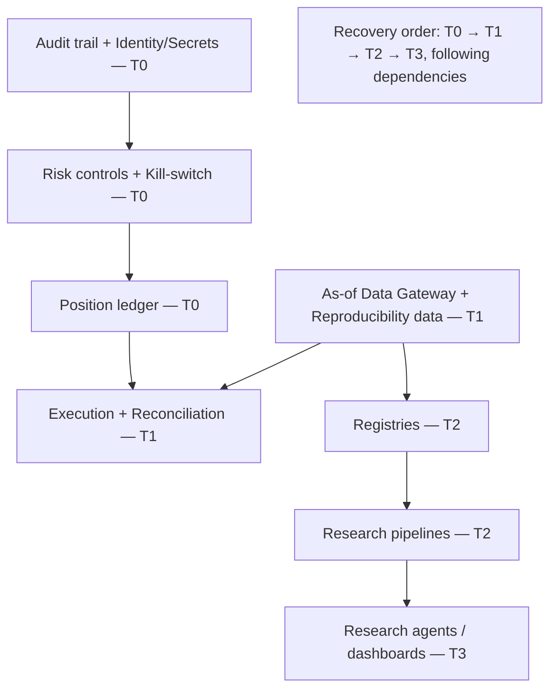
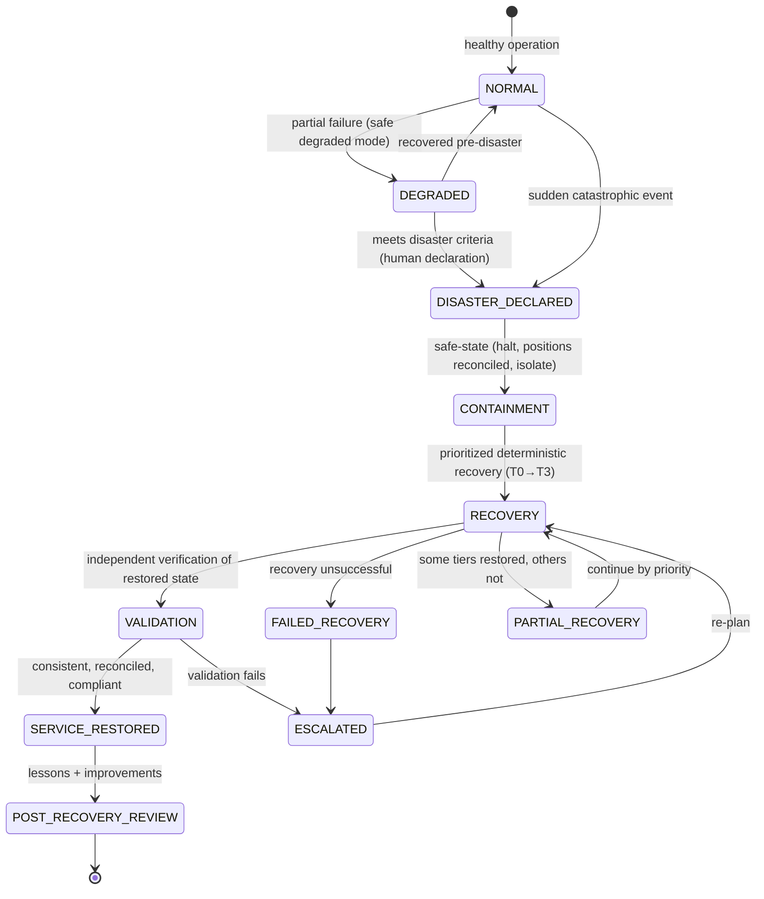

# Disaster Recovery & Business Continuity Governance Framework

| Field             | Value                                                                                                                                                             |
| ----------------- | ----------------------------------------------------------------------------------------------------------------------------------------------------------------- |
| **Document ID**   | DR-BCP-GOVERNANCE                                                                                                                                                 |
| **Type**          | Operational continuity-governance framework (realizes RB-32 · CONT + DR/BCP, `P6-03`)                                                                             |
| **Clause prefix** | `DR`                                                                                                                                                              |
| **Owner**         | Head of Platform / SRE (**HSRE**)                                                                                                                                 |
| **Co-signers**    | Governance & Risk Committee (**GRC**), Head of Portfolio & Risk (**HPR**), Head of Security (**CISO**), Head of AI (**HAI**), Architecture Review Board (**ARB**) |
| **Governed by**   | `CLAUDE.md`; Architecture V2 (§10); RB-32 · CONT; RB-31 · INC; RB-13 · RISK                                                                                       |
| **Version**       | 1.0.0                                                                                                                                                             |
| **Status**        | PROPOSED (binding upon ARB ratification)                                                                                                                          |
| **Last Ratified** | — (pending)                                                                                                                                                       |

> **Position & authority.** This framework is the **governance standard for disaster recovery and business continuity** — how the platform prepares for, responds to, and recovers from catastrophic failures while preserving research integrity, operational continuity, and governance compliance. It realizes RB-32 · CONT and the DR/BCP patch (`P6-03`) at the governance level and is **invoked by Incident Response (IR) for L5/emergency events**, required by **Execution Governance** before live capital, and mandated by **RB-13 · RISK** (RISK-52).

> **Continuity priorities.** In a disaster, the platform preserves in order: (1) **capital safety** (safe state, known/reconciled positions, halt), (2) **research integrity** (reproducibility-critical data and the immutable audit trail survive), (3) **governance compliance** (controls remain enforced), then (4) service availability. **Disaster declaration and recovery authorization are human; recovery execution is deterministic; recovery is independently validated; DR/BCP is mandatory before live capital** (RE-1/3, RS-3, HO-1/4, DE-1, CP-4/5/7).

> **Reading note.** Technology-independent. Not an infrastructure DR manual, cloud guide, or implementation document. No cloud/vendor procedures or code. Each major section carries **Purpose · Responsibilities · Boundaries · Acceptance · Failure · Cross-refs**, with embedded RFC 2119 rules (`DR-n`). **Every critical platform capability MUST have an approved DR/BCP plan.**

---

## 1. Purpose

To define the immutable governance for resilience and continuity — answering **what constitutes a disaster, which services are mission-critical, how recovery priorities are established, who authorizes recovery, how business continuity is maintained, how recovery is validated, and how organizational learning is preserved.** DR/BCP is the platform's survival function: it ensures that a catastrophic failure cannot destroy capital, corrupt the research record, or bypass governance — and that critical capability is restored in a known, verified, consistent state.

Its governing intent is `CLAUDE.md` RE-1..3 and CP-4: continuity is designed in, tested, and mandatory before live capital; reproducibility-critical data and the audit trail survive any disaster; and recovery restores a consistent, reconciled, governance-compliant state.

## 2. Scope & Boundaries

- **Purpose.** Define recovery philosophy, business-continuity principles, critical-service and disaster classification, the recovery authority model, RTO/RPO, priority levels, dependency mapping, the recovery lifecycle, AI/deterministic/human responsibilities, communication, evidence, audit, testing, and continuous improvement.
- **Responsibilities.** Prepare DR/BCP plans for critical capabilities; declare disasters; execute prioritized, human-authorized, deterministic recovery; maintain continuity in degraded mode; validate recovery; preserve evidence and learning; test regularly.
- **Boundaries (references only, never restated):**
  - **Incident lifecycle, RCA, containment _for incidents_** → **Incident Response (IR)**; a disaster is a catastrophic incident escalated into DR.
  - **Execution halt/emergency shutdown, kill-switch** → **Execution Governance (EG)**, **RB-13 · RISK** (RISK-38); DR _invokes_ these for safe-state.
  - **Detection/alerting** → **Production Monitoring (MON)**; **DR/BCP _mechanism_ (backups, failover, RPO/RTO tooling)** → **RB-32 · CONT** (`P6-03`).
  - **Cyber-disaster/forensics, secrets, audit-trail integrity** → **RB-27 · SEC** (`P1-09`); **backup/retention lifecycle** → **RB-29 · PERF** (`P5-01`).
  - **Reproducibility-critical data definition** → **Dataset Governance (DSG-90)**, **RB-05 · REPRO**; **post-recovery decisions** → **ADR Governance**; **AI role boundaries** → **RB-15 · AIGOV**.
- **Acceptance.** Every critical capability has an approved, tested DR/BCP plan; disasters are human-declared, deterministically recovered, and independently validated; reproducibility-critical data survives. **Failure.** A critical capability without a DR/BCP plan, a disaster recovered without validation, or reproducibility-critical data lost. **Cross-refs.** ARCH V2 §10, RE-1..3, `P6-03`.

## 3. Constitutional & Governance Basis

Traces to: `CLAUDE.md` **RE-1..3** (reliability, feedback, DR/BCP mandatory before live), **RS-1..3** (risk, emergency shutdown, halt), **HO-1/4** (accountability, non-delegable halt), **DE-1** (deterministic recovery), **CP-4** (reproducibility), **CP-5** (independence), **CP-7** (audit), **CI-3** (systemic learning); RB-32 · CONT, RB-31 · INC, RB-13 · RISK; PATCH **P6-03** (DR/BCP), **P1-09** (audit integrity), **P5-01** (backup/retention); Architecture V2 §10 (DR/BCP NFR, escalates to CRITICAL at go-live); ARCH §2.10 (emergency shutdown); REVIEW Missing #13 (DR/BCP absent in V1), M6.

---

## Clause Format

**Pivotal clauses** carry the full block: _Purpose · Rationale · Acceptance · Failure · Refs_. **Supporting clauses** carry RFC 2119 force plus a one-line rationale. Every clause has a stable ID (`DR-n`, continuous).

---

# PART A — RECOVERY PHILOSOPHY

- **DR-1 · Survive First, Restore Second (MUST).** DR/BCP MUST first preserve capital safety, research integrity, and governance compliance — then restore service; availability MUST NOT be restored at the expense of these. _Rationale:_ RE, RS-1; a fast unsafe restoration re-creates the disaster. _Acceptance:_ safe-state + integrity precede service restoration. _Failure:_ restoring service on unreconciled/corrupted state. _Refs:_ DR-30.
- **DR-2 · Reproducibility Survives Any Disaster (MUST).** Reproducibility-critical data (raw vault, certified vintages consumed by artifacts, manifests, lineage, registries, audit trail) MUST survive any disaster within RPO; a disaster MUST NOT destroy the institution's ability to reproduce and audit its research. _Rationale:_ CP-4, DSG-90; the research record is the institution's irreplaceable asset. _Acceptance:_ reproducibility-critical data restorable within RPO. _Failure:_ loss of reproducibility-critical data. _Refs:_ DR-40.
- **DR-3 · Human Recovery Authority (MUST).** Disaster declaration and recovery authorization are human governance acts; AI MUST NOT declare disasters or authorize recovery. _Rationale:_ HO-1, AI-3; these are high-consequence institutional decisions. _Refs:_ DR-24.
- **DR-4 · Deterministic Recovery (MUST).** Recovery MUST execute governed, deterministic procedures restoring a consistent, reconciled state; ad-hoc or AI-driven recovery of capital/control/data systems is PROHIBITED. _Rationale:_ DE-1, RE-1. _Refs:_ DR-30.
- **DR-5 · Evidence Preserved (MUST).** DR/BCP activities and evidence MUST be preserved immutably; the audit trail MUST itself be resilient (survive the disaster). _Rationale:_ CP-7; a lost audit trail is an integrity catastrophe. _Refs:_ DR-52.
- **DR-6 · Tested Continuity (MUST).** DR/BCP plans MUST be regularly tested (tabletop + drills); an untested plan is presumed non-functional and MUST NOT be relied upon for go-live. _Rationale:_ RE-3; plans decay; untested recovery fails under pressure. _Refs:_ DR-55.
- **DR-7 · Continuous Improvement (MUST).** Every disaster and every test MUST produce lessons and systemic improvements to the plans. _Rationale:_ CI-3. _Refs:_ DR-60.

---

# PART B — BUSINESS CONTINUITY PRINCIPLES

- **DR-8 (MUST).** Critical capabilities MUST be able to operate in a **safe degraded mode** during a disaster: positions knowable and reconciled, risk limits and kill-switch functional, and the audit trail intact — even if research and non-critical services are paused. _Rationale:_ RS; continuity means preserving control and capital safety, not full function. _Acceptance:_ in degraded mode the platform can know positions, honor limits, and halt. _Failure:_ a disaster in which positions are unknown or the kill-switch is unavailable. _Refs:_ DR-13.
- **DR-9 (MUST).** Business continuity MUST NOT permit ungoverned operation: during a disaster, no control (risk, execution authorization, validation) may be bypassed to "keep running"; if a control cannot be honored, the affected activity halts. _Rationale:_ CP-1; disasters MUST NOT become an excuse to bypass governance. _Refs:_ DR-30.
- **DR-10 (MUST).** Continuity plans MUST preserve **vendor independence**: recovery MUST NOT depend on a single vendor/venue/provider whose loss is itself the disaster; critical dependencies MUST have contingency (RISK-47). _Rationale:_ single-vendor dependence is a continuity tail risk (REVIEW). _Refs:_ DR-16.

---

# PART C — CRITICAL SERVICE CLASSIFICATION

- **DR-11 (MUST).** Every platform capability MUST be classified by criticality below; classification sets RTO/RPO, recovery priority, and DR/BCP rigor. Capabilities MUST NOT operate in production without a criticality classification and an approved plan. _Rationale:_ prioritization is impossible without classification. _Acceptance:_ every production capability classified + planned. _Failure:_ an unclassified/unplanned production capability. _Refs:_ DR-17.

**Critical-service classification (RTO/RPO are GRC-governed parameters):**

| Tier                      | Definition                                | Examples                                                                                       | Recovery priority                 |
| ------------------------- | ----------------------------------------- | ---------------------------------------------------------------------------------------------- | --------------------------------- |
| **T0 — Life-support**     | loss threatens capital/integrity survival | audit trail, risk controls & kill-switch, position ledger, secrets/identity                    | restore first (near-zero RTO/RPO) |
| **T1 — Mission-critical** | required for safe production              | execution + reconciliation, risk monitoring, as-of data gateway, reproducibility-critical data | restore second (tight RTO/RPO)    |
| **T2 — Important**        | core research operation                   | research pipelines, registries, feature/experiment stores, monitoring                          | restore third                     |
| **T3 — Deferrable**       | non-critical/enhancing                    | research agents, dashboards, non-essential analytics                                           | restore last / operate reduced    |

- **DR-12 (MUST).** **T0 capabilities MUST be the most resilient** — redundant, backed up, and recoverable near-instantly with near-zero data loss; the audit trail and position ledger MUST NOT be lost. _Rationale:_ CP-7, RS; without these the institution cannot know its state or defend its actions. _Refs:_ DR-2.

---

# PART D — DISASTER CLASSIFICATION

- **DR-13 (MUST).** An event MUST be classified as a **disaster** when it meets the criteria below — a catastrophic failure that overwhelms normal incident response and threatens continuity of a T0/T1 capability, capital, or research integrity. Disasters are escalated from Incident Response (IR L5/Emergency) or declared directly. _Rationale:_ clear criteria prevent both over- and under-declaration. _Acceptance:_ disaster criteria defined and applied. _Failure:_ a catastrophic event not declared a disaster. _Refs:_ DR-19.

**Disaster classes:**

| Class                         | Examples                                                                         |
| ----------------------------- | -------------------------------------------------------------------------------- |
| **Infrastructure disaster**   | data-center/region loss, systemic compute/storage/network failure                |
| **Data disaster**             | catastrophic data loss/corruption, loss of reproducibility-critical data         |
| **Cyber disaster**            | systemic breach, ransomware, mass exfiltration, poisoning at scale (RB-27 · SEC) |
| **Execution/market disaster** | broker/venue systemic failure mid-session, uncontrolled position state           |
| **Governance disaster**       | systemic control failure, audit-trail compromise, mass integrity breach          |
| **Personnel disaster**        | loss of key personnel/access (key-person risk)                                   |

- **DR-14 (MUST).** A **governance disaster** (audit-trail compromise, systemic control bypass) MUST be treated as the highest severity: it threatens the institution's ability to trust its own record; recovery MUST restore control integrity and prove the record's integrity before resuming. _Rationale:_ CP-7; a compromised record is worse than an outage. _Refs:_ DR-30.

---

# PART E — RECOVERY AUTHORITY MODEL

- **DR-15 (MUST).** Recovery authority follows the model below; no participant MAY exceed its role. Disaster declaration and recovery/resumption authorization are **human governance** acts. _Rationale:_ HO-1, DE-1. _Refs:_ RACI.

| Role                                      | Authority                                                                                   |
| ----------------------------------------- | ------------------------------------------------------------------------------------------- |
| **Human Governance (GRC + HPR/CISO/HAI)** | declare disaster; authorize recovery, failover, and business resumption; approve exceptions |
| **DR Commander (human, HSRE)**            | coordinate recovery; own the plan execution                                                 |
| **Deterministic Systems**                 | execute recovery/failover procedures, restore state, reconcile, preserve records            |
| **AI Agents**                             | assist detection/assessment, preserve evidence, report — advisory only                      |
| **Architecture Owners (ARB)**             | own architectural recovery + post-recovery ADRs                                             |

- **DR-16 (MUST).** Recovery MUST NOT depend on a single point of authority: a documented **succession/delegation** of declaration and authorization authority MUST exist so recovery is not blocked by an unavailable individual (key-person continuity). _Rationale:_ DR-10; the authority model must itself be resilient. _Refs:_ DR-24.

---

# PART F — RECOVERY OBJECTIVES (RTO / RPO)

- **DR-17 (MUST).** Every critical capability MUST have a defined, GRC-governed **Recovery Time Objective (RTO)** and **Recovery Point Objective (RPO)** proportionate to its tier; T0 near-zero, T1 tight, degrading by tier. _Rationale:_ RE-3; RTO/RPO make recovery expectations concrete and testable. _Acceptance:_ RTO/RPO defined per capability. _Failure:_ a critical capability without RTO/RPO. _Refs:_ DR-55.
- **DR-18 (MUST).** **RPO for reproducibility-critical data and the audit trail MUST be near-zero** (no material loss of raw vault, certified vintages, manifests, lineage, registries, or audit trail); backups MUST meet this RPO. _Rationale:_ DR-2, CP-4/7; the record cannot be re-created. _Acceptance:_ reproducibility-critical RPO ≈ 0, verified by restore tests. _Failure:_ an RPO permitting loss of the record. _Refs:_ DR-40.
- **DR-19 (MUST).** RTO/RPO MUST be **validated by test** (DR-55), not merely declared; an untested RTO/RPO is aspirational and MUST NOT be relied upon for go-live. _Rationale:_ RE-3; declared ≠ achievable. _Refs:_ DR-6.

---

# PART G — RECOVERY PRIORITY & DEPENDENCY MAPPING

- **DR-20 · Recovery Priority Levels (MUST).** Recovery MUST proceed by priority: **T0 (safe-state: audit, risk controls, position ledger) → T1 (capital-safe production: execution/reconciliation, risk monitoring, data gateway, reproducibility data) → T2 → T3**; a lower tier MUST NOT be restored ahead of an unrecovered higher tier it depends on. _Rationale:_ restoring dependents before dependencies fails; safe-state first. _Acceptance:_ recovery follows priority order. _Failure:_ restoring research/trading before the audit/risk/ledger are safe. _Refs:_ DR-21.
- **DR-21 · Service Dependency Mapping (MUST).** A current **dependency map** MUST exist for critical capabilities (which service depends on which, and on which external providers); recovery sequencing MUST follow it, and a defect/decay in a dependency MUST propagate to dependents' recovery plans. _Rationale:_ recovery order is dependency-driven; hidden dependencies break recovery. _Acceptance:_ dependency map current and used for sequencing. _Failure:_ recovery attempted without a dependency map. _Refs:_ DR-20.

---

# PART H — RECOVERY LIFECYCLE

- **DR-22 (MUST).** Disaster recovery MUST follow the state machine below; states MUST NOT be skipped, transitions are gated/recorded, evidence preserved throughout, and **safe-state (containment) precedes recovery execution**. _Rationale:_ DR-1; a governed recovery is safe and auditable. _Refs:_ DR-23.

### Disaster Detection

- **DR-23 (MUST).** Disasters MUST be detectable via Production Monitoring (MON) and human observation; monitoring for T0/T1 continuity conditions MUST be resilient (survive the disaster it is meant to detect). _Rationale:_ MON; a monitoring system that dies with the platform cannot detect the disaster. _Refs:_ DR-13.

### Disaster Declaration

- **DR-24 (MUST).** A disaster MUST be **formally declared by human governance** (or delegated authority, DR-16), activating the DR/BCP plan and the recovery authority model; ambiguity MUST resolve toward declaring (declare and stand down beats under-reacting). _Rationale:_ HO-1, RS; formal declaration mobilizes the response and authority. _Acceptance:_ declaration recorded with authority + timestamp. _Failure:_ a catastrophic event handled ad hoc without declaration. _Refs:_ DR-3.

### Containment (Safe-State)

- **DR-25 (MUST).** On declaration, containment MUST establish a **safe state**: halt execution (kill-switch/emergency shutdown per EG/RISK), reconcile and record positions, isolate the affected systems, and secure the audit trail — before recovery execution. _Rationale:_ DR-1, RS-3; capital and record safety first. _Acceptance:_ execution halted, positions known/reconciled, audit secured. _Failure:_ recovering while capital is exposed or positions unknown. _Refs:_ DR-8.

### Recovery Execution

- **DR-26 (MUST).** Recovery MUST execute the governed, deterministic plan in priority order (DR-20), restoring from backups/failover meeting RPO; recovery MUST restore a **consistent, reconciled** state (no partial/corrupt writes) and MUST NOT bypass governance controls. _Rationale:_ DR-4, RE-1. _Refs:_ DR-27.

### Recovery Validation

- **DR-27 (MUST).** Restored state MUST be **independently validated** (by a party other than the executor) for consistency, completeness, reconciliation, reproducibility (spot-restore + re-run test), and control integrity, before SERVICE_RESTORED. _Rationale:_ CP-5; self-validated recovery hides corruption. _Acceptance:_ independent validation recorded; reproducibility + controls verified. _Failure:_ declaring restored on unvalidated/self-validated state. _Refs:_ DR-2.

### Business Resumption

- **DR-28 (MUST).** Full business resumption (esp. live capital) MUST be **human-authorized** after validation, with re-authorization of execution (Execution Governance token) and confirmation that risk controls, monitoring, and the audit trail are fully operational. Research resumption MUST confirm no reproducibility loss. _Rationale:_ RE, DEP; resuming into an unverified state re-triggers the disaster. _Acceptance:_ human-authorized resumption post-validation; controls confirmed. _Failure:_ resuming trading before controls/monitoring verified. _Refs:_ DR-30.

### Post-Recovery Review

- **DR-29 (MUST).** Every disaster MUST have a post-recovery review producing RCA, corrective/preventive actions, plan updates, and (where architectural) ADRs; lessons MUST be preserved and drive continuous improvement. _Rationale:_ CI-3; the disaster's value is the resilience it forces. _Refs:_ DR-60.

---

# PART I — RESPONSIBILITIES DURING RECOVERY

## AI Responsibilities

- **DR-30 (MUST).** During recovery, AI systems MAY assist detection/assessment, preserve evidence, and report status/uncertainty — advisory only. AI systems MUST NOT declare disasters, authorize recovery, execute recovery of capital/control/data systems, close the disaster, or modify evidence. _Rationale:_ AI-1/3, DR-3/4; recovery is deterministic/human. _Acceptance:_ AI advisory-only throughout recovery. _Failure:_ AI declaring/authorizing/executing recovery. _Refs:_ DR-24.
- **DR-31 (MUST).** DR/BCP MUST NOT depend on AI availability: suspending all AI MUST NOT impair detection-of-record, containment, deterministic recovery, or the audit trail (AIGOV-61). _Rationale:_ the platform must recover with all AI off. _Refs:_ DR-8.

## Deterministic System Responsibilities

- **DR-32 (MUST).** Deterministic systems MUST execute containment (halt), recovery/failover procedures, reconciliation, and record preservation; they hold execution authority for recovery actions and MUST fail-closed (halt) if a safe state cannot be established. _Rationale:_ DE-1, RS-3. _Refs:_ DR-25.

## Human Approval Requirements

- **DR-33 (MUST).** Humans MUST authorize: disaster declaration, recovery plan activation, failover, business/live-capital resumption, and any exception to a control during recovery. High-consequence authorizations MUST be counter-signed. _Rationale:_ HO-1/2; the highest-consequence institutional decisions. _Acceptance:_ each recorded with authority. _Failure:_ an AI- or un-authorized recovery decision. _Refs:_ DR-15.

---

# PART J — COMMUNICATION, EVIDENCE & AUDIT

## Communication Governance

- **DR-34 (MUST).** Disaster communications MUST reach the recovery team, governance, and required stakeholders promptly and accurately; status MUST be truthful (no downplaying); communications MUST be recorded. _Rationale:_ CP-7, IR-5; coordinated, honest communication is essential to recovery and defensibility. _Refs:_ DR-52.
- **DR-35 (SHOULD).** A pre-defined communication plan (contacts, channels, cadence, external/regulatory notification triggers) SHOULD exist and be tested. _Rationale:_ improvised communication fails under pressure. _Refs:_ DR-55.

## Evidence Preservation

- **DR-36 (MUST).** All disaster evidence, decisions, actions, and timeline MUST be preserved immutably and tamper-evidently (RB-27 · SEC); the audit trail MUST be **resilient** (replicated so it survives the disaster). _Rationale:_ DR-5, CP-7; the record of the disaster is itself critical. _Acceptance:_ disaster evidence + audit trail survive and are complete. _Failure:_ lost/altered disaster evidence. _Refs:_ DR-40.

## Audit Requirements

- **DR-37 (MUST).** Every disaster MUST maintain immutably: **disaster ID, class, severity, declaration (authority/time), affected capabilities, timeline, decisions, recovery actions, RTO/RPO achieved vs target, validation results, resumption authorization, and post-recovery report**. _Rationale:_ CP-7; DR audit is core to resilience improvement and regulatory defensibility. _Acceptance:_ an auditor reconstructs the disaster end-to-end. _Failure:_ a disaster with missing/mutable records. _Refs:_ DR-36.

---

# PART K — RECOVERY TESTING GOVERNANCE

- **DR-38 · Recovery Testing (MUST).** DR/BCP plans MUST be tested on a governed cadence; testing MUST verify RTO/RPO achievement, data restorability (incl. reproducibility-critical data), failover, and control integrity post-recovery. **DR/BCP MUST be tested and passing before any live-capital go-live** (RE-3, ARCH V2 §10). _Rationale:_ RE-3; untested plans fail; DR is a live-capital gate. _Acceptance:_ tests pass; go-live gated on DR readiness. _Failure:_ going live without tested DR/BCP. _Refs:_ DR-6.

### Tabletop Exercises

- **DR-39 (MUST).** Tabletop exercises MUST be conducted periodically to rehearse declaration, authority, coordination, and decision-making for representative disaster scenarios (incl. governance/cyber disasters); findings MUST drive plan improvements. _Rationale:_ decision-making under pressure must be practiced. _Refs:_ DR-60.

### Periodic Recovery Validation

- **DR-40 (MUST).** Actual recovery capability MUST be periodically validated by live drills (e.g., restore-from-backup, failover) — not merely tabletop — confirming that reproducibility-critical data restores within RPO and controls function post-recovery. _Rationale:_ RE-3; only real drills prove real capability. _Acceptance:_ live drills pass within RTO/RPO. _Failure:_ relying on untested recovery. _Refs:_ DR-18.

---

# PART L — LESSONS LEARNED & CONTINUOUS IMPROVEMENT

- **DR-41 (MUST).** Lessons from disasters and tests MUST be preserved in the institutional knowledge base and drive concrete plan, control, and architecture improvements (ADRs where architectural); recurring weaknesses MUST be systematically fixed. _Rationale:_ CI-3; resilience compounds through learning. _Refs:_ DR-29.
- **DR-42 (MUST).** DR/BCP plans, RTO/RPO, dependency maps, and classifications MUST be reviewed and updated on a governed cadence and after any material architecture/dependency change; stale plans are a latent catastrophe. _Rationale:_ plans decay as the platform evolves. _Refs:_ DR-21.

---

## Responsibility Matrix (RACI)

| DR/BCP activity                    | AI            | Deterministic systems | DR Commander / humans | Human Governance (GRC) |
| ---------------------------------- | ------------- | --------------------- | --------------------- | ---------------------- |
| Detect potential disaster          | **R**         | R (monitors)          | A                     | I                      |
| Assess / classify                  | R (assist)    | R (checks)            | **R**                 | A                      |
| **Declare disaster**               | ✗ (forbidden) | —                     | R (recommend)         | **A/R (human)**        |
| Contain / safe-state (halt)        | ✗ (forbidden) | **R (auto)**          | R                     | **A**                  |
| Authorize recovery / failover      | ✗ (forbidden) | —                     | R                     | **A/R (human)**        |
| Execute recovery                   | ✗             | **R (deterministic)** | A                     | A                      |
| Validate recovery (independent)    | ✗             | R (checks)            | **R (independent)**   | A                      |
| Authorize business/live resumption | ✗ (forbidden) | R (gate)              | R                     | **A/R (human)**        |
| Preserve evidence                  | R (assist)    | **R (append-only)**   | A                     | A                      |
| Post-recovery review + ADR         | propose       | R (implement)         | R                     | **A (GRC/ARB)**        |
| Test DR/BCP (tabletop/drills)      | assist        | R (execute)           | **R**                 | **A**                  |

---

## Acceptance Criteria (DR/BCP readiness)

A capability is **DR/BCP-ready** only when **all** hold:

**DR/BCP readiness checklist:**

- [ ] Criticality-classified (T0–T3) with an approved DR/BCP plan (DR-11).
- [ ] RTO/RPO defined, proportionate, and test-validated (DR-17, DR-19).
- [ ] Reproducibility-critical data + audit trail RPO ≈ 0, restore-tested (DR-18, DR-2).
- [ ] Current dependency map; recovery sequencing follows it (DR-21).
- [ ] Safe degraded-mode operation (positions known, limits/kill-switch functional) (DR-8).
- [ ] Human declaration + authorization model with succession/delegation (DR-24, DR-16).
- [ ] Deterministic recovery procedures; independent validation defined (DR-4, DR-27).
- [ ] Vendor-independent contingency for critical dependencies (DR-10).
- [ ] Resilient audit/monitoring (survive the disaster) (DR-23, DR-36).
- [ ] Tested (tabletop + live drills) and passing; go-live gated on DR readiness (DR-38, DR-39, DR-40).
- [ ] Communication plan; evidence preservation; post-recovery review wired (DR-34, DR-36, DR-29).

## Failure / Rejection Criteria

DR/BCP is **non-compliant** if **any** hold:

- **DR-43.** A critical capability without a classification, plan, or RTO/RPO (DR-11, DR-17).
- **DR-44.** Reproducibility-critical data or audit trail could be lost in a disaster (DR-2, DR-18).
- **DR-45.** AI declaring a disaster, authorizing/executing recovery, or closing it (DR-30).
- **DR-46.** Recovery/resumption without safe-state, or bypassing controls to "keep running" (DR-9, DR-25).
- **DR-47.** Service restored on unvalidated/self-validated/unreconciled state (DR-27).
- **DR-48.** Live-capital go-live without tested, passing DR/BCP (DR-38).
- **DR-49.** Single point of authority/vendor with no contingency (DR-16, DR-10).
- **DR-50.** Untested/stale plans, or lost disaster evidence (DR-6, DR-36, DR-42).

---

## Anti-Patterns & Forbidden Practices

**Anti-patterns:**

- **DR-AP-1.** Untested DR plans presumed to work (DR-6).
- **DR-AP-2.** Restoring service before validating state/controls (DR-27).
- **DR-AP-3.** Bypassing controls during a disaster to keep trading (DR-9).
- **DR-AP-4.** AI declaring/authorizing/executing recovery (DR-30).
- **DR-AP-5.** RPO permitting loss of reproducibility-critical data/audit (DR-18).
- **DR-AP-6.** Single-point authority/vendor with no succession/contingency (DR-16).
- **DR-AP-7.** Monitoring/audit that dies with the platform (DR-23, DR-36).

**Forbidden practices (non-waivable):**

- **DR-F-1.** Operating a critical capability in production without a classification, tested DR/BCP plan, and RTO/RPO (DR-11, DR-38).
- **DR-F-2.** Any RPO/plan permitting loss of reproducibility-critical data or the audit trail (DR-2, DR-18).
- **DR-F-3.** AI declaring a disaster, authorizing recovery, executing capital/control/data recovery, or closing a disaster (DR-30).
- **DR-F-4.** Recovering/resuming without safe-state (positions reconciled, execution halted) (DR-25).
- **DR-F-5.** Bypassing risk/execution/validation controls under the guise of continuity (DR-9).
- **DR-F-6.** Restoring service on unvalidated or self-validated state (DR-27).
- **DR-F-7.** Live-capital go-live without tested, passing DR/BCP (DR-38; RE-3).
- **DR-F-8.** Deleting/altering disaster evidence or an un-resilient audit trail (DR-36).

---

## Enforcement & Verification

| Clause group                                | Enforcement mechanism                               | Owner                                              |
| ------------------------------------------- | --------------------------------------------------- | -------------------------------------------------- |
| Plan + classification + RTO/RPO (DR-11,17)  | Go-live gate: no production without tested plan     | this framework, RB-32 · CONT                       |
| Reproducibility/audit survival (DR-2,18,36) | Backup/replication + restore tests; resilient audit | RB-05 · REPRO, RB-29 · PERF (`P5-01`), RB-27 · SEC |
| Human declaration/authorization (DR-24,33)  | Human governance gate; succession model             | GRC (HO-1)                                         |
| Safe-state/containment (DR-25)              | Kill-switch/emergency shutdown                      | RB-13 · RISK, Execution Governance                 |
| Deterministic recovery (DR-4,26,32)         | Governed DR/BCP procedures; fail-closed             | RB-32 · CONT (`P6-03`)                             |
| Independent validation (DR-27)              | Independent verifier; reproducibility spot-restore  | this framework (CP-5)                              |
| AI recovery limits (DR-30,31)               | Agent authority flags; AI-independent recovery      | RB-15 · AIGOV                                      |
| Testing (DR-38,39,40)                       | Governed drills/tabletops; go-live DR gate          | GRC, HSRE                                          |
| Evidence/audit (DR-36,37)                   | Immutable, tamper-evident, replicated records       | RB-27 · SEC (`P1-09`)                              |
| Forbidden practices (DR-F-\*)               | Fail-closed; go-live block; integrity report        | GRC                                                |

- **DR-E-1 (MUST).** Every clause enforcing a Forbidden Practice (DR-F-*) MUST be enforced (go-live gates, authority gates, restore tests) and fail-closed. *Rationale:* CP-1, DE-1. *Refs:\* DR-38.
- **DR-E-2 (MUST).** Disaster declaration, recovery authorization, and resumption enforcement MUST be human/deterministic; an AI MUST NOT be the authority. _Rationale:_ AI-3, AIGOV-E-2. _Refs:_ DR-30.

## Exceptions & Waivers

- **DR-W-1 (MUST).** No exception MAY be granted to: reproducibility/audit survival (DR-2/18), human declaration/authorization (DR-24/33), safe-state-before-recovery (DR-25), independent validation (DR-27), tested-DR-before-live (DR-38), AI recovery limits (DR-30), or any `CLAUDE.md` entrenched clause (AM-2). Non-waivable.
- **DR-W-2 (MAY).** GRC-governed parameters (RTO/RPO targets, test cadence, classification thresholds) MAY be changed only by GRC, recorded as an ADR, applied prospectively — never to permit loss of reproducibility-critical data.
- **DR-W-3 (MUST).** Any temporary waiver MUST be recorded and surfaced in governance/risk reporting; a waiver MUST NOT enable live capital without tested DR. _Rationale:_ no hidden exceptions to survival controls.

## Ratification Criteria

Ratifiable only when: every clause has a stable ID, RFC 2119 phrasing, and an enforcement mechanism; no clause contradicts `CLAUDE.md`, Architecture V2, RB-32 · CONT, RB-31 · INC, RB-13 · RISK, or peer frameworks; reproducibility/audit survival, human declaration/authorization, safe-state-first, deterministic recovery, independent validation, tested-DR-before-live, and AI recovery limits are preserved; all cross-references resolve; ARB approval with HSRE + GRC + HPR (+ CISO) co-sign obtained.

## Success Metrics

- **SM-1.** 100% critical capabilities with classification + tested DR/BCP + RTO/RPO (DR-11, DR-38).
- **SM-2.** Reproducibility-critical data + audit trail RPO ≈ 0, restore-verified; 0 record loss in drills (DR-18, DR-40).
- **SM-3.** 0 AI-declared/authorized/executed recoveries (DR-30).
- **SM-4.** 100% disasters with safe-state before recovery and independent validation before restoration (DR-25, DR-27).
- **SM-5.** RTO/RPO met in drills per tier; go-live gated on DR readiness; 0 live go-lives without tested DR (DR-19, DR-38).
- **SM-6.** Tabletop + live drills conducted on cadence; findings drive improvements (DR-39, DR-40, DR-41).
- **SM-7.** 100% disasters with complete, resilient, immutable audit + post-recovery review (DR-37, DR-29).

## Dependencies & Related Documents

- **Governed by:** `CLAUDE.md`; Architecture V2 (§10); RB-32 · CONT; RB-31 · INC; RB-13 · RISK.
- **Invoked by / references:** Incident Response (L5/emergency → DR), Execution Governance (safe-state/halt, resumption token), Production Monitoring (disaster detection), RB-27 · SEC (cyber-disaster/audit integrity), RB-05 · REPRO & Dataset Governance (reproducibility-critical data), RB-29 · PERF (backup/retention), ADR Governance (post-recovery ADRs), RB-15 · AIGOV & Agent Contracts (AI limits).
- **Architecture references:** ARCH §2.10; Architecture V2 §10; PATCH `P6-03`, `P1-09`, `P5-01`; REVIEW Missing #13, M6.

## Change Log & Version History

| Version | Date    | Author (role) | Change                                                                |
| ------- | ------- | ------------- | --------------------------------------------------------------------- |
| 1.0.0   | pending | HSRE          | Initial Disaster Recovery & Business Continuity Governance Framework. |

---

## Glossary (DR/BCP-specific)

Terms in `CLAUDE.md`, rulebook, and prior-framework glossaries (kill-switch, emergency shutdown, reproducibility-critical data, tamper-evident audit, incident, safe-state) are not redefined.

- **Disaster** — A catastrophic failure that overwhelms normal incident response and threatens continuity of a T0/T1 capability, capital, or research integrity (DR-13).
- **DR/BCP Plan** — The approved, tested plan for recovering a capability and maintaining continuity, with RTO/RPO, procedures, and authority (DR-11).
- **RTO / RPO** — Recovery Time Objective (how fast) / Recovery Point Objective (how much data loss is tolerable); near-zero for T0 and reproducibility-critical data (DR-17/18).
- **Critical-Service Tier (T0–T3)** — Life-support / mission-critical / important / deferrable classification driving recovery priority (DR-11).
- **Safe Degraded Mode** — Operating with control and capital safety preserved (positions known, limits/kill-switch functional) while non-critical services are paused (DR-8).
- **Disaster Declaration** — The formal human-governance act activating the DR/BCP plan and authority model (DR-24).
- **Dependency Map** — The current map of service and provider dependencies driving recovery sequencing (DR-21).
- **Recovery Validation** — Independent verification of restored state (consistency, reconciliation, reproducibility, controls) before restoration (DR-27).

---

_End of Disaster Recovery & Business Continuity Governance Framework. It is the governance standard for surviving catastrophe: every critical capability is classified and has a tested DR/BCP plan with RTO/RPO; reproducibility-critical data and the audit trail survive any disaster within a near-zero RPO; disasters are formally declared by human governance, contained to a safe state (execution halted, positions reconciled) before recovery, recovered by governed deterministic procedures in dependency-priority order, independently validated, and human-authorized for resumption. AI assists detection and preserves evidence but never declares disasters, authorizes recovery, executes capital/control/data recovery, or closes disasters — and the platform recovers with all AI suspended. Controls are never bypassed for continuity; DR/BCP is tested by tabletop and live drills and is a mandatory gate before live capital; and every disaster and drill hardens the institution. Capital safety, research integrity, and governance compliance survive first; humans remain accountable; the record is permanent. Binding upon ARB ratification._
