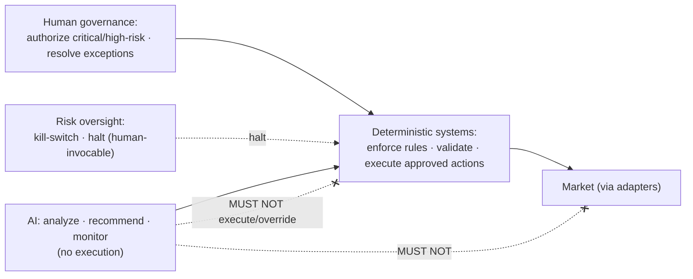

# Execution Governance Framework

| Field             | Value                                                                                                                         |
| ----------------- | ----------------------------------------------------------------------------------------------------------------------------- |
| **Document ID**   | EXECUTION-GOVERNANCE                                                                                                          |
| **Type**          | Operational execution-governance framework (governance layer over the Execution Layer, ARCH V2 §5.9)                          |
| **Clause prefix** | `EG`                                                                                                                          |
| **Owner**         | Head of Platform / SRE (**HSRE**) for operations; Head of Portfolio & Risk (**HPR**) for authority                            |
| **Co-signers**    | Governance & Risk Committee (**GRC**), Architecture Review Board (**ARB**), Head of Security (**CISO**), Head of AI (**HAI**) |
| **Governed by**   | `CLAUDE.md`; Architecture V2 (§5.9, §6.3); RB-14 · EXEC; RB-13 · RISK; RB-30 · DEPLOY                                         |
| **Version**       | 1.0.0                                                                                                                         |
| **Status**        | PROPOSED (binding upon ARB ratification)                                                                                      |
| **Last Ratified** | — (pending)                                                                                                                   |

> **Position & authority.** This framework is the **governance standard for production execution** — the authority, controls, approvals, and safety requirements under which approved portfolios/strategies transition into live capital actions. It is the governance layer over the Execution Layer (Architecture V2 §5.9) and operationalizes the execution-authority, authorization-token, and kill-switch rules of `CLAUDE.md` (RS-4, ARCH §2.9/2.10). It **references** RB-14 · EXEC for execution _mechanics_ (OMS, algos, adapters, TCA, paper engine, parity), RB-30 · DEPLOY for _release/rollback_, and RB-13 · RISK for _limits and kill-switches_.

> **The highest-consequence layer.** Execution is where research meets real capital. **Deterministic systems execute approved actions; AI never executes; live execution is impossible without a governance authorization token; the kill-switch is always available, human-invocable, and never AI-gated; the default mode is paper; every action is reversible-by-design; humans remain accountable; safety precedes speed** (RS-3/4, DEP-1..4, AI-1, DE-1, HO-4).

> **Reading note.** Technology-independent. Not a trading-system, exchange-integration, or OMS-design document. No implementation, exchange APIs, broker designs, or language choices. Each major section carries **Purpose · Responsibilities · Boundaries · Acceptance · Failure · Cross-refs**, with embedded RFC 2119 rules (`EG-n`). **Every production execution activity MUST operate under approved governance.**

---

## 1. Purpose

To define the immutable governance under which the platform executes: how approved portfolios and strategies become controlled production execution — answering **what can be executed, who authorizes execution, what validations are required, which systems have authority, how failures are handled, and how every action is audited.** Execution governance is the last line before capital moves; it exists to protect capital, guarantee that only validated and authorized actions reach the market, and ensure every action is reversible, halted-on-breach, and fully auditable.

Its governing intent is `CLAUDE.md` RS-1..4, DEP-1..4, AI-1, DE-1, HO-1/4: execution is deterministic and gated; live trading requires a governance authorization token; the kill-switch can stop everything instantly; and no AI ever executes or overrides a control.

## 2. Scope & Boundaries

- **Purpose.** Define execution philosophy, the authority model, the execution lifecycle, validation gates, AI execution governance, audit, failure management, security, and governance metrics.
- **Responsibilities.** Govern the transition from approved portfolio → validated → authorized → executed → confirmed → monitored → completed; enforce validation gates and authorization; handle failures; maintain full execution audit.
- **Boundaries (references only, never restated):**
  - **Execution _mechanics_: OMS, execution algorithms, broker/venue adapters, smart routing, paper engine, TCA, position ledger, reconciliation, research↔prod parity** → **RB-14 · EXEC** (ARCH §2.9, `P3-15`).
  - **Release/rollback _orchestration_, deployment gates** → **RB-30 · DEPLOY**; **risk limits, risk budget, kill-switch _authority_, exposure/drawdown _limits_** → **RB-13 · RISK**.
  - **What is executed (approved portfolios/target positions)** → **Portfolio Registry (PFR)**, **RB-12 · PORT**; **strategy constituents** → **Strategy Registry (STR)**.
  - **Scientific gate / capital-eligibility token** → **RB-04 · VAL** (`P2-09`); **workflow orchestration** → **Workflow Contracts (WFC-49)**.
  - **Security _mechanism_: secrets/KMS, access, audit-trail integrity, exfil** → **RB-27 · SEC** (`P1-09`); **incident _mechanism_** → **RB-31 · INC**; **DR/BCP** → **RB-32 · CONT** (`P6-03`).
  - **AI role boundaries** → **RB-15 · AIGOV**, Agent Contracts; **observability** → **RB-28 · OBS**.
- **Acceptance.** Every production execution runs under this governance: validated, authorized, deterministic, halted-on-breach, and audited. **Failure.** Any execution without authorization/validation, any AI-executed action, or any bypass of a control. **Cross-refs.** ARCH V2 §5.9/6.3, RS-4, DEP-1..4.

## 3. Constitutional & Governance Basis

Traces to: `CLAUDE.md` **RS-1..4** (risk/execution authority, kill-switch, authorization token), **DEP-1..4** (paper-first, reversible, gates), **AI-1, DE-1** (no AI execution), **HO-1/4** (accountability, non-delegable kill-switch), **CP-5** (separation of powers), **CP-7** (audit), **PS-1** (eligible-only), **RE-1..3** (reliability, DR/BCP); RB-14 · EXEC, RB-13 · RISK, RB-30 · DEPLOY; PATCH **P3-15** (parity), **P1-10** (calibration governance), **P6-03** (DR/BCP), **P2-09** (token), **P5-05** (tiered autonomy); Architecture V2 §5.9, §6.3 (deterministic boundary); ARCH §2.9, §2.10; REVIEW C5 (independence), M6 (security).

---

## Clause Format

**Pivotal clauses** carry the full block: _Purpose · Rationale · Acceptance · Failure · Refs_. **Supporting clauses** carry RFC 2119 force plus a one-line rationale. Every clause has a stable ID (`EG-n`, continuous).

---

# PART A — EXECUTION PHILOSOPHY

- **EG-1 · Safety Before Speed (MUST).** Execution MUST prioritize safety, correctness, and reversibility over speed; no latency objective justifies bypassing a validation, authorization, or risk control. _Rationale:_ RS-1, PR-CONF-2; a fast wrong trade is worse than a slow right one. _Acceptance:_ every action passes its gates before executing. _Failure:_ a control bypassed for speed. _Refs:_ EG-20.
- **EG-2 · Deterministic Execution Authority (MUST).** All execution MUST be performed by deterministic, versioned, golden-tested systems; no AI/LLM is ever in the execution path. _Rationale:_ RS-4, DE-1, AV2-5; execution is the most consequential action and must be deterministic and auditable. _Acceptance:_ every executed action traces to a deterministic engine run. _Failure:_ any AI-executed action. _Refs:_ EG-10.
- **EG-3 · Human Accountability (MUST).** A named human is accountable for every production execution regime; critical execution decisions and high-risk actions require human authorization (HO-1). _Rationale:_ accountability is non-delegable. _Refs:_ EG-9.
- **EG-4 · Risk-Controlled Operations (MUST).** Execution MUST operate within RB-13 · RISK limits at all times, with the kill-switch always available; a limit breach or anomaly MUST halt execution. _Rationale:_ RS-3; risk controls are non-bypassable and can stop everything. _Refs:_ EG-30.
- **EG-5 · Full Traceability (MUST).** Every execution action MUST be fully traceable end-to-end (portfolio → validation → authorization → order → fill → position → reconciliation). _Rationale:_ CP-7; unauditable execution is uninsurable. _Refs:_ EG-40.
- **EG-6 · Controlled Automation (MUST).** Automation MUST operate within tiered autonomy (`P5-05`): routine within-policy actions MAY be automated; high-consequence actions MUST be human-authorized; a sample of automated actions MUST be audited. Uncontrolled or unsupervised automation is PROHIBITED. _Rationale:_ M7; automation scales safely only under governed tiers. _Refs:_ EG-6-autonomy.

---

# PART B — EXECUTION AUTHORITY MODEL

- **EG-7 (MUST).** Execution authority MUST follow the model below; no participant MAY exceed its class. _Rationale:_ RS-4, DE-1, HO-1; the authority separation is the core safety boundary. _Refs:_ EG-9.



### Human Authority

- **EG-8 (MUST).** Humans MUST approve critical execution decisions, resolve exceptions, and authorize high-risk actions (capital deployment, limit-envelope changes, live-mode activation, override of an automated block). _Rationale:_ HO-1/2; high-consequence actions are human-accountable. _Acceptance:_ every critical/high-risk action carries recorded human authorization. _Failure:_ a high-risk action without human authorization. _Refs:_ EG-3.

### AI Authority

- **EG-9 (MUST).** AI systems MAY provide analysis, recommend actions, and monitor conditions — advisory only. _Rationale:_ AIGOV-14; AI's execution role is advisory/monitoring. _Refs:_ EG-10.
- **EG-10 (MUST NOT).** AI systems MUST NOT directly execute trades, bypass risk controls, or override limits. _Rationale:_ AI-1, RS-4, DE-1; the entrenched execution prohibition. _Acceptance:_ no AI action reaches the market or alters a limit. _Failure:_ any AI-executed trade or limit override. _Refs:_ EG-2.

### Deterministic Systems

- **EG-11 (MUST).** Deterministic systems MUST enforce rules, validate constraints, and execute only approved, authorized, validated actions; they hold **final execution authority** and MUST reject any action lacking validation or authorization (fail-closed). _Rationale:_ DE-1, RS-4; deterministic engines are the sole executors and the last gate. _Acceptance:_ deterministic systems reject un-validated/un-authorized actions. _Failure:_ a deterministic system executing an un-gated action. _Refs:_ EG-20.

---

# PART C — EXECUTION LIFECYCLE

- **EG-12 (MUST).** Every execution activity MUST follow the lifecycle below; stages MUST NOT be skipped, transitions are gated/recorded, and the default operating mode is **paper** — live requires a governance authorization token. _Rationale:_ DEP-1, RS-4; a governed, gated, paper-first lifecycle. _Refs:_ EG-13.

```mermaid
stateDiagram-v2
    [*] --> PROPOSED: target positions from ACTIVE portfolio (PFR)
    PROPOSED --> VALIDATED: portfolio + risk + market + operational gates
    PROPOSED --> REJECTED: fails validation
    VALIDATED --> AUTHORIZED: governance authorization token (+ human for high-risk)
    VALIDATED --> BLOCKED: gate/anomaly block
    AUTHORIZED --> READY: pre-trade checks pass; systems ready
    READY --> EXECUTING: deterministic execution (paper default / live if token+live-mode)
    EXECUTING --> CONFIRMED: fills reconciled to intent
    EXECUTING --> FAILED: execution error
    EXECUTING --> CANCELLED: cancelled pre/mid-flight
    CONFIRMED --> MONITORED: post-trade surveillance (TCA, parity, risk)
    MONITORED --> COMPLETED: settled/reconciled; within tolerance
    MONITORED --> ESCALATED: anomaly / limit / parity breach
    BLOCKED --> VALIDATED: unblocked (revalidate)
    ESCALATED --> MONITORED: resolved
    ESCALATED --> CANCELLED: unwound
    FAILED --> ESCALATED
    REJECTED --> [*]
    CANCELLED --> [*]
    COMPLETED --> [*]
```



**Lifecycle transition rules:**

| Transition              | Precondition                                                                | Approver            |
| ----------------------- | --------------------------------------------------------------------------- | ------------------- |
| PROPOSED → VALIDATED    | portfolio/risk/market/operational gates pass                                | deterministic gates |
| VALIDATED → AUTHORIZED  | **governance authorization token** (+ human for high-risk)                  | RISK/GRC + human    |
| AUTHORIZED → READY      | pre-trade risk checks + system readiness                                    | deterministic       |
| READY → EXECUTING       | mode = paper (default) or live (token + live-mode)                          | deterministic       |
| EXECUTING → CONFIRMED   | fills reconciled to intent (position ledger)                                | deterministic       |
| MONITORED → COMPLETED   | settled/reconciled within TCA/parity tolerance                              | deterministic       |
| any → BLOCKED/ESCALATED | gate fail / anomaly / limit / parity breach                                 | automatic / RISK    |
| **Forbidden**           | PROPOSED/VALIDATED → EXECUTING (skip authorization); any live without token | — (PROHIBITED)      |

- **EG-13 (MUST).** **No action MAY reach EXECUTING without passing all validation gates and holding a valid governance authorization token; live execution additionally requires live-mode enablement**; skipping is PROHIBITED (fail-closed). _Rationale:_ RS-4, DEP-1; the authorization token is the capital gate (ARCH §2.9). _Acceptance:_ every execution traces to passed gates + a valid token. _Failure:_ an un-authorized or un-validated execution. _Refs:_ EG-20.
- **EG-14 (MUST).** The authorization token MUST be **time-boxed and scoped** (to a portfolio/strategy/limit envelope); an expired or out-of-scope token MUST NOT authorize execution. _Rationale:_ RS-4; bounded authority limits blast radius. _Refs:_ EG-8.
- **EG-15 (MUST).** Execution MUST be **reversible-by-design**: any in-flight or completed action MUST be cancellable/unwindable per DEP-3; an execution regime that cannot be safely halted MUST NOT be authorized. _Rationale:_ DEP-3, RS-3. _Refs:_ EG-30.

---

# PART D — EXECUTION VALIDATION GATES

- **EG-16 (MUST).** Every execution MUST pass **all** validation gates below (fail-closed) before AUTHORIZED; a failed gate blocks and, per severity, escalates. _Rationale:_ CP-1; cumulative gates are the pre-capital safety. _Refs:_ EG-13.

### Portfolio Validation

- **EG-17 (MUST).** Execution MUST originate from an **APPROVED, ACTIVE (Production) portfolio** (Portfolio Registry PFR-8/15) whose constituents are capital-eligible; execution from a non-ACTIVE/unapproved portfolio is PROHIBITED. _Rationale:_ PS-1, PFR-8; only approved portfolios reach capital. _Acceptance:_ source portfolio ACTIVE + approved. _Failure:_ execution from a non-ACTIVE portfolio. _Refs:_ PFR-15.

### Risk Validation

- **EG-18 (MUST).** Execution MUST pass **pre-trade risk validation**: exposure limits, concentration, leverage, and constraint checks against RB-13 · RISK; a breach blocks the action (fail-closed) and MUST NOT be overridden by AI. _Rationale:_ RS-1, RISK-58; pre-trade blocking beats post-trade detection. _Acceptance:_ within all limits pre-trade. _Failure:_ a limit-breaching order permitted. _Refs:_ EG-30.

### Market Validation

- **EG-19 (MUST).** Execution MUST pass **market-condition checks** (liquidity, halts, abnormal conditions, stale/for-market data) before executing; executing into disallowed conditions is PROHIBITED. _Rationale:_ safety; adverse market conditions turn execution into loss. _Acceptance:_ market conditions within policy. _Failure:_ executing into a halt/illiquidity/abnormal condition. _Refs:_ EG-1.

### Operational Validation

- **EG-20 (MUST).** Execution MUST pass **operational readiness**: systems healthy, monitoring available, research↔production parity clean (`P3-15`), DR/BCP ready (`P6-03`); an operational deficiency blocks execution. _Rationale:_ RE-1/3, DEP; execution without monitoring/continuity is unsafe. _Acceptance:_ systems + monitoring + parity + DR ready. _Failure:_ executing with a monitoring/parity/DR gap. _Refs:_ EG-40.

---

# PART E — AI EXECUTION GOVERNANCE

## AI — MUST

- **EG-21 (MUST).** AI systems MUST operate only through approved workflows, provide recommendations with evidence, report uncertainty, and maintain execution traceability (provenance). _Rationale:_ WFC-20, AIGOV-27/31; AI supports execution advisorily within governance. _Acceptance:_ AI execution-support is workflow-bound, evidenced, traceable. _Failure:_ AI execution-support outside a workflow. _Refs:_ EG-9.

## AI — MUST NOT

- **EG-22 (MUST NOT).** AI systems MUST NOT execute unauthorized actions. _Rationale:_ AI-1, EG-10. _Refs:_ EG-10.
- **EG-23 (MUST NOT).** AI systems MUST NOT create hidden execution paths. _Rationale:_ AC-1, EG-5; hidden paths are unauditable and unsafe. _Refs:_ EG-40.
- **EG-24 (MUST NOT).** AI systems MUST NOT modify execution rules. _Rationale:_ RISK-4, AGC-11; rules belong to governance/deterministic systems. _Refs:_ EG-11.
- **EG-25 (MUST NOT).** AI systems MUST NOT bypass deterministic validation. _Rationale:_ AI-4, DE-1. _Refs:_ EG-16.

- **EG-26 (MUST).** Suspending all AI MUST NOT impair the deterministic execution, validation, kill-switch, or audit functions (AIGOV-61). _Rationale:_ the platform must execute safely and halt with all AI off. _Refs:_ EG-2.

---

# PART F — EXECUTION AUDIT REQUIREMENTS

- **EG-27 (MUST).** Every execution event MUST maintain immutably: **execution identifier, portfolio reference, strategy reference, authorization record, validation results, timestamp history, outcome record, and failure history** — each with actor/system, timestamp, and rationale. _Rationale:_ CP-7; execution audit is core to capital accountability and regulatory defensibility. _Acceptance:_ an auditor reconstructs any execution end-to-end (intent→gates→token→order→fill→reconciliation) without the operator. _Failure:_ an execution with missing/mutable records. _Refs:_ EG-40.
- **EG-28 (MUST).** Execution records MUST be tamper-evident (RB-27 · SEC / `P1-09`) and reconciled: broker/venue fills vs internal position ledger (RB-14 · EXEC); discrepancies MUST be flagged and escalated. _Rationale:_ CP-7; reconciliation catches silent errors and fraud. _Refs:_ EG-33.
- **EG-29 (MUST).** The execution audit MUST be reconcilable against authorized actions; any executed action without a matching authorization/validation record MUST be flagged as a critical integrity incident and halt the affected regime. _Rationale:_ an un-authorized execution is a severe control failure. _Refs:_ EG-13.

---

# PART G — EXECUTION FAILURE MANAGEMENT

- **EG-30 (MUST).** Execution failures and anomalies MUST be handled by the flow below; safety/limit/parity failures MUST trigger immediate blocking/halt (fail-safe), never silent continuation. _Rationale:_ RS-3, RE-1; failures must contain, not propagate. _Acceptance:_ failures block/halt within SLA and are recorded. _Failure:_ a failure allowed to continue executing. _Refs:_ EG-31.

```mermaid
graph TD
    A[Execution monitor] --> B{Failure/anomaly?}
    B -->|limit/risk breach| C[AUTO-BLOCK + kill-switch to paper/halt RISK]
    B -->|execution error/reject| D[BLOCK order + retry policy / cancel]
    B -->|parity/reality-gap breach| E[HALT regime + escalate]
    B -->|market halt/illiquidity| F[Pause; await safe conditions]
    B -->|integrity (un-authorized action)| G[HALT + critical incident]
    C --> H[Escalate + Incident RCA + recovery]
    D --> H
    E --> H
    G --> H
```

### Failure Detection

- **EG-31 (MUST).** Execution MUST be continuously monitored for failures/anomalies (errors, rejects, limit/parity breaches, reconciliation mismatches) by an independent capability (RB-28 · OBS). _Rationale:_ early detection limits loss. _Refs:_ EG-30.

### Automatic Blocking

- **EG-32 (MUST).** Pre-registered conditions (limit breach, anomaly, integrity failure) MUST **automatically block/halt** without human latency; the kill-switch (RB-13 · RISK) is always available and human-invocable, never AI-gated. _Rationale:_ RS-3, HO-4; some losses move faster than humans. _Refs:_ EG-4.

### Escalation Procedures

- **EG-33 (MUST).** Failures MUST escalate per a defined severity matrix; the most severe (integrity, systemic breach) MUST halt and reach GRC/HPR immediately. _Rationale:_ CP-7; graduated, fast escalation. _Refs:_ EG-30.

### Recovery Process

- **EG-34 (MUST).** Recovery MUST follow tested procedures with defined RPO/RTO (DR/BCP, RB-32 · CONT / `P6-03`), restoring a consistent, reconciled state; reactivation requires remediation + re-authorization. _Rationale:_ RE-3; rehearsed recovery. _Refs:_ EG-20.

### Incident Creation

- **EG-35 (MUST).** Every material execution failure MUST create an incident (RB-31 · INC) with RCA and a preventive control; incidents without systemic fixes recur. _Rationale:_ CI-3. _Refs:_ EG-31.

---

# PART H — EXECUTION SECURITY

> **Boundary note.** Security _mechanism_ (KMS, access, exfil, audit integrity) is owned by RB-27 · SEC (`P1-09`). This framework states execution-specific security requirements.

- **EG-36 · Access Control (MUST).** Access to execution systems and live-mode controls MUST be least-privilege, role-based, and logged; live-trading authority MUST be tightly restricted (RB-27 · SEC). _Rationale:_ SEC-2; execution access is a critical attack surface. _Refs:_ EG-40.
- **EG-37 · Permission Management (MUST).** Execution permissions MUST be default-deny and explicitly granted; AI/agent permissions MUST NOT include execution or limit-modification (EG-10). _Rationale:_ least privilege. _Refs:_ EG-24.
- **EG-38 · Secret Protection (MUST).** Broker/venue credentials MUST be brokered, rotated, isolated per environment, and never embedded in code/config/logs (SEC-3, FB-14). _Rationale:_ stolen execution credentials = direct capital loss. _Refs:_ RB-27 · SEC.
- **EG-39 · Change Authorization (MUST).** Changes to execution rules, limits, adapters, or live-mode configuration MUST be governed (human-authorized, recorded, ADR/Patch-traced); silent or AI-made changes are PROHIBITED. _Rationale:_ CR, ADR; execution changes are high-consequence. _Refs:_ EG-24.
- **EG-40 · Separation of Duties (MUST).** The parties that construct/approve a portfolio, authorize its execution, and audit execution MUST be independent; no single actor may hold all three for the same capital (CP-5). _Rationale:_ separation of powers prevents unilateral capital deployment and fraud (REVIEW C5). _Acceptance:_ distinct independent parties across construct/authorize/audit. _Failure:_ one actor constructing, authorizing, and auditing the same execution. _Refs:_ EG-8.

---

# PART I — GOVERNANCE METRICS

- **EG-41 (MUST).** Every execution-governance metric MUST define **purpose, measurement, acceptance criteria, and failure conditions**. _Rationale:_ CP-1. _Refs:_ per-metric.

**Execution governance metrics (thresholds governed):**

| Metric                      | Purpose                   | Measurement                             | Acceptance         | Failure                                          |
| --------------------------- | ------------------------- | --------------------------------------- | ------------------ | ------------------------------------------------ |
| **Execution Reliability**   | actions execute correctly | success vs error/reject rate            | ≥ governed target  | below floor                                      |
| **Validation Success Rate** | gates function            | % actions passing gates cleanly         | high, stable       | rising gate failures (may signal upstream issue) |
| **Failure Rate**            | operational safety        | failures per volume                     | ≤ governed ceiling | above ceiling                                    |
| **Recovery Time**           | resilience                | time to safe/reconciled state           | ≤ RTO              | exceeds RTO                                      |
| **Operational Stability**   | steady, safe operation    | parity/reconciliation/reality-gap drift | within tolerance   | drift/breach                                     |

- **EG-42 (MUST).** Metrics MUST be reported to GRC on a governed cadence and MUST NOT be gamed (e.g., relaxing gates to raise "reliability"); safety metrics take precedence over throughput metrics. _Rationale:_ Goodhart guard; safety over speed. _Refs:_ EG-1.

---

## Responsibility Matrix (RACI)

| Execution activity                   | AI            | Deterministic systems | Human (HPR/ops) | Governance (GRC/RISK) |
| ------------------------------------ | ------------- | --------------------- | --------------- | --------------------- |
| Analyze / recommend / monitor        | **R**         | R (compute)           | A               | I                     |
| Validate (portfolio/risk/market/ops) | ✗             | **R**                 | A               | A                     |
| Issue authorization token            | ✗             | R (checks)            | C               | **A (RISK/GRC)**      |
| Authorize high-risk / live-mode      | ✗             | R (gate)              | **A/R (human)** | A                     |
| Execute approved action              | ✗ (forbidden) | **R**                 | A               | A                     |
| Reconcile fills vs ledger            | narrate       | **R**                 | A               | I                     |
| Kill-switch / halt                   | ✗ (forbidden) | **R (auto)**          | **R (human)**   | **A**                 |
| Handle failure / recover             | narrate       | **R**                 | R               | A                     |
| Change execution rules/limits        | ✗ (forbidden) | R (enforce)           | R               | **A**                 |
| Audit execution                      | assist        | R (records)           | R               | **A (independent)**   |

---

## Acceptance Criteria (execution regime → live)

An execution regime is **cleared for live execution** only when **all** hold:

**Execution readiness checklist:**

- [ ] Source portfolio APPROVED + ACTIVE (Production); constituents eligible (EG-17).
- [ ] Portfolio/risk/market/operational validation gates pass (EG-16–20).
- [ ] Valid, time-boxed, scoped governance authorization token; human authorization for high-risk (EG-13, EG-14, EG-8).
- [ ] Deterministic execution path (no AI in path); paper-first default; live-mode explicitly enabled (EG-2, EG-12).
- [ ] Reversible-by-design; instantly haltable; kill-switch available + human-invocable (EG-15, EG-32).
- [ ] Pre-trade risk checks + reconciliation + parity monitoring configured (EG-18, EG-28, EG-20).
- [ ] DR/BCP ready with tested RPO/RTO (EG-20, EG-34).
- [ ] Separation of duties across construct/authorize/audit (EG-40).
- [ ] Full execution audit + tamper-evident records (EG-27).
- [ ] Failure detection/blocking/escalation/incident wired (EG-30–35).

## Rejection / Halt Criteria

Execution MUST be **rejected, blocked, or halted** if **any** hold:

- **EG-43.** No valid authorization token, or token expired/out-of-scope (EG-13, EG-14).
- **EG-44.** Source portfolio not ACTIVE/approved, or constituent ineligible (EG-17).
- **EG-45.** Any pre-trade risk/limit/concentration/leverage breach (EG-18).
- **EG-46.** Adverse market conditions (halt/illiquidity/abnormal/stale data) (EG-19).
- **EG-47.** Operational deficiency: monitoring/parity/reconciliation/DR gap (EG-20).
- **EG-48.** Any AI attempt to execute, override a limit, modify rules, or create a hidden path (EG-10, EG-22–25).
- **EG-49.** Un-authorized executed action detected (integrity) → critical incident + halt (EG-29).
- **EG-50.** Parity/reality-gap or reconciliation breach in production (EG-28, EG-20) → escalate/halt.
- **EG-51.** Separation-of-duties compromised (one actor construct+authorize+audit) (EG-40).

---

## Anti-Patterns & Forbidden Practices

**Anti-patterns:**

- **EG-AP-1.** Speed prioritized over a validation/authorization/risk gate (EG-1).
- **EG-AP-2.** AI in the execution path or a hidden execution path (EG-2, EG-23).
- **EG-AP-3.** Live execution without a scoped, time-boxed token (EG-13).
- **EG-AP-4.** Kill-switch that is slow, untested, or AI-gated (EG-32).
- **EG-AP-5.** Skipping paper/shadow; live on backtest alone (EG-12).
- **EG-AP-6.** One actor constructing, authorizing, and auditing the same execution (EG-40).
- **EG-AP-7.** Relaxing gates to improve reliability metrics (EG-42).

**Forbidden practices (non-waivable):**

- **EG-F-1.** AI/LLM executing a trade, bypassing risk controls, overriding a limit, modifying execution rules, or creating a hidden execution path (EG-10, EG-22–25; AI-1, RS-4).
- **EG-F-2.** Executing without passing all validation gates and holding a valid authorization token (EG-13, EG-16).
- **EG-F-3.** Live execution without live-mode enablement (default is paper) (EG-12).
- **EG-F-4.** Gating, disabling, delegating, or AI-gating the kill-switch (EG-32; HO-4).
- **EG-F-5.** Executing from a non-ACTIVE/unapproved portfolio or ineligible constituents (EG-17).
- **EG-F-6.** Overriding a pre-trade risk block (except via governed, recorded, human-authorized exception that cannot breach non-waivable limits) (EG-18).
- **EG-F-7.** An un-authorized executed action, or missing execution audit records (EG-29, EG-27).
- **EG-F-8.** Compromising separation of duties across construct/authorize/audit (EG-40; CP-5).
- **EG-F-9.** Embedding broker/venue credentials in code/config/logs (EG-38; FB-14).

---

## Enforcement & Verification

| Clause group                                 | Enforcement mechanism                                    | Owner                                      |
| -------------------------------------------- | -------------------------------------------------------- | ------------------------------------------ |
| Deterministic-execution + no-AI (EG-2,10,11) | Execution engine; AI has no execution capability         | RB-14 · EXEC, RB-15 · AIGOV (`P1-03`)      |
| Validation gates (EG-16–20)                  | Fail-closed pre-trade gates                              | this framework, RB-13 · RISK, RB-14 · EXEC |
| Authorization token + paper-first (EG-12–14) | Token-gated execution; live-mode flag                    | RB-13 · RISK, RB-30 · DEPLOY (ARCH §2.9)   |
| Kill-switch / auto-block (EG-32)             | Deterministic triggers; human-invocable; drills          | RB-13 · RISK (`P1-03`)                     |
| Reversibility/recovery (EG-15,34)            | Cancel/unwind + tested DR/BCP                            | RB-30 · DEPLOY, RB-32 · CONT (`P6-03`)     |
| Reconciliation/parity (EG-28,20)             | Ledger reconciliation + parity harness                   | RB-14 · EXEC (`P3-15`)                     |
| Audit + integrity (EG-27–29)                 | Immutable records + tamper-evident audit; reconciliation | RB-27 · SEC (`P1-09`)                      |
| Security/SoD (EG-36–40)                      | Access control, secrets, separation of duties            | RB-27 · SEC, GRC (CP-5)                    |
| Failure/incident (EG-30–35)                  | Auto-block + incident process                            | RB-31 · INC, RB-28 · OBS                   |
| Forbidden practices (EG-F-\*)                | Fail-closed halt; integrity/risk report                  | GRC                                        |

- **EG-E-1 (MUST).** Every clause enforcing a Forbidden Practice (EG-F-*) — especially no-AI-execution, token-gating, and the kill-switch — MUST be deterministically enforced and fail-closed. *Rationale:* CP-1, DE-1, RS-4. *Refs:\* EG-2.

## Exceptions & Waivers

- **EG-W-1 (MUST).** No exception MAY be granted to: no-AI-execution / deterministic authority (EG-2/10/11), token-gated + paper-first execution (EG-12/13), kill-switch availability (EG-32), non-waivable risk limits (EG-18), separation of duties (EG-40), execution audit (EG-27), credential protection (EG-38), or any `CLAUDE.md` entrenched clause (AM-2). Non-waivable.
- **EG-W-2 (MAY).** GRC/HPR-governed parameters (market-condition thresholds, reliability/failure targets, RTO, autonomy tiers) MAY be changed only by GRC + HPR, recorded (as an ADR), applied prospectively.
- **EG-W-3 (MAY).** A time-boxed operational waiver of a non-entrenched rule MAY be granted only by HPR + GRC, recorded and surfaced in risk reporting, and MUST NOT weaken deterministic authority, token-gating, the kill-switch, or separation of duties. _Rationale:_ the load-bearing safety controls are absolute.

## Ratification Criteria

Ratifiable only when: every clause has a stable ID, RFC 2119 phrasing, and an enforcement mechanism; no clause contradicts `CLAUDE.md`, Architecture V2, RB-14 · EXEC, RB-13 · RISK, RB-30 · DEPLOY, or peer frameworks; deterministic execution authority, no-AI-execution, token-gating, paper-first, kill-switch, reversibility, separation of duties, and full audit are preserved; all cross-references resolve; ARB approval with HPR + HSRE + GRC (+ CISO) co-sign obtained.

## Success Metrics

- **SM-1.** 0 AI-executed actions; 0 AI limit-overrides/rule-modifications (EG-10, EG-F-1).
- **SM-2.** 0 live executions without a valid token + passed gates; 0 non-paper without live-mode (EG-13, EG-F-3).
- **SM-3.** Kill-switch/emergency-halt drills pass within SLA; 0 AI-gated kill-switches (EG-32).
- **SM-4.** 0 executions from non-ACTIVE/unapproved portfolios (EG-17).
- **SM-5.** 100% executions reconciled (fills vs ledger); 0 un-authorized executed actions (EG-28, EG-29).
- **SM-6.** Separation of duties intact; 0 single-actor construct+authorize+audit (EG-40).
- **SM-7.** Recovery within RTO in drills; 100% material failures with incident + RCA (EG-34, EG-35).

## Dependencies & Related Documents

- **Governed by:** `CLAUDE.md`; Architecture V2 (§5.9, §6.3); RB-14 · EXEC; RB-13 · RISK; RB-30 · DEPLOY.
- **Depends on / references:** Portfolio Registry & Strategy Registry (what's executed), RB-12 · PORT (target positions), RB-04 · VAL (scientific gate/token), RB-32 · CONT & RB-31 · INC (DR/BCP, incidents), RB-27 · SEC (security/audit), RB-28 · OBS (monitoring), RB-15 · AIGOV & Agent Contracts (AI limits), Workflow Contracts (WFC-49).
- **Architecture references:** ARCH §2.9, §2.10; Architecture V2 §5.9, §6.3; PATCH `P3-15`, `P1-10`, `P6-03`, `P2-09`, `P5-05`, `P1-03`; REVIEW C5, M6.

## Change Log & Version History

| Version | Date    | Author (role) | Change                                  |
| ------- | ------- | ------------- | --------------------------------------- |
| 1.0.0   | pending | HSRE + HPR    | Initial Execution Governance Framework. |

---

## Glossary (execution-governance-specific)

Terms in `CLAUDE.md`, rulebook, and prior-framework glossaries (kill-switch, authorization token, paper-first, reconciliation, parity, DR/BCP, separation of powers) are not redefined.

- **Execution** — The deterministic, authorized, gated transition of an ACTIVE portfolio's target positions into market actions; never performed by AI (EG-2).
- **Governance Authorization Token** — The time-boxed, scoped credential without which live execution is impossible (EG-13, EG-14).
- **Live-Mode** — The explicitly-enabled state permitting real-capital execution; default is paper (EG-12).
- **Pre-Trade Gate** — A fail-closed validation (portfolio/risk/market/operational) that must pass before authorization (EG-16).
- **Auto-Block** — Automatic halting of execution on a pre-registered breach condition, without human latency (EG-32).
- **Separation of Duties** — The independence of the parties that construct/approve, authorize, and audit an execution (EG-40).
- **Reversible-by-Design** — The property that any execution action is cancellable/unwindable and the regime instantly haltable (EG-15).
- **Reconciliation** — Matching broker/venue fills to the internal position ledger; discrepancies flagged (EG-28).

---

_End of Execution Governance Framework. It is the governance standard for production execution — the last line before capital moves: only APPROVED, ACTIVE portfolios' target positions execute, and only after passing portfolio/risk/market/operational validation gates and holding a valid, time-boxed, scoped governance authorization token, with human authorization for high-risk actions. Deterministic systems execute; AI never executes, overrides limits, modifies rules, or creates hidden paths. The default is paper; live requires explicit enablement; every action is reversible-by-design; the kill-switch is always available, human-invocable, and never AI-gated; separation of duties is enforced; and every action is reconciled and immutably audited. Failures auto-block, escalate, recover within tested RPO/RTO, and generate incidents. Safety precedes speed; capital is protected; humans remain accountable. Binding upon ARB ratification._
