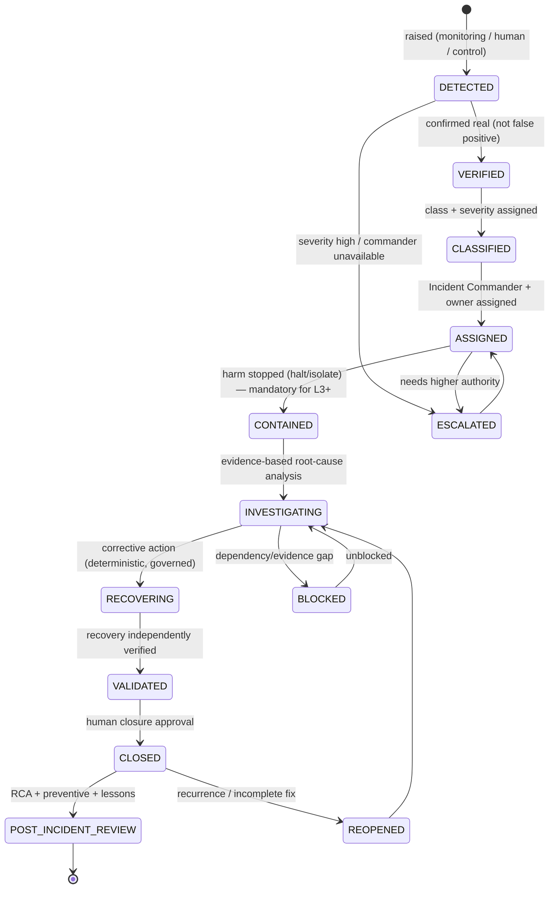

# Incident Response Governance Framework

| Field             | Value                                                                                                                                                             |
| ----------------- | ----------------------------------------------------------------------------------------------------------------------------------------------------------------- |
| **Document ID**   | INCIDENT-RESPONSE                                                                                                                                                 |
| **Type**          | Operational incident-governance framework (realizes RB-31 · INC at the governance level)                                                                          |
| **Clause prefix** | `IR`                                                                                                                                                              |
| **Owner**         | Head of Platform / SRE (**HSRE**)                                                                                                                                 |
| **Co-signers**    | Governance & Risk Committee (**GRC**), Head of Portfolio & Risk (**HPR**), Head of AI (**HAI**), Head of Security (**CISO**), Architecture Review Board (**ARB**) |
| **Governed by**   | `CLAUDE.md`; Architecture V2 (§5.9, §10); RB-31 · INC; RB-13 · RISK; RB-32 · CONT                                                                                 |
| **Version**       | 1.0.0                                                                                                                                                             |
| **Status**        | PROPOSED (binding upon ARB ratification)                                                                                                                          |
| **Last Ratified** | — (pending)                                                                                                                                                       |

> **Position & authority.** This framework is the **governance standard for incident response** — how the platform detects, classifies, contains, investigates, recovers from, and learns from incidents across operational, research, infrastructure, and governance domains. It realizes RB-31 · INC at the governance level and ties together the detection surface (Production Monitoring), the halt surface (Execution Governance / RB-13 · RISK kill-switch), the recovery surface (RB-32 · CONT DR/BCP), and the learning surface (ADR Governance).

> **Safety before availability.** Incident response protects capital and integrity first; **humans authorize recovery and close incidents; deterministic systems contain and recover; AI detects, preserves evidence, reports, and escalates but never closes incidents, suppresses alerts, modifies evidence, or authorizes recovery; and every material incident produces a root cause and a preventive control** (RE-1..3, HO-1/4, AI-3, DE-1, CP-5/7, CI-3).

> **Reading note.** Technology-independent. Not an operational runbook, infrastructure playbook, or implementation guide. No cloud/ticketing/tool specifics or code. Each major section carries **Purpose · Responsibilities · Boundaries · Acceptance · Failure · Cross-refs**, with embedded RFC 2119 rules (`IR-n`). **Every production-impacting incident MUST follow an approved incident response workflow.**

---

## 1. Purpose

To define the immutable governance for incident response — answering **what an incident is, how incidents are classified, who owns response, when humans must intervene, how incidents are investigated, how recovery is verified, and how institutional learning is preserved.** Incident response is the platform's resilience function: it contains harm fast, restores a safe reconciled state, and converts every failure into a durable preventive improvement.

Its governing intent is `CLAUDE.md` RE-1..3, RS-3, HO-1/4, CI-3: incidents are contained deterministically and reversibly; recovery is human-authorized and independently verified; and no incident closes without a root cause and a systemic fix.

## 2. Scope & Boundaries

- **Purpose.** Define incident philosophy, classification, severity model, lifecycle, responsibility governance, recovery governance, post-incident governance, audit, and metrics.
- **Responsibilities.** Govern the transition from detection → containment → investigation → recovery → verified closure → learning; ensure human accountability, deterministic recovery, immutable evidence, and preventive follow-through.
- **Boundaries (references only, never restated):**
  - **Detection/alerting/monitoring** → **Production Monitoring (MON)** + **RB-28 · OBS**; incidents are _raised from_ monitoring.
  - **Execution halt/failure, kill-switch** → **Execution Governance (EG)**, **RB-13 · RISK**; incident response _invokes_ these controls.
  - **DR/BCP recovery _mechanism_, RPO/RTO** → **RB-32 · CONT** (`P6-03`); this framework _governs_ recovery.
  - **Security-incident _mechanism_, forensics, audit-trail integrity** → **RB-27 · SEC** (`P1-09`).
  - **Post-incident architectural/decision records** → **ADR Governance**; **AI role boundaries** → **RB-15 · AIGOV**, Agent Contracts; **workflow orchestration** → **Workflow Contracts**.
  - **Domain-specific incident triggers** → the owning documents: Dataset (DSG-95), Feature/Signal/Strategy/Portfolio registries, Risk (RISK-61), AI Agent (EVAL-39/60).
- **Acceptance.** Every production-impacting incident follows this governance: classified, contained, investigated, recovered, human-closed, and learned-from. **Failure.** An incident closed without RCA/verification, an AI-closed incident, or suppressed/mutable evidence. **Cross-refs.** ARCH V2 §10, RE-1..3, RS-3.

## 3. Constitutional & Governance Basis

Traces to: `CLAUDE.md` **RE-1..3** (reliability, feedback, DR/BCP), **RS-1..3** (risk, kill-switch, halt), **HO-1/4** (accountability, non-delegable halt), **AI-3** (AI not approving/closing), **DE-1**, **CP-5** (independence), **CP-7** (audit), **CI-3** (systemic fixes); RB-31 · INC, RB-13 · RISK, RB-32 · CONT; PATCH **P6-03** (DR/BCP), **P1-09** (audit integrity), **P1-10** (feedback); Architecture V2 §5.9, §10; REVIEW C5, M6, M7.

---

## Clause Format

**Pivotal clauses** carry the full block: _Purpose · Rationale · Acceptance · Failure · Refs_. **Supporting clauses** carry RFC 2119 force plus a one-line rationale. Every clause has a stable ID (`IR-n`, continuous).

---

# PART A — INCIDENT RESPONSE PHILOSOPHY

- **IR-1 · Safety Before Availability (MUST).** Incident response MUST prioritize capital preservation and integrity over uptime; halting a compromised system is preferable to running it. _Rationale:_ RS-1; a running compromised system loses money or corrupts research. _Acceptance:_ containment/halt precedes convenience. _Failure:_ keeping a compromised system live for availability. _Refs:_ IR-30.
- **IR-2 · Human Accountability (MUST).** A named human owns each incident (Incident Commander) and is accountable; recovery authorization and closure require human sign-off (HO-1, AI-3). _Rationale:_ accountability is non-delegable. _Refs:_ IR-24.
- **IR-3 · Deterministic Recovery (MUST).** Containment and recovery actions MUST be performed by deterministic systems executing governed procedures; AI MUST NOT autonomously recover or execute containment on capital/control systems. _Rationale:_ DE-1, RS-4; recovery of capital/control must be deterministic and auditable. _Refs:_ IR-30.
- **IR-4 · Evidence-Based Investigation (MUST).** Investigation and root cause MUST rest on preserved evidence, never speculation; conclusions MUST be supported. _Rationale:_ CP-7, EG. _Refs:_ IR-40.
- **IR-5 · Transparent Communication (MUST).** Incidents MUST be communicated to the accountable owners and required authority per severity; hiding or downplaying incidents is PROHIBITED. _Rationale:_ CP-7, MON-15; opacity compounds harm. _Refs:_ IR-60.
- **IR-6 · Continuous Learning (MUST).** Every material incident MUST produce a root cause, corrective and preventive actions, and lessons learned; incidents without systemic fixes recur. _Rationale:_ CI-3; the point of an incident is the improvement it forces. _Refs:_ IR-50.
- **IR-7 · Controlled Recovery (MUST).** Recovery MUST be staged, verified, and reversible; restoring service before validating the fix is PROHIBITED. _Rationale:_ premature restoration re-triggers the incident. _Refs:_ IR-34.

---

# PART B — INCIDENT CLASSIFICATION

- **IR-8 (MUST).** Every incident MUST be classified into a primary class below; classification (with severity, PART C) drives ownership and escalation. An **incident** is any unplanned event that impacts, or threatens, production operations, capital, research integrity, or governance controls. _Rationale:_ classification routes response to the right owner and authority. _Acceptance:_ every incident classified. _Failure:_ an unclassified incident. _Refs:_ IR-12.

**Incident classes (each: purpose · scope · severity criteria · ownership · escalation):**

| Class                     | Scope / examples                                                    | Primary owner | Escalates to                |
| ------------------------- | ------------------------------------------------------------------- | ------------- | --------------------------- |
| **Operational**           | service/process failure, degradation                                | HSRE          | GRC (if capital)            |
| **Research Integrity**    | p-hacking, leakage, fabrication, isolation breach                   | HR / GRC      | GRC (halt research)         |
| **Data Quality**          | corruption, restatement impact, silent bad data (DSG-95)            | HD            | GRC (if capital-affecting)  |
| **AI Governance**         | agent overreach, hallucination-in-decision, drift, prompt injection | HAI / MRC     | MRC + GRC                   |
| **Security**              | exfiltration, intrusion, poisoning, credential compromise           | CISO          | GRC (emergency)             |
| **Risk Limit Violations** | limit/drawdown/budget breach (RISK-61)                              | HPR           | GRC (kill-switch)           |
| **Execution**             | un-authorized/failed execution, reconciliation mismatch (EG)        | HPR / HSRE    | GRC (halt)                  |
| **Monitoring**            | monitoring failure, blind spot, suppressed alert                    | HSRE          | GRC                         |
| **Infrastructure**        | compute/storage/network/service outage                              | HSRE          | GRC (if production)         |
| **Compliance**            | control bypass, gate-integrity failure, regulatory breach           | GRC           | Board/regulator as required |

- **IR-9 (MUST).** **Integrity/capital/control classes** (Research Integrity, Data Quality-capital, AI Governance, Security, Risk, Execution, Compliance) MUST trigger the appropriate control (halt research, kill-switch, execution halt) as part of containment; alert-without-containment is insufficient for these. _Rationale:_ RS-3, MON-9; these classes threaten capital or integrity. _Refs:_ IR-30.
- **IR-10 (MUST).** A **Research Integrity incident** (detected p-hacking, leakage, fabrication, isolation breach) MUST halt the affected research, quarantine its outputs, and be escalated to GRC; such incidents MUST NOT be quietly corrected. _Rationale:_ SM, REVIEW; integrity breaches corrupt the scientific record and must be contained and recorded. _Refs:_ IR-50.

---

# PART C — INCIDENT SEVERITY MODEL

- **IR-11 (MUST).** Every incident MUST be assigned a severity level below; severity determines response time, escalation, human-approval, and recovery expectations. Severity MUST be assignable up (never silently down) as understanding evolves. _Rationale:_ proportion response to consequence. _Acceptance:_ severity assigned and justified. _Failure:_ an un-severitied or downplayed incident. _Refs:_ IR-26.

**Severity model (thresholds/RTOs are GRC-governed parameters):**

| Level  | Name          | Impact                               | Response Time Objective | Escalation                                | Human Approval       | Recovery Expectation        |
| ------ | ------------- | ------------------------------------ | ----------------------- | ----------------------------------------- | -------------------- | --------------------------- |
| **L0** | Informational | none; noted                          | best-effort             | none                                      | none                 | monitor only                |
| **L1** | Minor         | negligible, contained                | governed (hours)        | domain owner                              | owner                | routine fix                 |
| **L2** | Moderate      | limited degradation                  | governed (short)        | 2nd-line + owner                          | owner                | staged recovery             |
| **L3** | Major         | material to a system/strategy        | fast                    | domain lead + GRC-notify                  | domain lead          | verified recovery           |
| **L4** | Critical      | capital/integrity/control threatened | immediate               | GRC + HPR/CISO (human)                    | **human governance** | halt + controlled recovery  |
| **L5** | Emergency     | systemic / fund-level / catastrophic | instant                 | emergency: GRC/Board + emergency shutdown | **human governance** | emergency shutdown + DR/BCP |

- **IR-12 (MUST).** **L4/L5 incidents MUST trigger immediate human governance involvement and the appropriate halt** (kill-switch, emergency shutdown per RISK-38/RB-32 · CONT); response MUST NOT wait on investigation to contain. _Rationale:_ RS-3, RE-3; contain first, investigate second. _Acceptance:_ L4/L5 contained + human-governed within RTO. _Failure:_ an L4/L5 running uncontained pending investigation. _Refs:_ IR-30.
- **IR-13 (MUST).** Response-time objectives MUST be met per severity; an RTO breach MUST itself auto-escalate. _Rationale:_ slow response defeats containment. _Refs:_ IR-26.

---

# PART D — INCIDENT LIFECYCLE

- **IR-14 (MUST).** Every incident MUST follow the lifecycle below; stages MUST NOT be skipped, transitions are gated/recorded, evidence preserved throughout, and **containment precedes investigation for L3+**. _Rationale:_ IR-1; a governed lifecycle contains fast and closes safely. _Refs:_ IR-15.

**Allowed / forbidden transitions & approvals:**

| Transition                    | Precondition                                                               | Approver                        |
| ----------------------------- | -------------------------------------------------------------------------- | ------------------------------- |
| DETECTED → VERIFIED           | confirmed real                                                             | owner / deterministic check     |
| CLASSIFIED → ASSIGNED         | class + severity set                                                       | Incident Commander assigned     |
| ASSIGNED → CONTAINED          | harm stopped (halt/isolate)                                                | deterministic + human (L4/L5)   |
| CONTAINED → INVESTIGATING     | contained; evidence secured                                                | Incident Commander              |
| INVESTIGATING → RECOVERING    | root cause identified; recovery plan                                       | domain lead (+ GRC for L4/L5)   |
| RECOVERING → VALIDATED        | recovery executed + independently verified                                 | independent human               |
| VALIDATED → CLOSED            | verification passed                                                        | **human closure approval**      |
| CLOSED → POST_INCIDENT_REVIEW | RCA + preventive actions                                                   | Incident Commander + governance |
| **Forbidden**                 | DETECTED/VERIFIED → CLOSED (skip); AI-closed; close without RCA (material) | — (PROHIBITED)                  |

- **IR-15 (MUST).** **No incident MAY be CLOSED without containment, investigation, recovery, independent verification, and human closure approval**; auto-close or AI-close is PROHIBITED for material (L2+) incidents (fail-closed). _Rationale:_ CP-5, AI-3; unverified closure hides unresolved harm. _Acceptance:_ every closed material incident has recorded RCA + independent verification + human approval. _Failure:_ an auto-/AI-closed or RCA-less material incident. _Refs:_ IR-50.
- **IR-16 (MUST).** A CLOSED incident that recurs or whose fix proves incomplete MUST be **REOPENED**; recurrence indicates the preventive action failed. _Rationale:_ CI-3; recurrence is a systemic-fix failure. _Refs:_ IR-53.
- **IR-17 (MUST).** Every incident MUST have a single accountable **Incident Commander** (human) coordinating response; for integrity incidents, the Commander MUST be independent of the party/system that caused the failure (CP-5). _Rationale:_ accountability + independence. _Refs:_ IR-2.

---

# PART E — RESPONSIBILITY GOVERNANCE

- **IR-18 (MUST).** Roles in incident response are fixed as below; no participant MAY exceed its role. _Rationale:_ HO-1, DE-1, CP-5. _Refs:_ RACI.

| Role                                     | Responsibilities                                                                  |
| ---------------------------------------- | --------------------------------------------------------------------------------- |
| **Human Operators / Incident Commander** | own response, coordinate, authorize recovery, close, communicate                  |
| **AI Agents**                            | detect anomalies, preserve evidence, report uncertainty, escalate — advisory only |
| **Deterministic Systems**                | execute containment/recovery procedures, enforce halts, preserve records          |
| **Governance Owners (GRC/HPR/HAI/CISO)** | authorize high-severity response, exceptions, closure of L4/L5                    |
| **Architecture Owners (ARB)**            | own architectural corrective actions + post-incident ADRs                         |

## AI — MUST

- **IR-19 (MUST).** AI systems MUST detect anomalies, preserve evidence, report uncertainty, and escalate when required. _Rationale:_ AIGOV-14; AI's incident role is detection/support. _Acceptance:_ AI detection is evidenced, uncertainty-labeled, escalating. _Failure:_ AI silent on a detected anomaly. _Refs:_ IR-30.

## AI — MUST NOT

- **IR-20 (MUST NOT).** AI systems MUST NOT close incidents. _Rationale:_ AI-3; closure is human. _Refs:_ IR-15.
- **IR-21 (MUST NOT).** AI systems MUST NOT suppress alerts. _Rationale:_ MON-15, CP-7. _Refs:_ IR-5.
- **IR-22 (MUST NOT).** AI systems MUST NOT modify evidence. _Rationale:_ CP-2/7; evidence integrity. _Refs:_ IR-40.
- **IR-23 (MUST NOT).** AI systems MUST NOT authorize recovery. _Rationale:_ AI-1/3, IR-3; recovery authorization is human/deterministic. _Refs:_ IR-33.

- **IR-24 (MUST).** **Humans retain final accountability** for every incident; recovery authorization and closure are human acts. Suspending all AI MUST NOT impair deterministic containment, recovery, or the audit trail (AIGOV-61). _Rationale:_ HO-1, DE-1; the platform must handle incidents with all AI off. _Refs:_ IR-2.

---

# PART F — RECOVERY GOVERNANCE

- **IR-25 · Containment (MUST).** Containment MUST stop ongoing harm before investigation for L3+ (halt/isolate the affected system; invoke kill-switch/emergency shutdown for capital/control); a partially-understood incident MUST still be contained. _Rationale:_ IR-1; contain first. _Acceptance:_ harm stopped within RTO. _Failure:_ investigating a live, harming system. _Refs:_ IR-12.
- **IR-26 · Recovery (MUST).** Recovery MUST execute governed, deterministic procedures restoring a consistent, reconciled state (DR/BCP per RB-32 · CONT / `P6-03`); ad-hoc or AI-driven recovery of capital/control systems is PROHIBITED. _Rationale:_ RE-3, DE-1. _Refs:_ IR-3.
- **IR-27 · Validation (MUST).** Recovery MUST be **independently verified** (by a party other than the executor) to confirm the state is safe, consistent, and the root cause addressed, before restoration. _Rationale:_ CP-5; self-verified recovery hides incomplete fixes. _Acceptance:_ independent verification recorded. _Failure:_ self-verified recovery. _Refs:_ IR-34.
- **IR-28 · Rollback (MUST).** Where recovery-forward is unsafe, a governed rollback (RB-30 · DEPLOY) to a known-good state MUST be available; rollback MUST leave a consistent, reconciled state. _Rationale:_ DEP-3, RE-1. _Refs:_ IR-26.
- **IR-29 · Service Restoration (MUST).** Restoration to production MUST occur only after validation (IR-27) and, for capital systems, re-authorization (Execution Governance token); restoring before validation is PROHIBITED. _Rationale:_ IR-7; premature restoration re-triggers the incident. _Refs:_ IR-15.
- **IR-30 · Recovery Approval (MUST).** Recovery and restoration for L3+ MUST be human-authorized by the appropriate authority (domain lead for L3; governance for L4/L5); AI MUST NOT authorize (IR-23). _Rationale:_ HO-1. _Refs:_ IR-24.
- **IR-31 · Recovery Verification (MUST).** Post-restoration, the system MUST be monitored (Production Monitoring) for a governed window to confirm stable, healthy operation; a re-breach reopens the incident (IR-16). _Rationale:_ recovery isn't done until it's proven stable. _Refs:_ IR-16.

---

# PART G — POST-INCIDENT GOVERNANCE

- **IR-32 · Root Cause Analysis (MUST).** Every L2+ incident MUST have a recorded RCA identifying the true root cause(s), not just symptoms; blameless but rigorous. _Rationale:_ CI-3; symptom-fixes recur. _Acceptance:_ RCA recorded with true cause. _Failure:_ closing L2+ without RCA. _Refs:_ IR-50.
- **IR-33 · Corrective Actions (MUST).** RCA MUST yield corrective actions that fix the immediate cause, with owners and deadlines. _Rationale:_ fixes must be assigned and tracked. _Refs:_ IR-16.
- **IR-34 · Preventive Actions (MUST).** Every material incident MUST yield at least one **preventive control** (new/strengthened monitor, gate, or test) to prevent recurrence; recurrence indicates preventive failure (IR-16). _Rationale:_ CI-3, MON; the institution learns by hardening controls. _Acceptance:_ a preventive control added. _Failure:_ an incident closed with no preventive action. _Refs:_ IR-16.
- **IR-35 · ADR Creation (MUST).** Incidents driving architectural or governance change MUST produce an ADR (ADR Governance); the incident and ADR MUST link bidirectionally. _Rationale:_ ADR-3; architectural learning is recorded. _Refs:_ ADR Governance.
- **IR-36 · Documentation Updates (MUST).** Runbooks, rulebooks (via governance), and monitoring MUST be updated to reflect lessons; stale response documentation is a latent risk. _Rationale:_ DOC, CI-3. _Refs:_ IR-37.
- **IR-37 · Governance Review (MUST).** L4/L5 and integrity/compliance incidents MUST be reviewed by GRC, which assesses control effectiveness and mandates systemic improvements. _Rationale:_ CP-7; high-severity incidents test governance itself. _Refs:_ IR-34.
- **IR-38 · Lessons Learned (MUST).** Lessons MUST be preserved in the institutional knowledge base and shared; repeated incident patterns MUST drive meta-level fixes. _Rationale:_ CI-1; institutional memory of failure. _Refs:_ IR-6.

---

# PART H — AUDIT REQUIREMENTS

- **IR-39 (MUST).** Every incident MUST maintain immutably: **Incident ID, Severity, Detection Time, Owner (Commander), Participants, Timeline, Evidence, Decisions, Recovery Actions, Validation Results, Closure Approval, and Post-Incident Report** — each event with actor, timestamp, and rationale. _Rationale:_ CP-7; the incident record is core to operational, regulatory, and learning audit. _Acceptance:_ an auditor reconstructs any incident end-to-end (detection→containment→RCA→recovery→verification→closure) without the responders. _Failure:_ an incident with missing/mutable records. _Refs:_ IR-40.
- **IR-40 (MUST).** Incident evidence and records MUST be tamper-evident (RB-27 · SEC / `P1-09`) and preserved for the governed retention; evidence MUST NOT be deleted or altered, including by AI (IR-22). _Rationale:_ CP-2/7; evidence integrity is essential for RCA and defensibility. _Refs:_ IR-4.
- **IR-41 (MUST).** Incidents MUST link to their originating monitoring alerts (MON), the controls invoked (halt/kill-switch), affected registry artifacts (dataset/feature/signal/strategy/portfolio/execution), and resulting ADRs; the incident graph MUST be navigable. _Rationale:_ CP-6; incidents connect the operational graph. _Refs:_ IR-35.

---

# PART I — METRICS GOVERNANCE

- **IR-42 (MUST).** Every incident metric MUST define **purpose, measurement method, acceptance criteria, and failure threshold**; thresholds are GRC-governed (ADR-recorded). _Rationale:_ CP-1. _Refs:_ per-metric.

**Incident metrics (thresholds governed):**

| Metric                    | Purpose                | Measurement                                           | Acceptance         | Failure                        |
| ------------------------- | ---------------------- | ----------------------------------------------------- | ------------------ | ------------------------------ |
| **MTTD** (detect)         | detection speed        | time to detect from onset                             | ≤ target           | above ceiling                  |
| **MTTR** (respond)        | response speed         | time to first response                                | ≤ per-severity RTO | RTO breach                     |
| **Mean Time To Recover**  | recovery speed         | time to validated restoration                         | ≤ RTO              | exceeds RTO                    |
| **Incident Frequency**    | operational stability  | incidents per period per class                        | stable/declining   | rising trend                   |
| **Escalation Accuracy**   | classification quality | correct severity/escalation rate                      | high               | frequent mis-severity          |
| **Repeat Incident Rate**  | fix effectiveness      | recurrence of same root cause                         | ~0                 | recurring (preventive failure) |
| **Recovery Success Rate** | recovery quality       | recoveries validated first-time                       | high               | frequent re-breach             |
| **Governance Compliance** | process integrity      | % incidents following lifecycle + RCA + human closure | 100%               | any bypass                     |

- **IR-43 (MUST).** Metrics MUST be reported to GRC on a governed cadence; a **rising repeat-incident rate** or **governance-compliance gap** MUST trigger a process review. Metrics MUST NOT be gamed (e.g., under-severitying to improve RTO stats). _Rationale:_ CI-3; the metrics protect the process, not appearances. _Refs:_ IR-16.

---

## Responsibility Matrix (RACI)

| Incident activity               | AI                            | Deterministic systems | Human (Commander/owner) | Governance (GRC/ARB) |
| ------------------------------- | ----------------------------- | --------------------- | ----------------------- | -------------------- |
| Detect / raise                  | **R**                         | R (monitors)          | A                       | I                    |
| Verify (real vs false positive) | R (assist)                    | R (checks)            | **R**                   | I                    |
| Classify + severity             | R (propose)                   | R (deterministic)     | **R**                   | A                    |
| Assign commander                | —                             | —                     | **R**                   | A                    |
| Contain / halt                  | ✗ (forbidden capital/control) | **R (auto)**          | R (human)               | **A (L4/L5)**        |
| Investigate / RCA               | R (assist)                    | R (evidence)          | **R**                   | A                    |
| Authorize recovery              | ✗ (forbidden)                 | R (execute)           | **R**                   | **A (L4/L5)**        |
| Execute recovery                | ✗                             | **R (deterministic)** | A                       | A                    |
| Verify recovery (independent)   | ✗                             | R (checks)            | **R (independent)**     | A                    |
| Close incident                  | ✗ (forbidden)                 | R (gate)              | **R (human)**           | **A (L4/L5)**        |
| Preventive action + ADR         | propose                       | R (implement)         | R                       | **A (ARB/GRC)**      |
| Modify evidence                 | ✗ (forbidden)                 | R (append-only)       | ✗                       | ✗                    |

---

## Acceptance Criteria (incident handled compliantly)

An incident is **handled compliantly** only when **all** hold:

**Incident handling checklist:**

- [ ] Detected, verified, classified (class + severity), assigned to a human Commander (IR-8, IR-11, IR-17).
- [ ] Contained (harm stopped; halt/kill-switch for capital/control; L3+ before investigation) (IR-25, IR-9).
- [ ] Investigated with preserved evidence; RCA identifying true root cause (L2+) (IR-4, IR-32).
- [ ] Recovery via governed deterministic procedures; independently verified (IR-26, IR-27).
- [ ] Restoration only post-validation; re-authorization for capital (IR-29).
- [ ] Human recovery authorization + human closure approval (L2+) (IR-30, IR-15).
- [ ] Preventive control added; ADR where architectural; docs/monitoring updated (IR-34, IR-35, IR-36).
- [ ] Post-incident review (L4/L5 + integrity/compliance → GRC) + lessons preserved (IR-37, IR-38).
- [ ] Full immutable, tamper-evident audit record; incident graph linked (IR-39, IR-41).
- [ ] AI advisory-only throughout (no close/suppress/modify-evidence/authorize) (IR-20–23).

## Failure / Rejection Criteria

Incident handling is **non-compliant** if **any** hold:

- **IR-44.** An incident closed without containment/RCA/independent-verification/human-approval (IR-15).
- **IR-45.** AI closed an incident, suppressed an alert, modified evidence, or authorized recovery (IR-20–23).
- **IR-46.** A capital/control/integrity incident that alerted but did not contain/halt (IR-9, IR-25).
- **IR-47.** Investigation before containment for L3+ (harm continued) (IR-14, IR-25).
- **IR-48.** Restoration before validation, or self-verified recovery (IR-27, IR-29).
- **IR-49.** No preventive action; incident recurs (preventive failure) (IR-34, IR-16).
- **IR-50.** Evidence deleted/altered, or missing required record fields (IR-40, IR-39).
- **IR-51.** Severity downplayed to improve metrics, or incident hidden (IR-11, IR-5, IR-43).
- **IR-52.** Integrity incident quietly corrected instead of contained + recorded (IR-10).

---

## Anti-Patterns & Forbidden Practices

**Anti-patterns:**

- **IR-AP-1.** Investigating a live, harming system instead of containing first (IR-25).
- **IR-AP-2.** AI closing/suppressing incidents or modifying evidence (IR-20–22).
- **IR-AP-3.** Restoring service before validating the fix (IR-29).
- **IR-AP-4.** Closing without a preventive control (symptom-fix) (IR-34).
- **IR-AP-5.** Under-severitying to improve RTO/metrics (IR-51).
- **IR-AP-6.** Quietly correcting an integrity/security incident (IR-10, IR-52).
- **IR-AP-7.** Self-verified recovery (IR-27).

**Forbidden practices (non-waivable):**

- **IR-F-1.** AI closing an incident, suppressing alerts, modifying evidence, or authorizing recovery (IR-20–23; AI-1/3).
- **IR-F-2.** Closing a material (L2+) incident without containment, RCA, independent verification, and human approval (IR-15).
- **IR-F-3.** Failing to contain/halt a capital/control/integrity incident (IR-9, IR-25).
- **IR-F-4.** Restoring service before independent validation (IR-29).
- **IR-F-5.** Deleting/altering incident evidence (IR-40).
- **IR-F-6.** Closing a material incident with no preventive action (IR-34).
- **IR-F-7.** Hiding, downplaying, or quietly correcting an incident (esp. integrity/security) (IR-5, IR-10, IR-52).
- **IR-F-8.** Investigator/executor also verifying/closing an integrity incident (no independence) (IR-17, IR-27; CP-5).

---

## Enforcement & Verification

| Clause group                                      | Enforcement mechanism                                 | Owner                                            |
| ------------------------------------------------- | ----------------------------------------------------- | ------------------------------------------------ |
| Incident-from-monitoring + workflow (IR-8,14)     | Incident raised from monitoring; approved IR workflow | Production Monitoring, Workflow Contracts        |
| Containment/halt for capital/control (IR-9,12,25) | Kill-switch/emergency-shutdown integration            | RB-13 · RISK, Execution Governance, RB-32 · CONT |
| Human closure + independence (IR-15,17,27)        | Human approval gate; independent verifier             | this framework (CP-5, AI-3)                      |
| AI incident limits (IR-20–24)                     | Agent authority flags; append-only evidence           | RB-15 · AIGOV                                    |
| Deterministic recovery (IR-3,26)                  | Governed DR/BCP procedures                            | RB-32 · CONT (`P6-03`)                           |
| Preventive action + ADR (IR-34,35)                | Closure requires preventive control; ADR linkage      | GRC, ADR Governance                              |
| Evidence integrity (IR-39,40)                     | Immutable, tamper-evident records                     | RB-27 · SEC (`P1-09`)                            |
| Metrics/compliance (IR-42,43)                     | Governed metrics; process review on drift             | GRC                                              |
| Forbidden practices (IR-F-\*)                     | Fail-closed; integrity/risk report                    | GRC                                              |

- **IR-E-1 (MUST).** Every clause enforcing a Forbidden Practice (IR-F-*) MUST be enforced (gates, authority flags, append-only evidence) and fail-closed. *Rationale:* CP-1, DE-1. *Refs:\* IR-15.
- **IR-E-2 (MUST).** Incident closure and recovery-authorization enforcement MUST be deterministic/human; an AI MUST NOT be the authority. _Rationale:_ AI-3, AIGOV-E-2. _Refs:_ IR-24.

## Exceptions & Waivers

- **IR-W-1 (MUST).** No exception MAY be granted to: human closure + independent verification (IR-15/27), containment-before-investigation for L3+ (IR-25), AI incident limits (IR-20–23), preventive-action requirement (IR-34), evidence integrity (IR-40), or any `CLAUDE.md` entrenched clause (AM-2). Non-waivable.
- **IR-W-2 (MAY).** GRC-governed parameters (severity thresholds, RTOs, review cadence, retention) MAY be changed only by GRC, recorded as an ADR, applied prospectively.
- **IR-W-3 (MUST).** Any temporary waiver MUST be recorded on the incident record and surfaced in governance review. _Rationale:_ no hidden exceptions.

## Ratification Criteria

Ratifiable only when: every clause has a stable ID, RFC 2119 phrasing, and an enforcement mechanism; no clause contradicts `CLAUDE.md`, Architecture V2, RB-31 · INC, RB-13 · RISK, RB-32 · CONT, or peer frameworks; safety-before-availability, human closure/authorization, containment-first, deterministic recovery, AI incident limits, preventive-action, and evidence integrity are preserved; all cross-references resolve; ARB approval with HSRE + GRC + HPR (+ HAI/CISO) co-sign obtained.

## Success Metrics

- **SM-1.** 0 AI-closed/authorized/suppressed incidents; 0 AI-modified evidence (IR-20–23).
- **SM-2.** 100% capital/control/integrity incidents contained/halted, not merely alerted (IR-9).
- **SM-3.** 100% material incidents with RCA + independent verification + human closure (IR-15, IR-32).
- **SM-4.** 100% material incidents with a preventive control; repeat-incident rate ~0 (IR-34, IR-16).
- **SM-5.** 0 restorations before validation; 0 self-verified recoveries (IR-27, IR-29).
- **SM-6.** MTTD/MTTR/recover within governed RTOs per severity (IR-13).
- **SM-7.** 100% incidents with complete immutable audit + linked graph + preserved lessons (IR-39, IR-41, IR-38).

## Dependencies & Related Documents

- **Governed by:** `CLAUDE.md`; Architecture V2 (§5.9, §10); RB-31 · INC; RB-13 · RISK; RB-32 · CONT.
- **Fed by / references:** Production Monitoring (detection/alerts), Execution Governance (execution incidents/halt), RB-13 · RISK (kill-switch/limit incidents), Dataset/Feature/Signal/Strategy/Portfolio governance (domain incidents), AI Agent Evaluation (agent incidents), RB-27 · SEC (security incidents/audit), ADR Governance (post-incident ADRs), Workflow Contracts (IR workflow), RB-15 · AIGOV & Agent Contracts (AI limits).
- **Architecture references:** ARCH §2.10; Architecture V2 §5.9, §10; PATCH `P6-03`, `P1-09`, `P1-10`; REVIEW C5, M6, M7.

## Change Log & Version History

| Version | Date    | Author (role) | Change                                          |
| ------- | ------- | ------------- | ----------------------------------------------- |
| 1.0.0   | pending | HSRE          | Initial Incident Response Governance Framework. |

---

## Glossary (incident-response-specific)

Terms in `CLAUDE.md`, rulebook, and prior-framework glossaries (kill-switch, emergency shutdown, DR/BCP, RPO/RTO, tamper-evident audit, blameless) are not redefined.

- **Incident** — An unplanned event impacting or threatening production operations, capital, research integrity, or governance controls (IR-8).
- **Incident Commander** — The single accountable human coordinating an incident's response; independent of the cause for integrity incidents (IR-17).
- **Severity (L0–L5)** — The Informational→Emergency scale driving RTO, escalation, human-approval, and recovery expectations (IR-11).
- **Containment** — Stopping ongoing harm (halt/isolate) before investigation for L3+ (IR-25).
- **Independent Verification** — Confirmation of recovery by a party other than the executor (IR-27).
- **Preventive Control** — A new/strengthened monitor, gate, or test added to prevent recurrence; mandatory for material incidents (IR-34).
- **Post-Incident Review** — The RCA + corrective/preventive actions + lessons produced after closure (Part G).
- **Reopened** — A closed incident re-activated on recurrence or incomplete fix (IR-16).

---

_End of Incident Response Governance Framework. It is the governance standard for how the platform detects, contains, investigates, recovers from, and learns from incidents: every production-impacting incident is classified (10 classes × 6 severities), assigned to a human Incident Commander, contained before investigation for major severities (halting capital/control systems via kill-switch/emergency shutdown), investigated on preserved evidence, recovered by governed deterministic procedures, independently verified, human-authorized, and human-closed — and every material incident yields a root cause and a preventive control. AI detects, preserves evidence, reports, and escalates; it never closes incidents, suppresses alerts, modifies evidence, or authorizes recovery, and the platform handles incidents with all AI suspended. Safety precedes availability; humans remain accountable; evidence is permanent; and the institution learns from every failure. Binding upon ARB ratification._
