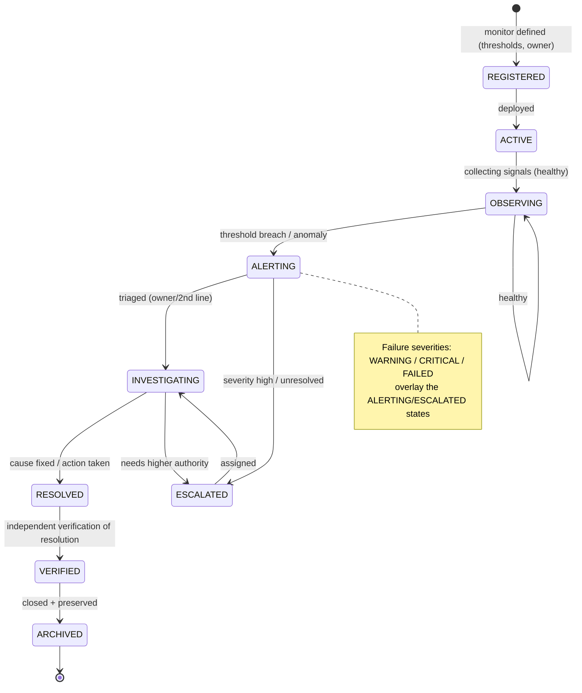

# Production Monitoring Governance Framework

| Field             | Value                                                                                                                                                             |
| ----------------- | ----------------------------------------------------------------------------------------------------------------------------------------------------------------- |
| **Document ID**   | PRODUCTION-MONITORING                                                                                                                                             |
| **Type**          | Cross-cutting operational monitoring governance (governance layer over Observability, RB-28 · OBS)                                                                |
| **Clause prefix** | `MON`                                                                                                                                                             |
| **Owner**         | Head of Platform / SRE (**HSRE**)                                                                                                                                 |
| **Co-signers**    | Governance & Risk Committee (**GRC**), Head of Portfolio & Risk (**HPR**), Head of AI (**HAI**), Head of Security (**CISO**), Architecture Review Board (**ARB**) |
| **Governed by**   | `CLAUDE.md`; Architecture V2 (§5.10, §10); RB-28 · OBS; RB-31 · INC; RB-13 · RISK                                                                                 |
| **Version**       | 1.0.0                                                                                                                                                             |
| **Status**        | PROPOSED (binding upon ARB ratification)                                                                                                                          |
| **Last Ratified** | — (pending)                                                                                                                                                       |

> **Position & authority.** This framework is the **governance standard for production monitoring** — the responsibilities, escalation, evidence collection, and operational oversight under which every production system is continuously monitored. It is the governance layer over the Observability spine (Architecture V2 §5.10) and unifies the domain-specific monitoring criteria already owned by the registries and rulebooks. It **references** RB-28 · OBS for observability _mechanism_ (logging, metrics, tracing, telemetry), RB-31 · INC for incident _response_, and RB-13 · RISK for _risk monitoring and limits_.

> **Monitoring is independent oversight.** Monitoring MUST be independent of the systems it observes (no system self-attests health); **AI monitors advisorily and never suppresses incidents, modifies thresholds, hides degradation, or approves closure; incident closure is human; every monitoring record is immutable** (CP-5, AI-3, DE-1, HO-1, CP-7).

> **Reading note.** Technology-independent. Not an observability-implementation guide, dashboard spec, or logging manual. No implementation, vendor tools, dashboards, or code. Each major section carries **Purpose · Responsibilities · Boundaries · Acceptance · Failure · Cross-refs**, with embedded RFC 2119 rules (`MON-n`). **Every production system MUST operate under continuous monitoring.**

---

## 1. Purpose

To define the immutable governance under which the platform continuously monitors production — infrastructure, data, features, signals, strategies, portfolios, risk, AI agents, workflows, execution, security, and compliance — answering: **what must be monitored, who is responsible, which failures require escalation, which metrics define operational health, how monitoring evidence is preserved, and how continuous compliance is verified.** Monitoring is the platform's operational nervous system: it detects failures early, preserves evidence, and triggers the controls (halt, escalation, incident) that protect capital and integrity.

Its governing intent is `CLAUDE.md` OB-1..4, RS, CI-1, CP-5/7: every production system is continuously and independently monitored; degradation and drift are detected early; monitoring feeds deterministic controls and human accountability; and monitoring evidence is immutable and auditable.

## 2. Scope & Boundaries

- **Purpose.** Define monitoring philosophy, domains, the monitoring lifecycle, AI monitoring governance, metrics governance, alert governance, and audit.
- **Responsibilities.** Ensure continuous, independent monitoring of all production systems; classify/escalate alerts; preserve monitoring evidence; verify continuous compliance; feed incidents and controls.
- **Boundaries (references only, never restated):**
  - **Observability _mechanism_: logging, metrics, tracing, telemetry, run ledger, cost attribution** → **RB-28 · OBS** (`P5-06`).
  - **Incident _response mechanism_** → **RB-31 · INC**; **DR/BCP** → **RB-32 · CONT** (`P6-03`).
  - **Domain monitoring _criteria_** → the owning documents: Dataset Governance (DSG-18), Feature Registry (FRG-45), Signal Registry (SIG-32), Strategy Registry (STR-34), Portfolio Registry (PFR-31), Execution Governance (EG-31), AI Agent Evaluation (EVAL-35), Risk Management (RISK-57).
  - **Risk limits/kill-switch, drawdown governance** → **RB-13 · RISK**; **security monitoring** → **RB-27 · SEC** (`P1-09`); **model/agent drift** → **RB-16 · MODEL** (`P4-01`); **research↔prod parity** → **RB-14 · EXEC / RB-11 · BT** (`P3-15`).
  - **AI role boundaries** → **RB-15 · AIGOV**, Agent Contracts; **ADR (threshold changes)** → **ADR Governance**.
- **Acceptance.** Every production system is under continuous, independent monitoring with immutable evidence and defined escalation. **Failure.** A production system unmonitored, self-monitored, or with suppressed/mutable evidence. **Cross-refs.** ARCH V2 §5.10, OB-1..4.

## 3. Constitutional & Governance Basis

Traces to: `CLAUDE.md` **OB-1..4** (observability), **RS-1..3** (risk monitoring, halt), **CI-1..3** (continuous improvement), **CP-5** (independence), **CP-7** (audit), **AI-3** (AI not approving), **DE-1**, **HO-1** (accountability), **RE-1..3** (reliability); RB-28 · OBS, RB-31 · INC, RB-13 · RISK; PATCH **P5-06** (cost/ROI), **P3-15** (parity), **P4-01** (drift), **P1-10** (feedback), **P6-03** (DR/BCP); Architecture V2 §5.10, §10; REVIEW M5 (observability), M7 (human scale).

---

## Clause Format

**Pivotal clauses** carry the full block: _Purpose · Rationale · Acceptance · Failure · Refs_. **Supporting clauses** carry RFC 2119 force plus a one-line rationale. Every clause has a stable ID (`MON-n`, continuous).

---

# PART A — MONITORING PHILOSOPHY

- **MON-1 · Continuous Visibility (MUST).** Every production system MUST be continuously and independently monitored; there MUST be no unmonitored production surface. _Rationale:_ OB-1; blind spots are where failures grow undetected. _Acceptance:_ every production system maps to active monitoring. _Failure:_ an unmonitored production surface. _Refs:_ MON-8.
- **MON-2 · Early Failure Detection (MUST).** Monitoring MUST detect degradation, drift, and anomalies **early** — before they become losses — and trigger graduated response (warning → escalation → halt). _Rationale:_ early action limits harm. _Refs:_ MON-30.
- **MON-3 · Evidence-Based Operations (MUST).** Operational decisions (escalate, halt, close) MUST rest on preserved monitoring evidence, never impression; every alert carries its evidence. _Rationale:_ CP-7. _Refs:_ MON-40.
- **MON-4 · Risk-Aware Monitoring (MUST).** Monitoring MUST be prioritized by capital and integrity risk; capital-affecting and control-integrity conditions MUST have the fastest, strongest response (kill-switch integration, RB-13 · RISK). _Rationale:_ RS; not all failures are equal. _Refs:_ MON-31.
- **MON-5 · Human Accountability (MUST).** A named human owns each monitoring domain; incident investigation and closure require human sign-off (HO-1, AI-3). _Rationale:_ accountability is non-delegable. _Refs:_ MON-44.
- **MON-6 · Deterministic Validation (MUST).** Monitoring thresholds, alert conditions, and health verdicts MUST be deterministic and versioned; an AI MUST NOT be the authority deciding a health verdict or closing an incident. _Rationale:_ DE-1; monitoring verdicts must be reproducible and auditable. _Refs:_ MON-20.
- **MON-7 · Operational Transparency (MUST).** Production health, alerts, and their evidence MUST be visible and auditable; hidden monitoring, suppressed alerts, or private health views are PROHIBITED. _Rationale:_ CP-7; opacity defeats oversight. _Refs:_ MON-60.

---

# PART B — MONITORING DOMAINS

- **MON-8 (MUST).** Every domain below MUST be continuously monitored; each has a named owner and references its criteria owner. Monitoring MUST be **independent of the monitored system's owner** for capital/integrity domains (CP-5). _Rationale:_ comprehensive, independent coverage. _Acceptance:_ all domains actively monitored with owners. _Failure:_ a domain unmonitored or self-attested. _Refs:_ MON-1.

**Monitoring domains (criteria owned by the referenced document; governance owned here):**

| Domain               | What is watched                             | Criteria owner                | Escalates to |
| -------------------- | ------------------------------------------- | ----------------------------- | ------------ |
| **Infrastructure**   | compute/storage/network/service health      | RB-28 · OBS, ARCH V2 §10      | HSRE / INC   |
| **Data Pipeline**    | ingestion freshness, breaks, throughput     | RB-06/07 · DATA, DSG          | HD / INC     |
| **Dataset Quality**  | quality dimensions, anomalies, restatements | Dataset Governance (DSG-18)   | HD           |
| **Feature Health**   | feature drift, stability, input reliability | Feature Registry (FRG-45)     | HQ           |
| **Signal Health**    | signal decay, reality-gap, degradation      | Signal Registry (SIG-32)      | HQ           |
| **Strategy Health**  | strategy decay/drift/reality-gap            | Strategy Registry (STR-34)    | HQ / HPR     |
| **Portfolio Health** | exposure/drift/drawdown/diversification     | Portfolio Registry (PFR-31)   | HPR          |
| **Risk**             | limits, VaR/ES, drawdown, correlation       | RB-13 · RISK (RISK-57)        | HPR / GRC    |
| **AI Agent**         | agent behavior, drift, reliability, safety  | AI Agent Evaluation (EVAL-35) | HAI / MRC    |
| **Workflow**         | state, transitions, stuck/failed runs       | Workflow Contracts            | HSRE         |
| **Execution**        | fills, rejects, parity, reconciliation      | Execution Governance (EG-31)  | HPR / HSRE   |
| **Security**         | access anomalies, exfil, injection          | RB-27 · SEC                   | CISO         |
| **Compliance**       | governance-rule adherence, gate integrity   | GRC                           | GRC          |

- **MON-9 (MUST).** Capital-affecting and control-integrity domains (Risk, Portfolio, Strategy, Execution, Compliance, Security) MUST integrate with the deterministic controls (kill-switch, auto-block, incident) so a monitored breach can **halt**, not merely alert (RB-13 · RISK, EG-32). _Rationale:_ RS-3; monitoring must be able to stop harm. _Refs:_ MON-31.

---

# PART C — MONITORING LIFECYCLE

- **MON-10 (MUST).** Every monitor (a monitored condition on a system) MUST follow the lifecycle below; transitions are gated/recorded, and evidence is preserved at every stage. _Rationale:_ OB, CP-7; a governed monitoring lifecycle is auditable. _Refs:_ MON-11.

**Lifecycle transition rules:**

| Transition                         | Precondition                                                                  | Approver                 |
| ---------------------------------- | ----------------------------------------------------------------------------- | ------------------------ |
| REGISTERED → ACTIVE                | thresholds + owner defined                                                    | domain owner             |
| OBSERVING → ALERTING               | deterministic threshold/anomaly breach                                        | automatic                |
| ALERTING → INVESTIGATING           | triage (severity assigned)                                                    | owner / 2nd line         |
| ALERTING/INVESTIGATING → ESCALATED | high severity or unresolved within SLA                                        | automatic / owner        |
| INVESTIGATING → RESOLVED           | corrective action taken + recorded                                            | human owner              |
| RESOLVED → VERIFIED                | independent verification of fix                                               | independent human        |
| VERIFIED → ARCHIVED                | closed with evidence                                                          | human owner + governance |
| **Forbidden**                      | ALERTING → ARCHIVED (skipping investigation/verification); AI-closed incident | — (PROHIBITED)           |

- **MON-11 (MUST).** **No alert MAY be closed (ARCHIVED) without investigation, resolution, and independent verification** by a human; auto-close or AI-close is PROHIBITED for material alerts (fail-closed). _Rationale:_ CP-5, AI-3; unverified closure hides unresolved problems. _Acceptance:_ every closed material alert has recorded investigation + independent verification. _Failure:_ an auto-/AI-closed material alert. _Refs:_ MON-24.
- **MON-12 (MUST).** **Severity states** (WARNING / CRITICAL / FAILED) overlay ALERTING/ESCALATED; CRITICAL/FAILED conditions (capital/control/integrity) MUST auto-escalate and, where applicable, trigger halt (MON-9). _Rationale:_ RS-3; severity drives speed and control. _Refs:_ MON-33.
- **MON-13 (MUST).** Every monitor MUST have a single accountable human **owner**; escalation reaches higher authority per severity (MON-33). _Rationale:_ accountability. _Refs:_ MON-5.

---

# PART D — AI MONITORING GOVERNANCE

## AI — MUST

- **MON-14 (MUST).** AI systems MUST monitor only authorized domains, report uncertainty, preserve evidence, escalate anomalies, and avoid unsupported conclusions. _Rationale:_ AIGOV-14/27/29; AI monitoring is advisory/narration within scope. _Acceptance:_ AI monitoring is scoped, evidenced, uncertainty-labeled, escalating. _Failure:_ AI monitoring outside scope or asserting unsupported conclusions. _Refs:_ MON-16.

## AI — MUST NOT

- **MON-15 (MUST NOT).** AI systems MUST NOT suppress incidents. _Rationale:_ CP-7, AIGOV-28; suppressing incidents hides risk. _Refs:_ MON-24.
- **MON-16 (MUST NOT).** AI systems MUST NOT modify monitoring thresholds autonomously. _Rationale:_ MON-6; thresholds belong to governance. _Refs:_ MON-6.
- **MON-17 (MUST NOT).** AI systems MUST NOT hide degraded performance. _Rationale:_ AIGOV-28, transparency (MON-7). _Refs:_ MON-7.
- **MON-18 (MUST NOT).** AI systems MUST NOT approve incident closure. _Rationale:_ AI-3, MON-11; closure is human. _Refs:_ MON-11.

- **MON-19 (MUST).** Monitoring **of AI** (agent behavior/drift/safety) MUST be independent of the agent and its owner (EVAL-35, CP-5); an AI MUST NOT be the sole monitor of another production AI whose failure it could conceal. _Rationale:_ AIGOV-E-2; AI policing AI is not oversight. _Refs:_ MON-8.
- **MON-20 (MUST).** Suspending all AI MUST NOT impair deterministic monitoring, alerting, escalation, or the kill-switch (AIGOV-61). _Rationale:_ the platform must remain observable and haltable with all AI off. _Refs:_ MON-6.

---

# PART E — METRICS GOVERNANCE

- **MON-21 (MUST).** Every monitoring metric MUST define **purpose, measurement method, acceptance criteria, and failure threshold**; thresholds are GRC/domain-governed parameters, changed only via §Exceptions (recorded as ADRs). _Rationale:_ CP-1; only fully-specified, governed metrics are enforceable. _Refs:_ per-family.

**Monitoring metric families (each fully specified; methods per owning document):**

| Family                    | Purpose                      | Measurement                                                 | Acceptance                    | Failure threshold      |
| ------------------------- | ---------------------------- | ----------------------------------------------------------- | ----------------------------- | ---------------------- |
| **Availability**          | system uptime                | uptime vs SLA                                               | ≥ SLA                         | below SLA              |
| **Reliability**           | correct operation            | success vs error rate                                       | ≥ target                      | above error ceiling    |
| **Latency**               | response time                | p50/p99 vs budget                                           | within budget                 | exceeds budget         |
| **Throughput**            | capacity                     | volume vs expected                                          | within band                   | below/above band       |
| **Data Freshness**        | timeliness                   | event→availability lag                                      | within SLA                    | stale beyond SLA       |
| **Drift**                 | behavioral/statistical shift | vs certified baseline (feature/signal/strategy/model/agent) | within tolerance              | drift beyond threshold |
| **Portfolio**             | book health                  | exposure/drift/drawdown vs limits                           | within limits                 | breaches limit         |
| **Risk**                  | risk posture                 | VaR/ES/utilization vs appetite                              | within appetite               | breaches appetite      |
| **Operational**           | ops stability                | parity/reconciliation/queue health                          | within tolerance              | breach/backlog         |
| **Governance Compliance** | control integrity            | gate/rule adherence, unmonitored-surface count              | 100% adherence; 0 blind spots | any gap/bypass         |

- **MON-22 (MUST).** **Governance-compliance metrics** MUST verify that controls are functioning (gates enforced, no bypasses, no unmonitored surfaces, no un-authorized executions); a compliance-metric failure is a control-integrity incident. _Rationale:_ CP-1; monitoring must watch the controls themselves. _Acceptance:_ continuous verification of control integrity. _Failure:_ an undetected control bypass. _Refs:_ MON-45.
- **MON-23 (MUST NOT).** Metrics MUST NOT be defined or tuned to hide degradation (e.g., widening thresholds to suppress alerts); safety metrics take precedence, and threshold changes are governed (Goodhart guard). _Rationale:_ transparency; gamed metrics defeat monitoring. _Refs:_ MON-16.

---

# PART F — ALERT GOVERNANCE

### Alert Classification

- **MON-24 (MUST).** Every alert MUST be classified by domain, severity, and whether it is capital/control-affecting; classification MUST be deterministic (from thresholds), not discretionary. _Rationale:_ consistent, auditable triage. _Refs:_ MON-33.

### Severity Levels

- **MON-25 (MUST).** Alerts MUST use a defined severity scale; severity determines escalation speed, authority, and whether a halt is triggered. _Rationale:_ RS-3; proportion response to consequence.

**Severity / escalation matrix:**

| Severity               | Trigger examples                                                          | Response                                      | Authority              |
| ---------------------- | ------------------------------------------------------------------------- | --------------------------------------------- | ---------------------- |
| **S1 Critical/FAILED** | risk/limit breach, control bypass, execution integrity, security incident | auto-escalate + halt (kill-switch) + incident | GRC + HPR/CISO (human) |
| **S2 High/CRITICAL**   | strategy/portfolio breach, parity breach, model-risk, data incident       | escalate + de-risk/review + incident          | 2nd-line + domain lead |
| **S3 Medium/WARNING**  | drift/decay approaching threshold, degradation trend                      | investigate; graduated action                 | domain owner           |
| **S4 Low**             | minor anomaly, transient                                                  | log + monitor                                 | domain owner           |

### Escalation Policy

- **MON-26 (MUST).** Escalation MUST follow the severity matrix; unresolved alerts MUST auto-escalate on SLA breach; S1 MUST reach human governance immediately and, where capital/control is at risk, halt (MON-9). _Rationale:_ CP-7, RS-3; slow escalation defeats the control. _Refs:_ MON-33.

### Notification Rules

- **MON-27 (MUST).** Notifications MUST reach the accountable owner(s) and required authority per severity, be recorded, and MUST NOT be suppressible by the monitored system or an AI. _Rationale:_ MON-15; suppressed notifications hide failures. _Refs:_ MON-15.

### False Positive Management

- **MON-28 (MUST).** False positives MUST be managed by governed threshold review (not silent suppression); tuning MUST NOT reduce sensitivity to capital/control-integrity conditions. _Rationale:_ alert fatigue is real, but suppression is dangerous; tuning is governed. _Refs:_ MON-16, MON-23.

### Alert Review Process

- **MON-29 (MUST).** Alerts and their resolutions MUST be periodically reviewed (cadence governed) for accuracy, response quality, and recurring patterns (feeding continuous improvement); recurring alerts MUST drive systemic fixes. _Rationale:_ CI-3; monitoring must improve. _Refs:_ MON-35.

---

# PART G — AUDIT REQUIREMENTS

- **MON-30 (MUST).** Every monitoring event MUST maintain immutably: **Monitoring ID, Component, Timestamp, Trigger, Severity, Evidence, Resolution History, and Reviewer** — each with actor/system, timestamp, and rationale. _Rationale:_ CP-7; monitoring evidence is core to operational and regulatory audit. _Acceptance:_ an auditor reconstructs any alert end-to-end (trigger→evidence→investigation→resolution→verification) without the operator. _Failure:_ a monitoring event with missing/mutable records. _Refs:_ MON-32.
- **MON-31 (MUST).** Monitoring evidence MUST be tamper-evident (RB-27 · SEC / `P1-09`) and preserved for the governed retention; evidence MUST NOT be deleted or altered, including by the monitored system or an AI. _Rationale:_ CP-2/7; evidence integrity. _Refs:_ MON-15.
- **MON-32 (MUST).** The monitoring registry MUST be reconcilable against production systems: any production system without an active monitor MUST be flagged (blind-spot detection) and remediated. _Rationale:_ MON-1; unmonitored surfaces are integrity gaps. _Refs:_ MON-8.

---

# PART H — CONTINUOUS COMPLIANCE VERIFICATION

- **MON-33 (MUST).** Monitoring MUST continuously verify governance compliance: that gates are enforced, controls are not bypassed, registries reconcile to usage (datasets/features/signals/strategies/portfolios in use are ACTIVE and registered), no un-authorized executions occur, and no blind spots exist. A verification failure is a control-integrity incident. _Rationale:_ CP-1, CP-7; the institution must continuously prove its controls work, not assume they do. _Acceptance:_ continuous compliance verification with 0 undetected bypasses. _Failure:_ an undetected control bypass or registry-usage drift. _Refs:_ MON-22.
- **MON-34 (MUST).** Continuous-compliance results MUST be reported to GRC on a governed cadence and feed the audit trail; systemic gaps MUST drive process improvement (CI-3) and, where architectural, ADRs. _Rationale:_ CP-7, CI-3. _Refs:_ MON-29.

---

## Responsibility Matrix (RACI)

| Monitoring activity                | AI            | Deterministic monitors | Human owner / 2nd line | Governance (GRC/HPR/HSRE) |
| ---------------------------------- | ------------- | ---------------------- | ---------------------- | ------------------------- |
| Collect signals / compute metrics  | R (assist)    | **R**                  | A                      | I                         |
| Classify / trigger alert           | narrate       | **R (deterministic)**  | A                      | I                         |
| Triage / investigate               | R (assist)    | R (evidence)           | **R**                  | A                         |
| Escalate (per severity)            | narrate       | **R (auto)**           | R                      | **A**                     |
| Halt (capital/control breach)      | ✗ (forbidden) | **R (auto)**           | R (human)              | **A**                     |
| Resolve                            | assist        | R (verify)             | **R**                  | A                         |
| Verify resolution (independent)    | ✗             | R (checks)             | **R (independent)**    | A                         |
| Close incident (ARCHIVE)           | ✗ (forbidden) | R (gate)               | **R (human)**          | **A**                     |
| Change thresholds                  | ✗ (forbidden) | —                      | C                      | **A (governed/ADR)**      |
| Continuous compliance verification | assist        | **R**                  | R                      | **A (GRC)**               |

---

## Acceptance Criteria (production system → monitored)

A production system is **compliantly monitored** only when **all** hold:

**Monitoring readiness checklist:**

- [ ] Registered monitor(s) with defined thresholds + named owner (MON-8, MON-13).
- [ ] Independent of the monitored system's owner for capital/integrity domains (MON-8, MON-19).
- [ ] Covers the relevant domain criteria (per owning document) (MON-8).
- [ ] Metrics fully specified (purpose/measurement/acceptance/failure) with governed thresholds (MON-21).
- [ ] Severity classification + escalation policy + notification rules configured (MON-24–27).
- [ ] Capital/control domains integrated with halt/kill-switch (MON-9).
- [ ] Evidence capture immutable + tamper-evident (MON-30, MON-31).
- [ ] AI monitoring (if any) advisory-only, scoped, cannot suppress/close (MON-14–18).
- [ ] Continuous-compliance verification active; no blind spots (MON-32, MON-33).
- [ ] Alert review + continuous improvement wired (MON-29).

## Failure / Rejection Criteria

Monitoring MUST be treated as **non-compliant** (and remediated) if **any** hold:

- **MON-35.** A production surface is unmonitored (blind spot) (MON-1, MON-32).
- **MON-36.** A system self-monitors capital/integrity health (no independence) (MON-8, MON-19).
- **MON-37.** An alert closed without investigation + independent verification, or AI-closed (MON-11, MON-18).
- **MON-38.** Incidents suppressed, degradation hidden, or thresholds AI-modified (MON-15, MON-16, MON-17).
- **MON-39.** Monitoring evidence deleted/altered, or missing required record fields (MON-30, MON-31).
- **MON-40.** A capital/control breach that alerts but cannot halt (MON-9).
- **MON-41.** A control bypass or registry-usage drift left undetected (MON-33).
- **MON-42.** Thresholds tuned to suppress sensitivity to capital/control conditions (MON-23, MON-28).

---

## Anti-Patterns & Forbidden Practices

**Anti-patterns:**

- **MON-AP-1.** Unmonitored production surfaces (blind spots) (MON-1).
- **MON-AP-2.** Systems attesting their own health (MON-8).
- **MON-AP-3.** AI suppressing incidents, hiding degradation, or closing alerts (MON-15, MON-17, MON-18).
- **MON-AP-4.** Widening thresholds to silence alerts (MON-23, MON-28).
- **MON-AP-5.** Auto-/AI-closing material alerts without verification (MON-11).
- **MON-AP-6.** Alerting on a capital breach that cannot halt (MON-9).
- **MON-AP-7.** Monitoring metrics gamed for green dashboards (MON-23).

**Forbidden practices (non-waivable):**

- **MON-F-1.** Operating a production system without continuous, independent monitoring (MON-1, MON-8).
- **MON-F-2.** AI suppressing incidents, hiding degradation, modifying thresholds, or approving closure (MON-15–18).
- **MON-F-3.** Closing a material alert without human investigation + independent verification (MON-11).
- **MON-F-4.** Deleting/altering monitoring evidence (MON-31).
- **MON-F-5.** A capital/control-integrity breach that cannot trigger halt (MON-9).
- **MON-F-6.** Suppressing/disabling notifications for capital/control conditions (MON-27).
- **MON-F-7.** Leaving a detected control bypass/blind spot unremediated (MON-33).

---

## Enforcement & Verification

| Clause group                                     | Enforcement mechanism                            | Owner                              |
| ------------------------------------------------ | ------------------------------------------------ | ---------------------------------- |
| Continuous + independent monitoring (MON-1,8,19) | Coverage gate + blind-spot detection             | this framework, RB-28 · OBS        |
| Deterministic thresholds/verdicts (MON-6,24)     | Deterministic monitors; no AI verdicts           | RB-28 · OBS (`P1-03`)              |
| Halt integration (MON-9,12)                      | Kill-switch/auto-block on capital/control breach | RB-13 · RISK, Execution Governance |
| AI monitoring limits (MON-14–19)                 | Agent authority flags; independence              | RB-15 · AIGOV, AI Agent Evaluation |
| Incident closure (MON-11)                        | Human verification gate                          | RB-31 · INC (AI-3)                 |
| Metrics/thresholds governance (MON-21,23)        | Governed parameters; ADR-recorded changes        | GRC, ADR Governance                |
| Evidence integrity (MON-30,31)                   | Immutable records + tamper-evident audit         | RB-27 · SEC (`P1-09`)              |
| Continuous compliance (MON-33,34)                | Control-integrity verification + reconciliation  | GRC, this framework                |
| Forbidden practices (MON-F-\*)                   | Fail-closed; integrity/risk report               | GRC                                |

- **MON-E-1 (MUST).** Every clause enforcing a Forbidden Practice (MON-F-*) MUST be deterministically enforced and fail-closed. *Rationale:* CP-1, DE-1. *Refs:\* MON-9.
- **MON-E-2 (MUST).** Monitoring enforcement MUST be deterministic; an AI MUST NOT be the sole authority deciding health verdicts, closing incidents, or attesting compliance. _Rationale:_ DE-1, AIGOV-E-2. _Refs:_ MON-6.

## Exceptions & Waivers

- **MON-W-1 (MUST).** No exception MAY be granted to: continuous independent monitoring (MON-1/8), halt integration for capital/control (MON-9), human incident closure (MON-11), AI-monitoring limits (MON-15–18), evidence integrity (MON-31), or any `CLAUDE.md` entrenched clause (AM-2). Non-waivable.
- **MON-W-2 (MAY).** GRC/domain-governed parameters (thresholds, SLAs, review cadence, retention) MAY be changed only by the governing body, recorded as an ADR, applied prospectively — never to suppress sensitivity to capital/control conditions (MON-23).
- **MON-W-3 (MUST).** Any temporary waiver MUST be recorded and surfaced in operational/risk reporting. _Rationale:_ no hidden exceptions.

## Ratification Criteria

Ratifiable only when: every clause has a stable ID, RFC 2119 phrasing, and an enforcement mechanism; no clause contradicts `CLAUDE.md`, Architecture V2, RB-28 · OBS, RB-13 · RISK, RB-31 · INC, or peer frameworks; continuous independent monitoring, deterministic verdicts, halt integration, human incident closure, AI-monitoring limits, evidence integrity, and continuous compliance are preserved; all cross-references resolve; ARB approval with HSRE + GRC + HPR (+ HAI/CISO) co-sign obtained.

## Success Metrics

- **SM-1.** 0 unmonitored production surfaces (blind spots) (MON-1, MON-32).
- **SM-2.** 100% capital/control domains with halt integration; 0 alert-only capital breaches (MON-9).
- **SM-3.** 0 AI-suppressed incidents, AI-modified thresholds, or AI-closed alerts (MON-15–18).
- **SM-4.** 100% material alerts closed with human investigation + independent verification (MON-11).
- **SM-5.** 0 deleted/altered monitoring evidence; 100% events with complete immutable records (MON-31, MON-30).
- **SM-6.** Continuous compliance verification detects 100% of control bypasses/registry drift; 0 undetected (MON-33).
- **SM-7.** MTTA/MTTR within SLA; recurring alerts driving systemic fixes (MON-26, MON-29).

## Dependencies & Related Documents

- **Governed by:** `CLAUDE.md`; Architecture V2 (§5.10, §10); RB-28 · OBS; RB-31 · INC; RB-13 · RISK.
- **Unifies monitoring of / references:** Dataset Governance, Feature/Signal/Strategy/Portfolio Registries, Execution Governance, AI Agent Evaluation, RB-13 · RISK, RB-27 · SEC (security monitoring), RB-16 · MODEL (drift), RB-14 · EXEC/RB-11 · BT (parity), Workflow Contracts, ADR Governance (threshold changes), RB-32 · CONT (DR/BCP).
- **Architecture references:** ARCH §2.12; Architecture V2 §5.10, §10; PATCH `P5-06`, `P3-15`, `P4-01`, `P1-10`, `P6-03`; REVIEW M5, M7.

## Change Log & Version History

| Version | Date    | Author (role) | Change                                              |
| ------- | ------- | ------------- | --------------------------------------------------- |
| 1.0.0   | pending | HSRE          | Initial Production Monitoring Governance Framework. |

---

## Glossary (monitoring-specific)

Terms in `CLAUDE.md`, rulebook, and prior-framework glossaries (kill-switch, drift, reality-gap, parity, incident, tamper-evident audit, blind spot) are not redefined.

- **Monitor** — A registered, deterministic watch on a production condition with defined thresholds, owner, and evidence capture (MON-10).
- **Monitoring Domain** — One of the governed areas of production observed (infrastructure … compliance) (MON-8).
- **Blind Spot** — A production surface without active monitoring; prohibited (MON-1, MON-32).
- **Independent Monitoring** — Monitoring performed by a party other than the monitored system's owner (2nd line) (MON-8).
- **Severity (S1–S4 / WARNING/CRITICAL/FAILED)** — The classification driving escalation speed, authority, and halt (MON-25).
- **Halt Integration** — The linkage of capital/control monitors to the kill-switch/auto-block so a breach can stop, not merely alert (MON-9).
- **Continuous Compliance Verification** — Ongoing checking that controls function, gates are enforced, registries reconcile, and no bypasses/blind spots exist (MON-33).
- **Monitoring Evidence** — The immutable record (trigger/severity/evidence/resolution/reviewer) preserved for every monitoring event (MON-30).

---

_End of Production Monitoring Governance Framework. It is the governance standard for monitoring production: every production system — infrastructure, data, features, signals, strategies, portfolios, risk, AI agents, workflows, execution, security, and compliance — is continuously and independently monitored with deterministic thresholds and immutable evidence. Capital and control-integrity conditions are wired to halt, not merely alert; material alerts are closed only after human investigation and independent verification; and continuous-compliance verification proves the controls themselves are working, with no blind spots. AI monitors advisorily — it never suppresses incidents, modifies thresholds, hides degradation, or approves closure — and the platform remains observable and haltable with all AI suspended. Safety and integrity precede convenience; humans remain accountable; evidence is permanent. Binding upon ARB ratification._
