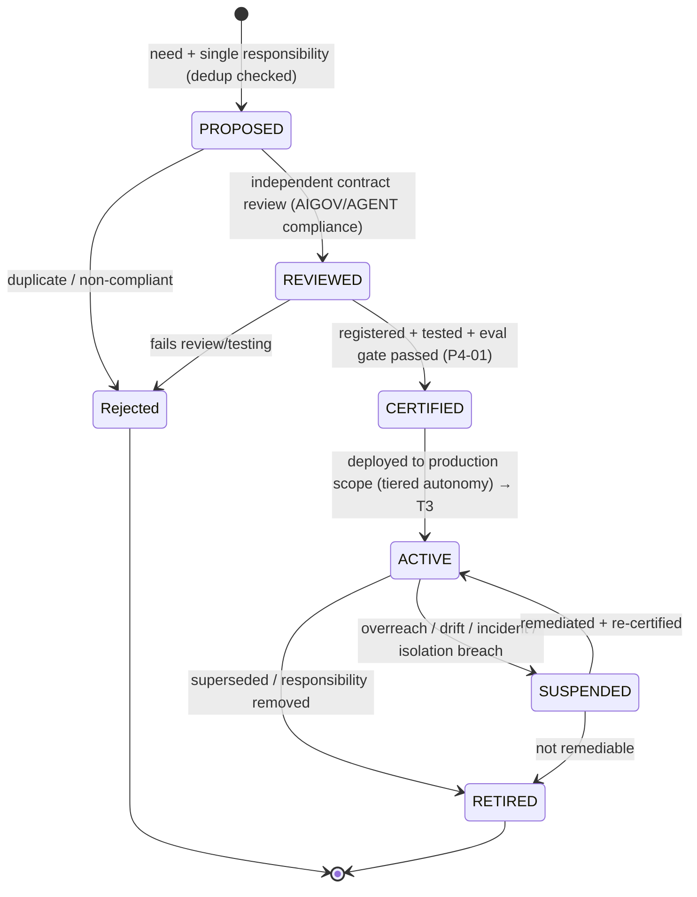

# AI Agent Registry

| Field             | Value                                                                                                                     |
| ----------------- | ------------------------------------------------------------------------------------------------------------------------- |
| **Document ID**   | AGENT-REGISTRY                                                                                                            |
| **Type**          | Operational governance registry (instantiation of Agent Registry, `P4-02`)                                                |
| **Clause prefix** | `REG`                                                                                                                     |
| **Owner**         | Head of AI / ML Platform (**HAI**)                                                                                        |
| **Co-signers**    | Model Risk Committee (**MRC**), Governance & Risk Committee (**GRC**), Architecture Review Board (**ARB**)                |
| **Governed by**   | `CLAUDE.md`; Architecture V2 (§5.3 Agent Layer); RB-15 · AIGOV; Tier-4 **Agent Contracts**; Tier-5 **Workflow Contracts** |
| **Version**       | 1.0.0                                                                                                                     |
| **Status**        | PROPOSED (binding upon ARB ratification)                                                                                  |
| **Last Ratified** | — (pending)                                                                                                               |

> **Position & authority.** This registry is the **operational source of truth for AI-agent existence and governance status** — the concrete realization of the Agent Registry component (`P4-02`, ARCH §2.11). It is subordinate to and governed by RB-15 · AIGOV and the Tier-4 Agent Contract Framework (`agent_contracts.md`). **Each registry entry references an agent's Tier-4 contract, which remains the authoritative source for the full specification.** The registry records _which agents exist, who owns them, their authority, their lifecycle/approval state, and their governance metadata._ Where a registry entry and its contract diverge, **the contract governs the spec and the registry entry is corrected**; where existence/status is in question, **the registry governs.**

> **Reading note.** Technology-independent. No implementation, model-specific, vendor, or prompt content. **No AI agent may become operational without a ratified registry entry backed by a ratified contract.**

---

## 1. Purpose

To provide the authoritative, auditable inventory and governance state of every AI agent on the platform, answering: **what agents exist, why, who owns them, what authority they hold, which workflows use them, what data they may access, whether they are approved, and whether they are active.** The registry makes the agent population _visible, governable, and accountable_ at institutional scale.

Its governing intent is `CLAUDE.md` AG-1..4, ACON-1..3, and AIGOV: agents are single-responsibility, contract-bound, `propose`/`narrate`-only workers; the registry is the deterministic control that ensures none operates outside governance.

## 2. Scope & Boundaries

- **Purpose.** Define the registry framework, the mandatory entry standard, lifecycle governance, authority governance, and the seed governance-template entries.
- **Responsibilities.** Maintain agent identity, ownership, authority, lifecycle/approval status, capability summary (pointing to the contract), quality metrics, and full audit history.
- **Boundaries (references only, never restated):**
  - **Agent contract structure, authority ceilings, isolation, lifecycle _rules_** → Tier-4 **Agent Contracts** (`agent_contracts.md`).
  - **AI role boundaries, capability class (G/A/D/X), trust levels, deterministic-engine mandate** → **RB-15 · AIGOV**.
  - **Model registry/pinning/eval/drift** → **RB-16 · MODEL** (`P4-01`); **prompt governance** → **RB-17 · PROMPT**; **memory scoping** → **RB-19 · MEM**.
  - **Workflow participation _rules_** → Tier-5 **Workflow Contracts**.
  - **The decisions agents may never make** → decision rulebooks (STAT, VAL, BT, FAR, PORT, RISK, EXEC).
- **Acceptance.** Every operating agent has one registry entry conforming to §5, backed by a ratified contract. **Failure.** An operating agent absent from the registry, or a registry entry without a contract. **Cross-refs.** AIGOV, Agent Contracts, Architecture V2 §5.3.

## 3. Constitutional & Governance Basis

Traces to: `CLAUDE.md` **AG-1..4, ACON-1..3, AC-1..4, AI-1..8, DE-1, HO-1, CP-5/7**; RB-15 · AIGOV (capability class, trust, deterministic-engine mandate, isolation, provenance); Tier-4 Agent Contracts (`AGC-*`); Tier-5 Workflow Contracts (`WFC-*`); Architecture V2 (`AV2-16/17/39`); PATCH **P4-02** (Agent Registry), **P4-04** (role rationalization), **P4-01** (eval gate), **P2-07** (isolation), **P5-05** (tiered autonomy); REVIEW AI-architecture risks.

---

## Clause Format

**Pivotal clauses** carry the full block: _Purpose · Rationale · Acceptance · Failure · Refs_. **Supporting clauses** carry RFC 2119 force plus a one-line rationale. Every clause has a stable ID (`REG-n`, continuous).

---

# PART A — REGISTRY FRAMEWORK

## Registry Philosophy

- **REG-1 (MUST).** The registry MUST be the single, authoritative, deterministic inventory of agents; an AI agent's _existence_ is defined by its registry entry, and an unregistered agent does not exist for operational purposes and MUST NOT run. _Rationale:_ CP-7, ACON-1; visibility is the precondition of governance. _Acceptance:_ every running agent maps to a registry entry. _Failure:_ a running unregistered agent. _Refs:_ REG-20.
- **REG-2 (MUST).** The registry MUST be a **deterministic control**, not an AI-editable document; agents MUST NOT read/write their own registry state to alter it. _Rationale:_ DE-1; a registry an AI can edit is not a control. _Refs:_ REG-22.

## Agent Registration Principles

- **REG-3 (MUST).** No agent MAY become operational without: a single responsibility, a ratified Tier-4 contract, a bound pinned model, a versioned prompt, a named human owner, an assigned trust level, and a registry entry in an approved lifecycle state. _Rationale:_ ACON-1, AGC-4; registration binds all governance prerequisites. _Acceptance:_ all prerequisites present before ACTIVE. _Failure:_ an agent operational without any prerequisite. _Refs:_ §5, §7.
- **REG-4 (MUST).** Registration MUST be idempotent and deduplicated: a proposed agent duplicating an existing responsibility MUST be rejected (no overlapping agents, `P4-04`). _Rationale:_ REVIEW; overlap causes conflicting outputs and unclear authority. _Refs:_ REG-30.

## Registry Ownership

- **REG-5 (MUST).** The registry as a system is owned by HAI (co-governed by MRC/GRC/ARB); each _entry_ has a named human agent-owner accountable for that agent (HO-1). _Rationale:_ CP-7; both the registry and each agent are accountable. _Refs:_ REG-8.

## Registry Authority

- **REG-6 (MUST).** Only governance (HAI/MRC/GRC per state) MAY approve lifecycle transitions in the registry; approvals are recorded. Agents and their owners MUST NOT self-approve transitions. _Rationale:_ CP-5; separation of the approver from the approved. _Refs:_ §7.

## Registry Lifecycle Management

- **REG-7 (MUST).** The registry MUST maintain each agent's lifecycle state, enforce legal transitions (§7), and retain full history (§9); state MUST reflect the agent's contract lifecycle (AGC-20). _Rationale:_ consistency between registry and contract lifecycle. _Refs:_ REG-31, §9.

---

# PART B — AGENT REGISTRY ENTRY STANDARD

- **REG-8 (MUST).** Every registry entry MUST contain **all** fields in the standard below; an entry missing any field is not ratifiable. Capability fields **summarize** the authoritative Tier-4 contract and MUST NOT contradict it. _Rationale:_ ACON-1; a complete, uniform, visible governance record. _Acceptance:_ all fields present and consistent with the contract. _Failure:_ an incomplete or contract-contradicting entry. _Refs:_ §2 (boundary).

**Agent Registry Entry Standard:**

| Group                  | Field                      | Requirement                                                                        |
| ---------------------- | -------------------------- | ---------------------------------------------------------------------------------- |
| **Identity**           | Agent Name                 | Human-readable, responsibility-reflecting (RB-26 · NAME).                          |
|                        | Unique Identifier          | Stable, immutable `AGT-<CAT>-<nnn>`.                                               |
|                        | Description                | One-line what-and-why.                                                             |
|                        | Purpose                    | The single responsibility (AGC-7).                                                 |
|                        | Classification             | Category (§6) + capability class (G/A).                                            |
|                        | Owner                      | Named accountable human role.                                                      |
| **Governance**         | Contract Reference         | Link + version to the Tier-4 contract (authoritative).                             |
|                        | Workflow References        | Tier-5 workflows the agent participates in.                                        |
|                        | Trust Level                | U/T1/T2/T3 (AIGOV-12); only T2/T3 operate in production.                           |
|                        | Authority Level            | `propose` or `narrate` (never `decide`, AGC-9).                                    |
|                        | Approval Status            | Governance approval state (tied to lifecycle).                                     |
| **Capability**         | Allowed Responsibilities   | Summary of contract Allowed Actions.                                               |
|                        | Forbidden Responsibilities | Summary of contract Forbidden Actions + absolute limits.                           |
|                        | Input Types                | Contracted input artifact types.                                                   |
|                        | Output Types               | Contracted output artifact types (evidence/uncertainty/provenance).                |
|                        | Allowed Tools              | Default-deny enumerated tools/MCP.                                                 |
|                        | Data Access Level          | Sensitivity/scope; as-of layer only; OOS access = **never** for generation agents. |
| **Operational Status** | Lifecycle State            | PROPOSED/REVIEWED/CERTIFIED/ACTIVE/SUSPENDED/RETIRED (§7).                         |
|                        | Version                    | Contract/entry version.                                                            |
|                        | Creation Date              | Registration date.                                                                 |
|                        | Last Review Date           | Most recent governance review.                                                     |
|                        | Retirement Status          | Retired flag + rationale ref (if applicable).                                      |
| **Quality**            | Evaluation Metrics         | Eval-gate results (RB-16 · MODEL).                                                 |
|                        | Performance Metrics        | Task success, acceptance rate, latency, cost (AGC-55).                             |
|                        | Reliability Metrics        | Error/hallucination rate, uncertainty calibration, isolation compliance (AGC-56).  |
|                        | Known Limitations          | Documented scope limits and failure modes.                                         |

- **REG-9 (MUST).** The **Authority Level** field MUST be `propose` or `narrate`; a registry entry MUST NOT record `decide` authority for any agent (AGC-9). _Rationale:_ AI-1..4, DE-1; the registry structurally forbids decision authority. _Refs:_ REG-27.
- **REG-10 (MUST).** The **Data Access Level** MUST route through the certified as-of read layer; no entry MAY grant a generation agent access to OOS/holdout or raw/uncertified data (AGC-19). _Rationale:_ isolation, DI-1. _Refs:_ REG-28.

---

# PART C — AGENT CLASSIFICATION (registry categories)

- **REG-11 (MUST).** Every agent MUST be classified into exactly one primary category below; category sets the default authority ceiling (a hard limit). _Rationale:_ category-based governance is precise and enforceable. _Refs:_ §5 (Classification).

| Cat code | Category                      | Capability class | Default authority |
| -------- | ----------------------------- | ---------------- | ----------------- |
| `RD`     | Research (discovery)          | G                | propose           |
| `FD`     | Feature Discovery             | A                | propose           |
| `AN`     | Analysis                      | A                | propose / narrate |
| `VN`     | Validation (narrator)         | A                | **narrate only**  |
| `RN`     | Risk (analysis/narrator)      | A                | **narrate only**  |
| `PN`     | Portfolio (analysis/narrator) | A                | **narrate only**  |
| `DO`     | Documentation                 | G/A              | propose           |
| `EN`     | Engineering                   | A                | propose           |
| `MO`     | Monitoring                    | A                | narrate           |

- **REG-12 (MUST).** Categories `VN`, `RN`, `PN`, `MO` are **narration/analysis roles**; agents in these categories MUST NOT adjudicate, decide, approve, or execute (AIGOV-16, `P4-04`). _Rationale:_ REVIEW "agents that should not decide"; the classic overreach. _Acceptance:_ these categories' entries record `narrate` authority and forbid adjudication. _Failure:_ a validation/risk/portfolio agent recorded with decision authority or observed deciding. _Refs:_ REG-9.

---

# PART D — LIFECYCLE GOVERNANCE

- **REG-13 (MUST).** Every registry entry MUST follow the state machine below; transitions MUST be gated, approved, and recorded, and MUST map to the agent's contract lifecycle (AGC-20). _Rationale:_ governed lifecycle is auditable; consistency with the contract. _Refs:_ §9.

**Registry state → contract lifecycle mapping (consistency):**

| Registry state | Contract lifecycle (AGC-20) | Meaning                                      | Approver                          |
| -------------- | --------------------------- | -------------------------------------------- | --------------------------------- |
| PROPOSED       | Proposed/Designed           | contract drafted                             | owner proposes                    |
| REVIEWED       | Reviewed/Registered/Tested  | independently reviewed + registered + tested | HAI                               |
| CERTIFIED      | Certified (T2)              | eval gate passed                             | HAI + MRC                         |
| ACTIVE         | Deployed/Monitored (T3)     | operating in production scope                | HAI + GRC                         |
| SUSPENDED      | Suspended                   | halted pending remediation                   | any: governance/automated trigger |
| RETIRED        | Retired                     | decommissioned                               | HAI + GRC                         |

- **REG-14 (MUST).** Allowed transitions are exactly those in the state machine; any other transition is PROHIBITED. Notably: PROPOSED MUST NOT jump to ACTIVE (no bypassing review/certification), and RETIRED is terminal (revival = new entry/version). _Rationale:_ WFC-16 analog; skipping states bypasses gates. _Acceptance:_ the registry engine rejects undeclared transitions. _Failure:_ an agent going operational without CERTIFIED. _Refs:_ REG-32.
- **REG-15 (MUST).** Transition approvals MUST be recorded with approver, timestamp, and rationale; **certification requires the eval gate** (RB-16 · MODEL), and **ACTIVE requires a tiered-autonomy policy** (`P5-05`). _Rationale:_ CP-7, trust is earned. _Refs:_ §9.
- **REG-16 (MUST).** An agent MUST be instantly SUSPENDABLE by governance or an automated trigger (overreach, drift, incident, isolation breach) without impairing deterministic operations (AIGOV-60/61). _Rationale:_ AI failure must degrade safely. _Refs:_ REG-33.

---

# PART E — AUTHORITY GOVERNANCE

## Agents in the Registry — MUST

- **REG-17 (MUST).** Registered agents MUST have registered ownership (a named human owner). _Rationale:_ HO-1. _Refs:_ REG-5.
- **REG-18 (MUST).** Registered agents MUST have approved (ratified) contracts referenced by the entry. _Rationale:_ ACON-1. _Refs:_ REG-8.
- **REG-19 (MUST).** Registered agents MUST operate within their assigned permissions (default-deny, per contract/entry). _Rationale:_ least privilege. _Refs:_ REG-10.
- **REG-20 (MUST).** Registered agents MUST maintain audit records (provenance for consequential actions). _Rationale:_ CP-7, AIGOV-23. _Refs:_ §9.

## Agents in the Registry — MUST NOT

- **REG-21 (MUST NOT).** Agents MUST NOT exist (operate) without registration. _Rationale:_ REG-1. _Refs:_ REG-1.
- **REG-22 (MUST NOT).** Agents MUST NOT change their own registry information. _Rationale:_ REG-2; self-editing defeats the control. _Refs:_ REG-2.
- **REG-23 (MUST NOT).** Agents MUST NOT increase their own authority (no self-escalation). _Rationale:_ AGC-11, AGC-38. _Refs:_ REG-9.
- **REG-24 (MUST NOT).** Agents MUST NOT bypass certification (no PROPOSED→ACTIVE). _Rationale:_ REG-14; certification is the trust gate. _Refs:_ REG-14.

- **REG-25 (MUST).** Enforcement of registry authority MUST be deterministic (registry engine, ACLs, gates); an AI MUST NOT be the authority controlling the registry (AIGOV-E-2). _Rationale:_ AI policing the agent registry is not a control. _Refs:_ REG-2.

---

# PART F — QUANTITATIVE PLATFORM AGENT REGISTRY

## Master Inventory (seed roster — reflects the `P4-04`-rationalized mesh)

> This inventory lists the platform's governed agents. Decision-making "agents" from V1 (`overfitting_auditor`, `robustness_examiner`, `risk_supervisor`, `allocation_strategist`, `system_critic`) are **not** present as deciders; their functions are deterministic engines, with **narrator** agents where explanation is useful (per `P4-04`, REVIEW).

| ID         | Name                         | Category | Authority | Trust | State  | Owner | Contract             | Workflows     |
| ---------- | ---------------------------- | -------- | --------- | ----- | ------ | ----- | -------------------- | ------------- |
| AGT-RD-001 | Research Discovery Agent     | RD       | propose   | T3    | ACTIVE | HQ    | `agent_contracts.md` | WFC-43        |
| AGT-RD-002 | Literature Miner             | RD       | propose   | T2    | ACTIVE | HQ    | ↳                    | WFC-43        |
| AGT-RD-003 | Company Researcher           | RD       | propose   | T2    | ACTIVE | HQ    | ↳                    | WFC-43        |
| AGT-FD-001 | Feature Engineering Agent    | FD       | propose   | T3    | ACTIVE | HQ    | ↳                    | WFC-44        |
| AGT-FD-002 | Factor Search Agent          | FD       | propose   | T2    | ACTIVE | HQ    | ↳                    | WFC-44        |
| AGT-AN-001 | Backtesting Agent            | AN       | propose   | T3    | ACTIVE | HQ    | ↳                    | WFC-45        |
| AGT-VN-001 | Validation Narrator          | VN       | narrate   | T2    | ACTIVE | GRC   | ↳                    | WFC-46        |
| AGT-RN-001 | Risk Analysis Agent          | RN       | narrate   | T2    | ACTIVE | HPR   | ↳                    | WFC-47        |
| AGT-PN-001 | Portfolio Analysis Agent     | PN       | narrate   | T2    | ACTIVE | HPR   | ↳                    | WFC-48        |
| AGT-DO-001 | Documentation Agent          | DO       | propose   | T2    | ACTIVE | PE    | ↳                    | all           |
| AGT-EN-001 | Engineering Agent            | EN       | propose   | T2    | ACTIVE | PE    | ↳                    | eng workflows |
| AGT-MO-001 | Monitoring Narrator          | MO       | narrate   | T2    | ACTIVE | HSRE  | ↳                    | WFC-49        |
| AGT-RD-004 | Research Director (proposer) | RD       | propose   | T2    | ACTIVE | HQ    | ↳                    | orchestration |

- **REG-26 (MUST).** The inventory MUST be kept current; adding/removing an agent MUST be a governed registry transition (§7). _Rationale:_ CP-7; the inventory is the operational truth. _Refs:_ §9.

## Governance Templates (per named agent)

> Each template summarizes the entry; the Tier-4 contract is authoritative. All templates inherit: read via as-of layer only; provenance recorded; single responsibility; instant-suspendable; human owner.

### AGT-RD-001 · Research Discovery Agent

- **Purpose.** Propose falsifiable hypotheses and candidate research directions. **Category/Authority.** RD / **propose**. **Trust.** T3.
- **Responsibilities.** Generate ideas/hypotheses with economic rationale; synthesize literature; propose experiment designs.
- **Authority.** May propose only; outputs are advisory to deterministic gates/humans.
- **Restrictions.** MUST NOT test/validate/approve; MUST NOT access OOS/validation outcomes (isolation, `P2-07`); MUST NOT set the research agenda alone.
- **Workflow Participation.** WFC-43 (Research Discovery) — PROPOSED/REVIEW stages.
- **Data Access.** Certified as-of data; **no OOS**. **Cross-refs.** RMET-51, FAR-4, AGC-15.

### AGT-FD-001 · Feature Engineering Agent

- **Purpose.** Propose feature definitions and transformations. **Category/Authority.** FD / **propose**. **Trust.** T3.
- **Responsibilities.** Draft declarative feature specs; propose signal processing; classify features.
- **Authority.** Propose only; features accepted only via deterministic gates (leakage harness, significance, FAR acceptance).
- **Restrictions.** MUST NOT accept its own features; MUST NOT use full-sample/look-ahead statistics; MUST NOT access OOS.
- **Workflow Participation.** WFC-44 (Feature Research).
- **Data Access.** As-of via Feature Factory; **no OOS**. **Cross-refs.** FAR-19, PIT `P1-06`, `P2-03`.

### AGT-AN-001 · Backtesting Agent

- **Purpose.** Configure and prepare backtests; propose analyses of results. **Category/Authority.** AN / **propose**. **Trust.** T3.
- **Responsibilities.** Prepare backtest configs; run the deterministic engine; propose performance analyses/narratives.
- **Authority.** Propose/configure; the backtest engine and gates are deterministic.
- **Restrictions.** MUST NOT alter results; MUST NOT approve; MUST NOT run gross/under-costed backtests; MUST NOT access OOS beyond one-shot holdout governed by VAL.
- **Workflow Participation.** WFC-45 (Backtesting).
- **Data Access.** As-of; certified. **Cross-refs.** BT rulebook, `P3-16`, BKT-79.

### AGT-VN-001 · Validation Narrator

- **Purpose.** **Explain** deterministic validation verdicts in human-readable form. **Category/Authority.** VN / **narrate only**. **Trust.** T2.
- **Responsibilities.** Narrate gauntlet outputs (deflation, PBO, robustness, holdout results); draft validation reports.
- **Authority.** **Narrate only** — MUST NOT adjudicate significance, PBO, or any verdict; MUST NOT alter a decision.
- **Restrictions.** MUST NOT validate; MUST NOT approve; MUST NOT feed validation/OOS content back to generation agents (isolation).
- **Workflow Participation.** WFC-46 (Validation) — narration of gate outputs only.
- **Data Access.** Validation outputs (read to explain); MUST NOT relay to generators. **Cross-refs.** STAT, VAL `P2-02/09`, AIGOV-22, AGC-15.

### AGT-RN-001 · Risk Analysis Agent

- **Purpose.** Compute and **explain** risk analytics. **Category/Authority.** RN / **narrate only**. **Trust.** T2.
- **Responsibilities.** Compute exposure/VaR/ES/drawdown analytics (deterministic); narrate risk reports.
- **Authority.** **Narrate only** — MUST NOT set limits, decide halts, or approve risk.
- **Restrictions.** MUST NOT decide/override any risk control; kill-switch is human/deterministic, never this agent.
- **Workflow Participation.** WFC-47 (Risk Review) — analytics + narration.
- **Data Access.** Portfolio/risk state; certified as-of. **Cross-refs.** RISK-4/71, AIGOV-16.

### AGT-PN-001 · Portfolio Analysis Agent

- **Purpose.** Produce attribution and exposure reporting; **explain** portfolio construction. **Category/Authority.** PN / **narrate only**. **Trust.** T2.
- **Responsibilities.** Compute performance/risk/alpha attribution; narrate portfolio reports.
- **Authority.** **Narrate only** — MUST NOT decide weights/sizing/allocation.
- **Restrictions.** MUST NOT construct/optimize (deterministic optimizer does); MUST NOT re-adjudicate alpha.
- **Workflow Participation.** WFC-48 (Portfolio Construction) — attribution/narration.
- **Data Access.** Portfolio snapshots; certified as-of. **Cross-refs.** PORT-36/F-4, AIGOV-16.

### AGT-DO-001 · Documentation Agent

- **Purpose.** Draft reports, narratives, and documentation. **Category/Authority.** DO / **propose**. **Trust.** T2.
- **Responsibilities.** Draft research reports, decision narratives, docs (per RB-23 · DOC); cite evidence.
- **Authority.** Propose drafts; humans/authoritative records approve.
- **Restrictions.** MUST NOT assert facts without evidence; MUST NOT change any control or authoritative record; MUST NOT fabricate citations.
- **Workflow Participation.** All workflows (documentation stage).
- **Data Access.** Artifacts within workflow scope; certified. **Cross-refs.** AIGOV-27/31, RB-23 · DOC.

### AGT-EN-001 · Engineering Agent

- **Purpose.** Draft code, tests, and refactors under coding governance. **Category/Authority.** EN / **propose**. **Trust.** T2.
- **Responsibilities.** Propose code/tests per RB-20 · CODE; label AI-generated sections; include validation/tests.
- **Authority.** Propose only; all changes reviewed by humans; production-critical changes require human approval.
- **Restrictions.** MUST NOT bypass architecture, remove/weaken validation or security, alter deterministic decision engines without human review, create undocumented abstractions, or merge without review.
- **Workflow Participation.** Engineering workflows (code lifecycle).
- **Data Access.** Repo scope per contract; no secrets. **Cross-refs.** RB-20 · CODE (CODE-68..80), AIGOV-16.

---

# PART G — AUDIT REQUIREMENTS

- **REG-27 (MUST).** The registry MUST maintain, immutably, per agent: **change history, approval history, ownership history, version history, and retirement history** — each entry with actor, timestamp, and rationale. _Rationale:_ CP-7; the registry's history is core to AI audit. _Acceptance:_ an auditor can reconstruct an agent's full governance timeline. _Failure:_ a missing or mutable history record. _Refs:_ §9-below.
- **REG-28 (MUST).** No operational AI agent may exist outside registry control; the registry MUST be reconcilable against the running agent population, and any unregistered running agent MUST be halted and reported. _Rationale:_ REG-1; drift between registry and reality is an integrity failure. _Refs:_ REG-1.
- **REG-29 (MUST).** Registry changes MUST be recorded in the tamper-evident audit trail (mechanism per RB-27 · SEC / `P1-09`). _Rationale:_ CP-7. _Refs:_ §Enforcement.

**Audit history schema (per agent):**

| History            | Records                                             |
| ------------------ | --------------------------------------------------- |
| Change history     | every field change (who/when/why/old→new)           |
| Approval history   | every lifecycle approval (approver/state/rationale) |
| Ownership history  | ownership assignments/transfers                     |
| Version history    | contract/entry versions                             |
| Retirement history | suspension/retirement events + rationale            |

---

## Responsibility Matrix (RACI)

| Registry activity          | Agent         | Deterministic registry engine | Human owner | Governance (HAI/MRC/GRC) |
| -------------------------- | ------------- | ----------------------------- | ----------- | ------------------------ |
| Propose agent              | —             | —                             | **R**       | A                        |
| Review contract            | —             | R (checks)                    | C           | **R/A**                  |
| Certify (eval gate)        | —             | R (eval)                      | C           | **A**                    |
| Activate (deploy)          | —             | R (gate)                      | C           | **A**                    |
| Operate within permissions | **R**         | R (enforce ACLs)              | A           | I                        |
| Suspend                    | —             | R (auto-trigger)              | R           | **A**                    |
| Retire                     | —             | —                             | R           | **A**                    |
| Edit own entry             | ✗ (forbidden) | R (deny)                      | —           | —                        |

---

## Enforcement & Verification

| Clause group                                       | Enforcement mechanism                                                 | Owner                            |
| -------------------------------------------------- | --------------------------------------------------------------------- | -------------------------------- |
| Registration prerequisite (REG-1,3,21)             | No agent runs without a ratified entry (fail-closed)                  | registry engine (`P4-02`)        |
| Deterministic control / no self-edit (REG-2,22,25) | Registry is write-protected from agents; deterministic ACLs           | registry engine                  |
| Authority ceiling / narrator-only (REG-9,12)       | Authority flags enforced by router; narrator categories cannot decide | RB-15/18, `P4-04`                |
| Data access / isolation (REG-10,28)                | As-of layer + topic ACLs; no OOS to generators                        | RB-08 · PIT, `P2-07`             |
| Lifecycle transitions (REG-13,14,15)               | State-machine gate; eval gate for certification                       | registry engine, RB-16 (`P4-01`) |
| Suspension (REG-16)                                | Instant governance/auto suspension                                    | RB-31 · INC                      |
| Audit history (REG-27,29)                          | Immutable history + tamper-evident audit                              | RB-27 · SEC (`P1-09`)            |

- **REG-E-1 (MUST).** Registry enforcement MUST be deterministic and fail-closed; an unregistered or non-certified agent attempting to run MUST be denied. _Rationale:_ CP-1, DE-1. _Refs:_ REG-1.

## Exceptions & Waivers

- **REG-W-1 (MUST).** No exception MAY be granted to: the registration prerequisite (REG-1/3), the narrator-only rule for VN/RN/PN (REG-12), the no-self-edit/no-self-escalation rules (REG-22/23), or any `CLAUDE.md` entrenched clause (AM-2). Non-waivable.
- **REG-W-2 (MAY).** Registry parameters (trust criteria, review cadence, autonomy tiers) MAY be changed only by HAI + MRC + GRC, recorded, applied prospectively.
- **REG-W-3 (MUST).** Any temporary waiver MUST be recorded on the affected agent's entry and history. _Rationale:_ no hidden exceptions.

## Ratification Criteria

Ratifiable only when: every clause has a stable ID, RFC 2119 phrasing, and an enforcement mechanism; no clause contradicts `CLAUDE.md`, Architecture V2, RB-15 · AIGOV, or the Agent/Workflow Contracts; the entry standard, categories, and lifecycle are consistent with the Tier-4 contract framework; all cross-references resolve; ARB approval with HAI + MRC + GRC co-sign obtained.

## Success Metrics

- **SM-1.** 100% operating agents registered with ratified entries + contracts (REG-1, REG-3).
- **SM-2.** 0 unregistered running agents (registry reconciles to reality) (REG-28).
- **SM-3.** 0 agents with recorded/observed `decide` authority; 0 VN/RN/PN agents adjudicating (REG-9, REG-12).
- **SM-4.** 0 self-edits/self-escalations of registry entries (REG-22, REG-23).
- **SM-5.** 100% agents certified (eval gate) before ACTIVE; 0 PROPOSED→ACTIVE bypasses (REG-14, REG-15).
- **SM-6.** 100% agents with complete, immutable audit history (REG-27).
- **SM-7.** Every ACTIVE agent instantly suspendable; platform operates with all agents suspended (REG-16).

## Dependencies & Related Documents

- **Governed by:** `CLAUDE.md`; Architecture V2 (§5.3); RB-15 · AIGOV; Tier-4 Agent Contracts; Tier-5 Workflow Contracts.
- **Depends on / references:** RB-16 · MODEL (eval/pinning), RB-17 · PROMPT (prompt versions), RB-19 · MEM (memory scoping), RB-18 · AGENT (agent governance rulebook), RB-27 · SEC (audit-trail integrity), RB-31 · INC (suspension/incident), RB-20 · CODE (engineering agent), RB-23 · DOC (documentation agent).
- **Architecture references:** ARCH §2.11; PATCH `P4-01/02/04`, `P2-07`, `P5-05`; Architecture V2 §5.3, §6.1; REVIEW AI-architecture risks.

## Change Log & Version History

| Version | Date    | Author (role) | Change                                               |
| ------- | ------- | ------------- | ---------------------------------------------------- |
| 1.0.0   | pending | HAI           | Initial AI Agent Registry (framework + seed roster). |

---

## Glossary (registry-specific)

Terms in `CLAUDE.md`, rulebook, and contract glossaries (capability class, trust level, isolation barrier, deterministic-engine mandate, narrator agent, etc.) are not redefined.

- **Registry Entry** — The authoritative governance record of an agent's existence and status; references the Tier-4 contract (REG-8).
- **Unique Identifier** — The stable `AGT-<CAT>-<nnn>` id anchoring an agent's registry entry and history (REG-8).
- **Lifecycle State** — PROPOSED/REVIEWED/CERTIFIED/ACTIVE/SUSPENDED/RETIRED, mapped to the contract lifecycle (REG-13).
- **Approval Status** — The governance approval attached to the current lifecycle state (REG-15).
- **Narrator Category (VN/RN/PN/MO)** — Registry categories whose agents may only explain deterministic outputs, never decide (REG-12).
- **Reconciliation** — The check that the registry matches the running agent population; drift is an integrity failure (REG-28).
- **Master Inventory** — The current list of governed agents and their states (Part F).

---

_End of AI Agent Registry. It is the operational source of truth for agent existence and governance status — the instantiation of the Agent Registry (`P4-02`) governed by RB-15 · AIGOV and the Tier-4 Agent Contracts. Every operating agent has a ratified entry backed by a ratified contract; validation/risk/portfolio agents are narrator-only; agents cannot edit their own entries or escalate their own authority; and no AI agent exists outside registry control. The registry records existence and status; the contract governs the specification. Binding upon ARB ratification._
