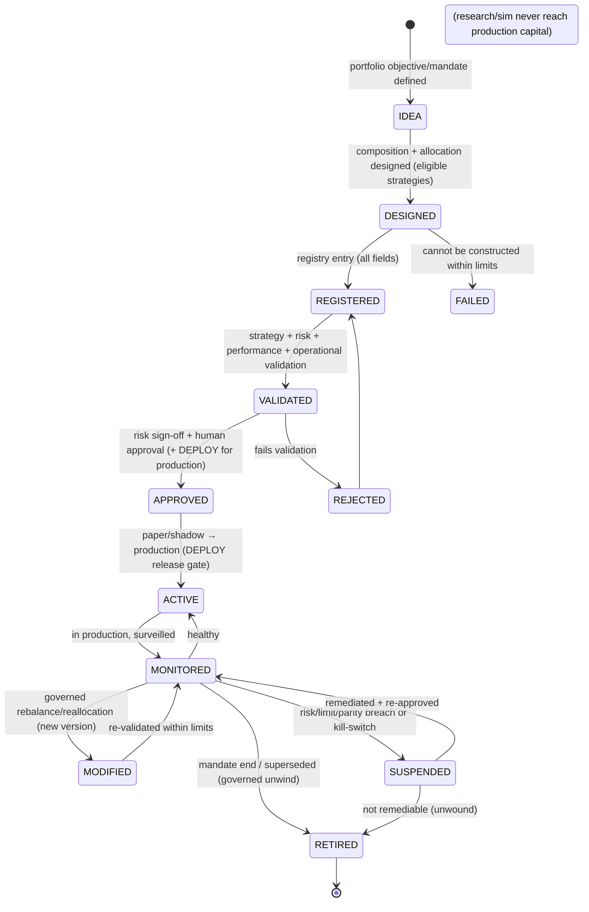
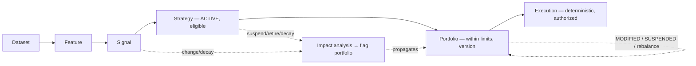

# Portfolio Registry

| Field             | Value                                                                                                              |
| ----------------- | ------------------------------------------------------------------------------------------------------------------ |
| **Document ID**   | PORTFOLIO-REGISTRY                                                                                                 |
| **Type**          | Operational portfolio registry/governance (inventory over the PORT construction lifecycle, PORT-10/11)             |
| **Clause prefix** | `PFR`                                                                                                              |
| **Owner**         | Head of Portfolio & Risk (**HPR**)                                                                                 |
| **Co-signers**    | Head of Quantitative Research (**HQ**), Governance & Risk Committee (**GRC**), Architecture Review Board (**ARB**) |
| **Governed by**   | `CLAUDE.md`; Architecture V2 (§5.7, §5.9); RB-12 · PORT; RB-13 · RISK                                              |
| **Version**       | 1.0.0                                                                                                              |
| **Status**        | PROPOSED (binding upon ARB ratification)                                                                           |
| **Last Ratified** | — (pending)                                                                                                        |

> **Position & authority.** This framework is the **operational registry and governance system for quantitative portfolios** — the inventory/record layer over the portfolio construction lifecycle owned by RB-12 · PORT (PORT-10/11). A **portfolio** is a capital-weighted allocation across **APPROVED strategies**, constructed within the limits set by RB-13 · RISK; it sits **between strategies and execution**. This framework **applies** the construction rules of RB-12 · PORT and the risk rules of RB-13 · RISK.

> **The portfolio never acts.** A portfolio produces **target positions** consumed by deterministic execution. **A portfolio never executes trades and never bypasses risk controls. Deterministic execution and risk systems retain final authority; humans remain accountable; capital preservation is the first objective** (PS-1, RS-1/4, AI-1, DE-1).

> **Reading note.** Technology-independent. Not a portfolio-construction tutorial, execution document, or risk-implementation guide. No implementation, broker/exchange rules, or vendor solutions. Each major section carries **Purpose · Responsibilities · Boundaries · Acceptance · Failure · Cross-refs**, with embedded RFC 2119 rules (`PFR-n`). **Every research or production portfolio MUST be registered before usage.**

---

## 1. Purpose

To provide institutional control over quantitative portfolios — how each is created, registered, validated, approved, monitored, modified, and retired — answering, per portfolio: **what portfolios exist, which strategies compose them, how allocations are determined, what risks they carry, who approved them, and whether they are active.** The portfolio registry is the deterministic control that keeps capital deployment evidence-backed, risk-bounded, reproducible, and incapable of acting outside governance.

Its governing intent is `CLAUDE.md` PS-1..4, RS-1..4, RG-3, DEP-1..4, AI-1, DE-1, HO-1: a portfolio is built only from eligible strategies, within the risk budget, by deterministic construction; it reaches capital only through human approval and risk sign-off; and it only proposes positions — deterministic execution acts within governance while risk oversight can halt it.

## 2. Scope & Boundaries

- **Purpose.** Define portfolio governance philosophy, classification, the registry entry standard, portfolio lifecycle, validation governance (applied), AI portfolio governance, quality metrics, lineage, and audit.
- **Responsibilities.** Register portfolios; track composition/allocation/validation/approval/status; classify; version; link portfolios to strategies (and their lineage); govern usage; preserve failures; monitor, modify, and retire portfolios.
- **Boundaries (references only, never restated):**
  - **Portfolio construction, optimization, sizing, allocation, constraints, rebalancing, attribution, capacity, portfolio _lifecycle_** → **RB-12 · PORT** (PORT-10/11 et al.).
  - **Risk appetite, limits, risk budget, sign-off, kill-switches, exposure/concentration _limits_, drawdown governance** → **RB-13 · RISK**.
  - **Strategy eligibility & records** → **Strategy Registry (STR)**; upstream lineage → **SIG/FRG/DSG**; experiments → **EXG**.
  - **Execution _authority_, order handling, TCA** → **RB-14 · EXEC**; **release/rollback** → **RB-30 · DEPLOY**; **scientific gate/token** → **RB-04 · VAL** (`P2-09`).
  - **Statistical validity** → **RB-01 · STAT**; **backtest evidence** → **RB-11 · BT**; **manifests** → **RB-05 · REPRO**; **AI role boundaries** → **RB-15 · AIGOV**, Agent Contracts.
- **Acceptance.** Every research/production portfolio has a conforming, validated, versioned, lineage-linked registry entry and never acts. **Failure.** A portfolio used without a governed entry, an unapproved portfolio bearing capital, or a portfolio that executes/bypasses controls. **Cross-refs.** PORT-10/11, RS-4, ARCH V2 §5.7/5.9.

## 3. Constitutional & Governance Basis

Traces to: `CLAUDE.md` **PS-1..4** (portfolio), **RS-1..4** (risk/execution authority, capital preservation), **RG-3** (promotion), **DEP-1..4** (paper-first, reversible, gates), **AI-1, DE-1** (no AI decision/execution), **HO-1** (accountability), **CP-2/4/6/7**, **RL-2** (retirement); RB-12 · PORT, RB-13 · RISK; PATCH **P2-09** (scientific gate/token), **P3-08** (Alpha Factory feeds), **P3-11** (capacity/crowding), **P1-10** (feedback), **P3-15** (parity), **P5-05** (tiered autonomy), **P1-02** (manifests), **P3-05** (failed corpus); Architecture V2 §5.7/5.9; REVIEW C5 (independence), M4 (capacity).

---

## Clause Format

**Pivotal clauses** carry the full block: _Purpose · Rationale · Acceptance · Failure · Refs_. **Supporting clauses** carry RFC 2119 force plus a one-line rationale. Every clause has a stable ID (`PFR-n`, continuous).

---

# PART A — PORTFOLIO GOVERNANCE PHILOSOPHY

- **PFR-1 · Capital Preservation (MUST).** Capital preservation MUST take precedence over expected return in every portfolio decision; no return objective justifies breaching a risk control. _Rationale:_ RS-1, RISK-1; ruin is irreversible. _Acceptance:_ portfolios operate within risk appetite/budget at all times. _Failure:_ a portfolio breaching appetite for return. _Refs:_ PFR-20.
- **PFR-2 · Risk-Controlled Growth (MUST).** Portfolios MUST pursue return only within the risk budget and limits set by RB-13 · RISK; allocation MUST be risk-controlled, correlation-aware, and capacity-aware. _Rationale:_ RS-2, PS-2. _Refs:_ PFR-24.
- **PFR-3 · Transparency (MUST).** A portfolio's composition, allocation logic, constraints, and risk profile MUST be documented and auditable; opaque portfolios are PROHIBITED. _Rationale:_ EXP-2, CP-7. _Refs:_ PFR-60.
- **PFR-4 · Reproducibility (MUST).** Every portfolio (and rebalance) MUST be reproducible from its definition + manifest + pinned strategy/constituent versions; an irreproducible portfolio is void. _Rationale:_ PS-4, CP-4. _Refs:_ PFR-40.
- **PFR-5 · Human Accountability (MUST).** A named human owns and is accountable for every portfolio; promotion to production requires human approval and independent risk sign-off (HO-1, RS-2). _Rationale:_ accountability is non-delegable. _Refs:_ PFR-44.
- **PFR-6 · Controlled Evolution (MUST).** Portfolios MUST evolve only through governed rebalancing/versioning; silent changes to a live portfolio's composition or constraints are PROHIBITED. _Rationale:_ CP-2, DEPR-1. _Refs:_ PFR-35.

---

# PART B — PORTFOLIO CLASSIFICATION

- **PFR-7 (MUST).** Every portfolio MUST be classified into a primary category below; classification drives validation depth, approval authority, and whether it may bear capital. _Rationale:_ classification aligns governance with portfolio purpose. _Refs:_ PFR-53.

| Category                       | Nature                | Capital?   | Key governance                                                 |
| ------------------------------ | --------------------- | ---------- | -------------------------------------------------------------- |
| **Research Portfolios**        | experimental research | no         | registration + reproducibility                                 |
| **Simulation Portfolios**      | paper-trading         | no (paper) | reality-gap/parity monitoring                                  |
| **Production Portfolios**      | approved live         | **yes**    | full validation + risk sign-off + human approval + DEPLOY gate |
| **Benchmark Portfolios**       | comparison baselines  | no         | as-of, survivorship-free, cost-consistent (BKT-39)             |
| **Risk-Monitoring Portfolios** | risk analysis views   | no         | analytical only; never trades                                  |

- **PFR-8 (MUST).** Only **Production Portfolios** MAY bear capital, and only when fully validated, risk-signed, human-approved, and DEPLOY-gated (PFR-16); research/simulation/benchmark/risk-monitoring portfolios MUST NOT bear live capital. _Rationale:_ DEP, RG-3; capital is the highest-consequence state. _Failure:_ a non-Production portfolio bearing capital. _Refs:_ PFR-16.

---

# PART C — PORTFOLIO REGISTRY ENTRY STANDARD

- **PFR-9 (MUST).** Every portfolio registry entry MUST contain **all** groups/fields below before ACTIVE; an entry missing any is not registrable. Fields referencing owned artifacts (strategies, constraints, manifests) MUST link to the authoritative source. _Rationale:_ PS-4, CP-7; a complete, uniform, discoverable record answering the six questions. _Acceptance:_ all fields present, discoverable, linked. _Failure:_ an incomplete or undiscoverable entry. _Refs:_ PFR-52.

**Portfolio Registry Entry Standard:**

| Group                       | Fields                                                                                                          | Answers                          |
| --------------------------- | --------------------------------------------------------------------------------------------------------------- | -------------------------------- |
| **Identity**                | Portfolio ID · Name · Description · Owner · Classification · Status                                             | what/who/status                  |
| **Objective**               | Investment objective · Target universe · Intended usage                                                         | why/where                        |
| **Composition**             | **Strategy dependencies (versions, ACTIVE)** · Allocation rules · Weighting methodology · Constraint references | which strategies / how allocated |
| **Risk Information**        | Risk profile · Exposure limits · Drawdown limits · Risk constraints                                             | what risks (per RISK)            |
| **Validation Evidence**     | Strategy refs · Backtest refs · Stress-test results · Approval records                                          | what evidence                    |
| **Operational Information** | Monitoring requirements · Review frequency · Known limitations                                                  | operating envelope               |
| **Versioning**              | Portfolio version · Change history                                                                              | reproducibility                  |

- **PFR-10 (MUST).** **Composition → Strategy dependencies** MUST reference **ACTIVE, capital-eligible strategies** (Strategy Registry, bearing a valid capital-eligibility token, `P2-09`) by **version**; a portfolio containing any non-ACTIVE/ineligible/unversioned strategy MUST NOT be accepted (PORT-17). _Rationale:_ PS-1, RG-1; a portfolio is only as sound as its eligible constituents. _Acceptance:_ every constituent ACTIVE + eligible + versioned. _Failure:_ an ineligible/expired-token constituent. _Refs:_ PFR-40.
- **PFR-11 (MUST).** **Allocation rules / Weighting methodology / Constraint references** MUST reference the deterministic construction governed by RB-12 · PORT (net-of-cost, correlation/capacity-aware, within RISK limits); the portfolio entry MUST NOT define its own construction logic (PORT owns it). _Rationale:_ PS-2/3; single source of truth for construction. _Refs:_ PFR-24.
- **PFR-12 (MUST).** **Risk Information** MUST reference the limits and risk budget set by RB-13 · RISK and carry an independent risk view before APPROVED; the portfolio MUST NOT define its own limits. _Rationale:_ RS; RISK sets limits, the portfolio respects them. _Refs:_ PFR-20.
- **PFR-13 (MUST).** The portfolio entry (and each rebalance/version) MUST be **immutable**; a change to composition, allocation, or constraints creates a new version linked to the prior (PORT-14). _Rationale:_ PS-4, CP-2/4; mutable portfolios destroy reproducibility. _Refs:_ PFR-52.

---

# PART D — PORTFOLIO LIFECYCLE

- **PFR-14 (MUST).** Every portfolio MUST follow the lifecycle below; stages MUST NOT be skipped, transitions are gated/recorded, and it MUST stay consistent with the PORT construction lifecycle (PORT-10). Terminal-negative states preserve the record (failed corpus, `P3-05`). Production portfolios carry **MONITORED**; governed rebalances/reallocations are **MODIFIED** (new version); risk incidents move a portfolio to **SUSPENDED**. _Rationale:_ RL-1/2, DEP; a governed, monitored, reversible lifecycle. _Refs:_ PFR-15.

**Allowed / forbidden transitions & approvals:**

| Transition             | Precondition                                                                                        | Approver            |
| ---------------------- | --------------------------------------------------------------------------------------------------- | ------------------- |
| REGISTERED → VALIDATED | eligible strategies + within limits + performance/operational checks                                | deterministic gates |
| VALIDATED → APPROVED   | independent risk sign-off + human approval (+ scientific token constituents)                        | HPR + GRC + human   |
| APPROVED → ACTIVE      | paper/shadow reality-gap clean + DEPLOY release gate                                                | HSRE + GRC          |
| MONITORED → MODIFIED   | governed rebalance policy trigger; new version                                                      | HPR                 |
| MONITORED → SUSPENDED  | risk/limit/parity breach or kill-switch                                                             | automatic / RISK    |
| MONITORED → RETIRED    | mandate end/superseded; governed unwind                                                             | HPR + GRC           |
| **Forbidden**          | DESIGNED/REGISTERED → ACTIVE (skip validation); any → ACTIVE without risk sign-off + human approval | — (PROHIBITED)      |

- **PFR-15 (MUST).** **No portfolio MAY bear capital (ACTIVE Production) without: eligible constituents, construction within RISK limits/budget, validation (strategy/risk/performance/operational), independent risk sign-off, human approval, paper/shadow reality-gap clearance, and the DEPLOY release gate**; skipping any is PROHIBITED (fail-closed). _Rationale:_ RG-3, DEP-4, PS-1; the capital gate is the highest-consequence transition (REVIEW C5). _Acceptance:_ only fully-gated, risk-signed, human-approved portfolios bear capital. _Failure:_ a production portfolio that skipped a gate. _Refs:_ PFR-46.
- **PFR-16 (MUST).** A portfolio MUST be REGISTERED before any experiment/capital uses it (fail-closed); use of an unregistered portfolio is PROHIBITED. _Rationale:_ register-before-use anchor. _Refs:_ PFR-40.
- **PFR-17 (MUST).** Every portfolio MUST have a single accountable human **owner** (portfolio manager); for agent-constructed portfolios a human owner remains accountable (HO-1). _Rationale:_ accountability. _Refs:_ PFR-44.
- **PFR-18 (MUST).** A production portfolio MUST be instantly SUSPENDABLE (risk/limit/parity breach, kill-switch) and reversibly unwindable; reactivation requires remediation + re-approval (RS-3, DEP-3). _Rationale:_ capital safety; a portfolio that cannot be unwound MUST NOT be deployed. _Refs:_ PFR-46.

---

# PART E — PORTFOLIO VALIDATION GOVERNANCE (applied)

> **Boundary note.** Validation _standards/methods_ are owned by RB-12 · PORT, RB-13 · RISK, RB-11 · BT, RB-01 · STAT, RB-30 · DEPLOY. This framework requires each portfolio to **pass and record** them; validation is by deterministic engines, never the author or an AI (DE-1).

- **PFR-19 · Strategy Validation (MUST).** A portfolio MUST contain **only APPROVED, capital-eligible strategies** (Strategy Registry, `P2-09` tokens); any ineligible/expired constituent blocks validation (PORT-17). _Rationale:_ PS-1, RG-1. _Acceptance:_ 100% constituents eligible. _Failure:_ an ineligible constituent. _Refs:_ PFR-10.
- **PFR-20 · Risk Validation (MUST).** A portfolio MUST pass **exposure validation, concentration checks, and constraint verification** against RB-13 · RISK limits and the risk budget (correlation/capacity-aware); independent risk sign-off required for capital. _Rationale:_ RS; portfolios aggregate risk. _Acceptance:_ within all limits + budget; risk sign-off obtained. _Failure:_ any limit/budget breach or missing sign-off. _Refs:_ PFR-12.
- **PFR-21 · Performance Validation (MUST).** A portfolio MUST pass **historical analysis and robustness evaluation** (net-of-cost, deflated, regime-conditioned) via RB-11 · BT / RB-01 · STAT. _Rationale:_ PS-2, BT. _Refs:_ PFR-33.
- **PFR-22 · Operational Validation (MUST).** Before ACTIVE, a portfolio MUST have **monitoring readiness and reporting capability** (health/drift/reality-gap/parity per `P3-15`) and pass the DEPLOY operational gate. _Rationale:_ DEP-1; production requires operability. _Refs:_ PFR-22-monitoring.

- **PFR-23 (MUST).** Portfolio validation and construction MUST be performed by deterministic engines; the author or an LLM MUST NOT adjudicate a portfolio's validity or decide its allocation (AI-1, DE-1, PS-3, CP-5). _Rationale:_ separation of construction and adjudication; allocation is deterministic. _Refs:_ PFR-27.

---

# PART F — AI PORTFOLIO GOVERNANCE

## AI — MUST

- **PFR-24 (MUST).** AI systems MUST propose portfolios through approved workflows, reference registered strategies, provide evidence, and report uncertainty. _Rationale:_ WFC-20, AIGOV-27/31; AI proposes within governance. _Acceptance:_ AI-proposed portfolios are workflow-bound, strategy-linked, evidenced. _Failure:_ an AI portfolio outside a workflow. _Refs:_ PFR-16.

## AI — MUST NOT

- **PFR-25 (MUST NOT).** AI systems MUST NOT approve portfolios. _Rationale:_ AI-3; approval is human. _Refs:_ PFR-15.
- **PFR-26 (MUST NOT).** AI systems MUST NOT allocate capital independently. _Rationale:_ AI-1, PS-3, DE-1; allocation is deterministic/human-gated. _Refs:_ PFR-23.
- **PFR-27 (MUST NOT).** AI systems MUST NOT modify risk constraints or bypass governance. _Rationale:_ RISK-4, AGC-11; constraints belong to RISK/governance. _Refs:_ PFR-12.

- **PFR-28 (MUST).** **Humans retain final accountability; deterministic systems retain execution authority.** AI proposes and narrates portfolios; the deterministic optimizer constructs within limits; humans approve and are accountable; deterministic execution acts within governance. _Rationale:_ HO-1, DE-1, RS-4, PS-3. _Acceptance:_ no AI approval/allocation/execution. _Failure:_ an AI-approved or AI-allocated portfolio. _Refs:_ PFR-46.

---

# PART G — PORTFOLIO QUALITY METRICS

- **PFR-29 (MUST).** Every portfolio metric MUST define **purpose, measurement method, acceptance criteria, and failure conditions**; statistical/risk _methods_ are owned by RB-01 · STAT / RB-13 · RISK / RB-11 · BT; this framework records and gates on them. _Rationale:_ CP-1. _Refs:_ per-family.

**Portfolio quality-metric families (methods per STAT/RISK/BT; thresholds governed):**

| Family              | Example metrics                                                 | Acceptance                 | Failure                         |
| ------------------- | --------------------------------------------------------------- | -------------------------- | ------------------------------- |
| **Return**          | net-of-cost return · attribution                                | net-positive, attributable | gross / unexplained residual    |
| **Risk**            | VaR/ES · exposure utilization · leverage                        | within appetite/limits     | breaches appetite/limits        |
| **Drawdown**        | max/duration/recovery vs limits                                 | within soft/hard limits    | breaches drawdown limit         |
| **Diversification** | constituent correlation · concentration                         | diversified within limits  | over-concentrated               |
| **Stability**       | allocation/exposure drift · turnover                            | within tolerance/budget    | drift/turnover beyond budget    |
| **Operational**     | monitoring coverage · reality-gap/parity · reporting timeliness | monitored + parity clean   | monitoring gaps / parity breach |

- **PFR-30 (MUST).** Return and risk metrics MUST be **deflated and net-of-cost** and **correlation-adjusted** at the portfolio level (STAT-3/21, RISK-16); assuming constituent independence is PROHIBITED. _Rationale:_ SI-3, RS-2; correlations converge in crises. _Refs:_ RISK-16.
- **PFR-31 (MUST).** Drawdown and risk metrics MUST be monitored continuously against soft/hard limits (RB-13 · RISK); a hard breach triggers SUSPENDED/kill-switch (RISK-33). _Rationale:_ capital preservation; drawdowns end mandates. _Refs:_ PFR-18.

---

# PART H — PORTFOLIO LINEAGE

- **PFR-32 (MUST).** Every portfolio MUST record its full lineage chain below; the chain MUST be resolvable and support **dependency tracking, impact analysis, and change propagation** (a change/decay/suspension at any upstream level flags the portfolio) (DP-2; graph per `P3-14`). _Rationale:_ CP-6; the linked graph is the invalidation/impact backbone — critical for portfolios holding many strategies. _Acceptance:_ chain resolvable dataset→execution; upstream changes propagate. _Failure:_ an orphaned portfolio or unpropagated upstream change. _Refs:_ PFR-58.

- **PFR-33 (MUST).** **Change propagation rules:** the suspension, retirement, decay, or version-change of a constituent strategy (or its upstream signal/feature/dataset) MUST trigger impact analysis on containing portfolios; a materially affected ACTIVE portfolio MUST be rebalanced (MODIFIED), re-validated, SUSPENDED, or unwound (coordinated with RB-13 · RISK / RB-30 · DEPLOY). _Rationale:_ DP-2, RS; a decayed/suspended strategy in a live book bleeds capital. _Acceptance:_ constituent changes propagate to portfolio action. _Failure:_ a suspended strategy left live in a portfolio. _Refs:_ STR-36.
- **PFR-34 (MUST).** Portfolios MUST link bidirectionally to their constituent strategies (and their full lineage), the experiments/backtests validating them, the execution they inform, and any ADR their adoption informs. _Rationale:_ CP-6; navigable research/capital graph. _Refs:_ PFR-52.

---

# PART I — PORTFOLIO GOVERNANCE RULES

## Portfolios — MUST

- **PFR-35 (MUST).** Portfolios MUST have registered ownership, documented composition/allocation, validation evidence, maintained versions, and defined risk limits/constraints. _Rationale:_ the minimums for a governable portfolio. _Acceptance:_ all present. _Failure:_ any missing. _Refs:_ PFR-9.

## Portfolios — MUST NOT

- **PFR-36 (MUST NOT).** Portfolios MUST NOT contain ineligible strategies. _Rationale:_ PS-1, RG-1. _Refs:_ PFR-10.
- **PFR-37 (MUST NOT).** Portfolios MUST NOT bypass risk controls or exceed limits/budget. _Rationale:_ RS; risk controls are non-bypassable. _Refs:_ PFR-20.
- **PFR-38 (MUST NOT).** Portfolios MUST NOT directly execute trades. _Rationale:_ RS-4, AI-1; execution is deterministic and authorized. _Refs:_ PFR-8.
- **PFR-39 (MUST NOT).** Portfolios MUST NOT operate/bear capital without approval (non-Production/non-ACTIVE portfolios are inert). _Rationale:_ PFR-15. _Refs:_ PFR-15.

- **PFR-40 (MUST).** **Deterministic risk and execution systems retain final authority** over any action a portfolio proposes; a portfolio's target positions are consumed by execution, which applies its gates (authorization token, risk checks) before any trade, and risk oversight can halt the portfolio at any time. _Rationale:_ RS-4, PS-1, DE-1; the portfolio proposes, deterministic engines act within governance, risk can stop it. _Acceptance:_ every portfolio-informed trade passes execution/risk gates. _Failure:_ a portfolio trade without deterministic gates. _Refs:_ PFR-8, PFR-46.

---

# PART J — AUDIT REQUIREMENTS

- **PFR-41 (MUST).** Every portfolio MUST maintain immutably: **creation history, ownership history, allocation history, strategy history, validation history, approval history, and retirement history** — each event with actor, timestamp, and rationale. _Rationale:_ CP-7; the portfolio record is core to capital audit. _Acceptance:_ an auditor reconstructs a portfolio's full composition, allocation, validation, approval, and performance timeline without the author. _Failure:_ a missing/mutable history record. _Refs:_ PFR-46.
- **PFR-42 (MUST).** Portfolio records MUST be tamper-evident (RB-27 · SEC) and the registry reconcilable against portfolios actually bearing capital; any capital borne by a non-ACTIVE/unregistered/unapproved portfolio MUST be flagged and halted for review. _Rationale:_ CP-7, PFR-16; drift between registry and capital is a critical integrity failure. _Refs:_ PFR-16.

---

## Responsibility Matrix (RACI)

| Portfolio activity                 | AI agent                    | Deterministic gates/engines     | Human owner (PM) | Governance (HPR/GRC) |
| ---------------------------------- | --------------------------- | ------------------------------- | ---------------- | -------------------- |
| Propose/design portfolio           | R (propose)                 | —                               | **A**            | I                    |
| Register + link strategies         | R (submit)                  | R (validate fields)             | **A**            | I                    |
| Construct/optimize (within limits) | ✗ (forbidden allocate)      | **R** (deterministic optimizer) | A                | A                    |
| Validate (strategy/risk/perf/ops)  | ✗ (forbidden self-validate) | **R**                           | C                | A                    |
| Risk sign-off                      | narrate                     | R (checks)                      | C                | **A (HPR)**          |
| Approve production                 | ✗                           | R (gate)                        | C                | **A (human)**        |
| Deploy (paper→live)                | ✗                           | **R** (DEPLOY/EXEC)             | A                | A                    |
| Execute (target positions)         | —                           | **R** (EXEC applies gates)      | A                | A                    |
| Monitor / detect drift-decay       | narrate                     | **R**                           | A                | I                    |
| Rebalance (MODIFIED)               | propose                     | **R** (deterministic)           | R                | A                    |
| Suspend (risk breach)              | —                           | **R** (auto/RISK)               | R                | **A**                |
| Retire (unwind)                    | propose                     | R (checks)                      | R                | **A**                |
| Edit accepted portfolio            | ✗                           | R (deny)                        | ✗                | ✗ (new version only) |

---

## Acceptance Criteria (portfolio → ACTIVE Production)

A portfolio is **production-ready (ACTIVE)** only when **all** hold:

**Portfolio acceptance checklist:**

- [ ] Registered before use; single owner; classified as Production; target universe as-of + survivorship-safe (PFR-16, PFR-8).
- [ ] All constituents ACTIVE, capital-eligible (valid tokens), versioned (PFR-10, PFR-19).
- [ ] Constructed by deterministic optimizer, net-of-cost, within all RISK limits + risk budget (correlation/capacity-aware) (PFR-11, PFR-20).
- [ ] Exposure/concentration/constraint verification pass; independent risk sign-off (PFR-20).
- [ ] Performance validation (deflated, net-of-cost, robust) (PFR-21, PFR-30).
- [ ] Drawdown/diversification/stability within limits (PFR-31).
- [ ] Monitoring + reality-gap/parity readiness; DEPLOY operational gate (PFR-22).
- [ ] Paper/shadow reality-gap clean; human approval; DEPLOY release gate (PFR-15).
- [ ] Validated/constructed by deterministic engines (not author/AI) (PFR-23).
- [ ] Linked (strategies + full lineage + experiments + execution); reproducible from manifest; immutably versioned (PFR-34, PFR-4, PFR-13).
- [ ] Reversibly unwindable; instantly suspendable (PFR-18).
- [ ] Never executes/bypasses risk controls (PFR-37, PFR-38, PFR-40).

## Rejection / Suspension Criteria

A portfolio MUST be **rejected, failed, or suspended** if **any** hold:

- **PFR-43.** Reached (or attempted) production skipping validation/approval/risk sign-off/DEPLOY gate (PFR-15).
- **PFR-44.** Contains ineligible/expired-token/non-ACTIVE/unversioned strategies (PFR-10, PFR-19).
- **PFR-45.** Breaches any RISK limit, risk budget, or correlation-adjusted budget (PFR-20, PFR-30).
- **PFR-46.** Executes trades, bypasses risk controls, or acts without deterministic gates (PFR-37, PFR-38, PFR-40).
- **PFR-47.** Gross/undeflated performance evidence, or over-concentration (PFR-30, PFR-31).
- **PFR-48.** Self-validated/self-allocated by author/AI, or AI-approved (PFR-23, PFR-25, PFR-26).
- **PFR-49.** Irreproducible, or record edited instead of versioned (PFR-4, PFR-13).
- **PFR-50.** Not reversibly unwindable, or no monitoring (PFR-18, PFR-22).
- **PFR-51.** Constituent strategy suspended/retired/decayed and impact not propagated (PFR-33) → SUSPENDED/rebalance.

---

## Anti-Patterns & Forbidden Practices

**Anti-patterns:**

- **PFR-AP-1.** Portfolio holding a suspended/retired/ineligible strategy (PFR-10, PFR-33).
- **PFR-AP-2.** Shadow portfolios — bearing capital but not registered/approved (PFR-16).
- **PFR-AP-3.** Assuming constituent independence; naive capacity summation (PFR-30).
- **PFR-AP-4.** Gross/undeflated portfolio metrics as evidence (PFR-30).
- **PFR-AP-5.** LLM allocating capital or approving a portfolio (PFR-26, PFR-25).
- **PFR-AP-6.** Skipping paper/shadow; production on backtest alone (PFR-15).
- **PFR-AP-7.** Ignoring constituent changes (no impact analysis) (PFR-33).

**Forbidden practices (non-waivable):**

- **PFR-F-1.** A portfolio executing trades, bypassing risk controls, or acting without deterministic gates (PFR-37, PFR-38, PFR-40; RS-4, PS-1).
- **PFR-F-2.** Bearing capital without full validation + risk sign-off + human approval + DEPLOY gate (PFR-15).
- **PFR-F-3.** Using an unregistered/unapproved portfolio to bear capital (PFR-16, PFR-39).
- **PFR-F-4.** Containing ineligible/non-ACTIVE strategies (PFR-10).
- **PFR-F-5.** Breaching RISK limits/budget, or assuming constituent independence (PFR-20, PFR-30).
- **PFR-F-6.** AI approving, allocating capital, modifying risk constraints, or bypassing governance (PFR-25, PFR-26, PFR-27).
- **PFR-F-7.** Author or AI adjudicating/allocating a portfolio (PFR-23; DE-1).
- **PFR-F-8.** Editing an accepted portfolio record instead of versioning (PFR-13).
- **PFR-F-9.** Leaving a suspended/retired constituent strategy live in a portfolio (PFR-33).

---

## Enforcement & Verification

| Clause group                                                 | Enforcement mechanism                                     | Owner                                              |
| ------------------------------------------------------------ | --------------------------------------------------------- | -------------------------------------------------- |
| Register/approve-before-capital + gates (PFR-15,16)          | Registry + workflow + DEPLOY gates (fail-closed)          | this framework, Workflow Contracts, RB-30 · DEPLOY |
| Eligible constituents (PFR-10,19)                            | Registry gate: constituents ACTIVE + token + versioned    | Strategy Registry, RB-04 · VAL (`P2-09`)           |
| Within limits/budget (PFR-11,20,30)                          | Deterministic construction constraints; risk gates        | RB-12 · PORT, RB-13 · RISK                         |
| Portfolio-never-acts + deterministic authority (PFR-8,37–40) | EXEC/RISK apply their gates; portfolio inert without them | RB-14 · EXEC, RB-13 · RISK                         |
| Deterministic construction/validation (PFR-23)               | Deterministic optimizer + gates; no LLM allocation        | RB-12 · PORT (`P1-03`)                             |
| Monitoring/reality-gap/decay (PFR-22,31,33)                  | Production monitors; parity; impact analysis              | RB-28 · OBS, RB-11 · BT (`P3-15`), RB-13 · RISK    |
| Change propagation (PFR-33)                                  | Lineage-driven impact analysis + rebalance/suspend        | this framework (`P3-14`)                           |
| Versioning/reproducibility (PFR-13,4)                        | Immutable version store + manifests                       | RB-05 · REPRO                                      |
| Audit history (PFR-41,42)                                    | Immutable history + tamper-evident audit; reconciliation  | RB-27 · SEC                                        |
| Forbidden practices (PFR-F-\*)                               | Fail-closed; integrity/risk report                        | GRC                                                |

- **PFR-E-1 (MUST).** Every clause enforcing a Forbidden Practice (PFR-F-*) — especially portfolio-never-acts and the capital gate — MUST be deterministically gated and fail-closed. *Rationale:* CP-1, DE-1, RS-4. *Refs:\* PFR-40.

## Exceptions & Waivers

- **PFR-W-1 (MUST).** No exception MAY be granted to: portfolio-never-acts / deterministic authority (PFR-8/37–40), the capital gate (validation + risk sign-off + human approval + DEPLOY, PFR-15), eligible constituents (PFR-10), within-limits/budget (PFR-20/30), deterministic construction (PFR-23), reversibility/suspendability (PFR-18), failure preservation (PFR-14), immutability (PFR-13), or any `CLAUDE.md` entrenched clause (AM-2). Non-waivable.
- **PFR-W-2 (MAY).** GRC/HPR-governed parameters (drawdown/diversification/turnover tolerances, review cadence, capacity buffers) MAY be changed only by GRC + HPR, recorded (as an ADR), applied prospectively.
- **PFR-W-3 (MUST).** Any temporary waiver MUST be recorded on the portfolio's registry entry and history and surfaced in risk reporting. _Rationale:_ no hidden exceptions.

## Ratification Criteria

Ratifiable only when: every clause has a stable ID, RFC 2119 phrasing, and an enforcement mechanism; no clause contradicts `CLAUDE.md`, Architecture V2, RB-12 · PORT, RB-13 · RISK, or peer frameworks; portfolio-never-acts, deterministic execution authority, the capital gate, eligible constituents, within-limits construction, deterministic allocation, reversibility, failure preservation, and immutability are preserved; all cross-references resolve; ARB approval with HPR + HQ + GRC co-sign obtained.

## Success Metrics

- **SM-1.** 0 portfolios that execute/bypass risk controls; 100% portfolio-informed trades gated by EXEC/RISK (PFR-37..40).
- **SM-2.** 0 production capital without full validation + risk sign-off + human approval + DEPLOY gate (PFR-15).
- **SM-3.** 100% portfolios registered before use; 0 shadow portfolios bearing capital (PFR-16).
- **SM-4.** 100% constituents ACTIVE + capital-eligible; 0 ineligible constituents (PFR-10).
- **SM-5.** Aggregate portfolio risk within budget (correlation-adjusted) at all times; 0 limit breaches without suspend (PFR-30, PFR-31).
- **SM-6.** 0 AI approvals/allocations; 0 author/AI self-validations (PFR-25, PFR-26, PFR-23).
- **SM-7.** 100% constituent changes propagated to portfolio action; 100% portfolios reproducible + reconciled to capital (PFR-33, PFR-4, PFR-42).

## Dependencies & Related Documents

- **Governed by:** `CLAUDE.md`; Architecture V2 (§5.7, §5.9); RB-12 · PORT; RB-13 · RISK.
- **Depends on / references:** Strategy Registry (constituents), Signal/Feature Registries & Dataset Governance (upstream lineage), Experiment Tracking (evidence), RB-11 · BT (backtest), RB-01 · STAT (statistics), RB-04 · VAL (scientific gate/token), RB-30 · DEPLOY (release/rollback), RB-14 · EXEC (execution authority), RB-05 · REPRO (manifests), RB-28 · OBS (monitoring), RB-27 · SEC (audit), RB-15 · AIGOV & Agent Contracts (AI).
- **Architecture references:** ARCH §2.8, §2.9, §2.10; Architecture V2 §5.7/5.9; PATCH `P2-09`, `P3-08/11/15`, `P1-10`, `P5-05`, `P1-02`, `P3-05`; REVIEW C5, M4.

## Change Log & Version History

| Version | Date    | Author (role) | Change                      |
| ------- | ------- | ------------- | --------------------------- |
| 1.0.0   | pending | HPR           | Initial Portfolio Registry. |

---

## Glossary (portfolio-registry-specific)

Terms in `CLAUDE.md`, rulebook, and prior-framework glossaries (portfolio, strategy, sleeve, risk budget, capacity, capital-eligibility token, kill-switch, staged chain) are not redefined.

- **Portfolio (registry sense)** — A registered, versioned, capital-weighted allocation across ACTIVE, capital-eligible strategies, constructed within RISK limits; it produces target positions but never acts (PFR-9).
- **Portfolio Registry Entry** — The authoritative governance record of a portfolio's identity, objective, composition, risk, validation, operations, and versioning (PFR-9).
- **Target Positions** — A portfolio's proposed holdings, consumed by deterministic execution (which applies its gates) — not orders (PFR-40).
- **ACTIVE (Production)** — The only portfolio state that may bear capital, reached after full validation + risk sign-off + human approval + DEPLOY gate (PFR-15).
- **MODIFIED / MONITORED / SUSPENDED** — Production sub-states: governed rebalance (new version), continuous surveillance, and halted-pending-remediation (PFR-14, PFR-18).
- **Change Propagation** — The rule that a constituent strategy's (or upstream artifact's) change/decay/suspension triggers impact analysis and portfolio action (PFR-33).
- **Portfolio Lineage** — Dataset → Feature → Signal → Strategy → Portfolio → Execution, resolvable and impact-enabling (PFR-32).

---

_End of Portfolio Registry. It is the operational registry and governance system for quantitative portfolios, the inventory over the PORT construction lifecycle: every portfolio is registered before use and built by a deterministic optimizer from ACTIVE, capital-eligible strategies, within the limits and risk budget set by RISK — validated (strategy + risk + performance + operational), independently risk-signed, human-approved, paper/shadow-proven, and DEPLOY-gated before it may bear any capital. A portfolio produces target positions — it never executes trades or bypasses risk controls; deterministic execution and risk systems retain final authority, risk oversight can halt it, and humans remain accountable, with capital preservation first. AI proposes portfolios through workflows and provides evidence; it never approves, allocates capital, modifies risk constraints, or bypasses governance. Constituent changes propagate to portfolio action; portfolios are reversibly unwindable and instantly suspendable; failed portfolios are preserved; the record is immutable. Binding upon ARB ratification._
