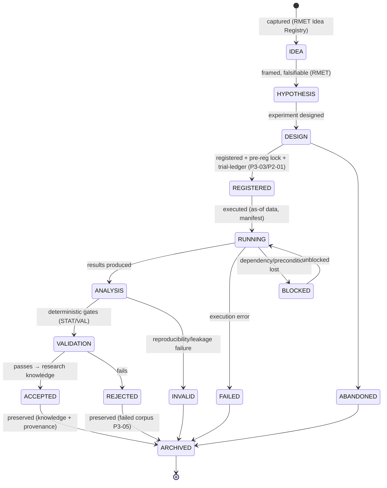
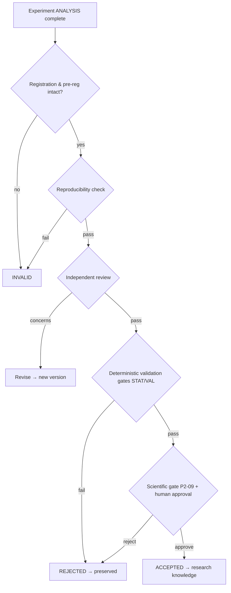

# Experiment Tracking Governance

| Field             | Value                                                                                                              |
| ----------------- | ------------------------------------------------------------------------------------------------------------------ |
| **Document ID**   | EXPERIMENT-TRACKING                                                                                                |
| **Type**          | Operational research-memory framework (realizes the Experiment Registry `P3-03` + Trial Ledger `P2-01`)            |
| **Clause prefix** | `EXG`                                                                                                              |
| **Owner**         | Head of Research / Chief Scientist (**HR**)                                                                        |
| **Co-signers**    | Head of Quantitative Research (**HQ**), Governance & Risk Committee (**GRC**), Architecture Review Board (**ARB**) |
| **Governed by**   | `CLAUDE.md`; Architecture V2 (§5.5); RB-02 · RMET; RB-03 · EXP (Experiment Management); RB-01 · STAT               |
| **Version**       | 1.0.0                                                                                                              |
| **Status**        | PROPOSED (binding upon ARB ratification)                                                                           |
| **Last Ratified** | — (pending)                                                                                                        |

> **Position & authority.** This framework is the **institutional memory system for quantitative research experiments** — the operational realization of the Experiment Registry (`P3-03`) and its enrollment in the immutable Trial Ledger (`P2-01`). It operationalizes the experiment-management rules of RB-02 · RMET (RMET-33..41, EX-1..4) and RB-03 · EXP; it is subordinate to and governed by them and by the Constitution.

> **Reading note.** Technology-independent. Not a data-science tutorial, notebook-management guide, or backtesting guide. No implementation, tool-specific systems, notebook examples, or vendor solutions. Each major section carries **Purpose · Responsibilities · Boundaries · Acceptance · Failure · Cross-refs**, with embedded RFC 2119 rules (`EXG-n`). **Every research experiment MUST be registered and traceable; no experiment runs unregistered.**

---

## 1. Purpose

To govern how research ideas, hypotheses, experiments, tests, and results are created, tracked, evaluated, and preserved — answering permanently, per experiment: **what was tested, why, who created it, which data was used, which methodology, what the result was, and whether it can be reproduced.** Experiment tracking is the deterministic control that makes research honest, auditable, reproducible, and cumulative — including the preservation of failures.

Its governing intent is `CLAUDE.md` EX-1..4, SM-1..5, and CP-4/7: every experiment is registered before it runs, immutable, trial-counted, reproducible, and preserved (positive or negative), so the institution never fools itself and never loses hard-won knowledge.

## 2. Scope & Boundaries

- **Purpose.** Define experiment philosophy, the unified tracking lifecycle, the registration standard, per-type governance, AI experiment governance, quality gates, metrics, knowledge management, and audit.
- **Responsibilities.** Register experiments; enroll them in the Trial Ledger; track state; enforce quality gates; preserve results (incl. failures); link experiments to ideas/hypotheses/features/factors/ADRs/agents; maintain immutable audit history.
- **Boundaries (references only, never restated):**
  - **Research process, pre-registration lock, idea/hypothesis lifecycle, discovery workflows, failed-research corpus, research journal/timeline** → **RB-02 · RMET** (`P3-01/02/04/05`).
  - **Statistical methods, Trial-Ledger _accounting_, deflation, multiple-testing** → **RB-01 · STAT** (`P2-01/02`).
  - **Backtest realism/evidence** → **RB-11 · BT**; **feature/factor lifecycle & acceptance** → **RB-10/09 · FAR**.
  - **Data certification, as-of, dataset versioning, lineage** → **RB-06/07 · DATA**, **RB-08 · PIT**.
  - **Reproducibility manifests / determinism capture** → **RB-05 · REPRO** (`P1-02`).
  - **Validation gates, holdout, replication, scientific gate** → **RB-04 · VAL** (`P2-05..09`).
  - **Agent participation** → Agent Contracts / RB-15 · AIGOV; **decision→ADR linking** → **ADR Governance**.
- **Acceptance.** Every experiment has a conforming, immutable registry record, trial-ledger enrollment, and is reproducible. **Failure.** An experiment run unregistered, or an edited/deleted result. **Cross-refs.** RMET-33..41, STAT-13/14, ARCH V2 §5.5.

## 3. Constitutional & Governance Basis

Traces to: `CLAUDE.md` **EX-1..4** (experiment discipline), **SM-1..5** (scientific method), **RL-1** (lifecycle), **SI-1** (trial counting), **DP-1..3** (provenance), **CP-2/4/6/7**, **CI-1** (productivity), and Forbidden Practices **FB-5, FB-8, FB-9**; RB-02 · RMET (RMET-33..41, RMET-61..64 failed corpus), RB-01 · STAT (STAT-13/14 registration & trial counting), RB-05 · REPRO; PATCH **P3-03** (Experiment Registry), **P2-01** (Trial Ledger), **P3-04** (Journal/Timeline), **P3-05** (Failed corpus), **P1-02** (Manifests), **P2-09** (Scientific gate); Architecture V2 §5.5; REVIEW C2 (trial counting), Missing #9 (failed corpus).

---

## Clause Format

**Pivotal clauses** carry the full block: _Purpose · Rationale · Acceptance · Failure · Refs_. **Supporting clauses** carry RFC 2119 force plus a one-line rationale. Every clause has a stable ID (`EXG-n`, continuous).

---

# PART A — EXPERIMENT PHILOSOPHY

- **EXG-1 · Scientific Reproducibility (MUST).** Every experiment MUST be reproducible from its registered record + manifest by an independent party; an irreproducible experiment is void and MUST NOT inform any decision. _Rationale:_ CP-4, EX-2; reproducibility is the precondition of trust. _Acceptance:_ re-run from record reproduces results. _Failure:_ an experiment that cannot be reproduced used as evidence. _Refs:_ EXG-40.
- **EXG-2 · Evidence-Based Research (MUST).** Conclusions MUST follow from experiment evidence, never precede it; asserting a result without a registered, reproducible experiment is PROHIBITED. _Rationale:_ SM-3. _Refs:_ EXG-46.
- **EXG-3 · Hypothesis-Driven Development (MUST).** Every experiment MUST test a pre-registered, falsifiable hypothesis (owned by RB-02 · RMET); exploratory work MUST still be registered and trial-counted. _Rationale:_ SM-2, FB-8; unregistered exploration is p-hacking. _Refs:_ EXG-12, EXG-13.
- **EXG-4 · Experiment Transparency (MUST).** Every experiment's design, data, methodology, and result MUST be open and auditable; hidden experiments and undisclosed analysis choices are PROHIBITED. _Rationale:_ CP-7, RMET-96. _Refs:_ EXG-60.
- **EXG-5 · Failed Experiment Preservation (MUST).** Failed, rejected, invalid, and abandoned experiments MUST be preserved with reasons and remain accessible; deleting or hiding failures is PROHIBITED. _Rationale:_ SM-4, Missing #9; failures are institutional evidence and are training data for meta-research. _Acceptance:_ every terminal-negative experiment has a preserved record. _Failure:_ a discarded/hidden failure. _Refs:_ EXG-58, EXG-49.
- **EXG-6 · Avoidance of Research Bias (MUST).** Tracking MUST make selection, confirmation, and survivorship bias detectable: all trials counted (incl. discarded), success criteria pre-registered, universes as-of. _Rationale:_ SI-1, STAT-91..96; bias hides in what goes unrecorded. _Refs:_ EXG-13.

---

# PART B — EXPERIMENT LIFECYCLE

- **EXG-7 (MUST).** Every experiment MUST follow the unified tracking lifecycle below; stages MUST NOT be skipped, transitions are gated/recorded, and terminal states preserve the record. Stages map to their owning systems (idea/hypothesis → RMET; validation → VAL/STAT; archive → this framework). _Rationale:_ RL-1; a governed lifecycle is auditable. _Refs:_ EXG-8.

**Lifecycle transition rules:**

| Transition            | Precondition                                                  | Approver                |
| --------------------- | ------------------------------------------------------------- | ----------------------- |
| HYPOTHESIS → DESIGN   | falsifiable hypothesis registered (RMET)                      | owner                   |
| DESIGN → REGISTERED   | pre-registration lock + trial-ledger enrollment (fail-closed) | owner + registry        |
| REGISTERED → RUNNING  | as-of data available; manifest bound; budget ok               | deterministic checks    |
| ANALYSIS → VALIDATION | results + evidence complete                                   | —                       |
| VALIDATION → ACCEPTED | passes deterministic gates + scientific gate (P2-09)          | independent (VAL/human) |
| any → INVALID         | reproducibility/leakage failure                               | deterministic           |
| any → ARCHIVED        | terminal; preserved                                           | owner + registry        |

- **EXG-8 (MUST).** **No experiment MAY transition to RUNNING without being REGISTERED** (pre-registration locked + enrolled in the Trial Ledger); execution-before-registration is PROHIBITED (fail-closed). _Rationale:_ EX-1, STAT-14, FB-5; registration-before-execution is the anti-p-hacking anchor. _Acceptance:_ run events always postdate registration. _Failure:_ an experiment executed before registration. _Refs:_ EXG-12.
- **EXG-9 (MUST).** Every experiment MUST have a single accountable **owner**; for agent-run experiments a human owner remains accountable (HO-1, RMET-36/37). _Rationale:_ accountability is singular and human. _Refs:_ EXG-44.
- **EXG-10 (MUST).** Terminal-negative states (REJECTED/FAILED/INVALID/ABANDONED) MUST be preserved in the failed-research corpus (`P3-05`) with reason codes and remain trial-counted (STAT-14). _Rationale:_ SM-4, SI-1; failures stay in the record and the multiplicity accounting. _Refs:_ EXG-5.

---

# PART C — EXPERIMENT REGISTRATION STANDARD

- **EXG-11 (MUST).** Every experiment record MUST contain **all** groups/fields below before RUNNING; a record missing any is not registrable. Fields referencing owned artifacts (datasets, features, manifests) MUST link to the authoritative source. _Rationale:_ EX-1/3; a complete, uniform, immutable record answering the seven questions. _Acceptance:_ all fields present, immutable, linked. _Failure:_ an incomplete or mutable record. _Refs:_ §Quality.

**Experiment Registration Standard:**

| Group                | Fields                                                                                           | Answers              |
| -------------------- | ------------------------------------------------------------------------------------------------ | -------------------- |
| **Identity**         | Experiment ID · Title · Owner · Date · Status                                                    | who/when/what/status |
| **Research Context** | Objective · Hypothesis (ref) · Research Question · Expected Outcome                              | why                  |
| **Data Definition**  | Data sources · **Dataset version** · Time range · Universe definition (as-of, survivorship-safe) | which data           |
| **Methodology**      | Research method · Features (refs) · Parameters · Evaluation criteria (pre-registered)            | how                  |
| **Execution**        | Environment (manifest ref) · Agent involvement (registry refs) · Workflow reference (Tier-5)     | where/by-whom        |
| **Results**          | Metrics · Findings · Limitations · Conclusion                                                    | what happened        |
| **Evidence**         | Artifacts · Reports · References (ADRs, prior experiments)                                       | proof/linkage        |

- **EXG-12 (MUST).** **Methodology → Evaluation criteria** and the hypothesis's success/failure thresholds MUST be **pre-registered and frozen** before RUNNING (pre-registration lock, RMET-24, STAT-5); post-hoc criteria changes are PROHIBITED (a new experiment version is required). _Rationale:_ SM-2, FB-8; frozen criteria prevent HARKing. _Acceptance:_ criteria lock timestamp precedes first run. _Failure:_ criteria altered after seeing results. _Refs:_ EXG-8.
- **EXG-13 (MUST).** **Data Definition** MUST reference certified, as-of, survivorship-safe data by **dataset version** (RB-06/07 · DATA); "the data" without a pinned version/as-of is PROHIBITED. _Rationale:_ CP-4, DI; ambiguous data breaks reproducibility. _Refs:_ DATA-40, EXG-1.
- **EXG-14 (MUST).** **Execution** MUST bind a reproducibility manifest (RB-05 · REPRO / `P1-02`) and reference the Tier-5 workflow and any agent (with model/prompt provenance). _Rationale:_ CP-4, RMET-88; execution must be reproducible and attributable. _Refs:_ EXG-40.
- **EXG-15 (MUST).** **Results** MUST state limitations honestly and distinguish findings (evidenced) from conclusions (judged); overstating results is PROHIBITED. _Rationale:_ RMET-11, AIGOV-32. _Refs:_ EXG-46.
- **EXG-16 (MUST).** The experiment record MUST be **immutable**; corrections create a new versioned experiment linked to the original (EX-3). _Rationale:_ CP-2; mutable experiments destroy the record. _Refs:_ EXG-56.

---

# PART D — QUANTITATIVE RESEARCH EXPERIMENT GOVERNANCE

- **EXG-17 (MUST).** Each experiment type below MUST meet its type-specific governance (delegating _standards_ to the owning rulebook); type governance supplements, never replaces, the registration standard and quality gates. _Rationale:_ type-appropriate rigor. _Refs:_ per-type.

### Alpha Research Experiments

- **Purpose.** Test a composite-alpha hypothesis. **Required Inputs.** Capital-eligible factors, as-of data, net-of-cost model. **Validation.** Deflation, PBO, replication, scientific gate (STAT/VAL); regime-conditioned (`P3-10`). **Success.** Deflated, net-of-cost edge surviving all gates + economic rationale. **Failure.** Gross-only, undeflated, unexplained, or fails replication. _Owner-standard:_ RB-10/09 · FAR, RB-11 · BT. _Refs:_ FAR-25, STAT-71.

### Factor Experiments

- **Purpose.** Test a single-factor hypothesis. **Required Inputs.** Validated features, as-of universe. **Validation.** IC/IR (deflated), orthogonality/redundancy, robustness (STAT/FAR). **Success.** Incremental, orthogonal, deflated-significant, net-of-cost, explained. **Failure.** Redundant, gross, unstable, or unexplained. _Owner-standard:_ RB-10/09 · FAR. _Refs:_ FAR-22.

### Feature Experiments

- **Purpose.** Test a feature's predictive contribution. **Required Inputs.** Certified data, as-of Feature Factory. **Validation.** Leakage harness, significance (PIT/STAT). **Success.** Leakage-clean, significant, provenance-complete. **Failure.** Leaky, insignificant, or un-provenanced. _Owner-standard:_ RB-08 · PIT, RB-01 · STAT, RB-10/09 · FAR. _Refs:_ FAR-19.

### Backtesting Experiments

- **Purpose.** Test a strategy under realistic simulation. **Required Inputs.** Validated signal, as-of data, cost/impact/borrow models. **Validation.** PIT/leakage/survivorship, net-of-cost, PBO, capacity, reproducibility (BT). **Success.** Admissible backtest artifact (BKT checklist). **Failure.** Gross, look-ahead, survivorship, or irreproducible. _Owner-standard:_ RB-11 · BT. _Refs:_ BKT-79.

### Portfolio Experiments

- **Purpose.** Test a construction/allocation hypothesis. **Required Inputs.** Eligible alphas, risk model, limits. **Validation.** Within-limits, net-of-cost optimization, capacity, attribution (PORT/RISK). **Success.** Eligible, within-limit, net-of-cost, explainable portfolio. **Failure.** Ineligible constituents, limit breach, or gross optimization. _Owner-standard:_ RB-12 · PORT, RB-13 · RISK. _Refs:_ PORT-64.

### Risk Experiments

- **Purpose.** Test a risk model/scenario/limit hypothesis. **Required Inputs.** Portfolio/market data, scenarios. **Validation.** Dependence-aware, tail-aware, stress/reverse-stress (RISK/STAT). **Success.** Correct risk detection within appetite. **Failure.** Understated tail/correlation risk, or post-hoc scenario selection. _Owner-standard:_ RB-13 · RISK. _Refs:_ RISK-53.

---

# PART E — AI EXPERIMENT GOVERNANCE

## AI — MUST

- **EXG-18 (MUST).** AI systems MUST register experiments before running them, preserve their assumptions, record evidence, report uncertainty, and distinguish hypothesis from conclusion. _Rationale:_ EX-1, AIGOV-27/29/32; AI is not exempt from experiment discipline. _Acceptance:_ AI-run experiments are registered, evidenced, uncertainty-labeled. _Failure:_ an AI-run unregistered experiment. _Refs:_ EXG-8.

## AI — MUST NOT

- **EXG-19 (MUST NOT).** AI systems MUST NOT hide failed experiments. _Rationale:_ SM-4, EXG-5; hidden failures corrupt the record and multiplicity. _Refs:_ EXG-5.
- **EXG-20 (MUST NOT).** AI systems MUST NOT rewrite historical results. _Rationale:_ CP-2, EXG-16; the record is immutable. _Refs:_ EXG-16.
- **EXG-21 (MUST NOT).** AI systems MUST NOT delete negative findings. _Rationale:_ EXG-5; negatives are preserved evidence. _Refs:_ EXG-10.
- **EXG-22 (MUST NOT).** AI systems MUST NOT claim unsupported discoveries; a claim MUST trace to a passing, reproducible, gated experiment. _Rationale:_ AIGOV-28, EXG-2; unsupported claims are fabrication. _Refs:_ EXG-46.

- **EXG-23 (MUST).** Generation agents MUST NOT observe validation/OOS outcomes of experiments (isolation, `P2-07`); experiment tracking MUST NOT become a channel for the generator to overfit the validator. _Rationale:_ AD-3; REVIEW's deepest quant risk. _Refs:_ RMET-86, EVAL-E-2.

---

# PART F — EXPERIMENT QUALITY CONTROL

- **EXG-24 (MUST).** Every experiment MUST pass quality gates before its result becomes **research knowledge** (ACCEPTED); partial/failed gates block promotion. _Rationale:_ RG-1; only gated results are knowledge. _Acceptance:_ all gates green before ACCEPTED. _Failure:_ an ungated result treated as knowledge. _Refs:_ EXG-29.

### Experiment Review

- **EXG-25 (MUST).** Every promotion-track experiment MUST be independently reviewed (reviewer independent of the owner, CP-5) for design integrity, bias control, and evidence completeness — not merely results. _Rationale:_ CR-1; process defects invalidate results. _Refs:_ RMET-56.

### Experiment Approval

- **EXG-26 (MUST).** Promotion of an experiment's result to research knowledge MUST have human approval via the scientific gate (`P2-09`); AI MUST NOT approve (AI-3). _Rationale:_ HO-1, RG-1. _Refs:_ EXG-44.

### Experiment Reproducibility Check

- **EXG-27 (MUST).** Before ACCEPTED, an experiment MUST pass an independent reproducibility check (re-run from record+manifest reproduces results, RB-05 · REPRO); failure → INVALID. _Rationale:_ CP-4, EX-2. _Acceptance:_ reproduction within tolerance. _Failure:_ irreproducible result promoted. _Refs:_ EXG-1.

### Experiment Validation

- **EXG-28 (MUST).** Experiment validation MUST be performed by deterministic engines (STAT/VAL), not by the experiment's author or an LLM (AI-2, DE-1). _Rationale:_ separation of generation and adjudication. _Refs:_ EXG-23.

- **EXG-29 (MUST).** The quality gate is fail-closed: missing registration, broken reproducibility, failed validation, or unpreserved failure blocks promotion. _Rationale:_ CP-1. _Refs:_ EXG-24.

---

# PART G — EXPERIMENT METRICS

- **EXG-30 (MUST).** Every experiment metric MUST define **purpose, calculation method, acceptance criteria, and failure conditions**; a metric lacking any is not usable for governance. Statistical _methods_ are owned by RB-01 · STAT; this framework records and gates on them. _Rationale:_ CP-1. _Refs:_ per-family.

**Experiment metric families (each fully specified; methods per STAT):**

| Family              | Example metrics                                           | Acceptance                               | Failure                  |
| ------------------- | --------------------------------------------------------- | ---------------------------------------- | ------------------------ |
| **Research**        | hypothesis clarity · registration completeness · novelty  | complete + falsifiable + non-duplicate   | incomplete / duplicate   |
| **Statistical**     | deflated significance · PBO · effect size                 | survives deflation + PBO below threshold | undeflated / PBO high    |
| **Performance**     | net-of-cost return · IC/IR · Sharpe (deflated)            | ≥ governed target, net                   | gross / below floor      |
| **Robustness**      | subperiod/regime dispersion · parameter sensitivity       | within dispersion tolerance              | knife-edge / regime-only |
| **Risk**            | drawdown · tail (ES) · exposure                           | within appetite                          | breaches appetite        |
| **Reproducibility** | manifest completeness · re-run match · lineage resolvable | 100% reproducible                        | irreproducible           |

- **EXG-31 (MUST).** Statistical and reproducibility metrics are **hard gates** for promotion (undeflated significance or irreproducibility = fail); performance/robustness/risk metrics gate per their owning rulebooks. _Rationale:_ SI-3, CP-4; these are non-negotiable. _Refs:_ EXG-29.

---

# PART H — EXPERIMENT KNOWLEDGE MANAGEMENT

### Experiment Repository

- **EXG-32 (MUST).** All experiments MUST reside in the Experiment Registry (`P3-03`), one immutable record per experiment, discoverable via an index (id/title/owner/status/type/date). _Rationale:_ EX-1; a single canonical store. _Acceptance:_ every experiment is a discoverable registry record. _Failure:_ experiments outside the registry. _Refs:_ EXG-38.

### Experiment Naming

- **EXG-33 (MUST).** Experiments MUST use a stable, immutable identifier `EXP-NNNN` (or type-prefixed), never reused, with a descriptive, domain-vocabulary title (RB-26 · NAME). _Rationale:_ stable ids anchor linkage and citation. _Refs:_ EXG-36.

### Versioning

- **EXG-34 (MUST).** Experiments MUST be immutably versioned; a change (methodology, data, parameters) creates a new version linked to the prior; downstream references cite the exact version. _Rationale:_ CP-2/4, EX-3. _Refs:_ EXG-16.

### Linking with ADRs / Features / Agents

- **EXG-35 (MUST).** Experiments MUST link bidirectionally to: the hypothesis/idea (RMET), the datasets and **features/factors** consumed (FAR), the **agents** involved (registry, with provenance), any **ADR** the result informs (ADR Governance), and prior related experiments. _Rationale:_ CP-6; the linked research graph is the institution's compounding memory (`P3-14`). _Acceptance:_ links resolve; the research graph is navigable. _Failure:_ an orphaned experiment. _Refs:_ EXG-38.
- **EXG-36 (MUST).** A result that drives an architecture/research-methodology decision MUST be linked from the corresponding ADR's Validation/References (ADR Governance ADG-10). _Rationale:_ decisions cite their evidence. _Refs:_ ADG-10.

### Historical Preservation

- **EXG-37 (MUST).** All experiments — accepted, rejected, failed, invalid, abandoned — MUST be preserved permanently and remain accessible; **failed experiments MUST remain accessible** (never purged or hidden). _Rationale:_ SM-4, Missing #9; the full experiment history (esp. failures) is the moat and the multiplicity record. _Acceptance:_ any past experiment is retrievable. _Failure:_ a deleted/inaccessible experiment. _Refs:_ EXG-5.

---

# PART I — AUDIT REQUIREMENTS

- **EXG-38 (MUST).** Every experiment MUST maintain immutably: **experiment identifier, creator, contributors, dataset version, methodology, execution history, result history, and approval history** — each event with actor, timestamp, and rationale. _Rationale:_ CP-7; the experiment record is core to research audit. _Acceptance:_ an auditor reconstructs any experiment end-to-end without the author. _Failure:_ a missing/mutable history record. _Refs:_ EXG-40.
- **EXG-39 (MUST).** Experiment records MUST link to the run ledger and be tamper-evident (RB-27 · SEC); trial-ledger enrollment MUST be reconcilable (every registered experiment counted). _Rationale:_ CP-7, SI-1; reconciliation prevents uncounted trials. _Refs:_ STAT-14.
- **EXG-40 (MUST).** The registry MUST be reconcilable against executed runs; any run without a registered experiment MUST be flagged, halted, and reported. _Rationale:_ EXG-8; drift between record and reality is an integrity failure. _Refs:_ EXG-8.

---

## Responsibility Matrix (RACI)

| Experiment activity                    | AI agent      | Deterministic registry/engines | Human owner | Governance (HR/GRC)  |
| -------------------------------------- | ------------- | ------------------------------ | ----------- | -------------------- |
| Propose hypothesis/design              | R (propose)   | —                              | **A**       | I                    |
| Register + pre-reg lock + trial-ledger | R (submit)    | **R** (enforce)                | A           | I                    |
| Execute experiment                     | R (run)       | R (as-of/manifest)             | A           | I                    |
| Validate (stats/gates)                 | ✗ (forbidden) | **R**                          | C           | A                    |
| Independent review                     | assist        | R (checks)                     | **R**       | A                    |
| Reproducibility check                  | —             | **R**                          | A           | I                    |
| Approve → research knowledge           | ✗             | R (gate)                       | C           | **A**                |
| Preserve failure/negative              | R (record)    | R (enforce)                    | A           | A                    |
| Edit accepted record                   | ✗             | R (deny)                       | ✗           | ✗ (new version only) |

---

## Acceptance Criteria (experiment → research knowledge)

An experiment becomes **research knowledge** only when **all** hold:

**Promotion checklist:**

- [ ] Registered before running; pre-registration criteria frozen (EXG-8, EXG-12).
- [ ] Enrolled in the Trial Ledger; counted (incl. if part of a set) (EXG-39, STAT-14).
- [ ] Data pinned by version, as-of, survivorship-safe (EXG-13).
- [ ] Manifest bound; reproducibility check passed (EXG-14, EXG-27).
- [ ] Statistical + reproducibility hard gates pass; type-specific validation pass (EXG-31, EXG-17).
- [ ] Independent review passed; deterministic validation (not author/AI) (EXG-25, EXG-28).
- [ ] Scientific gate + human approval (EXG-26).
- [ ] Findings vs conclusions distinguished; limitations stated (EXG-15).
- [ ] Linked (hypothesis/data/features/agents/ADRs); record immutable (EXG-35, EXG-16).

## Rejection / Invalidation Criteria

An experiment MUST be **rejected or invalidated** if **any** hold:

- **EXG-41.** Run before registration, or post-hoc criteria change (EXG-8, EXG-12).
- **EXG-42.** Non-as-of/unversioned/uncertified/survivorship-unsafe data (EXG-13).
- **EXG-43.** Irreproducible, or replication discrepancy (EXG-27).
- **EXG-44.** Undeflated significance / PBO above threshold / leakage (EXG-31).
- **EXG-45.** Uncounted trials, hidden/deleted failures, or rewritten history (EXG-19, EXG-20, EXG-39).
- **EXG-46.** Unsupported discovery claim; conclusion exceeding evidence (EXG-22, EXG-15).
- **EXG-47.** Isolation breach (generation observing validation/OOS) (EXG-23).
- **EXG-48.** Missing required record fields or audit history (EXG-11, EXG-38).

---

## Anti-Patterns

- **EXG-AP-1.** HARKing — registering the hypothesis after seeing results (EXG-12; RMET-AP-1).
- **EXG-AP-2.** "We were just exploring" — unregistered, uncounted trials (EXG-8; STAT-14).
- **EXG-AP-3.** Silently deleting/hiding failed experiments (EXG-19, EXG-37).
- **EXG-AP-4.** Editing an accepted result instead of versioning (EXG-16, EXG-20).
- **EXG-AP-5.** "The data" without a pinned version/as-of (EXG-13).
- **EXG-AP-6.** Author or LLM adjudicating their own experiment (EXG-28).
- **EXG-AP-7.** Conclusion exceeding evidence; unsupported discovery (EXG-22).
- **EXG-AP-8.** Experiment tracking leaking validation outcomes to generators (EXG-23).

## Forbidden Practices (non-waivable)

- **EXG-F-1.** Running an unregistered experiment (EXG-8; FB-5).
- **EXG-F-2.** Altering pre-registered criteria post-hoc (EXG-12; FB-8).
- **EXG-F-3.** Hiding, deleting, or excluding failed/negative experiments from the record or trial count (EXG-19, EXG-21, EXG-39; FB-8).
- **EXG-F-4.** Rewriting/editing an accepted experiment record (EXG-16, EXG-20).
- **EXG-F-5.** Claiming a discovery without a passing, reproducible, gated experiment (EXG-22).
- **EXG-F-6.** AI or author adjudicating validation of their own experiment (EXG-28; AI-2).
- **EXG-F-7.** Breaching the isolation barrier via experiment tracking (EXG-23).

---

## Enforcement & Verification

| Clause group                                  | Enforcement mechanism                                  | Owner                               |
| --------------------------------------------- | ------------------------------------------------------ | ----------------------------------- |
| Register-before-run + pre-reg lock (EXG-8,12) | Registry gate: no run without registered+locked record | RB-03 · EXP (`P3-03`), RB-02 · RMET |
| Trial counting (EXG-39,40)                    | Trial-ledger enrollment + reconciliation               | RB-01 · STAT (`P2-01`)              |
| Data pinning/as-of (EXG-13)                   | Data gate                                              | RB-06/07/08 · DATA/PIT              |
| Reproducibility (EXG-14,27)                   | Manifest + independent re-run                          | RB-05 · REPRO (`P1-02`)             |
| Validation gates (EXG-28,31)                  | Deterministic STAT/VAL gates                           | RB-01/04                            |
| Immutability + preservation (EXG-16,37)       | Write-protect accepted records; retain all             | registry, RB-27 · SEC               |
| Isolation (EXG-23)                            | ACLs; no validation/OOS to generators                  | `P2-07`, RB-19 · MEM                |
| Audit history (EXG-38,39)                     | Immutable history + tamper-evident audit               | RB-27 · SEC                         |
| Forbidden practices (EXG-F-\*)                | Fail-closed; integrity report                          | GRC                                 |

- **EXG-E-1 (MUST).** Every clause enforcing a Forbidden Practice (EXG-F-*) MUST be deterministically gated and fail-closed. *Rationale:* CP-1, DE-1. *Refs:\* EXG-8.

## Exceptions & Waivers

- **EXG-W-1 (MUST).** No exception MAY be granted to: register-before-run (EXG-8), pre-registration lock (EXG-12), failure preservation (EXG-37), immutability (EXG-16), isolation (EXG-23), or any `CLAUDE.md` entrenched clause (AM-2). Non-waivable.
- **EXG-W-2 (MAY).** GRC/HR-governed parameters (review requirements, reproducibility tolerance, metric thresholds) MAY be changed only by those bodies, recorded (as an ADR), applied prospectively.
- **EXG-W-3 (MUST).** Any temporary waiver MUST be recorded on the experiment record and history. _Rationale:_ no hidden exceptions.

## Ratification Criteria

Ratifiable only when: every clause has a stable ID, RFC 2119 phrasing, and an enforcement mechanism; no clause contradicts `CLAUDE.md`, Architecture V2, RB-02 · RMET, RB-01 · STAT, or peer rulebooks; register-before-run, pre-registration lock, trial counting, immutability, failure preservation, and isolation are preserved; all cross-references resolve; ARB approval with HR + HQ + GRC co-sign obtained.

## Success Metrics

- **SM-1.** 100% experiments registered before running; 0 unregistered runs (EXG-8, EXG-40).
- **SM-2.** 100% experiments trial-ledger-enrolled; reconciliation clean (EXG-39).
- **SM-3.** 100% terminal-negative experiments preserved and accessible (EXG-37).
- **SM-4.** 100% accepted experiments reproducible from record; 0 irreproducible promotions (EXG-27).
- **SM-5.** 0 edited accepted records; 0 hidden/deleted failures (EXG-16, EXG-19).
- **SM-6.** 0 author/AI self-adjudications; 0 isolation breaches via tracking (EXG-28, EXG-23).
- **SM-7.** 100% experiments fully linked (hypothesis/data/features/agents/ADRs) (EXG-35).

## Dependencies & Related Documents

- **Governed by:** `CLAUDE.md`; Architecture V2 (§5.5); RB-02 · RMET; RB-03 · EXP; RB-01 · STAT.
- **Depends on / references:** RB-05 · REPRO (manifests), RB-06/07/08 · DATA/PIT (data), RB-11 · BT, RB-10/09 · FAR, RB-12 · PORT, RB-13 · RISK (type standards), RB-04 · VAL (gates), RB-27 · SEC (audit), RB-19 · MEM (isolation), ADR Governance (experiment→ADR), AI Agent Evaluation (agent quality), Agent/Workflow Contracts.
- **Architecture references:** ARCH §3, §4; Architecture V2 §5.5; PATCH `P3-03/04/05`, `P2-01/09`, `P1-02`, `P2-07`; REVIEW C2, Missing #9.

## Change Log & Version History

| Version | Date    | Author (role) | Change                                  |
| ------- | ------- | ------------- | --------------------------------------- |
| 1.0.0   | pending | HR            | Initial Experiment Tracking Governance. |

---

## Glossary (experiment-specific)

Terms in `CLAUDE.md`, rulebook, and contract glossaries are not redefined.

- **Experiment** — A registered, immutable, reproducible test of a pre-registered hypothesis; a counted trial (EXG-11).
- **Experiment Record** — The complete registration standard content for an experiment (EXG-11).
- **Pre-Registration Lock** — Freezing hypothesis + evaluation criteria before running (EXG-12; RMET-24).
- **Trial-Ledger Enrollment** — Recording every experiment (incl. discarded) in the immutable trial count (EXG-39; STAT-14).
- **Research Knowledge** — The state an experiment result reaches only after passing all quality gates and human approval (EXG-24).
- **Terminal-Negative** — REJECTED/FAILED/INVALID/ABANDONED; preserved with reasons, still trial-counted (EXG-10).
- **Research Graph** — The linked network of ideas, hypotheses, experiments, data, features, agents, and ADRs (EXG-35).
- **Reproducibility Check** — Independent re-run from record + manifest confirming results (EXG-27).

---

_End of Experiment Tracking Governance. It is the institutional memory system for quantitative experiments: every experiment is registered before it runs, pre-registration-locked, trial-counted, pinned to versioned as-of data, bound to a reproducibility manifest, validated by deterministic engines (not its author or an AI), human-approved to become research knowledge, and preserved forever — positive or negative. AI registers experiments, preserves assumptions, and reports uncertainty; it never hides failures, rewrites history, deletes negatives, or claims unsupported discoveries. Failed experiments remain accessible; the record is immutable; the research graph is navigable. Binding upon ARB ratification._
