# Feature Registry

| Field             | Value                                                                                                        |
| ----------------- | ------------------------------------------------------------------------------------------------------------ |
| **Document ID**   | FEATURE-REGISTRY                                                                                             |
| **Type**          | Operational feature registry/governance (realizes the Feature Marketplace `P3-07` + Feature Factory `P1-06`) |
| **Clause prefix** | `FRG`                                                                                                        |
| **Owner**         | Head of Quantitative Research (**HQ**)                                                                       |
| **Co-signers**    | Head of Research (**HR**), Governance & Risk Committee (**GRC**), Architecture Review Board (**ARB**)        |
| **Governed by**   | `CLAUDE.md`; Architecture V2 (§5.5); RB-10/09 · FAR; RB-01 · STAT; RB-08 · PIT                               |
| **Version**       | 1.0.0                                                                                                        |
| **Status**        | PROPOSED (binding upon ARB ratification)                                                                     |
| **Last Ratified** | — (pending)                                                                                                  |

> **Position & authority.** This framework is the **operational feature registry and governance system** — the realization of the Feature Marketplace (`P3-07`) whose contents are computed by the Feature Factory (`P1-06`). It **applies** the feature rules owned by RB-10/09 · FAR (feature acceptance FAR-19, ontology, versioning, provenance, stability, drift), the statistical validity owned by RB-01 · STAT, and the as-of/leakage rules owned by RB-08 · PIT. It is subordinate to and governed by them.

> **Reading note.** Technology-independent. Not a feature-engineering tutorial, feature-store implementation guide, or mathematical-formula document. No implementation, feature-store technologies, formulas, or vendor solutions. Each major section carries **Purpose · Responsibilities · Boundaries · Acceptance · Failure · Cross-refs**, with embedded RFC 2119 rules (`FRG-n`). **Every production or research feature MUST be registered; no feature is used unregistered.**

---

## 1. Purpose

To provide institutional control over quantitative features and signals — how each is discovered, registered, evaluated, validated, approved, versioned, and retired — answering, per feature: **what features exist, why they were created, which datasets they use, how they were validated, which experiments tested them, and whether they are approved.** The feature registry is the deterministic control that makes features reproducible, leakage-free, evidence-backed, reusable, and auditable.

Its governing intent is `CLAUDE.md` FA-1..4 and CP-4/6/7: a feature earns operational status only by passing leakage, significance, and provenance gates; every feature is versioned, classified, and lineage-linked; and features (positive and failed) are preserved as reusable institutional knowledge.

## 2. Scope & Boundaries

- **Purpose.** Define feature governance philosophy, classification, the registry entry standard, feature lifecycle, validation governance (applied), AI feature governance, quality metrics, knowledge management, and audit.
- **Responsibilities.** Register features; track leakage/significance/validation status; classify (ontology); version; link features to datasets, experiments, factors, and strategies; govern usage; preserve failures; retire features.
- **Boundaries (references only, never restated):**
  - **Feature/factor acceptance _criteria_, ontology/classification, versioning/provenance/stability/drift _rules_, Marketplace, orthogonality/redundancy, composite alpha (Alpha Factory)** → **RB-10/09 · FAR**.
  - **Statistical validity: IC/IR/significance/deflation/PBO, stability/drift _methods_** → **RB-01 · STAT**.
  - **As-of computation, leakage harness, Feature Factory** → **RB-08 · PIT** (`P1-06`, `P2-03`).
  - **Source datasets (certification, version, as-of)** → **Dataset Governance** + RB-06/07 · DATA.
  - **Feature↔experiment records** → **Experiment Tracking Governance**; **backtest validation** → **RB-11 · BT**.
  - **Reproducibility manifests** → **RB-05 · REPRO** (`P1-02`); **AI role boundaries** → **RB-15 · AIGOV**, Agent Contracts.
- **Acceptance.** Every research/production feature has a conforming, leakage-clean, significance-validated, versioned, lineage-linked registry entry. **Failure.** A feature used without a governed entry, or an unvalidated feature in production. **Cross-refs.** FAR-19, STAT-69, RB-08 · PIT, ARCH V2 §5.5.

## 3. Constitutional & Governance Basis

Traces to: `CLAUDE.md` **FA-1..4** (feature acceptance), **FC-1..5** (factor, for composites), **SM-1..5**, **DP-1..3** (provenance), **PIT-3** (as-of features), **CP-2/4/6/7**, **CI-1**; RB-10/09 · FAR (FAR-19..21, FAR-26..29, FAR-42..47), RB-01 · STAT (STAT-69/78/79/81), RB-08 · PIT; PATCH **P3-07** (Feature Marketplace), **P1-06** (Feature Factory), **P2-03** (leakage), **P3-06** (ontology), **P1-02** (manifests), **P3-05** (failed corpus); Architecture V2 §5.5; REVIEW C1 (leakage), factor-zoo.

---

## Clause Format

**Pivotal clauses** carry the full block: _Purpose · Rationale · Acceptance · Failure · Refs_. **Supporting clauses** carry RFC 2119 force plus a one-line rationale. Every clause has a stable ID (`FRG-n`, continuous).

---

# PART A — FEATURE GOVERNANCE PHILOSOPHY

- **FRG-1 · Feature Reproducibility (MUST).** Every feature MUST be reproducible from its definition + manifest + pinned dataset versions; an irreproducible feature is void and MUST NOT be used. _Rationale:_ CP-4, FA-1; reproducibility is the precondition of reuse. _Acceptance:_ re-computation reproduces values. _Failure:_ an irreproducible feature in use. _Refs:_ FRG-40.
- **FRG-2 · Evidence-Based Features (MUST).** A feature's predictive claim MUST rest on validated statistical evidence, never assertion; unvalidated "predictive" claims are PROHIBITED. _Rationale:_ STAT-69, AIGOV-27; unevidenced features are noise. _Refs:_ FRG-31.
- **FRG-3 · Avoiding Data Leakage (MUST).** Every feature MUST be computed as-of and pass the leakage harness before use; look-ahead or full-sample statistics are PROHIBITED. _Rationale:_ PIT-3, FB-6, REVIEW C1; leakage fabricates skill. _Acceptance:_ leakage harness passes. _Failure:_ a leaky feature accepted. _Refs:_ FRG-30.
- **FRG-4 · Research Transparency (MUST).** A feature's definition, inputs, lineage, validation, and limitations MUST be open and auditable; hidden or undocumented features are PROHIBITED. _Rationale:_ CP-7, FA-3. _Refs:_ FRG-60.
- **FRG-5 · Feature Lifecycle Management (MUST).** Features MUST have a governed lifecycle including a defined death; decayed/redundant features MUST be retired (FAR-21). _Rationale:_ RL-2; alpha rots and features go stale. _Refs:_ FRG-14.
- **FRG-6 · Knowledge Preservation (MUST).** Accepted and failed features MUST be preserved as reusable knowledge; deleting failed features is PROHIBITED. _Rationale:_ SM-4, Missing #9; features (and their failures) compound into a library moat. _Refs:_ FRG-58.

---

# PART B — FEATURE CLASSIFICATION

- **FRG-7 (MUST).** Every feature MUST be classified into a primary category below and within the Factor/Feature Ontology (RB-10/09 · FAR / `P3-06`); unclassified features MUST NOT be accepted. _Rationale:_ FC-2; classification enables reuse, orthogonality, and redundancy control (factor-zoo guard). _Refs:_ FRG-53.

| Category                      | Examples                                  | Governance concerns                                       |
| ----------------------------- | ----------------------------------------- | --------------------------------------------------------- |
| **Price Features**            | momentum · volatility · returns           | as-of, corporate-action-correct, decay                    |
| **Volume Features**           | volume anomaly · liquidity metrics        | abnormal-volume handling, capacity-sensitivity            |
| **Fundamental Features**      | valuation · quality metrics               | vintage/restatement, reporting-lag as-of                  |
| **Market-Structure Features** | order imbalance · funding · open interest | microstructure, fast decay, capacity                      |
| **Alternative Features**      | sentiment · macro indicators              | provenance, licensing, poisoning, low breadth             |
| **Composite Features**        | factor combinations · ensemble signals    | constituent eligibility, overfitting at combination (FAR) |

- **FRG-8 (MUST).** Composite features MUST be built only from validated constituent features and MUST evidence incremental value; the combination MUST be validated for overfitting (owned by RB-10/09 · FAR Alpha Factory). _Rationale:_ FC-2; composition must add value, not repackage. _Refs:_ FRG-31.

---

# PART C — FEATURE REGISTRY ENTRY

- **FRG-9 (MUST).** Every feature registry entry MUST contain **all** groups/fields below before ACTIVE; an entry missing any is not registrable. Fields referencing owned artifacts (datasets, experiments, manifests) MUST link to the authoritative source. _Rationale:_ FA-4; a complete, uniform, discoverable governance record answering the six questions. _Acceptance:_ all fields present, discoverable, linked. _Failure:_ an incomplete or undiscoverable entry. _Refs:_ FRG-52.

**Feature Registry Entry Standard:**

| Group                | Fields                                                                                              | Answers           |
| -------------------- | --------------------------------------------------------------------------------------------------- | ----------------- |
| **Identity**         | Feature ID · Feature Name · Description · Owner · Status                                            | what/who/status   |
| **Definition**       | Purpose (hypothesis) · Category (ontology) · Calculation definition (declarative) · Required inputs | why/what          |
| **Data Lineage**     | Source datasets · **Dataset versions** · Transformations (manifest)                                 | which data        |
| **Research History** | Experiments · Backtests · Validation results                                                        | how validated     |
| **Quality**          | Statistical evidence (deflated) · Known limitations · Failure cases                                 | can it be trusted |
| **Usage**            | Approved usage · Dependent strategies · Portfolio usage                                             | where used        |
| **Versioning**       | Feature version · Change history                                                                    | reproducibility   |

- **FRG-10 (MUST).** The **Definition → Calculation definition** MUST be declarative and computed only through the as-of Feature Factory (RB-08 · PIT / `P1-06`); full-sample/look-ahead computation is PROHIBITED (FAR-40). _Rationale:_ PIT-3; recomputation leakage is subtle and fatal. _Refs:_ FRG-3.
- **FRG-11 (MUST).** The **Data Lineage** MUST reference certified, as-of source datasets by **version** (Dataset Governance); a feature backed by uncertified/unversioned data MUST NOT be accepted (DATA-49, DSG-26). _Rationale:_ DP, CP-4; feature quality cannot exceed data quality. _Refs:_ FRG-40.
- **FRG-12 (MUST).** The **Research History** MUST link to the registered experiments (Experiment Tracking) that tested the feature and their validation results; a feature claiming validation MUST cite the experiments. _Rationale:_ EX, evidence-based (FRG-2). _Refs:_ FRG-58.
- **FRG-13 (MUST).** The feature entry MUST be **immutable per version**; a change to the calculation, inputs, or transformations creates a new version linked to the prior (FAR-42). _Rationale:_ CP-2/4; mutable features destroy reproducibility. _Refs:_ FRG-52.

---

# PART D — FEATURE LIFECYCLE

- **FRG-14 (MUST).** Every feature MUST follow the lifecycle below; stages MUST NOT be skipped, transitions are gated/recorded, and terminal-negative states preserve the record (failed corpus, `P3-05`). _Rationale:_ RL-1/2; a governed lifecycle with a defined death. _Refs:_ FRG-15.

```mermaid
stateDiagram-v2
    [*] --> IDEA: hypothesis for a predictive feature (RMET)
    IDEA --> DISCOVERED: candidate defined
    DISCOVERED --> REGISTERED: registry entry (all fields) + trial-linked
    REGISTERED --> RESEARCHED: experiments run (as-of, manifest)
    RESEARCHED --> VALIDATED: leakage-clean + significant (PIT/STAT)
    RESEARCHED --> INVALID: leakage / irreproducible
    VALIDATED --> APPROVED: acceptance criteria met (FAR-19) + owner sign-off
    VALIDATED --> REJECTED: fails acceptance
    APPROVED --> ACTIVE: published to Feature Marketplace
    ACTIVE --> DEPRECATED: superseded / decayed
    DEPRECATED --> RETIRED: removed; lineage preserved
    DISCOVERED --> FAILED: cannot be defined/computed
    FAILED --> DISCOVERED: redefined (new version)
    INVALID --> REGISTERED: corrected (new version)
    REJECTED --> REGISTERED: revised (new version)
    RETIRED --> [*]
```

**Lifecycle transition rules:**

| Transition                    | Precondition                                            | Approver            |
| ----------------------------- | ------------------------------------------------------- | ------------------- |
| DISCOVERED → REGISTERED       | complete entry; hypothesis registered (RMET)            | owner               |
| REGISTERED → RESEARCHED       | registered experiments; as-of data + manifest           | deterministic       |
| RESEARCHED → VALIDATED        | leakage harness pass + deflated significance (PIT/STAT) | deterministic gates |
| VALIDATED → APPROVED          | FAR-19 acceptance criteria met                          | HQ + owner (human)  |
| APPROVED → ACTIVE             | published to Marketplace                                | deterministic       |
| ACTIVE → DEPRECATED           | decay/redundancy/superseded (FAR-21)                    | HQ                  |
| DEPRECATED → RETIRED          | no live dependents (or migrated); lineage preserved     | HQ + GRC            |
| any → INVALID/REJECTED/FAILED | leakage/irreproducible/fails-acceptance                 | deterministic/HQ    |

- **FRG-15 (MUST).** **No feature MAY reach ACTIVE without passing leakage + significance validation and FAR-19 acceptance**; production/research use of a non-ACTIVE feature is PROHIBITED (fail-closed). _Rationale:_ FA-1..4; acceptance is the trust gate. _Acceptance:_ only ACTIVE features are usable. _Failure:_ a non-ACTIVE feature in a factor/strategy. _Refs:_ FRG-30.
- **FRG-16 (MUST).** A feature MUST be REGISTERED before any experiment uses it or any factor/strategy depends on it (fail-closed); use of an unregistered feature is PROHIBITED. _Rationale:_ FRG-4; register-before-use is the anchor. _Refs:_ FRG-40.
- **FRG-17 (MUST).** Every feature MUST have a single accountable human **owner**; for agent-discovered features a human owner remains accountable (HO-1, RMET-36/37). _Rationale:_ accountability. _Refs:_ FRG-44.

---

# PART E — FEATURE VALIDATION GOVERNANCE (applied)

> **Boundary note.** Validation _standards/methods_ are owned by RB-01 · STAT, RB-08 · PIT, RB-11 · BT, RB-13 · RISK. This framework requires each feature to **pass and record** them; validation is performed by deterministic engines, never the feature's author or an AI (AI-2, DE-1).

- **FRG-18 · Statistical Validation (MUST).** Features MUST pass statistical validation — **significance** (deflated), **stability** (across time/sub-populations), **robustness** (subperiod/regime) — per RB-01 · STAT (STAT-69/78/79). _Rationale:_ STAT; unstable/insignificant features do not generalize. _Acceptance:_ deflated-significant + stable within tolerance. _Failure:_ insignificant, unstable, or knife-edge. _Refs:_ FRG-31.
- **FRG-19 · Backtesting Validation (MUST).** Where a feature drives a strategy, its **historical and out-of-sample behavior** MUST be validated via the backtest engine (RB-11 · BT); one-shot holdout honored. _Rationale:_ BT; realistic, deflated evidence. _Refs:_ BKT-79.
- **FRG-20 · Data Quality Validation (MUST).** Features MUST pass **leakage prevention** (leakage harness, `P2-03`) and **input reliability** (certified, as-of source data); a leaky or uncertified-input feature is INVALID. _Rationale:_ FA-1/2, DI. _Refs:_ FRG-3, FRG-11.
- **FRG-21 · Risk Validation (MUST).** Features MUST be checked for **unintended exposures** (factor/sector/etc.); a feature that is largely a known risk exposure MUST be labeled as such (attribution owned by RB-12 · PORT / RB-13 · RISK). _Rationale:_ FC-2; disguised beta is not alpha. _Refs:_ FAR-52.

- **FRG-22 (MUST).** Feature validation MUST be performed by deterministic engines; the feature's author or an LLM MUST NOT adjudicate its validity (AI-2, DE-1, CP-5). _Rationale:_ separation of generation and adjudication. _Refs:_ FRG-33.
- **FRG-23 (MUST).** Feature discovery/validation MUST respect the generator↔validator isolation barrier: generation agents MUST NOT observe per-feature validation/OOS outcomes (`P2-07`). _Rationale:_ AD-3; prevents overfitting the validator. _Refs:_ FRG-33.

---

# PART F — AI FEATURE GOVERNANCE

## AI — MUST

- **FRG-24 (MUST).** AI systems MUST register discovered features, preserve their hypotheses, provide evidence, report uncertainty, and reference source datasets. _Rationale:_ FA, AIGOV-27/31; AI is not exempt from feature discipline. _Acceptance:_ AI-discovered features are registered, evidenced, dataset-linked. _Failure:_ an AI-discovered unregistered feature. _Refs:_ FRG-16.

## AI — MUST NOT

- **FRG-25 (MUST NOT).** AI systems MUST NOT create undocumented features. _Rationale:_ FRG-4; undocumented features are ungovernable. _Refs:_ FRG-16.
- **FRG-26 (MUST NOT).** AI systems MUST NOT claim predictive power without validation. _Rationale:_ AIGOV-28, FRG-2; unvalidated claims are fabrication. _Refs:_ FRG-18.
- **FRG-27 (MUST NOT).** AI systems MUST NOT bypass statistical testing. _Rationale:_ SI-1, DE-1; validation is deterministic and mandatory. _Refs:_ FRG-22.
- **FRG-28 (MUST NOT).** AI systems MUST NOT delete failed features. _Rationale:_ FRG-6; failures are preserved knowledge. _Refs:_ FRG-58.

- **FRG-29 (MUST).** AI feature-search agents MUST register every candidate as a counted trial (STAT-14) and operate behind the isolation barrier (FRG-23); unbounded unregistered feature mining is PROHIBITED. _Rationale:_ SI-1, AD-3; uncounted mining corrupts deflation (REVIEW C2). _Refs:_ FAR-74.

---

# PART G — FEATURE QUALITY METRICS

- **FRG-30 (MUST).** Every feature metric MUST define **purpose, measurement, acceptance criteria, and failure conditions**; statistical _methods_ are owned by RB-01 · STAT; this framework records and gates on them. _Rationale:_ CP-1. _Refs:_ per-family.

**Feature quality-metric families (methods per STAT/FAR; thresholds governed):**

| Family          | Example metrics                                                | Acceptance                                               | Failure                        |
| --------------- | -------------------------------------------------------------- | -------------------------------------------------------- | ------------------------------ |
| **Predictive**  | Information Coefficient (deflated) · hit rate                  | significant deflated IC ≥ target                         | insignificant / undeflated     |
| **Statistical** | significance · p-value (deflated) · effect size                | survives deflation + error control                       | fails deflation                |
| **Stability**   | temporal/sub-population stability                              | within dispersion tolerance                              | unstable                       |
| **Robustness**  | subperiod/regime/parameter-perturbation                        | robust across pre-registered slices                      | knife-edge / regime-only       |
| **Complexity**  | parameter count · transformation depth · redundancy vs library | parsimonious relative to effective sample; non-redundant | over-parameterized / redundant |

- **FRG-31 (MUST).** **Predictive and Statistical metrics MUST be deflated** for the effective number of trials (STAT-21); undeflated IC/significance MUST NOT be acceptance evidence. _Rationale:_ SI-3; undeflated metrics overstate. _Refs:_ STAT-3.
- **FRG-32 (MUST).** **Complexity MUST be constrained**: a feature MUST be parsimonious relative to its effective sample size and MUST NOT be redundant with existing library features (orthogonality/zoo-guard per FAR-52/53). _Rationale:_ STAT-98, FC-2; complexity is overfitting surface and factor-zoo bloat. _Refs:_ FRG-7.

---

# PART H — FEATURE KNOWLEDGE MANAGEMENT

### Feature Repository

- **FRG-33 (MUST).** All features MUST reside in the Feature Marketplace/Registry (`P3-07`), one immutable record per feature version, discoverable via an index (id/name/category/status/owner). _Rationale:_ FA-4; a single canonical, searchable store enables reuse and dedup. _Acceptance:_ every feature discoverable. _Failure:_ features outside the registry (shadow features). _Refs:_ FRG-40.

### Feature Naming Standards

- **FRG-34 (MUST).** Features MUST use a stable, immutable identifier `FEAT-NNNN` (or category-prefixed), never reused, with a descriptive, ontology-consistent name (RB-26 · NAME, FAR-27). _Rationale:_ stable ids/names anchor linkage and prevent duplicate features. _Refs:_ FRG-7.

### Feature Versioning

- **FRG-35 (MUST).** Features MUST be immutably versioned; downstream factors/strategies/experiments cite the exact feature version consumed (FAR-42, DATA-40 analog). _Rationale:_ CP-4; ambiguous feature identity breaks reproducibility. _Refs:_ FRG-13.

### Feature Relationships & Dependencies

- **FRG-36 (MUST).** Features MUST record relationships (orthogonality/correlation cluster per ontology) and dependencies (source datasets, parent features for composites); the dependency graph MUST be navigable and enable invalidation. _Rationale:_ FC-2, DP-2; relationships drive dedup and cascade. _Refs:_ FRG-53.

### Feature Experiment Links

- **FRG-37 (MUST).** Features MUST link bidirectionally to the experiments that tested them (Experiment Tracking), the factors/strategies that consume them (FAR/PORT), and any ADR their adoption informs; the research graph MUST be navigable (`P3-14`). _Rationale:_ CP-6; the linked graph is compounding knowledge. _Refs:_ FRG-58.

---

# PART I — AUDIT REQUIREMENTS

- **FRG-38 (MUST).** Every feature MUST maintain immutably: **creator, owner, dataset lineage, experiment history, validation history, approval history, and retirement history** — each event with actor, timestamp, and rationale. _Rationale:_ CP-7; the feature record is core to research audit. _Acceptance:_ an auditor reconstructs a feature's full lineage and validation timeline without the author. _Failure:_ a missing/mutable history record. _Refs:_ FRG-40.
- **FRG-39 (MUST).** Feature records MUST be tamper-evident (RB-27 · SEC) and the registry reconcilable against features actually consumed by factors/strategies/experiments; any consumption of an unregistered/non-ACTIVE feature MUST be flagged and the dependent result invalidated. _Rationale:_ CP-7, FRG-16; drift between registry and use is an integrity failure. _Refs:_ FRG-16.

---

## Responsibility Matrix (RACI)

| Feature activity                     | AI agent                    | Deterministic gates/engines | Human owner | Governance (HQ/GRC)  |
| ------------------------------------ | --------------------------- | --------------------------- | ----------- | -------------------- |
| Propose/discover feature             | R (propose)                 | —                           | **A**       | I                    |
| Register + link datasets/experiments | R (submit)                  | R (validate fields)         | **A**       | I                    |
| Compute (as-of Feature Factory)      | R (configure)               | **R**                       | A           | I                    |
| Validate (leakage/significance)      | ✗ (forbidden self-validate) | **R**                       | C           | A                    |
| Accept (APPROVE)                     | ✗                           | R (gate)                    | C           | **A (HQ)**           |
| Publish (ACTIVE)                     | —                           | **R**                       | A           | I                    |
| Deprecate/retire                     | propose                     | R (checks)                  | R           | **A**                |
| Edit accepted feature                | ✗                           | R (deny)                    | ✗           | ✗ (new version only) |

---

## Acceptance Criteria (feature → ACTIVE)

A feature is **research/production-ready (ACTIVE)** only when **all** hold:

**Feature acceptance checklist:**

- [ ] Registered before use; single owner; ontology-classified (FRG-16, FRG-7).
- [ ] Declarative definition computed via as-of Feature Factory (FRG-10).
- [ ] Leakage harness passed; inputs certified + as-of + versioned (FRG-20, FRG-11).
- [ ] Deflated significance; stability + robustness within tolerance (FRG-18, FRG-31).
- [ ] Orthogonal / non-redundant vs library; parsimonious (FRG-32).
- [ ] Backtest/risk validation where applicable (FRG-19, FRG-21).
- [ ] Validated by deterministic engines (not author/AI); isolation respected (FRG-22, FRG-23).
- [ ] Linked to experiments, datasets, dependents; reproducible from manifest (FRG-12, FRG-1).
- [ ] Immutably versioned; owner sign-off; published to Marketplace (FRG-13, FRG-15).

## Rejection / Invalidation Criteria

A feature MUST be **rejected, invalidated, or failed** if **any** hold:

- **FRG-40.** Used before registration/acceptance (FRG-15, FRG-16).
- **FRG-41.** Leakage / look-ahead / non-as-of computation (FRG-3, FRG-10).
- **FRG-42.** Insignificant after deflation, unstable, or knife-edge (FRG-18, FRG-31).
- **FRG-43.** Redundant / not orthogonal / over-complex (FRG-32).
- **FRG-44.** Uncertified/unversioned source data; unresolved lineage (FRG-11, FRG-36).
- **FRG-45.** Irreproducible from manifest (FRG-1).
- **FRG-46.** Self-validated by author/AI, or isolation breach (FRG-22, FRG-23).
- **FRG-47.** Undocumented, unregistered, or predictive claim without validation (FRG-25, FRG-26).

---

## Anti-Patterns & Forbidden Practices

**Anti-patterns** (mirrors FAR-AP-\*, REVIEW):

- **FRG-AP-1.** Shadow features — used but not registered (FRG-16, FRG-33).
- **FRG-AP-2.** Full-sample/look-ahead feature computation (FRG-10).
- **FRG-AP-3.** Repackaging a known feature as "new" (redundancy) (FRG-32).
- **FRG-AP-4.** Undeflated IC presented as evidence (FRG-31).
- **FRG-AP-5.** Author/AI validating their own feature (FRG-22).
- **FRG-AP-6.** Deleting/hiding failed features (FRG-28).
- **FRG-AP-7.** Feature-search agent seeing validation/OOS outcomes (FRG-23).

**Forbidden practices (non-waivable):**

- **FRG-F-1.** Using an unregistered or non-ACTIVE feature (FRG-15, FRG-16).
- **FRG-F-2.** Leakage / look-ahead / non-as-of feature computation (FRG-3, FRG-10; FB-6).
- **FRG-F-3.** Presenting undeflated significance as acceptance evidence (FRG-31; SI-3).
- **FRG-F-4.** Author or AI adjudicating a feature's validity (FRG-22; AI-2).
- **FRG-F-5.** AI creating undocumented features or claiming unvalidated predictive power (FRG-25, FRG-26).
- **FRG-F-6.** Deleting/hiding failed features or excluding candidates from trial counting (FRG-28, FRG-29).
- **FRG-F-7.** Editing an accepted feature record instead of versioning (FRG-13).
- **FRG-F-8.** Feature-search agents breaching the isolation barrier (FRG-23).

---

## Enforcement & Verification

| Clause group                                        | Enforcement mechanism                     | Owner                                    |
| --------------------------------------------------- | ----------------------------------------- | ---------------------------------------- |
| Register/accept-before-use (FRG-15,16)              | Registry + Marketplace gate (fail-closed) | this framework, RB-10/09 · FAR (`P3-07`) |
| As-of computation + leakage (FRG-10,20)             | Feature Factory + leakage harness         | RB-08 · PIT (`P1-06`,`P2-03`)            |
| Significance/stability/robustness (FRG-18,31)       | Deterministic statistical gates           | RB-01 · STAT                             |
| Orthogonality/redundancy/complexity (FRG-32)        | Zoo-guard + orthogonalization             | RB-10/09 · FAR (`P3-06`)                 |
| Deterministic validation / isolation (FRG-22,23)    | Engine adjudication; bus ACLs             | RB-01/04, `P2-07`                        |
| Versioning/provenance/reproducibility (FRG-13,35,1) | Immutable version store + manifests       | RB-05 · REPRO                            |
| Dataset/experiment linkage (FRG-11,12,37)           | Lineage capture + reconciliation          | Dataset Governance, Experiment Tracking  |
| Audit history (FRG-38,39)                           | Immutable history + tamper-evident audit  | RB-27 · SEC                              |
| Forbidden practices (FRG-F-\*)                      | Fail-closed; integrity report             | GRC                                      |

- **FRG-E-1 (MUST).** Every clause enforcing a Forbidden Practice (FRG-F-*) MUST be deterministically gated and fail-closed. *Rationale:* CP-1, DE-1. *Refs:\* FRG-15.

## Exceptions & Waivers

- **FRG-W-1 (MUST).** No exception MAY be granted to: register/accept-before-use (FRG-15/16), leakage-clean/as-of computation (FRG-3/10), deflation (FRG-31), deterministic validation/isolation (FRG-22/23), failure preservation (FRG-28), immutability (FRG-13), or any `CLAUDE.md` entrenched clause (AM-2). Non-waivable.
- **FRG-W-2 (MAY).** GRC/HQ-governed parameters (IC/significance thresholds, stability/complexity tolerances, review cadence) MAY be changed only by GRC + HQ, recorded (as an ADR), applied prospectively.
- **FRG-W-3 (MUST).** Any temporary waiver MUST be recorded on the feature's registry entry and history. _Rationale:_ no hidden exceptions.

## Ratification Criteria

Ratifiable only when: every clause has a stable ID, RFC 2119 phrasing, and an enforcement mechanism; no clause contradicts `CLAUDE.md`, Architecture V2, RB-10/09 · FAR, RB-01 · STAT, RB-08 · PIT, or peer frameworks; register/accept-before-use, leakage-clean as-of computation, deflation, deterministic validation, isolation, immutability, and failure preservation are preserved; all cross-references resolve; ARB approval with HQ + HR + GRC co-sign obtained.

## Success Metrics

- **SM-1.** 100% research/production features registered + accepted before use; 0 shadow features (FRG-15, FRG-16).
- **SM-2.** 0 leaky features accepted; 100% features as-of computed and leakage-clean (FRG-20).
- **SM-3.** 0 features accepted on undeflated significance; 0 redundant features added (FRG-31, FRG-32).
- **SM-4.** 100% features reproducible from manifest, dataset-version-pinned (FRG-1, FRG-11).
- **SM-5.** 0 author/AI self-validations; 0 isolation breaches by feature-search agents (FRG-22, FRG-23).
- **SM-6.** 100% failed features preserved; 0 deleted (FRG-28).
- **SM-7.** 100% features fully linked (datasets/experiments/dependents); registry reconciles to usage (FRG-37, FRG-39).

## Dependencies & Related Documents

- **Governed by:** `CLAUDE.md`; Architecture V2 (§5.5); RB-10/09 · FAR; RB-01 · STAT; RB-08 · PIT.
- **Depends on / references:** RB-05 · REPRO (manifests), Dataset Governance & RB-06/07 · DATA (source data), Experiment Tracking Governance (experiments), RB-11 · BT (backtest validation), RB-12 · PORT & RB-13 · RISK (exposure/usage), RB-15 · AIGOV & Agent Contracts (AI), RB-27 · SEC (audit integrity).
- **Architecture references:** ARCH §2.5; Architecture V2 §5.5; PATCH `P3-06/07`, `P1-06`, `P2-03`, `P1-02`, `P3-05`; REVIEW C1, factor-zoo.

## Change Log & Version History

| Version | Date    | Author (role) | Change                    |
| ------- | ------- | ------------- | ------------------------- |
| 1.0.0   | pending | HQ            | Initial Feature Registry. |

---

## Glossary (feature-registry-specific)

Terms in `CLAUDE.md`, rulebook, and prior-framework glossaries (feature, signal, factor, ontology, orthogonalization, as-of, leakage) are not redefined.

- **Feature Registry Entry** — The authoritative governance record of a feature's identity, definition, lineage, research history, quality, usage, and versioning (FRG-9).
- **Feature Marketplace** — The searchable, governed catalog of ACTIVE features enabling discovery and reuse (`P3-07`; FRG-33).
- **ACTIVE (feature)** — The lifecycle state a feature reaches only after leakage/significance validation and FAR-19 acceptance; the only state factors/strategies may consume (FRG-15).
- **Feature Version** — An immutable state of a feature's definition; downstream artifacts pin exact versions (FRG-35).
- **Shadow Feature** — An unregistered feature used in research/production; prohibited (FRG-AP-1).
- **Complexity Constraint** — The requirement that a feature be parsimonious relative to effective sample size and non-redundant vs the library (FRG-32).
- **Feature Lineage** — Dataset(version) → Transformation → Feature → Experiment/Factor/Strategy, resolvable and invalidation-enabling (FRG-36, FRG-37).

---

_End of Feature Registry. It is the operational registry and governance system for quantitative features, realizing the Feature Marketplace and applying RB-10/09 · FAR, RB-01 · STAT, and RB-08 · PIT: every feature is registered before use, computed as-of, leakage-cleared, deflated-significance-validated by deterministic engines (not its author or an AI), orthogonal and parsimonious, ontology-classified, dataset-version-pinned, immutably versioned, and linked to its experiments and dependents. AI registers features, preserves hypotheses, and reports uncertainty; it never creates undocumented features, claims unvalidated predictive power, bypasses testing, or deletes failures. Failed features are preserved; the feature graph is navigable; the record is immutable. Binding upon ARB ratification._
