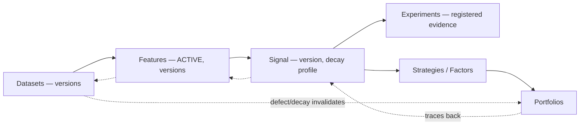

# Signal Registry

| Field             | Value                                                                                                                       |
| ----------------- | --------------------------------------------------------------------------------------------------------------------------- |
| **Document ID**   | SIGNAL-REGISTRY                                                                                                             |
| **Type**          | Operational signal registry/governance (realizes the Signal Registry, FAR-13; sits between features and factors/strategies) |
| **Clause prefix** | `SIG`                                                                                                                       |
| **Owner**         | Head of Quantitative Research (**HQ**)                                                                                      |
| **Co-signers**    | Head of Portfolio & Risk (**HPR**), Governance & Risk Committee (**GRC**), Architecture Review Board (**ARB**)              |
| **Governed by**   | `CLAUDE.md`; Architecture V2 (§5.5, §5.7, §5.9); RB-10/09 · FAR; RB-01 · STAT; RB-13 · RISK                                 |
| **Version**       | 1.0.0                                                                                                                       |
| **Status**        | PROPOSED (binding upon ARB ratification)                                                                                    |
| **Last Ratified** | — (pending)                                                                                                                 |

> **Position & authority.** This framework is the **operational registry and governance system for quantitative decision signals** — the realization of the Signal Registry (RB-10/09 · FAR / FAR-13). A **signal** is a feature (or governed combination) shaped into a directional/strength prediction with a characterized decay (FAR-10). Signals sit **between features (Feature Registry) and factors/strategies/portfolios**; they _inform_ deterministic engines but **never act**. This framework **applies** the signal rules owned by RB-10/09 · FAR, the statistical validity owned by RB-01 · STAT, and the risk rules owned by RB-13 · RISK.

> **The signal never acts.** A signal — including "risk", "execution", and "monitoring" signals — is an **analytical input** to a deterministic engine, never a decision or an action. **Deterministic execution and risk systems retain final authority; humans remain accountable.** No signal executes trades, sets limits, or decides halts (RS-4, AV2-5/23, AI-1, DE-1).

> **Reading note.** Technology-independent. Not a trading-strategy guide, execution-system, or portfolio-construction document. No implementation, execution code, exchange-specific designs, or vendor solutions. Each major section carries **Purpose · Responsibilities · Boundaries · Acceptance · Failure · Cross-refs**, with embedded RFC 2119 rules (`SIG-n`). **Every research or production signal MUST be registered before usage.**

---

## 1. Purpose

To provide institutional control over quantitative signals — how each is discovered, registered, evaluated, validated, approved, monitored, and retired — answering, per signal: **what signals exist, how they are generated, which features support them, what evidence validates them, where they are used, and whether they are approved.** The signal registry is the deterministic control that keeps decision signals evidence-backed, transparent, reproducible, risk-aware, and incapable of acting on their own.

Its governing intent is `CLAUDE.md` FA/FC-*, RS-4, AI-1, DE-1, and CP-4/6/7: a signal earns operational status only through deterministic validation and human approval; it is versioned, lineage-linked, and monitored for decay; and it may only *inform\* deterministic engines — never execute, never bypass risk.

## 2. Scope & Boundaries

- **Purpose.** Define signal governance philosophy, classification, the registry entry standard, signal lifecycle, validation governance (applied), AI signal governance, quality metrics, relationship management, signal governance rules, and audit.
- **Responsibilities.** Register signals; track validation/decay/approval status; classify; version; link signals to features, experiments, strategies, and portfolios; govern usage; preserve failures; monitor and retire signals.
- **Boundaries (references only, never restated):**
  - **Signal taxonomy, Signal Registry _concept_, signal acceptance _criteria_, ontology, decay _rules_, composite/alpha (Alpha Factory)** → **RB-10/09 · FAR** (FAR-10/13/24/61).
  - **Statistical validity: significance/deflation/PBO, stability/robustness/drift _methods_** → **RB-01 · STAT**.
  - **Backtest realism/evidence** → **RB-11 · BT**; **feature dependencies** → **Feature Registry** (FRG); **datasets** → **Dataset Governance** (DSG).
  - **Portfolio usage/construction** → **RB-12 · PORT**; **risk limits, kill-switches, risk _decisions_, exposure _limits_** → **RB-13 · RISK**; **execution _authority_, order handling** → **RB-14 · EXEC**.
  - **Experiment records** → **Experiment Tracking** (EXG); **reproducibility manifests** → **RB-05 · REPRO**; **AI role boundaries** → **RB-15 · AIGOV**, Agent Contracts.
- **Acceptance.** Every research/production signal has a conforming, validated, versioned, lineage-linked registry entry and never acts. **Failure.** A signal used without a governed entry, an unvalidated signal in production, or a signal that executes/bypasses risk. **Cross-refs.** FAR-13/24, RS-4, ARCH V2 §5.5/5.7/5.9.

## 3. Constitutional & Governance Basis

Traces to: `CLAUDE.md` **FA-1..4, FC-1..5** (feature/factor acceptance), **RS-1..4** (risk/execution authority), **AI-1, DE-1** (no AI decision/execution), **HO-1** (accountability), **SM-1..5**, **DP-1..3**, **CP-2/4/6/7**, **RL-2** (retirement); RB-10/09 · FAR (FAR-10/13/24/47/59/61), RB-01 · STAT, RB-13 · RISK; PATCH **P3-07/08** (Marketplace/Alpha Factory), **P1-06** (Feature Factory), **P2-03** (leakage), **P3-10** (regime), **P3-15** (parity), **P1-02** (manifests), **P3-05** (failed corpus); Architecture V2 §5.5/5.7/5.9; REVIEW C1 (leakage), C3 (AI in decision paths), M4 (capacity/decay).

---

## Clause Format

**Pivotal clauses** carry the full block: _Purpose · Rationale · Acceptance · Failure · Refs_. **Supporting clauses** carry RFC 2119 force plus a one-line rationale. Every clause has a stable ID (`SIG-n`, continuous).

---

# PART A — SIGNAL GOVERNANCE PHILOSOPHY

- **SIG-1 · Evidence-Based Signals (MUST).** A signal's predictive/decision claim MUST rest on validated evidence, never assertion; unvalidated signals MUST NOT reach production. _Rationale:_ STAT, FA-1; unevidenced signals are noise or worse — acting on them risks capital. _Acceptance:_ every ACTIVE signal cites validated evidence. _Failure:_ an unvalidated production signal. _Refs:_ SIG-31.
- **SIG-2 · Transparent Decision Logic (MUST).** A signal's generation logic, inputs, and intended use MUST be documented and auditable; opaque or undocumented signals are PROHIBITED. _Rationale:_ EXP-2, CP-7; opaque decision inputs cannot be governed. _Refs:_ SIG-60.
- **SIG-3 · Reproducibility (MUST).** Every signal MUST be reproducible from its definition + manifest + pinned feature/dataset versions; an irreproducible signal is void. _Rationale:_ CP-4. _Refs:_ SIG-40.
- **SIG-4 · Controlled Evolution (MUST).** Signals MUST evolve only through governed versioning; silent changes to a live signal's logic are PROHIBITED. _Rationale:_ CP-2, DEPR-1. _Refs:_ SIG-35.
- **SIG-5 · Risk Awareness (MUST).** Every signal MUST document its known limitations, failure conditions, and exposure risks; a signal MUST NOT be deployed without a risk view (RB-13 · RISK). _Rationale:_ RS; signals drive risk exposure. _Refs:_ SIG-20.
- **SIG-6 · Human Accountability (MUST).** A named human owns and is accountable for every signal; promotion to production requires human approval (HO-1). _Rationale:_ accountability is non-delegable. _Refs:_ SIG-44.

---

# PART B — SIGNAL CLASSIFICATION

- **SIG-7 (MUST).** Every signal MUST be classified into exactly one primary type below and within the ontology (FAR); its type sets its intended consumer and constrains its authority (analytical input only). _Rationale:_ classification aligns a signal with its deterministic consumer. _Refs:_ SIG-53.

| Type                      | Intent                     | Consumer (deterministic)               | Authority                            |
| ------------------------- | -------------------------- | -------------------------------------- | ------------------------------------ |
| **Alpha Signals**         | predict future returns     | Alpha Factory / portfolio construction | **input only**                       |
| **Risk Signals**          | identify risk conditions   | risk engine (RB-13 · RISK)             | **input only — never decides halts** |
| **Market-Regime Signals** | identify market states     | regime service (`P3-10`), conditioning | **input only**                       |
| **Execution Signals**     | inform execution decisions | execution engine (RB-14 · EXEC)        | **input only — never executes**      |
| **Monitoring Signals**    | detect anomalies           | monitoring/incident (OBS/INC)          | **input only — narrate/escalate**    |

- **SIG-8 (MUST).** A signal's classification MUST NOT grant it decision/execution authority; **every signal is an analytical input consumed by a deterministic engine** (AI-1, DE-1, RS-4). _Rationale:_ REVIEW C3; a "signal" that acts is an ungoverned decision. _Acceptance:_ no signal executes/decides. _Failure:_ a signal directly triggering a trade/halt/limit change. _Refs:_ SIG-46.

---

# PART C — SIGNAL REGISTRY ENTRY STANDARD

- **SIG-9 (MUST).** Every signal registry entry MUST contain **all** groups/fields below before ACTIVE; an entry missing any is not registrable. Fields referencing owned artifacts (features, datasets, experiments, manifests) MUST link to the authoritative source. _Rationale:_ FA-4, CP-7; a complete, uniform, discoverable record answering the six questions. _Acceptance:_ all fields present, discoverable, linked. _Failure:_ an incomplete or undiscoverable entry. _Refs:_ SIG-52.

**Signal Registry Entry Standard:**

| Group                 | Fields                                                                                              | Answers             |
| --------------------- | --------------------------------------------------------------------------------------------------- | ------------------- |
| **Identity**          | Signal ID · Signal Name · Description · Owner · Status                                              | what/who/status     |
| **Definition**        | Purpose (hypothesis) · Signal Type · Generation Logic Description (declarative) · Required Features | how generated       |
| **Data Lineage**      | Source datasets · **Feature dependencies (versions)** · Version references                          | which features/data |
| **Research Evidence** | Experiments · Backtests · Validation results                                                        | what evidence       |
| **Risk Information**  | Known limitations · Failure conditions · Exposure risks                                             | risk view           |
| **Usage**             | Approved workflows · Dependent strategies · Portfolio usage                                         | where used          |
| **Versioning**        | Signal version · Change history                                                                     | reproducibility     |

- **SIG-10 (MUST).** The **Definition → Generation Logic** MUST be declarative and computed only from validated, ACTIVE features (Feature Registry) via the as-of path; look-ahead/full-sample logic is PROHIBITED (FRG-10, FAR-40). _Rationale:_ PIT-3; leakage in signal generation fabricates skill. _Refs:_ SIG-30.
- **SIG-11 (MUST).** **Required Features / Feature dependencies** MUST reference ACTIVE, validated features by **version** (Feature Registry FRG-15/35); a signal depending on a non-ACTIVE/unversioned feature MUST NOT be accepted. _Rationale:_ DP, CP-4; signal quality cannot exceed its features' quality. _Refs:_ SIG-40.
- **SIG-12 (MUST).** **Risk Information** MUST be populated with the signal's limitations, failure conditions, and exposure risks before APPROVED (RB-13 · RISK view). _Rationale:_ RS-5, SIG-5. _Refs:_ SIG-20.
- **SIG-13 (MUST).** The signal entry MUST be **immutable per version**; a change to generation logic, features, or parameters creates a new version linked to the prior. _Rationale:_ CP-2/4; mutable signals destroy reproducibility. _Refs:_ SIG-52.

---

# PART D — SIGNAL LIFECYCLE

- **SIG-14 (MUST).** Every signal MUST follow the lifecycle below; stages MUST NOT be skipped, transitions are gated/recorded, and terminal-negative states preserve the record (failed corpus, `P3-05`). Production signals carry a distinct **MONITORED** state (continuous decay/degradation surveillance). _Rationale:_ RL-1/2; a governed lifecycle with active monitoring and a defined death. _Refs:_ SIG-15.

```mermaid
stateDiagram-v2
    [*] --> IDEA: hypothesis for a predictive/decision signal
    IDEA --> RESEARCHED: experiments run (as-of, manifest)
    RESEARCHED --> REGISTERED: registry entry (all fields) + trial-linked
    RESEARCHED --> INVALID: leakage / irreproducible
    REGISTERED --> VALIDATED: significance + robustness + risk (STAT/BT/RISK)
    VALIDATED --> APPROVED: acceptance met (FAR-24) + risk view + human sign-off
    VALIDATED --> REJECTED: fails acceptance
    APPROVED --> ACTIVE: published (analytical input to deterministic engines)
    ACTIVE --> MONITORED: in production, continuously surveilled
    MONITORED --> ACTIVE: healthy
    MONITORED --> DEPRECATED: decay / degradation / superseded
    DEPRECATED --> RETIRED: removed; lineage preserved
    RESEARCHED --> FAILED: cannot be generated/validated
    FAILED --> RESEARCHED: redefined (new version)
    INVALID --> REGISTERED: corrected (new version)
    REJECTED --> REGISTERED: revised (new version)
    RETIRED --> [*]
```

**Lifecycle transition rules:**

| Transition                    | Precondition                                                    | Approver            |
| ----------------------------- | --------------------------------------------------------------- | ------------------- |
| RESEARCHED → REGISTERED       | complete entry; hypothesis + experiments registered             | owner               |
| REGISTERED → VALIDATED        | significance + robustness + risk validation pass (STAT/BT/RISK) | deterministic gates |
| VALIDATED → APPROVED          | FAR-24 acceptance + risk view + (production) human sign-off     | HQ + HPR (risk)     |
| APPROVED → ACTIVE             | published as analytical input                                   | deterministic       |
| ACTIVE → MONITORED            | in production                                                   | automatic           |
| MONITORED → DEPRECATED        | decay/degradation/superseded (FAR-61)                           | HQ + HPR            |
| DEPRECATED → RETIRED          | no live dependents (or migrated); lineage preserved             | HQ + GRC            |
| any → INVALID/REJECTED/FAILED | leakage/irreproducible/fails-acceptance                         | deterministic/HQ    |

- **SIG-15 (MUST).** **No signal MAY reach ACTIVE without passing statistical, backtest, and risk validation and FAR-24 acceptance, plus human sign-off for production**; use of a non-ACTIVE signal is PROHIBITED (fail-closed). _Rationale:_ FA/RS/RG; acceptance + risk sign-off is the trust gate. _Acceptance:_ only ACTIVE, human-approved signals are usable in production. _Failure:_ a non-ACTIVE or unapproved signal driving a strategy. _Refs:_ SIG-30, SIG-46.
- **SIG-16 (MUST).** A signal MUST be REGISTERED before any experiment uses it or any strategy/portfolio depends on it (fail-closed). _Rationale:_ register-before-use anchor. _Refs:_ SIG-40.
- **SIG-17 (MUST).** Every signal MUST have a single accountable human **owner**; for agent-discovered signals a human owner remains accountable (HO-1). _Rationale:_ accountability. _Refs:_ SIG-44.

---

# PART E — SIGNAL VALIDATION GOVERNANCE (applied)

> **Boundary note.** Validation _standards/methods_ are owned by RB-01 · STAT, RB-11 · BT, RB-13 · RISK. This framework requires each signal to **pass and record** them; validation is performed by deterministic engines, never the signal's author or an AI (AI-2, DE-1). Signal generation/validation respects the isolation barrier (`P2-07`).

- **SIG-18 · Statistical Validation (MUST).** Signals MUST pass **significance** (deflated), **robustness** (subperiod/regime/parameter-perturbation), and **stability** (across time/sub-populations) per RB-01 · STAT. _Rationale:_ STAT; unstable/insignificant signals do not generalize. _Acceptance:_ deflated-significant + robust + stable. _Failure:_ insignificant, knife-edge, or unstable. _Refs:_ SIG-31.
- **SIG-19 · Backtesting Validation (MUST).** Signals MUST be validated with **historical evaluation, out-of-sample testing, and realistic assumptions** (net-of-cost, PIT, one-shot holdout) via the backtest engine (RB-11 · BT). _Rationale:_ BT; realistic, deflated evidence. _Refs:_ BKT-79.
- **SIG-20 · Risk Validation (MUST).** Signals MUST pass **exposure analysis** (unintended factor/sector/etc. exposures surfaced) and **failure-scenario analysis** (behavior under stress/adverse regimes) per RB-13 · RISK; a signal whose "edge" is disguised risk exposure MUST be labeled as such. _Rationale:_ RS, FC-2; signals drive exposure. _Acceptance:_ exposures known + within-appetite; failure scenarios documented. _Failure:_ unexamined exposures or undocumented failure modes. _Refs:_ SIG-12.
- **SIG-21 · Production Validation (MUST).** Before and during production, signals MUST have **monitoring** and **degradation/decay detection** configured (reality-gap/parity per `P3-15`; decay per STAT-81/FAR-61); a signal without monitoring MUST NOT be ACTIVE. _Rationale:_ RL-2, M4; signals decay in production. _Refs:_ SIG-14 (MONITORED).

- **SIG-22 (MUST).** Signal validation MUST be performed by deterministic engines; the author or an LLM MUST NOT adjudicate a signal's validity (AI-2, DE-1, CP-5). _Rationale:_ separation of generation and adjudication. _Refs:_ SIG-23.
- **SIG-23 (MUST).** Signal discovery/generation agents MUST respect the isolation barrier (no per-signal validation/OOS visibility) and register every candidate as a counted trial (`P2-07`, STAT-14). _Rationale:_ AD-3, SI-1. _Refs:_ FAR-74.

---

# PART F — AI SIGNAL GOVERNANCE

## AI — MUST

- **SIG-24 (MUST).** AI systems MUST register discovered signals, provide supporting evidence, reference dependent features, report uncertainty, and preserve failed signals. _Rationale:_ AIGOV-27/31, SM-4; AI is not exempt from signal discipline. _Acceptance:_ AI-discovered signals are registered, evidenced, feature-linked, failures preserved. _Failure:_ an AI-discovered unregistered signal. _Refs:_ SIG-16.

## AI — MUST NOT

- **SIG-25 (MUST NOT).** AI systems MUST NOT generate unvalidated trading signals for production. _Rationale:_ AI-1, SIG-1; unvalidated production signals risk capital. _Refs:_ SIG-15.
- **SIG-26 (MUST NOT).** AI systems MUST NOT bypass validation workflows. _Rationale:_ WFC-28, DE-1. _Refs:_ SIG-22.
- **SIG-27 (MUST NOT).** AI systems MUST NOT hide negative results. _Rationale:_ SM-4, AIGOV-28. _Refs:_ SIG-58.
- **SIG-28 (MUST NOT).** AI systems MUST NOT modify signal authority (a signal's authority is fixed as analytical-input by governance). _Rationale:_ AGC-11, SIG-8; self-escalation of a signal's authority is void. _Refs:_ SIG-8.

- **SIG-29 (MUST).** AI-produced signal artifacts MUST record model/prompt/output provenance (`P1-02`) and be classified stochastic. _Rationale:_ CP-4, AIGOV-26. _Refs:_ SIG-40.

---

# PART G — SIGNAL QUALITY METRICS

- **SIG-30 (MUST).** Every signal metric MUST define **purpose, measurement, acceptance criteria, and failure conditions**; statistical _methods_ are owned by RB-01 · STAT; this framework records and gates on them. _Rationale:_ CP-1. _Refs:_ per-family.

**Signal quality-metric families (methods per STAT/BT/RISK; thresholds governed):**

| Family                        | Example metrics                               | Acceptance                                      | Failure                                |
| ----------------------------- | --------------------------------------------- | ----------------------------------------------- | -------------------------------------- |
| **Predictive Quality**        | IC/hit-rate (deflated) · net-of-cost edge     | significant, net-positive                       | insignificant / gross-only             |
| **Stability**                 | temporal/sub-population stability             | within dispersion tolerance                     | unstable                               |
| **Robustness**                | subperiod/regime/parameter-perturbation       | robust across pre-registered slices             | knife-edge / regime-only               |
| **Risk-Adjusted Performance** | deflated Sharpe/IR · drawdown · tail          | within appetite, risk-adjusted target           | poor risk-adjusted / breaches appetite |
| **Decay Detection**           | half-life · live-vs-backtest drift · crowding | decay within expected; reality-gap in tolerance | rapid decay / reality-gap breach       |
| **Reproducibility**           | manifest completeness · re-run match          | 100% reproducible                               | irreproducible                         |

- **SIG-31 (MUST).** Predictive and risk-adjusted metrics MUST be **deflated and net-of-cost** (STAT-3/21, AD-1); undeflated or gross metrics MUST NOT be acceptance evidence. _Rationale:_ SI-3, AP-10. _Refs:_ STAT-3.
- **SIG-32 (MUST).** Decay detection MUST be active for ACTIVE signals; decay/crowding/reality-gap beyond threshold triggers the DEPRECATED/retirement review (RB-13 · RISK / FAR-61). _Rationale:_ RL-2, M4; signals rot and crowd. _Refs:_ SIG-21.

---

# PART H — SIGNAL RELATIONSHIP MANAGEMENT

- **SIG-33 (MUST).** Every signal MUST record its full relationship chain below; the chain MUST be resolvable and enable a defect/decay at any level to invalidate/flag downstream (DP-2; graph per `P3-14`). _Rationale:_ CP-6; the linked graph is compounding knowledge and the invalidation backbone. _Acceptance:_ chain resolvable signal→portfolio. _Failure:_ an orphaned or unresolvable-lineage signal. _Refs:_ SIG-58.

- **SIG-34 (MUST).** Signals MUST link bidirectionally to: their feature dependencies (Feature Registry), the experiments that validated them (Experiment Tracking), the strategies/factors that consume them (FAR/PORT), the portfolios they influence (PORT), and any ADR their adoption informs. _Rationale:_ CP-6; navigable research graph. _Refs:_ SIG-52.

---

# PART I — SIGNAL GOVERNANCE RULES

## Signals — MUST

- **SIG-35 (MUST).** Signals MUST have registered ownership, validation evidence, defined limitations, and maintained history. _Rationale:_ HO-1, FA, CP-7; the four minimums for a governable signal. _Acceptance:_ all four present. _Failure:_ any missing. _Refs:_ SIG-52.

## Signals — MUST NOT

- **SIG-36 (MUST NOT).** Signals MUST NOT directly execute trades. _Rationale:_ RS-4, AI-1; execution is deterministic and gated. _Refs:_ SIG-8.
- **SIG-37 (MUST NOT).** Signals MUST NOT bypass risk controls. _Rationale:_ RS; risk controls are non-bypassable. _Refs:_ SIG-20.
- **SIG-38 (MUST NOT).** Signals MUST NOT operate without approval (non-ACTIVE signals are inert). _Rationale:_ SIG-15; unapproved signals are not decision inputs. _Refs:_ SIG-15.

- **SIG-39 (MUST).** **Deterministic execution and risk systems retain final authority** over any action a signal informs; a signal is consumed by these systems, which apply their own gates (limits, eligibility, authorization) before any action. _Rationale:_ RS-4, AV2-5/23, DE-1; the signal advises, the deterministic engine acts within governance. _Acceptance:_ every action informed by a signal passes the consuming engine's gates. _Failure:_ a signal action taken without the deterministic engine's gate. _Refs:_ SIG-8, SIG-46.

---

# PART J — AUDIT REQUIREMENTS

- **SIG-40 (MUST).** Every signal MUST maintain immutably: **creation history, owner history, validation history, performance history, approval history, and retirement history** — each event with actor, timestamp, and rationale. _Rationale:_ CP-7; the signal record is core to decision audit. _Acceptance:_ an auditor reconstructs a signal's full lineage, validation, and performance timeline without the author. _Failure:_ a missing/mutable history record. _Refs:_ SIG-42.
- **SIG-41 (MUST).** Signal records MUST be tamper-evident (RB-27 · SEC) and the registry reconcilable against signals actually consumed by strategies/portfolios/execution; any consumption of a non-ACTIVE/unregistered signal MUST be flagged and the dependent decision reviewed/invalidated. _Rationale:_ CP-7, SIG-16. _Refs:_ SIG-16.

---

## Responsibility Matrix (RACI)

| Signal activity                      | AI agent                    | Deterministic gates/engines      | Human owner | Governance (HQ/HPR/GRC) |
| ------------------------------------ | --------------------------- | -------------------------------- | ----------- | ----------------------- |
| Propose/discover signal              | R (propose)                 | —                                | **A**       | I                       |
| Register + link features/experiments | R (submit)                  | R (validate fields)              | **A**       | I                       |
| Validate (stat/backtest/risk)        | ✗ (forbidden self-validate) | **R**                            | C           | A                       |
| Accept (APPROVE) + risk view         | ✗                           | R (gate)                         | C           | **A (HQ+HPR)**          |
| Publish (ACTIVE, analytical input)   | —                           | **R**                            | A           | I                       |
| Consume signal → action              | —                           | **R** (engine applies its gates) | A           | A                       |
| Monitor / detect decay               | narrate                     | **R**                            | A           | I                       |
| Deprecate/retire                     | propose                     | R (checks)                       | R           | **A**                   |
| Edit accepted signal                 | ✗                           | R (deny)                         | ✗           | ✗ (new version only)    |

---

## Acceptance Criteria (signal → ACTIVE)

A signal is **research/production-ready (ACTIVE)** only when **all** hold:

**Signal acceptance checklist:**

- [ ] Registered before use; single owner; ontology-classified as analytical input (SIG-16, SIG-7).
- [ ] Declarative generation logic from ACTIVE, versioned features; as-of computed (SIG-10, SIG-11).
- [ ] Deflated significance + robustness + stability (SIG-18, SIG-31).
- [ ] Backtest validation (net-of-cost, OOS, realistic) (SIG-19).
- [ ] Risk validation: exposures + failure scenarios documented; within appetite (SIG-20).
- [ ] Monitoring + decay detection configured (SIG-21).
- [ ] Validated by deterministic engines (not author/AI); isolation respected (SIG-22, SIG-23).
- [ ] FAR-24 acceptance + risk view + human sign-off for production (SIG-15).
- [ ] Linked to features/experiments/strategies/portfolios; reproducible from manifest (SIG-34, SIG-3).
- [ ] Immutably versioned; never executes/bypasses risk (SIG-13, SIG-36, SIG-37).

## Rejection / Invalidation Criteria

A signal MUST be **rejected, invalidated, or failed** if **any** hold:

- **SIG-42.** Used before registration/acceptance, or without human sign-off for production (SIG-15, SIG-16).
- **SIG-43.** Leakage / look-ahead / non-as-of generation, or depends on non-ACTIVE features (SIG-10, SIG-11).
- **SIG-44.** Insignificant after deflation, unstable, or gross-only (SIG-18, SIG-31).
- **SIG-45.** Unexamined exposures / undocumented failure modes / no monitoring (SIG-20, SIG-21).
- **SIG-46.** Executes trades, bypasses risk controls, or acts without the deterministic engine's gate (SIG-36, SIG-37, SIG-39).
- **SIG-47.** Self-validated by author/AI, or isolation breach (SIG-22, SIG-23).
- **SIG-48.** Irreproducible, or record edited instead of versioned (SIG-3, SIG-13).
- **SIG-49.** AI-generated for production without validation, or hidden negatives (SIG-25, SIG-27).

---

## Anti-Patterns & Forbidden Practices

**Anti-patterns:**

- **SIG-AP-1.** A signal that acts (executes/decides) instead of informing a deterministic engine (SIG-8).
- **SIG-AP-2.** Shadow signals — used but not registered (SIG-16).
- **SIG-AP-3.** Gross/undeflated signal metrics as evidence (SIG-31).
- **SIG-AP-4.** Deploying without monitoring/decay detection (SIG-21).
- **SIG-AP-5.** Author/AI validating their own signal (SIG-22).
- **SIG-AP-6.** Signal-search agent seeing validation/OOS outcomes (SIG-23).
- **SIG-AP-7.** Hiding failed signals or negative results (SIG-27).

**Forbidden practices (non-waivable):**

- **SIG-F-1.** A signal directly executing trades, bypassing risk controls, or acting without the deterministic engine's gate (SIG-36, SIG-37, SIG-39; RS-4).
- **SIG-F-2.** Using an unregistered or non-ACTIVE signal (SIG-15, SIG-16).
- **SIG-F-3.** Leakage / non-as-of signal generation, or dependence on non-ACTIVE features (SIG-10, SIG-11; FB-6).
- **SIG-F-4.** Gross/undeflated metrics as acceptance evidence (SIG-31; SI-3).
- **SIG-F-5.** Author or AI adjudicating a signal's validity (SIG-22; AI-2).
- **SIG-F-6.** AI generating unvalidated production signals, hiding negatives, or modifying signal authority (SIG-25, SIG-27, SIG-28).
- **SIG-F-7.** Editing an accepted signal record instead of versioning (SIG-13).
- **SIG-F-8.** Signal-search agents breaching the isolation barrier (SIG-23).

---

## Enforcement & Verification

| Clause group                                              | Enforcement mechanism                                           | Owner                                    |
| --------------------------------------------------------- | --------------------------------------------------------------- | ---------------------------------------- |
| Register/accept-before-use (SIG-15,16)                    | Registry gate (fail-closed)                                     | this framework, RB-10/09 · FAR           |
| As-of generation + ACTIVE features (SIG-10,11)            | Feature Registry gate + leakage harness                         | Feature Registry, RB-08 · PIT            |
| Statistical/backtest validation (SIG-18,19,31)            | Deterministic STAT/BT gates                                     | RB-01 · STAT, RB-11 · BT                 |
| Risk validation + exposure (SIG-20)                       | Deterministic risk gates                                        | RB-13 · RISK                             |
| Signal-never-acts + deterministic authority (SIG-8,36–39) | Consuming engines apply their gates; signals inert without them | RB-13 · RISK, RB-14 · EXEC, RB-12 · PORT |
| Deterministic validation / isolation (SIG-22,23)          | Engine adjudication; bus ACLs                                   | RB-01/04, `P2-07`                        |
| Monitoring/decay (SIG-21,32)                              | Production monitors; reality-gap/parity                         | RB-28 · OBS, RB-11 · BT (`P3-15`)        |
| Versioning/reproducibility (SIG-13,3)                     | Immutable version store + manifests                             | RB-05 · REPRO                            |
| Audit history (SIG-40,41)                                 | Immutable history + tamper-evident audit; reconciliation        | RB-27 · SEC                              |
| Forbidden practices (SIG-F-\*)                            | Fail-closed; integrity report                                   | GRC                                      |

- **SIG-E-1 (MUST).** Every clause enforcing a Forbidden Practice (SIG-F-*) — especially the signal-never-acts rules — MUST be deterministically gated and fail-closed. *Rationale:* CP-1, DE-1, RS-4. *Refs:\* SIG-39.

## Exceptions & Waivers

- **SIG-W-1 (MUST).** No exception MAY be granted to: signal-never-acts / deterministic-execution-authority (SIG-8/36–39), register/accept-before-use (SIG-15/16), leakage-clean as-of generation (SIG-10), deflation (SIG-31), deterministic validation/isolation (SIG-22/23), human sign-off for production (SIG-15), failure preservation (SIG-27), immutability (SIG-13), or any `CLAUDE.md` entrenched clause (AM-2). Non-waivable.
- **SIG-W-2 (MAY).** GRC/HQ/HPR-governed parameters (significance/decay/reality-gap thresholds, risk tolerances, review cadence) MAY be changed only by those bodies, recorded (as an ADR), applied prospectively.
- **SIG-W-3 (MUST).** Any temporary waiver MUST be recorded on the signal's registry entry and history. _Rationale:_ no hidden exceptions.

## Ratification Criteria

Ratifiable only when: every clause has a stable ID, RFC 2119 phrasing, and an enforcement mechanism; no clause contradicts `CLAUDE.md`, Architecture V2, RB-10/09 · FAR, RB-01 · STAT, RB-13 · RISK, or peer frameworks; signal-never-acts, deterministic execution authority, register/accept-before-use, leakage-clean generation, deflation, deterministic validation, isolation, monitoring, human sign-off, and immutability are preserved; all cross-references resolve; ARB approval with HQ + HPR + GRC co-sign obtained.

## Success Metrics

- **SM-1.** 0 signals that execute/bypass risk; 100% signal-informed actions gated by deterministic engines (SIG-36, SIG-39).
- **SM-2.** 100% research/production signals registered + accepted before use; 0 shadow signals (SIG-15, SIG-16).
- **SM-3.** 0 leaky signals; 0 signals accepted on undeflated/gross metrics (SIG-10, SIG-31).
- **SM-4.** 100% ACTIVE signals with risk view + monitoring + decay detection (SIG-20, SIG-21).
- **SM-5.** 0 author/AI self-validations; 0 isolation breaches by signal-search agents (SIG-22, SIG-23).
- **SM-6.** 100% failed signals preserved; 0 deleted/hidden negatives (SIG-27).
- **SM-7.** 100% signals reproducible + fully linked (features/experiments/strategies/portfolios); registry reconciles to usage (SIG-34, SIG-41).

## Dependencies & Related Documents

- **Governed by:** `CLAUDE.md`; Architecture V2 (§5.5, §5.7, §5.9); RB-10/09 · FAR; RB-01 · STAT; RB-13 · RISK.
- **Depends on / references:** Feature Registry (feature dependencies), Dataset Governance (datasets), Experiment Tracking (evidence), RB-11 · BT (backtest validation), RB-12 · PORT (portfolio usage), RB-14 · EXEC (execution authority), RB-05 · REPRO (manifests), RB-15 · AIGOV & Agent Contracts (AI), RB-28 · OBS (monitoring), RB-27 · SEC (audit integrity).
- **Architecture references:** ARCH §2.5, §2.8, §2.9; Architecture V2 §5.5/5.7/5.9; PATCH `P3-07/08`, `P1-06`, `P2-03`, `P3-10/15`, `P1-02`, `P3-05`; REVIEW C1, C3, M4.

## Change Log & Version History

| Version | Date    | Author (role) | Change                   |
| ------- | ------- | ------------- | ------------------------ |
| 1.0.0   | pending | HQ            | Initial Signal Registry. |

---

## Glossary (signal-registry-specific)

Terms in `CLAUDE.md`, rulebook, and prior-framework glossaries (signal, feature, factor, decay, as-of, leakage, isolation barrier) are not redefined.

- **Signal** — A feature (or governed combination) shaped into a directional/strength prediction with a characterized decay; an **analytical input** to a deterministic engine, never an action (SIG-8; FAR-10).
- **Signal Registry Entry** — The authoritative governance record of a signal's identity, definition, lineage, evidence, risk, usage, and versioning (SIG-9).
- **Analytical Input** — A signal's fixed authority: it informs a deterministic engine, which applies its own gates before any action (SIG-8, SIG-39).
- **ACTIVE (signal)** — The lifecycle state a signal reaches only after statistical/backtest/risk validation, FAR-24 acceptance, and human sign-off; the only state strategies/portfolios may consume (SIG-15).
- **MONITORED** — The production sub-state of an ACTIVE signal under continuous decay/degradation surveillance (SIG-14).
- **Signal Decay** — The erosion of a signal's edge over time (half-life, crowding, reality-gap); triggers deprecation (SIG-32; FAR-61).
- **Shadow Signal** — An unregistered signal used in research/production; prohibited (SIG-AP-2).
- **Signal Lineage** — Datasets → Features → Signal → Experiments/Strategies → Portfolios, resolvable and invalidation-enabling (SIG-33).

---

_End of Signal Registry. It is the operational registry and governance system for quantitative decision signals, realizing the Signal Registry between features and factors/strategies/portfolios: every signal is registered before use, generated as-of from ACTIVE features, validated (statistical + backtest + risk) by deterministic engines (not its author or an AI), risk-assessed, monitored for decay, human-approved for production, immutably versioned, and fully linked to its features, experiments, strategies, and portfolios. Every signal is an analytical input — it informs deterministic engines and never executes trades, bypasses risk controls, or acts without the consuming engine's gate; deterministic execution and risk systems retain final authority and humans remain accountable. AI registers signals, provides evidence, and preserves failures; it never pushes unvalidated production signals, hides negatives, or modifies signal authority. Binding upon ARB ratification._
