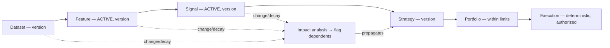

# Strategy Registry

| Field             | Value                                                                                                          |
| ----------------- | -------------------------------------------------------------------------------------------------------------- |
| **Document ID**   | STRATEGY-REGISTRY                                                                                              |
| **Type**          | Operational strategy registry/governance (inventory over the BT strategy-validation lifecycle, BKT-79)         |
| **Clause prefix** | `STR`                                                                                                          |
| **Owner**         | Head of Quantitative Research (**HQ**)                                                                         |
| **Co-signers**    | Head of Portfolio & Risk (**HPR**), Governance & Risk Committee (**GRC**), Architecture Review Board (**ARB**) |
| **Governed by**   | `CLAUDE.md`; Architecture V2 (§5.5–5.9); RB-11 · BT; RB-12 · PORT; RB-13 · RISK; RB-01 · STAT                  |
| **Version**       | 1.0.0                                                                                                          |
| **Status**        | PROPOSED (binding upon ARB ratification)                                                                       |
| **Last Ratified** | — (pending)                                                                                                    |

> **Position & authority.** This framework is the **operational registry and governance system for quantitative investment strategies** — the inventory/record layer over the strategy validation lifecycle owned by RB-11 · BT (BKT-79). A **strategy** consumes ACTIVE signals/features and produces target exposures that feed **portfolio construction** (RB-12 · PORT); it sits **between signals and portfolios**. This framework **applies** the validation rules of RB-11 · BT, the statistical validity of RB-01 · STAT, the portfolio rules of RB-12 · PORT, and the risk rules of RB-13 · RISK.

> **The strategy never acts.** A strategy produces target exposures consumed by deterministic portfolio construction and, ultimately, deterministic execution. **A strategy never executes trades, never bypasses portfolio constraints, and never bypasses risk controls. Deterministic execution and risk systems retain final authority; humans remain accountable** (RS-4, PS-1, AI-1, DE-1).

> **Reading note.** Technology-independent. Not a trading-strategy tutorial, execution-system, or portfolio-construction guide. No implementation, code, broker/exchange designs, or vendor solutions. Each major section carries **Purpose · Responsibilities · Boundaries · Acceptance · Failure · Cross-refs**, with embedded RFC 2119 rules (`STR-n`). **Every research or production strategy MUST be registered before usage.**

---

## 1. Purpose

To provide institutional control over quantitative investment strategies — how each is discovered, registered, evaluated, validated, approved, monitored, and retired — answering, per strategy: **what strategies exist, why they were created, which signals and features they use, which markets and universes they target, what evidence validates them, who approved them, and whether they are active.** The strategy registry is the deterministic control that keeps strategies evidence-backed, reproducible, risk-aware, and incapable of acting outside governance.

Its governing intent is `CLAUDE.md` BT-1..4, RG-1..3, DEP-1..4, RS/PS-*, AI-1, DE-1, HO-1: a strategy earns capital only through the full staged validation chain and human approval; it is versioned, lineage-linked, and monitored for decay; and it only *proposes\* exposures — deterministic portfolio, risk, and execution systems act within governance.

## 2. Scope & Boundaries

- **Purpose.** Define strategy governance philosophy, classification, the registry entry standard, strategy lifecycle, validation governance (applied), AI strategy governance, quality metrics, relationship management, governance rules, and audit.
- **Responsibilities.** Register strategies; track validation/approval/decay/status; classify; version; link strategies to signals, features, datasets, experiments, and portfolios; govern usage; preserve failures; monitor and retire strategies.
- **Boundaries (references only, never restated):**
  - **Strategy validation _lifecycle_, backtest realism, PBO, capacity, promotion gates, reality-gap** → **RB-11 · BT** (BKT-79 et al.).
  - **Statistical validity: significance/deflation/PBO, stability/robustness _methods_** → **RB-01 · STAT**.
  - **Portfolio construction, sizing, constraints, allocation** → **RB-12 · PORT**; **risk limits, sign-off, kill-switches, exposure _decisions_** → **RB-13 · RISK**; **execution _authority_** → **RB-14 · EXEC**; **release/rollback** → **RB-30 · DEPLOY**.
  - **Signal/feature dependencies** → **Signal Registry (SIG), Feature Registry (FRG)**; **datasets** → **Dataset Governance (DSG)**; **experiments** → **Experiment Tracking (EXG)**.
  - **Research process, pre-registration** → **RB-02 · RMET**; **factor/alpha** → **RB-10/09 · FAR**; **manifests** → **RB-05 · REPRO**; **AI role boundaries** → **RB-15 · AIGOV**, Agent Contracts.
- **Acceptance.** Every research/production strategy has a conforming, validated, versioned, lineage-linked registry entry and never acts. **Failure.** A strategy used without a governed entry, an unvalidated strategy in production, or a strategy that executes/bypasses controls. **Cross-refs.** BKT-79, PS-1, RS-4, ARCH V2 §5.6/5.7/5.9.

## 3. Constitutional & Governance Basis

Traces to: `CLAUDE.md` **BT-1..4** (backtesting), **RG-1..3** (research/promotion governance), **DEP-1..4** (paper-first, reversible, gates), **RS-1..4** (risk/execution authority), **PS-1..4** (portfolio), **AI-1, DE-1** (no AI decision/execution), **HO-1** (accountability), **SM-1..5**, **DP-1..3**, **CP-2/4/6/7**, **RL-2** (retirement); RB-11 · BT, RB-12 · PORT, RB-13 · RISK, RB-01 · STAT; PATCH **P2-05..09** (validation/holdout/replication/scientific gate), **P3-08** (Alpha Factory), **P3-11** (capacity/crowding), **P3-15** (parity), **P3-16** (backtest realism), **P1-02** (manifests), **P3-05** (failed corpus), **P5-05** (tiered autonomy); Architecture V2 §5.5–5.9; REVIEW C5/C6, M4.

---

## Clause Format

**Pivotal clauses** carry the full block: _Purpose · Rationale · Acceptance · Failure · Refs_. **Supporting clauses** carry RFC 2119 force plus a one-line rationale. Every clause has a stable ID (`STR-n`, continuous).

---

# PART A — STRATEGY GOVERNANCE PHILOSOPHY

- **STR-1 · Evidence-Based Strategy Development (MUST).** A strategy's edge claim MUST rest on the full staged validation chain (backtest → OOS → replication → scientific gate), never assertion; unvalidated strategies MUST NOT reach capital. _Rationale:_ BT-1, RG-3; unvalidated strategies risk capital (REVIEW). _Acceptance:_ every capital-bearing strategy cites its validation chain. _Failure:_ an unvalidated production strategy. _Refs:_ STR-31.
- **STR-2 · Scientific Reproducibility (MUST).** Every strategy MUST be reproducible from its definition + manifest + pinned signal/feature/dataset versions; an irreproducible strategy is void. _Rationale:_ CP-4, BT-3. _Refs:_ STR-40.
- **STR-3 · Transparent Decision Logic (MUST).** A strategy's logic, dependencies, and intended market behavior MUST be documented and auditable; opaque strategies are PROHIBITED. _Rationale:_ EXP-2, CP-7. _Refs:_ STR-60.
- **STR-4 · Controlled Strategy Evolution (MUST).** Strategies MUST evolve only through governed versioning; silent changes to a live strategy's logic are PROHIBITED. _Rationale:_ CP-2, DEPR-1. _Refs:_ STR-35.
- **STR-5 · Risk Awareness (MUST).** Every strategy MUST document its risk profile, failure conditions, market limitations, and exposure characteristics, and pass independent risk validation before capital (RB-13 · RISK). _Rationale:_ RS; strategies drive risk. _Refs:_ STR-20.
- **STR-6 · Human Accountability (MUST).** A named human owns and is accountable for every strategy; promotion to production requires human approval and independent risk sign-off (HO-1, RS-2). _Rationale:_ accountability is non-delegable. _Refs:_ STR-44.
- **STR-7 · Knowledge Preservation (MUST).** Accepted and failed strategies MUST be preserved with reasons and remain accessible; deleting failed strategies is PROHIBITED. _Rationale:_ SM-4, Missing #9; strategies (and failures) are institutional knowledge. _Refs:_ STR-58.

---

# PART B — STRATEGY CLASSIFICATION

- **STR-8 (MUST).** Every strategy MUST be classified into a primary category below; classification (with mandate, asset scope, market/universe) drives validation depth, risk limits, and portfolio treatment. _Rationale:_ classification aligns governance with strategy nature. _Refs:_ STR-53.

| Category                  | Nature                     | Key governance concerns                          |
| ------------------------- | -------------------------- | ------------------------------------------------ |
| **Long-Only**             | directional long           | benchmark-relative, market beta                  |
| **Long-Short**            | paired long/short          | borrow (short), net/gross exposure               |
| **Market-Neutral**        | beta-hedged                | residual exposures, factor neutrality            |
| **Factor**                | systematic factor exposure | orthogonality, factor crowding                   |
| **Momentum**              | trend-following            | turnover, crash risk, regime dependence          |
| **Mean-Reversion**        | reversal                   | capacity, gap risk, tail                         |
| **Statistical Arbitrage** | relative-value             | capacity, microstructure, decay-fast             |
| **Regime-Based**          | regime-conditioned         | pre-registered regimes (`P3-10`)                 |
| **Risk-Management**       | hedging/overlay            | governed as portfolio overlay (PORT-48)          |
| **AI-Assisted-Research**  | AI-proposed hypotheses     | isolation, uncounted-trial risk, human ownership |

- **STR-9 (MUST).** Classification MUST NOT grant a strategy decision/execution authority; **every strategy proposes target exposures consumed by deterministic portfolio/execution engines** (PS-1, RS-4). _Rationale:_ REVIEW C3/C5; a strategy that acts is an ungoverned decision. _Failure:_ a strategy directly executing or bypassing PORT/RISK. _Refs:_ STR-46.

---

# PART C — STRATEGY REGISTRY ENTRY STANDARD

- **STR-10 (MUST).** Every strategy registry entry MUST contain **all** groups/fields below before ACTIVE; an entry missing any is not registrable. Fields referencing owned artifacts (signals, features, datasets, experiments, manifests) MUST link to the authoritative source. _Rationale:_ BT-3, CP-7; a complete, uniform, discoverable record answering the seven questions. _Acceptance:_ all fields present, discoverable, linked. _Failure:_ an incomplete or undiscoverable entry. _Refs:_ STR-52.

**Strategy Registry Entry Standard:**

| Group                       | Fields                                                                                                       | Answers            |
| --------------------------- | ------------------------------------------------------------------------------------------------------------ | ------------------ |
| **Identity**                | Strategy ID · Name · Description · Owner · Classification · Status                                           | what/who/status    |
| **Research Context**        | Objective · Research hypothesis · Intended market behavior · Expected edge · **Markets & Universe**          | why/where          |
| **Methodology**             | Strategy logic description (declarative) · Signal dependencies · Feature dependencies · Dataset dependencies | how                |
| **Validation Evidence**     | Experiment refs · Backtest refs · Statistical validation · Robustness testing · Out-of-sample validation     | what evidence      |
| **Risk Information**        | Risk profile · Known failure conditions · Market limitations · Exposure characteristics                      | risk view          |
| **Operational Information** | Review frequency · Monitoring requirements · Approval requirements                                           | operating envelope |
| **Versioning**              | Strategy version · Change history · Deprecation history                                                      | reproducibility    |

- **STR-11 (MUST).** **Methodology → dependencies** MUST reference ACTIVE, validated signals (Signal Registry), ACTIVE features (Feature Registry), and certified datasets (Dataset Governance) by **version**; a strategy depending on any non-ACTIVE/unversioned artifact MUST NOT be accepted. _Rationale:_ DP, CP-4; strategy quality cannot exceed its dependencies'. _Refs:_ STR-40.
- **STR-12 (MUST).** **Research Context → Markets & Universe** MUST be as-of correct and survivorship-safe (Dataset Governance / RB-08 · PIT); a strategy MUST NOT be validated or deployed on a universe broader than validated (PORT-16). _Rationale:_ PIT, BT-1; universe drift is silent extrapolation. _Refs:_ BKT-15.
- **STR-13 (MUST).** **Risk Information** MUST be populated before APPROVED with an independent risk view (RB-13 · RISK). _Rationale:_ RS, STR-5. _Refs:_ STR-20.
- **STR-14 (MUST).** The strategy entry MUST be **immutable per version**; a change to logic, dependencies, or parameters creates a new version linked to the prior. _Rationale:_ CP-2/4; mutable strategies destroy reproducibility. _Refs:_ STR-52.

---

# PART D — STRATEGY LIFECYCLE

- **STR-15 (MUST).** Every strategy MUST follow the lifecycle below; stages MUST NOT be skipped, transitions are gated/recorded, and it MUST stay consistent with the BT strategy-validation lifecycle (BKT-79). Terminal-negative states preserve the record (failed corpus, `P3-05`). Production strategies carry **MONITORED**; risk incidents move a strategy to **SUSPENDED**. _Rationale:_ RL-1/2, DEP; a governed, staged, monitored lifecycle with a defined death. _Refs:_ STR-16.

```mermaid
stateDiagram-v2
    [*] --> IDEA: hypothesis for a strategy (RMET)
    IDEA --> RESEARCHED: experiments run (as-of, manifest)
    RESEARCHED --> REGISTERED: registry entry (all fields) + trial-linked
    REGISTERED --> BACKTESTED: realistic, reproducible backtest (BT)
    BACKTESTED --> VALIDATED: stats + robustness + OOS + replication (STAT/BT/VAL)
    VALIDATED --> APPROVED: scientific gate (P2-09) + risk sign-off + human approval
    VALIDATED --> REJECTED: fails validation
    APPROVED --> ACTIVE: paper/shadow → production (DEPLOY release gate)
    ACTIVE --> MONITORED: in production, surveilled (reality-gap/decay)
    MONITORED --> ACTIVE: healthy
    MONITORED --> SUSPENDED: risk breach / incident / kill-switch
    SUSPENDED --> MONITORED: remediated + re-approved
    MONITORED --> DEPRECATED: decay / crowding / superseded
    SUSPENDED --> RETIRED: not remediable
    DEPRECATED --> RETIRED: unwound; lineage preserved
    RESEARCHED --> FAILED: cannot be defined/validated
    BACKTESTED --> INVALID: leakage / irreproducible
    FAILED --> RESEARCHED
    INVALID --> REGISTERED
    REJECTED --> REGISTERED
    RETIRED --> [*]
```

**Allowed / forbidden transitions & approvals:**

| Transition              | Precondition                                                                    | Approver            |
| ----------------------- | ------------------------------------------------------------------------------- | ------------------- |
| REGISTERED → BACKTESTED | registered experiments; as-of data + manifest                                   | deterministic       |
| BACKTESTED → VALIDATED  | stats + robustness + one-shot OOS + replication (STAT/BT/VAL)                   | deterministic gates |
| VALIDATED → APPROVED    | scientific gate (`P2-09`) + independent risk sign-off + human approval          | GRC + HPR + human   |
| APPROVED → ACTIVE       | paper/shadow reality-gap clean + DEPLOY release gate                            | HSRE + GRC          |
| MONITORED → SUSPENDED   | risk/limit/parity breach or kill-switch                                         | automatic / RISK    |
| DEPRECATED → RETIRED    | governed unwind; lineage preserved                                              | HPR + GRC           |
| **Forbidden**           | RESEARCHED/BACKTESTED → ACTIVE (skip validation); any → ACTIVE without approval | — (PROHIBITED)      |

- **STR-16 (MUST).** **No strategy MAY reach ACTIVE without the full staged chain** — backtest, statistical/robustness/OOS validation, independent replication, scientific gate, independent risk sign-off, paper/shadow, DEPLOY release gate, and human approval; skipping any stage is PROHIBITED (fail-closed). _Rationale:_ RG-3, DEP-4, BKT-79; the staged chain is the capital-safety spine (REVIEW). _Acceptance:_ only fully-gated, human-approved strategies are ACTIVE. _Failure:_ a strategy in production that skipped a stage. _Refs:_ STR-46.
- **STR-17 (MUST).** A strategy MUST be REGISTERED before any experiment/portfolio uses it (fail-closed); use of an unregistered strategy is PROHIBITED. _Rationale:_ register-before-use anchor. _Refs:_ STR-40.
- **STR-18 (MUST).** Every strategy MUST have a single accountable human **owner**; for agent-generated strategies a human owner remains accountable (HO-1). _Rationale:_ accountability. _Refs:_ STR-44.
- **STR-19 (MUST).** A production strategy MUST be instantly SUSPENDABLE (risk breach/incident/kill-switch) without impairing deterministic operations; reactivation from SUSPENDED requires remediation + re-approval (RS-3, AIGOV-61). _Rationale:_ capital safety; hard failures are stops. _Refs:_ STR-46.

---

# PART E — STRATEGY VALIDATION GOVERNANCE (applied)

> **Boundary note.** Validation _standards/methods_ are owned by RB-02 · RMET, RB-01 · STAT, RB-11 · BT, RB-13 · RISK, RB-30 · DEPLOY. This framework requires each strategy to **pass and record** them; validation is by deterministic engines, never the author or an AI (AI-2, DE-1); generation respects the isolation barrier (`P2-07`).

- **STR-20 · Research Validation (MUST).** Strategies MUST pass **hypothesis validation, evidence review, and a reproducibility check** (RB-02 · RMET, RB-05 · REPRO); an irreproducible strategy is INVALID. _Rationale:_ SM, CP-4. _Refs:_ STR-2.
- **STR-21 · Statistical Validation (MUST).** Strategies MUST pass **significance (deflated), robustness, and stability** (RB-01 · STAT); PBO below threshold (`P2-06`). _Rationale:_ SI, STAT. _Refs:_ STR-31.
- **STR-22 · Backtesting Validation (MUST).** Strategies MUST be validated with **realistic assumptions, transaction-cost consideration (net-of-cost, participation-aware impact, borrow), and out-of-sample evaluation** (RB-11 · BT). _Rationale:_ BT-2, M4. _Refs:_ BKT-79.
- **STR-23 · Risk Validation (MUST).** Strategies MUST pass **exposure analysis, drawdown analysis, and failure-scenario/stress analysis** with independent risk sign-off (RB-13 · RISK); within risk appetite/budget. _Rationale:_ RS. _Acceptance:_ exposures/drawdown/tail within appetite; failure modes documented. _Failure:_ unexamined exposures or breach of appetite. _Refs:_ STR-13.
- **STR-24 · Production Readiness Validation (MUST).** Before ACTIVE, strategies MUST have **monitoring capability** (reality-gap/parity/decay per `P3-15`) and **operational approval** (DEPLOY release gate); paper/shadow reality-gap within tolerance. _Rationale:_ DEP-1, M4; production reveals what tests cannot. _Refs:_ STR-24-monitoring.

- **STR-25 (MUST).** Strategy validation MUST be performed by deterministic engines; the author or an LLM MUST NOT adjudicate a strategy's validity (AI-2, DE-1, CP-5). _Rationale:_ separation of generation and adjudication. _Refs:_ STR-26.
- **STR-26 (MUST).** Strategy-generating agents MUST respect the isolation barrier (no per-strategy validation/OOS visibility) and register every candidate as a counted trial (`P2-07`, STAT-14). _Rationale:_ AD-3, SI-1; unbounded strategy mining that sees validation overfits the validator (REVIEW). _Refs:_ FAR-74.

---

# PART F — AI STRATEGY GOVERNANCE

## AI — MUST

- **STR-27 (MUST).** AI systems MUST register generated strategy ideas, preserve assumptions, provide evidence, reference signals and features, report uncertainty, and preserve failed strategies. _Rationale:_ AIGOV-27/31, SM-4. _Acceptance:_ AI-generated strategies are registered, evidenced, dependency-linked, failures preserved. _Failure:_ an AI-generated unregistered strategy. _Refs:_ STR-17.

## AI — MUST NOT

- **STR-28 (MUST NOT).** AI systems MUST NOT approve production strategies. _Rationale:_ AI-3; approval is human. _Refs:_ STR-16.
- **STR-29 (MUST NOT).** AI systems MUST NOT deploy strategies independently. _Rationale:_ AI-1, DE-1; deployment is deterministic/human-gated. _Refs:_ STR-24.
- **STR-30 (MUST NOT).** AI systems MUST NOT bypass validation workflows, hide negative results, or modify strategy authority. _Rationale:_ WFC-28, AIGOV-28, AGC-11. _Refs:_ STR-25.

- **STR-31 (MUST).** **Humans retain final accountability; deterministic systems retain execution authority.** AI proposes and narrates strategies; deterministic engines validate and (through portfolio/execution) act; humans approve and are accountable. _Rationale:_ HO-1, DE-1, RS-4. _Acceptance:_ no AI approval/deployment/execution of a strategy. _Failure:_ an AI-approved or AI-deployed strategy. _Refs:_ STR-46.

---

# PART G — STRATEGY QUALITY METRICS

- **STR-32 (MUST).** Every strategy metric MUST define **purpose, measurement method, acceptance criteria, and failure conditions**; statistical/backtest _methods_ are owned by RB-01 · STAT / RB-11 · BT; this framework records and gates on them. _Rationale:_ CP-1. _Refs:_ per-family.

**Strategy quality-metric families (methods per STAT/BT/RISK; thresholds governed):**

| Family              | Example metrics                                 | Acceptance                          | Failure                          |
| ------------------- | ----------------------------------------------- | ----------------------------------- | -------------------------------- |
| **Performance**     | net-of-cost return · win rate · P&L attribution | net-positive, attributable          | gross / unexplained residual     |
| **Risk-Adjusted**   | deflated Sharpe/IR · Sortino                    | ≥ governed target, deflated         | below floor / undeflated         |
| **Robustness**      | subperiod/regime/parameter-perturbation         | robust across pre-registered slices | knife-edge / regime-only         |
| **Stability**       | temporal/sub-universe stability                 | within dispersion tolerance         | unstable                         |
| **Capacity**        | AUM capacity (impact-derived) · crowding        | documented, overlap-aware           | asserted / over-capacity         |
| **Decay**           | half-life · live-vs-backtest reality-gap        | within expectation/tolerance        | rapid decay / reality-gap breach |
| **Reproducibility** | manifest completeness · re-run match            | 100% reproducible                   | irreproducible                   |

- **STR-33 (MUST).** Performance and risk-adjusted metrics MUST be **deflated and net-of-cost** (STAT-3/21, AD-1); PBO MUST be below threshold (STAT-48); undeflated/gross metrics MUST NOT be acceptance evidence. _Rationale:_ SI-3, AP-10. _Refs:_ STAT-3.
- **STR-34 (MUST).** Capacity MUST be documented (impact-derived, overlap-aware, BKT-53/PORT-33) and Decay actively monitored for ACTIVE strategies; capacity erosion/decay/reality-gap beyond threshold triggers DEPRECATED/retirement or SUSPENDED (RB-13 · RISK / FAR). _Rationale:_ M4, RL-2; strategies decay and crowd. _Refs:_ STR-19.

---

# PART H — STRATEGY RELATIONSHIP MANAGEMENT

- **STR-35 (MUST).** Every strategy MUST record its full lineage chain below; the chain MUST be resolvable and support **dependency tracking, impact analysis, and change propagation** (a defect/decay/version-change at any upstream level flags dependent strategies) (DP-2; graph per `P3-14`). _Rationale:_ CP-6; the linked graph is the invalidation and impact backbone. _Acceptance:_ chain resolvable dataset→execution; upstream changes propagate to flags. _Failure:_ an orphaned strategy or unpropagated upstream change. _Refs:_ STR-58.

- **STR-36 (MUST).** **Change propagation rules:** a change/deprecation/decay in a dependency (dataset/feature/signal) MUST trigger impact analysis on dependent strategies; a materially affected ACTIVE strategy MUST be reviewed and, if warranted, re-validated, DEPRECATED, or SUSPENDED (coordinated with RB-13 · RISK). _Rationale:_ DP-2, RS; upstream decay silently degrades strategies. _Refs:_ STR-34.
- **STR-37 (MUST).** Strategies MUST link bidirectionally to their signals/features/datasets (registries), the experiments that validated them (EXG), the portfolios they feed (PORT), and any ADR their adoption informs. _Rationale:_ CP-6; navigable research graph. _Refs:_ STR-52.

---

# PART I — STRATEGY GOVERNANCE RULES

## Strategies — MUST

- **STR-38 (MUST).** Strategies MUST have registered ownership, documented methodology, validation evidence, maintained historical versions, and defined risks. _Rationale:_ the five minimums for a governable strategy. _Acceptance:_ all five present. _Failure:_ any missing. _Refs:_ STR-10.

## Strategies — MUST NOT

- **STR-39 (MUST NOT).** Strategies MUST NOT bypass portfolio constraints. _Rationale:_ PS-1; PORT applies constraints; a strategy cannot override them. _Refs:_ PORT-39.
- **STR-40 (MUST NOT).** Strategies MUST NOT bypass risk controls. _Rationale:_ RS; risk controls are non-bypassable. _Refs:_ RISK-58.
- **STR-41 (MUST NOT).** Strategies MUST NOT directly execute trades. _Rationale:_ RS-4, AI-1; execution is deterministic and authorized. _Refs:_ STR-9.
- **STR-42 (MUST NOT).** Strategies MUST NOT operate without approval (non-ACTIVE strategies are inert). _Rationale:_ STR-16. _Refs:_ STR-16.

- **STR-43 (MUST).** **Deterministic portfolio, risk, and execution systems retain final authority** over any action a strategy proposes; a strategy's target exposures are consumed by these systems, which apply their own gates (constraints, limits, eligibility, authorization) before any action. _Rationale:_ PS-1, RS-4, DE-1; the strategy proposes, the deterministic engines act within governance. _Acceptance:_ every action a strategy informs passes PORT/RISK/EXEC gates. _Failure:_ a strategy action taken without the deterministic engines' gates. _Refs:_ STR-9, STR-46.

---

# PART J — AUDIT REQUIREMENTS

- **STR-44 (MUST).** Every strategy MUST maintain immutably: **creation history, ownership history, research history, experiment history, validation history, approval history, performance history, and retirement history** — each event with actor, timestamp, and rationale. _Rationale:_ CP-7; the strategy record is core to investment audit. _Acceptance:_ an auditor reconstructs a strategy's full lineage, validation, approval, and performance timeline without the author. _Failure:_ a missing/mutable history record. _Refs:_ STR-46.
- **STR-45 (MUST).** Strategy records MUST be tamper-evident (RB-27 · SEC) and the registry reconcilable against strategies actually driving portfolios/capital; any capital driven by a non-ACTIVE/unregistered strategy MUST be flagged and halted for review. _Rationale:_ CP-7, STR-17; drift between registry and capital is a critical integrity failure. _Refs:_ STR-17.

---

## Responsibility Matrix (RACI)

| Strategy activity                 | AI agent                    | Deterministic gates/engines      | Human owner | Governance (HQ/HPR/GRC) |
| --------------------------------- | --------------------------- | -------------------------------- | ----------- | ----------------------- |
| Propose/generate strategy         | R (propose)                 | —                                | **A**       | I                       |
| Register + link deps/experiments  | R (submit)                  | R (validate fields)              | **A**       | I                       |
| Backtest / validate (stat/risk)   | ✗ (forbidden self-validate) | **R**                            | C           | A                       |
| Scientific gate + risk sign-off   | ✗                           | R (gate)                         | C           | **A (GRC+HPR)**         |
| Approve production                | ✗                           | R (gate)                         | C           | **A (human)**           |
| Deploy (paper→live)               | ✗                           | **R** (DEPLOY/EXEC)              | A           | A                       |
| Feed portfolio (target exposures) | —                           | **R** (PORT applies constraints) | A           | A                       |
| Monitor / detect decay            | narrate                     | **R**                            | A           | I                       |
| Suspend (risk breach)             | —                           | **R** (auto/RISK)                | R           | **A**                   |
| Deprecate/retire (unwind)         | propose                     | R (checks)                       | R           | **A**                   |
| Edit accepted strategy            | ✗                           | R (deny)                         | ✗           | ✗ (new version only)    |

---

## Acceptance Criteria (strategy → ACTIVE)

A strategy is **research/production-ready (ACTIVE)** only when **all** hold:

**Strategy acceptance checklist:**

- [ ] Registered before use; single owner; classified; markets/universe as-of + survivorship-safe (STR-17, STR-12).
- [ ] Dependencies (signals/features/datasets) ACTIVE + versioned (STR-11).
- [ ] Research validation + reproducibility check (STR-20).
- [ ] Deflated significance + robustness + stability; PBO below threshold (STR-21, STR-33).
- [ ] Backtest: realistic, net-of-cost, participation-aware, OOS (STR-22).
- [ ] Risk validation: exposures/drawdown/tail/failure-scenarios within appetite; independent risk sign-off (STR-23).
- [ ] Capacity documented (overlap-aware); decay monitoring configured (STR-34).
- [ ] Independent replication + scientific gate (`P2-08`, `P2-09`) (STR-16).
- [ ] Paper/shadow reality-gap clean; DEPLOY release gate; human approval (STR-24, STR-16).
- [ ] Validated by deterministic engines (not author/AI); isolation respected (STR-25, STR-26).
- [ ] Linked (signals/features/datasets/experiments/portfolios); reproducible from manifest; immutably versioned (STR-37, STR-2, STR-14).
- [ ] Never executes/bypasses portfolio or risk controls (STR-39..43).

## Rejection / Invalidation / Suspension Criteria

A strategy MUST be **rejected, invalidated, failed, or suspended** if **any** hold:

- **STR-46.** Reached (or attempted) production skipping any validation stage or without human approval (STR-16).
- **STR-47.** Depends on non-ACTIVE/unversioned signals/features/datasets, or non-as-of/survivorship-unsafe universe (STR-11, STR-12).
- **STR-48.** Insignificant after deflation, PBO high, gross-only, unstable, or knife-edge (STR-21, STR-33).
- **STR-49.** Unexamined exposures / drawdown or tail beyond appetite / no risk sign-off (STR-23).
- **STR-50.** No capacity documentation, over-capacity, or no decay monitoring (STR-34).
- **STR-51.** Executes trades, bypasses portfolio/risk controls, or acts without deterministic gates (STR-39..43).
- **STR-52.** Self-validated by author/AI, or isolation breach (STR-25, STR-26).
- **STR-53.** Irreproducible, or record edited instead of versioned (STR-2, STR-14).
- **STR-54.** AI-approved/AI-deployed, or hidden negatives (STR-28, STR-29, STR-30).
- **STR-55.** Risk/limit/parity breach in production (STR-19) → SUSPENDED.

---

## Anti-Patterns & Forbidden Practices

**Anti-patterns:**

- **STR-AP-1.** Research→production jump skipping validation stages (STR-16).
- **STR-AP-2.** Shadow strategies — driving capital but not registered (STR-17).
- **STR-AP-3.** Gross/undeflated performance as evidence (STR-33).
- **STR-AP-4.** Asserted/over-summed capacity; deploying beyond capacity (STR-34).
- **STR-AP-5.** Author/AI validating their own strategy (STR-25).
- **STR-AP-6.** Strategy-search agent seeing validation/OOS (STR-26).
- **STR-AP-7.** Keeping decayed/crowded strategies live (STR-34).
- **STR-AP-8.** Ignoring upstream dependency changes (no impact analysis) (STR-36).

**Forbidden practices (non-waivable):**

- **STR-F-1.** A strategy executing trades, bypassing portfolio constraints or risk controls, or acting without deterministic gates (STR-39..43; RS-4, PS-1).
- **STR-F-2.** Promoting to production skipping any validation stage or without human approval + risk sign-off (STR-16).
- **STR-F-3.** Using an unregistered or non-ACTIVE strategy to drive capital (STR-17, STR-42).
- **STR-F-4.** Non-as-of/survivorship-unsafe universe, or non-ACTIVE dependencies (STR-11, STR-12).
- **STR-F-5.** Gross/undeflated metrics as acceptance evidence (STR-33; SI-3).
- **STR-F-6.** Author or AI adjudicating a strategy's validity (STR-25; AI-2).
- **STR-F-7.** AI approving, deploying, hiding negatives, or modifying strategy authority (STR-28, STR-29, STR-30).
- **STR-F-8.** Editing an accepted strategy record instead of versioning (STR-14).
- **STR-F-9.** Strategy-search agents breaching the isolation barrier (STR-26).

---

## Enforcement & Verification

| Clause group                                                | Enforcement mechanism                                         | Owner                                           |
| ----------------------------------------------------------- | ------------------------------------------------------------- | ----------------------------------------------- |
| Register/accept-before-use + staged chain (STR-16,17)       | Registry + workflow gates (fail-closed)                       | this framework, Workflow Contracts, RB-11 · BT  |
| ACTIVE dependencies + as-of universe (STR-11,12)            | Registry gates (signal/feature/dataset ACTIVE + versioned)    | SIG/FRG/DSG, RB-08 · PIT                        |
| Statistical/backtest/risk validation (STR-21–23,33)         | Deterministic STAT/BT/RISK gates                              | RB-01/11/13                                     |
| Scientific gate + replication + risk sign-off (STR-16)      | `P2-08/09` + independent risk sign-off                        | RB-04 · VAL, RB-13 · RISK                       |
| Strategy-never-acts + deterministic authority (STR-9,39–43) | PORT/RISK/EXEC apply their gates; strategy inert without them | RB-12 · PORT, RB-13 · RISK, RB-14 · EXEC        |
| Deterministic validation / isolation (STR-25,26)            | Engine adjudication; bus ACLs                                 | RB-01/04, `P2-07`                               |
| Capacity/decay/monitoring (STR-24,34)                       | Production monitors; reality-gap/parity                       | RB-11 · BT (`P3-15`), RB-13 · RISK, RB-28 · OBS |
| Change propagation/impact (STR-36)                          | Lineage-driven impact analysis                                | this framework (`P3-14`)                        |
| Versioning/reproducibility (STR-14,2)                       | Immutable version store + manifests                           | RB-05 · REPRO                                   |
| Audit history (STR-44,45)                                   | Immutable history + tamper-evident audit; reconciliation      | RB-27 · SEC                                     |
| Forbidden practices (STR-F-\*)                              | Fail-closed; integrity report                                 | GRC                                             |

- **STR-E-1 (MUST).** Every clause enforcing a Forbidden Practice (STR-F-*) — especially strategy-never-acts and the staged-chain rules — MUST be deterministically gated and fail-closed. *Rationale:* CP-1, DE-1, RS-4. *Refs:\* STR-43.

## Exceptions & Waivers

- **STR-W-1 (MUST).** No exception MAY be granted to: strategy-never-acts / deterministic authority (STR-9/39–43), the staged validation chain + human approval (STR-16), register/accept-before-use (STR-17), as-of/survivorship universe (STR-12), deflation/PBO (STR-33), deterministic validation/isolation (STR-25/26), risk sign-off (STR-23), failure preservation (STR-7), immutability (STR-14), or any `CLAUDE.md` entrenched clause (AM-2). Non-waivable.
- **STR-W-2 (MAY).** GRC/HQ/HPR-governed parameters (Sharpe/PBO/capacity/decay/reality-gap thresholds, risk tolerances, review cadence) MAY be changed only by those bodies, recorded (as an ADR), applied prospectively.
- **STR-W-3 (MUST).** Any temporary waiver MUST be recorded on the strategy's registry entry and history. _Rationale:_ no hidden exceptions.

## Ratification Criteria

Ratifiable only when: every clause has a stable ID, RFC 2119 phrasing, and an enforcement mechanism; no clause contradicts `CLAUDE.md`, Architecture V2, RB-11 · BT, RB-12 · PORT, RB-13 · RISK, RB-01 · STAT, or peer frameworks; strategy-never-acts, deterministic execution authority, the staged validation chain, human approval, register/accept-before-use, as-of/survivorship, deflation, deterministic validation, isolation, risk sign-off, failure preservation, and immutability are preserved; all cross-references resolve; ARB approval with HQ + HPR + GRC co-sign obtained.

## Success Metrics

- **SM-1.** 0 strategies that execute/bypass portfolio or risk controls; 100% strategy-driven actions gated by PORT/RISK/EXEC (STR-39..43).
- **SM-2.** 0 research→production jumps; 100% ACTIVE strategies through the full staged chain + human approval (STR-16).
- **SM-3.** 100% research/production strategies registered before use; 0 shadow strategies (STR-17).
- **SM-4.** 0 strategies accepted on undeflated/gross metrics or high PBO; 100% with documented capacity + risk sign-off (STR-33, STR-23, STR-34).
- **SM-5.** 0 author/AI self-validations; 0 AI approvals/deployments; 0 isolation breaches (STR-25, STR-28, STR-26).
- **SM-6.** 100% failed strategies preserved; 100% upstream dependency changes propagated to impact analysis (STR-7, STR-36).
- **SM-7.** 100% strategies reproducible + fully linked; registry reconciles to capital usage (STR-2, STR-45).

## Dependencies & Related Documents

- **Governed by:** `CLAUDE.md`; Architecture V2 (§5.5–5.9); RB-11 · BT; RB-12 · PORT; RB-13 · RISK; RB-01 · STAT.
- **Depends on / references:** Signal Registry & Feature Registry & Dataset Governance (dependencies), Experiment Tracking (evidence), RB-04 · VAL (replication/scientific gate), RB-30 · DEPLOY (release), RB-14 · EXEC (execution authority), RB-02 · RMET (research), RB-10/09 · FAR (factor/alpha), RB-05 · REPRO (manifests), RB-28 · OBS (monitoring), RB-27 · SEC (audit), RB-15 · AIGOV & Agent Contracts (AI).
- **Architecture references:** ARCH §2.7, §2.8, §2.9; Architecture V2 §5.5–5.9; PATCH `P2-05..09`, `P3-08/11/15/16`, `P1-02`, `P3-05`, `P5-05`; REVIEW C5, C6, M4.

## Change Log & Version History

| Version | Date    | Author (role) | Change                     |
| ------- | ------- | ------------- | -------------------------- |
| 1.0.0   | pending | HQ            | Initial Strategy Registry. |

---

## Glossary (strategy-registry-specific)

Terms in `CLAUDE.md`, rulebook, and prior-framework glossaries (strategy, signal, feature, factor, backtest, capacity, decay, isolation barrier, capital-eligibility token, staged chain) are not redefined.

- **Strategy** — A registered, versioned, validated investment approach consuming ACTIVE signals/features and producing target exposures consumed by deterministic portfolio construction; it never acts (STR-9).
- **Strategy Registry Entry** — The authoritative governance record of a strategy's identity, research context, methodology, validation evidence, risk, operations, and versioning (STR-10).
- **Target Exposures** — A strategy's proposed positions/weights, consumed by deterministic portfolio construction (which applies constraints) — not orders (STR-43).
- **ACTIVE (strategy)** — The lifecycle state reached only after the full staged validation chain + risk sign-off + human approval + DEPLOY gate; the only state that may drive capital (STR-16).
- **MONITORED / SUSPENDED** — Production sub-states: continuous surveillance (MONITORED) and halted-pending-remediation (SUSPENDED) (STR-15, STR-19).
- **Change Propagation** — The rule that an upstream dependency change/decay triggers impact analysis on dependent strategies (STR-36).
- **Strategy Lineage** — Dataset → Feature → Signal → Strategy → Portfolio → Execution, resolvable and invalidation/impact-enabling (STR-35).

---

_End of Strategy Registry. It is the operational registry and governance system for quantitative investment strategies, the inventory over the BT strategy-validation lifecycle: every strategy is registered before use, built from ACTIVE signals/features on as-of survivorship-safe universes, validated (research + statistical + backtest + risk) by deterministic engines (not its author or an AI), independently replicated, scientific-gated, risk-signed, paper/shadow-proven, DEPLOY-gated, and human-approved before it may drive any capital. A strategy proposes target exposures — it never executes trades, bypasses portfolio constraints, or bypasses risk controls; deterministic portfolio, risk, and execution systems retain final authority and humans remain accountable. AI generates, evidences, and preserves failed strategies; it never approves, deploys, bypasses validation, hides negatives, or modifies strategy authority. Upstream changes propagate to impact analysis; failed strategies are preserved; the record is immutable. Binding upon ARB ratification._
