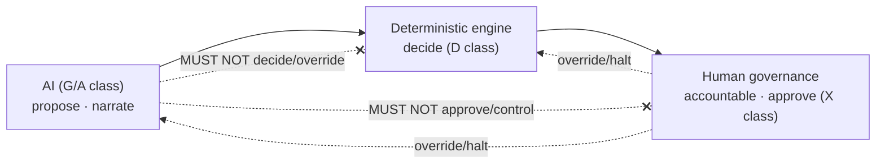
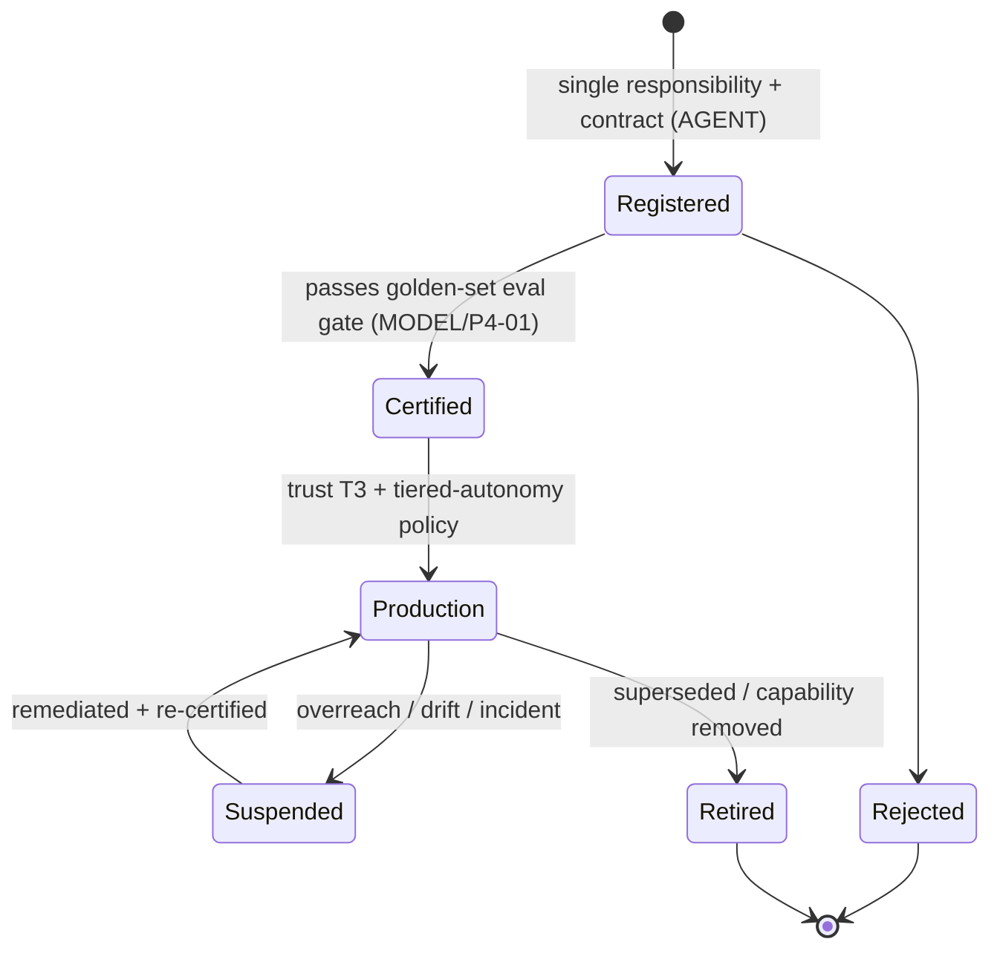

# AI Governance Rulebook

| Field                            | Value                                                                                                                                                          |
| -------------------------------- | -------------------------------------------------------------------------------------------------------------------------------------------------------------- |
| **Rulebook ID**                  | RB-15                                                                                                                                                          |
| **Framework code / rule prefix** | `AIGOV`                                                                                                                                                        |
| **Tier**                         | 3 (Rulebook) — apex of the AI-cluster                                                                                                                          |
| **Owner**                        | Head of AI / ML Platform (**HAI**)                                                                                                                             |
| **Co-signers**                   | Model Risk Committee (**MRC**), Governance & Risk Committee (**GRC**), Architecture Review Board (**ARB**), Head of Security (**CISO**, for security sections) |
| **Version**                      | 1.0.0                                                                                                                                                          |
| **Status**                       | PROPOSED (binding upon ARB ratification per Framework §10)                                                                                                     |
| **Last Ratified**                | — (pending)                                                                                                                                                    |
| **Supersedes**                   | —                                                                                                                                                              |

> **Reading note.** Tier-3 operational law and the **apex of the AI-cluster of rulebooks**. Subordinate to `CLAUDE.md` and the Architecture Canon; supreme over Agent/Workflow Contracts, Source Code, and — within the AI domain — governing the sibling rulebooks RB-16 · MODEL, RB-17 · PROMPT, RB-18 · AGENT, RB-19 · MEM (which own their respective mechanisms). It defines _AI role boundaries and governance_, not prompt/model/agent implementation. This document binds **every AI agent, workflow, prompt, model, and human operator** equally.

---

## 2. Purpose

To define the immutable governance for all AI capabilities on the platform: precisely **what AI MAY do, MUST do, MUST NOT do; what only deterministic systems may do; and what only humans may approve.** This rulebook is the single authority on **AI role boundaries, the deterministic-engine mandate, human accountability, AI capability/trust classification, the AI risk taxonomy, hallucination/uncertainty/evidence standards, and AI explainability/traceability/audit/incident handling** (Framework §5, §8 SSOT map, AIGOV row).

Its governing intent is `CLAUDE.md` AI-1..AI-8, LLM-1..4, DE-1..4, and the audit's central AI finding: LLMs belong at fuzzy edges, not in deterministic decision paths; wrapping validation/risk/allocation in non-deterministic agents is a control and reproducibility failure (REVIEW C3, C4).

## 3. Scope & Boundaries

**In scope (this rulebook is the authority):**

- AI governance principles; human-in-the-loop philosophy; AI capability classification and responsibility model (RACI).
- AI risk taxonomy; AI trust levels; approved and prohibited AI use cases.
- Deterministic-engine policy; human-override policy; AI decision-authority and recommendation policy.
- AI explainability, transparency, traceability, reproducibility (AI-decision provenance).
- Hallucination prevention; confidence/uncertainty reporting; evidence and citation requirements; fact-vs-hypothesis distinction.
- Human-review requirements; AI audit; AI incident/failure handling; AI rollback policy.
- Cross-cutting AI cost and performance governance principles.

**Out of scope (references only — Framework RBK-A2, RBK-DUP-1; these siblings own the mechanisms):**

- **Prompt versioning, review, testing, registry, injection-safety mechanics** → **RB-17 · PROMPT** (`P4-01`, `P4-03`).
- **Model registry, pinning, eval gates, drift monitoring, vendor/provider selection, benchmarking, continuous evaluation** → **RB-16 · MODEL** (`P4-01`).
- **Agent taxonomy, lifecycle, registration, certification, SRP/authority, inter-agent communication, planning, delegation, conflict/arbitration** → **RB-18 · AGENT** (`P4-02`, `P4-04`, `P4-05`, `P2-07`).
- **Memory governance, long/short-term memory, knowledge-base usage, retrieval/RAG governance, contradiction/confidence/scoping** → **RB-19 · MEM** (`P4-06`, `P3-14`).
- **Security, privacy, compliance, secrets, exfiltration, trust/quarantine _mechanism_, tool/MCP security** → **RB-27 · SEC** (`P1-09`), with quarantine mechanism `P4-03`.
- **Cost accounting mechanism** → **RB-29 · PERF** / research-cost (`P5-06`); **reproducibility manifests** → **RB-05 · REPRO** (`P1-02`).
- **Decision domains AI may never own** → **RB-01 · STAT** (significance), **RB-04 · VAL** (validation), **RB-13 · RISK** (risk/halts), **RB-12 · PORT** (allocation), **RB-11 · BT** (promotion), **RB-10/09 · FAR** (acceptance), **RB-14 · EXEC** (execution).

AIGOV sets the _principles and role boundaries_; the siblings define _mechanism_; the decision-owning rulebooks define _the deterministic decisions AI may never make_. Requirements over out-of-scope items are **governance conditions** citing the owner.

## 4. Constitutional Basis (`CLAUDE.md`)

Traces to and operationalizes: **AI-1..AI-8** (AI governance), **LLM-1..LLM-4** (LLM usage policy), **DE-1..DE-4** (deterministic engine policy), **APR-1..APR-3** (AI prompt rules), **PE-1..PE-4** (prompt engineering), **HO-1..HO-4** (human override/accountability), **CP-4** (reproducibility), **CP-5** (separation of powers), **CP-7** (audit), and the entrenched Forbidden Practices **FB-1..FB-4**. This rulebook restates none of these; it makes them operational and checkable (RBK-A2, CP-1).

## 5. Architectural Basis (Architecture Canon)

Grounded in ARCH **§2.11** (Agent Mesh), **§5** (Agent Communication), **§6** (Memory), **§8** (invariants); PATCH **P1-03** (remove LLMs from deterministic paths), **P4-01** (Model Registry + eval gate), **P4-02** (Agent Registry), **P4-03** (Trust/Quarantine layer), **P4-04** (Agent role rationalization), **P4-05** (Blackboard arbiter), **P4-06** (Memory redesign), **P4-07** (Prioritization as transparent optimization), **P2-07** (Isolation Barrier), **P1-02** (reproducibility of stochastic artifacts); REVIEW **C3** (LLM decision-authority), **C4** (reproducibility), the **AI Architecture Risks** section (agents that should not exist, overlaps, missing agents, generator-defeats-validator), **M6** (security).

## 6. Definitions

Constitutional and peer-rulebook glossary terms are **not** redefined. AI-governance-specific terms are in §Glossary. Higher tiers govern collisions.

---

## Rule Format

**Pivotal rules** carry the full block: _Purpose · Rationale · Acceptance · Failure · Refs_. **Supporting rules** carry RFC 2119 force plus a one-line rationale. Every rule has a stable ID (`AIGOV-n`, continuous) and traces to a constitutional basis.

---

# ABSOLUTE RULES (entrenched — non-waivable)

These restate the platform's entrenched AI prohibitions in operational form. They admit **no exception** (AM-2) and each maps to `CLAUDE.md` entrenched clauses.

- **AIGOV-A1.** AI/LLMs MUST NOT make production trading decisions (AI-1, FB-1).
- **AIGOV-A2.** AI/LLMs MUST NOT validate or assert statistical significance (AI-2, FB-2).
- **AIGOV-A3.** AI/LLMs MUST NOT approve experiments, promotions, or deployments (AI-3, FB-3).
- **AIGOV-A4.** AI/LLMs MUST NOT bypass, override, or reconfigure deterministic systems or governance gates (AI-4, FB-4).
- **AIGOV-A5.** AI/LLMs MUST NOT access the OOS/holdout vault or cross the generator↔validator isolation barrier (AI-5, `P2-07`).
- **AIGOV-A6.** AI/LLMs MUST NOT fabricate evidence, data, citations, or results.
- **AIGOV-A7.** AI MUST report uncertainty and MUST distinguish facts from hypotheses.
- **AIGOV-A8.** AI MUST cite evidence whenever available.
- **AIGOV-A9.** Humans retain final accountability for every consequential outcome (HO-1).
- **AIGOV-A10.** Deterministic systems retain final execution and decision authority for all consequential decisions (DE-1).

---

# RULES

## Philosophy

- **AIGOV-1 (MUST).** AI MUST be treated as a powerful, fallible _assistant at the fuzzy edges_ of research — not as a decision-maker. Determinism is the default; intelligence is the exception. _Rationale:_ `CLAUDE.md` philosophy §4, REVIEW C3; the platform's misjudgment risk is treating "LLM agent" as the default unit of work. _Refs:_ AIGOV-10, AIGOV-15.
- **AIGOV-2 (MUST).** The value of AI is throughput and breadth of exploration under constraint, never the circumvention of a control. Any AI use that erodes a scientific, statistical, or risk control is PROHIBITED regardless of productivity gain. _Rationale:_ CP-1, PR-CONF-2; no expedience justifies a control breach. _Refs:_ AIGOV-A1..A10.
- **AIGOV-3 (MUST NOT).** AI MUST NOT be anthropomorphized into holding authority or accountability; authority is held by deterministic engines and humans. _Rationale:_ HO-1, DE-1; misplaced trust in AI authority is automation bias. _Refs:_ AIGOV-40.

## AI Governance Principles

- **AIGOV-4 (MUST).** Every AI capability MUST be classified (AIGOV-9), trust-leveled (AIGOV-13), scoped to a single responsibility (via RB-18 · AGENT), bound to a pinned model (via RB-16 · MODEL), and governed by a versioned prompt (via RB-17 · PROMPT) before use. _Rationale:_ ungoverned AI is unbounded risk. _Acceptance:_ no AI capability operates without classification, trust level, scope, model binding, and prompt version. _Failure:_ an unclassified or ungoverned AI capability in use. _Refs:_ AIGOV-9, AIGOV-13.
- **AIGOV-5 (MUST).** All AI governance parameters (trust thresholds, review requirements, cost budgets, eval-gate criteria) MUST be set by governance (HAI/MRC/GRC) and changed only through the Exceptions process. _Rationale:_ CP-1; controls belong to governance.

## Human-in-the-Loop Philosophy

- **AIGOV-6 (MUST).** Consequential AI outputs MUST pass through a deterministic engine or a human with authority before affecting any decision; the AI output is never itself the decision. _Rationale:_ LLM-3, DE-1, APR-2; the human/deterministic checkpoint is the safety boundary. _Refs:_ AIGOV-30.
- **AIGOV-7 (MUST).** Human oversight MUST scale via tiered autonomy (`P5-05`): low-risk AI-assisted actions MAY be automated within policy; high-consequence actions MUST be escalated; a statistical sample of automated actions MUST be audited. Humans MUST NOT be reduced to rubber stamps. _Rationale:_ M7; uniform human gating neither scales nor preserves control. _Refs:_ AIGOV-59.

## AI Capability Classification

- **AIGOV-8 (MUST).** Every AI capability MUST be classified into exactly one capability class below; the class determines its permitted authority. _Rationale:_ class-based governance is precise and enforceable. _Refs:_ AIGOV-16, AIGOV-17.

**AI capability classification (authority by class):**

| Class                        | Description                                      | AI authority                                  | Examples                                                                |
| ---------------------------- | ------------------------------------------------ | --------------------------------------------- | ----------------------------------------------------------------------- |
| **G — Generative**           | Creative/exploratory production                  | Propose only (advisory)                       | idea generation, hypothesis drafting, literature synthesis, narration   |
| **A — Analytical/Assistive** | Extraction/summarization/classification/proposal | Propose, must be verified                     | summarize filings, classify, propose priorities, draft attribution text |
| **D — Decision**             | Consequential adjudication                       | **PROHIBITED for AI — deterministic only**    | significance, validation, risk halt, allocation, promotion, execution   |
| **X — Control/Governance**   | Setting/altering controls                        | **PROHIBITED for AI — human/governance only** | setting limits, approving overrides, changing gates                     |

- **AIGOV-9 (MUST NOT).** An AI capability classified G or A MUST NOT be used to perform a D or X function; capability-class escalation is PROHIBITED. _Rationale:_ AI-1..AI-4; scope creep from assist to decide is the core failure. _Refs:_ AIGOV-A1..A4.

## AI Responsibility Model

- **AIGOV-10 (MUST).** Responsibility for every AI-touched activity MUST follow the responsibility matrix below; the matrix is authoritative for "who may do what." _Rationale:_ HO-1, DE-1, CP-5; clear responsibility prevents authority creep.

**AI Responsibility Matrix (RACI-style; A = Accountable, R = Responsible-executor, C = Consulted, I = Informed):**

| Activity                           | AI          | Deterministic engine        | Human (role)       |
| ---------------------------------- | ----------- | --------------------------- | ------------------ |
| Generate ideas / hypotheses        | R (propose) | —                           | A (owner)          |
| Draft experiment design            | R (propose) | —                           | A / C              |
| Compute analytics / features       | R (assist)  | R (compute)                 | A                  |
| **Validate / assert significance** | —           | **R + A(engine authority)** | A (governance)     |
| **Decide risk halt / limits**      | —           | **R**                       | **A (RISK)**       |
| **Decide allocation / sizing**     | —           | **R**                       | **A (PORT)**       |
| **Approve promotion / deployment** | —           | R (gate)                    | **A (GRC/human)**  |
| **Execute orders**                 | —           | **R**                       | A (RISK/DEPLOY)    |
| Narrate / explain a decision       | R           | —                           | I                  |
| Set/alter a control                | —           | —                           | **A (governance)** |

## AI Risk Taxonomy

- **AIGOV-11 (MUST).** Every AI deployment MUST identify and control its material AI risks per the taxonomy below; unlisted risks are treated as uncontrolled. _Rationale:_ named risk is manageable risk. _Refs:_ AIGOV-33.

**AI risk taxonomy (each MUST have a control and an owner):**

| Risk                          | Description                                  | Primary control                                 | Owner        |
| ----------------------------- | -------------------------------------------- | ----------------------------------------------- | ------------ |
| **Hallucination/fabrication** | invented facts/citations/results             | evidence + citation + verification (AIGOV-33)   | AIGOV/PROMPT |
| **Prompt injection**          | untrusted input hijacks instructions         | trust/quarantine (`P4-03`)                      | RB-17/27     |
| **Data poisoning**            | adversarial content corrupts research/memory | quarantine + provenance                         | RB-19/27     |
| **Non-determinism**           | unrepeatable outputs                         | stochastic classification + recording (`P1-02`) | AIGOV/REPRO  |
| **Model drift**               | behavior changes on upgrade                  | pinning + eval gate (`P4-01`)                   | RB-16        |
| **Scope creep / overreach**   | assist role performs decide role             | capability-class enforcement (AIGOV-9)          | AIGOV        |
| **Automation bias**           | humans over-trust AI                         | uncertainty + human skepticism (AIGOV-41)       | AIGOV        |
| **Isolation-barrier leakage** | generator learns from validation             | bus ACLs + memory scoping (`P2-07`)             | RB-18/19     |
| **Cost runaway**              | unbounded AI spend                           | cost budget + backpressure (`P5-06`)            | AIGOV/PERF   |

## AI Trust Levels

- **AIGOV-12 (MUST).** AI capabilities and agents MUST carry a trust level that gates their permitted autonomy; trust MUST be earned via evaluation (RB-16 · MODEL eval gate) and is revocable. _Rationale:_ trust is earned and losable, never default (DATA-3 analog). _Refs:_ AIGOV-13, AIGOV-46.

**AI trust levels:**

| Level                 | Meaning                   | Permitted autonomy                                 |
| --------------------- | ------------------------- | -------------------------------------------------- |
| **U — Untrusted**     | external ingested content | quarantine only; data, never instruction (`P4-03`) |
| **T1 — Experimental** | new/unproven agent        | sandbox; human-reviewed outputs                    |
| **T2 — Certified**    | passed eval gate          | narrate/assist within scope; sampled audit         |
| **T3 — Production**   | sustained reliability     | tiered-autonomy assist within policy               |

- **AIGOV-13 (MUST).** Untrusted external content (U) MUST be treated as data, never as instructions, and MUST pass the trust/quarantine boundary before influencing any research, memory, or decision (mechanism owned by RB-17 · PROMPT / RB-27 · SEC / `P4-03`). _Rationale:_ APR-1, REVIEW C3; prompt injection defense. _Refs:_ AIGOV-33.

## Approved AI Use Cases

- **AIGOV-14 (MAY).** AI MAY: generate ideas and draft falsifiable hypotheses; review and synthesize literature; research companies; propose experiment designs; compute and summarize analytics; propose research priorities; draft human-readable narratives, reports, and explanations; and assist code/documentation authoring — all as advisory outputs subject to verification and human/deterministic checkpoints. _Rationale:_ LLM-1; these are the legitimate fuzzy-edge roles. _Refs:_ AIGOV-8 (Class G/A).

## Prohibited AI Use Cases

- **AIGOV-15 (MUST NOT).** AI MUST NOT: make trading/risk/allocation/sizing decisions; validate or assert significance; approve experiments/promotions/deployments; execute orders; set or alter limits, gates, or controls; access OOS/holdout or cross the isolation barrier; unilaterally set the research agenda; or certify data/models. _Rationale:_ AI-1..AI-5, LLM-2, `P4-07`; these are D/X-class functions reserved for deterministic engines and humans. _Refs:_ AIGOV-A1..A10, AIGOV-9.

## Deterministic Engine Policy

- **AIGOV-16 (MUST).** Every consequential decision — significance, validation, risk, allocation, promotion, deployment, execution — MUST be produced by a deterministic, versioned, golden-tested, reproducible engine (owned by the respective decision rulebook); an LLM MUST NOT be in the decision path. _Rationale:_ DE-1, `P1-03`, REVIEW C3; determinism is required for reproducibility, testability, and auditability. _Acceptance:_ every consequential decision traces to a deterministic engine run. _Failure:_ any LLM output constituting or altering a consequential decision. _Refs:_ AIGOV-A10, RB-01/04/11/12/13/14.
- **AIGOV-17 (MUST).** Where fuzzy judgment previously lived in an LLM decision, it MUST be re-expressed as explicit, testable rules or metrics in a deterministic engine (DE-4). _Rationale:_ judgment must be made auditable, not removed. _Refs:_ AIGOV-16.

## Human Override Policy

- **AIGOV-18 (MUST).** Humans MAY override or halt AI proposals at any time; AI MUST NOT override a human governance decision (HO-1). Human overrides of gates/limits MUST be recorded with rationale and counter-signed for capital-affecting cases (HO-2). _Rationale:_ human authority is supreme over AI; overrides must be accountable. _Refs:_ AIGOV-A9.
- **AIGOV-19 (MUST NOT).** Human override MUST NOT be used to let AI bypass statistical/risk/validation controls (HO-3); such an override is void. _Rationale:_ the controls bind the human-AI pair, not just AI. _Refs:_ RMET-91.

## AI Decision Authority

- **AIGOV-20 (MUST).** AI holds **no** decision authority for D or X class functions. AI authority is limited to _proposing_ (G/A) and _narrating_. _Rationale:_ AI-1..AI-4, DE-1. _Refs:_ AIGOV-10.

## AI Recommendation Policy

- **AIGOV-21 (MUST).** AI recommendations MUST be labeled as recommendations (not decisions or facts), carry their evidence and uncertainty (AIGOV-33/34), and be independently verifiable before adoption. _Rationale:_ prevents recommendations being mistaken for authority. _Refs:_ AIGOV-6.

## AI Validation Policy

- **AIGOV-22 (MUST NOT).** AI MUST NOT perform validation adjudication (significance, PBO, robustness verdicts); AI MAY draft or narrate validation _reports_ that explain deterministic verdicts (AI-2). _Rationale:_ validation is deterministic (STAT/VAL). _Refs:_ STAT-3, VS-1.

## AI Audit Requirements

- **AIGOV-23 (MUST).** Every AI-touched consequential activity MUST be auditable: the model version, prompt version, inputs, outputs, and the deterministic/human checkpoint that consumed the output MUST be recorded (`P1-02`). _Rationale:_ CP-7, CP-4; AI provenance is required for audit and reproducibility. _Acceptance:_ an auditor can reconstruct any AI-assisted decision path. _Failure:_ an AI output influencing a decision with no recorded provenance. _Refs:_ AIGOV-26, RB-16, RB-17.
- **AIGOV-24 (MUST).** AI usage MUST be periodically audited (cadence GRC-governed) for scope compliance, overreach, hallucination rate, and isolation-barrier integrity. _Rationale:_ CP-7; unaudited AI drifts.

## AI Explainability / Transparency / Traceability / Reproducibility

- **AIGOV-25 (MUST).** Any AI contribution to a consequential outcome MUST be explainable and transparent: it MUST state what it produced, on what evidence, with what uncertainty, and be traceable to its model/prompt/inputs. Opaque AI influence on consequential outcomes is PROHIBITED. _Rationale:_ EXP-2, CP-7; unexplainable AI cannot be governed. _Refs:_ AIGOV-23.
- **AIGOV-26 (MUST).** AI-produced artifacts MUST be classified **stochastic** and recorded to their exact output (model id/version/params + prompt hash + output hash, `P1-02`); they MUST NOT be presented as numerically re-derivable (CP-4, RP-3). _Rationale:_ C4; LLM outputs break the deterministic reproducibility definition and must be handled as recorded artifacts. _Refs:_ RB-05 · REPRO.

## Hallucination Prevention

- **AIGOV-27 (MUST).** AI outputs used in research MUST be grounded in verifiable evidence; claims without evidence MUST be labeled as unverified hypotheses and MUST NOT be treated as facts. _Rationale:_ AIGOV-A6/A7; ungrounded generation is fabrication risk. _Acceptance:_ factual claims carry citations; unverified claims are labeled. _Failure:_ an AI-asserted "fact" with no evidence used as if verified. _Refs:_ AIGOV-33, AIGOV-35.
- **AIGOV-28 (MUST NOT).** AI MUST NOT fabricate data, citations, quotations, results, or provenance; fabricated content is a terminal integrity violation. _Rationale:_ AIGOV-A6, RMET-12; fabrication corrupts the scientific record. _Refs:_ AIGOV-F-\*.

## Confidence & Uncertainty Reporting

- **AIGOV-29 (MUST).** AI outputs MUST report calibrated confidence/uncertainty appropriate to the task; a confident-sounding output with hidden uncertainty is PROHIBITED. _Rationale:_ AIGOV-A7; uncertainty transparency counters automation bias. _Refs:_ AIGOV-41.
- **AIGOV-30 (MUST).** Downstream consumers (deterministic engines, humans) MUST treat AI confidence as advisory, never as a substitute for deterministic verification. _Rationale:_ DE-1; AI confidence is not evidence. _Refs:_ AIGOV-6.

## Evidence & Citation Requirements

- **AIGOV-31 (MUST).** Whenever evidence exists, AI MUST cite it (source, as-of where applicable) so claims are independently checkable; uncited factual claims MUST be flagged. _Rationale:_ AIGOV-A8, CP-7. _Refs:_ AIGOV-27.
- **AIGOV-32 (MUST).** AI MUST clearly distinguish **facts** (evidenced), **hypotheses** (proposed, to be tested), and **speculation**; conflating them is PROHIBITED. _Rationale:_ AIGOV-A7, RMET-48; import ≠ truth. _Refs:_ RMET-48.

## Human Review Requirements

- **AIGOV-33 (MUST).** AI outputs feeding a promotion-track or capital-affecting path MUST receive human review appropriate to their consequence tier (tiered autonomy, `P5-05`); the reviewer MUST verify grounding, uncertainty, and scope compliance. _Rationale:_ HO, M7; human review is the backstop for AI fallibility. _Refs:_ AIGOV-7.
- **AIGOV-34 (SHOULD).** Reviewers SHOULD apply active skepticism to AI conclusions, treating them as proposals requiring evidence (counter automation bias). _Rationale:_ RMET-92.

## AI Agent Governance (taxonomy, lifecycle, collaboration)

> **Boundary note.** Agent _taxonomy, lifecycle, registration, certification, SRP/authority, communication, planning, delegation, conflict/arbitration_ are owned by **RB-18 · AGENT** (`P4-02/04/05`). AIGOV states the governing _principles_.

- **AIGOV-35 (MUST).** Every agent MUST have exactly one responsibility, a declared authority of `propose`/`narrate` (never `decide` for D/X), a bound pinned model, and a versioned prompt; multi-responsibility or decision-authority agents are PROHIBITED (mechanism per RB-18 · AGENT / `P4-04`). _Rationale:_ AG-1, `P1-03`; one-agent-one-job and no-decision-authority are foundational. _Refs:_ RB-18 · AGENT.
- **AIGOV-36 (MUST).** Agents MUST communicate only via the message bus and immutable artifacts, with topic ACLs enforcing the generator↔validator isolation barrier (mechanism per RB-18 · AGENT / `P2-07`); generation agents MUST NOT observe validation/OOS outcomes. _Rationale:_ AC-1/3, AD-3; the deepest quant risk (REVIEW). _Refs:_ RMET-86, FAR-74.
- **AIGOV-37 (MUST).** Multi-agent collaboration MUST resolve to a single deterministic-arbiter verdict with explicit completion criteria (mechanism per RB-18 · AGENT / `P4-05`); implicit consensus is PROHIBITED. _Rationale:_ AC-2; debate without arbitration yields unaccountable mush. _Refs:_ RB-18 · AGENT.
- **AIGOV-38 (MUST).** Agent lifecycle (register → certify via eval gate → promote → monitor → retire) MUST be governed; only certified (T2+) agents MAY operate in production scope (mechanism per RB-18 · AGENT + RB-16 · MODEL). _Rationale:_ ungoverned agents are unbounded risk. _Refs:_ AIGOV-46.

## Planning, Delegation, Conflict, Escalation

- **AIGOV-39 (MUST).** AI-driven planning/prioritization MUST be a _proposal_ to a transparent, auditable optimization or a human; a single LLM MUST NOT unilaterally set the research agenda (`P4-07`). _Rationale:_ AD, CP-5; opaque agenda-setting amplifies bias (REVIEW AI risks). _Refs:_ RMET-75.
- **AIGOV-40 (MUST).** Task delegation among agents MUST preserve single-responsibility and authority boundaries; an agent MUST NOT delegate a function it is itself prohibited from performing. _Rationale:_ prevents authority laundering via delegation. _Refs:_ AIGOV-35.
- **AIGOV-41 (MUST).** AI-related conflicts (contradictory agent outputs, ambiguous authority) MUST be resolved by the deterministic arbiter or escalated to a human; they MUST NOT be resolved by an LLM asserting a decision. _Rationale:_ AC-2, DE-1. _Refs:_ AIGOV-37.
- **AIGOV-42 (MUST).** AI incidents (fabrication, injection, overreach, isolation breach, runaway cost) MUST be escalated immediately and halt the affected AI activity (mechanism per RB-31 · INC). _Rationale:_ these are terminal AI risks. _Refs:_ AIGOV-55.

## Model Governance (selection, vendor independence, evaluation)

> **Boundary note.** Model _registry, pinning, eval gates, drift, vendor/provider selection, benchmarking, continuous evaluation_ are owned by **RB-16 · MODEL** (`P4-01`). AIGOV states the governing _principles_.

- **AIGOV-43 (MUST).** Every AI capability MUST run a model pinned and bound in the Model Registry; use of an unpinned/"latest" model is PROHIBITED (mechanism per RB-16 · MODEL / `P4-01`). _Rationale:_ AI-6; unpinned models cause untracked behavioral drift. _Refs:_ RB-16 · MODEL.
- **AIGOV-44 (MUST).** No model upgrade MAY reach a production agent without passing the golden-set behavioral eval gate; drift MUST be monitored (mechanism per RB-16 · MODEL). _Rationale:_ M5; silent upgrades change all agent behavior. _Refs:_ AIGOV-46.
- **AIGOV-45 (SHOULD).** The platform SHOULD preserve **vendor independence**: AI capabilities SHOULD be portable across providers behind stable internal interfaces, and provider switching SHOULD be possible without changing an agent's responsibility (mechanism per RB-16 · MODEL). _Rationale:_ ARCH §0; an agent is defined by responsibility+contract, not its brain. _Refs:_ RB-16 · MODEL.

## Continuous Evaluation & Benchmarking

- **AIGOV-46 (MUST).** AI capabilities MUST be continuously evaluated against golden sets and behavioral benchmarks; degradation beyond threshold MUST suspend the capability pending review (mechanism per RB-16 · MODEL, RB-28 · OBS). _Rationale:_ AI drifts; continuous eval catches it. _Refs:_ AIGOV-44.

## Prompt Governance

> **Boundary note.** Prompt _versioning, review, testing, registry, injection-safety mechanics_ are owned by **RB-17 · PROMPT** (`P4-01`, `P4-03`). AIGOV states the governing _principles_.

- **AIGOV-47 (MUST).** Prompts influencing consequential outputs MUST be versioned artifacts with recorded hashes, reviewed, and tested via a golden-set before production use (mechanism per RB-17 · PROMPT); an unversioned or unreviewed consequential prompt is PROHIBITED. _Rationale:_ PE-1..PE-4; prompts are code for AI behavior. _Refs:_ RB-17 · PROMPT.
- **AIGOV-48 (MUST).** Prompts MUST NOT instruct an AI to perform a prohibited role (AIGOV-15) or to bypass a control; untrusted content in a prompt MUST be delimited as data (APR-1). _Rationale:_ PE-2, APR-1..3. _Refs:_ AIGOV-13.

## Memory, Retrieval & RAG Governance

> **Boundary note.** Memory/RAG/retrieval/knowledge-base _mechanism, scoping, confidence, contradiction_ are owned by **RB-19 · MEM** (`P4-06`, `P3-14`). AIGOV states the governing _principles_.

- **AIGOV-49 (MUST).** AI memory and retrieval MUST respect scoping: validation/OOS-derived knowledge MUST NOT be readable by generation agents (isolation), and every memory item MUST carry provenance and decaying confidence (mechanism per RB-19 · MEM / `P4-06`). _Rationale:_ MEM-1..4, AD-3; unscoped memory leaks to generators and poisons research. _Refs:_ AIGOV-36.
- **AIGOV-50 (MUST).** Retrieval-augmented generation MUST cite retrieved sources with provenance and MUST NOT present retrieved-but-unverified content as fact (AIGOV-31/32); retrieved untrusted content MUST be quarantined (`P4-03`). _Rationale:_ RAG grounding and injection defense. _Refs:_ AIGOV-13.
- **AIGOV-51 (MUST).** Contradictions surfaced in memory/knowledge MUST be quarantined and escalated, never silently resolved by an AI (mechanism per RB-19 · MEM). _Rationale:_ MEM-2; AI-resolved contradictions hide inconsistency. _Refs:_ RB-19 · MEM.

## Tool & MCP Governance

- **AIGOV-52 (MUST).** Agent tool/MCP usage MUST be limited to capabilities explicitly granted in the agent contract (default-deny); an agent MUST NOT invoke tools outside its scope or use a tool to perform a prohibited function (mechanism per RB-18 · AGENT, security per RB-27 · SEC). _Rationale:_ ACON-2; ungoverned tool access is authority laundering and a security hole. _Refs:_ AIGOV-40, RB-27 · SEC.
- **AIGOV-53 (MUST).** Tools that read data MUST go through the certified as-of read layer (DATA/PIT); tools MUST NOT give AI access to raw/uncertified/non-as-of data or the OOS vault. _Rationale:_ DATA-98, AI-5. _Refs:_ DATA-98.

## External Knowledge Policy

- **AIGOV-54 (MUST).** External knowledge (web, literature, news, filings) ingested by AI MUST be treated as untrusted (U), quarantined, provenance-tagged, and treated as hypotheses to test — never as authoritative facts or instructions (`P4-03`). _Rationale:_ REVIEW C3, RMET-48; external content can be wrong or adversarial. _Refs:_ AIGOV-13, RMET-47.

## Security, Privacy, Compliance

> **Boundary note.** Security/privacy/compliance _mechanism_ is owned by **RB-27 · SEC** (`P1-09`). AIGOV states the AI-specific _requirement_.

- **AIGOV-55 (MUST).** AI systems MUST be governed for security: prompt injection and data poisoning are first-order threats (controls per RB-27 · SEC / `P4-03`); AI MUST NOT be a channel for exfiltrating crown-jewel alpha/factor definitions. _Rationale:_ SEC-2/5, M6; AI expands the attack surface. _Refs:_ RB-27 · SEC.
- **AIGOV-56 (MUST).** AI MUST handle data per its sensitivity classification and MUST NOT emit secrets, restricted data, or un-provenanced data into outputs, memory, or logs. _Rationale:_ SEC, FB-14. _Refs:_ DATA-102.
- **AIGOV-57 (MUST).** AI use MUST comply with model-provider terms, licensing, and jurisdictional constraints (mechanism per RB-27 · SEC / governance). _Rationale:_ legal/reputational risk.

## Cost & Performance Governance

- **AIGOV-58 (MUST).** AI compute/token spend MUST be attributed and bounded by budgets with backpressure (mechanism per `P5-06`); unbounded AI spend is PROHIBITED, and cost backpressure MUST throttle generation before it floods downstream controls. _Rationale:_ M5; a runaway AI factory is both a cost and a statistical-integrity risk (more trials → more deflation burden). _Refs:_ STAT-19, AIGOV-11.
- **AIGOV-59 (MUST).** AI performance (latency, reliability, quality) MUST be monitored; capabilities failing performance SLAs MUST be suspended or replaced (mechanism per RB-28 · OBS, RB-16 · MODEL). _Rationale:_ unreliable AI degrades the platform.

## AI Incident Response, Failure Handling & Rollback

- **AIGOV-60 (MUST).** AI failures (fabrication, injection, overreach, isolation breach, drift, runaway cost) MUST have defined detection, containment, and rollback; the affected AI capability MUST be suspendable instantly without halting deterministic operations. _Rationale:_ RE, RS; AI failure must degrade safely and not take down the deterministic core. _Acceptance:_ AI capabilities are independently suspendable; incidents recorded with RCA. _Failure:_ an AI failure that corrupts decisions or cannot be contained. _Refs:_ AIGOV-42, RB-31 · INC.
- **AIGOV-61 (MUST).** Because deterministic engines hold decision authority (AIGOV-16), suspending all AI MUST NOT prevent the platform from operating its deterministic controls, risk halts, and audited processes. _Rationale:_ DE-1; the platform must survive total AI loss. _Refs:_ AIGOV-A10.

## Governance & Accountability

- **AIGOV-62 (MUST).** Every AI capability MUST have a named human owner accountable for its behavior, scope, and outcomes; accountability MUST NOT be delegated to the AI (HO-1). _Rationale:_ AI cannot bear institutional accountability. _Refs:_ RMET-90.
- **AIGOV-63 (MUST).** AI governance, model risk (MRC), and the functions AI assists MUST remain independent (CP-5); an AI capability MUST NOT both assist and adjudicate the same activity. _Rationale:_ separation of powers extends to AI. _Refs:_ AIGOV-10.

---

## Acceptance Criteria (AI capability approval)

An AI capability is **approved for use** only when **all** hold (cumulative):

**AI capability approval checklist:**

- [ ] Classified (G/A only for use; D/X prohibited) and trust-leveled (AIGOV-8, AIGOV-12).
- [ ] Single responsibility; authority `propose`/`narrate` only; named human owner (AIGOV-35, AIGOV-62).
- [ ] Model pinned + eval-gate passed; drift monitoring on (AIGOV-43, AIGOV-44).
- [ ] Prompt versioned, reviewed, tested; untrusted content delimited (AIGOV-47, AIGOV-48).
- [ ] Memory/retrieval scoped; isolation barrier enforced (AIGOV-49, AIGOV-36).
- [ ] Tool access default-deny within contract; data only via as-of layer (AIGOV-52, AIGOV-53).
- [ ] Outputs carry evidence, citations, uncertainty; facts vs hypotheses distinguished (AIGOV-27, AIGOV-31, AIGOV-32).
- [ ] Provenance recorded (model/prompt/output hashes); auditable (AIGOV-23, AIGOV-26).
- [ ] Cost budgeted; performance SLA defined; incident/rollback path defined (AIGOV-58, AIGOV-60).
- [ ] Consequential outputs pass a deterministic/human checkpoint (AIGOV-6).

## Rejection / Suspension Criteria

An AI capability MUST be **rejected or suspended** if **any** hold:

- **AIGOV-64.** Performs or attempts a D/X-class function (decides significance/risk/allocation/promotion/execution; sets a control) (AIGOV-9, AIGOV-15).
- **AIGOV-65.** Fabricates evidence/data/citations/results (AIGOV-28).
- **AIGOV-66.** Crosses the isolation barrier or accesses OOS/holdout (AIGOV-36, AIGOV-A5).
- **AIGOV-67.** Runs an unpinned model, or a model that failed/skipped the eval gate (AIGOV-43, AIGOV-44).
- **AIGOV-68.** Uses an unversioned/unreviewed consequential prompt, or is steered by unquarantined untrusted content (AIGOV-47, AIGOV-13).
- **AIGOV-69.** Emits secrets/restricted/un-provenanced data (AIGOV-56).
- **AIGOV-70.** Lacks recorded provenance for an output that influenced a decision (AIGOV-23).
- **AIGOV-71.** Exceeds cost budget without backpressure, or fails performance SLA (AIGOV-58, AIGOV-59).

## Anti-Patterns

Recognized AI failure modes that MUST be actively prevented (mirrors `CLAUDE.md` AP-\*, REVIEW):

- **AIGOV-AP-1.** Treating "LLM agent" as the default unit of work instead of the exception (AIGOV-1; REVIEW C3).
- **AIGOV-AP-2.** LLM in a deterministic decision path (validation/risk/allocation/promotion) (AIGOV-16).
- **AIGOV-AP-3.** Capability-class escalation: an assist agent quietly performing a decision (AIGOV-9).
- **AIGOV-AP-4.** Generator agent learning from validation/OOS via bus or memory (AIGOV-36, AIGOV-49).
- **AIGOV-AP-5.** Treating AI confidence or external/retrieved content as fact (AIGOV-30, AIGOV-54).
- **AIGOV-AP-6.** Unpinned/"latest" models; silent upgrades (AIGOV-43).
- **AIGOV-AP-7.** LLM setting the research agenda or resolving conflicts by assertion (AIGOV-39, AIGOV-41).
- **AIGOV-AP-8.** Authority laundering via delegation or tool use (AIGOV-40, AIGOV-52).
- **AIGOV-AP-9.** Human rubber-stamping AI outputs (automation bias) (AIGOV-7, AIGOV-34).
- **AIGOV-AP-10.** AI provenance not recorded; unreproducible AI-influenced decisions (AIGOV-23, AIGOV-26).

## Forbidden AI Practices

Absolute prohibitions (entrenched; non-waivable). Violation suspends the AI capability and is a reportable integrity/security event (`CLAUDE.md` AI-\*, FB-1..4):

- **AIGOV-F-1.** AI making a production trading/risk/allocation/sizing decision (AIGOV-A1; FB-1).
- **AIGOV-F-2.** AI validating or asserting statistical significance (AIGOV-A2; FB-2).
- **AIGOV-F-3.** AI approving experiments/promotions/deployments (AIGOV-A3; FB-3).
- **AIGOV-F-4.** AI bypassing/overriding a deterministic system or governance gate (AIGOV-A4; FB-4).
- **AIGOV-F-5.** AI accessing OOS/holdout or crossing the isolation barrier (AIGOV-A5; `P2-07`).
- **AIGOV-F-6.** AI fabricating evidence, data, citations, results, or provenance (AIGOV-28).
- **AIGOV-F-7.** AI presenting unverified content as fact, or failing to report uncertainty (AIGOV-27, AIGOV-29).
- **AIGOV-F-8.** Running AI on an unpinned model or with an unversioned consequential prompt (AIGOV-43, AIGOV-47).
- **AIGOV-F-9.** AI emitting secrets/restricted data, or acting as an alpha-exfiltration channel (AIGOV-56, AIGOV-55).
- **AIGOV-F-10.** AI capability operating without a named human owner and recorded provenance (AIGOV-62, AIGOV-23).

---

## Enforcement & Verification

| Rule group                                              | Enforcement mechanism                                       | Mechanism owner                                            |
| ------------------------------------------------------- | ----------------------------------------------------------- | ---------------------------------------------------------- |
| Capability class / decision authority (AIGOV-8,9,16,20) | Authority flags; deterministic-engine mandate (fail-closed) | this rulebook; RB-18 · AGENT, decision rulebooks (`P1-03`) |
| Trust / quarantine (AIGOV-12,13,54)                     | Trust levels; quarantine boundary                           | RB-17 · PROMPT, RB-27 · SEC (`P4-03`)                      |
| Hallucination / evidence / uncertainty (AIGOV-27–32)    | Grounding + citation + verification gates                   | this rulebook; RB-17 · PROMPT                              |
| Provenance / reproducibility (AIGOV-23,26)              | Model/prompt/output hashing                                 | RB-05 · REPRO, RB-16 · MODEL (`P1-02`)                     |
| Model pinning / eval / drift (AIGOV-43–46)              | Registry + eval gate + drift monitors                       | RB-16 · MODEL (`P4-01`)                                    |
| Prompt governance (AIGOV-47,48)                         | Prompt registry + review + golden-set                       | RB-17 · PROMPT                                             |
| Memory / RAG / isolation (AIGOV-36,49–51)               | Scoping + ACLs + quarantine                                 | RB-18 · AGENT, RB-19 · MEM (`P2-07`,`P4-06`)               |
| Tool / MCP / data access (AIGOV-52,53)                  | Default-deny capabilities; as-of read layer                 | RB-18 · AGENT, RB-06/07/08 · DATA/PIT                      |
| Human review / tiered autonomy (AIGOV-7,33)             | Consequence-tiered gates + sampling audit                   | this rulebook (`P5-05`)                                    |
| Cost / performance (AIGOV-58,59)                        | Budgets + backpressure + SLA monitors                       | `P5-06`, RB-28 · OBS                                       |
| Incident / rollback (AIGOV-60,61)                       | Independent AI suspension; RCA                              | RB-31 · INC                                                |
| Forbidden practices (AIGOV-F-\*)                        | Fail-closed suspension; integrity/security report           | GRC / MRC                                                  |

- **AIGOV-E-1 (MUST).** Every rule enforcing a Forbidden AI Practice (AIGOV-F-_) or Absolute Rule (AIGOV-A_) MUST be technically enforced and fail-closed where possible (Framework RBK-E2, `P1-03`). _Rationale:_ CP-1, DE-1.
- **AIGOV-E-2 (MUST).** Enforcement of AI role boundaries MUST itself be deterministic (authority flags, ACLs, gates), not dependent on an LLM to police AI. _Rationale:_ an AI policing AI is not a control. _Refs:_ AIGOV-16.

## Exceptions & Waivers

- **AIGOV-W-1 (MUST).** No exception MAY be granted to any Absolute Rule (AIGOV-A*), Forbidden AI Practice (AIGOV-F-*), or `CLAUDE.md` entrenched clause (AM-2). Non-waivable.
- **AIGOV-W-2 (MAY).** GRC/HAI/MRC-governed AI parameters (trust thresholds, eval-gate criteria, cost budgets, review tiers) MAY be changed only by those bodies, recorded as a versioned parameter set with rationale, applied prospectively (VER-2).
- **AIGOV-W-3 (MAY).** A time-boxed waiver of a non-entrenched rule MAY be granted only by HAI + GRC (+ MRC for model-risk), recorded in the audit trail with scope, expiry, and rationale, and MUST NOT weaken the deterministic-engine mandate, isolation barrier, provenance/reproducibility, or human accountability. _Rationale:_ these are the load-bearing AI controls.
- **AIGOV-W-4 (MUST).** Active waivers MUST be surfaced on the affected AI capability's record. _Rationale:_ no hidden exceptions.

## Rulebook Acceptance Criteria (ratification)

Ratifiable (Framework §10) only when: every rule has a stable ID, RFC 2119 phrasing, a constitutional basis, and an enforcement mechanism; no rule contradicts `CLAUDE.md`, the Architecture Canon, or peer rulebooks per the SSOT map (especially the MODEL/PROMPT/AGENT/MEM/SEC boundaries and the decision rulebooks' ownership of D-class functions); all governance parameters have recorded defaults; the deterministic-engine mandate and human accountability are preserved; all cross-references resolve; ARB approval with HAI + MRC + GRC co-sign obtained.

## Success Metrics

- **SM-1.** 0 AI-made D/X-class decisions (significance/risk/allocation/promotion/execution/control) (AIGOV-16, AIGOV-F-1..4).
- **SM-2.** 0 fabrication incidents; 100% factual AI claims cited or labeled unverified (AIGOV-28, AIGOV-31).
- **SM-3.** 0 isolation-barrier breaches by AI; 0 AI accesses to OOS/holdout (AIGOV-36, AIGOV-F-5).
- **SM-4.** 100% AI capabilities on pinned, eval-gated models with versioned prompts (AIGOV-43, AIGOV-47).
- **SM-5.** 100% AI-influenced decisions with recorded model/prompt/output provenance (AIGOV-23).
- **SM-6.** AI spend within budget; backpressure engaged before downstream flooding (AIGOV-58).
- **SM-7.** Platform demonstrably operates deterministic controls with all AI suspended (AIGOV-61).

## Dependencies & Related Rulebooks

- **Governs (apex of AI-cluster):** RB-16 · MODEL, RB-17 · PROMPT, RB-18 · AGENT, RB-19 · MEM.
- **Coordinates with:** RB-27 · SEC (security/privacy/quarantine), RB-05 · REPRO (stochastic provenance), RB-28 · OBS (monitoring), RB-31 · INC (incidents), RB-29 · PERF (cost).
- **Constrains AI relative to decision owners:** RB-01 · STAT, RB-04 · VAL, RB-11 · BT, RB-10/09 · FAR, RB-12 · PORT, RB-13 · RISK, RB-14 · EXEC, RB-06/07/08 · DATA/PIT.
- **Architecture references:** ARCH §2.11, §5, §6, §8; PATCH `P1-03`, `P4-01..07`, `P2-07`, `P1-02`, `P5-05/06`; REVIEW C3, C4, AI-architecture risks, M6.

## Change Log & Version History

| Version | Date    | Author (role) | Change                                               | ADR |
| ------- | ------- | ------------- | ---------------------------------------------------- | --- |
| 1.0.0   | pending | HAI           | Initial AI Governance rulebook (apex of AI-cluster). | —   |

---

## Glossary (AI-governance-specific)

Terms in `CLAUDE.md` and peer-rulebook glossaries are not redefined.

- **Capability Class (G/A/D/X)** — The classification determining an AI capability's permitted authority: Generative, Analytical/Assistive (both propose-only), Decision, Control (both prohibited for AI) (AIGOV-8).
- **Trust Level (U/T1/T2/T3)** — The earned autonomy level of AI content/agents: Untrusted, Experimental, Certified, Production (AIGOV-12).
- **Deterministic-Engine Mandate** — The rule that all consequential decisions are made by deterministic, versioned, testable engines, never LLMs (AIGOV-16).
- **Stochastic Artifact** — An AI-produced output reproducible only to its recorded output, never numerically re-derivable (AIGOV-26).
- **Isolation Barrier** — The enforced air-gap preventing generation AI from observing validation/OOS outcomes (AIGOV-36; `P2-07`).
- **Quarantine (untrusted content)** — The sandboxed handling of external/ingested content as data, never instruction, before it may influence research/memory (AIGOV-13; `P4-03`).
- **Tiered Autonomy** — Consequence-scaled human oversight: automate low-risk within policy, escalate high-consequence, sample-audit the rest (AIGOV-7; `P5-05`).
- **Automation Bias** — The tendency to over-trust AI outputs; countered by uncertainty reporting and human skepticism (AIGOV-29, AIGOV-34).
- **Grounding** — Basing AI outputs on verifiable, cited evidence (AIGOV-27).

---

_End of AI Governance Rulebook (RB-15 · AIGOV). This is the apex of the AI-cluster: it owns AI role boundaries, the deterministic-engine mandate, human accountability, and AI trust/evidence/provenance standards. It governs — and references, never restates — RB-16 · MODEL, RB-17 · PROMPT, RB-18 · AGENT, RB-19 · MEM for their mechanisms, and constrains AI relative to the decision owners (STAT, VAL, BT, FAR, PORT, RISK, EXEC, DATA). AI proposes and narrates; deterministic engines decide; humans remain accountable. Binding upon ARB ratification._
