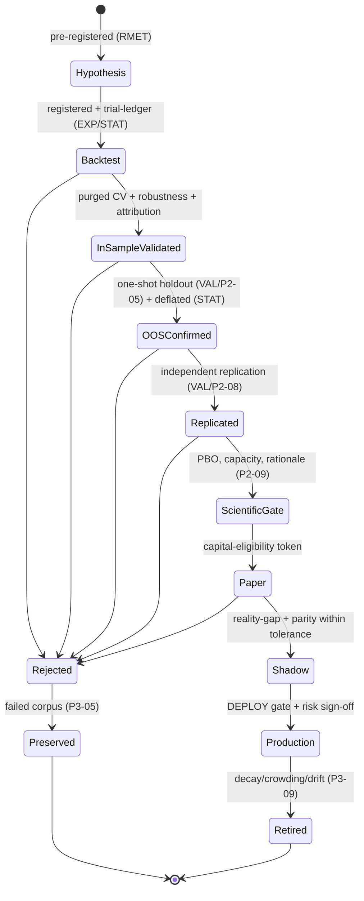
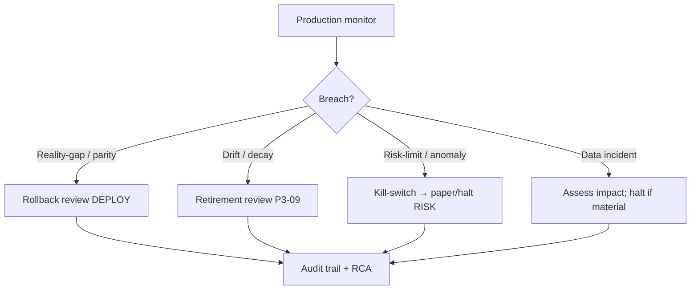

# Backtesting & Strategy Validation Rulebook

| Field              | Value                                                                                                          |
| ------------------ | -------------------------------------------------------------------------------------------------------------- |
| **Rulebook ID**    | RB-11                                                                                                          |
| **Framework code** | `BT`                                                                                                           |
| **Rule ID prefix** | `BKT` (disambiguated from `CLAUDE.md` rules `BT-1..BT-4`)                                                      |
| **Tier**           | 3 (Rulebook)                                                                                                   |
| **Owner**          | Head of Quantitative Research (**HQ**)                                                                         |
| **Co-signers**     | Governance & Risk Committee (**GRC**), Head of Portfolio & Risk (**HPR**), Architecture Review Board (**ARB**) |
| **Version**        | 1.0.0                                                                                                          |
| **Status**         | PROPOSED (binding upon ARB ratification per Framework §10)                                                     |
| **Last Ratified**  | — (pending)                                                                                                    |
| **Supersedes**     | —                                                                                                              |

> **Naming note.** The framework code for this rulebook is `BT`. Because `CLAUDE.md` already defines constitutional rules `BT-1..BT-4` (Backtesting Standards), this rulebook's own rule IDs use the prefix `BKT-` to prevent citation collisions. References to `BT-1..BT-4` in this document always mean the constitutional rules.

> **Reading note.** Tier-3 operational law. Subordinate to `CLAUDE.md` and the Architecture Canon; supreme over Agent/Workflow Contracts and Source Code. Defines _backtesting and strategy-validation standards_, not simulation how-to. **No research result may be promoted until it satisfies this rulebook.**

---

## 2. Purpose

To define the immutable standards governing every backtest, historical simulation, out-of-sample validation, walk-forward analysis, paper-trading run, and promotion decision — such that a backtest is a **falsifiable scientific experiment**, not a marketing chart. This rulebook is the single authority on **backtest realism** (cost/borrow/fill/impact modeling, corporate-action-correct simulation, in-simulation capacity/attribution/drawdown, scenario/stress construction, reality-gap analysis) and on the **strategy validation lifecycle and promotion evidence** (Framework §5, §8 SSOT map, BT row).

Its governing intent is `CLAUDE.md` BT-1..BT-4 and the audit's core backtesting finding: naive backtests lie most through omitted costs, absent market impact, faked capacity, and leakage; a research OS must make backtests reproducible, realistic, and adversarially validated (REVIEW M4, C2, C6).

## 3. Scope & Boundaries

**In scope (this rulebook is the authority):**

- Simulation integrity: event-driven historical replay on the simulated clock, event ordering, universe freeze.
- Market microstructure & cost realism: transaction costs, fees, slippage, spread, market impact, partial fills, order-queue, liquidity/borrow constraints.
- In-simulation capacity analysis; attribution/performance decomposition; drawdown/tail measurement.
- Scenario construction, stress testing, and regime-conditioned reporting **within backtests**.
- Reality-gap (sim-to-real) analysis and its feedback discipline.
- The **strategy validation lifecycle** (backtest → CV → OOS → paper/shadow → production → retirement) and the **backtest evidence** required at each gate.
- Backtest artifact standards (immutable, reproducible, attributable).

**Out of scope (references only — Framework RBK-A2, RBK-DUP-1):**

- **Statistical methods** — deflation, deflated Sharpe, PBO, CPCV/purged CV/embargo, White's Reality Check / SPA, bootstrap/Monte-Carlo _methodology_, significance, multiple testing → **RB-01 · STAT**.
- **Validation orchestration & gating** — CV/holdout execution, one-shot holdout, independent replication, verdicts, scientific gate → **RB-04 · VAL** (`P2-05..P2-09`).
- **As-of/vintage/lineage/leakage read enforcement; survivorship-free universe construction** → **RB-08 · PIT** (`P1-01`, `P2-03`).
- **Data certification, corporate-action _capture_, delisted-entity preservation, quality** → **RB-06/07 · DATA**.
- **Reproducibility manifests** → **RB-05 · REPRO** (`P1-02`).
- **Research process, pre-registration, experiment registration** → **RB-02 · RMET**, **RB-03 · EXP**.
- **Factor capacity/crowding intelligence & retirement execution** → **RB-10 · FCTR** (`P3-09`, `P3-11`); **regime service** → (`P3-10`).
- **Portfolio construction, position sizing, exposure/concentration limits, optimization** → **RB-12 · PORT**.
- **Live execution, realized TCA, paper-trading engine, sim-to-real calibration mechanism** → **RB-14 · EXEC** (`P1-10`, `P3-15`).
- **Risk limits, kill-switches, drawdown limits** → **RB-13 · RISK**; **release gates & rollback orchestration** → **RB-30 · DEPLOY**.
- **AI role boundaries** → **RB-15 · AIGOV**, **RB-18 · AGENT**.

BT states _what a valid, realistic backtest and a sound promotion require_; the owners above define the _mechanism_ or the _statistical method_. Requirements over out-of-scope mechanisms are **acceptance conditions** that cite the owner.

## 4. Constitutional Basis (`CLAUDE.md`)

Traces to: **BT-1..BT-4** (backtesting), **PIT-4** (simulated clock), **VS-1..VS-4** (validation), **SI-3** (deflated reporting), **RG-1..RG-3** (research/promotion governance), **DEP-1..DEP-4** (paper-first, reversible deployment, gates), **RS-1..RS-4** (risk/kill-switch), **RP-1..RP-4, CP-4** (reproducibility), **RE-2** (feedback-loop governance), and Forbidden Practices **FB-6, FB-7, FB-9**.

## 5. Architectural Basis (Architecture Canon)

Grounded in ARCH **§2.7** (Backtesting: engine, market_model, cost_model, universe_sim, scenario_lab, attribution, capacity_model, backtest_registry), **§2.1** (Clock), **§2.9** (Execution — paper-first), **§8** (invariants); PATCH **P3-16** (borrow/fills/capacity realism), **P2-06** (CPCV), **P2-05** (holdout), **P2-08** (replication), **P2-09** (scientific gate), **P1-10** (feedback/calibration governance), **P3-15** (research-to-production parity), **P3-10** (regime service), **P3-11** (capacity & crowding); REVIEW **M4** (backtest realism gaps; "capacity is the most-faked number"), **C2/C6**.

## 6. Definitions

Constitutional, STAT, RMET, and DATA glossary terms are **not** redefined. Backtest-specific terms are in §Glossary. Higher tiers govern collisions.

---

## Rule Format

**Pivotal rules** carry the full block: _Purpose · Rationale · Acceptance · Failure · Refs_. **Supporting rules** carry RFC 2119 force plus a one-line rationale. Every rule has a stable ID (`BKT-n`, continuous) and traces to a constitutional basis.

---

# RULES

## Philosophy

- **BKT-1 (MUST).** A backtest MUST be treated as a scientific experiment whose purpose is to _attempt to disprove_ a strategy's edge, not to showcase it. _Rationale:_ BT-1..BT-4, RMET-1; a backtest run to impress is a false-discovery engine (REVIEW).
- **BKT-2 (MUST).** A backtest result is inadmissible as promotion evidence unless it is reproducible, point-in-time correct, realistic (costed), and adversarially validated. _Rationale:_ the four dimensions of backtest validity; any one missing voids the result. _Refs:_ BKT-9, BKT-30, STAT-9.
- **BKT-3 (MUST NOT).** No backtest result MUST be interpreted, promoted, or reported gross of realistic costs; gross performance is not evidence of alpha. _Rationale:_ BT-2, AD-1, AP-10; the most common institutional self-deception. _Refs:_ BKT-40, STAT-72.

## Backtesting Principles

- **BKT-4 (MUST).** Every backtest MUST correspond to a pre-registered hypothesis and experiment (owned by RMET/EXP); ad-hoc, unregistered backtests are PROHIBITED and are a p-hacking vector. _Rationale:_ SM-2, FB-8; unregistered backtests break multiplicity accounting (STAT-14). _Refs:_ RMET-24, STAT-13, BKT-113.
- **BKT-5 (MUST).** Every backtest execution MUST be enrolled as a counted trial in the Trial Ledger (owned by EXP/STAT); repeated backtests over the same idea consume trial budget. _Rationale:_ SI-1; backtests are not free re-rolls (STAT-19). _Refs:_ STAT-14.
- **BKT-6 (SHOULD).** Cheap, disconfirming backtests SHOULD be run before expensive full-realism simulations (fail fast). _Rationale:_ efficient falsification (RMET-30).

## Scientific Objectives

- **BKT-7 (MUST).** Each backtest MUST state, ex ante, the specific claim it tests and the pre-registered success/failure criteria it will be judged against (deterministic decision rule per STAT-16). _Rationale:_ BT-1, SM-2; a backtest without a pre-registered decision rule invites HARKing. _Refs:_ RMET-24, STAT-16, RMET-AP-1.
- **BKT-8 (MUST NOT).** Backtest objectives, parameters, or success criteria MUST NOT be changed after observing results and then presented as original. _Rationale:_ FB-8; the definitive backtesting p-hack. _Refs:_ STAT-8, RMET-F-3.

## Simulation Integrity

- **BKT-9 (MUST).** Backtests MUST be event-driven and execute on the **simulated clock** (ARCH §2.1); reading wall-clock time or any information post-dating the simulated decision moment is PROHIBITED.
  - _Purpose:_ make look-ahead structurally impossible in simulation. _Rationale:_ PIT-4, BT-1; ambient time is a latent leakage bug (REVIEW C1). _Acceptance:_ the engine consumes only as-of data (via PIT) and the injected clock; a red-team probe for wall-clock access fails. _Failure:_ any wall-clock read or future-data access during simulation. _Refs:_ RB-08 · PIT, BKT-14, BKT-16.
- **BKT-10 (MUST).** The same simulation engine MUST be usable in historical, paper/shadow, and (eventually) live modes, differing only by injected clock and execution adapter. _Rationale:_ ARCH §2.7 design rule; a separate live code path is the source of silent research↔prod divergence (P3-15). _Refs:_ BKT-70, RB-14 · EXEC.

## Historical Replay Standards

- **BKT-11 (MUST).** Historical replay MUST reconstruct the exact information state available as-of each simulated timestamp, using only certified, as-of data (RB-06/07 · DATA, RB-08 · PIT). _Rationale:_ BT-1, DI-1; replay on non-as-of data invalidates every result. _Refs:_ RB-08 · PIT, DATA-44.
- **BKT-12 (MUST).** Replay MUST honor market calendars, sessions, and time zones per asset class (capability handling, CP-8); single-market or 24/7 assumptions applied uniformly are PROHIBITED. _Rationale:_ equities sessions ≠ futures ≠ 24/7 crypto (REVIEW M2). _Refs:_ DATA-60.

## Point-in-Time Requirements

> **Boundary note.** As-of read enforcement, vintage, and the leakage harness are owned by **RB-08 · PIT**. This rulebook states the _simulation-specific_ obligation.

- **BKT-13 (MUST).** Every input to a backtest — prices, fundamentals, features, universe, reference data — MUST be read as-of the simulated decision time via the PIT read layer; any non-as-of read voids the backtest. _Rationale:_ PIT-1..PIT-3, FB-6. _Refs:_ RB-08 · PIT, STAT-87.
- **BKT-14 (MUST).** Absence of look-ahead in a backtest MUST be affirmatively evidenced by the leakage harness (RB-08 · PIT / `P2-03`); silence is treated as failure. _Rationale:_ CP-1; leakage is the top killer (REVIEW C1). _Refs:_ STAT-88.

## Universe Freeze

- **BKT-15 (MUST).** The tradable universe for each simulated date MUST be **frozen as-of** that date (survivorship-free, including then-listed names later delisted); using a present-day universe is PROHIBITED.
  - _Purpose:_ prevent survivorship and selection bias entering via the universe. _Rationale:_ FB-7; a forward-looking universe is a silent, severe bias (STAT-85). _Acceptance:_ the as-of universe reconstructs to include delisted names for any date. _Failure:_ backtest run on the current universe or a survivorship-filtered universe. _Refs:_ RB-08 · PIT, DATA-56, BKT-20.

## Asset Universe Governance

- **BKT-16 (MUST).** Universe definitions used in backtests MUST be versioned, as-of correct, and referenced by version in the backtest artifact; "the universe" without a version/as-of is PROHIBITED. _Rationale:_ CP-4; reproducibility requires a pinned universe. _Refs:_ DATA-40.
- **BKT-17 (MUST).** Inclusion/exclusion rules (liquidity, listing, eligibility) MUST be pre-registered and applied as-of; post-hoc universe tuning to improve results is PROHIBITED (selection bias). _Rationale:_ STAT-91, FB-8.

## Corporate Actions Handling

> **Boundary note.** Corporate-action _capture_ is owned by **RB-06/07 · DATA** (DATA-53). This rulebook owns _correct application in simulation_.

- **BKT-18 (MUST).** Backtests MUST apply corporate actions (splits, dividends, mergers, spin-offs, symbol changes) as-of correctly, preserving position/price/return continuity without look-ahead; adjusted series MUST reconcile to raw+actions for any as_of. _Rationale:_ BT-1, ARCH §2.7; corporate actions are the #1 silent backtest corruption. _Acceptance:_ reconciliation holds; no present-adjusted prices used historically. _Failure:_ fully-adjusted (survivorship/look-ahead) prices used for historical decisions. _Refs:_ DATA-53, BKT-19.
- **BKT-19 (MUST).** Derivative corporate actions (option-chain adjustments, index reconstitution, futures roll) MUST be modeled explicitly; ignoring them is PROHIBITED. _Rationale:_ REVIEW M4; a common derivative-survivorship corruption. _Refs:_ DATA-54, BKT-46.

## Delisted Securities Policy

- **BKT-20 (MUST).** Delisted/dead names MUST remain tradable in the simulation up to their delisting event, with the delisting outcome (liquidation, acquisition price, halt) modeled; silently dropping them at delisting date is PROHIBITED. _Rationale:_ FB-7; dropping dead names both biases performance and hides tail losses. _Refs:_ DATA-55, BKT-15.

## Survivorship Bias Prevention

- **BKT-21 (MUST).** Every backtest MUST demonstrate survivorship-safe construction (universe + delisted handling); a backtest that cannot MUST be rejected. _Rationale:_ FB-7, STAT-85. _Refs:_ BKT-15, BKT-20, DATA-57.

## Look-Ahead Prevention

- **BKT-22 (MUST).** All backtest computations — signals, features, labels, rankings, thresholds, normalizations — MUST use only as-of information; full-sample or future-aware statistics are PROHIBITED. _Rationale:_ PIT-3, FB-6; recomputation leakage is subtle and fatal (REVIEW C1). _Refs:_ STAT-90, DATA-48, RB-08 · PIT.

## Data Leakage Prevention

- **BKT-23 (MUST).** Backtests MUST be free of target leakage and train/test contamination, evidenced by the leakage harness (RB-08 · PIT / `P2-03`); a leakage failure blocks all downstream promotion. _Rationale:_ REVIEW C1, VS-2. _Refs:_ STAT-89.

## Time Alignment

- **BKT-24 (MUST).** Cross-source and cross-asset data MUST be time-aligned on a common as-of basis and calendar before simulation; naive or mismatched-timestamp joins are PROHIBITED. _Rationale:_ mis-alignment injects look-ahead or drops data (DATA-59). _Refs:_ DATA-59.

## Event Ordering

- **BKT-25 (MUST).** Within a simulated timestamp, events (data arrival, signal computation, order generation, fill, accounting) MUST follow a deterministic, causally-correct order in which orders are generated only from information available strictly before execution. _Rationale:_ BT-1; incorrect intra-bar ordering is a classic subtle look-ahead. _Acceptance:_ signals at time t use only data with knowledge_time ≤ t; fills occur after order generation. _Failure:_ same-bar signal-and-fill using the bar's own close as both signal and execution price without justification. _Refs:_ BKT-9, BKT-55.

## Clock Synchronization

- **BKT-26 (MUST).** All simulation components MUST share the single injected clock; independent or component-local time sources are PROHIBITED. _Rationale:_ PIT-4; divergent clocks reintroduce ordering leakage. _Refs:_ ARCH §2.1, BKT-9.

## Validation Design (CV, walk-forward, holdout — statistical methods owned by STAT/VAL)

> **Boundary note.** The _statistical methods and their correctness_ (purged CV, CPCV, embargo, holdout, nested validation) are owned by **RB-01 · STAT** (STAT-42..STAT-68); their _orchestration and gating_ by **RB-04 · VAL** (`P2-05`, `P2-06`). This rulebook requires their _application to strategy backtests_ and adds simulation-specific obligations.

### Walk Forward Analysis

- **BKT-27 (MUST).** Strategies whose parameters adapt over time MUST be evaluated with walk-forward analysis using only as-of information at each step; walk-forward MUST be the primary realism check complementing CPCV. _Rationale:_ STAT-49/50; walk-forward best mirrors live deployment. _Refs:_ STAT-49.

### Rolling Window Validation

- **BKT-28 (SHOULD).** Rolling-window evaluation SHOULD be used to assess time-varying performance and stability; results MUST be reported as dispersion across windows, not a single average (STAT-44). _Rationale:_ averaged results hide fragility.

### Expanding Window Validation

- **BKT-29 (MAY).** Expanding-window evaluation MAY be used where the strategy assumes accumulating history; window choice MUST be pre-registered and MUST NOT be changed to improve results. _Rationale:_ window-shopping is p-hacking (STAT-43).

### Purged Cross Validation

- **BKT-30 (MUST).** Backtest validation on overlapping-label strategies MUST use purged cross-validation (per STAT-45); naive k-fold is PROHIBITED. _Rationale:_ STAT-42/45; overlap leakage fabricates skill. _Refs:_ STAT-45.

### Combinatorial Purged Cross Validation

- **BKT-31 (MUST).** Strategy-level overfitting MUST be assessed via combinatorial purged, embargoed cross-validation producing multiple OOS paths (per STAT-47); a single split MUST NOT be the basis for an overfitting judgment. _Rationale:_ STAT-47; multiple paths are required to estimate PBO. _Refs:_ STAT-47, BKT-63.

### Embargo Rules

- **BKT-32 (MUST).** An embargo of at least the effect-persistence horizon MUST be applied after each test window (per STAT-51/52). _Rationale:_ purging alone is insufficient under serial correlation. _Refs:_ STAT-51.

### Holdout Standards

- **BKT-33 (MUST).** The final holdout/OOS evaluation MUST be one-shot per candidate, consuming from the audited holdout budget (owned by RB-04 · VAL / `P2-05`); iterative peek-tweak-repeat is PROHIBITED. _Rationale:_ SI-4; iterative holdout contamination (REVIEW C6). _Refs:_ STAT-53, STAT-54.

### Nested Validation

- **BKT-34 (MUST).** Parameter/model selection MUST occur in an inner loop separated from the outer performance estimate (per STAT-56); the outer estimate MUST never see selection. Every configuration tried MUST be counted (STAT-57). _Rationale:_ selecting and evaluating on the same data inflates performance. _Refs:_ STAT-56.

## Paper Trading Standards

> **Boundary note.** The paper-trading _engine_ is owned by **RB-14 · EXEC** (ARCH §2.9). This rulebook owns paper trading as a _validation stage_ and its evidence.

- **BKT-35 (MUST).** Before production capital, a strategy MUST run in paper/shadow mode for a pre-registered minimum period and MUST demonstrate live-vs-backtest consistency within tolerance (reality-gap, BKT-64). _Rationale:_ DEP-1; paper-first is the default (REVIEW; ARCH §2.9). _Acceptance:_ paper run meets minimum duration and reality-gap tolerance; evidence recorded. _Failure:_ production promotion without a passing paper stage. _Refs:_ RB-14 · EXEC, BKT-64, BKT-116.
- **BKT-36 (MUST).** Paper trading MUST use the same simulation/execution engine as backtest and live (BKT-10), on the live clock and live data feed. _Rationale:_ P3-15; divergent paper code proves nothing about live behavior.

## Shadow Deployment

- **BKT-37 (MUST).** Shadow deployment MUST generate the strategy's decisions against live data without capital and record research↔production signal parity continuously (parity harness owned by RB-14 · EXEC / `P3-15`). _Rationale:_ P3-15; parity is the proof that live == research. _Refs:_ BKT-70.
- **BKT-38 (MUST).** A parity breach beyond tolerance MUST block production promotion and raise an incident. _Rationale:_ undetected divergence silently bleeds P&L (REVIEW).

## Benchmark Construction

- **BKT-39 (MUST).** Every strategy backtest MUST be evaluated against a pre-registered, as-of-correct benchmark and relevant risk-factor exposures; benchmark selection after seeing results is PROHIBITED. _Rationale:_ VS; a strategy's edge is only meaningful relative to an honest benchmark. _Refs:_ BKT-51.
- **BKT-40 (MUST).** Benchmarks MUST be constructed survivorship-free and net of the same cost assumptions applied to the strategy. _Rationale:_ FB-7; an unfair benchmark manufactures apparent alpha.

## Baseline Models

- **BKT-41 (MUST).** Every strategy MUST be compared against naive baselines (e.g., buy-and-hold, random, simple factor) to demonstrate incremental value; failing to beat a baseline net of costs is a rejection. _Rationale:_ incremental value is the burden of proof (STAT-71). _Refs:_ BKT-113.

## Transaction Cost Modeling

- **BKT-42 (MUST).** Every backtest MUST model realistic, net-of-all-cost performance including commissions, exchange fees, financing/borrow, taxes where applicable, and spread; a zero-cost or under-costed backtest is inadmissible.
  - _Purpose:_ ensure selection occurs on achievable, net performance. _Rationale:_ BT-2, AD-1, P3-16; costs are where naive backtests lie most (REVIEW M4). _Acceptance:_ cost model per asset class applied; net metrics reported. _Failure:_ gross or under-costed results used for any decision. _Refs:_ BKT-3, STAT-72, RB-14 · EXEC.
- **BKT-43 (MUST).** Cost models MUST be asset-class-specific via capability handling (CP-8); a single cost model applied across incompatible microstructures is PROHIBITED. _Rationale:_ impact/fees in illiquid small-caps ≠ options ≠ crypto perps (REVIEW M2). _Refs:_ BKT-46.

**Cost/microstructure modeling matrix (all applicable rows MUST be modeled):**

| Component                   | Rule   | Required for           | Notes                        |
| --------------------------- | ------ | ---------------------- | ---------------------------- |
| Commissions & exchange fees | BKT-44 | all                    | Venue/tier-specific          |
| Bid-ask spread              | BKT-47 | all                    | As-of, liquidity-conditioned |
| Slippage                    | BKT-45 | all                    | Order-size relative          |
| Market impact               | BKT-48 | all sized > trivial    | Participation-aware (BKT-48) |
| Partial fills               | BKT-49 | all                    | Volume-conditioned           |
| Order-queue position        | BKT-50 | limit-order strategies | Queue realism                |
| Financing / borrow          | BKT-52 | leveraged / short      | As-of availability + fees    |
| Roll / carry                | BKT-46 | futures / perps        | Contango/backwardation       |
| Greeks / margin             | BKT-46 | options                | Vol-surface, expiry, margin  |

## Exchange Fee Modeling

- **BKT-44 (MUST).** Venue- and tier-specific fees/rebates MUST be modeled per the strategy's realistic execution profile; assuming a single flat fee across venues is PROHIBITED where it materially affects results. _Rationale:_ fee/rebate structure materially changes high-turnover strategy viability. _Refs:_ RB-14 · EXEC.

## Slippage Modeling

- **BKT-45 (MUST).** Slippage MUST be modeled as a function of order size relative to available liquidity, not a fixed constant, unless a constant is conservative and justified. _Rationale:_ fixed slippage understates cost for large orders. _Refs:_ BKT-48.

## Bid Ask Spread Modeling

- **BKT-47 (MUST).** Executions MUST cross a realistic, as-of, liquidity-conditioned spread; assuming mid-price fills is PROHIBITED unless justified for the strategy's execution style. _Rationale:_ mid-price fills are a pervasive optimistic bias. _Refs:_ BKT-42.

## Market Impact Modeling

- **BKT-48 (MUST).** Market impact MUST be modeled with **participation-rate feedback**: the strategy's own orders move the price it receives, conditioned on order size vs historical volume. Ignoring self-impact is PROHIBITED.
  - _Purpose:_ capture the hardest, most-omitted cost. _Rationale:_ REVIEW M4; self-impact is _the_ hard problem naive backtests skip; it dominates capacity. _Acceptance:_ impact scales with participation; capacity (BKT-53) derives from it. _Failure:_ impact-free fills for non-trivial size. _Refs:_ BKT-53, RB-14 · EXEC.

## Partial Fill Simulation

- **BKT-49 (MUST).** Fills MUST be probabilistic and volume-conditioned; assuming full instantaneous fills regardless of size/liquidity is PROHIBITED. _Rationale:_ guaranteed fills overstate achievable performance and capacity. _Refs:_ BKT-45.

## Order Queue Simulation

- **BKT-50 (SHOULD).** Limit-order strategies SHOULD model queue position and adverse selection; assuming favorable queue priority is PROHIBITED without justification. _Rationale:_ queue assumptions materially affect passive-strategy results.

## Liquidity Constraints

- **BKT-51 (MUST).** Simulated orders MUST respect as-of available liquidity; orders exceeding a pre-registered fraction of historical volume MUST be constrained or penalized. _Rationale:_ trading more than the market could bear is fictional (REVIEW M4). _Refs:_ BKT-53.

- **BKT-52 (MUST).** Short and leveraged strategies MUST model as-of borrow availability, hard-to-borrow fees, and recall risk; assuming universal, free, always-available borrow is PROHIBITED. _Rationale:_ REVIEW M4; shorting names that were not actually shortable is a common fiction. _Refs:_ P3-16.

## Capacity Analysis

> **Boundary note.** In-simulation capacity _estimation_ is owned here; _crowding intelligence and capacity as a live factor property_ are owned by **RB-10 · FCTR** (`P3-11`).

- **BKT-53 (MUST).** Every strategy MUST have a documented capacity estimate derived from its market-impact and liquidity models (BKT-48/51), stating the AUM at which net alpha materially decays. A backtest without a capacity methodology is inadmissible for capital.
  - _Purpose:_ answer the institutional question retail systems fake. _Rationale:_ REVIEW M4 ("capacity is the most-faked number"); capacity governs allocation. _Acceptance:_ a capacity curve exists and is derived from impact, not asserted. _Failure:_ capacity asserted without derivation, or omitted. _Refs:_ BKT-48, RB-10 · FCTR, RB-12 · PORT.

## Position Sizing Validation

> **Boundary note.** Position-sizing _rules_ and portfolio construction are owned by **RB-12 · PORT**. This rulebook _validates_ that the simulated strategy respects them.

- **BKT-54 (MUST).** Backtests MUST validate that simulated position sizes respect the pre-registered sizing scheme and portfolio constraints (RB-12 · PORT); a backtest that violates the intended construction is invalid. _Rationale:_ PS-*; a backtest of an unconstrained strategy does not validate the constrained one. *Refs:\* RB-12 · PORT.

## Exposure Analysis

- **BKT-55 (MUST).** Backtests MUST report factor, sector, asset-class, and net/gross exposures over time; unintended, unhedged exposures MUST be surfaced. _Rationale:_ apparent alpha is often an uncompensated risk exposure. _Refs:_ BKT-59, RB-12 · PORT.

## Turnover Analysis

- **BKT-56 (MUST).** Backtests MUST report turnover; high turnover MUST be justified against net-of-cost performance (BKT-42). _Rationale:_ turnover-cost interaction is where gross alpha dies (AP-10). _Refs:_ BKT-3.

## Concentration Analysis

- **BKT-57 (MUST).** Backtests MUST report concentration (position, sector, factor); performance driven by a few names/periods MUST be flagged as fragile. _Rationale:_ concentrated luck masquerades as skill. _Refs:_ BKT-58.

## Attribution Analysis

- **BKT-58 (MUST).** Every backtest MUST decompose P&L into attributable sources (signal/alpha, factor exposure, costs, timing, residual); unexplained P&L beyond tolerance is a rejection signal. _Rationale:_ BT (attribution, ARCH §2.7); you must know _why_ it made money. _Acceptance:_ attribution sums to total P&L within tolerance. _Failure:_ large unexplained residual. _Refs:_ BKT-59.

## Performance Decomposition

- **BKT-59 (MUST).** Returns MUST be decomposed against known risk factors to isolate genuine alpha from factor beta; a "strategy" that is largely a known factor exposure MUST be labeled as such and MUST NOT be promoted as novel alpha. _Rationale:_ FC-2; factor beta is not alpha. _Refs:_ STAT-76.

## Drawdown Analysis

- **BKT-60 (MUST).** Backtests MUST report the full drawdown profile (magnitude, duration, recovery) and worst-case paths; average-case metrics alone are insufficient. _Rationale:_ RS; drawdowns, not averages, end strategies and mandates. _Refs:_ BKT-61.

## Tail Risk Analysis

- **BKT-61 (MUST).** Tail behavior (extreme losses, fat tails, tail dependence across positions) MUST be quantified and reported; assuming normality is PROHIBITED. _Rationale:_ STAT-64; tail risk destroys capital and is hidden by Gaussian assumptions. _Refs:_ BKT-63.

## Regime Analysis

- **BKT-62 (MUST).** Performance MUST be reported **conditional on regime** using the regime service (RB-10 · FCTR / `P3-10`); an unconditional claim hiding regime dependence is inadmissible. Regime definitions MUST be pre-registered (STAT-84). _Rationale:_ REVIEW quant; alpha is conditional. _Refs:_ STAT-83.

## Scenario Analysis

- **BKT-63 (MUST).** Strategies MUST be evaluated under pre-registered historical crisis replays and adverse synthetic scenarios (scenario_lab, ARCH §2.7); scenario selection to flatter results is PROHIBITED. _Rationale:_ STAT-102; average performance conceals scenario fragility. _Refs:_ BKT-64.

## Stress Testing

- **BKT-64 (MUST).** Stress tests MUST include liquidity, cost, borrow, and regime shocks — not only price shocks — and report behavior under each. _Rationale:_ STAT-103; institutional stress is multi-dimensional (REVIEW M4). _Refs:_ BKT-52.

## Monte Carlo Validation

- **BKT-65 (MUST).** Monte Carlo and synthetic-path evaluation, where used, MUST follow STAT Monte Carlo standards (pre-registered DGP, seeds, reported MC error) and MUST include null-data checks that the pipeline does not manufacture significance. _Rationale:_ STAT-61/62; a pipeline that finds "alpha" in noise is defective. _Refs:_ STAT-62.

## Bootstrap Validation

- **BKT-66 (MUST).** Bootstrap-based performance intervals MUST use dependence-preserving resampling per STAT (block/stationary bootstrap); i.i.d. bootstrap on returns is PROHIBITED. _Rationale:_ STAT-58; i.i.d. resampling understates uncertainty. _Refs:_ STAT-58.

## White's Reality Check & Superior Predictive Ability

- **BKT-67 (MUST).** When selecting among multiple candidate strategies or configurations, a data-snooping-robust multiple-comparison procedure (e.g., White's Reality Check, Hansen's Superior Predictive Ability), governed statistically by **RB-01 · STAT**, MUST be applied; reporting the best of many without such a control is PROHIBITED.
  - _Purpose:_ prevent "best-of-N" selection bias at the strategy level. _Rationale:_ SI-1, STAT-92; the classic backtest-mining fallacy. _Acceptance:_ the data-snooping-robust p-value survives; N is counted in the trial budget. _Failure:_ presenting the top configuration among many without a snooping-robust test. _Refs:_ STAT-19, STAT-92, BKT-5.

## Probability of Backtest Overfitting

- **BKT-68 (MUST).** PBO MUST be computed (via CPCV, per STAT-47/48) and reported for every strategy-level candidate; a candidate with PBO above the GRC-governed threshold MUST be rejected. _Rationale:_ STAT-48; PBO > threshold means the selection is more likely overfit than not. _Refs:_ STAT-48, BKT-113.

## Deflated Sharpe Ratio

- **BKT-69 (MUST).** Strategy performance MUST be reported as a **deflated** metric accounting for the effective number of trials (deflation owned by STAT-21/STAT-3); undeflated Sharpe/IR MUST NOT be presented as promotion evidence. _Rationale:_ SI-3; undeflated metrics are the canonical overstatement (STAT-AP-2). _Refs:_ STAT-3, STAT-21.

## Reality Gap Analysis

- **BKT-70 (MUST).** The **reality gap** — the divergence between backtest-modeled and realized (paper/live) performance — MUST be measured continuously; a gap beyond the GRC-governed tolerance MUST block or reverse promotion and trigger investigation.
  - _Purpose:_ keep backtests honest against reality and detect model decay. _Rationale:_ REVIEW; TCA-vs-model calibration is the loop that keeps backtests truthful (P1-10, P3-15). _Acceptance:_ reality-gap monitored from paper onward; breaches raise incidents. _Failure:_ production strategy diverging from backtest with no detection. _Refs:_ BKT-35, RB-14 · EXEC, BKT-118.
- **BKT-71 (MUST).** Cost-model calibrations derived from realized TCA MUST be versioned, staged, and reversible (feedback-loop governance, RB-14 · EXEC / `P1-10`); an unmanaged calibration silently degrading all future backtests is PROHIBITED. _Rationale:_ RE-2; uncontrolled feedback corrupts the baseline (REVIEW M3). _Refs:_ P1-10.

## Model / Feature / Factor Stability

- **BKT-72 (MUST).** Strategy, model, feature, and factor stability MUST be assessed across subperiods, sub-universes, regimes, and parameter perturbations (statistical standards owned by STAT-78/79/80); knife-edge parameter sensitivity is a rejection signal. _Rationale:_ VS; instability signals overfitting. _Refs:_ STAT-79, STAT-80.

## Strategy Drift

- **BKT-73 (MUST).** Deployed strategies MUST be monitored for performance drift/decay against pre-registered thresholds (statistical drift methods owned by STAT-81; operational monitoring by RB-28 · OBS); a drift breach triggers the retirement review (BKT-121). _Rationale:_ RL-2; alpha decays. _Refs:_ STAT-81, RB-10 · FCTR.

## Robustness Requirements

- **BKT-74 (MUST).** Capital-grade strategies MUST pass a pre-registered robustness battery (subperiod, sub-universe, parameter-perturbation, regime, scenario/stress), reported as dispersion; the battery MUST be fixed before results are seen. _Rationale:_ STAT-100/101; robustness is a required validity dimension. _Refs:_ STAT-100.

## Reproducibility

- **BKT-75 (MUST).** Every backtest MUST emit an immutable artifact reproducible bit-for-bit from its Run Manifest (code/env/seeds/config + as-of dataset & universe refs), per RB-05 · REPRO; an irreproducible backtest is void and MUST NOT inform any decision. _Rationale:_ CP-4, BT-3, RP-1, FB-10. _Acceptance:_ re-run from manifest reproduces results on a clean host. _Failure:_ results that cannot be reproduced. _Refs:_ STAT-105, DATA-40.
- **BKT-76 (MUST NOT).** Backtest results MUST NOT be manually edited, curated, or selectively reported; manual manipulation is PROHIBITED. _Rationale:_ FB-9, BT-4. _Refs:_ BKT-8.

## Independent Replication

- **BKT-77 (MUST).** No strategy MAY reach capital eligibility without independent replication of its key backtest results via a separate code path (executed by RB-04 · VAL / `P2-08`); discrepancy beyond tolerance auto-rejects. _Rationale:_ VS-4; single-implementation results may be implementation artifacts (REVIEW Missing #4). _Refs:_ STAT-108.

## Audit Trail

- **BKT-78 (MUST).** Every backtest, its manifest, inputs, configuration, verdict, and any promotion decision MUST be recorded immutably and be auditable end-to-end without consulting the author. _Rationale:_ CP-7, BT-3. _Refs:_ STAT-110, ARCH §2.7 backtest_registry.

---

## Strategy Validation Lifecycle

- **BKT-79 (MUST).** Every strategy MUST traverse the lifecycle below; stages MUST NOT be skipped, transitions are gated and recorded, and terminal-negative outcomes are preserved in the failed-research corpus (RB-02 · RMET / `P3-05`). _Rationale:_ RL-1, DEP-\*; a governed lifecycle is auditable and reversible.

## Promotion Gates

> **Boundary note.** Gate _orchestration_ is owned by **RB-04 · VAL** (`P2-09`) and **RB-30 · DEPLOY**; the _statistical evidence_ by **STAT**. This rulebook defines the **backtest evidence** required at each gate.

- **BKT-80 (MUST).** No strategy advances a gate without the full backtest evidence for that gate; partial evidence is rejection (fail-closed). _Rationale:_ RG-1, DEP-4; gates are cumulative and non-negotiable.

**Promotion validation matrix (all MUST pass for the gate):**

| Gate                               | Required backtest evidence                                                                                        | Owner of the check      |
| ---------------------------------- | ----------------------------------------------------------------------------------------------------------------- | ----------------------- |
| **Backtest → In-Sample Validated** | PIT-clean (leakage harness), survivorship-safe, net-of-cost, purged CV, attribution, robustness, baseline-beating | BKT + PIT + STAT        |
| **In-Sample → OOS Confirmed**      | CPCV + PBO below threshold; one-shot holdout; deflated metrics; regime-conditioned                                | STAT + VAL (`P2-05/06`) |
| **OOS → Replicated**               | Independent replication within tolerance                                                                          | VAL (`P2-08`)           |
| **Replicated → Scientific Gate**   | Capacity methodology; economic rationale; data-snooping-robust selection                                          | BKT + FCTR + `P2-09`    |
| **Scientific Gate → Paper**        | Capital-eligibility token issued                                                                                  | VAL/GRC (`P2-09`)       |
| **Paper → Shadow → Production**    | Reality-gap within tolerance; parity clean; risk sign-off; DEPLOY gate                                            | EXEC + RISK + DEPLOY    |

## Paper Trading Promotion

- **BKT-81 (MUST).** Promotion from Scientific Gate to Paper requires a valid capital-eligibility token (`P2-09`); paper trading MUST run the minimum pre-registered duration and meet reality-gap tolerance before advancing. _Rationale:_ DEP-1; paper-first, evidence-based. _Refs:_ BKT-35.

## Production Promotion

- **BKT-82 (MUST).** Promotion to production capital requires: passing all prior gates, a clean shadow/parity record, independent risk sign-off (RB-13 · RISK), and the DEPLOY release gate (RB-30 · DEPLOY). _Rationale:_ DEP-2/4, RG-3; production is the highest-consequence transition. _Refs:_ RB-30 · DEPLOY.
- **BKT-83 (MUST NOT).** Production promotion MUST NOT be granted by human or LLM assertion in place of the required evidence; overrides bypassing evidence are void. _Rationale:_ HO-3, AI-3.

## Rollback Criteria

- **BKT-84 (MUST).** Every production strategy MUST be reversible and have pre-registered rollback criteria (e.g., reality-gap breach, drift breach, parity breach, drawdown limit); triggering a criterion MUST initiate rollback via DEPLOY/RISK. _Rationale:_ DEP-3; a strategy that cannot be safely unwound MUST NOT be deployed. _Refs:_ RB-30 · DEPLOY, RB-13 · RISK.

## Kill Switch Criteria

- **BKT-85 (MUST).** Pre-registered kill-switch criteria (limit breaches, anomalous behavior, data-incident impact) MUST force the strategy to paper/halt via the risk kill-switch (owned by RB-13 · RISK); kill-switch authority MUST NOT be gated by AI. _Rationale:_ RS-3, HO-4. _Refs:_ RB-13 · RISK, DATA-96.

## Retirement Criteria

- **BKT-86 (MUST).** Production strategies MUST be subject to retirement when decay, crowding, drift, regime-invalidation, or capacity-erosion criteria are met (statistical triggers per STAT-81; execution owned by RB-10 · FCTR / `P3-09`). Retirement MUST be recorded with rationale and lineage. _Rationale:_ RL-2; alpha has a death. _Refs:_ STAT-82, BKT-73.

## Governance

- **BKT-87 (MUST).** GRC governs backtesting parameters (cost-model assumptions, capacity thresholds, PBO/deflation thresholds, reality-gap and drawdown tolerances, paper-trading minimum duration, robustness dispersion tolerances) via the Exceptions process; researchers and agents MUST NOT alter them. _Rationale:_ CP-1; controls belong to governance.
- **BKT-88 (MUST).** Scientific and risk sign-off for promotion MUST be independent of the strategy's author (CP-5). _Rationale:_ the builder must not be the promoter.
- **BKT-89 (MUST).** Backtesting MUST be periodically audited (cadence GRC-governed) sampling promoted and rejected strategies to confirm lifecycle compliance and evidence integrity. _Rationale:_ CP-7.

## AI in Backtesting

- **BKT-90 (MUST).** AI agents MAY propose strategies, configure backtests, and narrate results; they MUST NOT adjudicate validity, assert significance, approve promotion, or issue kill-switch/rollback decisions (AI-1..AI-4, DE-1). _Rationale:_ controls and adjudication are deterministic/human. _Refs:_ RB-15 · AIGOV, RMET-87.
- **BKT-91 (MUST).** Agents running backtests MUST operate behind the generator↔validator isolation barrier: they MUST NOT observe per-candidate OOS/holdout outcomes (RB-18 · AGENT / `P2-07`). _Rationale:_ AD-3; otherwise the search overfits the validator (REVIEW; STAT-AP-4). _Refs:_ RMET-86.

---

## Acceptance Criteria (backtest)

A backtest is **admissible as promotion evidence** only when **all** hold (cumulative):

**Backtest admissibility checklist:**

- [ ] Corresponds to a pre-registered hypothesis/experiment; enrolled in Trial Ledger (BKT-4, BKT-5).
- [ ] Event-driven on the simulated clock; correct event ordering; single clock (BKT-9, BKT-25, BKT-26).
- [ ] All inputs read as-of; leakage harness clean (BKT-13, BKT-14, BKT-23).
- [ ] Universe frozen as-of, survivorship-safe; delisted names handled; corporate actions correct (BKT-15, BKT-20, BKT-18).
- [ ] Net-of-all-cost with asset-specific cost/impact/borrow/fill modeling; participation-aware impact (BKT-42–BKT-52).
- [ ] Capacity estimate derived from impact/liquidity (BKT-53).
- [ ] Attribution/decomposition explains P&L; exposures/turnover/concentration reported (BKT-55–BKT-59).
- [ ] Drawdown, tail, regime-conditioned, scenario/stress reported (BKT-60–BKT-64).
- [ ] Purged CV/CPCV; PBO below threshold; deflated metrics; robustness within tolerance (BKT-30–BKT-34, BKT-68, BKT-69, BKT-74).
- [ ] Data-snooping-robust selection where multiple candidates (BKT-67).
- [ ] Reproducible from manifest; not manually edited (BKT-75, BKT-76).
- [ ] Auditable end-to-end (BKT-78).

## Rejection Criteria

A backtest/strategy MUST be **rejected** (and preserved per `P3-05`) if **any** hold:

- **BKT-92.** Any look-ahead, leakage, or survivorship bias, or non-as-of read (BKT-13/15/22/23).
- **BKT-93.** Gross or under-costed results, or missing participation-aware impact/borrow modeling (BKT-42, BKT-48, BKT-52).
- **BKT-94.** No capacity methodology, or asserted-not-derived capacity (BKT-53).
- **BKT-95.** PBO above threshold, or undeflated significance, or fails data-snooping-robust selection (BKT-67, BKT-68, BKT-69).
- **BKT-96.** Fails robustness/stability/regime/stress within tolerance (BKT-62, BKT-64, BKT-72, BKT-74).
- **BKT-97.** Large unexplained attribution residual, or performance is disguised factor beta (BKT-58, BKT-59).
- **BKT-98.** Not reproducible, replication discrepancy beyond tolerance, or manually edited (BKT-75, BKT-76, BKT-77).
- **BKT-99.** Fails to beat honest benchmark/baseline net of costs (BKT-40, BKT-41).
- **BKT-100.** Reality-gap or parity breach at paper/shadow beyond tolerance (BKT-38, BKT-70).
- **BKT-101.** Unregistered backtest or post-hoc criteria change (BKT-4, BKT-8).

## Anti-Patterns

Recognized backtesting failure modes that MUST be actively prevented (mirrors `CLAUDE.md` AP-\*, REVIEW):

- **BKT-AP-1.** Mid-bar/same-bar signal-and-execution using future information within the bar (BKT-25).
- **BKT-AP-2.** Present-day universe/symbology/adjusted-prices applied to the past (BKT-15, BKT-18).
- **BKT-AP-3.** Zero/flat costs, mid-price fills, guaranteed full fills, impact-free execution (BKT-42, BKT-47, BKT-48, BKT-49).
- **BKT-AP-4.** Faked or asserted capacity; trading beyond available liquidity (BKT-51, BKT-53).
- **BKT-AP-5.** Best-of-N configuration selection without data-snooping control or trial counting (BKT-67).
- **BKT-AP-6.** Single train/test split used to judge overfitting instead of CPCV/PBO (BKT-31, BKT-68).
- **BKT-AP-7.** Undeflated Sharpe/IR presented as discovery (BKT-69).
- **BKT-AP-8.** Parameter tuning to a target; changing objectives after seeing results (BKT-8, BKT-29).
- **BKT-AP-9.** Iterative holdout peeking (BKT-33).
- **BKT-AP-10.** Skipping paper/shadow; promoting straight to capital on backtest alone (BKT-35, BKT-82).
- **BKT-AP-11.** Unmanaged cost-model recalibration from live TCA degrading all future backtests (BKT-71).
- **BKT-AP-12.** Agent observing validation/OOS outcomes during search (BKT-91).

## Forbidden Backtesting Practices

Absolute prohibitions. Violation voids the backtest, blocks promotion, and is a reportable integrity event (`CLAUDE.md` FB-\*):

- **BKT-F-1.** Any look-ahead, data leakage, or survivorship bias in a backtest (BKT-13/15/22/23; FB-6/FB-7).
- **BKT-F-2.** Running or reporting a backtest gross or under-costed (BKT-42; BT-2).
- **BKT-F-3.** Omitting participation-aware market impact or borrow modeling for sized/short strategies (BKT-48, BKT-52).
- **BKT-F-4.** Trading beyond as-of available liquidity, or asserting capacity without derivation (BKT-51, BKT-53).
- **BKT-F-5.** Best-of-N selection without a data-snooping-robust control and trial counting (BKT-67; STAT-92).
- **BKT-F-6.** Presenting undeflated metrics as promotion evidence (BKT-69; SI-3).
- **BKT-F-7.** Iterative use of the final holdout (BKT-33; SI-4).
- **BKT-F-8.** Manually editing, curating, or selectively reporting backtest results (BKT-76; FB-9).
- **BKT-F-9.** Optimization/tuning without a captured reproducibility manifest (BKT-75; FB-10).
- **BKT-F-10.** Running an unregistered backtest or altering pre-registered criteria post-hoc (BKT-4, BKT-8; FB-8).
- **BKT-F-11.** Promoting to capital without paper/shadow, independent replication, and required gates (BKT-77, BKT-82).
- **BKT-F-12.** Any LLM adjudicating validity, asserting significance, approving promotion, or issuing a kill-switch (BKT-90; AI-1..AI-4).
- **BKT-F-13.** Wall-clock reads or future-data access during simulation (BKT-9).

---

## Enforcement & Verification

| Rule group                                             | Enforcement mechanism                                          | Mechanism owner                            |
| ------------------------------------------------------ | -------------------------------------------------------------- | ------------------------------------------ |
| Registration & trial enrollment (BKT-4,5)              | Gate: no backtest without registered experiment + ledger entry | RB-03 · EXP, RB-02 · RMET                  |
| Simulation integrity & PIT (BKT-9–26)                  | Engine invariants + leakage harness gate                       | this rulebook; RB-08 · PIT (`P2-03`)       |
| Cost/impact/borrow/fill realism (BKT-42–52)            | Gate: cost-model conformance per asset capability              | this rulebook                              |
| Capacity (BKT-53)                                      | Gate: capacity derived from impact required for capital        | this rulebook; RB-10 · FCTR                |
| CV/CPCV/holdout/PBO/deflation (BKT-30–34, 68, 69)      | Statistical gates                                              | RB-01 · STAT, RB-04 · VAL (`P2-05/06`)     |
| Attribution/robustness/stress/regime (BKT-58–64,72,74) | Battery gate + review                                          | this rulebook; RB-10 · FCTR (regime)       |
| Reproducibility & replication (BKT-75–77)              | Manifest gate; replication engine                              | RB-05 · REPRO, RB-04 · VAL (`P2-08`)       |
| Reality-gap & parity (BKT-70,71,38)                    | Continuous monitors; calibration governance                    | RB-14 · EXEC (`P1-10`,`P3-15`)             |
| Promotion gates (BKT-80–83)                            | Fail-closed gate orchestration                                 | RB-04 · VAL (`P2-09`), RB-30 · DEPLOY      |
| Rollback/kill-switch/retirement (BKT-84–86)            | Risk/deploy controls; retirement service                       | RB-13 · RISK, RB-30 · DEPLOY, RB-10 · FCTR |
| AI limits & isolation (BKT-90,91)                      | Agent authority flags; bus ACLs                                | RB-15/18 (`P2-07`)                         |
| Forbidden practices (BKT-F-\*)                         | Fail-closed gate; integrity report                             | GRC                                        |

- **BKT-E-1 (MUST).** Every rule enforcing a Forbidden Backtesting Practice (BKT-F-*) MUST be CI/gate-enforced and fail-closed where technically possible (Framework RBK-E2). *Rationale:\* CP-1.
- **BKT-E-2 (MUST).** Promotion, validity, and kill-switch decisions MUST be deterministic; LLMs MAY assist/narrate only (AI-1..AI-4, DE-1). _Rationale:_ DE-1.

## Exceptions & Waivers

- **BKT-W-1 (MUST).** No exception MAY be granted to any Forbidden Backtesting Practice (BKT-F-\*) or to any rule enforcing a `CLAUDE.md` entrenched clause (AM-2). Non-waivable.
- **BKT-W-2 (MAY).** GRC-governed backtesting parameters (BKT-87) MAY be changed only by GRC (+ HPR for risk-linked tolerances), recorded as a versioned parameter set with rationale, applied prospectively (VER-2).
- **BKT-W-3 (MAY).** A time-boxed waiver of a non-entrenched rule MAY be granted only by HQ + GRC, recorded in the audit trail with scope, expiry, and rationale, and MUST NOT weaken PIT correctness, cost realism, deflation/PBO, reproducibility, or the paper-first requirement. _Rationale:_ these are the load-bearing backtest controls.
- **BKT-W-4 (MUST).** Active waivers MUST be surfaced on the affected backtest artifact and its promotion evidence package. _Rationale:_ no hidden exceptions.

## Rulebook Acceptance Criteria (ratification)

Ratifiable (Framework §10) only when: every rule has a stable ID, RFC 2119 phrasing, a constitutional basis, and an enforcement mechanism; no rule contradicts `CLAUDE.md`, the Architecture Canon, or peer rulebooks per the SSOT map (especially the STAT/VAL/PIT/DATA/EXEC boundaries); all GRC-governed parameters have recorded defaults; all cross-references resolve; ARB approval with GRC + HPR co-sign obtained.

## Success Metrics

- **SM-1.** 0 promoted strategies with leakage/look-ahead/survivorship findings in audit (BKT-92).
- **SM-2.** 0 gross/under-costed results used for promotion; 100% strategies with participation-aware impact and derived capacity (BKT-42, BKT-48, BKT-53).
- **SM-3.** Reality-gap distribution within GRC tolerance; parity-breach rate trending down (BKT-70, BKT-38).
- **SM-4.** 100% promoted strategies reproducible from manifest and independently replicated (BKT-75, BKT-77).
- **SM-5.** PBO distribution and IS→OOS degradation within tolerance across promotions (BKT-68).
- **SM-6.** 0 productions promoted without paper/shadow + required gates (BKT-82); 0 LLM-made promotion/kill decisions (BKT-90).
- **SM-7.** 100% terminal-negative strategies preserved in the failed corpus with rationale (BKT-79).

## Dependencies & Related Rulebooks

- **Depends on:** RB-01 · STAT (deflation, PBO, CV, RC/SPA, bootstrap/MC), RB-08 · PIT (as-of/leakage/survivorship reads), RB-06/07 · DATA (certification, corporate actions), RB-05 · REPRO (manifests), RB-02 · RMET & RB-03 · EXP (pre-registration, registration).
- **Coordinates with:** RB-04 · VAL (CV/holdout/replication/scientific gate), RB-10 · FCTR (capacity/crowding, regime, retirement), RB-12 · PORT (sizing/exposure/constraints), RB-14 · EXEC (paper engine, TCA, parity, calibration), RB-13 · RISK (kill-switch/limits), RB-30 · DEPLOY (release/rollback), RB-15/18 (AI limits/isolation).
- **Architecture references:** ARCH §2.1, §2.7, §2.9, §8; PATCH `P3-16`, `P2-05/06/08/09`, `P1-10`, `P3-15`, `P3-10`, `P3-11`; REVIEW M4, C2, C6.

## Change Log & Version History

| Version | Date    | Author (role) | Change                                              | ADR |
| ------- | ------- | ------------- | --------------------------------------------------- | --- |
| 1.0.0   | pending | HQ            | Initial Backtesting & Strategy Validation rulebook. | —   |

---

## Glossary (backtesting-specific)

Terms in `CLAUDE.md`, STAT, RMET, and DATA glossaries are not redefined.

- **Backtest** — A reproducible, point-in-time, cost-realistic historical simulation of a strategy, treated as a falsifiable experiment (BKT-1).
- **Simulated Clock** — The injected time authority on which backtests run; never wall-clock (BKT-9).
- **Universe Freeze** — Fixing the tradable universe as-of each simulated date, survivorship-free (BKT-15).
- **Participation-Aware Market Impact** — Impact modeling in which the strategy's own orders move the price it receives, conditioned on order size vs volume (BKT-48).
- **Capacity** — The AUM beyond which net alpha materially decays, derived from impact/liquidity modeling (BKT-53).
- **Attribution** — Decomposition of backtest P&L into alpha, factor exposure, costs, timing, and residual (BKT-58).
- **Reality Gap** — The divergence between backtest-modeled and realized (paper/live) performance (BKT-70).
- **Shadow Deployment** — Running a strategy's decisions against live data without capital to verify research↔production parity (BKT-37).
- **Reality Check / SPA** — Data-snooping-robust multiple-comparison procedures (statistically owned by STAT) applied when selecting among many candidates (BKT-67).
- **PBO** — Probability of Backtest Overfitting, from CPCV (BKT-68; STAT-47).
- **Reality-Gap Tolerance / PBO Threshold / Paper-Minimum Duration** — GRC-governed parameters (BKT-87).

---

_End of Backtesting & Strategy Validation Rulebook (RB-11 · BT). This document owns backtest realism and the strategy validation lifecycle; it references — never restates — STAT (statistical methods), VAL (orchestration/gates), PIT (as-of/leakage), DATA (certification/corporate actions), REPRO (manifests), FCTR (capacity/regime/retirement), PORT (construction), EXEC (paper/TCA/calibration), RISK (kill-switch), and DEPLOY (release/rollback). Binding upon ARB ratification._
