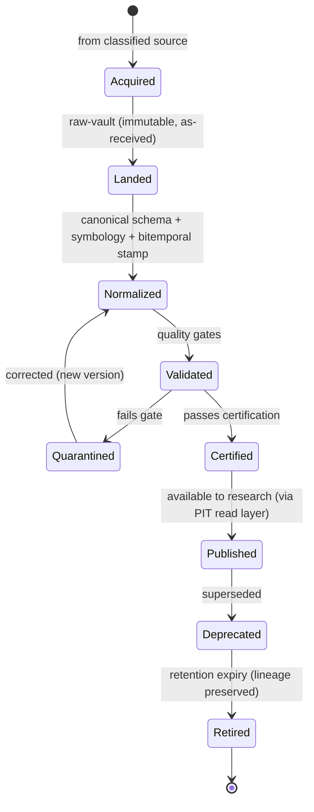
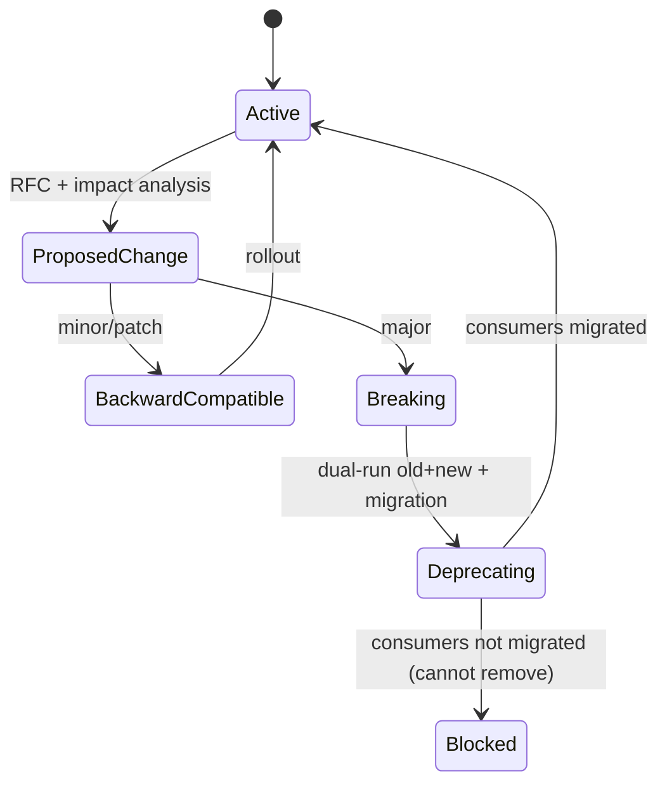
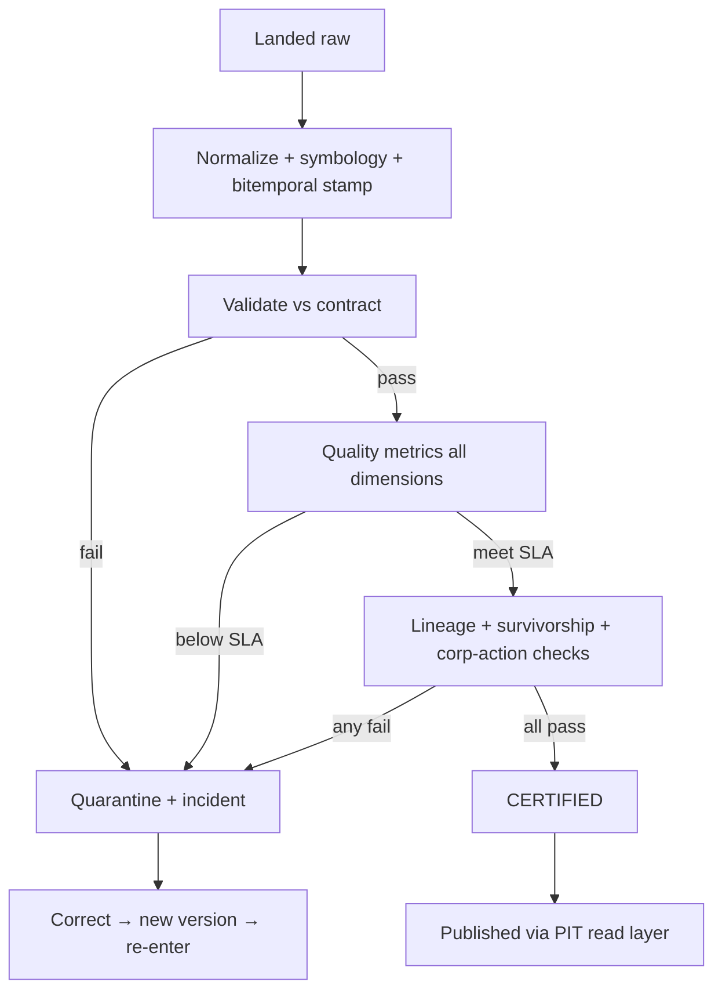
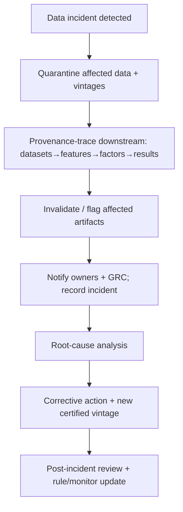

# Data Governance & Data Quality Rulebook

| Field              | Value                                                                                                                        |
| ------------------ | ---------------------------------------------------------------------------------------------------------------------------- |
| **Rulebook IDs**   | RB-06 (`DGOV`) + RB-07 (`DQ`) — consolidated in one file                                                                     |
| **Rule ID prefix** | `DATA` (continuous, unifying both domains)                                                                                   |
| **Tier**           | 3 (Rulebook)                                                                                                                 |
| **Owner**          | Head of Data (**HD**)                                                                                                        |
| **Co-signers**     | Governance & Risk Committee (**GRC**), Architecture Review Board (**ARB**); Head of Security (**CISO**) for §Security/Access |
| **Version**        | 1.0.0                                                                                                                        |
| **Status**         | PROPOSED (binding upon ARB ratification per Framework §10)                                                                   |
| **Last Ratified**  | — (pending)                                                                                                                  |
| **Supersedes**     | —                                                                                                                            |

> **Packaging note.** The Rulebook Framework catalogs Data Governance (RB-06) and Data Quality (RB-07) as adjacent rulebooks. This file consolidates both because they share one owner (HD) and one data lifecycle. It uses a single continuous `DATA-n` rule ID space. **Point-in-Time & Provenance (RB-08 · PIT) remains a distinct, separately-owned rulebook**; this document contributes only the _ingestion/capture-side_ obligations for point-in-time correctness and references RB-08 · PIT as the authority for all _as-of read, vintage query, lineage query, and leakage-detection_ mechanisms. If the ARB later requires strict one-rulebook-per-file, this document splits along the `DGOV`/`DQ` section boundaries with no content change.

> **Reading note.** Tier-3 operational law. Subordinate to `CLAUDE.md` and the Architecture Canon; supreme over Agent/Workflow Contracts and Source Code. Defines _governance and quality standards_, not data-engineering how-to. No dataset, feature, factor, experiment, model, or agent MAY use data that has not satisfied this rulebook.

---

## 2. Purpose

To define the immutable standards that every dataset MUST satisfy before it can inform research on this platform: how data is acquired, classified, contracted, versioned, preserved, measured for quality, certified, deprecated, and retired — and how data incidents are handled. This rulebook is the single authority on **data sourcing, canonical construction, raw-vault immutability, data contracts, schema governance, data-quality dimensions, anomaly/freshness monitoring, quarantine, certification, deprecation, and retention** (Framework §5, §8 SSOT map, DGOV + DQ rows).

Its governing intent is `CLAUDE.md` DI-1..DI-3 and the audit's central data finding: at institutional scale, silent data corruption — restatements, survivorship, mis-stamped time, corporate actions — is the most common way research quietly dies (REVIEW C1, Missing #10). Every guarantee here is enforced by mechanism, not intention (CP-1).

## 3. Scope & Boundaries

**In scope (this rulebook is the authority):**

- Data acquisition, source classification, vendor requirements, internal data standards.
- Data contracts, schema governance and evolution, metadata standards.
- Provenance/lineage **capture at ingestion**; bitemporal **stamping** at ingestion.
- Dataset versioning, immutability, raw-data preservation; canonical & derived dataset standards.
- Data-level quality: completeness, accuracy, consistency, timeliness, uniqueness, referential integrity.
- Missing-data, duplicate, outlier, corporate-action, and delisted-securities **ingestion policy**.
- Data validation, quality metrics, freshness/drift/anomaly **detection at the data layer**.
- Data certification, dataset promotion gates, deprecation, retention.
- Data audit, compliance, incident response, and root-cause analysis.
- AI data-usage policy (data-side); data security and access **principles** (referencing SEC).

**Out of scope (references only — Framework RBK-A2, RBK-DUP-1):**

- **As-of read gateway, vintage query semantics, reference-data as-of, lineage graph query & completeness enforcement, leakage test harness, look-ahead prevention at read time, survivorship-free universe construction for research reads** → **RB-08 · PIT** (`P1-01`, `P1-06`, `P2-03`).
- **Statistical treatment of outliers, drift tests, survivorship/leakage significance, sampling** → **RB-01 · STAT**.
- **Feature definition, computation, and marketplace acceptance** → **RB-09 · FEAT** (`P1-06`); **factor construction** → **RB-10 · FCTR**.
- **Reproducibility manifests / determinism capture** → **RB-05 · REPRO** (`P1-02`).
- **Research process, experiment registration** → **RB-02 · RMET**, **RB-03 · EXP**.
- **Security controls, secrets/KMS, exfiltration, audit-trail integrity mechanism** → **RB-27 · SEC** (`P1-09`).
- **Artifact storage tiering/GC mechanics** → **RB-29 · PERF** (`P5-01`); **observability tooling** → **RB-28 · OBS**.
- **AI role boundaries; agent SRP** → **RB-15 · AIGOV**, **RB-18 · AGENT**.

This rulebook states _what data must guarantee_; the owners above define the _mechanism_. Where it imposes a requirement over an out-of-scope mechanism, it does so as a **data acceptance condition** and cites the owner.

## 4. Constitutional Basis (`CLAUDE.md`)

Traces to: **DI-1..DI-3** (data integrity), **DP-1..DP-3** (provenance), **PIT-1..PIT-4** (point-in-time — enforced by PIT, ingestion-enabled here), **CP-2** (immutability), **CP-6** (provenance-required), **CP-7** (auditability), **CP-8** (asset-agnostic core), **VER-1..VER-2** (schema versioning), **DEPR-1..DEPR-3** (deprecation), **SEC-1..SEC-5** (security, referenced), and Forbidden Practices **FB-6, FB-7, FB-14**.

## 5. Architectural Basis (Architecture Canon)

Grounded in ARCH **§2.1** (Clock — time authority), **§2.2** (Data Ingestion: connectors, normalizers, symbology, corporate_actions, quality_gates, bitemporal_writer, raw_vault), **§2.3** (Data Semantic: feature store, PIT engine, universe, lineage, calendars, entity_graph, data_catalog), **§8** (invariants); PATCH **P1-01** (As-Of Gateway + Vintage — PIT), **P1-06** (Feature Factory — PIT/FEAT), **P2-03** (Leakage Harness — PIT), **P5-01** (Artifact lifecycle/retention), **P1-09** (Security); REVIEW **C1** (leakage), **DI**, **Missing #10** (data-quality SLA & vendor-restatement handler).

## 6. Definitions

Constitutional terms (`CLAUDE.md` Glossary — As-Of Read, Bitemporal/Vintage, Provenance, etc.), STAT, and RMET terms are **not** redefined. Data-specific terms are in §Glossary. Higher tiers govern collisions.

---

## Rule Format

**Pivotal rules** carry the full block: _Purpose · Rationale · Acceptance · Failure · Refs_. **Supporting rules** carry RFC 2119 force plus a one-line rationale. Every rule has a stable ID (`DATA-n`, continuous) and traces to a constitutional basis.

---

# RULES

## Philosophy

- **DATA-1 (MUST).** Data MUST be treated as evidence in a court of audit: every value MUST be attributable, reconstructable, and defensible as of any past date. _Rationale:_ CP-6, CP-7, DI; research built on unaccountable data is inadmissible.
- **DATA-2 (MUST).** The research platform MUST assume the outside world is adversarial and imperfect: vendors restate, feeds break, timestamps lie, and entities vanish. Controls MUST make these failures visible, never silent. _Rationale:_ REVIEW Missing #10; silent data faults are the deadliest.
- **DATA-3 (MUST NOT).** Data MUST NOT be trusted by default; trust is earned through certification (DATA-95) and is revocable. _Rationale:_ DATA-2; unverified trust propagates corruption.
- **DATA-4 (MUST).** What was originally received MUST never be destroyed or overwritten; corrections are additive. _Rationale:_ CP-2, DP-2; the ability to re-derive from source is the ultimate integrity backstop.

## Data Governance

- **DATA-5 (MUST).** Every dataset MUST have a single accountable **data owner** (role) responsible for its quality, contracts, and lifecycle. Ownerless data is PROHIBITED from research use.
  - _Purpose:_ single-point accountability. _Rationale:_ CP-7; diffuse ownership erodes quality. _Acceptance:_ every registered dataset has a non-null owner role. _Failure:_ a dataset in research use with no owner. _Refs:_ DATA-42, RMET-36 (analogous ownership principle).
- **DATA-6 (MUST).** Data governance decisions (source approval, contract changes, certification, deprecation) MUST be recorded as immutable decision records with who/what/when/why. _Rationale:_ CP-7; governance without a record is unauditable.
- **DATA-7 (MUST).** GRC governs data-integrity parameters (quality thresholds, SLA targets, retention windows, certification cadence) via the Exceptions process; data engineers and agents MUST NOT alter them. _Rationale:_ CP-1; controls belong to governance.

## Data Lifecycle

- **DATA-8 (MUST).** All data MUST traverse the governed lifecycle below; stages MUST NOT be skipped, and each transition MUST be recorded. _Rationale:_ DI, CP-7; a governed lifecycle makes data auditable end-to-end.

## Data Acquisition Standards

- **DATA-9 (MUST).** No data MAY enter the platform except from an **approved, classified source** (DATA-12) under an approved **data contract** (DATA-18). _Rationale:_ DATA-3; unvetted ingestion is an integrity and security hole. _Refs:_ DATA-12, DATA-18.
- **DATA-10 (MUST).** Every acquisition MUST land the raw payload immutably in the raw vault **before** any transformation (DATA-33). _Rationale:_ DP-2, CP-2; raw preservation enables re-derivation after any downstream bug. _Refs:_ DATA-33.
- **DATA-11 (MUST).** Acquisition MUST record the source, retrieval time, and vendor-declared coverage/asof for the payload. _Rationale:_ CP-6; provenance begins at acquisition.

## Data Source Classification

- **DATA-12 (MUST).** Every source MUST be classified before use across: **type** (market, fundamental, macro, news/text, alternative, reference), **tradability relevance**, **trust tier** (DATA-14), **sensitivity** (public/licensed/restricted), and **asset-class scope**. _Rationale:_ CP-8, SEC; classification drives handling, access, and quality expectations. _Refs:_ DATA-14, DATA-105.

**Source classification decision table:**

| Dimension   | Values                                                                  | Drives                                            |
| ----------- | ----------------------------------------------------------------------- | ------------------------------------------------- |
| Type        | market / fundamental / macro / news-text / alternative / reference      | Quality dimensions applied                        |
| Trust tier  | T0 authoritative · T1 trusted vendor · T2 provisional · T3 experimental | Certification rigor                               |
| Sensitivity | public / licensed / restricted                                          | Access control (SEC)                              |
| Asset scope | equities / futures / options / crypto / …                               | Capability handling (per PIT/FEAT/asset adapters) |
| Tradable    | yes / no (macro, alt-data)                                              | Whether it may back a tradable signal             |

## Trusted Data Sources

- **DATA-13 (MUST).** A source MAY be designated **T0 authoritative** only by GRC + HD, and only after sustained certification history; T0 status is revocable on any material integrity failure. _Rationale:_ DATA-3; authoritative trust must be earned and losable.
- **DATA-14 (MUST).** Trust tier MUST be recorded on every dataset and MUST propagate: a derived dataset's trust tier MUST NOT exceed the lowest tier of its inputs. _Rationale:_ DP; trust cannot be manufactured downstream. _Refs:_ DATA-40.

## External Vendor Requirements

- **DATA-15 (MUST).** Every external vendor source MUST have: a data contract (DATA-18), declared licensing terms, a stated restatement policy, and a documented delivery SLA. A source lacking any of these MUST NOT be certified. _Rationale:_ Missing #10; undocumented vendor behavior causes silent corruption. _Refs:_ DATA-18, DATA-91.
- **DATA-16 (MUST).** Vendor **restatements** MUST be ingested as new bitemporal vintages, never as overwrites, and MUST trigger the restatement reconciliation cascade (DATA-92). _Rationale:_ PIT-1..PIT-3, DP-2; overwriting history destroys point-in-time correctness. _Refs:_ DATA-92, RB-08 · PIT.
- **DATA-17 (MUST).** Licensing constraints MUST be enforced as access and usage rules; use of data outside its license is PROHIBITED. _Rationale:_ Compliance; license breach is a legal and reputational risk. _Refs:_ DATA-104, RB-27 · SEC.

## Internal Data Standards

- **DATA-18 (MUST).** Internally generated datasets MUST meet the same standards as external sources: contract, schema, metadata, provenance, quality gates, and certification. _Rationale:_ DATA-3; internal origin does not confer trust.
- **DATA-19 (MUST NOT).** Research artifacts (features, factors, model outputs) MUST NOT be silently reintroduced as "data" without provenance marking them as derived; conflating derived signals with source data is PROHIBITED. _Rationale:_ DP; hides circularity and leakage.

## Data Contracts

- **DATA-20 (MUST).** Every dataset MUST have a **data contract** specifying: schema, semantics of each field, units, keys, expected cardinality, quality SLAs (DATA-64), update cadence, bitemporal semantics, and the owner. Producers and consumers are bound by it.
  - _Purpose:_ make producer↔consumer expectations explicit and testable. _Rationale:_ SE-2 (no hidden coupling); undocumented data expectations are hidden coupling that breaks silently. _Acceptance:_ contract exists, is versioned, and CI validates data against it. _Failure:_ data consumed against no contract, or violating its contract. _Refs:_ DATA-22, DATA-64.
- **DATA-21 (MUST).** A contract violation MUST fail closed (quarantine, DATA-93), never pass silently. _Rationale:_ DATA-2, CP-1.

## Schema Governance

- **DATA-22 (MUST).** Canonical schemas MUST conform to the contracts defined in the Architecture Canon (`contracts/`, ARCH §2.17) and MUST NOT branch on asset class in shared fields (CP-8). _Rationale:_ asset-specific schema logic belongs in capability contracts, not the core.
- **DATA-23 (MUST).** Schema changes MUST be reviewed and approved by the data owner and ARB where they affect shared contracts. _Rationale:_ the schema is a coupling point; uncoordinated change ripples (REVIEW M3).

## Schema Evolution

- **DATA-24 (MUST).** Schemas MUST be semantically versioned; **breaking changes MUST bump the major version** and MUST NOT retroactively alter historical data interpretation. _Rationale:_ VER-1, VER-2; historical artifacts must remain interpretable under the schema in force when produced. _Refs:_ DATA-40.
- **DATA-25 (MUST).** Schema evolution MUST follow the state flow below; a breaking change without a migration path is PROHIBITED. _Rationale:_ DEPR-1; silent breaking changes corrupt downstream.

- **DATA-26 (MUST).** Old schema versions MUST remain readable while any live artifact depends on them (DEPR-2). _Rationale:_ reproducibility of historical results.

## Metadata Standards

- **DATA-27 (MUST).** Every dataset MUST carry complete metadata: identity/version, owner, source classification & trust tier, schema version, contract reference, bitemporal semantics, quality-metric snapshot, certification status, and lineage reference. _Rationale:_ CP-6, CP-7; metadata is the audit surface. _Refs:_ DATA-40, DATA-95.
- **DATA-28 (MUST).** Metadata MUST be discoverable via the data catalog (ARCH §2.3); undiscoverable certified data is treated as non-existent for research. _Rationale:_ discoverability prevents duplication and shadow data.

## Data Provenance

> **Boundary note.** _Capture_ of provenance at ingestion is owned here; the _lineage graph, its query, and completeness enforcement at read time_ are owned by **RB-08 · PIT**.

- **DATA-29 (MUST).** Every record and dataset MUST capture provenance at creation: originating source, all transformations applied, code/version producing it (manifest ref, RB-05 · REPRO), and bitemporal stamps. _Rationale:_ DP-1, CP-6; provenance uncaptured at creation cannot be reconstructed later. _Acceptance:_ provenance is non-null and resolvable for every published dataset. _Failure:_ a dataset whose origin or transformation chain cannot be traced. _Refs:_ DATA-40, RB-08 · PIT.
- **DATA-30 (MUST).** A defect discovered in any source MUST be traceable, via provenance, to every downstream dataset, feature, factor, and result for invalidation (invalidation cascade owned jointly with PIT). _Rationale:_ DP-2, CP-6.

## Lineage Tracking

- **DATA-31 (MUST).** Every derived dataset MUST record its complete input lineage; lineage MUST be resolvable end-to-end from raw source to consumed artifact. The lineage **graph and its enforcement** are owned by RB-08 · PIT; this rulebook requires the **capture** that populates it. _Rationale:_ CP-6; incomplete lineage breaks invalidation and audit. _Refs:_ RB-08 · PIT, DATA-30.
- **DATA-32 (MUST NOT).** A dataset with unresolved or missing lineage MUST NOT be certified. _Rationale:_ fail-closed provenance.

## Point-in-Time Data Requirements

> **Boundary note.** _As-of reads and enforcement_ are owned by **RB-08 · PIT** (`P1-01`). This rulebook owns the _ingestion-side stamping_ that makes point-in-time correctness possible.

- **DATA-33 (MUST).** Every record MUST be stamped at ingestion with both **event_time** (when it occurred in the world) and **knowledge_time** (when the platform could first have known it), per the central clock (ARCH §2.1). Records lacking either stamp MUST be quarantined.
  - _Purpose:_ make point-in-time reads possible and correct. _Rationale:_ PIT-1..PIT-4, DI; without a correct knowledge_time, look-ahead is unpreventable (REVIEW C1). _Acceptance:_ 100% of published records carry both stamps; a red-team as-of read (via PIT) returns nothing after its `as_of`. _Failure:_ any record missing/incorrect knowledge_time; any overwrite of a prior vintage. _Refs:_ RB-08 · PIT, DATA-16, DATA-36.
- **DATA-34 (MUST).** knowledge_time MUST reflect true availability including vendor delivery latency; back-dating knowledge_time to an earlier availability than reality is PROHIBITED. _Rationale:_ under-stated knowledge_time silently injects look-ahead.

## As-Of Timestamp Standards

- **DATA-35 (MUST).** Reference and slowly-changing data (sector, index membership, symbology, universe, calendars) MUST be stored with effective-dated bitemporal history so they can be read as-of; storing only the latest value is PROHIBITED. _Rationale:_ PIT-2; applying present-day reference data to the past is a classic silent look-ahead (REVIEW C1). _Refs:_ RB-08 · PIT, DATA-73.
- **DATA-36 (MUST).** The authoritative time source MUST be the platform clock (ARCH §2.1); ingestion MUST NOT use uncontrolled wall-clock time for stamping. _Rationale:_ PIT-4; ambient time is a latent correctness bug.

## Event Time vs Processing Time

- **DATA-37 (MUST).** event_time and processing/knowledge time MUST be modeled distinctly and never conflated; late-arriving and out-of-order data MUST be handled by knowledge_time, not by arrival order. _Rationale:_ PIT; conflation causes both look-ahead and dropped-data errors. _Refs:_ DATA-33.
- **DATA-38 (MUST).** Corrections that arrive later MUST create a new vintage keyed by knowledge_time; they MUST NOT alter the original event_time record. _Rationale:_ DP-2, PIT; preserves what was known when.

## Dataset Versioning

- **DATA-39 (MUST).** Every dataset and every snapshot MUST be immutably versioned and content-addressable such that a version denotes exactly one state forever. _Rationale:_ CP-2, CP-4; reproducibility requires stable dataset identity. _Refs:_ DATA-40, RB-05 · REPRO.
- **DATA-40 (MUST).** Research artifacts MUST reference the exact dataset **version** (and as-of) they consumed; referencing "the dataset" without a version is PROHIBITED. _Rationale:_ CP-4; ambiguous data references break reproduction. _Refs:_ STAT-105, RMET-33.

## Immutable Data Principles

- **DATA-41 (MUST).** Published data MUST be immutable; corrections produce new versions/vintages. In-place mutation of published data is PROHIBITED. _Rationale:_ CP-2; mutation destroys reproducibility and audit.
- **DATA-42 (MUST NOT).** No actor (human or agent) MAY delete or overwrite raw or certified data outside the governed retention/deprecation process. _Rationale:_ DATA-4, CP-2.

## Raw Data Preservation

- **DATA-43 (MUST).** The raw vault MUST retain as-received payloads unmodified, indefinitely (subject to retention/legal limits, DATA-100), enabling full re-derivation. _Rationale:_ DP-2; the raw vault is the re-derivation backstop when a normalizer bug is found. _Refs:_ DATA-10, DATA-100.
- **DATA-44 (MUST NOT).** Research MUST NOT read raw vault data directly; research reads only canonical, certified, as-of data via the PIT read layer. _Rationale:_ DI-1; the firewall between raw and canonical is what makes multi-vendor expansion safe (ARCH §2.2). _Refs:_ RB-08 · PIT.

## Canonical Dataset Standards

- **DATA-45 (MUST).** Canonical datasets MUST conform to the canonical schema and contract, carry resolved symbology, applied corporate actions, and complete bitemporal stamps. _Rationale:_ DI; canonical data is the shared research vocabulary. _Refs:_ DATA-22, DATA-79.
- **DATA-46 (MUST).** Symbology resolution MUST be as-of correct (the identifier valid at each historical date), never applying present-day mappings retroactively. _Rationale:_ PIT-2; identifier drift is a silent look-ahead vector. _Refs:_ DATA-35.

## Derived Dataset Standards

- **DATA-47 (MUST).** Derived datasets MUST record their lineage, transformation manifest, and inherit the minimum trust tier of inputs (DATA-14). _Rationale:_ DP; derivation must not launder provenance or trust.
- **DATA-48 (MUST).** Derivations MUST be computed only from as-of inputs (via PIT); any derivation reading beyond a point's knowledge_time is PROHIBITED. _Rationale:_ PIT-3, FB-6; the subtle leakage vector of recomputation (REVIEW C1). _Refs:_ RB-08 · PIT, RB-09 · FEAT.

## Feature Store Data Quality

> **Boundary note.** Feature _definition, computation, and acceptance_ are owned by **RB-09 · FEAT** (`P1-06`). This rulebook governs the _quality of the underlying data_ feeding features.

- **DATA-49 (MUST).** Data feeding the feature store MUST be certified (DATA-95) and as-of correct; uncertified data MUST NOT back a published feature. _Rationale:_ FA-*, DI; feature quality cannot exceed its data quality. *Refs:\* RB-09 · FEAT, DATA-95.
- **DATA-50 (MUST).** Data-quality defects discovered after feature publication MUST trigger the invalidation cascade to affected features (DATA-30). _Rationale:_ DP-2.

## Label Quality

- **DATA-51 (MUST).** Labels/targets MUST be constructed as-of correct, with their formation horizon explicit, and MUST NOT incorporate information unavailable at the label's decision time. _Rationale:_ FB-6; label leakage is a primary source of fake skill (STAT-89). _Refs:_ STAT-45 (purging), RB-08 · PIT.
- **DATA-52 (MUST).** Overlapping-label windows MUST be recorded so downstream validation can purge/embargo correctly (statistical handling owned by STAT-45/51). _Rationale:_ enables correct time-series validation. _Refs:_ STAT-45, STAT-51.

## Corporate Actions Handling

- **DATA-53 (MUST).** Corporate actions (splits, dividends, mergers, spin-offs, symbol changes) MUST be captured and applied as-of correctly; position/price/return continuity MUST be preserved without look-ahead. _Rationale:_ ARCH §2.2; corporate actions are the #1 source of silent backtest corruption. _Acceptance:_ adjusted series reconcile to raw + actions for any as_of. _Failure:_ present-adjusted prices used for historical decisions. _Refs:_ DATA-46, RB-08 · PIT, RB-11 · BT.
- **DATA-54 (MUST).** Derivative and index-membership actions (option chain adjustments, index reconstitution) MUST be handled explicitly; ignoring them is PROHIBITED. _Rationale:_ REVIEW M4; a common derivative-survivorship corruption. _Refs:_ DATA-59.

## Delisted Securities Policy

- **DATA-55 (MUST).** Delisted, merged, and dead entities MUST be preserved permanently in historical data with their delisting event and reason; deletion of dead entities is PROHIBITED. _Rationale:_ FB-7; deleting dead names is the mechanism of survivorship bias. _Refs:_ DATA-57, RB-08 · PIT.

## Survivorship Bias Prevention

> **Boundary note.** _Survivorship-free universe construction for research reads_ is owned by **RB-08 · PIT**. This rulebook owns the _preservation of dead-entity data_ that makes it possible.

- **DATA-56 (MUST).** Historical universes MUST be reconstructable to include all entities that existed as-of each date, including those later delisted. _Rationale:_ FB-7; survivorship inflates historical performance (STAT-85). _Refs:_ RB-08 · PIT, STAT-85.
- **DATA-57 (MUST).** Any dataset that cannot demonstrate dead-entity preservation MUST be flagged survivorship-unsafe and MUST NOT be certified for research. _Rationale:_ fail-closed against survivorship. _Refs:_ DATA-95.

## Look-Ahead Prevention

> **Boundary note.** _Read-time look-ahead prevention and the leakage harness_ are owned by **RB-08 · PIT** (`P1-01`, `P2-03`). This rulebook owns _ingestion-side_ prevention.

- **DATA-58 (MUST).** Ingestion MUST stamp true knowledge_time (DATA-34) and preserve vintages (DATA-16) so that look-ahead is preventable at read time. Any ingestion practice that makes future information appear historically available is PROHIBITED. _Rationale:_ FB-6, PIT; look-ahead prevention starts at ingestion. _Refs:_ RB-08 · PIT, DATA-34.

## Time Alignment Rules

- **DATA-59 (MUST).** Cross-source joins MUST align on a common, as-of-correct time basis and calendar (ARCH §2.3 calendars); joining on mismatched or naive timestamps is PROHIBITED. _Rationale:_ mis-alignment silently injects look-ahead or drops data. _Refs:_ DATA-37, DATA-73.
- **DATA-60 (MUST).** Time zones, sessions, and market calendars MUST be explicit per asset class (via capability handling); implicit or single-market assumptions are PROHIBITED (CP-8). _Rationale:_ 24/7 crypto vs session-based equities vs futures roll differ fundamentally.

## Missing Data Policy

- **DATA-61 (MUST).** Missing data MUST be represented explicitly as missing (never silently imputed at the data layer) with its reason recorded; any imputation MUST be a declared, versioned derivation, not a mutation of source. _Rationale:_ DI; silent imputation fabricates information and hides gaps. _Acceptance:_ missingness is queryable; imputations are lineage-tracked derivations. _Failure:_ source data silently filled. _Refs:_ DATA-41, STAT (imputation must be fit within folds, STAT-90).
- **DATA-62 (MUST NOT).** Missing-data handling MUST NOT use future information (e.g., forward-fill across a decision boundary that reveals the future). _Rationale:_ FB-6.

## Duplicate Detection

- **DATA-63 (MUST).** Duplicate and near-duplicate records MUST be detected and resolved by declared, deterministic keys; undetected duplicates that distort statistics are a certification failure. _Rationale:_ DI; duplicates inflate sample size and bias estimates. _Refs:_ DATA-70 (uniqueness).

## Outlier Handling

> **Boundary note.** _Statistical outlier treatment (winsorization, robust estimators)_ is owned by **RB-01 · STAT** / feature processing. This rulebook owns _data-level outlier flagging_ as a quality signal.

- **DATA-64 (MUST).** Data-layer outliers and impossible values (e.g., negative volume, price discontinuities beyond corporate-action explanation) MUST be detected, flagged, and quarantined for review; they MUST NOT be silently altered or deleted. _Rationale:_ DATA-2; silent "cleaning" hides data faults and can erase real signal. _Refs:_ DATA-93, RB-01 · STAT.
- **DATA-65 (MUST NOT).** Outlier removal MUST NOT be performed to improve a research result; such removal is a p-hacking vector (STAT-95) and is PROHIBITED. _Rationale:_ research integrity.

## Data Validation

- **DATA-66 (MUST).** Every dataset MUST pass automated validation against its contract (schema, types, ranges, keys, cardinality, bitemporal completeness) before certification. _Rationale:_ CP-1; validation is the enforcement of the contract. _Refs:_ DATA-20, DATA-93.
- **DATA-67 (MUST).** Validation MUST run at ingestion and on every new vintage; a validation failure MUST quarantine, not pass with warnings. _Rationale:_ fail-closed.

## Data Quality Metrics

- **DATA-68 (MUST).** Each dataset MUST publish a quality-metric snapshot across the standard dimensions (below) at each version; certification requires all dimensions meet contract SLAs. _Rationale:_ Missing #10; measured quality is enforceable quality. _Refs:_ DATA-95.

**Quality dimensions decision table (all MUST meet contract SLA for certification):**

| Dimension                 | Definition                                | Rule    | Failure →       |
| ------------------------- | ----------------------------------------- | ------- | --------------- |
| **Completeness**          | Expected records/fields present           | DATA-69 | Quarantine      |
| **Accuracy**              | Values correct vs authoritative reference | DATA-70 | Quarantine      |
| **Consistency**           | Internal & cross-source coherence         | DATA-71 | Quarantine      |
| **Timeliness**            | Available within SLA of event             | DATA-72 | Freshness alert |
| **Uniqueness**            | No undue duplicates                       | DATA-73 | Quarantine      |
| **Referential integrity** | Keys resolve across datasets              | DATA-74 | Quarantine      |

## Freshness Monitoring

- **DATA-75 (MUST).** Every certified feed MUST be monitored for freshness against its SLA; a staleness breach MUST raise an incident (DATA-101) and MUST mark dependent published data as potentially stale. _Rationale:_ stale data silently degrades live research and trading. _Refs:_ DATA-101, RB-28 · OBS.

## Completeness

- **DATA-76 (MUST).** Completeness MUST be measured against a declared expectation (universe × calendar × fields); unexplained gaps beyond SLA fail certification. _Rationale:_ undetected gaps bias every downstream statistic.

## Accuracy

- **DATA-77 (MUST).** Where an authoritative cross-reference exists (T0), accuracy MUST be validated against it; unresolved material discrepancies fail certification. _Rationale:_ DATA-13; accuracy is verifiable against authority.

## Consistency

- **DATA-78 (MUST).** Cross-source and cross-time consistency MUST be checked (e.g., prices reconcile with returns; fundamentals reconcile across statements); inconsistencies MUST be reconciled or quarantined. _Rationale:_ inconsistency signals a fault somewhere in the chain.

## Timeliness

- **DATA-79 (MUST).** Timeliness MUST be measured as the lag between event_time and knowledge_time; this lag MUST be recorded and MUST inform knowledge_time stamping (DATA-34). _Rationale:_ timeliness _is_ the look-ahead boundary; mis-stated lag causes leakage.

## Uniqueness

- **DATA-80 (MUST).** Uniqueness MUST be enforced by declared keys; duplicate rates beyond SLA fail certification. _Rationale:_ DATA-63.

## Referential Integrity

- **DATA-81 (MUST).** Foreign keys (entity IDs, symbology, calendar refs) MUST resolve as-of; dangling references fail certification. _Rationale:_ broken references corrupt joins and lineage. _Refs:_ DATA-46.

## Drift Detection

> **Boundary note.** _Statistical drift tests on predictive relationships_ are owned by **RB-01 · STAT** (STAT-81). This rulebook owns _data-distribution drift_ as a quality signal.

- **DATA-82 (MUST).** Data-distribution drift (schema drift, value-distribution shift, coverage change, vendor-behavior change) MUST be monitored; material drift MUST raise an incident and trigger review. _Rationale:_ undetected data drift silently changes what features mean. _Refs:_ DATA-101, STAT-81.

## Regime Shift Detection

- **DATA-83 (SHOULD).** Data monitoring SHOULD flag structural shifts in data-generating behavior (e.g., market-structure changes, vendor methodology changes) for research awareness; the _statistical/economic_ regime service is owned elsewhere (RB-10 · FCTR / `P3-10`). _Rationale:_ data-level regime shifts can masquerade as alpha or decay. _Refs:_ STAT-83.

## Data Anomaly Detection

- **DATA-84 (MUST).** Automated anomaly detection MUST run continuously on certified feeds (breaks, spikes, gaps, frozen values, duplicate surges); anomalies MUST quarantine affected data pending review. _Rationale:_ DATA-2; anomalies are early signals of silent corruption. _Refs:_ DATA-93.

## Data Certification

- **DATA-85 (MUST).** No dataset MAY be published for research until **certified**: contract-valid, quality-SLA-met across all dimensions, bitemporally complete, lineage-resolved, survivorship-safe, and corporate-action-correct.
  - _Purpose:_ a single, explicit trust gate. _Rationale:_ DATA-3; certification converts unverified data into usable evidence. _Acceptance:_ a certification record exists with all checks green; status is queryable. _Failure:_ research using uncertified or de-certified data. _Refs:_ DATA-86, DATA-93.

## Dataset Promotion Gates

- **DATA-86 (MUST).** Promotion `Provisional → Certified → Authoritative(T0)` MUST be gated by increasing evidence: certification for Certified; sustained quality history + GRC/HD approval for T0. _Rationale:_ trust is earned incrementally. _Refs:_ DATA-13, DATA-85.
- **DATA-87 (MUST NOT).** Promotion MUST NOT be granted by human or AI assertion in place of the required checks. _Rationale:_ CP-1, AI data policy (DATA-102).

## Data Deprecation Policy

- **DATA-88 (MUST).** Deprecation MUST be announced with a replacement and migration path and a removal version; silent removal is PROHIBITED (DEPR-1). _Rationale:_ downstream stability. _Refs:_ DATA-25.
- **DATA-89 (MUST NOT).** Deprecated data MUST NOT be deleted while any live artifact depends on it; lineage must remain resolvable (DEPR-2). _Rationale:_ reproducibility of historical results.

## Data Retention Policy

- **DATA-90 (MUST).** Retention windows MUST be defined per source class balancing reproducibility, legal/licensing limits, and cost; **reproducibility-critical data (raw vault, certified vintages consumed by artifacts, manifests, lineage) MUST NOT be retention-expired while dependent artifacts exist** (`P5-01`, RP-4). _Rationale:_ CP-4; deleting inputs to a live result destroys its reproducibility. _Refs:_ DATA-43, RB-29 · PERF.
- **DATA-91 (MUST).** Retention and deletion actions MUST be recorded and, for licensed/restricted data, MUST comply with vendor and regulatory obligations. _Rationale:_ compliance, audit.

## Audit Requirements

- **DATA-92 (MUST).** All data lifecycle events (acquisition, certification, restatement, quarantine, deprecation, deletion, access to restricted data) MUST be recorded in the tamper-evident audit trail (mechanism owned by RB-27 · SEC / `P1-09`). _Rationale:_ CP-7. _Refs:_ RB-27 · SEC.
- **DATA-93 (MUST).** Data MUST be periodically audited (cadence GRC-governed) for continued compliance: re-verifying survivorship safety, bitemporal completeness, and lineage resolvability on a sample of certified datasets. _Rationale:_ certified data can decay as upstream behavior changes.

## Compliance Requirements

- **DATA-94 (MUST).** Data usage MUST comply with licensing, jurisdictional, and regulatory constraints per source classification; non-compliant use is PROHIBITED and blocks certification. _Rationale:_ legal/reputational risk; ties to market-specific compliance (ARCH §2.10). _Refs:_ DATA-17, RB-13 · RISK (market compliance).

## Data Incident Response

- **DATA-95 (MUST).** A data incident (integrity breach, silent corruption discovered, staleness/anomaly beyond SLA, restatement affecting live artifacts) MUST trigger: immediate quarantine of affected data, an invalidation cascade to downstream artifacts, notification of owners and GRC, and an incident record. _Rationale:_ DATA-2; contain and cascade before corruption spreads to capital. _Acceptance:_ affected artifacts are flagged/invalidated within SLA; incident recorded. _Failure:_ corrupted data left in research use after discovery. _Refs:_ DATA-30, RB-31 · INC.

- **DATA-96 (MUST).** During an incident, dependent live strategies MUST be assessed for risk and, if materially affected, escalated to risk governance for possible halt (RB-13 · RISK). _Rationale:_ data corruption can propagate to capital.

## Root Cause Analysis

- **DATA-97 (MUST).** Every material data incident MUST have a recorded root-cause analysis and a corrective action that includes a new or strengthened monitor/gate to prevent recurrence. _Rationale:_ CI-3; incidents without systemic fixes recur. _Refs:_ DATA-84.

## AI Data Usage Policy

- **DATA-98 (MUST).** AI agents MUST consume data only through the same certified, as-of read layer as humans; agents MUST NOT read raw, uncertified, or non-as-of data. _Rationale:_ DI-1, PIT; agents are not exempt from data law. _Refs:_ DATA-44, RB-08 · PIT.
- **DATA-99 (MUST NOT).** AI agents MUST NOT certify data, override quality gates, or grant trust tiers; these are deterministic/human-governed decisions (AI-4, DE-1). _Rationale:_ certification is a control, not a judgment call. _Refs:_ RB-15 · AIGOV.
- **DATA-100 (MUST).** Untrusted external data/text ingested by agents MUST pass the trust/quarantine boundary (RB-18 · AGENT / `P4-03`) and be provenance-tagged before informing research or memory. _Rationale:_ REVIEW C3; data poisoning defense. _Refs:_ RMET-47.

## Data Security Principles

> **Boundary note.** Security _mechanism_ (access control, secrets/KMS, exfiltration, audit-trail integrity) is owned by **RB-27 · SEC** (`P1-09`). This rulebook states data-side _principles_ only.

- **DATA-101 (MUST).** Data MUST be handled per its sensitivity classification (public/licensed/restricted); restricted data (including licensed vendor data and any crown-jewel derived datasets) MUST be under least-privilege access with logging (SEC). _Rationale:_ SEC-2; data is both an asset and a liability. _Refs:_ RB-27 · SEC.
- **DATA-102 (MUST NOT).** Raw vendor data, credentials, and restricted datasets MUST NOT be committed to the repository or embedded in artifacts (FB-14). _Rationale:_ leakage and license breach.

## Access Control Principles

- **DATA-103 (MUST).** Access to data MUST follow need-to-know per classification; access grants and restricted-data reads MUST be logged (mechanism owned by RB-27 · SEC). _Rationale:_ SEC-2, CP-7. _Refs:_ RB-27 · SEC.
- **DATA-104 (MUST).** The isolation barrier extends to data access: generation agents MUST NOT be granted access to holdout/OOS partitions (RB-08 · PIT / RB-04 · VAL; `P2-05`, `P2-07`). _Rationale:_ AD-3; data access is a barrier surface too. _Refs:_ STAT-55, RMET-89.

---

## Acceptance Criteria (dataset)

A dataset is **accepted for research** (certified) only when **all** hold (cumulative gate):

**Certification checklist:**

- [ ] From an approved, classified source under an approved data contract (DATA-9, DATA-20).
- [ ] Raw payload preserved immutably in the raw vault (DATA-10, DATA-43).
- [ ] Canonicalized: schema-valid, symbology as-of resolved, corporate actions applied (DATA-45, DATA-46, DATA-53).
- [ ] Bitemporally complete: event_time + true knowledge_time on every record (DATA-33, DATA-34).
- [ ] All six quality dimensions meet contract SLAs (DATA-68–DATA-74).
- [ ] Survivorship-safe: dead entities preserved and reconstructable (DATA-55, DATA-56).
- [ ] Lineage/provenance captured and resolvable end-to-end (DATA-29, DATA-31).
- [ ] Immutably versioned and content-addressable (DATA-39).
- [ ] Metadata complete and discoverable in the catalog (DATA-27, DATA-28).
- [ ] No unresolved anomalies/outliers; no silent imputation or deletion (DATA-61, DATA-64, DATA-84).
- [ ] Compliance/licensing satisfied (DATA-94).

## Rejection Criteria

A dataset MUST be **rejected/quarantined** if **any** hold:

- **DATA-105 (MUST).** Missing/incorrect bitemporal stamps, or any overwrite of a prior vintage (DATA-33, DATA-41).
- **DATA-106 (MUST).** Survivorship-unsafe (dead entities dropped) (DATA-57).
- **DATA-107 (MUST).** Unresolved lineage/provenance (DATA-32).
- **DATA-108 (MUST).** Any quality dimension below contract SLA, or unresolved anomalies/duplicates/outliers (DATA-68, DATA-84).
- **DATA-109 (MUST).** Contract/schema violation, or dangling referential integrity (DATA-21, DATA-81).
- **DATA-110 (MUST).** Silent imputation, deletion, or "cleaning" of source data (DATA-61, DATA-64, DATA-110-adjacent).
- **DATA-111 (MUST).** Non-compliant licensing/usage (DATA-94).
- **DATA-112 (MUST).** Present-day reference/symbology applied retroactively (DATA-35, DATA-46).

_Rationale (DATA-105–112):_ these are the operational expressions of DI-_, DP-_, PIT-\*, FB-6/FB-7; rejection is deterministic (fail-closed), not discretionary.

## Anti-Patterns

Recognized data failure modes that MUST be actively prevented (mirrors `CLAUDE.md` AP-\*, REVIEW):

- **DATA-AP-1.** Overwriting history on vendor restatement instead of adding a vintage (DATA-16).
- **DATA-AP-2.** Deleting delisted/dead entities → survivorship bias (DATA-55).
- **DATA-AP-3.** Applying present-day sector/index/symbology to the past (DATA-35, DATA-46).
- **DATA-AP-4.** Back-dating knowledge_time to before true availability (DATA-34).
- **DATA-AP-5.** Silent imputation, forward-fill across decision boundaries, or "cleaning" outliers to improve results (DATA-61, DATA-62, DATA-65).
- **DATA-AP-6.** Research or agents reading raw/uncertified/non-as-of data (DATA-44, DATA-98).
- **DATA-AP-7.** Consuming "the dataset" without a pinned version/as-of (DATA-40).
- **DATA-AP-8.** Trusting data by default; skipping certification (DATA-3, DATA-85).
- **DATA-AP-9.** Derived signals reintroduced as source data without provenance (DATA-19).
- **DATA-AP-10.** Deleting reproducibility-critical data under retention while artifacts depend on it (DATA-90).

## Forbidden Data Practices

Absolute prohibitions. Violation voids the affected data/artifact, quarantines it, and is a reportable integrity event (`CLAUDE.md` FB-\*):

- **DATA-F-1.** Overwriting or deleting raw or certified data outside the governed process (DATA-42; CP-2).
- **DATA-F-2.** Overwriting a prior bitemporal vintage on restatement (DATA-16).
- **DATA-F-3.** Dropping delisted/dead entities (survivorship) (DATA-55; FB-7).
- **DATA-F-4.** Stamping false/back-dated knowledge_time, or reading without an as-of (DATA-34; FB-6; RB-08 · PIT).
- **DATA-F-5.** Applying present-day reference/symbology retroactively (DATA-35, DATA-46).
- **DATA-F-6.** Silent imputation, deletion, or outlier removal to influence a research result (DATA-61, DATA-65; STAT-95).
- **DATA-F-7.** Research or agents reading raw, uncertified, or non-as-of data (DATA-44, DATA-98).
- **DATA-F-8.** Certifying data with unresolved lineage, survivorship, or bitemporal defects (DATA-85, DATA-105–112).
- **DATA-F-9.** AI agents certifying data, overriding quality gates, or granting trust (DATA-99; AI-4).
- **DATA-F-10.** Committing raw vendor data, credentials, or restricted datasets to the repo (DATA-102; FB-14).
- **DATA-F-11.** Using data outside its license/compliance terms (DATA-94).

---

## Enforcement & Verification

| Rule group                                     | Enforcement mechanism                                         | Mechanism owner                                |
| ---------------------------------------------- | ------------------------------------------------------------- | ---------------------------------------------- |
| Source approval & contracts (DATA-9,15,20)     | Gate: no ingestion without approved source + contract         | this rulebook (HD)                             |
| Bitemporal stamping & vintages (DATA-33,34,16) | CI gate at ingestion; quarantine on missing/incorrect stamps  | this rulebook; enforced at read by RB-08 · PIT |
| Quality dimensions & validation (DATA-66–74)   | CI gate: contract validation + quality metrics vs SLA         | this rulebook                                  |
| Survivorship & corporate actions (DATA-53–57)  | Gate: dead-entity preservation + action reconciliation checks | this rulebook; read-side RB-08 · PIT           |
| Lineage/provenance capture (DATA-29–32)        | Gate: unresolved lineage blocks certification                 | this rulebook; graph/query RB-08 · PIT         |
| Certification (DATA-85)                        | Fail-closed certification gate                                | this rulebook                                  |
| Freshness/drift/anomaly (DATA-75,82,84)        | Continuous monitors → incidents                               | RB-28 · OBS, this rulebook                     |
| Retention/deprecation (DATA-88–91)             | Policy engine + lifecycle/GC                                  | RB-29 · PERF (`P5-01`)                         |
| Access/security/audit (DATA-101–103, DATA-92)  | Access control, logging, tamper-evident audit                 | RB-27 · SEC (`P1-09`)                          |
| AI data usage (DATA-98–100)                    | Agent authority flags; trust/quarantine boundary              | RB-15/18 (`P4-03`)                             |
| Forbidden practices (DATA-F-\*)                | Fail-closed gate; integrity report                            | GRC                                            |

- **DATA-E-1 (MUST).** Every rule enforcing a Forbidden Data Practice (DATA-F-*) MUST be CI/gate-enforced and fail-closed where technically possible (Framework RBK-E2). *Rationale:\* CP-1.
- **DATA-E-2 (MUST).** Certification and quality decisions MUST be deterministic; LLM agents MAY assist by drafting/summarizing but MUST NOT decide certification or override gates (AI-4, DE-1). _Rationale:_ controls must be deterministic.

## Exceptions & Waivers

- **DATA-W-1 (MUST).** No exception MAY be granted to any Forbidden Data Practice (DATA-F-\*) or to any rule enforcing a `CLAUDE.md` entrenched clause (AM-2). Non-waivable.
- **DATA-W-2 (MAY).** GRC-governed data parameters (quality SLAs, freshness/drift thresholds, retention windows, certification cadence, trust-tier criteria) MAY be changed only by GRC + HD, recorded as a versioned parameter set with rationale, applied prospectively (VER-2).
- **DATA-W-3 (MAY).** A time-boxed waiver of a non-entrenched rule MAY be granted only by HD + GRC, recorded in the audit trail with scope, expiry, and rationale, and MUST NOT weaken bitemporal correctness, survivorship safety, provenance, or the raw/research firewall. _Rationale:_ these are the load-bearing data controls.
- **DATA-W-4 (MUST).** Active waivers MUST be surfaced on the affected dataset's certification record and metadata. _Rationale:_ no hidden exceptions.

## Rulebook Acceptance Criteria (ratification)

Ratifiable (Framework §10) only when: every rule has a stable ID, RFC 2119 phrasing, a constitutional basis, and an enforcement mechanism; no rule contradicts `CLAUDE.md`, the Architecture Canon, or peer rulebooks per the SSOT map (especially the RB-08 · PIT boundary); all GRC-governed parameters have recorded defaults; all cross-references resolve; ARB approval with GRC + HD (and CISO for security sections) co-sign obtained.

## Success Metrics

- **SM-1.** 100% of published datasets certified; 0 research reads of raw/uncertified/non-as-of data (DATA-44, DATA-98).
- **SM-2.** 0 survivorship-unsafe or bitemporally-incomplete datasets certified (DATA-56, DATA-33).
- **SM-3.** 0 vintage overwrites on restatement; 100% restatements handled as new vintages with reconciliation cascade (DATA-16, DATA-92).
- **SM-4.** Quality-dimension SLA attainment per certified feed; mean-time-to-detect data breaks (DATA-68, DATA-84).
- **SM-5.** 100% of certified datasets with resolvable lineage and pinned-version consumption downstream (DATA-31, DATA-40).
- **SM-6.** 0 reproducibility-critical datasets deleted while dependent artifacts exist (DATA-90).
- **SM-7.** Data-incident invalidation cascades completed within SLA; 100% incidents with recorded RCA + preventive monitor (DATA-95, DATA-97).

## Dependencies & Related Rulebooks

- **Enables / is consumed by:** RB-08 · PIT (as-of/vintage/lineage/leakage read enforcement — depends on this rulebook's ingestion-side stamping and preservation), RB-09 · FEAT, RB-10 · FCTR, RB-11 · BT, RB-03 · EXP, RB-02 · RMET.
- **Depends on / coordinates with:** RB-05 · REPRO (manifests), RB-27 · SEC (access/secrets/audit-trail integrity), RB-29 · PERF (retention/lifecycle/GC), RB-28 · OBS (freshness/anomaly monitoring), RB-13 · RISK (market compliance, incident-driven halts), RB-01 · STAT (statistical outlier/drift/survivorship handling), RB-15/18 (AI data usage).
- **Architecture references:** ARCH §2.1, §2.2, §2.3, §8; PATCH `P1-01`, `P1-06`, `P2-03`, `P5-01`, `P1-09`; REVIEW C1, DI, Missing #10.

## Change Log & Version History

| Version | Date    | Author (role) | Change                                                                        | ADR |
| ------- | ------- | ------------- | ----------------------------------------------------------------------------- | --- |
| 1.0.0   | pending | HD            | Initial consolidated Data Governance & Data Quality rulebook (RB-06 + RB-07). | —   |

---

## Glossary (data-specific)

Terms in `CLAUDE.md` Glossary (As-Of Read, Bitemporal/Vintage, Provenance), STAT, and RMET glossaries are not redefined.

- **Data Contract** — The binding, versioned specification of a dataset's schema, semantics, keys, quality SLAs, cadence, and bitemporal behavior (DATA-20).
- **Trust Tier (T0–T3)** — The graded trustworthiness of a source: T0 authoritative, T1 trusted vendor, T2 provisional, T3 experimental (DATA-12).
- **Certification** — The fail-closed gate converting validated, quality-met, provenance-complete data into research-usable data (DATA-85).
- **Canonical Dataset** — Data normalized to the platform's canonical schema with resolved symbology, applied corporate actions, and complete bitemporal stamps (DATA-45).
- **Vintage** — A version of a dataset's contents as known at a particular knowledge_time; restatements create new vintages (DATA-16).
- **Raw Vault** — The immutable landing zone of as-received payloads, retained for re-derivation (DATA-43).
- **Quality Dimensions** — Completeness, accuracy, consistency, timeliness, uniqueness, referential integrity (DATA-68).
- **Quarantine** — The held state for data that fails validation/quality/anomaly checks, pending correction (DATA-93 flow).
- **Invalidation Cascade** — Provenance-driven flagging/invalidation of all downstream artifacts when an upstream defect is found (DATA-30, DATA-95).
- **Survivorship-Safe** — The property that a dataset preserves dead/delisted entities enabling as-of universe reconstruction (DATA-56).
- **Reproducibility-Critical Data** — Raw vault, certified vintages consumed by artifacts, manifests, and lineage that MUST NOT be retention-expired while dependents exist (DATA-90).

---

_End of Data Governance & Data Quality Rulebook (RB-06 · DGOV + RB-07 · DQ). This document owns data acquisition, governance, contracts, quality, and certification; it contributes the ingestion-side obligations for point-in-time correctness and references — never restates — RB-08 · PIT (as-of/vintage/lineage/leakage read enforcement), RB-01 · STAT, RB-05 · REPRO, RB-27 · SEC, and RB-09/10. Binding upon ARB ratification._
