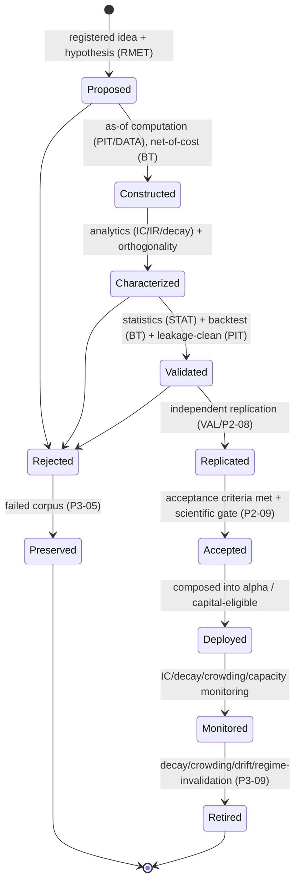

# Factor Research & Alpha Discovery Rulebook

| Field              | Value                                                                      |
| ------------------ | -------------------------------------------------------------------------- |
| **Rulebook IDs**   | RB-09 (`FEAT`) + RB-10 (`FCTR`) — consolidated in one file                 |
| **Rule ID prefix** | `FAR` (Feature/Factor & Alpha Research; unifying both domains)             |
| **Tier**           | 3 (Rulebook)                                                               |
| **Owner**          | Head of Quantitative Research (**HQ**)                                     |
| **Co-signers**     | Governance & Risk Committee (**GRC**), Architecture Review Board (**ARB**) |
| **Version**        | 1.0.0                                                                      |
| **Status**         | PROPOSED (binding upon ARB ratification per Framework §10)                 |
| **Last Ratified**  | — (pending)                                                                |
| **Supersedes**     | —                                                                          |

> **Packaging note.** The framework catalogs Feature Engineering (RB-09) and Factor Research (RB-10) as adjacent rulebooks sharing one owner (HQ) and one discovery pipeline. This file consolidates both under a single continuous `FAR-n` rule ID space. If the ARB later requires strict one-rulebook-per-file, it splits along the feature/factor section boundaries with no content change.

> **Reading note.** Tier-3 operational law. Subordinate to `CLAUDE.md` and the Architecture Canon; supreme over Agent/Workflow Contracts and Source Code. Defines _how alpha ideas become production-grade factors_, not investing advice or implementation. It governs the **production** of features, factors, signals, and composite alphas; the **research process** that surrounds them is owned by RB-02 · RMET and the **statistical validity** by RB-01 · STAT — both referenced, never restated.

---

## 2. Purpose

To define the immutable standards governing the discovery, construction, classification, validation, combination, monitoring, and retirement of alpha: features → signals → factors → composite alphas. This rulebook is the single authority on **feature/factor/signal/alpha taxonomy, ontology, and classification; feature and factor acceptance & retirement criteria; net-of-cost factor construction, orthogonalization, and redundancy control; alpha combination/ensemble (the Alpha Factory); crowding, capacity, and decay; and factor-property monitoring and explainability** (Framework §5, §8 SSOT map, FEAT + FCTR rows).

Its governing intent is `CLAUDE.md` FA-1..4, FC-1..5, AD-1..4, and the audit's alpha findings: unconstrained search maximizes false discovery; gross "alpha" that dies after costs was never alpha; "new" factors that are variants of known ones bloat the zoo; and crowding/capacity — the two things that actually kill institutional alpha — must be first-class (REVIEW quant risks, M4).

## 3. Scope & Boundaries

**In scope (this rulebook is the authority):**

- Alpha/feature/signal taxonomy, factor ontology and classification, and factor families.
- Feature definition standards, acceptance, versioning/provenance (feature-level), the Feature Marketplace.
- Net-of-cost factor construction; signal processing (neutralization, normalization, decay); orthogonalization and redundancy/diversity control; factor-zoo guard.
- Alpha combination and ensemble construction (the Alpha Factory); meta-alpha research.
- Alpha crowding, capacity (as a factor property), decay, and the feature/factor/signal/alpha lifecycle and retirement criteria.
- Factor/feature/signal explainability (economic-rationale requirement); factor-property monitoring.

**Out of scope (references only — Framework RBK-A2, RBK-DUP-1):**

- **Research process: idea/hypothesis lifecycle, pre-registration, discovery _workflow_, failed-research preservation, KG integration process, scorecards process, promotion _process_, generator↔validator isolation** → **RB-02 · RMET** (`P3-01/02/04/05`, `P4-07`, `P2-07`).
- **Statistical validity: IC/IR/rank-correlation/mutual-information significance, orthogonality/redundancy _tests_, deflation, PBO, multiple testing, stability/drift _methods_** → **RB-01 · STAT**.
- **Backtest realism, in-simulation capacity _estimation_, net-of-cost _backtesting_** → **RB-11 · BT** (`P3-16`, `BKT-53`).
- **Validation orchestration, one-shot holdout, independent replication _execution_, scientific gate** → **RB-04 · VAL** (`P2-05..P2-09`).
- **As-of/vintage/lineage/leakage read enforcement; feature _computation_ via as-of gateway** → **RB-08 · PIT** (`P1-01`, `P1-06`, `P2-03`).
- **Underlying data quality/certification** → **RB-06/07 · DATA**; **reproducibility manifests** → **RB-05 · REPRO** (`P1-02`).
- **Portfolio construction, capital allocation, sizing** → **RB-12 · PORT**; **risk limits, model-risk, concentration limits** → **RB-13 · RISK**.
- **Knowledge-graph/corpus mechanics & scoping** → **RB-19 · MEM** (`P3-14`, `P4-06`); **regime service** → (`P3-10`).
- **AI role limits, agent SRP/authority/communication** → **RB-15 · AIGOV**, **RB-18 · AGENT**.

FAR states _what a valid feature/factor/alpha and its lifecycle require_; the owners define _process_, _statistical method_, or _mechanism_. Requirements over out-of-scope items are **acceptance conditions** citing the owner.

## 4. Constitutional Basis (`CLAUDE.md`)

Traces to: **FA-1..4** (feature acceptance), **FC-1..5** (factor acceptance), **AD-1..4** (net-alpha, economic rationale, generator↔validator isolation, capacity/crowding), **RL-2** (retirement), **KM-1..3** (knowledge), **SM-1..5** (scientific method), **CP-5/6/7**, and Forbidden Practice **FB-8**.

## 5. Architectural Basis (Architecture Canon)

Grounded in ARCH **§2.4** (Research Engine), **§2.5** (Factor Engineering: factor_library, factor_generators, signal_processing, factor_analytics, orthogonalization, factor_zoo_guard, alpha_combination), **§2.14** (Knowledge); PATCH **P2-04** (net-alpha screen), **P3-06** (Factor Ontology), **P3-07** (Feature Marketplace), **P3-08** (Alpha Factory), **P3-09** (Factor Lifecycle & Retirement), **P3-11** (Crowding & Capacity), **P3-12** (Explainability/Economic-Rationale), **P1-06** (Feature Factory), **P2-07** (Isolation Barrier); REVIEW factor-zoo, orthogonalization, gross-alpha illusion, and crowding/capacity findings.

## 6. Definitions

Constitutional, STAT, RMET, DATA, BT, and RISK glossary terms are **not** redefined. Feature/factor/alpha-specific terms are in §Glossary. Higher tiers govern collisions.

---

## Rule Format

**Pivotal rules** carry the full block: _Purpose · Rationale · Acceptance · Failure · Refs_. **Supporting rules** carry RFC 2119 force plus a one-line rationale. Every rule has a stable ID (`FAR-n`, continuous) and traces to a constitutional basis.

---

# RULES

## Philosophy

- **FAR-1 (MUST).** A factor MUST be treated as a _falsifiable claim about a persistent economic mechanism_, not as a pattern that fit the past. _Rationale:_ AD-2, RMET-1; patterns without mechanisms are overfitting waiting to fail (REVIEW). _Refs:_ FAR-70.
- **FAR-2 (MUST).** Alpha MUST be defined and judged **net of realistic costs and after deflation**; gross, pre-cost, undeflated performance is not alpha. _Rationale:_ AD-1, SI-3; the gross-alpha illusion is a primary institutional self-deception (REVIEW; STAT-72, BKT-42). _Refs:_ FAR-58, FAR-90.
- **FAR-3 (MUST).** A "new" factor MUST demonstrate incremental, non-redundant, orthogonal information beyond the existing library; novelty of name is not novelty of information. _Rationale:_ FC-2; factor-zoo bloat corrupts multiplicity accounting and wastes budget (REVIEW). _Refs:_ FAR-55, FAR-56.

## Alpha Discovery Philosophy

- **FAR-4 (MUST).** The search for alpha MUST be constrained ex ante by economic priors; unconstrained, purely data-driven search MUST be counted, isolated, and treated as high-false-discovery-rate (RMET-8, RMET-53). _Rationale:_ AD-2; unconstrained search maximizes false discovery (REVIEW quant). _Refs:_ RMET-53, FAR-70.
- **FAR-5 (MUST).** Discovery MUST occur behind the generator↔validator isolation barrier (owned by RB-02 · RMET / RB-18 · AGENT / `P2-07`); any process that lets factor generation learn from validation/OOS outcomes is PROHIBITED. _Rationale:_ AD-3; otherwise the search overfits the validator (REVIEW; STAT-AP-4). _Refs:_ RMET-86, BKT-91.

## Research Principles

- **FAR-6 (MUST).** Every feature, signal, factor, and alpha MUST originate from a registered idea and pre-registered hypothesis (owned by RB-02 · RMET); ad-hoc, unregistered factor mining is PROHIBITED. _Rationale:_ SM-2, FB-8; unregistered mining is p-hacking (RMET-F-2). _Refs:_ RMET-16, RMET-24, STAT-14.
- **FAR-7 (MUST).** Every candidate evaluation MUST be a counted trial in the Trial Ledger (owned by STAT/EXP); factor search does not get free re-rolls. _Rationale:_ SI-1; uncounted trials break deflation (REVIEW C2). _Refs:_ STAT-14.

## Alpha Taxonomy

- **FAR-8 (MUST).** Every alpha MUST be classified within the institutional alpha taxonomy; unclassified alpha MUST NOT be promoted. _Rationale:_ classification enables orthogonality, crowding, and capacity reasoning. _Refs:_ FAR-24, FAR-31.

**Alpha taxonomy (each alpha MUST be tagged on all axes):**

| Axis                | Values                                                                                         |
| ------------------- | ---------------------------------------------------------------------------------------------- |
| **Economic source** | fundamental · price/technical · microstructure · macro · alternative · sentiment · cross-asset |
| **Breadth**         | cross-sectional · time-series                                                                  |
| **Horizon**         | intraday · short · medium · long                                                               |
| **Mechanism class** | risk-premium · behavioral · structural/frictional · informational                              |
| **Data dependency** | market · fundamental · alt-data · derived                                                      |

## Feature Taxonomy

- **FAR-9 (MUST).** Features MUST be classified by input data type, transformation class, and temporal nature (point-in-time snapshot vs windowed vs event-driven). _Rationale:_ enables reuse, dedup, and leakage reasoning. _Refs:_ FAR-42.

## Signal Taxonomy

- **FAR-10 (MUST).** Signals (features shaped into directional/strength predictions) MUST be classified by horizon, breadth, and decay profile. _Rationale:_ signal decay and horizon drive combination and capacity. _Refs:_ FAR-60, FAR-84.

## Registries (Idea, Feature, Signal, Factor, Alpha)

> **Boundary note.** The **Idea/Hypothesis registries and research lineage** are owned by **RB-02 · RMET** (`P3-01/02`). This rulebook owns the **Feature, Signal, Factor, and Alpha registries** as production artifacts and their acceptance state.

### Idea Registry

- **FAR-11 (MUST).** Feature/factor ideas MUST be captured in the Idea Registry per RB-02 · RMET (RMET-16) before any construction; FAR adds no separate idea store. _Rationale:_ single source of truth; avoids duplicate registries. _Refs:_ RMET-16.

### Feature Registry

- **FAR-12 (MUST).** Every accepted feature MUST reside, versioned and immutable, in the Feature Registry / Marketplace (`P3-07`) with its definition, classification, provenance, and acceptance record. _Rationale:_ FA-4; discoverable, reusable, non-duplicated features. _Refs:_ FAR-40, FAR-42.

### Signal Registry

- **FAR-13 (MUST).** Signals derived from features MUST be registered with their transformation lineage to source features. _Rationale:_ CP-6; signals must be traceable to features and data.

### Factor Registry

- **FAR-14 (MUST).** Every factor MUST reside in the Factor Registry/Library (ARCH §2.5) with its ontology classification, construction spec, analytics, orthogonality record, and lifecycle state. _Rationale:_ FC-2; the library is the canonical set of validated factors. _Refs:_ FAR-24, FAR-45.

### Alpha Registry

- **FAR-15 (MUST).** Every composite alpha MUST reside in the Alpha Registry with its constituent factors (each capital-eligible), combination method, and lifecycle state. _Rationale:_ AD; composite alphas must be auditable to eligible parts. _Refs:_ FAR-62.

## Research Lineage

- **FAR-16 (MUST).** Every feature/signal/factor/alpha MUST carry complete lineage: idea → hypothesis → data (as-of) → feature → signal → factor → alpha → outcome (capture per DATA/PIT; graph per MEM). _Rationale:_ CP-6; incomplete lineage breaks invalidation and audit. _Refs:_ DATA-31, RMET-67.

## Knowledge Graph Integration

- **FAR-17 (MUST).** Factors, features, and their outcomes MUST be linked into the Knowledge Graph with provenance and confidence (mechanism owned by RB-19 · MEM / `P3-14`; process by RMET-67). Validation/OOS-derived edges MUST NOT be readable by generation agents (isolation, `P2-07`). _Rationale:_ KM-1; enables prior-art, crowding, and meta-research without leaking to generators. _Refs:_ RMET-67, RMET-68.

## Lifecycles (Feature, Signal, Factor, Alpha)

- **FAR-18 (MUST).** Every feature, signal, factor, and alpha MUST traverse the governed lifecycle below; stages MUST NOT be skipped, transitions are gated and recorded, and terminal-negative artifacts are preserved (failed corpus, RB-02 · RMET / `P3-05`). _Rationale:_ RL-1/2; a governed lifecycle with a defined _death_ prevents dead alpha from persisting. _Refs:_ FAR-46, RMET-61.

## Feature Acceptance Criteria

- **FAR-19 (MUST).** A feature MUST NOT be accepted unless: defined declaratively and computed only via the as-of Feature Factory (RB-08 · PIT / `P1-06`); leakage-clean (leakage harness, `P2-03`); backed by certified data (RB-06/07 · DATA / DATA-49); carrying full provenance and a Run Manifest (RB-05 · REPRO); versioned and immutable; and classified in the feature taxonomy.
  - _Purpose:_ a single fail-closed feature gate. _Rationale:_ FA-1..4; a leaky or un-provenanced feature poisons everything downstream. _Acceptance:_ all conditions green; feature registered. _Failure:_ any condition unmet. _Refs:_ STAT-69, FA-1..4, DATA-49.
- **FAR-20 (MUST).** A feature's predictive contribution MUST be evidenced by pre-registered, leakage-free significance testing (statistical validity owned by STAT-69). _Rationale:_ features are hypotheses and incur multiplicity. _Refs:_ STAT-69.

## Feature Retirement Criteria

- **FAR-21 (MUST).** A feature MUST be retired or quarantined when its data source is deprecated/invalidated, its stability breaks, or it is superseded; retirement cascades to dependent signals/factors (invalidation per DATA-30). _Rationale:_ RL-2, DP-2; stale features silently degrade dependents. _Refs:_ FAR-46, DATA-50.

## Factor Acceptance Criteria

- **FAR-22 (MUST).** A factor MUST NOT be accepted unless **all** hold: statistically significant after correlation-aware deflation and capital-grade error control (STAT-71); incrementally orthogonal and ontology-classified, non-redundant (FAR-55); an evaluated economic rationale (FAR-70); net-of-cost with a capacity/crowding assessment (FAR-58, FAR-64); PBO below threshold and robust across subperiods/sub-universes/regimes (BT/STAT); independently replicated (FAR-77); and passing the scientific gate (`P2-09`).
  - _Purpose:_ the cumulative capital-grade factor gate. _Rationale:_ FC-1..5, AD-1/2; capital-grade evidence is cumulative and non-negotiable. _Acceptance:_ all conditions green; factor registered as Accepted. _Failure:_ any condition unmet → Rejected/preserved. _Refs:_ STAT-71, STAT-72, STAT-76, BKT-68, `P2-09`.

## Factor Retirement Criteria

- **FAR-23 (MUST).** A factor MUST be retired when it meets pre-registered decay, crowding, drift, regime-invalidation, or capacity-erosion criteria (statistical triggers per STAT-81; execution per `P3-09`; risk linkage per RISK-40). Retirement MUST be recorded with rationale and lineage, and its knowledge-corpus confidence decayed (RMET-74).
  - _Purpose:_ give every factor a governed death. _Rationale:_ RL-2; alpha rots and crowds; dead factors bleed capital (REVIEW). _Acceptance:_ decayed/crowded factors are flagged and retired on a governed path. _Failure:_ a decayed/crowded factor left live. _Refs:_ STAT-82, BKT-86, RISK-40, RMET-73.

## Signal Acceptance Criteria

- **FAR-24 (MUST).** A signal MUST NOT be accepted unless its source features are accepted (FAR-19), its transformation is as-of correct and leakage-free, its decay profile is characterized, and it is registered with lineage. _Rationale:_ signals inherit and can introduce leakage. _Refs:_ FAR-13, STAT-90.

## Alpha Acceptance Criteria

- **FAR-25 (MUST).** A composite alpha MUST NOT be accepted unless every constituent factor is capital-eligible (bearing a scientific-eligibility token, `P2-09`), the combination is net-of-cost and regime-aware, diversity/orthogonality across constituents is evidenced, and the composite is itself validated and replicated. _Rationale:_ AD; a composite is only as sound as its parts and their independence. _Refs:_ FAR-62, FAR-63, `P2-09`.

## Ontology & Classification

### Factor Ontology

- **FAR-26 (MUST).** Every factor MUST be classified within the Factor Ontology (`P3-06`) by economic mechanism, data source, and construction; the ontology is the shared vocabulary for orthogonalization, dedup, and crowding. _Rationale:_ FC-2; without an ontology, variants evade the zoo guard. _Acceptance:_ every factor has an ontology class linked to its correlation cluster (STAT-21). _Failure:_ an unclassified factor. _Refs:_ FAR-55, STAT-76.

### Feature Ontology

- **FAR-27 (MUST).** Features MUST be classified within a feature ontology consistent with the factor ontology, enabling reuse and redundancy detection. _Rationale:_ reduces duplicate features (RMET-49). _Refs:_ FAR-42.

### Factor Classification / Feature Classification

- **FAR-28 (MUST).** Classification MUST be recorded at registration and versioned; reclassification creates a new version, never a silent edit. _Rationale:_ CP-2; classification is part of the auditable record.

## Factor Families

- **FAR-29 (MUST).** Every factor MUST be assigned to one or more recognized families (below); families drive orthogonality expectations, capacity profiles, and crowding analysis. _Rationale:_ families organize the library and inform diversity. _Refs:_ FAR-55, FAR-63.

**Factor family reference (each family carries family-specific construction and PIT concerns):**

| Family                    | Nature                             | Key concerns                              |
| ------------------------- | ---------------------------------- | ----------------------------------------- |
| **Cross-Sectional**       | ranks across universe at a time    | neutralization, as-of universe (BKT-15)   |
| **Time-Series**           | signal per instrument over time    | autocorrelation, embargo (STAT-51)        |
| **Alternative-Data**      | non-market sources                 | provenance, poisoning, license (DATA)     |
| **Market-Microstructure** | order-flow/liquidity               | capacity-sensitive, decay-fast (FAR-64)   |
| **Macro**                 | economy-wide (non-tradable inputs) | low breadth, regime-dependence            |
| **Fundamental**           | reported financials                | restatement/vintage (DATA-16), as-of      |
| **Sentiment**             | text/news/social                   | untrusted-text quarantine (`P4-03`)       |
| **Regime**                | conditioning states                | pre-registered regimes (STAT-84), `P3-10` |
| **Composite**             | blends of validated factors        | eligibility of parts (FAR-25)             |
| **Ensemble**              | model-combined signals             | diversity, overfitting (FAR-63)           |

### Cross-Sectional Factors

- **FAR-30 (MUST).** Cross-sectional factors MUST be computed on the as-of, survivorship-free universe (BKT-15) with declared neutralizations (sector/beta) applied as-of. _Rationale:_ forward-looking universe/neutralization is silent look-ahead. _Refs:_ BKT-15, FAR-48.

### Time-Series Factors

- **FAR-31 (MUST).** Time-series factors MUST account for autocorrelation and use purged/embargoed evaluation (STAT-45/51). _Rationale:_ overlapping-window leakage fabricates skill. _Refs:_ STAT-45.

### Alternative Data Factors

- **FAR-32 (MUST).** Alt-data factors MUST evidence data provenance, licensing compliance, and (for ingested text) trust-quarantine (`P4-03`); alt-data is not tradable itself but may inform tradable signals. _Rationale:_ DATA, REVIEW C3; poisoned/unlicensed alt-data is a legal and integrity risk. _Refs:_ DATA-32, RMET-47.

### Market Microstructure Factors

- **FAR-33 (MUST).** Microstructure factors MUST carry explicit capacity/decay characterization, as their edge typically erodes fast and is capacity-constrained. _Rationale:_ REVIEW M4; microstructure alpha is small-capacity and fast-decaying. _Refs:_ FAR-64.

### Macro Factors

- **FAR-34 (MUST).** Macro factors MUST be treated as low-breadth (few independent bets); significance MUST reflect the small effective number of independent observations (STAT-40). _Rationale:_ macro's low breadth inflates naive significance. _Refs:_ STAT-40.

### Fundamental Factors

- **FAR-35 (MUST).** Fundamental factors MUST use vintage-correct (as-of) financials handling restatements (DATA-16); using restated history is PROHIBITED. _Rationale:_ PIT; restatement look-ahead is a classic fundamental-factor corruption. _Refs:_ DATA-16, RB-08 · PIT.

### Sentiment Factors

- **FAR-36 (MUST).** Sentiment/text factors MUST pass untrusted-content quarantine and MUST NOT let source text influence generation beyond the trust boundary (`P4-03`). _Rationale:_ REVIEW C3; adversarial text can steer factors. _Refs:_ RMET-47.

### Regime Factors

- **FAR-37 (MUST).** Regime factors/conditioning MUST use pre-registered regime definitions from the regime service (`P3-10`); post-hoc regime slicing to maximize significance is PROHIBITED. _Rationale:_ STAT-84; post-hoc regimes are p-hacking. _Refs:_ STAT-83, BKT-62.

### Composite Factors

- **FAR-38 (MUST).** Composite factors MUST be built only from validated constituents and MUST evidence that the composite adds incremental value beyond its parts. _Rationale:_ FC-2; composition must not merely repackage existing factors. _Refs:_ FAR-25, FAR-56.

### Ensemble Factors

- **FAR-39 (MUST).** Ensemble/model-combined factors MUST demonstrate constituent diversity and MUST have overfitting risk (PBO) assessed on the ensemble as a whole (STAT-47). _Rationale:_ ensembles can overfit at the combination layer. _Refs:_ FAR-63, STAT-47.

## Feature Engineering Standards

- **FAR-40 (MUST).** Feature definitions MUST be declarative, deterministic given the manifest, and computed only from as-of data; global/full-sample statistics that leak the future are PROHIBITED (owned by PIT/`P1-06`, STAT-90). _Rationale:_ FA-1, PIT-3; recomputation leakage is subtle and fatal. _Refs:_ STAT-90, DATA-48.
- **FAR-41 (MUST).** Signal processing (normalization, winsorization, neutralization, decay) MUST be applied as-of and fit only within training folds during validation (STAT-90); look-ahead normalization is PROHIBITED. _Rationale:_ full-sample scaling leaks. _Refs:_ STAT-90, BKT-22.

## Feature Versioning

- **FAR-42 (MUST).** Features MUST be immutably versioned; any change to a definition creates a new version. Downstream artifacts MUST reference the exact feature version consumed. _Rationale:_ CP-2, CP-4; ambiguous feature identity breaks reproducibility. _Refs:_ DATA-40, VER-1.

## Feature Provenance

- **FAR-43 (MUST).** Every feature MUST carry provenance to its source data, transformation, and manifest (capture per DATA-29/REPRO); a feature without provenance MUST NOT be accepted. _Rationale:_ DP-1, DP-3, FA-3. _Refs:_ DATA-29.

## Feature Stability

- **FAR-44 (MUST).** Feature stability across time and sub-populations MUST be assessed (statistical methods owned by STAT-78); unstable features MUST be labeled and MUST NOT be promoted without an explicit stability rationale. _Rationale:_ unstable features do not generalize. _Refs:_ STAT-78.

## Feature Drift

- **FAR-45 (MUST).** Deployed features MUST be monitored for distribution and relationship drift (statistical detection per STAT-81; data-distribution drift per DATA-82; tooling per OBS); drift breaches trigger review. _Rationale:_ drifting features silently change factor meaning. _Refs:_ STAT-81, DATA-82.

## Factor Stability

- **FAR-46 (MUST).** Factor performance MUST be stable across pre-registered subperiods, sub-universes, and regimes within a GRC-governed dispersion tolerance; instability beyond tolerance is a rejection/retirement trigger (methods per STAT-79). _Rationale:_ VS; a factor that works only in one slice is likely an artifact. _Refs:_ STAT-79, BKT-72.

## Regime Robustness

- **FAR-47 (MUST).** Factor evidence MUST be reported conditional on regime (`P3-10`); a factor whose edge exists only in one regime MUST be labeled regime-dependent and sized/retired accordingly. _Rationale:_ REVIEW quant; alpha is conditional. _Refs:_ STAT-83, BKT-62.

## Factor Analytics (IC, IR, Rank Correlation, MI)

> **Boundary note.** The _statistical validity_ of these metrics (dependence-aware, deflated significance) is owned by **RB-01 · STAT**. FAR requires their computation and sets acceptance criteria.

### Information Coefficient

- **FAR-48 (MUST).** Every factor MUST report its Information Coefficient (predictive correlation) with dependence-aware significance and dispersion over time; a factor whose IC is not significant after deflation MUST be rejected (statistics per STAT). _Rationale:_ FC-1; IC is the core predictive-power measure. _Refs:_ STAT-71.

### Information Ratio

- **FAR-49 (MUST).** Factors MUST report a **deflated** Information Ratio; undeflated IR MUST NOT be used as acceptance evidence (deflation owned by STAT-3/21). _Rationale:_ SI-3; undeflated IR overstates edge. _Refs:_ STAT-3, BKT-69.

### Rank Correlation

- **FAR-50 (MUST).** Where rank-based prediction is claimed, rank correlation MUST be reported with dependence-aware significance (STAT). _Rationale:_ rank metrics are robust to outliers but still require correct inference.

### Mutual Information

- **FAR-51 (MAY).** Non-linear predictive relationships MAY be assessed via mutual information; MI estimates MUST report their estimator and uncertainty and be counted as trials (STAT). _Rationale:_ MI captures non-linear dependence but is estimation-sensitive and multiplicity-incurring. _Refs:_ STAT-14.

## Orthogonality & Redundancy

### Orthogonality Standards

- **FAR-52 (MUST).** Every candidate factor MUST be orthogonalized against known risk factors and the existing library, and its **incremental** deflated significance evaluated; orthogonalization MUST use only as-of information (statistics per STAT-76/77). _Rationale:_ FC-2; a factor that is largely known-factor beta is not novel alpha. _Acceptance:_ incremental deflated significance above threshold. _Failure:_ redundant with existing factors. _Refs:_ STAT-76, FAR-59.

### Redundancy Detection

- **FAR-53 (MUST).** The factor-zoo guard MUST reject factors whose information is substantially explained by existing library factors (redundancy tests per STAT); adding redundant factors is PROHIBITED. _Rationale:_ factor-zoo bloat corrupts trial correlation and capacity reasoning (REVIEW). _Refs:_ FAR-26, STAT-21.

### Mutual Information (redundancy)

- **FAR-54 (SHOULD).** Non-linear redundancy SHOULD be checked (e.g., via MI) in addition to linear correlation, since factors may be linearly orthogonal yet informationally redundant. _Rationale:_ linear orthogonality is necessary, not sufficient.

## Diversity Requirements

- **FAR-55 (MUST).** The factor library and any composite/ensemble MUST maintain diversity across families, mechanisms, and correlation clusters; concentration of the library in a single family/mechanism MUST be flagged as a research and risk concern (risk linkage RISK-42). _Rationale:_ diversity is the source of durable, non-crowded alpha. _Refs:_ FAR-63, RISK-42.

## Alpha Combination & Ensemble Construction (Alpha Factory)

- **FAR-56 (MUST).** Composite alphas MUST be produced only through the governed Alpha Factory pipeline (`P3-08`): validated-factor intake → net-of-cost screening (`P2-04`) → orthogonality/diversity check → regime-aware combination → eligibility verification → versioned composite artifact. _Rationale:_ AD; ad-hoc blending of unvalidated or redundant factors is PROHIBITED. _Acceptance:_ every composite is a versioned artifact from eligible, diverse parts. _Failure:_ a composite built from ineligible/redundant factors or outside the pipeline. _Refs:_ FAR-25, `P3-08`.
- **FAR-57 (MUST).** Combination weights/models MUST themselves be validated (in-sample selection separated from OOS estimate, STAT-56) and their overfitting risk (PBO) assessed at the combination layer. _Rationale:_ the combination step is a model that can overfit. _Refs:_ STAT-56, FAR-39.

## Meta Alpha Research

- **FAR-58 (MUST).** Meta-alpha research (studying which factor _types_ work) MUST use the failed-research corpus and scorecards (RB-02 · RMET / `P6-01`, `P3-13`) and MUST be held to the same statistical rigor as primary research. _Rationale:_ CI-2; meta-research can itself overfit. _Refs:_ RMET-69, RMET-AP-10.

## Alpha Crowding

- **FAR-59 (MUST).** Every factor/alpha MUST carry a crowding assessment (correlation to known factors and peer-behavior proxies; owned by `P3-11`); rising crowding MUST feed sizing (RB-12 · PORT / RB-13 · RISK) and retirement (FAR-23). _Rationale:_ AD-4; "is our edge everyone else's factor?" is a top institutional concern (REVIEW M4). _Acceptance:_ crowding score exists and informs sizing/retirement. _Failure:_ crowding unassessed for a deployed alpha. _Refs:_ RISK-25, FAR-23.

## Capacity Considerations

- **FAR-60 (MUST).** Every factor/alpha MUST carry a capacity estimate (as a factor property; `P3-11`), consistent with the in-simulation capacity derived by RB-11 · BT (BKT-53); capacity MUST inform allocation (RB-12 · PORT) and retirement. _Rationale:_ AD-4, REVIEW M4; capacity governs how much capital an edge can bear before it decays. _Refs:_ BKT-53, RISK-68.

## Alpha Decay

- **FAR-61 (MUST).** Alpha/factor decay MUST be characterized at acceptance (half-life) and monitored in production; decay beyond a pre-registered threshold triggers retirement review (FAR-23). _Rationale:_ RL-2; all alpha decays; the question is how fast. _Refs:_ STAT-81, FAR-23.

## Monitoring (Alpha, Factor, Signal)

- **FAR-62 (MUST).** Deployed features, signals, factors, and composite alphas MUST be continuously monitored for IC/decay, stability, drift, crowding, and capacity erosion (statistical methods per STAT-81; tooling per RB-28 · OBS); breaches trigger review/retirement. _Rationale:_ RL-2; unmonitored alpha silently degrades. _Acceptance:_ every deployed artifact has active monitors with thresholds. _Failure:_ a deployed artifact with no monitoring. _Refs:_ STAT-81, RB-28 · OBS, FAR-23.

## Explainability Requirements

- **FAR-63 (MUST).** Every promoted factor MUST have a documented, falsifiable economic mechanism evaluated by the explainability process (`P3-12`; requirement per RMET-8, EXP-1); "statistically significant but unexplained" is insufficient for promotion. _Rationale:_ AD-2, EXP-1; constraining with economic priors keeps multiplicity survivable and factors durable (REVIEW). _Acceptance:_ an evaluated economic rationale accompanies every promotion. _Failure:_ promotion on significance alone. _Refs:_ RMET-8, `P3-12`.

## Independent Replication

- **FAR-64 (MUST).** No factor or composite alpha MAY reach capital eligibility without independent replication of its key results via a separate path (executed by RB-04 · VAL / `P2-08`; requirement per STAT-108); discrepancy beyond tolerance auto-rejects. _Rationale:_ VS-4; single-implementation factors may be implementation artifacts (REVIEW Missing #4). _Refs:_ STAT-108, BKT-77.

## Research Scorecards

- **FAR-65 (MUST).** Factor-research productivity (hit-rate, realized FDR, budget consumption, time-to-verdict) MUST be reported via Research Scorecards (RB-02 · RMET / `P3-13`); scorecards MUST NOT incentivize positive results per se. _Rationale:_ CI-1, RMET-70; measure process health, not "win rate." _Refs:_ RMET-69.

## Promotion Gates

> **Boundary note.** Gate _orchestration_ is owned by **RB-04 · VAL** (`P2-09`) and **RB-30 · DEPLOY**; _process_ by **RB-02 · RMET**; _statistical evidence_ by **STAT**; _backtest evidence_ by **BT**. This rulebook defines the **feature/factor/alpha evidence** required.

- **FAR-66 (MUST).** No feature/factor/alpha advances a gate without the full evidence for that gate; partial evidence is rejection (fail-closed). _Rationale:_ RG-1; gates are cumulative. _Refs:_ FAR-22, FAR-25.

**Factor/alpha promotion evidence matrix:**

| Gate                        | Required FAR evidence                                                     | Cross-owner checks                  |
| --------------------------- | ------------------------------------------------------------------------- | ----------------------------------- |
| **Feature Accepted**        | as-of/leakage-clean, provenance, classified, significant IC               | PIT (`P2-03`), STAT-69, DATA-49     |
| **Factor Validated**        | deflated IC/IR, orthogonal & non-redundant, net-of-cost, stability/regime | STAT-71/76, BT                      |
| **Factor Capital-Eligible** | PBO, capacity, crowding, economic rationale, replication, scientific gate | BT (BKT-68), `P3-11/12`, `P2-08/09` |
| **Alpha Composed**          | eligible+diverse constituents, validated combination, PBO at combination  | FAR-25, STAT-56                     |

## Production Readiness

- **FAR-67 (MUST).** A factor/alpha is production-ready only when Accepted (FAR-22/25), capital-eligible (`P2-09`), risk-cleared (RB-13 · RISK), and integrated into a portfolio within limits (RB-12 · PORT). _Rationale:_ RG-3; production readiness spans research, risk, and portfolio. _Refs:_ RISK-65, RB-12 · PORT.

## Retirement Policy

- **FAR-68 (MUST).** Retirement MUST follow a governed path (FAR-23): flag → confirmation window → governed retirement → portfolio unwind (RB-12 · PORT / RB-13 · RISK) → knowledge-corpus update. Premature or silent retirement is PROHIBITED. _Rationale:_ RL-2; disorderly retirement creates risk. _Refs:_ RISK-40, RMET-74.

## Knowledge Preservation

- **FAR-69 (MUST).** Every accepted and every retired/rejected factor MUST leave durable, structured knowledge: accepted factors in the library and corpus (KM-2); rejected/retired in the failed-research corpus with reasons (RB-02 · RMET / `P3-05`). _Rationale:_ KM; the compounding library and failure record are the institution's moat (REVIEW Missing #9). _Refs:_ RMET-61, RMET-66.

## Research Audit

- **FAR-70 (MUST).** Factor research MUST be periodically audited (cadence GRC-governed): sampling accepted and rejected factors to confirm lifecycle compliance, orthogonality/redundancy discipline, and evidence integrity. _Rationale:_ CP-7. _Refs:_ RMET-78.

## Governance

- **FAR-71 (MUST).** GRC governs factor-research parameters (IC/IR minimums, orthogonality/redundancy thresholds, dispersion/decay/crowding tolerances, diversity targets) via the Exceptions process; researchers and agents MUST NOT alter them. _Rationale:_ CP-1; controls belong to governance.
- **FAR-72 (MUST).** Factor acceptance and promotion sign-off MUST be independent of the factor's author (CP-5). _Rationale:_ the builder must not be the judge. _Refs:_ RMET-57.

## AI Research Agent Responsibilities

- **FAR-73 (MUST).** AI agents MAY generate feature/factor candidates, run factor search, characterize analytics, and narrate; they MUST NOT adjudicate significance, decide acceptance/retirement, approve promotion, or size capital (AI-1..AI-4, DE-1). _Rationale:_ controls and adjudication are deterministic/human (RMET-87). _Refs:_ RB-15 · AIGOV.
- **FAR-74 (MUST).** Factor-search agents MUST operate behind the isolation barrier (no per-candidate validation/OOS visibility) and MUST register every candidate as a counted trial (`P2-07`, STAT-14). _Rationale:_ AD-3; unbounded search that sees validation feedback overfits the referee. _Refs:_ RMET-53, BKT-91.
- **FAR-75 (MUST).** Agent-produced factor artifacts MUST record model/prompt/output provenance (`P1-02`). _Rationale:_ CP-4, AI-8.

## Human Responsibilities

- **FAR-76 (MUST).** A named human MUST be accountable for every promotion-track factor/alpha and for agent-run factor searches (RMET-36/90). _Rationale:_ HO-1; accountability is non-delegable to AI. _Refs:_ RMET-90.
- **FAR-77 (MUST).** Humans MUST NOT override acceptance criteria, orthogonality/redundancy control, deflation, or the isolation barrier; such overrides are void (HO-3). _Rationale:_ the controls bind humans too. _Refs:_ RMET-91.

---

## Acceptance Criteria (summary checklists)

**Feature acceptance (all MUST pass):**

- [ ] Declarative, as-of computed, leakage-clean (FAR-19, FAR-40).
- [ ] Certified data backing; full provenance + manifest (FAR-43, DATA-49).
- [ ] Significant predictive contribution (deflated) (FAR-20, FAR-48).
- [ ] Versioned, immutable, classified, registered (FAR-42, FAR-27).

**Factor acceptance (all MUST pass):**

- [ ] Deflated, capital-grade significant IC/IR (FAR-48, FAR-49).
- [ ] Orthogonal, non-redundant, ontology-classified (FAR-52, FAR-53, FAR-26).
- [ ] Net-of-cost; capacity + crowding assessed (FAR-58, FAR-59, FAR-60).
- [ ] PBO below threshold; stable across subperiods/regimes (BKT-68, FAR-46, FAR-47).
- [ ] Evaluated economic rationale (FAR-63).
- [ ] Independently replicated; scientific gate passed (FAR-64, `P2-09`).

**Alpha (composite) acceptance (all MUST pass):**

- [ ] Constituents capital-eligible and diverse/orthogonal (FAR-25, FAR-55).
- [ ] Built via Alpha Factory; combination validated; PBO at combination (FAR-56, FAR-57).
- [ ] Net-of-cost, regime-aware; monitoring configured (FAR-56, FAR-62).

## Rejection / Retirement Criteria

A feature/factor/alpha MUST be **rejected or retired** if **any** hold:

- **FAR-78.** Leakage, look-ahead, or non-as-of computation (FAR-19, FAR-40).
- **FAR-79.** Not significant after deflation, or PBO above threshold (FAR-48, BKT-68).
- **FAR-80.** Redundant / not incrementally orthogonal (FAR-52, FAR-53).
- **FAR-81.** Gross-only definition, or missing capacity/crowding assessment (FAR-2, FAR-59, FAR-60).
- **FAR-82.** No evaluated economic rationale (FAR-63).
- **FAR-83.** Fails stability/regime robustness, or decays/crowds beyond threshold (FAR-46, FAR-61, FAR-59).
- **FAR-84.** Not independently replicated, or replication discrepancy (FAR-64).
- **FAR-85.** Unregistered/unclassified, or built outside the governed pipeline (FAR-6, FAR-26, FAR-56).

## Anti-Patterns

Recognized factor-research failure modes that MUST be actively prevented (mirrors `CLAUDE.md` AP-\*, REVIEW):

- **FAR-AP-1.** Unconstrained data-driven factor mining without economic priors or trial counting (FAR-4, FAR-7).
- **FAR-AP-2.** Repackaging a known factor as "new" (redundancy/zoo bloat) (FAR-53).
- **FAR-AP-3.** Selecting/reporting alpha gross of costs or undeflated (FAR-2, FAR-49).
- **FAR-AP-4.** Post-hoc regime/universe slicing to maximize IC (FAR-37, FAR-30).
- **FAR-AP-5.** Full-sample normalization/neutralization leaking the future (FAR-41).
- **FAR-AP-6.** Deploying alpha with no crowding/capacity assessment (FAR-59, FAR-60).
- **FAR-AP-7.** Ad-hoc alpha blending outside the Alpha Factory; overfit combination layer (FAR-56, FAR-57).
- **FAR-AP-8.** Factor search agent observing validation/OOS outcomes (FAR-74).
- **FAR-AP-9.** Keeping decayed/crowded factors live (FAR-23).
- **FAR-AP-10.** Promoting on significance alone without economic mechanism (FAR-63).

## Forbidden Research Practices

Absolute prohibitions. Violation voids the artifact, blocks promotion, and is a reportable integrity event (`CLAUDE.md` FB-\*, entrenched clauses):

- **FAR-F-1.** Unregistered/uncounted factor mining or search (FAR-6, FAR-7; FB-8).
- **FAR-F-2.** Any leakage, look-ahead, or non-as-of factor/feature computation (FAR-19, FAR-40; FB-6).
- **FAR-F-3.** Selecting or reporting alpha gross of costs, or undeflated (FAR-2, FAR-49; SI-3).
- **FAR-F-4.** Adding redundant / non-orthogonal factors to the library (FAR-53).
- **FAR-F-5.** Promoting a factor with no evaluated economic rationale (FAR-63).
- **FAR-F-6.** Deploying alpha without crowding/capacity assessment (FAR-59, FAR-60).
- **FAR-F-7.** Building composite alpha from ineligible factors or outside the Alpha Factory (FAR-25, FAR-56).
- **FAR-F-8.** Factor-search agents observing validation/OOS outcomes (isolation breach) (FAR-74; AD-3).
- **FAR-F-9.** Any LLM adjudicating significance, acceptance, retirement, or promotion (FAR-73; AI-1..AI-4).
- **FAR-F-10.** Human override of acceptance/orthogonality/deflation/isolation controls (FAR-77; HO-3).
- **FAR-F-11.** Keeping a decayed/crowded factor live past its retirement trigger (FAR-23).

---

## Enforcement & Verification

| Rule group                                       | Enforcement mechanism                                                   | Mechanism owner                                    |
| ------------------------------------------------ | ----------------------------------------------------------------------- | -------------------------------------------------- |
| Registration & trial counting (FAR-6,7)          | Gate: registered idea/hypothesis + ledger entry                         | RB-02 · RMET, RB-03 · EXP                          |
| Feature acceptance (FAR-19,20,40–43)             | Gate: as-of + leakage harness + provenance + significance               | RB-08 · PIT (`P2-03`), RB-01 · STAT, this rulebook |
| Factor acceptance (FAR-22,48–53)                 | Gate: deflated significance + orthogonality/redundancy + net-cost + PBO | RB-01 · STAT, RB-11 · BT, this rulebook            |
| Ontology/classification/diversity (FAR-26–29,55) | Gate: classification required; zoo guard                                | this rulebook (`P3-06`)                            |
| Crowding/capacity/decay (FAR-59–61)              | Assessment + monitors → sizing/retirement                               | this rulebook (`P3-11`), RB-13 · RISK              |
| Alpha Factory (FAR-56,57)                        | Pipeline gate; combination validation                                   | this rulebook (`P3-08`), RB-01 · STAT              |
| Explainability (FAR-63)                          | Gate: economic rationale required                                       | `P3-12`, RB-02 · RMET                              |
| Replication (FAR-64)                             | Replication engine                                                      | RB-04 · VAL (`P2-08`)                              |
| Monitoring/retirement (FAR-62,23,68)             | Continuous monitors; governed retirement                                | RB-28 · OBS, this rulebook (`P3-09`), RB-13 · RISK |
| AI limits & isolation (FAR-73–75)                | Agent authority flags; bus ACLs                                         | RB-15/18 (`P2-07`)                                 |
| Forbidden practices (FAR-F-\*)                   | Fail-closed gate; integrity report                                      | GRC                                                |

- **FAR-E-1 (MUST).** Every rule enforcing a Forbidden Research Practice (FAR-F-*) MUST be CI/gate-enforced and fail-closed where technically possible (Framework RBK-E2). *Rationale:\* CP-1.
- **FAR-E-2 (MUST).** Acceptance, retirement, and promotion decisions MUST be deterministic; LLMs MAY assist/narrate only (AI-1..AI-4, DE-1). _Rationale:_ DE-1.

## Exceptions & Waivers

- **FAR-W-1 (MUST).** No exception MAY be granted to any Forbidden Research Practice (FAR-F-\*) or to any rule enforcing a `CLAUDE.md` entrenched clause (AM-2). Non-waivable.
- **FAR-W-2 (MAY).** GRC-governed research parameters (FAR-71) MAY be changed only by GRC + HQ, recorded as a versioned parameter set with rationale, applied prospectively (VER-2).
- **FAR-W-3 (MAY).** A time-boxed waiver of a non-entrenched rule MAY be granted only by HQ + GRC, recorded in the audit trail with scope, expiry, and rationale, and MUST NOT weaken net-of-cost definition, deflation, orthogonality/redundancy control, crowding/capacity assessment, or the isolation barrier. _Rationale:_ these are the load-bearing alpha controls.
- **FAR-W-4 (MUST).** Active waivers MUST be surfaced on the affected factor/alpha's registry record and evidence package. _Rationale:_ no hidden exceptions.

## Rulebook Acceptance Criteria (ratification)

Ratifiable (Framework §10) only when: every rule has a stable ID, RFC 2119 phrasing, a constitutional basis, and an enforcement mechanism; no rule contradicts `CLAUDE.md`, the Architecture Canon, or peer rulebooks per the SSOT map (especially the RMET/STAT/BT/VAL/PIT/PORT/RISK/MEM boundaries); all GRC-governed parameters have recorded defaults; all cross-references resolve; ARB approval with GRC co-sign obtained.

## Success Metrics

- **SM-1.** 0 factors accepted without deflated significance, orthogonality, net-of-cost definition, and economic rationale (FAR-22).
- **SM-2.** Factor-library redundancy rate within target; 0 redundant factors added (FAR-53).
- **SM-3.** 100% deployed factors/alphas with active crowding/capacity/decay monitoring (FAR-59, FAR-60, FAR-62).
- **SM-4.** Retirement latency for decayed/crowded factors within GRC target (FAR-23).
- **SM-5.** 100% promoted factors with evaluated economic rationale and independent replication (FAR-63, FAR-64).
- **SM-6.** 0 isolation-barrier breaches by factor-search agents; 100% candidates ledger-counted (FAR-74).
- **SM-7.** 0 LLM-made acceptance/retirement/promotion decisions (FAR-73).

## Dependencies & Related Rulebooks

- **Depends on:** RB-02 · RMET (idea/hypothesis, discovery workflow, isolation, failed corpus, scorecards), RB-01 · STAT (IC/IR/MI validity, deflation, PBO, orthogonality/stability/drift methods), RB-11 · BT (backtest realism, in-sim capacity), RB-08 · PIT (as-of/leakage/feature computation), RB-06/07 · DATA (certified data), RB-05 · REPRO (manifests).
- **Coordinates with:** RB-04 · VAL (replication, scientific gate), RB-12 · PORT (alpha→portfolio, sizing), RB-13 · RISK (crowding/capacity→limits, model risk, concentration), RB-19 · MEM (knowledge graph), RB-15/18 (AI limits/isolation), RB-28 · OBS (monitoring).
- **Architecture references:** ARCH §2.4, §2.5, §2.14; PATCH `P2-04`, `P3-06/07/08/09/11/12`, `P1-06`, `P2-07/08/09`; REVIEW quant risks, M4, Missing #9.

## Change Log & Version History

| Version | Date    | Author (role) | Change                                                                           | ADR |
| ------- | ------- | ------------- | -------------------------------------------------------------------------------- | --- |
| 1.0.0   | pending | HQ            | Initial consolidated Factor Research & Alpha Discovery rulebook (RB-09 + RB-10). | —   |

---

## Glossary (feature/factor/alpha-specific)

Terms in `CLAUDE.md`, STAT, RMET, DATA, BT, and RISK glossaries are not redefined.

- **Feature** — A declarative, as-of-computed, versioned input variable with predictive intent (FAR-19).
- **Signal** — A feature shaped into a directional/strength prediction with a characterized decay (FAR-10).
- **Factor** — A validated, orthogonal, ontology-classified predictive signal with an economic mechanism (FAR-22).
- **Composite Alpha** — A validated combination of capital-eligible, diverse factors produced via the Alpha Factory (FAR-25, FAR-56).
- **Factor Ontology** — The taxonomy classifying factors by mechanism, data source, and construction; basis for orthogonality, dedup, and crowding (FAR-26).
- **Factor Family** — A recognized grouping (cross-sectional, time-series, alt-data, microstructure, macro, fundamental, sentiment, regime, composite, ensemble) (FAR-29).
- **Orthogonalization** — Residualizing a candidate against known/library factors to measure incremental information (FAR-52).
- **Redundancy / Factor-Zoo Guard** — Rejection of factors substantially explained by existing ones (FAR-53).
- **Crowding** — The degree to which an edge is shared with known factors/peer behavior; a first-class factor property (FAR-59).
- **Capacity** — The AUM an alpha can bear before net edge decays; a factor property consistent with in-sim estimation (FAR-60; BKT-53).
- **Alpha Decay / Half-Life** — The rate at which an edge erodes; characterized at acceptance and monitored (FAR-61).
- **Alpha Factory** — The governed pipeline producing composite alphas from eligible, diverse, validated factors (FAR-56).
- **Information Coefficient / Information Ratio** — Core predictive-power and risk-adjusted-edge metrics; validity/deflation owned by STAT (FAR-48, FAR-49).

---

_End of Factor Research & Alpha Discovery Rulebook (RB-09 · FEAT + RB-10 · FCTR). This document owns feature/factor/alpha taxonomy, construction, orthogonality, combination, crowding/capacity, and lifecycle/retirement; it references — never restates — RMET (research process/isolation), STAT (statistical validity), BT (backtest realism), VAL (replication/gates), PIT (as-of/leakage), DATA (certified data), PORT (portfolio), RISK (limits/model risk), MEM (knowledge graph), and AIGOV/AGENT (AI limits). Binding upon ARB ratification._
