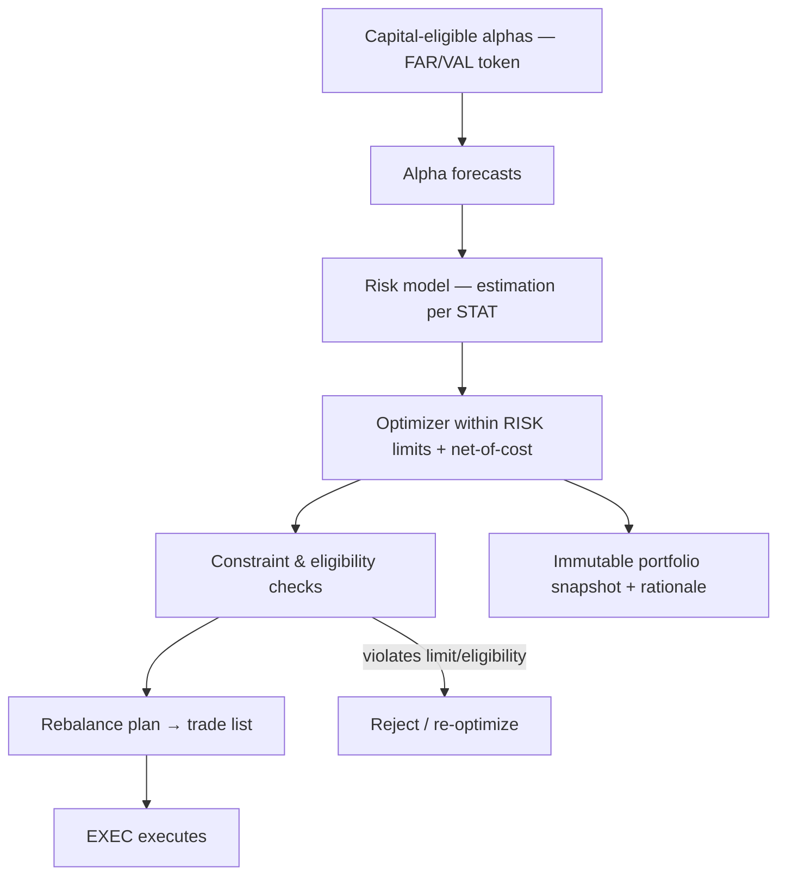
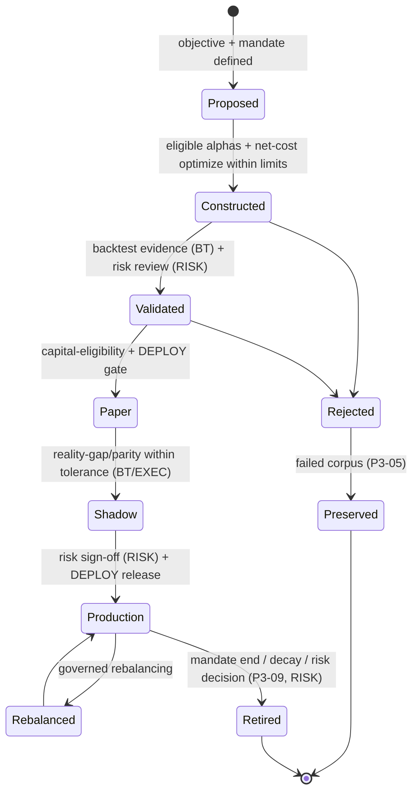

# Portfolio Construction & Capital Allocation Rulebook

| Field                            | Value                                                                                                              |
| -------------------------------- | ------------------------------------------------------------------------------------------------------------------ |
| **Rulebook ID**                  | RB-12                                                                                                              |
| **Framework code / rule prefix** | `PORT`                                                                                                             |
| **Tier**                         | 3 (Rulebook)                                                                                                       |
| **Owner**                        | Head of Portfolio & Risk (**HPR**)                                                                                 |
| **Co-signers**                   | Governance & Risk Committee (**GRC**), Head of Quantitative Research (**HQ**), Architecture Review Board (**ARB**) |
| **Version**                      | 1.0.0                                                                                                              |
| **Status**                       | PROPOSED (binding upon ARB ratification per Framework §10)                                                         |
| **Last Ratified**                | — (pending)                                                                                                        |
| **Supersedes**                   | —                                                                                                                  |

> **Reading note.** Tier-3 operational law. Subordinate to `CLAUDE.md` and the Architecture Canon; supreme over Agent/Workflow Contracts and Source Code. Defines _how validated alpha becomes investable portfolios_, not portfolio-management theory or implementation. **Portfolio construction consumes only capital-eligible alphas and constructs strictly within the limits set by RB-13 · RISK; it never re-adjudicates whether a signal is real, and it never creates alpha.**

---

## 2. Purpose

To define the immutable standards governing how capital-eligible alphas and strategies become risk-budgeted, cost-aware, constraint-respecting, auditable production portfolios — across every strategy, asset class, sleeve, and multi-strategy book. This rulebook is the single authority on **portfolio construction, optimization governance, capital allocation, alpha/strategy weighting, risk-budget allocation into portfolios, exposure/diversification/turnover/cost budgeting in construction, rebalancing, sleeve/overlay architecture, portfolio attribution, and the portfolio lifecycle** (Framework §5, §8 SSOT map, PORT row).

Its governing intent is `CLAUDE.md` PS-1..PS-4 and RS-2: the fund is a **risk-budgeted portfolio of validated alphas**; construction optimizes _net of cost_ within governance limits, consumes only validated signals, and is produced by deterministic engines — never an LLM.

## 3. Scope & Boundaries

**In scope (this rulebook is the authority):**

- Portfolio taxonomy, lifecycle, registry, versioning, ownership, classification.
- Eligibility rules for including alphas/strategies in portfolios; conviction/weighting frameworks.
- Capital allocation across strategies/sleeves; risk-budget _allocation_ into the portfolio; exposure/diversification/concentration/turnover/transaction-cost _budgeting in construction_.
- Portfolio optimization governance (objective-function and constraint governance); rebalancing philosophy and policies; dynamic and regime-aware allocation.
- Ensemble/multi-strategy/multi-factor portfolios; sleeve and overlay architecture; cash, leverage, and hedging _in construction_.
- Benchmark governance; performance/risk/alpha attribution; portfolio explainability.
- Portfolio monitoring/health/drift/capacity monitoring; portfolio production readiness and retirement.

**Out of scope (references only — Framework RBK-A2, RBK-DUP-1):**

- **Risk appetite; all risk _limits_ (exposure/position/sector/country/currency/leverage/margin/concentration/correlation/liquidity/tail/drawdown); the risk-budget _framework_; kill-switches; model risk; independent risk sign-off** → **RB-13 · RISK** (PORT constructs _within_ these).
- **Alpha/factor eligibility, crowding, capacity as a factor property, the factor→composite-alpha Alpha Factory** → **RB-10/09 · FAR** (`P3-08`, `P3-11`).
- **Backtest realism, in-simulation capacity _estimation_, sizing _validation in backtest_** → **RB-11 · BT** (`BKT-53/54`).
- **Statistical estimation methods (covariance/correlation/tail, forecasting validity)** → **RB-01 · STAT**.
- **Execution, realized TCA, order handling, rebalance trade _execution_** → **RB-14 · EXEC** (`P1-10`, `P3-15`).
- **Validation/scientific gate, capital-eligibility token issuance** → **RB-04 · VAL** (`P2-09`); **release/rollback orchestration** → **RB-30 · DEPLOY**.
- **Reproducibility manifests** → **RB-05 · REPRO**; **regime service** → (`P3-10`).
- **Data/as-of** → **RB-06/07 · DATA**, **RB-08 · PIT**; **AI limits** → **RB-15 · AIGOV**, **RB-18 · AGENT**.

PORT states _what a valid portfolio and allocation require_; the owners define limits, eligibility, estimation, execution, and gating _mechanism_. Requirements over out-of-scope items are **acceptance conditions** citing the owner.

## 4. Constitutional Basis (`CLAUDE.md`)

Traces to: **PS-1..PS-4** (portfolio standards: eligible alphas only, net-of-cost optimization, deterministic construction, immutable snapshots), **RS-2** (risk budgeting, independence), **AD-4** (capacity/crowding), **RG-1, RG-3** (validated alphas, promotion gates), **DEP-1..DEP-4** (paper-first, reversible, gates), **CP-5** (separation of powers), **CP-7** (audit), **AI-1, DE-1** (LLMs never decide allocation/sizing), and Forbidden Practices where relevant.

## 5. Architectural Basis (Architecture Canon)

Grounded in ARCH **§2.8** (Portfolio Construction: alpha_forecasts, risk_models, optimizer, constraints, transaction_cost_opt, capital_allocation, rebalance_planner, portfolio_registry), **§2.7** (capacity), **§2.10** (governance limits/authorization); PATCH **P3-08** (Alpha Factory feeds), **P1-08** (optimizer/cost-model decomposition), **P3-11** (capacity/crowding), **P1-10** (feedback governance), **P2-09** (scientific gate/token), **P3-10** (regime service), **P5-05** (tiered-autonomy human gates); REVIEW **M2** (optimizer/cost monolith → per-regime/asset), **M4** (capacity), **C5** (separation of powers).

## 6. Definitions

Constitutional, STAT, RMET, DATA, BT, RISK, and FAR glossary terms are **not** redefined. Portfolio-specific terms are in §Glossary. Higher tiers govern collisions.

---

## Rule Format

**Pivotal rules** carry the full block: _Purpose · Rationale · Acceptance · Failure · Refs_. **Supporting rules** carry RFC 2119 force plus a one-line rationale. Every rule has a stable ID (`PORT-n`, continuous) and traces to a constitutional basis.

---

# RULES

## Philosophy

- **PORT-1 (MUST).** The fund MUST be treated as a risk-budgeted portfolio of validated alphas, not a single strategy; construction allocates a scarce risk budget across diversified, eligible sources of edge. _Rationale:_ RS-2, PS; concentration in one alpha is fragility (REVIEW). _Refs:_ PORT-24, PORT-33.
- **PORT-2 (MUST).** Portfolio construction MUST optimize **net of realistic costs** within governance limits; maximizing gross return is PROHIBITED. _Rationale:_ PS-2, AD-1; gross optimization churns and destroys net value (BKT-42). _Refs:_ PORT-46, PORT-51.
- **PORT-3 (MUST).** Construction MUST consume only **capital-eligible** alphas/factors (bearing a scientific-eligibility token, `P2-09`) and MUST NOT re-open or re-adjudicate whether a signal is real. _Rationale:_ PS-1, CP-5; alpha truth (FAR/VAL) and alpha capture (PORT) are separate powers. _Refs:_ PORT-20, PORT-3.

## Portfolio Governance

- **PORT-4 (MUST).** All portfolio policy, objective functions, constraints, and allocation parameters MUST be set and changed only through governed decision records approved by GRC (risk-linked parameters co-approved by RB-13 · RISK); ad-hoc changes are PROHIBITED. _Rationale:_ CP-1, CP-7; ungoverned construction is unauditable. _Refs:_ PORT-44.
- **PORT-5 (MUST).** Every portfolio decision (allocation, rebalance, constraint change, promotion, retirement) MUST be recorded immutably with rationale (audit-trail mechanism owned by RB-27 · SEC). _Rationale:_ CP-7, PS-4. _Refs:_ PORT-9.

## Capital Allocation Philosophy

- **PORT-6 (MUST).** Capital allocation MUST be systematic, evidence-based, and reproducible; discretionary, unrecorded capital shifts are PROHIBITED. _Rationale:_ PS, CP-4; discretion at allocation is unaccountable and unrepeatable. _Refs:_ PORT-22, PORT-24.
- **PORT-7 (MUST).** Allocation MUST size each alpha/strategy to its validation strength, capacity, and crowding, and to its marginal contribution to portfolio risk — never to raw historical return. _Rationale:_ AD-4, RS-2; sizing on past return ignores capacity and risk contribution (REVIEW M4). _Refs:_ PORT-23, PORT-34.

## Portfolio Objectives

- **PORT-8 (MUST).** Every portfolio MUST have a pre-registered objective (e.g., risk-adjusted net return subject to constraints) and mandate; construction MUST serve that objective and no other. _Rationale:_ PS; an undefined objective invites objective-shopping. _Refs:_ PORT-45.

## Portfolio Taxonomy

- **PORT-9 (MUST).** Every portfolio MUST be classified within the taxonomy below; unclassified portfolios MUST NOT be promoted. _Rationale:_ classification drives governance, limits, and attribution.

**Portfolio taxonomy (each portfolio tagged on all axes):**

| Axis            | Values                                                              |
| --------------- | ------------------------------------------------------------------- |
| **Structure**   | single-strategy · multi-strategy (meta) · sleeve · overlay          |
| **Composition** | single-factor · multi-factor · multi-alpha · multi-asset            |
| **Asset scope** | equities · futures · options · crypto · multi-asset                 |
| **Mandate**     | absolute-return · benchmark-relative · market-neutral · directional |
| **Stage**       | paper · shadow · production                                         |

## Portfolio Lifecycle

- **PORT-10 (MUST).** Every portfolio MUST traverse the governed lifecycle below; stages MUST NOT be skipped, transitions are gated and recorded, and construction is reproducible. _Rationale:_ RL-1, DEP-*; a governed, reversible lifecycle is auditable. *Refs:\* PORT-70.

## Portfolio Registry

- **PORT-11 (MUST).** Every portfolio and every rebalance MUST produce an immutable, versioned snapshot in the Portfolio Registry (ARCH §2.8) capturing target weights, constituent alphas (with tokens), risk model, constraints, objective, costs, and rationale. _Rationale:_ PS-4, CP-2/4; immutable snapshots are the reproducibility and audit backbone. _Acceptance:_ every live portfolio state is a registered snapshot. _Failure:_ an unversioned or mutated portfolio. _Refs:_ PORT-13, RB-05 · REPRO.

## Portfolio Metadata

- **PORT-12 (MUST).** Portfolio metadata MUST be complete: owner, mandate/objective, taxonomy, constituent lineage (to eligible alphas), risk-budget allocation, constraint set, manifest reference. _Rationale:_ CP-6/7; metadata is the audit surface. _Refs:_ PORT-16.

## Portfolio Ownership

- **PORT-13 (MUST).** Every portfolio MUST have a single accountable owner (portfolio manager role); for agent-constructed portfolios a human owner remains accountable. _Rationale:_ CP-7, HO-1; ownerless portfolios are unmanaged. _Refs:_ RMET-36.

## Portfolio Versioning

- **PORT-14 (MUST).** Portfolios MUST be immutably versioned; any change to weights, constituents, constraints, or objective creates a new version. In-place mutation is PROHIBITED. _Rationale:_ CP-2, CP-4. _Refs:_ PORT-11.

## Portfolio Classification

- **PORT-15 (MUST).** Classification (PORT-9) MUST be recorded at registration and versioned; reclassification creates a new version. _Rationale:_ auditable record.

## Investment Universe Governance

- **PORT-16 (MUST).** The investable universe for a portfolio MUST be as-of correct, survivorship-free, and consistent with each constituent alpha's validated universe (owned by RB-08 · PIT / RB-11 · BT); constructing on a universe broader than validated is PROHIBITED. _Rationale:_ deploying an alpha outside its validated universe is unvalidated extrapolation. _Refs:_ BKT-15, DATA-56.

## Eligibility Rules (Portfolio / Strategy / Alpha)

- **PORT-17 (MUST).** **Alpha eligibility:** only alphas/factors bearing a valid capital-eligibility token (`P2-09`) MAY enter a portfolio; expired or revoked tokens MUST trigger removal. _Rationale:_ PS-1, RG-1. _Refs:_ PORT-3.
- **PORT-18 (MUST).** **Strategy eligibility:** a strategy MUST have passed its full validation lifecycle (BT), be risk-cleared (RISK), and have defined capacity/crowding (FAR) before capital allocation. _Rationale:_ RG-3; eligibility spans research, risk, and capacity. _Refs:_ RISK-65, FAR-67.
- **PORT-19 (MUST).** **Portfolio eligibility for production:** a portfolio MUST satisfy the production-readiness gate (PORT-70) before any capital. _Rationale:_ DEP-4. _Refs:_ PORT-70.

## Capital Allocation Principles

- **PORT-20 (MUST).** Total capital and risk MUST be allocated within the fund-level risk budget set by RB-13 · RISK (RISK-15); the sum of allocated risk (correlation-adjusted) MUST NOT exceed the budget. _Rationale:_ RS-2; PORT allocates within, RISK sets the budget. _Acceptance:_ allocated risk ≤ budget at all times. _Failure:_ allocation exceeding budget or ignoring correlation. _Refs:_ RISK-15, PORT-24.
- **PORT-21 (MUST).** Capital increases MUST be graduated and monitored (RISK-14); step-changes to large capital are PROHIBITED. _Rationale:_ limits blast radius of a mis-estimated edge. _Refs:_ RISK-69.

## Conviction Framework

- **PORT-22 (MUST).** Any "conviction" input to weighting MUST be a systematic, evidence-based function (validation strength, capacity, crowding, risk contribution), pre-registered and reproducible; discretionary conviction overrides are PROHIBITED except as recorded, risk-approved exceptions. _Rationale:_ PS, CP-4; unrecorded discretion is unaccountable and unrepeatable. _Acceptance:_ conviction is a documented function of evidence. _Failure:_ ad-hoc weight overrides. _Refs:_ PORT-6, PORT-23.

## Alpha Weighting Principles

- **PORT-23 (MUST).** Alpha weights MUST be net-of-cost, risk-adjusted, capacity- and crowding-aware, and correlation-aware; weighting on raw historical return is PROHIBITED. _Rationale:_ AD-4, PS-2; naive return-weighting over-allocates to crowded, low-capacity, high-cost edges. _Refs:_ PORT-7, FAR-59.

## Risk Budget Allocation

- **PORT-24 (MUST).** The risk budget MUST be allocated across strategies/sleeves accounting for cross-strategy correlation and tail dependence (estimation per STAT; limits per RISK); assuming independence is PROHIBITED. _Rationale:_ RS-2, RISK-16; correlations converge in crises. _Refs:_ RISK-16, STAT-34.

## Capital Budget Allocation

- **PORT-25 (MUST).** Capital allocation MUST respect each constituent's capacity (FAR/BT); allocating capital beyond an alpha's capacity is PROHIBITED. _Rationale:_ AD-4, REVIEW M4; over-capacity allocation evaporates the edge. _Refs:_ BKT-53, FAR-60.

## Exposure Budgeting

- **PORT-26 (MUST).** Factor, sector, country, currency, and net/gross exposures MUST be budgeted and constructed to remain within the limits set by RB-13 · RISK; unintended exposures MUST be neutralized or explicitly accepted within limit. _Rationale:_ RS; uncompensated exposures masquerade as alpha (BKT-55). _Refs:_ PORT-30, RISK-18.

## Diversification Standards

- **PORT-27 (MUST).** Portfolios MUST be diversified across alphas, factors, and mechanisms consistent with the library's diversity (FAR-55); over-reliance on a single alpha/mechanism MUST be flagged and limited. _Rationale:_ PORT-1; diversification is the source of durable, robust return. _Refs:_ FAR-55, PORT-28.

## Concentration Limits

- **PORT-28 (MUST).** Construction MUST respect position, sector, country, factor, and counterparty concentration limits (set by RB-13 · RISK); breaching a concentration limit is PROHIBITED. _Rationale:_ RS; concentration creates tail exposure. _Refs:_ RISK-25.

## Correlation Budgeting

- **PORT-29 (MUST).** Construction MUST account for cross-position and cross-strategy correlation (estimation per STAT); rising portfolio correlation toward crisis-convergence MUST feed monitoring and early warning (RISK-26). _Rationale:_ diversification fails when correlations spike. _Refs:_ RISK-26.

## Exposure Governance (Factor / Sector / Country / Currency)

- **PORT-30 (MUST).** Factor exposures MUST be intentional and bounded; unintended factor beta MUST be measured (attribution, PORT-56) and hedged or accepted within limit. _Rationale:_ FC-2; disguised factor beta is not alpha. _Refs:_ FAR-52, PORT-56.
- **PORT-31 (MUST).** Sector, country, and currency exposures MUST be measured as-of correct (classifications per DATA/PIT) and constructed within RISK limits; cross-market portfolios MUST surface and govern FX exposure. _Rationale:_ RISK-20/21/22; stale-classification or hidden FX exposure is silent risk. _Refs:_ RISK-20, DATA-35.

## Liquidity Constraints

- **PORT-32 (MUST).** Construction MUST respect as-of liquidity: positions MUST be unwindable within the pre-registered horizon under stressed liquidity (limits per RISK-27); constructing an untradeable book is PROHIBITED. _Rationale:_ RS; illiquidity turns paper losses into ruin. _Refs:_ RISK-27.

## Capacity Constraints & Portfolio Capacity

- **PORT-33 (MUST).** Portfolio-level capacity MUST be derived from constituent capacities and their interaction (shared liquidity/crowding), not merely summed; a portfolio MUST NOT be scaled beyond its aggregate capacity. _Rationale:_ AD-4, REVIEW M4; constituents competing for the same liquidity reduce joint capacity. _Acceptance:_ portfolio capacity documented, accounting for overlap. _Failure:_ naive summation or ignoring shared-liquidity crowding. _Refs:_ BKT-53, FAR-60.

## Turnover Budget

- **PORT-34 (MUST).** Every portfolio MUST have a turnover budget; construction and rebalancing MUST respect it, and turnover MUST be justified against net-of-cost performance. _Rationale:_ PS-2; unbounded turnover destroys net return via costs (BKT-56). _Refs:_ PORT-46, PORT-51.

## Transaction Cost Budget

- **PORT-35 (MUST).** Construction MUST be cost-aware: expected transaction costs (models per RB-11 · BT / RB-14 · EXEC) MUST enter the objective, and a transaction-cost budget MUST bound expected drag. _Rationale:_ PS-2, `P1-08`; cost-aware optimization maximizes net utility. _Refs:_ PORT-46, PORT-2.

## Portfolio Optimization Governance

- **PORT-36 (MUST).** Optimization MUST be performed by deterministic, versioned, golden-tested engines; an LLM MUST NOT decide weights, sizing, or allocation (AI-1, DE-1). _Rationale:_ PS-3, DE-1; allocation is a deterministic decision. _Acceptance:_ every allocation traces to a deterministic optimizer run with a manifest. _Failure:_ any LLM-decided weight. _Refs:_ PORT-77, RB-15 · AIGOV.
- **PORT-37 (MUST).** Optimizer choice MUST be appropriate to the portfolio and asset class (per-regime/per-asset implementations, `P1-08`); a single monolithic optimizer applied to incompatible problems is PROHIBITED. _Rationale:_ REVIEW M2; incompatible uncertainty models corrupt construction. _Refs:_ PORT-47.

## Objective Function Governance

- **PORT-38 (MUST).** The objective function MUST be pre-registered, versioned, and approved by GRC; changing the objective to improve an outcome after seeing results is PROHIBITED (objective-shopping). _Rationale:_ PS, FB-8; post-hoc objective changes are p-hacking at the portfolio level. _Refs:_ PORT-8.

## Constraint Governance

- **PORT-39 (MUST).** Constraints (limits, exposures, turnover, liquidity) MUST be sourced from their owning rulebooks (RISK for limits) and MUST be enforced hard in construction; a constructed portfolio violating a constraint is invalid and MUST be rejected or re-optimized. _Rationale:_ RS-1; constraints are not advisory. _Acceptance:_ no constructed portfolio violates a constraint. _Failure:_ a constraint-violating portfolio reaching promotion. _Refs:_ RISK-18, PORT-71.

## Rebalancing Philosophy

- **PORT-40 (MUST).** Rebalancing MUST be cost-aware and driven by pre-registered policy; rebalancing MUST maximize expected net utility, not chase target weights regardless of cost. _Rationale:_ PS-2; naive rebalancing churns value away. _Refs:_ PORT-41, PORT-35.

## Rebalancing Policies

- **PORT-41 (MUST).** Rebalancing policy (calendar, threshold/no-trade bands, or hybrid) MUST be pre-registered per portfolio; discretionary, unrecorded rebalances are PROHIBITED except as recorded, risk-approved exceptions. _Rationale:_ CP-4; ad-hoc rebalancing is unaccountable. _Refs:_ PORT-40.

**Rebalancing policy decision table:**

| Policy                    | Trigger                        | Best for                   | Cost profile   |
| ------------------------- | ------------------------------ | -------------------------- | -------------- |
| Calendar                  | fixed schedule                 | stable, low-turnover       | predictable    |
| Threshold (no-trade band) | drift beyond band              | cost-sensitive             | lower turnover |
| Hybrid                    | schedule + band                | most production portfolios | balanced       |
| Event-driven              | eligibility/limit/token change | mandatory reactions        | as-needed      |

- **PORT-42 (MUST).** Loss of a constituent's eligibility (token expiry/revocation), a limit breach, or a retirement decision MUST trigger an event-driven rebalance/unwind (governed with RB-13 · RISK / RB-30 · DEPLOY). _Rationale:_ keeping ineligible or retired alpha in the book is PROHIBITED. _Refs:_ PORT-17, FAR-23.

## Dynamic Allocation Principles

- **PORT-43 (MUST).** Dynamic allocation rules MUST be pre-registered and systematic; reactive, discretionary reallocation based on recent performance ("chasing") is PROHIBITED. _Rationale:_ performance-chasing is a well-documented value destroyer. _Refs:_ PORT-6.

## Regime-Aware Allocation

- **PORT-44 (MUST).** Regime-conditioned allocation MUST use pre-registered regime definitions from the regime service (`P3-10`); post-hoc regime slicing to justify allocation is PROHIBITED. _Rationale:_ STAT-84; post-hoc regimes are p-hacking. _Refs:_ STAT-83, BKT-62.

## Ensemble / Multi-Strategy / Multi-Factor Portfolios

- **PORT-45 (MUST).** Multi-strategy and multi-factor portfolios MUST combine only eligible constituents, account for cross-constituent correlation and shared capacity, and evidence that the combination improves risk-adjusted net utility over constituents alone. _Rationale:_ PORT-1; combination must add value, not merely aggregate. _Refs:_ PORT-24, PORT-33.
- **PORT-46 (MUST).** Portfolio-level alpha/strategy combination (capital weighting) is owned here and is distinct from factor→composite-alpha combination (owned by RB-10/09 · FAR / Alpha Factory); PORT MUST NOT create new alpha signals. _Rationale:_ CP-5; capture ≠ discovery. _Refs:_ FAR-56, PORT-3.

## Sleeve Architecture

- **PORT-47 (MUST).** The fund MAY be organized into sleeves (each a strategy/alpha family with an allocated risk budget and owner); sleeve budgets MUST sum (correlation-adjusted) within the fund risk budget. _Rationale:_ RS-2; sleeves enable scalable, contained allocation. _Refs:_ PORT-20, RISK-17.

## Overlay Architecture

- **PORT-48 (MUST).** Risk/hedging overlays applied on top of sleeves MUST be governed as portfolios in their own right (objective, constraints, attribution) and MUST NOT obscure underlying exposures. _Rationale:_ overlays are portfolios; ungoverned overlays hide risk. _Refs:_ PORT-50.

## Cash Management Principles

- **PORT-49 (MUST).** Cash and unallocated capital MUST be explicitly modeled and governed (drag, buffer for margin/liquidity per RISK-24); untracked cash is PROHIBITED. _Rationale:_ cash affects returns and liquidity risk. _Refs:_ RISK-24.

## Leverage Governance

- **PORT-50 (MUST).** Leverage in construction MUST remain within the caps set by RB-13 · RISK (RISK-23); leverage MUST NOT be increased to compensate for decaying alpha. _Rationale:_ RS; PORT applies leverage within RISK's caps. _Refs:_ RISK-23.

## Hedging Principles

- **PORT-51 (MUST).** Hedges MUST be intentional, attributable, and cost-justified; hedging MUST reduce unwanted exposure without silently introducing new unmanaged risk. _Rationale:_ poorly governed hedges create basis and new exposures. _Refs:_ PORT-30.

## Benchmark Governance

- **PORT-52 (MUST).** For benchmark-relative mandates, the benchmark MUST be pre-registered, as-of correct, survivorship-free, and cost-consistent; benchmark selection after seeing results is PROHIBITED. _Rationale:_ BKT-39; an unfair benchmark fabricates apparent skill. _Refs:_ BKT-39.

## Attribution Standards

- **PORT-53 (MUST).** Every production portfolio MUST produce regular attribution decomposing P&L and risk into interpretable sources; unexplained P&L/risk beyond tolerance is a health-alert trigger. _Rationale:_ PS; you must know why the portfolio performs as it does. _Acceptance:_ attribution reconciles to total within tolerance. _Failure:_ large unexplained residual. _Refs:_ PORT-54, PORT-55, PORT-56.

### Performance Attribution

- **PORT-54 (MUST).** Performance attribution MUST decompose returns into allocation, selection, timing, cost, and residual. _Rationale:_ isolates the true sources of return.

### Risk Attribution

- **PORT-55 (MUST).** Risk attribution MUST decompose portfolio risk into factor, sector, strategy, and idiosyncratic contributions (estimation per STAT; consumed by RISK). _Rationale:_ reveals concentration and hidden risk. _Refs:_ RISK-25.

### Alpha Attribution

- **PORT-56 (MUST).** Alpha attribution MUST isolate genuine alpha from factor beta and cost drag; a portfolio whose "alpha" is largely factor beta MUST be labeled as such. _Rationale:_ FC-2; factor beta is not alpha. _Refs:_ FAR-52, BKT-59.

## Portfolio Explainability

- **PORT-57 (MUST).** Every portfolio's construction MUST be explainable from its deterministic inputs (alpha forecasts, risk model, constraints, costs); opaque or unexplainable allocations are PROHIBITED. _Rationale:_ EXP-2; unexplainable capital decisions cannot be governed. _Refs:_ PORT-36.

## Monitoring Standards

- **PORT-58 (MUST).** Production portfolios MUST be continuously monitored (health, drift, capacity, exposure, reality-gap) by an independent capability (2nd-line risk / RB-28 · OBS); monitoring MUST NOT depend on the portfolio owner. _Rationale:_ CP-5, RS; self-monitoring is not oversight. _Refs:_ RISK-57.

### Portfolio Health Metrics

- **PORT-59 (MUST).** Pre-registered portfolio health metrics (net performance vs expectation, exposure utilization, turnover, cost drag, diversification) MUST be tracked and thresholded. _Rationale:_ early detection of degradation. _Refs:_ PORT-58.

### Drift Detection

- **PORT-60 (MUST).** Portfolio drift (weights vs target, exposure vs budget, realized vs modeled) MUST be monitored; drift beyond tolerance triggers rebalance or review. _Rationale:_ silent drift breaches budgets and mandates. _Refs:_ PORT-42.

### Capacity Monitoring

- **PORT-61 (MUST).** Portfolio capacity utilization and constituent crowding MUST be monitored; approaching capacity/crowding limits triggers de-sizing or retirement review. _Rationale:_ AD-4; capacity erodes as AUM/crowding grow. _Refs:_ PORT-33, FAR-59.

### Production Monitoring

- **PORT-62 (MUST).** Reality-gap and research↔production parity MUST be monitored at portfolio level (owned by RB-11 · BT / RB-14 · EXEC); breaches block scaling and trigger review. _Rationale:_ P3-15; portfolio behavior must match its validated model. _Refs:_ BKT-70.

## Promotion Gates

> **Boundary note.** Gate _orchestration_ is owned by **RB-30 · DEPLOY**; _risk sign-off_ by **RB-13 · RISK**; _scientific gate_ by **RB-04 · VAL / `P2-09`**. This rulebook defines the **portfolio construction evidence** required.

- **PORT-63 (MUST).** No portfolio advances a gate without the full evidence for that gate; partial evidence is rejection (fail-closed). _Rationale:_ RG-3, DEP-4; gates are cumulative. _Refs:_ PORT-70.

**Portfolio promotion evidence matrix:**

| Gate                        | Required PORT evidence                                                                    | Cross-owner checks                              |
| --------------------------- | ----------------------------------------------------------------------------------------- | ----------------------------------------------- |
| **Constructed → Validated** | eligible constituents, within limits, net-cost optimized, exposures budgeted, attribution | RISK (limits), FAR (eligibility), BT (evidence) |
| **Validated → Paper**       | capital-eligibility; risk budget allocated; rebalancing policy defined                    | RISK sign-off, `P2-09`, DEPLOY                  |
| **Paper → Production**      | reality-gap/parity clean; capacity documented; monitoring configured                      | BT/EXEC, RISK, DEPLOY                           |

## Production Readiness

- **PORT-64 (MUST).** A portfolio is production-ready only when: all constituents eligible (PORT-17/18); constructed within all RISK limits and risk budget (PORT-20/39); net-of-cost optimized with turnover/cost budgets (PORT-34/35); exposures/diversification/capacity governed (PORT-26/27/33); rebalancing policy and monitoring defined (PORT-41/58); independent risk sign-off obtained (RISK-45); and the DEPLOY release gate passed. _Rationale:_ RG-3, DEP-4; readiness spans construction, risk, and deployment. _Failure:_ any condition unmet. _Refs:_ RISK-65, RB-30 · DEPLOY.

## Portfolio Retirement

- **PORT-65 (MUST).** Portfolios MUST be retired at mandate end, on sustained degradation, or on risk decision, via a governed unwind that respects liquidity and cost (coordinated with RB-13 · RISK / RB-30 · DEPLOY); disorderly or silent retirement is PROHIBITED. _Rationale:_ RL-2, DEP-3; unwind is a risk event. _Refs:_ RISK-40, FAR-68.

## Independent Review

- **PORT-66 (MUST).** Portfolio construction and every promotion MUST receive independent review (risk sign-off per RISK-45; construction review independent of the portfolio owner, CP-5). _Rationale:_ CP-5; the constructor must not be the sole approver. _Refs:_ RISK-45.

## Audit Requirements

- **PORT-67 (MUST).** Portfolio construction MUST be auditable end-to-end (snapshot → constituents/tokens → risk model → optimizer manifest → constraints → rationale) without consulting the constructor; periodic audit (cadence GRC-governed) MUST sample production portfolios. _Rationale:_ CP-7. _Refs:_ PORT-11.

## Governance

- **PORT-68 (MUST).** GRC (with RB-13 · RISK for risk-linked parameters) governs portfolio parameters (objective functions, turnover/cost budgets, diversification targets, rebalancing policies, capacity buffers) via the Exceptions process; constructors and agents MUST NOT alter them. _Rationale:_ CP-1; controls belong to governance.
- **PORT-69 (MUST).** Portfolio construction, risk, and research functions MUST remain independent (CP-5); the same actor MUST NOT construct, risk-approve, and validate the same portfolio. _Rationale:_ separation of powers. _Refs:_ RISK-2.

## AI Portfolio Responsibilities

- **PORT-70 (MUST).** AI agents MAY compute forecasts, propose candidate allocations, run attribution, and narrate; they MUST NOT decide weights/sizing/allocation, approve promotion, or trigger rebalances/retirement (AI-1, DE-1). _Rationale:_ PS-3; allocation is deterministic/human-governed. _Refs:_ PORT-36, RB-15 · AIGOV.
- **PORT-71 (MUST).** Agent-assisted construction outputs MUST be produced/validated by a deterministic optimizer and record model/prompt/output provenance (`P1-02`). _Rationale:_ CP-4, DE-1.

## Human Responsibilities

- **PORT-72 (MUST).** A named human (portfolio manager) MUST be accountable for every production portfolio and every agent-constructed portfolio (HO-1). _Rationale:_ accountability is non-delegable to AI. _Refs:_ RMET-90.
- **PORT-73 (MUST).** Humans MUST NOT override eligibility, risk limits, net-of-cost optimization, or objective governance; such overrides are void (HO-3). _Rationale:_ the controls bind humans too. _Refs:_ PORT-17, RISK-63.

---

## Acceptance Criteria (portfolio production readiness)

A portfolio is **production-ready** only when **all** hold (cumulative):

**Portfolio readiness checklist:**

- [ ] All constituents capital-eligible with valid tokens (PORT-17); strategies risk-cleared (PORT-18).
- [ ] Constructed within all RISK limits and fund risk budget, correlation-adjusted (PORT-20, PORT-39).
- [ ] Net-of-cost optimized by an appropriate deterministic optimizer; turnover/cost budgets respected (PORT-34, PORT-35, PORT-37).
- [ ] Exposures budgeted and within limits; diversification and concentration governed (PORT-26, PORT-27, PORT-28).
- [ ] Capacity documented (accounting for overlap/crowding); within capacity (PORT-33).
- [ ] Objective pre-registered; regime rules (if any) pre-registered (PORT-38, PORT-44).
- [ ] Rebalancing policy defined; monitoring and reality-gap tracking configured (PORT-41, PORT-58, PORT-62).
- [ ] Attribution (performance/risk/alpha) available; construction explainable (PORT-53, PORT-57).
- [ ] Immutable snapshot with rationale; reproducible from manifest (PORT-11, PORT-14).
- [ ] Independent risk sign-off; DEPLOY release gate passed (RISK-45, RB-30 · DEPLOY).

## Rejection / Halt Criteria

A portfolio MUST be **rejected, blocked, or unwound** if **any** hold:

- **PORT-74.** Any constituent ineligible (no/expired token) or outside its validated universe (PORT-17, PORT-16).
- **PORT-75.** Violates any RISK limit, risk budget, or correlation-adjusted budget (PORT-20, PORT-39).
- **PORT-76.** Gross-optimized, or exceeds turnover/cost/capacity budgets (PORT-2, PORT-33, PORT-34).
- **PORT-77.** Any LLM-decided weight/allocation, or non-deterministic/irreproducible construction (PORT-36, PORT-71).
- **PORT-78.** Post-hoc objective/regime change to improve outcome (PORT-38, PORT-44).
- **PORT-79.** Unexplainable allocation, or large unexplained attribution residual (PORT-57, PORT-53).
- **PORT-80.** Reality-gap/parity breach; missing monitoring or independent risk sign-off (PORT-62, PORT-64).

## Anti-Patterns

Recognized portfolio failure modes that MUST be actively prevented (mirrors `CLAUDE.md` AP-\*, REVIEW):

- **PORT-AP-1.** Re-adjudicating alpha validity at construction, or including uneligible signals (PORT-3, PORT-17).
- **PORT-AP-2.** Weighting on raw historical return; ignoring capacity/crowding/correlation (PORT-23, PORT-24).
- **PORT-AP-3.** Gross-return optimization; unbounded turnover/cost churn (PORT-2, PORT-34).
- **PORT-AP-4.** Assuming independence across strategies; naive capacity summation (PORT-24, PORT-33).
- **PORT-AP-5.** LLM deciding weights/sizing/allocation (PORT-36).
- **PORT-AP-6.** Objective-shopping / post-hoc regime slicing (PORT-38, PORT-44).
- **PORT-AP-7.** Discretionary, unrecorded conviction overrides or performance-chasing reallocation (PORT-22, PORT-43).
- **PORT-AP-8.** Monolithic optimizer across incompatible problems (PORT-37; REVIEW M2).
- **PORT-AP-9.** Ungoverned overlays hiding exposures; untracked cash (PORT-48, PORT-49).
- **PORT-AP-10.** Keeping retired/ineligible alpha in the book (PORT-42).

## Forbidden Portfolio Practices

Absolute prohibitions. Violation blocks promotion / triggers unwind and is a reportable integrity/risk event (`CLAUDE.md` PS-_, RS-_, entrenched clauses):

- **PORT-F-1.** Including a non-eligible alpha/factor (no valid token) in a portfolio (PORT-17; PS-1).
- **PORT-F-2.** Constructing outside RISK limits or the fund risk budget (PORT-20, PORT-39; RS).
- **PORT-F-3.** Gross-return optimization or ignoring transaction costs (PORT-2; PS-2).
- **PORT-F-4.** Any LLM/AI deciding weights, sizing, allocation, rebalancing, or retirement (PORT-36, PORT-70; AI-1/DE-1).
- **PORT-F-5.** Re-adjudicating alpha validity within construction (PORT-3; CP-5).
- **PORT-F-6.** Non-reproducible or mutated (in-place) portfolios/snapshots (PORT-11, PORT-14).
- **PORT-F-7.** Post-hoc objective or regime changes to flatter results (PORT-38, PORT-44).
- **PORT-F-8.** Allocating beyond an alpha's or the portfolio's capacity (PORT-25, PORT-33).
- **PORT-F-9.** Discretionary, unrecorded capital shifts or performance-chasing (PORT-6, PORT-43).
- **PORT-F-10.** Human override of eligibility, risk limits, net-of-cost optimization, or objective governance (PORT-73; HO-3).
- **PORT-F-11.** Promoting a portfolio without independent risk sign-off and DEPLOY gate (PORT-64).

---

## Enforcement & Verification

| Rule group                                             | Enforcement mechanism                                | Mechanism owner                                           |
| ------------------------------------------------------ | ---------------------------------------------------- | --------------------------------------------------------- |
| Eligibility (PORT-17–19)                               | Gate: valid token required per constituent           | this rulebook; RB-04 · VAL (`P2-09`), RB-10/09 · FAR      |
| Limits & risk budget (PORT-20,26,28,39)                | Hard construction constraints (fail-closed)          | RB-13 · RISK sets; this rulebook enforces in construction |
| Net-of-cost optimization (PORT-2,34,35,37)             | Objective + cost model + budget gate                 | this rulebook (`P1-08`), RB-14 · EXEC (cost inputs)       |
| Deterministic construction (PORT-36,71)                | Deterministic optimizer + manifest; no LLM authority | this rulebook (`P1-03`), RB-15/18                         |
| Capacity/crowding (PORT-25,33,61)                      | Capacity checks + monitors                           | this rulebook; RB-10/09 · FAR, RB-11 · BT                 |
| Objective/constraint/regime governance (PORT-38,39,44) | Pre-registration + GRC approval gates                | this rulebook; `P3-10`                                    |
| Attribution/explainability (PORT-53–57)                | Reporting + reconciliation gate                      | this rulebook; RB-01 · STAT                               |
| Monitoring/reality-gap (PORT-58–62)                    | Independent monitors                                 | RB-28 · OBS, RB-11 · BT, RB-14 · EXEC                     |
| Promotion/production (PORT-63,64)                      | Fail-closed gate orchestration                       | RB-30 · DEPLOY, RB-13 · RISK (`P2-09`)                    |
| Retirement/unwind (PORT-65)                            | Governed unwind                                      | RB-13 · RISK, RB-30 · DEPLOY                              |
| Forbidden practices (PORT-F-\*)                        | Fail-closed gate; integrity/risk report              | GRC                                                       |

- **PORT-E-1 (MUST).** Every rule enforcing a Forbidden Portfolio Practice (PORT-F-*) MUST be deterministically enforced and fail-closed where technically possible (Framework RBK-E2, `P1-03`). *Rationale:\* CP-1, DE-1.
- **PORT-E-2 (MUST).** Allocation, weighting, and rebalancing decisions MUST be produced by deterministic, golden-tested engines; LLMs MAY propose/narrate only (AI-1, DE-1). _Rationale:_ PS-3.

## Exceptions & Waivers

- **PORT-W-1 (MUST).** No exception MAY be granted to any Forbidden Portfolio Practice (PORT-F-\*), to any RISK non-waivable control, or to any `CLAUDE.md` entrenched clause (AM-2). Non-waivable.
- **PORT-W-2 (MAY).** GRC-governed portfolio parameters (PORT-68) MAY be changed only by GRC + HPR (+ RISK for risk-linked), recorded as a versioned parameter set with rationale, applied prospectively (VER-2).
- **PORT-W-3 (MAY).** A time-boxed waiver of a non-entrenched rule MAY be granted only by HPR + GRC, recorded in the audit trail with scope, expiry, and rationale, and MUST NOT weaken eligibility, RISK limits/budget, net-of-cost optimization, deterministic construction, or capacity discipline. _Rationale:_ these are the load-bearing capture controls.
- **PORT-W-4 (MUST).** Active waivers/exceptions MUST be surfaced on the affected portfolio snapshot and in risk reporting. _Rationale:_ no hidden exceptions.

## Rulebook Acceptance Criteria (ratification)

Ratifiable (Framework §10) only when: every rule has a stable ID, RFC 2119 phrasing, a constitutional basis, and an enforcement mechanism; no rule contradicts `CLAUDE.md`, the Architecture Canon, or peer rulebooks per the SSOT map (especially the RISK/FAR/BT/EXEC/STAT/DEPLOY boundaries); the separation of construction/risk/research (CP-5) is preserved; all GRC-governed parameters have recorded defaults; all cross-references resolve; ARB approval with GRC + HPR + HQ co-sign obtained.

## Success Metrics

- **SM-1.** 0 portfolios constructed with ineligible constituents or outside RISK limits/budget (PORT-17, PORT-20).
- **SM-2.** 100% portfolios net-of-cost optimized by deterministic engines; 0 LLM-decided allocations (PORT-2, PORT-36).
- **SM-3.** 100% production portfolios with documented capacity (overlap-aware), attribution, and monitoring (PORT-33, PORT-53, PORT-58).
- **SM-4.** Aggregate allocated risk within budget (correlation-adjusted) at all times (PORT-24).
- **SM-5.** 0 objective/regime changes made post-hoc to flatter outcomes (PORT-38, PORT-44).
- **SM-6.** 100% portfolios reproducible from manifest with independent risk sign-off before production (PORT-11, PORT-64).
- **SM-7.** Turnover and cost drag within budget; reality-gap within tolerance (PORT-34, PORT-62).

## Dependencies & Related Rulebooks

- **Constructs within limits set by / coordinates with:** RB-13 · RISK (limits, risk budget, sign-off, kill-switch), RB-30 · DEPLOY (release/rollback), RB-14 · EXEC (costs, trade lists, TCA, parity), RB-04 · VAL (scientific gate/token).
- **Consumes / references:** RB-10/09 · FAR (eligible alphas, capacity, crowding, Alpha Factory), RB-11 · BT (backtest evidence, in-sim capacity, sizing validation), RB-01 · STAT (risk-model estimation, attribution stats), RB-08 · PIT & RB-06/07 · DATA (as-of universe/classifications), RB-05 · REPRO (manifests), RB-15/18 (AI limits), RB-28 · OBS (monitoring).
- **Architecture references:** ARCH §2.7, §2.8, §2.10; PATCH `P3-08`, `P1-08`, `P3-11`, `P1-10`, `P2-09`, `P3-10`, `P5-05`; REVIEW M2, M4, C5.

## Change Log & Version History

| Version | Date    | Author (role) | Change                                                        | ADR |
| ------- | ------- | ------------- | ------------------------------------------------------------- | --- |
| 1.0.0   | pending | HPR           | Initial Portfolio Construction & Capital Allocation rulebook. | —   |

---

## Glossary (portfolio-specific)

Terms in `CLAUDE.md`, STAT, RMET, DATA, BT, RISK, and FAR glossaries are not redefined.

- **Portfolio** — An immutable, versioned, capital-weighted allocation across eligible alphas/strategies, constructed net-of-cost within governance limits (PORT-11).
- **Sleeve** — A strategy/alpha family with an allocated risk budget and owner; a building block of the fund (PORT-47).
- **Overlay** — A hedging/risk portfolio applied on top of sleeves, itself governed as a portfolio (PORT-48).
- **Risk-Budget Allocation** — The distribution of the fund's risk budget across strategies/sleeves, correlation-adjusted (PORT-24).
- **Conviction Function** — The systematic, evidence-based mapping from validation strength/capacity/crowding/risk to weight (PORT-22).
- **Turnover / Transaction-Cost Budget** — Pre-registered bounds on trading activity and expected cost drag (PORT-34, PORT-35).
- **Rebalancing Policy** — The pre-registered rule (calendar/threshold/hybrid/event) governing when a portfolio is realigned (PORT-41).
- **Portfolio Capacity** — The AUM a portfolio can bear, derived from constituent capacities accounting for shared-liquidity crowding (PORT-33).
- **Portfolio Attribution** — Decomposition of portfolio P&L (performance), risk, and genuine alpha vs factor beta (PORT-53).
- **Capital-Eligibility Token** — See `CLAUDE.md`/FAR; required for any constituent to enter a portfolio (PORT-17).

---

_End of Portfolio Construction & Capital Allocation Rulebook (RB-12 · PORT). This document owns portfolio construction, optimization governance, and capital allocation; it constructs strictly within the limits set by RB-13 · RISK and consumes only capital-eligible alphas from RB-10/09 · FAR / RB-04 · VAL. It references — never restates — RISK (limits/budget/sign-off), FAR (eligibility/capacity/crowding/Alpha Factory), BT (backtest evidence), STAT (estimation), EXEC (execution/costs/TCA), DEPLOY (release), and AIGOV/AGENT (AI limits). It never creates alpha and never re-adjudicates alpha validity. Binding upon ARB ratification._
