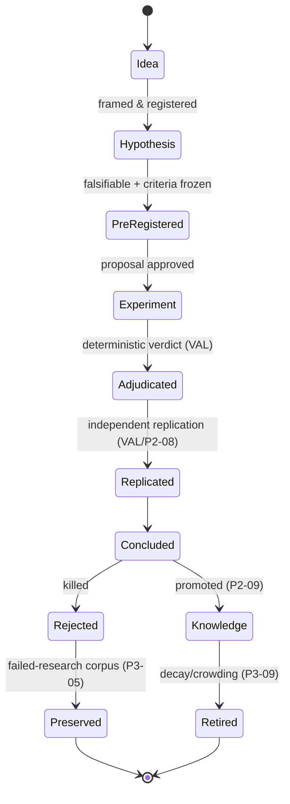
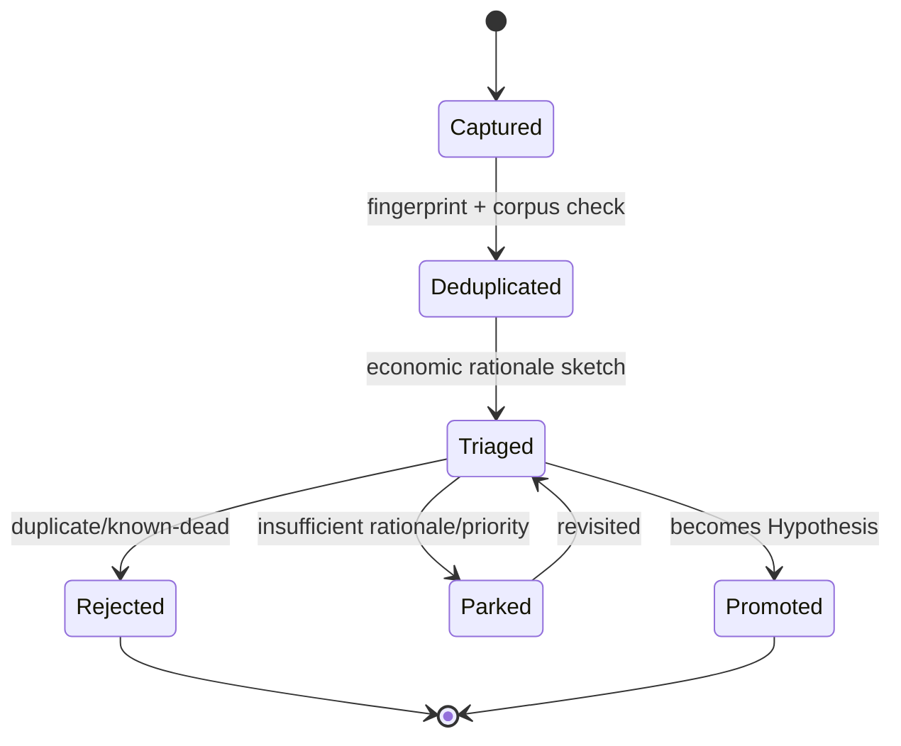
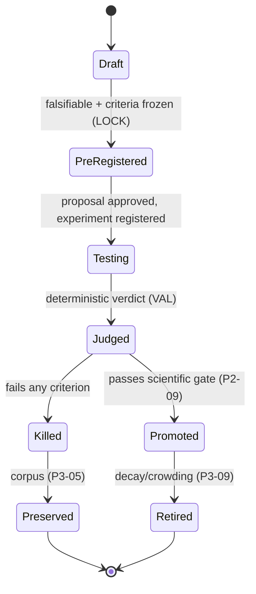
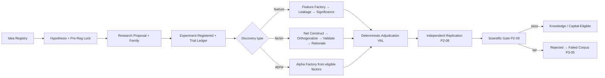
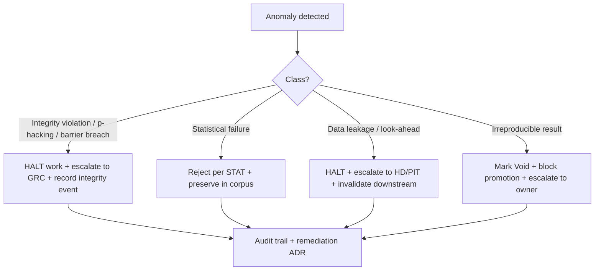

# Research Methodology Rulebook

| Field             | Value                                                                      |
| ----------------- | -------------------------------------------------------------------------- |
| **Rulebook ID**   | RB-02                                                                      |
| **Code**          | `RMET` (rule ID prefix)                                                    |
| **Tier**          | 3 (Rulebook)                                                               |
| **Owner**         | Head of Research / Chief Scientist (**HR**)                                |
| **Co-signers**    | Governance & Risk Committee (**GRC**), Architecture Review Board (**ARB**) |
| **Version**       | 1.0.0                                                                      |
| **Status**        | PROPOSED (binding upon ARB ratification per Framework §10)                 |
| **Last Ratified** | — (pending)                                                                |
| **Supersedes**    | —                                                                          |

> **Reading note.** This rulebook is Tier-3 operational law governing **how research is conducted** — the end-to-end scientific process from idea to retirement. It is subordinate to `CLAUDE.md` and the Architecture Canon, supreme over Agent/Workflow Contracts and Source Code. It defines _process_, not _statistics_ and not _implementation_. Where a topic is statistical, it references **RB-01 · STAT**; where a topic is a storage/registry mechanism, it references its owner. This document binds **every human researcher and every AI research agent equally**.

---

## 2. Purpose

To define the complete, mandatory institutional research lifecycle: the disciplined path every idea must travel to become — or be rejected as — validated knowledge, with an unbroken, auditable evidence trail. This rulebook is the single authority on the **research process, idea and hypothesis lifecycles, pre-registration and falsifiability, research proposals and review, literature/prior-art review, and failed-research preservation** (Framework §5, §8 Single-Source-of-Truth Map). It governs _how_ research is done so that the _what_ (statistical truth, per STAT) is trustworthy.

Its governing intent is `CLAUDE.md` philosophy §1 and §3: the unit of value is the **validated hypothesis with an unbroken evidence trail**, and every process guarantee must be enforced by mechanism, not intention (CP-1).

## 3. Scope & Boundaries

**In scope (this rulebook is the authority):**

- The research lifecycle and its stage gates (idea → hypothesis → proposal → experiment → review → replication → governance → knowledge/retirement).
- Idea intake, framing, and the Idea Registry usage standards.
- Hypothesis formulation, **pre-registration lock, and falsifiability** standards.
- Research proposal, planning, and research/experiment **design methodology**.
- Experiment **ownership and lifecycle process** (records/metadata mechanism → EXP).
- Research Journal & Timeline conduct; literature and prior-art review.
- Feature/factor/alpha **discovery workflows** (process only).
- Research review, peer review, and failed-research/negative-result preservation.
- Research ethics, governance conduct, decision records, escalation, and human↔AI collaboration in research.

**Out of scope (references only — Framework RBK-A2, RBK-DUP-1):**

- **Statistical technique, significance, multiplicity, CV, deflation, bias tests** → **RB-01 · STAT**.
- **Experiment records, immutable metadata schema, manifest linkage, Trial-Ledger storage, versioning mechanics** → **RB-03 · EXP** (`P2-01`, `P3-03`).
- **Reproducibility manifests / determinism capture** → **RB-05 · REPRO** (`P1-02`).
- **As-of/vintage/lineage** → **RB-08 · PIT** (`P1-01`).
- **Validation gauntlet orchestration, one-shot holdout, replication execution, verdicts** → **RB-04 · VAL** (`P2-05..P2-09`).
- **Feature/factor construction mechanics, orthogonalization, capacity, retirement execution** → **RB-09 · FEAT**, **RB-10 · FCTR** (`P3-06`, `P3-09`, `P3-11`).
- **Memory scoping, knowledge-graph mechanics, corpus storage** → **RB-19 · MEM** (`P4-06`, `P3-14`).
- **AI role boundaries; agent SRP/authority/communication** → **RB-15 · AIGOV**, **RB-18 · AGENT** (`P1-03`, `P4-*`, `P2-07`).

RMET states _what the process must guarantee_; the owners above define the _mechanism_. When RMET imposes a requirement over an out-of-scope mechanism, it does so as a **process acceptance condition** and cites the owner.

## 4. Constitutional Basis (`CLAUDE.md`)

Traces to: **SM-1..SM-5** (scientific method), **RL-1..RL-3** (research lifecycle), **AD-2, AD-3** (economic rationale, generator↔validator isolation), **EX-1..EX-4** (experiment discipline), **RG-1..RG-3** (research governance), **DOC-1..DOC-4, ADR-1..ADR-4** (documentation/decisions), **CR-1..CR-4** (review), **AC-1..AC-4, AG-1..AG-4, HO-1..HO-4** (collaboration/override), **CI-1..CI-3** (continuous improvement), and Forbidden Practice **FB-8** (p-hacking, incl. unregistered/altered research). Ethics derive from the auditability and integrity principles CP-1, CP-5, CP-7.

## 5. Architectural Basis (Architecture Canon)

Grounded in ARCH **§3** (Research & Hypothesis Engine) and **§4** (Research Flow); PATCH **P3-01** (Idea Registry), **P3-02** (Hypothesis Registry Hardening), **P3-03** (Experiment Registry), **P3-04** (Research Journal & Timeline), **P3-05** (Rejected/Failed Research DB), **P3-12** (Explainability/Economic-Rationale Lab), **P3-13** (Research Scorecards), **P3-14** (Knowledge Graph), **P2-07** (Isolation Barrier), **P2-08** (Replication), **P2-09** (Scientific Gate), **P4-07** (Prioritization as transparent optimization); REVIEW "generator-defeats-validator" quant risk and Missing #9 (failed-research corpus).

## 6. Definitions

Constitutional terms (`CLAUDE.md` Glossary) and statistical terms (STAT Glossary) are **not** redefined here. Methodology-specific terms are in §Glossary. Where terms collide, the higher tier governs.

---

## Rule Format

Two rule formats are used. **Pivotal rules** carry the full block: _Purpose · Rationale · Acceptance · Failure · Refs_. **Supporting rules** carry RFC 2119 force plus a one-line rationale. Every rule has a stable ID (`RMET-n`, continuous) and traces to a constitutional basis (Framework RBK-S1, RBK-S2).

---

# RULES

## Philosophy

- **RMET-1 (MUST).** Research MUST be conducted as a falsification enterprise: the objective of an experiment is to _try to kill_ a hypothesis, not to confirm it.
  - _Purpose:_ orient all research toward disproof. _Rationale:_ the adversary is self-deception (`CLAUDE.md` §Philosophy; REVIEW). Confirmation-seeking manufactures false discovery. _Acceptance:_ every hypothesis has a pre-registered condition under which it is declared false (RMET-24). _Failure:_ a hypothesis with no falsification condition. _Refs:_ SM-1, RMET-24, STAT-1.
- **RMET-2 (MUST).** The output of research is **knowledge**, not trades; a rejected hypothesis with a clean evidence trail is a successful research outcome. _Rationale:_ `CLAUDE.md` §1; preserving why an idea failed is institutional value (`P3-05`).
- **RMET-3 (MUST).** Every research activity MUST be reproducible and auditable by an independent party without consulting the researcher. _Rationale:_ CP-4, CP-7; unauditable research is void (RMET-110).
- **RMET-4 (SHOULD).** Research effort SHOULD be allocated by expected information gain per unit cost, not by advocacy or seniority. _Rationale:_ `P4-07`; prioritization is a transparent optimization, not a popularity contest.

## Scientific Method

- **RMET-5 (MUST).** All research MUST follow the ordered method: **Observe → Frame Idea → Formulate Falsifiable Hypothesis → Pre-Register → Design Experiment → Execute → Adjudicate (deterministic) → Replicate → Conclude → Preserve**, with no backward edits to frozen artifacts.
  - _Purpose:_ impose a single, non-negotiable scientific pipeline. _Rationale:_ SM-1..SM-5; out-of-order research (e.g., experiment before hypothesis) is the root of p-hacking. _Acceptance:_ each stage transition is a recorded, gated event; frozen artifacts are immutable. _Failure:_ any evaluation preceding a locked pre-registration, or any post-hoc edit presented as original. _Refs:_ SM-2, STAT-5, STAT-11, FB-8.
- **RMET-6 (MUST NOT).** No stage MUST be skipped, reordered, or performed implicitly. _Rationale:_ RL-1; silent stage-skipping breaks the evidence trail.

## Research Principles

- **RMET-7 (MUST).** Every claim MUST rest on evidence positioned in the Evidence Hierarchy (§Evidence Hierarchy); assertion, intuition, or authority is not evidence. _Rationale:_ RMET-3; institutional research is evidence-driven (`CLAUDE.md` SM-3).
- **RMET-8 (MUST).** Every hypothesis MUST carry an **ex-ante economic rationale** constraining the search space before data are examined (evaluation owned by the Explainability process, `P3-12`). _Rationale:_ AD-2; unconstrained search maximizes false discovery (REVIEW quant risks).
- **RMET-9 (MUST).** Research MUST be separable into generation and adjudication; the researcher/agent that generates a hypothesis MUST NOT adjudicate its validity. _Rationale:_ CP-5, AD-3; the builder must not be the judge.
- **RMET-10 (SHOULD).** Research SHOULD prefer disconfirming tests and adversarial review over corroborating evidence. _Rationale:_ RMET-1.

## Research Ethics

- **RMET-11 (MUST).** Researchers and agents MUST report results faithfully, including failures, adverse robustness, and inconvenient effects; selective or flattering reporting is PROHIBITED. _Rationale:_ CP-7, FB-8; integrity of the record is foundational.
- **RMET-12 (MUST NOT).** No researcher or agent MUST manipulate, omit, or reframe evidence to obtain promotion, funding, or recognition. _Rationale:_ `CLAUDE.md` FB-9 (manual manipulation); this is a terminal integrity violation.
- **RMET-13 (MUST).** Conflicts of interest (e.g., an author reviewing or adjudicating their own work) MUST be declared and structurally prevented. _Rationale:_ CP-5; independence is architectural, not aspirational.
- **RMET-14 (MUST).** Attribution MUST be accurate: every artifact records its true originating actor (human or agent) and contributors. _Rationale:_ CP-6 (provenance), CP-7.

## Evidence Hierarchy

- **RMET-15 (MUST).** Evidence MUST be weighted by the following institutional hierarchy (strongest first); a lower tier MUST NOT override a higher tier for the same question.

| Tier | Evidence                                                                                                | Weight                               |
| ---- | ------------------------------------------------------------------------------------------------------- | ------------------------------------ |
| E1   | Independently replicated, deflated, out-of-sample result passing the scientific gate (`P2-08`, `P2-09`) | Strongest                            |
| E2   | Deflated in-sample result surviving purged/embargoed CV and robustness (STAT)                           | Strong                               |
| E3   | Single-split or exploratory quantitative result (registered, counted)                                   | Moderate                             |
| E4   | Economic/theoretical rationale without quantitative confirmation                                        | Weak (necessary, not sufficient)     |
| E5   | Analogy, intuition, prior belief, external assertion                                                    | Not admissible as promotion evidence |

- _Purpose:_ fix a common currency for evidence. _Rationale:_ prevents rhetoric from outranking data. _Acceptance:_ every promotion cites its highest evidence tier and the tier required by the gate. _Failure:_ promoting on E3–E5 where the gate requires E1/E2. _Refs:_ STAT Promotion Gates, RMET-90.

## Idea Lifecycle

- **RMET-16 (MUST).** Every idea MUST be captured in the **Idea Registry** (`P3-01`) at intake, with source (human/agent/literature), a one-line thesis, and a dedup fingerprint, before any work proceeds.
  - _Purpose:_ make the top of the funnel auditable and deduplicated. _Rationale:_ undeduplicated ideas cause redundant trials that corrupt multiplicity accounting (STAT-14; REVIEW C2). _Acceptance:_ no idea advances to a hypothesis without a registry entry. _Failure:_ work performed on an unregistered idea. _Refs:_ SM-1, `P3-01`, RMET-17.
- **RMET-17 (MUST).** Ideas MUST be checked against the Rejected/Failed Research corpus (`P3-05`) and existing ideas before promotion to a hypothesis; a duplicate MUST be linked, not re-created. _Rationale:_ prevents re-testing dead ideas (RMET-2, `P3-05`).

- **RMET-18 (SHOULD).** Idea triage SHOULD score expected information gain vs cost to feed prioritization (`P4-07`). _Rationale:_ RMET-4.

## Idea Registry

- **RMET-19 (MUST).** The Idea Registry is append-only for its immutable core (thesis, source, timestamp, fingerprint); status MAY transition but history MUST NOT be rewritten. _Rationale:_ CP-2, CP-7.
- **RMET-20 (MUST).** Ideas ingested from untrusted external text MUST pass the trust/quarantine boundary before influencing research direction (mechanism owned by RB-18 · AGENT / `P4-03`). _Rationale:_ prevents research being steered by adversarial content (REVIEW C3).

## Hypothesis Lifecycle

- **RMET-21 (MUST).** A hypothesis MUST be a single, falsifiable, testable statement with: the predicted effect and direction, the economic mechanism, the population/universe, the horizon, and the condition under which it is declared false.
  - _Purpose:_ make hypotheses testable and killable. _Rationale:_ SM-2, RMET-1; vague hypotheses cannot be falsified or audited. _Acceptance:_ the hypothesis record contains all six elements. _Failure:_ a non-falsifiable, compound, or vague hypothesis. _Refs:_ `P3-02`, RMET-24.
- **RMET-22 (MUST).** Each hypothesis MUST pass through the state machine below; transitions are recorded, gated, and irreversible except by creating a new versioned hypothesis. _Rationale:_ RL-1; immutable lineage.

- **RMET-23 (MUST NOT).** A `Killed` or `Retired` hypothesis MUST NOT be silently revived; revival MUST create a new hypothesis version citing the prior lineage and rationale for revisiting. _Rationale:_ RL-1; prevents laundering dead ideas into fresh budget.
- **RMET-24 (MUST).** **Pre-registration lock:** before any evaluation, the hypothesis's falsifiable prediction, success/failure criteria, universe, horizon, planned test, CV/embargo scheme, and framework MUST be frozen and made immutable (statistical content per STAT-5).
  - _Purpose:_ eliminate post-hoc criteria drift. _Rationale:_ SM-2, FB-8; the single most important anti-p-hacking control at the process level. _Acceptance:_ the lock timestamp precedes the first trial-ledger evaluation event (STAT-14). _Failure:_ any evaluation before lock, or any post-lock edit to a frozen field. _Refs:_ `P3-02`, STAT-5, STAT-8, STAT-95.

## Hypothesis Registry

- **RMET-25 (MUST).** Every hypothesis MUST reside in the Hypothesis Registry (`P3-02`) with its immutable pre-registration, lineage to its originating idea, and links to its experiments and verdicts. _Rationale:_ CP-6, CP-7; the registry is the backbone of the evidence trail.
- **RMET-26 (MUST).** The registry MUST enforce the lock (RMET-24) technically: evaluation is impossible without a locked pre-registration. _Rationale:_ CP-1; enforcement, not etiquette.

## Research Proposal Standards

- **RMET-27 (MUST).** Before experimentation, a **Research Proposal** MUST exist containing: the hypothesis reference, economic rationale, data requirements (as-of scope), planned experiment design, statistical plan (per STAT), resource/compute budget, success/failure criteria, and the research family it joins (for multiplicity, STAT-20).
  - _Purpose:_ force complete planning before spending trial budget. _Rationale:_ SM-2, STAT-20; unplanned research corrupts multiplicity and wastes compute. _Acceptance:_ proposal is complete and approved before experiment registration. _Failure:_ experimentation without an approved proposal. _Refs:_ RMET-24, STAT-13, `P3-03`.
- **RMET-28 (MUST).** A proposal MUST declare its assignment to a **research family** (STAT-20) so the error budget is allocated before results exist. _Rationale:_ SI-1; family assignment after results is a p-hacking vector.

## Research Planning

- **RMET-29 (MUST).** Planning MUST specify the compute/cost budget and expected timeline; work exceeding budget MUST trigger the budget-governance backpressure, not silent overspend. _Rationale:_ `P5-06`, `P4-07`; unbounded research is both a cost and a statistical-integrity risk.
- **RMET-30 (SHOULD).** Plans SHOULD sequence the cheapest disconfirming tests first (fail fast). _Rationale:_ RMET-1; kill weak ideas before expensive validation.

## Research Design

- **RMET-31 (MUST).** Research design MUST identify, ex ante, every threat to validity relevant to the question (look-ahead, leakage, survivorship, selection, confirmation; controls owned by STAT/PIT) and the control for each. _Rationale:_ STAT-9, STAT-10; unenumerated threats are treated as uncontrolled.
- **RMET-32 (MUST).** Design MUST define the population/universe as-of construction (survivorship-free; owned by PIT/STAT-85) before data access. _Rationale:_ selection/survivorship bias enters at design time.

## Experiment Design

- **RMET-33 (MUST).** An experiment MUST be the concrete, executable instantiation of a pre-registered hypothesis, specifying data as-of references, features, the deterministic decision rule, and the CV/holdout scheme (statistical content per STAT).
  - _Purpose:_ bind abstract hypothesis to a runnable, auditable test. _Rationale:_ EX-1; ambiguous experiments are irreproducible. _Acceptance:_ the design fully determines the run given the manifest (RB-05 · REPRO). _Failure:_ under-specified design requiring discretionary choices at run time. _Refs:_ STAT-16, `P3-03`, `P1-02`.
- **RMET-34 (MUST).** One hypothesis MAY spawn multiple experiments; **each** experiment is a distinct trial and MUST be counted (STAT-14). _Rationale:_ SI-1; experiments are not free re-rolls.

## Experiment Registration

> **Boundary note.** The registry mechanism, immutable metadata schema, manifest linkage, and Trial-Ledger enrollment are owned by **RB-03 · EXP** (`P2-01`, `P3-03`). RMET defines the _process obligation_ to register.

- **RMET-35 (MUST).** No experiment MUST execute without prior registration in the Experiment Registry and enrollment in the Trial Ledger (owned by EXP). _Rationale:_ EX-1, FB-5; registration-before-execution is fail-closed. _Refs:_ STAT-13, STAT-14.

## Experiment Ownership

- **RMET-36 (MUST).** Every experiment MUST have exactly one accountable **owner** (human role or a designated responsible human for an agent-run experiment). Ownership MUST NOT be shared or anonymous.
  - _Purpose:_ single-point accountability for scientific integrity. _Rationale:_ CP-7; diffuse ownership erodes accountability. _Acceptance:_ owner recorded and non-null on every experiment. _Failure:_ ownerless or multi-owner experiment. _Refs:_ AG-1, HO-2.
- **RMET-37 (MUST).** For agent-executed experiments, a human owner remains accountable; the agent is the executor, never the accountable party. _Rationale:_ HO-1, AG-4; AI does not bear institutional accountability.

## Experiment Metadata

- **RMET-38 (MUST).** Experiment metadata MUST be immutable and complete per the schema owned by RB-03 · EXP; RMET requires that metadata include the hypothesis link, owner, research family, as-of data refs, and manifest reference. _Rationale:_ CP-6, EX-3; incomplete metadata breaks the audit trail. _Refs:_ `P3-03`, `P1-02`.

## Experiment Versioning

- **RMET-39 (MUST).** Correcting or changing an experiment MUST produce a new version (mechanism owned by EXP); the original MUST NOT be edited. _Rationale:_ CP-2, EX-3; mutable experiments destroy reproducibility.

## Experiment Lifecycle

- **RMET-40 (MUST).** Experiments MUST traverse: `Registered → Running → Completed → Adjudicated → Archived`, with adjudication performed deterministically by VAL. Backward transitions create new versions. _Rationale:_ RL-1; a clean lifecycle is auditable.
- **RMET-41 (MUST).** A `Completed` experiment that cannot be reproduced from its manifest MUST be marked `Void` and MUST NOT inform any decision. _Rationale:_ EX-2, RMET-3; irreproducible results are not evidence. _Refs:_ STAT-105.

## Research Journal

- **RMET-42 (MUST).** Every consequential research action (idea framed, hypothesis locked, proposal approved, experiment run, verdict issued, decision made) MUST produce an immutable, timestamped **Research Journal** entry linked to the relevant artifacts (`P3-04`).
  - _Purpose:_ a coherent, permanent narrative of the institution's thinking. _Rationale:_ CP-7, DOC-2; scattered logs are not institutional memory. _Acceptance:_ every state transition in RMET-5/22/40 has a journal entry. _Failure:_ a consequential action with no journal record. _Refs:_ `P3-04`, RMET-98.
- **RMET-43 (SHOULD NOT).** The journal SHOULD NOT contain analysis that belongs in registries or evidence packages; it is a narrative index, not a data store. _Rationale:_ avoid duplication (RBK-DUP-1); the journal points to artifacts.

## Research Timeline

- **RMET-44 (MUST).** The Research Timeline MUST be a faithful chronological projection of the journal, enabling reconstruction of _what was known and decided at any past date_. _Rationale:_ CP-7; supports point-in-time governance and audit (`P3-04`).
- **RMET-45 (MUST NOT).** The timeline MUST NOT be editable independently of the journal; it is a derived view. _Rationale:_ single source of truth.

## Literature Review Standards

- **RMET-46 (MUST).** Before committing significant resources to a hypothesis, relevant academic and practitioner literature MUST be reviewed and cited in the proposal. _Rationale:_ prevents rediscovery, informs priors, sharpens falsification (RMET-8).
- **RMET-47 (MUST).** Literature ingested by agents from untrusted sources MUST pass the trust/quarantine boundary (RB-18 · AGENT / `P4-03`) and MUST be provenance-tagged before informing hypotheses or memory. _Rationale:_ REVIEW C3; poisoned literature must not steer research.
- **RMET-48 (MUST).** Claims imported from literature MUST be treated as **hypotheses to be tested on our data**, never as established facts. _Rationale:_ published effects frequently fail to replicate; import ≠ truth (E4 in RMET-15).

## Prior Art Review

- **RMET-49 (MUST).** Every hypothesis MUST be checked against internal prior art: the Idea Registry, Hypothesis Registry, Rejected/Failed corpus, and Factor Ontology (`P3-01/02/05`, `P3-06`). _Rationale:_ avoids redundant trials and factor-zoo bloat (STAT-76). _Refs:_ RMET-17.
- **RMET-50 (MUST).** A hypothesis materially equivalent to existing prior art MUST be linked to it and MUST NOT open a new trial budget unless it presents a genuinely novel, pre-registered distinction. _Rationale:_ SI-1; equivalence-laundering corrupts multiplicity.

## Feature Discovery Workflow

> **Boundary note.** Feature _construction/acceptance mechanics_ are owned by **RB-09 · FEAT**; _statistical significance_ by **RB-01 · STAT**; _as-of/leakage_ by **RB-08 · PIT**. RMET owns the _workflow/process_.

- **RMET-51 (MUST).** Feature discovery MUST follow: register idea → hypothesize predictive relationship with economic rationale → pre-register → compute via as-of Feature Factory (PIT/`P1-06`) → leakage-clear (PIT/`P2-03`) → significance-test (STAT) → register in Feature Marketplace (FEAT). _Rationale:_ SM-_, FA-_; ad-hoc feature hunting is p-hacking. _Refs:_ STAT-69, FA-1..FA-4.

## Factor Discovery Workflow

- **RMET-52 (MUST).** Factor discovery MUST follow: validated features → hypothesize factor with mechanism → pre-register → construct net-of-cost (FCTR/`P2-04`) → orthogonalize & classify in ontology (FCTR/`P3-06`) → validate (STAT+VAL) → economic-rationale evaluation (`P3-12`) → scientific gate (`P2-09`). _Rationale:_ FC-*, AD-1/2; enforces net-alpha and non-redundancy from the start. *Refs:\* STAT-71, STAT-72, STAT-76.
- **RMET-53 (MUST).** Automated factor search (symbolic/learned) MUST register every generated candidate as a counted trial and MUST operate behind the generator↔validator isolation barrier (RB-18 · AGENT / `P2-07`). _Rationale:_ SI-1, AD-3; unbounded search that sees validation feedback overfits the referee (REVIEW; STAT-AP-4).

## Alpha Discovery Workflow

- **RMET-54 (MUST).** Composite alpha MUST be assembled only from validated, capital-eligible factors via the Alpha Factory process (`P3-08`), each bearing a scientific-eligibility token (`P2-09`). _Rationale:_ AD-1, RG-1; alpha is built from proven parts, not ad hoc blends.
- **RMET-55 (MUST).** Alpha claims MUST be net-of-cost and regime-conditioned in their evidence (STAT-72, STAT-83). _Rationale:_ AP-10; gross, unconditional alpha is illusory.

## Research Review Process

- **RMET-56 (MUST).** Every promotion-track research effort MUST undergo independent review before adjudication is accepted; review MUST verify process compliance (pre-registration integrity, threat controls, evidence completeness), not merely results. _Rationale:_ CR-2; process defects invalidate results.
- **RMET-57 (MUST NOT).** A reviewer MUST NOT have authored or have a stake in the work reviewed. _Rationale:_ CP-5, RMET-13; independence is mandatory.

## Peer Review

- **RMET-58 (MUST).** Peer review MUST use a fixed checklist (below) and record a verdict with rationale; approval is required to advance to the scientific gate. _Rationale:_ CR-1; structured review reduces escaped defects.

**Peer-review checklist (all MUST pass):**

- [ ] Idea and hypothesis registered; pre-registration locked before evaluation (RMET-16, RMET-24).
- [ ] Economic rationale present and evaluated (RMET-8, `P3-12`).
- [ ] All validity threats enumerated with controls evidenced (RMET-31, STAT-9).
- [ ] Statistical plan followed exactly; no unregistered trials (STAT).
- [ ] Evidence package complete and references resolve (STAT-122, RMET-99).
- [ ] Reproducible from manifest (RMET-3, STAT-105).
- [ ] No conflict of interest; reviewer independent (RMET-57).

- **RMET-59 (MAY).** AI agents MAY assist review by drafting findings and checking completeness but MUST NOT issue the approval decision. _Rationale:_ AI-3; approval is a human/deterministic act.

## Independent Replication

> **Boundary note.** Replication _execution_ is owned by **RB-04 · VAL** (`P2-08`); the _statistical requirement_ by **STAT-108**. RMET owns the _process obligation_.

- **RMET-60 (MUST).** No hypothesis MAY reach `Promoted`/capital-eligible without independent replication via a separate path; discrepancy beyond tolerance forces `Killed`. _Rationale:_ VS-4; single-implementation results may be implementation artifacts (REVIEW Missing #4). _Refs:_ STAT-108.

## Failed Research Preservation

- **RMET-61 (MUST).** Every `Killed`/`Rejected`/`Void` research effort MUST be preserved in the Rejected/Failed Research corpus (`P3-05`) with a structured reason code, the evidence that killed it, and its lineage.
  - _Purpose:_ make failure a first-class, queryable asset. _Rationale:_ Missing #9; failed research prevents re-testing and powers meta-research (`P6-01`). _Acceptance:_ every terminal-negative artifact has a corpus entry with a reason code. _Failure:_ a killed effort discarded or logged without structure. _Refs:_ SM-4, RMET-2.
- **RMET-62 (MUST).** Failed research MUST remain counted in multiplicity accounting; preservation MUST NOT remove it from the Trial Ledger. _Rationale:_ SI-1; excluding failures inflates apparent success (STAT-F-3).

## Negative Result Policy

- **RMET-63 (MUST).** Negative results MUST be recorded, reviewed, and cited with the same permanence as positive results; suppressing a negative result is PROHIBITED. _Rationale:_ SM-4, RMET-11; publication bias corrupts the institutional prior.
- **RMET-64 (SHOULD).** Recurring negative patterns SHOULD be promoted into semantic knowledge ("X does not predict Y in regime Z") via the graduation process (RMET-66). _Rationale:_ CI-1; failures teach.

## Research Knowledge Base

- **RMET-65 (MUST).** Durable, evidenced conclusions MUST be recorded in the research knowledge corpus (ARCH §2.14) with provenance and confidence (mechanism owned by RB-19 · MEM; `P3-14`). _Rationale:_ KM-1; knowledge must be citable and provenance-bearing.
- **RMET-66 (MUST).** A belief MAY **graduate** from working/semantic memory to the published corpus only after it is durable, evidenced (E1/E2), and reviewed; graduation MUST be recorded. _Rationale:_ KM-2; premature graduation pollutes the corpus.

## Knowledge Graph Integration

- **RMET-67 (MUST).** Research artifacts (ideas, hypotheses, experiments, factors, outcomes) MUST be linked into the Knowledge Graph with provenance and confidence on every edge (mechanism owned by RB-19 · MEM; `P3-14`). _Rationale:_ enables prior-art discovery, meta-research, and crowding analysis. _Refs:_ RMET-49, `P6-01`.
- **RMET-68 (MUST NOT).** Validation/OOS-derived knowledge MUST NOT be linked into contexts readable by generation agents; graph scoping MUST respect the isolation barrier (RB-19 · MEM / `P2-07`, `P4-06`). _Rationale:_ AD-3; otherwise generators learn from validation via the graph.

## Research Scorecards

- **RMET-69 (MUST).** Research productivity MUST be measured via Research Scorecards (`P3-13`) reporting hypothesis hit-rate, realized false-discovery rate (from STAT/Trial Ledger), trial-budget consumption, and time-to-verdict, on a GRC-governed cadence (surfaced by RB-28 · OBS). _Rationale:_ CI-1; the institution must measure whether its research process works.
- **RMET-70 (MUST NOT).** Scorecard metrics MUST NOT be used to incentivize positive results per se (which would encourage p-hacking); they measure _process health_, not researcher "win rate." _Rationale:_ Goodhart risk; metrics must not corrupt the science.

## Promotion Gates

> **Boundary note.** Gate _orchestration_ is owned by **RB-04 · VAL** (`P2-09`) and release by **RB-30 · DEPLOY**; _statistical evidence_ by **STAT Promotion Gates**. RMET defines the _process preconditions_.

- **RMET-71 (MUST).** Advancing any stage gate requires: complete registration and locked pre-registration; independent review approval (RMET-58); the statistical evidence mandated by STAT for that gate; independent replication (for capital-eligibility); and an evaluated economic rationale. Missing any precondition blocks advancement (fail-closed). _Rationale:_ RG-1, RG-3; gates are cumulative and non-negotiable. _Refs:_ STAT Promotion Gates, `P2-09`.
- **RMET-72 (MUST NOT).** A gate MUST NOT be advanced by human or LLM assertion in place of the required evidence and approvals. _Rationale:_ HO-3, AI-3; overrides that bypass evidence are void.

## Retirement Criteria

- **RMET-73 (MUST).** Promoted knowledge/factors MUST be subject to retirement review when decay, crowding, drift, or rationale-invalidation criteria are met (statistical triggers per STAT-81/82; execution owned by RB-10 · FCTR / `P3-09`). _Rationale:_ RL-2; alpha has a death.
- **RMET-74 (MUST).** Retirement MUST be recorded with rationale and lineage, and the retired conclusion MUST be updated in the knowledge corpus (confidence decayed). _Rationale:_ KM, CP-6; stale beliefs must not persist as current.

## Research Governance

- **RMET-75 (MUST).** The research agenda MUST be prioritized by a transparent, auditable optimization (expected information gain vs cost), with AI proposing and the optimization/human deciding (`P4-07`); a single LLM MUST NOT unilaterally set the agenda. _Rationale:_ AD, CP-5; prevents opaque bias amplification (REVIEW AI risks).
- **RMET-76 (MUST).** GRC MUST govern research-integrity parameters (family definitions cadence, review requirements, audit frequency) via the Exceptions process; researchers/agents MUST NOT alter them. _Rationale:_ CP-1; controls belong to governance.
- **RMET-77 (MUST).** Scientific governance for capital eligibility (`P2-09`) is independent of the research function; sign-off MUST be by a party with no stake in the outcome. _Rationale:_ CP-5, RG-2.

## Research Audit

- **RMET-78 (MUST).** Research MUST be periodically audited (cadence GRC-governed): sampling promoted and rejected efforts to confirm the full lifecycle (RMET-5) was followed and the evidence trail is intact. _Rationale:_ CP-7; unaudited process decays.
- **RMET-79 (MUST).** Audit findings MUST be recorded in the tamper-evident audit trail and fed to continuous improvement (`P6-01`, `P6-02`). _Rationale:_ CI-3.

## Decision Records

- **RMET-80 (MUST).** Every consequential research decision (promote, kill, retire, re-open, deviate) MUST be recorded as an immutable Decision Record with who/what/when/why and the evidence relied upon. _Rationale:_ CP-7, ADR-adjacent; institutional memory of _why_.
- **RMET-81 (MUST).** Decisions that change methodology or deviate from this rulebook MUST be recorded as ADRs (RB-25 · ADR) and, if they touch architecture, trace to a PATCH ID. _Rationale:_ ADR-3, DOC-2.

## Documentation Requirements

- **RMET-82 (MUST).** All research documentation MUST cite the Constitution, Architecture, and peer rulebooks rather than restating them (DOC-1). _Rationale:_ single source of truth; prevents drift.
- **RMET-83 (MUST).** Broken cross-references in research documentation MUST block advancement of the affected work. _Rationale:_ DOC-4; unresolved references break auditability.

## Collaboration Rules

- **RMET-84 (MUST).** Humans and AI agents MUST collaborate only through registries, the message bus, and immutable artifacts; direct, unrecorded hand-offs are PROHIBITED. _Rationale:_ AC-1; unrecorded collaboration breaks the trail.
- **RMET-85 (MUST).** Multi-actor research contributions MUST resolve to a single arbitrated, recorded outcome (arbiter owned by RB-18 · AGENT / `P4-05`); implicit consensus is PROHIBITED. _Rationale:_ AC-2.
- **RMET-86 (MUST).** Generation and validation actors MUST NOT communicate across the isolation barrier except via aggregate, delayed, budgeted signals (RB-18 · AGENT / `P2-07`). _Rationale:_ AD-3; the deepest quant risk.

## AI Research Agents

> **Boundary note.** Agent SRP/authority/communication and AI role limits are owned by **RB-18 · AGENT** and **RB-15 · AIGOV**. RMET states research-specific obligations.

- **RMET-87 (MUST).** AI research agents MAY generate ideas, draft hypotheses, review literature, propose designs, and narrate results; they MUST NOT adjudicate validity, assert significance, approve promotions, or set the agenda unilaterally. _Rationale:_ AI-2, AI-3, `P4-07`, DE-1. _Refs:_ LLM-1, LLM-2.
- **RMET-88 (MUST).** Every agent-produced research artifact MUST record the bound model version and prompt/output hashes (RB-16 · MODEL, RB-17 · PROMPT; `P1-02`). _Rationale:_ CP-4, AI-8; agent outputs are stochastic and must be recorded to their exact output.
- **RMET-89 (MUST).** An agent operating in a generation role MUST be technically prevented from reading validation/OOS outcomes (RB-19 · MEM scoping, bus ACLs). _Rationale:_ AD-3, `P2-07`.

## Human Responsibilities

- **RMET-90 (MUST).** A named human MUST be accountable for every promotion-track research effort and for every agent-executed experiment (RMET-36/37). _Rationale:_ HO-1; accountability cannot be delegated to AI.
- **RMET-91 (MUST).** Humans MUST NOT use override authority to bypass registration, pre-registration, evidence, or statistical control; such overrides are void (HO-3). _Rationale:_ the controls exist precisely to bind humans too.
- **RMET-92 (SHOULD).** Humans SHOULD exercise scientific skepticism toward agent-generated conclusions, treating them as proposals requiring evidence. _Rationale:_ RMET-1; automation bias is a real threat.

## Escalation Rules

- **RMET-93 (MUST).** The following MUST be escalated immediately and halt the affected work: detected p-hacking or unregistered trials; suspected data leakage/look-ahead; isolation-barrier breach; irreproducible promoted results; integrity violations (RMET-12). _Rationale:_ these are terminal risks to scientific validity. _Refs:_ HO-4, STAT-F-\*.

- **RMET-94 (MUST).** Escalations MUST be recorded in the audit trail with outcome and remediation. _Rationale:_ CP-7, CI-3.

---

## Enforcement & Verification

| Rule group                                              | Enforcement mechanism                                                                     | Mechanism owner                      |
| ------------------------------------------------------- | ----------------------------------------------------------------------------------------- | ------------------------------------ |
| Registration & pre-registration lock (RMET-16,24,26,35) | CI gate: no evaluation without registered idea/hypothesis + locked pre-reg + ledger entry | RB-03 · EXP, this rulebook           |
| Lifecycle & state transitions (RMET-5,22,40)            | Workflow gate: illegal transitions rejected; journal entry required                       | RB-04 · VAL, orchestration           |
| Ownership & accountability (RMET-36,37,90)              | Gate: non-null human owner required                                                       | this rulebook                        |
| Review & peer review (RMET-56,58)                       | Gate: independent approval required before scientific gate                                | this rulebook, CR                    |
| Failed-research preservation (RMET-61,62,63)            | Gate: terminal-negative artifacts require structured corpus entry                         | RB-05 corpus / `P3-05`               |
| Isolation barrier (RMET-53,68,86,89)                    | Bus ACLs + memory scoping                                                                 | RB-18 · AGENT, RB-19 · MEM (`P2-07`) |
| Documentation & decision records (RMET-80,82,83)        | CI gate: reference resolution; decision records required                                  | RB-23 · DOC, RB-25 · ADR             |
| AI agent limits (RMET-87,88,89)                         | Agent authority flags; model/prompt hashing                                               | RB-15/16/17/18                       |
| Escalation (RMET-93,94)                                 | Fail-closed halt + integrity report                                                       | GRC                                  |

- **RMET-E-1 (MUST).** Every rule enforcing a Forbidden Research Practice (RMET-F-*) MUST be CI-gated and fail-closed where technically possible (Framework RBK-E2). *Rationale:\* CP-1.
- **RMET-E-2 (MUST).** LLM agents MAY draft, propose, and narrate but MUST NOT execute any gate, approval, or adjudication decision (AI-2, AI-3). _Rationale:_ DE-1.

## Exceptions & Waivers

- **RMET-W-1 (MUST).** No exception MAY be granted to any Forbidden Research Practice (RMET-F-\*) or to any rule enforcing a `CLAUDE.md` entrenched clause (AM-2). Non-waivable.
- **RMET-W-2 (MAY).** GRC-governed process parameters (review requirements, audit cadence, family-definition policy, escalation thresholds) MAY be changed only by GRC, recorded as a versioned parameter set with rationale, applied prospectively.
- **RMET-W-3 (MAY).** A time-boxed waiver of a non-entrenched rule MAY be granted only by HR + GRC, recorded in the audit trail with scope, expiry, and rationale, and MUST NOT weaken pre-registration, multiplicity accounting, the isolation barrier, or reproducibility. _Rationale:_ the core controls are the point of the methodology.
- **RMET-W-4 (MUST).** Active waivers MUST be surfaced on the affected artifact's evidence package and journal entry. _Rationale:_ no hidden exceptions.

## Rulebook Acceptance Criteria (ratification)

Ratifiable (Framework §10) only when: every rule has a stable ID, RFC 2119 phrasing, a constitutional basis, and an enforcement mechanism; no rule contradicts `CLAUDE.md`, the Architecture Canon, STAT, or any peer rulebook per the Single-Source-of-Truth Map; all lifecycle diagrams are consistent with ARCH §4; all cross-references resolve; ARB approval with GRC co-sign obtained.

## Success Metrics

- **SM-1.** 100% of research efforts registered and pre-registered before evaluation (RMET-16, RMET-24); 0 unregistered trials.
- **SM-2.** 100% of terminal-negative efforts preserved with reason codes (RMET-61); measurable reuse of the failed corpus in prior-art checks (RMET-49).
- **SM-3.** 0 isolation-barrier breaches (RMET-86); 0 generator reads of validation/OOS (RMET-89).
- **SM-4.** 100% of consequential actions journaled (RMET-42); timeline reconstructs any past date (RMET-44).
- **SM-5.** 0 LLM-made adjudication/approval decisions (RMET-87, RMET-E-2).
- **SM-6.** Every promoted effort independently reviewed and replicated (RMET-58, RMET-60).
- **SM-7.** Research-scorecard cadence met; realized FDR within STAT target (RMET-69).

## Dependencies & Related Rulebooks

- **Depends on:** RB-01 · STAT (statistical standards), RB-03 · EXP (registry/ledger/manifests), RB-05 · REPRO (manifests), RB-08 · PIT (as-of, leakage, survivorship-free data).
- **Coordinates with:** RB-04 · VAL (adjudication, replication, gates), RB-09 · FEAT, RB-10 · FCTR (discovery mechanics, retirement), RB-19 · MEM (knowledge graph/corpus scoping), RB-15 · AIGOV & RB-18 · AGENT (AI limits, isolation), RB-25 · ADR (decision/deviation records), RB-28 · OBS & GRC (scorecards, audit).
- **Architecture references:** ARCH §3, §4; PATCH `P2-07/08/09`, `P3-01/02/03/04/05/06/08/12/13/14`, `P4-07`; REVIEW quant risks & Missing #9.

## Change Log & Version History

| Version | Date    | Author (role) | Change                                 | ADR |
| ------- | ------- | ------------- | -------------------------------------- | --- |
| 1.0.0   | pending | HR            | Initial research methodology rulebook. | —   |

---

## Anti-Patterns

Recognized process failure modes that MUST be actively prevented (mirrors `CLAUDE.md` AP-\*, REVIEW):

- **RMET-AP-1.** HARKing — Hypothesizing After Results are Known; framing a post-hoc finding as a prior hypothesis (violates RMET-24).
- **RMET-AP-2.** Exploring without registering; "we were just looking" trials that never enter the ledger (RMET-16, STAT-14).
- **RMET-AP-3.** Reviving a killed idea without new pre-registered distinction to obtain fresh budget (RMET-23, RMET-50).
- **RMET-AP-4.** The builder adjudicating their own factor (RMET-9, RMET-57).
- **RMET-AP-5.** Generator learning from validation/OOS feedback via bus or knowledge graph (RMET-68, RMET-86).
- **RMET-AP-6.** Treating imported literature effects as established truth rather than hypotheses (RMET-48).
- **RMET-AP-7.** Suppressing or discarding negative results (RMET-63).
- **RMET-AP-8.** Journaling analysis instead of pointing to artifacts (RMET-43) — duplication and drift.
- **RMET-AP-9.** LLM setting the research agenda or issuing approvals (RMET-75, RMET-87).
- **RMET-AP-10.** Optimizing scorecard "win rate," incentivizing positive results (RMET-70).

## Forbidden Research Practices

Absolute prohibitions. Violation voids the affected work, halts it, and is a reportable integrity event (`CLAUDE.md` FB-\*, HO-3):

- **RMET-F-1.** Performing any evaluation before a locked pre-registration (RMET-24).
- **RMET-F-2.** Running or citing an unregistered idea, hypothesis, or experiment (RMET-16, RMET-35).
- **RMET-F-3.** Altering a frozen pre-registration and presenting it as original (RMET-24; FB-8).
- **RMET-F-4.** Excluding failed/discarded research from the record or the multiplicity budget (RMET-62; FB-8).
- **RMET-F-5.** Adjudicating, approving, or reviewing one's own research (RMET-57).
- **RMET-F-6.** Breaching the generator↔validator isolation barrier (RMET-86; AD-3).
- **RMET-F-7.** Suppressing a negative or inconvenient result (RMET-63; RMET-11).
- **RMET-F-8.** Any LLM adjudicating validity, asserting significance, or approving a promotion (RMET-87; AI-2, AI-3).
- **RMET-F-9.** Human override that bypasses registration, pre-registration, evidence, or statistical control (RMET-91; HO-3).
- **RMET-F-10.** Manipulating, omitting, or reframing evidence for advantage (RMET-12; FB-9).

---

## Glossary (methodology-specific)

Terms in `CLAUDE.md` Glossary and STAT Glossary are not redefined here.

- **Idea** — A raw, pre-hypothesis thesis captured at intake; not yet falsifiable or testable (RMET-16).
- **Hypothesis** — A single, falsifiable, testable statement with predicted effect, mechanism, population, horizon, and falsification condition (RMET-21).
- **Pre-Registration Lock** — The immutable freezing of a hypothesis's testing plan and success/failure criteria before any evaluation (RMET-24).
- **Research Proposal** — The complete pre-experiment plan binding a hypothesis to design, data, statistical plan, budget, and research family (RMET-27).
- **Research Family** — See STAT Glossary; declared at proposal time for multiplicity control (RMET-28).
- **Experiment** — The concrete, runnable instantiation of a pre-registered hypothesis; each is a counted trial (RMET-33/34).
- **Research Journal** — The immutable, narrative index of consequential research actions (RMET-42).
- **Research Timeline** — The chronological projection of the journal enabling point-in-time reconstruction (RMET-44).
- **Prior Art** — Existing internal ideas, hypotheses, rejected research, and factors checked before opening a new effort (RMET-49).
- **Failed/Rejected Research Corpus** — The structured, queryable record of killed research and its reasons (RMET-61).
- **Graduation** — The reviewed promotion of a durable, evidenced belief into the published knowledge corpus (RMET-66).
- **HARKing** — Hypothesizing After Results are Known; a forbidden anti-pattern (RMET-AP-1).
- **Evidence Tier (E1–E5)** — The institutional ranking of evidence strength (RMET-15).

---

_End of Research Methodology Rulebook (RB-02 · RMET). This document is Tier-3 operational law governing how research is conducted. It defines process and references — never restates — statistical technique (STAT), registry/experiment mechanics (EXP), validation (VAL), data/PIT, reproducibility (REPRO), and AI/agent limits (AIGOV/AGENT). Binding upon ARB ratification._
