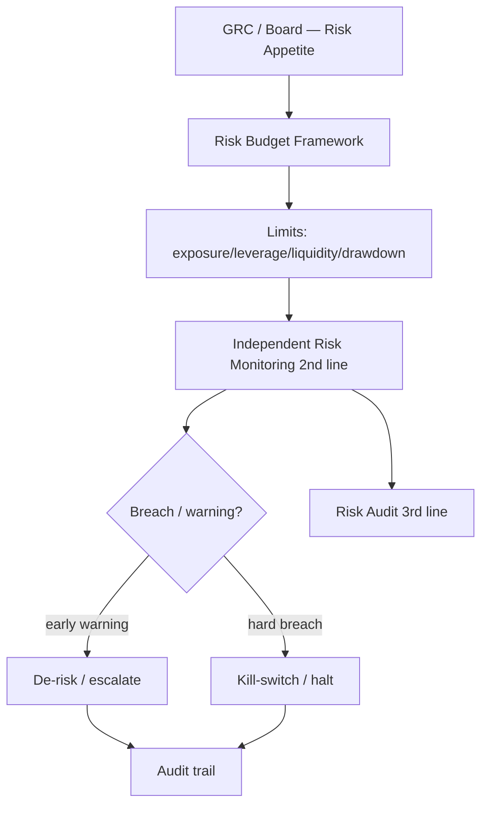
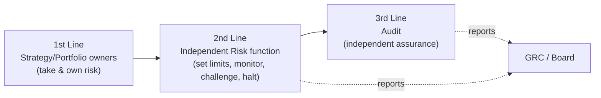
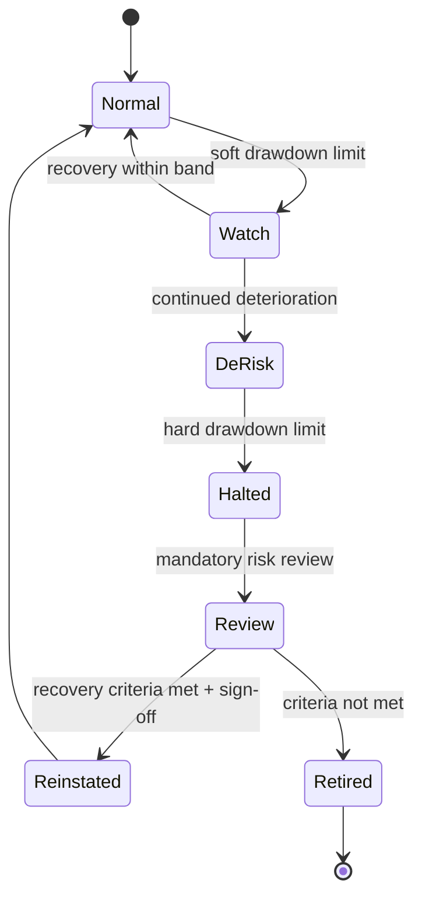
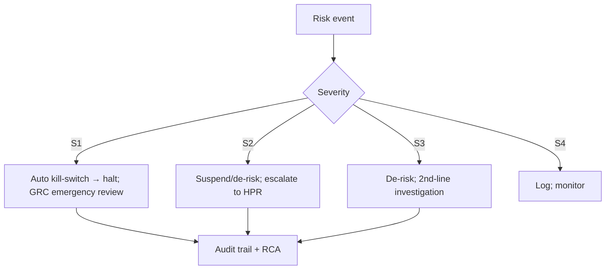

# Risk Management Rulebook

| Field                            | Value                                                                                                                                                                                |
| -------------------------------- | ------------------------------------------------------------------------------------------------------------------------------------------------------------------------------------ |
| **Rulebook ID**                  | RB-13                                                                                                                                                                                |
| **Framework code / rule prefix** | `RISK`                                                                                                                                                                               |
| **Tier**                         | 3 (Rulebook)                                                                                                                                                                         |
| **Owner**                        | Head of Portfolio & Risk (**HPR**)                                                                                                                                                   |
| **Co-signers**                   | Governance & Risk Committee (**GRC**), Model Risk Committee (**MRC**, for model-risk sections), Architecture Review Board (**ARB**), Head of Security (**CISO**, for cyber sections) |
| **Version**                      | 1.0.0                                                                                                                                                                                |
| **Status**                       | PROPOSED (binding upon ARB ratification per Framework §10)                                                                                                                           |
| **Last Ratified**                | — (pending)                                                                                                                                                                          |
| **Supersedes**                   | —                                                                                                                                                                                    |

> **Naming note.** `CLAUDE.md` defines constitutional Risk Standards `RS-1..RS-4`. This rulebook's own rule IDs use the prefix `RISK-`; references to `RS-*` always mean the constitutional rules.

> **Reading note.** Tier-3 operational law. Subordinate to `CLAUDE.md` and the Architecture Canon; supreme over Agent/Workflow Contracts and Source Code. Defines _risk standards and controls_, not finance theory or implementation. **This function is independent of research and portfolio management by constitutional mandate (CP-5); it has authority to halt any part of the platform.**

---

## 2. Purpose

To define the immutable standards that preserve capital and bound loss across every layer of the platform: portfolio, strategy, model, market, liquidity, execution, and operational risk. This rulebook is the single authority on **risk appetite, risk budgets, exposure/leverage/liquidity/drawdown limits, kill-switches and circuit breakers, the model-risk and operational-risk frameworks, escalation, and independent risk oversight** (Framework §5, §8 SSOT map, RISK row).

Its governing intent is `CLAUDE.md` RS-1..RS-4, HO-4, and the audit's structural finding: in a _research_ institution the dangerous failure is a corrupt discovery reaching capital, and oversight must be **independent, deterministic, and able to halt** (REVIEW; ARCH §2.10). Capital preservation outranks return.

## 3. Scope & Boundaries

**In scope (this rulebook is the authority):**

- Risk governance, appetite framework, taxonomy, ownership, three lines of defense.
- Risk-budget framework; portfolio and strategy risk budgets.
- All risk **limits**: exposure, position, sector/industry/country, currency, leverage, margin, concentration, correlation, liquidity, market/volatility, tail, gap.
- Drawdown governance; kill-switches, circuit breakers, emergency shutdown, strategy suspension.
- Model-risk management framework; operational, vendor, counterparty risk frameworks.
- Stress/scenario/reverse-stress/sensitivity at portfolio/live level; risk monitoring, reporting, early-warning, escalation, exception management.
- Independent risk review; risk audit; the **risk sign-off** at production promotion; rollback criteria (risk side); capital-allocation risk constraints.

**Out of scope (references only — Framework RBK-A2, RBK-DUP-1):**

- **Portfolio construction, optimization, sizing mechanics, exposure/concentration _construction_** → **RB-12 · PORT** (RISK sets the limits; PORT constructs within them).
- **Backtest risk _evidence_ (in-sim drawdown/tail/stress/capacity)** → **RB-11 · BT**.
- **Statistical estimation methods (VaR/ES/tail/stress statistics, dependence-aware intervals)** → **RB-01 · STAT**.
- **Execution mechanics, realized TCA, order handling, paper engine** → **RB-14 · EXEC**.
- **Model registry, eval gates, drift monitoring** → **RB-16 · MODEL**; **AI role limits** → **RB-15 · AIGOV**, **RB-18 · AGENT**.
- **Data quality/certification/vendor-data handling** → **RB-06/07 · DATA**; **as-of/leakage** → **RB-08 · PIT**.
- **Security/cyber controls, secrets, exfiltration, audit-trail integrity mechanism** → **RB-27 · SEC** (`P1-09`).
- **Incident-response mechanism** → **RB-31 · INC**; **DR/BCP mechanism** → **RB-32 · CONT** (`P6-03`).
- **Release/rollback orchestration** → **RB-30 · DEPLOY**; **factor/strategy retirement execution** → **RB-10 · FCTR** (`P3-09`).
- **Market-specific regulatory compliance mechanism** → **RB-13-adjacent compliance in DATA/governance** (this rulebook states the risk requirement; ARCH §2.10 compliance owns the mechanism).

RISK states _what risk must be bounded and who may halt_; the owners define construction/estimation/execution _mechanism_. Requirements over out-of-scope mechanisms are **acceptance conditions** citing the owner.

## 4. Constitutional Basis (`CLAUDE.md`)

Traces to: **RS-1..RS-4** (risk standards, deterministic limits, independence, kill-switches, authorization token), **HO-1..HO-4** (human override, non-delegable kill-switch), **DEP-1..DEP-4** (paper-first, reversible, gates), **RG-3** (release gates), **RE-1..RE-3** (reliability, feedback governance, DR/BCP), **CP-5** (separation of powers), **CP-7** (audit), **AI-1, AI-4, DE-1** (LLMs never decide risk), **SEC-1..SEC-5** (cyber, referenced), and the entrenched Forbidden Practices where risk-relevant.

## 5. Architectural Basis (Architecture Canon)

Grounded in ARCH **§2.10** (Governance/Risk: risk_limits, risk_monitors, kill_switches, compliance, approvals, audit_trail, circuit_breakers, policy_engine), **§2.7** (capacity), **§2.8** (portfolio risk models), **§2.9** (execution authorization token, paper-first), **§8** (invariants); PATCH **P1-03** (deterministic risk engines — no LLM), **P5-05** (tiered-autonomy human gates), **P6-03** (DR/BCP), **P1-10** (feedback-loop governance), **P3-09** (retirement), **P3-11** (capacity/crowding), **P2-09** (pre-capital scientific gate); REVIEW **C5** (governance independence; risk-downstream-of-research is backwards), **M7** (human gates must scale), **M6** (security/cyber), and the kill-switch/independence findings.

## 6. Definitions

Constitutional, STAT, RMET, DATA, and BT glossary terms are **not** redefined. Risk-specific terms are in §Glossary. Higher tiers govern collisions.

---

## Rule Format

**Pivotal rules** carry the full block: _Purpose · Rationale · Acceptance · Failure · Refs_. **Supporting rules** carry RFC 2119 force plus a one-line rationale. Every rule has a stable ID (`RISK-n`, continuous) and traces to a constitutional basis.

---

# RULES

## Philosophy

- **RISK-1 (MUST).** Capital preservation MUST take precedence over expected return in every decision; no return objective justifies breaching a risk control. _Rationale:_ RS; ruin is irreversible, returns are not. _Refs:_ RISK-15, PR-CONF-2.
- **RISK-2 (MUST).** Risk oversight MUST be independent of research and portfolio management, with the authority to halt any strategy, sleeve, or the whole platform. _Rationale:_ CP-5, RS-2; oversight that reports to those it constrains is not oversight (REVIEW C5). _Refs:_ RISK-8, RISK-45.
- **RISK-3 (MUST).** Risk decisions — limits, halts, sign-offs — MUST be deterministic, versioned, and auditable; discretion is bounded by pre-defined policy. _Rationale:_ RS-1, DE-1, CP-7. _Refs:_ RISK-88.
- **RISK-4 (MUST NOT).** No LLM or automated reasoner MUST make, approve, or veto a risk decision (limit setting, halt, sign-off); AI MAY monitor and narrate only. _Rationale:_ AI-1, AI-4, DE-1; an LLM in the risk-halt path is a control failure (REVIEW C3). _Refs:_ RISK-90.

## Risk Governance

- **RISK-5 (MUST).** All risk policy, limits, and parameters MUST be set and changed only through governed decision records approved by GRC; ad-hoc or verbal limit changes are PROHIBITED. _Rationale:_ CP-1, CP-7; ungoverned limits are not limits.
- **RISK-6 (MUST).** Every risk decision (limit set/breach, exception, halt, sign-off, override) MUST be recorded in the tamper-evident audit trail with who/what/when/why (mechanism owned by RB-27 · SEC / `P1-09`). _Rationale:_ CP-7. _Refs:_ RISK-84.

## Risk Appetite Framework

- **RISK-7 (MUST).** GRC MUST define a written risk appetite (maximum tolerable loss, drawdown, leverage, concentration, and volatility at portfolio and fund level); all limits MUST cascade from it. _Rationale:_ RS; limits without an appetite anchor are arbitrary. _Acceptance:_ a versioned appetite statement exists; every limit traces to it. _Failure:_ limits set with no appetite basis. _Refs:_ RISK-15.

## Risk Taxonomy

- **RISK-8 (MUST).** All risk MUST be classified within the institutional taxonomy below; every strategy and portfolio MUST enumerate its material risks by type with an owner. _Rationale:_ unnamed risk is unmanaged risk. _Refs:_ RISK-10.

**Risk taxonomy (each MUST have limits, monitoring, and an owner):**

| Class                   | Types                                     | Primary limits                    |
| ----------------------- | ----------------------------------------- | --------------------------------- |
| **Market**              | directional, volatility, tail, gap, basis | VaR/ES, exposure, vol targets     |
| **Liquidity**           | market liquidity, funding liquidity       | ADV%, capacity, unwind horizon    |
| **Concentration**       | position, sector, country, factor         | concentration limits              |
| **Leverage/Margin**     | gross/net leverage, margin                | leverage caps, margin buffers     |
| **Model**               | mis-specification, overfitting, decay     | model-risk tiering, exposure caps |
| **Execution**           | slippage, impact, fill, latency           | TCA thresholds (EXEC)             |
| **Operational**         | process, data, cyber, key-person          | controls, BCP/DR                  |
| **Counterparty/Vendor** | broker, exchange, data vendor             | exposure caps, redundancy         |

## Risk Ownership

- **RISK-9 (MUST).** Every risk MUST have a single accountable owner; every production strategy MUST have a named risk owner in the first line and be covered by second-line oversight. _Rationale:_ CP-7; ownerless risk is unmanaged. _Refs:_ RISK-10.

## Risk Committee

- **RISK-10 (MUST).** GRC MUST convene on a governed cadence to review the risk profile, breaches, exceptions, and model-risk status, and MUST record its decisions. GRC holds final authority over risk appetite and non-waivable-control exceptions. _Rationale:_ institutional risk governance requires a standing, accountable body. _Refs:_ RISK-5.

## Three Lines of Defense

- **RISK-11 (MUST).** The platform MUST operate three independent lines of defense; a single actor MUST NOT occupy two lines for the same risk. _Rationale:_ CP-5; independence is the structural defense against blind spots and conflicts.

- **RISK-12 (MUST).** The 2nd-line risk function MUST be able to set limits, monitor, challenge, and halt independently of the 1st line; the 1st line MUST NOT override 2nd-line halts. _Rationale:_ RS-2, HO; oversight must not be overridable by the overseen. _Refs:_ RISK-2, RISK-45.

## Capital Preservation Principles

- **RISK-13 (MUST).** The platform MUST bound worst-case loss such that no single strategy, model, data, or operational failure can breach the fund-level maximum-loss appetite. _Rationale:_ RISK-1; survival is the first objective. _Refs:_ RISK-33.
- **RISK-14 (MUST).** New or increased capital exposure MUST be introduced incrementally with monitoring, never in a single unbounded step. _Rationale:_ DEP-3; graduated exposure limits blast radius (REVIEW). _Refs:_ RISK-58, RISK-83.

## Risk Budget Framework

- **RISK-15 (MUST).** A total risk budget (e.g., volatility/loss/drawdown allowance) MUST be defined at fund level and allocated across strategies/sleeves; the sum of allocated risk MUST NOT exceed the budget after accounting for correlation.
  - _Purpose:_ make risk a scarce, allocated resource. _Rationale:_ RS; unbudgeted risk aggregates into fund-level surprises. _Acceptance:_ allocated risk (correlation-adjusted) ≤ budget at all times. _Failure:_ aggregate risk exceeds budget, or budgets ignore correlation. _Refs:_ RISK-24, RISK-83, RB-12 · PORT.

## Portfolio Risk Budget

- **RISK-16 (MUST).** The portfolio risk budget MUST account for cross-strategy correlation and tail dependence (statistical estimation owned by RB-01 · STAT); assuming independence across strategies is PROHIBITED. _Rationale:_ correlations converge to 1 in crises; naive aggregation understates risk. _Refs:_ RISK-24, STAT-34.

## Strategy Risk Budget

- **RISK-17 (MUST).** Each strategy MUST have an allocated risk budget and MUST operate within it; breaching a strategy budget MUST trigger de-risking or suspension. _Rationale:_ strategy-level budgets contain contagion. _Refs:_ RISK-40.

## Exposure Limits

- **RISK-18 (MUST).** Gross and net exposure limits MUST be defined per strategy and portfolio and enforced pre-trade and continuously; PORT MUST construct within them (RB-12 · PORT). _Rationale:_ RS-1; exposure is the first-order risk lever. _Acceptance:_ pre-trade checks reject exposure-breaching orders. _Failure:_ live exposure exceeds limit undetected. _Refs:_ RB-12 · PORT, RISK-19.

## Position Limits

- **RISK-19 (MUST).** Per-instrument position limits (absolute and as % of ADV/float) MUST be enforced; positions that cannot be unwound within the pre-registered horizon are PROHIBITED. _Rationale:_ liquidity-aware position limits prevent untradeable books. _Refs:_ RISK-27.

## Sector / Industry Limits

- **RISK-20 (MUST).** Sector and industry exposure limits MUST be defined and enforced as-of correct classifications (reference data owned by DATA/PIT); stale-classification enforcement is PROHIBITED. _Rationale:_ concentration by sector is a common hidden risk; classifications drift (DATA-35). _Refs:_ RISK-25.

## Country Limits

- **RISK-21 (MUST).** Country/jurisdiction exposure limits MUST be defined, including for market-specific constraints (e.g., Turkish equities, crypto jurisdictions) per capability handling. _Rationale:_ CP-8; jurisdictional risk and regulation differ materially by market.

## Currency Risk

- **RISK-22 (MUST).** Currency exposure MUST be measured and limited; unintended currency risk in cross-market strategies MUST be surfaced and hedged or explicitly accepted within limit. _Rationale:_ cross-market books carry FX risk that masquerades as alpha. _Refs:_ RISK-25.

## Leverage Policy

- **RISK-23 (MUST).** Maximum gross and net leverage MUST be defined at strategy and fund level and enforced continuously; leverage MUST NOT be increased to compensate for decaying alpha. _Rationale:_ RS; leverage amplifies both edge and ruin. _Acceptance:_ leverage ≤ cap at all times. _Failure:_ leverage exceeds cap, or is raised to mask decay. _Refs:_ RISK-24.

## Margin Policy

- **RISK-24 (MUST).** Margin buffers MUST be maintained above exchange/broker minimums; strategies MUST survive a pre-registered adverse move without forced liquidation. _Rationale:_ forced liquidation at the worst time is a primary ruin mechanism. _Refs:_ RISK-33.

## Concentration Risk

- **RISK-25 (MUST).** Concentration limits (position, sector, country, factor, counterparty) MUST be enforced; performance concentrated in few names/periods MUST be flagged (backtest evidence owned by RB-11 · BT). _Rationale:_ concentrated luck masquerades as skill and creates tail exposure. _Refs:_ BKT-57.

## Correlation Risk

- **RISK-26 (MUST).** Cross-strategy and cross-position correlation MUST be monitored with dependence-aware methods (STAT); rising correlation toward crisis-convergence MUST be an early-warning trigger. _Rationale:_ diversification fails when correlations spike; monitoring gives warning. _Refs:_ RISK-16, RISK-49.

## Liquidity Risk

- **RISK-27 (MUST).** Both market liquidity (can we exit at acceptable cost?) and funding liquidity (can we meet margin/redemptions?) MUST be measured and limited; every book MUST have a pre-registered unwind horizon within appetite. _Rationale:_ RS; illiquidity turns paper losses into realized ruin. _Acceptance:_ unwind horizon ≤ appetite under stressed liquidity. _Failure:_ a book that cannot be unwound within horizon under stress. _Refs:_ RISK-19, RISK-52.

## Market Risk

- **RISK-28 (MUST).** Market risk MUST be quantified with dependence- and tail-aware measures (e.g., VaR and Expected Shortfall estimated per STAT); Gaussian-only VaR MUST NOT be the sole measure. _Rationale:_ STAT-64; normal-assumption VaR understates tail loss. _Refs:_ RISK-30, STAT-61.

## Volatility Risk

- **RISK-29 (MUST).** Volatility targeting/limits MUST be defined where used; realized-vs-target volatility MUST be monitored and breaches acted upon. _Rationale:_ uncontrolled volatility breaches drawdown appetite.

## Tail Risk

- **RISK-30 (MUST).** Tail risk (extreme loss, fat tails, tail dependence across positions) MUST be quantified via Expected Shortfall and stress scenarios (methods per STAT; scenarios per RISK-46/BT); tail limits MUST be set. _Rationale:_ STAT-64; tails, not averages, cause ruin. _Refs:_ RISK-46.

## Gap Risk

- **RISK-31 (MUST).** Gap/overnight/weekend and event-driven jump risk MUST be assessed for every strategy; strategies exposed to un-hedgeable gaps MUST carry explicit limits. _Rationale:_ gaps bypass intraday stops and impact models. _Refs:_ RISK-46.

## Drawdown Governance

- **RISK-32 (MUST).** Every strategy and the portfolio MUST have pre-registered **soft** and **hard** drawdown limits with defined actions; drawdown MUST be monitored continuously. _Rationale:_ RS; drawdown governance is the primary capital-preservation control. _Acceptance:_ soft breach de-risks, hard breach halts, automatically. _Failure:_ drawdown beyond hard limit with no automatic action. _Refs:_ RISK-33, RISK-40.

## Maximum Drawdown Standards

- **RISK-33 (MUST).** Hard drawdown limits at strategy, sleeve, and fund level MUST NOT be exceeded; a hard breach MUST force the affected scope to halt (kill-switch, RISK-40). _Rationale:_ RS-3; the hard limit is the line before ruin. _Refs:_ RISK-40.

## Recovery Requirements

- **RISK-34 (MUST).** A halted strategy MUST NOT be reinstated until pre-registered recovery criteria are met (root cause understood, remediation applied, re-validation passed) and independent risk sign-off is obtained. _Rationale:_ reinstating without understanding the cause repeats the loss. _Refs:_ RISK-45, RISK-83.

## Kill Switch Policy

- **RISK-35 (MUST).** Graduated kill-switches (strategy → sleeve → fund-wide) MUST exist, be deterministic, and be invocable at all times by authorized humans; kill-switch authority MUST NOT be gated by or delegated to AI.
  - _Purpose:_ guarantee the ability to stop losses instantly. _Rationale:_ RS-3, HO-4; the kill-switch is the last line of capital preservation (ARCH §2.10). _Acceptance:_ kill-switch forces execution to paper/halt within SLA; drills pass. _Failure:_ a kill-switch that is slow, AI-gated, or non-functional. _Refs:_ RISK-36, RB-30 · DEPLOY.
- **RISK-36 (MUST).** Pre-registered automatic kill-switch triggers (hard drawdown, limit breach, anomalous behavior, data-incident impact, parity/reality-gap breach) MUST fire without human latency; humans MAY also invoke manually. _Rationale:_ some losses move faster than humans. _Refs:_ BKT-85, RISK-32.

## Circuit Breakers

- **RISK-37 (MUST).** Automated circuit breakers MUST throttle or pause activity on anomalous conditions (excessive turnover, error rates, order rejects, price dislocations) before escalating to a full kill-switch. _Rationale:_ graduated response contains faults without unnecessary full halts. _Refs:_ RISK-40.

## Emergency Shutdown

- **RISK-38 (MUST).** A fund-wide emergency shutdown procedure MUST exist, be tested, and force all execution to halt and all books to a defined safe state; it MUST be invocable by authorized humans and integrated with DR/BCP (RB-32 · CONT). _Rationale:_ RE-3; catastrophic events require a rehearsed full-stop. _Refs:_ RISK-70.

## Strategy Suspension

- **RISK-39 (MUST).** A strategy MAY be suspended (paused, capital frozen) by the 2nd line pending investigation without full retirement; suspension MUST be recorded and MUST NOT be reversed by the 1st line. _Rationale:_ enables containment without premature termination. _Refs:_ RISK-12.

## Strategy Retirement

- **RISK-40 (MUST).** Strategies meeting retirement criteria (sustained decay, crowding, drift, regime-invalidation, capacity erosion, repeated limit breaches) MUST be retired via the governed retirement process (execution owned by RB-10 · FCTR / `P3-09`); retirement MUST be recorded with rationale. _Rationale:_ RL-2; dead strategies bleed capital. _Refs:_ BKT-86, STAT-82.

## Model Risk Management

> **Boundary note.** Model _registry, eval gates, drift monitoring_ are owned by **RB-16 · MODEL**; _AI role limits_ by **RB-15 · AIGOV**. This rulebook owns the **model-risk framework** (identification, tiering, exposure limits, validation requirements) — co-signed by MRC.

- **RISK-41 (MUST).** Every model driving capital MUST be risk-tiered by materiality and complexity; higher tiers MUST carry stricter validation, independent review, and exposure limits.
  - _Purpose:_ proportion controls to model risk. _Rationale:_ RS; a wrong model is a loss engine. _Acceptance:_ every production model has a tier, validation record, and exposure cap. _Failure:_ an untiered or unvalidated model driving capital. _Refs:_ RISK-42, RB-16 · MODEL.

**Model risk tiering (illustrative; thresholds GRC/MRC-governed):**

| Tier | Materiality          | Requirements                                                                         |
| ---- | -------------------- | ------------------------------------------------------------------------------------ |
| T1   | High capital/complex | Independent validation, replication, exposure cap, enhanced monitoring, MRC sign-off |
| T2   | Moderate             | Independent validation, exposure cap, monitoring                                     |
| T3   | Low/experimental     | Standard validation, tight exposure cap, paper-preferred                             |

- **RISK-42 (MUST).** Model risk MUST be bounded by exposure limits sized to the model's validation strength and decay risk; over-reliance on a single model is PROHIBITED (concentration of model risk). _Rationale:_ diversification applies to models, not just positions. _Refs:_ RISK-25.
- **RISK-43 (MUST).** Model decay/drift breaching thresholds (statistical detection owned by STAT-81; monitoring by RB-28 · OBS) MUST trigger de-risking and retirement review. _Rationale:_ RL-2. _Refs:_ RISK-40.

## AI Model Risk

- **RISK-44 (MUST).** AI/LLM components MUST NOT drive capital, risk, or allocation decisions (AI-1..AI-4); their risk is bounded to advisory/narration roles. LLM non-determinism and prompt-injection MUST be treated as operational risks (mechanism owned by RB-15/17/27). _Rationale:_ DE-1, REVIEW C3; an LLM in a decision path is unbounded model risk. _Refs:_ RISK-4, RISK-64.

## Independent Risk Review

- **RISK-45 (MUST).** Every production promotion and every reinstatement MUST receive independent 2nd-line risk sign-off by a party with no stake in the strategy (CP-5); sign-off MUST be deterministic against pre-defined criteria, recorded, and non-waivable by the 1st line. _Rationale:_ RG-3, CP-5; the promoter must not be the risk approver. _Refs:_ RISK-83, BKT-82.

## Data Risk

- **RISK-46 (MUST).** Data incidents materially affecting live strategies MUST trigger risk assessment and, if warranted, halt (data-incident mechanism owned by RB-06/07 · DATA / DATA-96). _Rationale:_ corrupt data propagates to capital. _Refs:_ DATA-96.

## Vendor Risk

- **RISK-47 (MUST).** Critical data/execution vendor dependencies MUST be assessed for concentration and failure risk, with redundancy or contingency where a single vendor failure is material. _Rationale:_ single-vendor dependence is an operational tail risk (REVIEW). _Refs:_ RISK-70.

## Counterparty Risk

- **RISK-48 (MUST).** Broker/exchange/clearing counterparty exposure MUST be limited and monitored; concentration in a single counterparty beyond limit is PROHIBITED. _Rationale:_ counterparty default is a realized-loss channel. _Refs:_ RISK-25.

## Operational Risk

- **RISK-49 (MUST).** Operational risks (process failure, data errors, key-person, cyber, deployment faults) MUST be identified, owned, and controlled; material operational risks MUST have monitoring and contingency. _Rationale:_ RE; operational failures cause real losses independent of market moves. _Refs:_ RISK-70.

## Cyber Risk Principles

> **Boundary note.** Cyber _controls/mechanism_ are owned by **RB-27 · SEC** (`P1-09`). This rulebook states the risk _requirement_.

- **RISK-50 (MUST).** Cyber risk (including alpha exfiltration, data poisoning, and prompt injection) MUST be treated as a first-order institutional risk with monitoring and incident linkage; controls are owned by RB-27 · SEC. _Rationale:_ SEC-1/2/5; stolen alpha or a poisoned model is an existential loss (REVIEW M6). _Refs:_ RB-27 · SEC, RISK-64.

## Business Continuity

- **RISK-51 (MUST).** A tested business-continuity capability MUST exist for critical functions; the risk _requirement_ is owned here, the _mechanism_ by RB-32 · CONT (`P6-03`). _Rationale:_ RE-3. _Refs:_ RISK-70.

## Disaster Recovery Principles

- **RISK-52 (MUST).** Before any live capital, disaster-recovery with tested RPO/RTO and outage/halt/feed-loss playbooks MUST exist (mechanism owned by RB-32 · CONT / `P6-03`); the risk sign-off for go-live MUST verify it. _Rationale:_ RE-3, DEP; a live system without DR is uninsurable. _Refs:_ RISK-83, RB-32 · CONT.

## Stress Testing

- **RISK-53 (MUST).** The live portfolio MUST be stress-tested regularly against pre-registered historical crises and adverse synthetic scenarios covering price, liquidity, cost, borrow, correlation, and regime shocks (methods per STAT; scenario reuse from RB-11 · BT). _Rationale:_ STAT-102/103; average risk hides scenario ruin. _Acceptance:_ stress results within appetite; breaches escalate. _Failure:_ portfolio stressed only on price, or not at all. _Refs:_ RISK-30, BKT-64.

## Scenario Analysis

- **RISK-54 (MUST).** Forward-looking scenario analysis MUST be performed for material exposures; scenario definitions MUST be pre-registered (no post-hoc flattering selection, STAT-84). _Rationale:_ scenario-shopping hides risk. _Refs:_ RISK-53.

## Reverse Stress Testing

- **RISK-55 (MUST).** Reverse stress testing MUST identify the scenarios that would breach fund-level maximum-loss appetite (i.e., "what breaks us?") and inform limits and contingency. _Rationale:_ finding the ruin path before it happens is core to preservation (RISK-13). _Refs:_ RISK-33.

## Sensitivity Analysis

- **RISK-56 (MUST).** Portfolio and model risk MUST be tested for sensitivity to key assumptions (correlation, volatility, cost, liquidity, model parameters); fragility to reasonable variation MUST be surfaced and limited. _Rationale:_ STAT-104; fragile risk assumptions are hidden risk. _Refs:_ RISK-16.

## Risk Monitoring

- **RISK-57 (MUST).** All limits and risk measures MUST be monitored continuously by an independent 2nd-line capability (deterministic engines; operational tooling owned by RB-28 · OBS); monitoring MUST NOT depend on the strategy owner. _Rationale:_ RS-1, CP-5; self-monitoring is not oversight. _Refs:_ RISK-12.
- **RISK-58 (MUST).** Pre-trade and post-trade risk checks MUST both exist; pre-trade checks MUST block limit-breaching orders (fail-closed). _Rationale:_ prevention beats detection; blocking is stronger than alerting. _Refs:_ RISK-18.

## Risk Reporting

- **RISK-59 (MUST).** Risk MUST be reported to GRC on a governed cadence covering exposures, limit utilization, breaches, drawdowns, model-risk status, stress results, and open exceptions. _Rationale:_ CP-7; governance requires visibility. _Refs:_ RISK-10.

## Early Warning Indicators

- **RISK-60 (MUST).** Pre-registered early-warning indicators (rising correlation, vol expansion, liquidity deterioration, reality-gap drift, limit-utilization approaching thresholds) MUST be monitored and MUST trigger graduated de-risking before hard breaches. _Rationale:_ early action preserves capital cheaply. _Refs:_ RISK-26, RISK-70.

## Escalation Procedures

- **RISK-61 (MUST).** Risk events MUST be escalated per a defined severity matrix; higher severity MUST reach higher authority faster, and the most severe MUST halt activity immediately. _Rationale:_ CP-7, RS-3; slow escalation defeats the control.

**Escalation / severity matrix:**

| Severity        | Trigger examples                                                    | Immediate action                    | Authority           |
| --------------- | ------------------------------------------------------------------- | ----------------------------------- | ------------------- |
| **S1 Critical** | Fund-level hard limit/drawdown breach; systemic data/cyber incident | Auto kill-switch + emergency review | GRC + HPR (humans)  |
| **S2 High**     | Strategy hard breach; model-risk breach; DR trigger                 | Suspend/de-risk + escalate          | 2nd-line risk + HPR |
| **S3 Medium**   | Soft-limit breach; early-warning trip; reality-gap drift            | De-risk + investigate               | 2nd-line risk owner |
| **S4 Low**      | Minor exception; near-limit utilization                             | Log + monitor                       | 1st-line owner      |

## Exception Management

- **RISK-62 (MUST).** Any deviation from a limit or control MUST be an explicit, time-boxed, pre-approved exception recorded in the audit trail with scope, expiry, and rationale; silent or retroactive exceptions are PROHIBITED. _Rationale:_ CP-1, CP-7; unmanaged exceptions are how limits quietly die. _Acceptance:_ every deviation maps to an active, approved exception. _Failure:_ a live breach with no recorded exception. _Refs:_ RISK-88.
- **RISK-63 (MUST NOT).** Exceptions MUST NOT be granted for non-waivable controls (fund-level maximum-loss appetite, kill-switch functionality, independence of oversight). _Rationale:_ RS; some controls are absolute.

## Risk Audit

- **RISK-64 (MUST).** The 3rd line MUST independently audit risk controls on a governed cadence, testing limit enforcement, kill-switch function, model-risk tiering, and exception discipline; findings MUST be recorded and remediated. _Rationale:_ CP-7; unaudited controls decay. _Refs:_ RISK-11.

## Production Promotion Gates

> **Boundary note.** Gate _orchestration_ is owned by **RB-30 · DEPLOY** and the scientific gate by **RB-04 · VAL / `P2-09`**. This rulebook defines the **risk sign-off** required before production.

- **RISK-65 (MUST).** No strategy MAY be promoted to production capital without: independent 2nd-line risk sign-off (RISK-45); allocated risk within budget (RISK-15); defined limits, kill-switch triggers, and rollback criteria; verified DR/BCP (RISK-52); and a passing paper/shadow reality-gap record (RB-11 · BT). Missing any is a fail-closed block. _Rationale:_ RG-3, DEP-4; production is the highest-consequence transition. _Refs:_ BKT-82, RB-30 · DEPLOY.
- **RISK-66 (MUST NOT).** Risk sign-off MUST NOT be granted by assertion or by AI in place of the required deterministic checks; overrides bypassing risk evidence are void. _Rationale:_ HO-3, AI-4. _Refs:_ RISK-4.

## Rollback Criteria

- **RISK-67 (MUST).** Every production strategy MUST have pre-registered rollback criteria (limit/drawdown breach, reality-gap/parity breach, model-risk breach, data-incident impact); triggering a criterion MUST initiate rollback via RB-30 · DEPLOY and, where warranted, kill-switch. _Rationale:_ DEP-3; reversibility is mandatory. _Refs:_ BKT-84, RISK-35.

## Capital Allocation Principles

> **Boundary note.** Allocation _optimization_ is owned by **RB-12 · PORT**. This rulebook owns the **risk constraints** on allocation.

- **RISK-68 (MUST).** Capital allocation across strategies MUST respect the risk budget, correlation/tail-dependence, concentration limits, and per-strategy caps sized to validation strength and capacity (BT/FCTR); allocation that breaches any risk constraint is PROHIBITED. _Rationale:_ RS-2, RISK-15; the fund is a risk-budgeted portfolio of alphas. _Refs:_ RISK-16, BKT-53.
- **RISK-69 (MUST).** Allocation increases MUST be graduated and monitored (RISK-14); step-changes to large capital are PROHIBITED. _Rationale:_ limits blast radius of a mis-estimated edge. _Refs:_ RISK-14.

## Operational Safety & Continuity

- **RISK-70 (MUST).** Critical operational dependencies MUST have monitored health and tested contingency; loss of a critical dependency (feed, broker, compute) MUST have a defined safe-state response (mechanism owned by RB-31 · INC, RB-32 · CONT). _Rationale:_ RE-1/RE-3; operational failures must degrade safely. _Refs:_ RISK-38, RISK-52.

## AI in Risk

- **RISK-71 (MUST).** AI agents MAY compute risk analytics and narrate risk reports; they MUST NOT set limits, approve risk, decide halts, or size capital (AI-1..AI-4, DE-1). _Rationale:_ controls and risk decisions are deterministic/human. _Refs:_ RISK-4, RB-15 · AIGOV.
- **RISK-72 (MUST).** Risk analytics produced with LLM assistance MUST record model/prompt/output provenance (`P1-02`) and MUST be verified by deterministic computation before use in a decision. _Rationale:_ CP-4, DE-1; stochastic outputs are advisory only.

---

## Acceptance Criteria (strategy risk readiness for production)

A strategy is **risk-cleared for production** only when **all** hold (cumulative):

**Risk readiness checklist:**

- [ ] Material risks enumerated by taxonomy with owners (RISK-8, RISK-9).
- [ ] Allocated risk within fund/portfolio budget, correlation-adjusted (RISK-15, RISK-16).
- [ ] Exposure, position, sector, country, currency, leverage, margin limits defined and enforceable pre-trade (RISK-18–RISK-24).
- [ ] Concentration, correlation, liquidity, market, tail, gap risks measured and limited (RISK-25–RISK-31).
- [ ] Soft/hard drawdown limits and recovery criteria pre-registered (RISK-32–RISK-34).
- [ ] Kill-switch triggers, circuit breakers, and rollback criteria defined and tested (RISK-35–RISK-37, RISK-67).
- [ ] Model risk-tiered, validated, exposure-capped (RISK-41, RISK-42).
- [ ] Stress/reverse-stress/sensitivity within appetite (RISK-53–RISK-56).
- [ ] DR/BCP verified; operational dependencies have contingency (RISK-52, RISK-70).
- [ ] Independent 2nd-line risk sign-off obtained (RISK-45, RISK-65).

## Rejection / Halt Criteria

A strategy MUST be **rejected, suspended, or halted** if **any** hold:

- **RISK-73.** Aggregate or strategy risk exceeds budget, or allocation ignores correlation (RISK-15, RISK-16).
- **RISK-74.** Any hard limit or hard drawdown breach (RISK-33) → kill-switch.
- **RISK-75.** Book cannot be unwound within appetite under stressed liquidity (RISK-27).
- **RISK-76.** Untiered/unvalidated model, or model-risk breach (RISK-41, RISK-43).
- **RISK-77.** Missing kill-switch/rollback/DR readiness at promotion (RISK-52, RISK-65).
- **RISK-78.** Live breach with no recorded, approved exception (RISK-62).
- **RISK-79.** Reality-gap/parity breach beyond tolerance (RB-11 · BT / BKT-70).
- **RISK-80.** Oversight independence compromised, or 1st line overriding a 2nd-line halt (RISK-12).

## Anti-Patterns

Recognized risk failure modes that MUST be actively prevented (mirrors `CLAUDE.md` AP-\*, REVIEW):

- **RISK-AP-1.** Risk function reporting to, or overridable by, research/portfolio (violates CP-5, RISK-2).
- **RISK-AP-2.** LLM in the risk-halt, sizing, or sign-off path (RISK-4; REVIEW C3).
- **RISK-AP-3.** Assuming independence across strategies/positions; Gaussian-only VaR (RISK-16, RISK-28).
- **RISK-AP-4.** Raising leverage to compensate for decaying alpha (RISK-23).
- **RISK-AP-5.** Kill-switch that is slow, untested, or AI-gated (RISK-35).
- **RISK-AP-6.** Silent or retroactive exceptions; limits treated as advisory (RISK-62).
- **RISK-AP-7.** Step-change capital increases without graduation/monitoring (RISK-14, RISK-69).
- **RISK-AP-8.** Single-vendor/counterparty concentration without contingency (RISK-47, RISK-48).
- **RISK-AP-9.** Stress-testing on price only, or with post-hoc scenario selection (RISK-53, RISK-54).
- **RISK-AP-10.** Reinstating a halted strategy without root cause and sign-off (RISK-34).
- **RISK-AP-11.** Going live without tested DR/BCP (RISK-52).

## Forbidden Risk Practices

Absolute prohibitions. Violation halts the affected activity and is a reportable integrity/risk event (`CLAUDE.md` RS-_, HO-_, entrenched clauses):

- **RISK-F-1.** Breaching fund-level maximum-loss appetite, or exceeding a hard limit without immediate halt (RISK-13, RISK-33).
- **RISK-F-2.** Any LLM/AI setting limits, sizing capital, approving risk, or deciding a halt (RISK-4, RISK-71; AI-1/AI-4).
- **RISK-F-3.** Gating, disabling, delegating, or bypassing the kill-switch, or making it AI-dependent (RISK-35; HO-4).
- **RISK-F-4.** 1st line overriding a 2nd-line halt or suspension (RISK-12).
- **RISK-F-5.** Compromising the independence of risk oversight (RISK-2; CP-5).
- **RISK-F-6.** Live limit breach without a pre-approved, recorded, time-boxed exception (RISK-62).
- **RISK-F-7.** Promoting to production without independent risk sign-off, kill-switch/rollback, and DR/BCP readiness (RISK-65).
- **RISK-F-8.** Increasing capital in a single unbounded step (RISK-14, RISK-69).
- **RISK-F-9.** Reinstating a halted strategy without root-cause remediation and independent sign-off (RISK-34).
- **RISK-F-10.** Granting an exception to a non-waivable control (RISK-63).

---

## Enforcement & Verification

| Rule group                                        | Enforcement mechanism                                     | Mechanism owner                                               |
| ------------------------------------------------- | --------------------------------------------------------- | ------------------------------------------------------------- |
| Limits (exposure/position/sector/leverage/…)      | Deterministic pre-trade + continuous checks (fail-closed) | this rulebook; RB-12 · PORT construction                      |
| Drawdown governance (RISK-32–34)                  | Automated soft/hard triggers → de-risk/halt               | this rulebook; RB-30 · DEPLOY                                 |
| Kill-switch/circuit-breaker/shutdown (RISK-35–38) | Deterministic triggers; human-invocable; drills           | this rulebook (`P1-03`)                                       |
| Risk budget & correlation (RISK-15–17,68)         | Allocation gate; correlation-adjusted checks              | this rulebook; RB-12 · PORT                                   |
| Model risk (RISK-41–44)                           | Tiering + validation + exposure caps                      | this rulebook + RB-16 · MODEL (MRC)                           |
| Stress/scenario/reverse/sensitivity (RISK-53–56)  | Scheduled runs; appetite gates                            | this rulebook; RB-01 · STAT (methods), RB-11 · BT (scenarios) |
| Monitoring/reporting/early-warning (RISK-57–60)   | Independent 2nd-line monitors                             | this rulebook; RB-28 · OBS                                    |
| Escalation/exception (RISK-61–63)                 | Severity matrix; exception register                       | this rulebook; RB-31 · INC                                    |
| Promotion risk sign-off (RISK-65,45)              | Fail-closed risk gate                                     | this rulebook; RB-30 · DEPLOY, `P2-09`                        |
| DR/BCP & operational (RISK-49–52,70)              | Tested playbooks; contingency                             | RB-32 · CONT, RB-31 · INC (`P6-03`)                           |
| Cyber (RISK-50)                                   | Security controls                                         | RB-27 · SEC (`P1-09`)                                         |
| Forbidden practices (RISK-F-\*)                   | Fail-closed halt; integrity/risk report                   | GRC                                                           |

- **RISK-E-1 (MUST).** Every rule enforcing a Forbidden Risk Practice (RISK-F-*) MUST be deterministically enforced and fail-closed where technically possible (Framework RBK-E2, `P1-03`). *Rationale:\* CP-1, DE-1.
- **RISK-E-2 (MUST).** Risk decisions MUST be produced by deterministic, versioned, golden-tested engines; LLMs MAY monitor/narrate only (AI-1..AI-4). _Rationale:_ RS-1, DE-1.

## Exceptions & Waivers

- **RISK-W-1 (MUST).** No exception MAY be granted to any Forbidden Risk Practice (RISK-F-\*), to any non-waivable control (RISK-63), or to any `CLAUDE.md` entrenched clause (AM-2). Non-waivable.
- **RISK-W-2 (MAY).** GRC-governed risk parameters (appetite, limit levels, drawdown thresholds, model-risk tiers, stress scenarios, escalation thresholds) MAY be changed only by GRC (+ HPR; + MRC for model risk), recorded as a versioned parameter set with rationale, applied prospectively (VER-2).
- **RISK-W-3 (MAY).** A time-boxed operational waiver of a non-entrenched rule MAY be granted only by HPR + GRC, recorded in the audit trail with scope, expiry, and rationale, and MUST NOT weaken kill-switch function, oversight independence, or fund-level loss appetite. _Rationale:_ these are the load-bearing preservation controls.
- **RISK-W-4 (MUST).** Active waivers/exceptions MUST be surfaced on the affected strategy's risk record and in risk reporting to GRC. _Rationale:_ no hidden exceptions.

## Rulebook Acceptance Criteria (ratification)

Ratifiable (Framework §10) only when: every rule has a stable ID, RFC 2119 phrasing, a constitutional basis, and an enforcement mechanism; no rule contradicts `CLAUDE.md`, the Architecture Canon, or peer rulebooks per the SSOT map (especially the PORT/BT/STAT/EXEC/MODEL/CONT boundaries); all GRC-governed parameters have recorded defaults; the independence of oversight (CP-5) is preserved; all cross-references resolve; ARB approval with GRC + HPR (+ MRC) co-sign obtained.

## Success Metrics

- **SM-1.** 0 breaches of fund-level maximum-loss appetite; 0 hard-limit breaches without immediate halt (RISK-13, RISK-33).
- **SM-2.** 100% of production strategies with defined limits, tested kill-switch, rollback, and DR readiness (RISK-65).
- **SM-3.** Kill-switch and emergency-shutdown drills pass within SLA; 0 AI-gated kill-switches (RISK-35).
- **SM-4.** 100% live limit deviations covered by pre-approved, recorded exceptions; 0 silent/retroactive exceptions (RISK-62).
- **SM-5.** Aggregate risk within budget (correlation-adjusted) at all times (RISK-15, RISK-16).
- **SM-6.** 0 instances of 1st line overriding 2nd-line halts; oversight independence intact (RISK-12).
- **SM-7.** 0 LLM-made risk/sizing/halt decisions (RISK-4, RISK-71).

## Dependencies & Related Rulebooks

- **Sets limits enforced by / coordinates with:** RB-12 · PORT (construction within limits), RB-11 · BT (risk evidence, scenarios, reality-gap), RB-14 · EXEC (execution risk, kill-switch integration), RB-30 · DEPLOY (release/rollback), RB-10 · FCTR (retirement).
- **Depends on / references:** RB-01 · STAT (risk-measure estimation), RB-16 · MODEL & RB-15 · AIGOV (model/AI risk), RB-06/07 · DATA & RB-08 · PIT (data/vendor risk), RB-27 · SEC (cyber), RB-32 · CONT & RB-31 · INC (DR/BCP, incidents), RB-28 · OBS (monitoring).
- **Architecture references:** ARCH §2.7, §2.8, §2.9, §2.10, §8; PATCH `P1-03`, `P5-05`, `P6-03`, `P1-10`, `P3-09`, `P3-11`, `P2-09`; REVIEW C5, M6, M7.

## Change Log & Version History

| Version | Date    | Author (role) | Change                            | ADR |
| ------- | ------- | ------------- | --------------------------------- | --- |
| 1.0.0   | pending | HPR           | Initial Risk Management rulebook. | —   |

---

## Glossary (risk-specific)

Terms in `CLAUDE.md`, STAT, RMET, DATA, and BT glossaries are not redefined.

- **Risk Appetite** — The board/GRC-defined maximum tolerable loss, drawdown, leverage, concentration, and volatility from which all limits cascade (RISK-7).
- **Risk Budget** — The total allowable risk, allocated across strategies as a scarce resource; correlation-adjusted (RISK-15).
- **Three Lines of Defense** — 1st line (risk owners), 2nd line (independent risk), 3rd line (audit) (RISK-11).
- **Soft / Hard Limit** — A limit whose breach triggers de-risking (soft) or mandatory halt (hard) (RISK-32).
- **Kill-Switch** — A deterministic, human-invocable, graduated control that forces execution to paper/halt; never AI-gated (RISK-35).
- **Circuit Breaker** — An automated throttle/pause on anomalous conditions, preceding a full kill-switch (RISK-37).
- **Model Risk Tier** — The materiality/complexity classification governing a model's validation, exposure cap, and oversight (RISK-41).
- **Reverse Stress Test** — Analysis identifying the scenarios that would breach fund-level maximum-loss appetite (RISK-55).
- **Expected Shortfall** — The tail-loss measure required alongside VaR; estimated per STAT (RISK-30).
- **Exception** — A time-boxed, pre-approved, recorded deviation from a waivable control (RISK-62).
- **Non-Waivable Control** — A control (max-loss appetite, kill-switch function, oversight independence) that admits no exception (RISK-63).

---

_End of Risk Management Rulebook (RB-13 · RISK). This document owns risk appetite, limits, kill-switches, and independent oversight; it references — never restates — PORT (construction), BT (risk evidence/scenarios), STAT (estimation), EXEC (execution risk), MODEL/AIGOV (model/AI risk), DATA/PIT (data risk), SEC (cyber), CONT/INC (DR-BCP/incidents), and DEPLOY (release/rollback). Independent of research and portfolio management by constitutional mandate. Binding upon ARB ratification._
