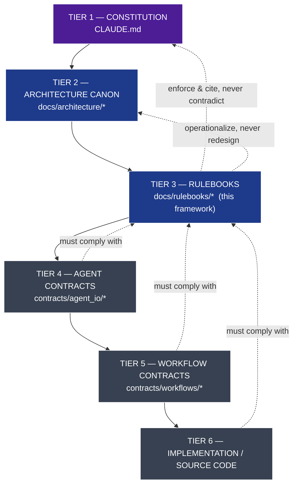
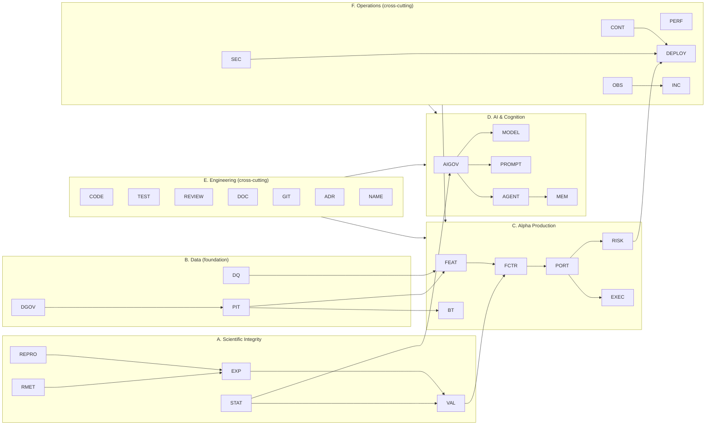

# Rulebook Framework

### The Institutional Governance Layer (Tier 3)

> **Tier.** This document defines the third tier of repository authority, directly below the Architecture Documents and above Agent Contracts. It is subordinate to `CLAUDE.md` (the Constitution) and to the Architecture Canon, and supreme over Agent Contracts, Workflow Contracts, and Source Code.
>
> **Nature.** Rulebooks translate constitutional principles into **enforceable, domain-specific operational rules**. They are not architecture and not implementation. They tell practitioners and agents _how to comply_ with the Constitution inside a specific domain.
>
> **Scope of this file.** This is the **framework**: the complete catalog of required rulebooks, their single responsibilities, ownership, dependencies, the mandatory internal structure every rulebook must follow, and the anti-duplication map. It does **not** contain the rules of any individual rulebook. Those are authored separately, later, each governed by this framework.
>
> **Language.** RFC 2119 (`MUST`, `MUST NOT`, `SHOULD`, `MAY`) per `CLAUDE.md`. A rule without a qualifier is `MUST`.

---

## 1. Authority & Position in the Hierarchy

**Governing constraints (inherited from `CLAUDE.md`):**

- **RBK-A1** A rulebook `MUST NOT` contradict `CLAUDE.md` or the Architecture Canon; where it does, it is void (`CLAUDE.md` RB-2).
- **RBK-A2** A rulebook `MUST NOT` redesign, restate, or duplicate architecture; it `MUST` cite it (`CLAUDE.md` DOC-1, RB-1).
- **RBK-A3** Every rulebook rule `SHOULD` be machine-checkable and wired into CI where feasible (`CLAUDE.md` RB-3, CR-2).
- **RBK-A4** A rulebook `MUST` remain implementation-independent: it defines _what must hold_, never _how code achieves it_.
- **RBK-A5** Every rulebook `MUST` have exactly one responsibility, one owning role, and a declared scope boundary (`CLAUDE.md` SE-1).

---

## 2. Mandatory Rulebook Structure

Every rulebook in the catalog `MUST` conform to the following internal structure. A rulebook that omits a required section is not ratifiable.

| #   | Section                                                                                     | Requirement | Purpose                                                 |
| --- | ------------------------------------------------------------------------------------------- | ----------- | ------------------------------------------------------- |
| 1   | **Header** (ID, version, owner, status, last-ratified)                                      | MUST        | Identity & lifecycle state                              |
| 2   | **Purpose**                                                                                 | MUST        | The single responsibility, in one paragraph             |
| 3   | **Scope & Boundaries** (in-scope / explicitly out-of-scope)                                 | MUST        | Prevents overlap with sibling rulebooks                 |
| 4   | **Constitutional Basis** (cited `CLAUDE.md` rule IDs)                                       | MUST        | Every rule traces upward                                |
| 5   | **Architectural Basis** (cited ARCH sections / PATCH IDs)                                   | MUST        | Grounds rules in the system of record                   |
| 6   | **Definitions** (domain terms; defer to `CLAUDE.md` Glossary)                               | SHOULD      | Local precision without redefining constitutional terms |
| 7   | **Rules** (numbered, RFC 2119, each with rationale)                                         | MUST        | The enforceable content                                 |
| 8   | **Enforcement & Verification** (how each rule is checked: CI gate, review checklist, audit) | MUST        | Enforcement over intention (`CLAUDE.md` CP-1)           |
| 9   | **Exceptions & Waivers** (who may grant, how recorded)                                      | MUST        | No silent deviations                                    |
| 10  | **Acceptance Criteria**                                                                     | MUST        | When the rulebook is considered complete                |
| 11  | **Success Metrics**                                                                         | MUST        | How compliance is measured over time                    |
| 12  | **Dependencies & Related Rulebooks**                                                        | MUST        | Explicit coupling                                       |
| 13  | **Change Log & Version History**                                                            | MUST        | Auditability (`CLAUDE.md` VER-1)                        |

**RBK-S1** Every rule inside a rulebook `MUST` carry a stable ID of the form `<RULEBOOK-CODE>-<n>` (e.g., `STAT-14`) so lower tiers and CI can cite it.
**RBK-S2** Every rule `MUST` be traceable to at least one constitutional rule ID; a rule with no constitutional basis is `PROHIBITED` (it would be legislating new principle, which only `CLAUDE.md` may do).
**RBK-S3** Every rule `SHOULD` be phrased as a testable predicate ("a merged PR `MUST NOT` …", "no factor `MAY` … unless …").

---

## 3. Identification, Versioning & File Convention

- **RBK-ID** Each rulebook has an immutable ID `RB-NN` and a short uppercase **code** (e.g., `STAT`) used to prefix its rule IDs.
- **RBK-FILE** File path: `docs/rulebooks/RB-NN-<slug>.md`. One rulebook per file.
- **RBK-VER** Rulebooks are semantically versioned (`MAJOR.MINOR.PATCH`), per `CLAUDE.md` VER-1. A change that removes or weakens a rule is a `MAJOR` bump; adding a rule is `MINOR`; clarifications are `PATCH`.
- **RBK-STATUS** Lifecycle states: `DRAFT → PROPOSED → RATIFIED → SUPERSEDED/RETIRED`. Only `RATIFIED` rulebooks are binding.
- **RBK-OWN** Ownership is by **institutional role**, never a named individual; roles are defined in §4.

---

## 4. Ownership Roles (Stewardship)

Rulebooks are owned by roles accountable for the domain. A role may own several rulebooks; a rulebook has exactly one owning role.

| Role code | Role                                               | Accountable for                                                |
| --------- | -------------------------------------------------- | -------------------------------------------------------------- |
| **HR**    | Head of Research / Chief Scientist                 | Scientific method, research integrity                          |
| **HQ**    | Head of Quantitative Research                      | Features, factors, alpha production                            |
| **HPR**   | Head of Portfolio & Risk                           | Portfolio construction, risk, execution                        |
| **HD**    | Head of Data                                       | Data governance, quality, provenance, PIT                      |
| **HAI**   | Head of AI / ML Platform                           | AI governance, models, prompts, agents, memory                 |
| **PE**    | Principal Engineer (Engineering Standards Council) | Coding, testing, review, docs, git, naming                     |
| **CISO**  | Head of Security                                   | Security rulebook                                              |
| **HSRE**  | Head of Platform / SRE                             | Observability, performance, deployment, incidents, continuity  |
| **ARB**   | Architecture Review Board                          | ADR rulebook; ratifies all rulebooks; guards Tier-2/3 boundary |
| **MRC**   | Model Risk Committee                               | Co-signs Model & AI governance rulebooks                       |
| **GRC**   | Governance & Risk Committee                        | Co-signs risk, validation, promotion gates                     |

**RBK-OWN-1** Ratification of any rulebook `MUST` be approved by the **ARB**, and additionally co-signed by **GRC** (for research/risk-affecting rulebooks) or **MRC** (for AI/model-affecting rulebooks).

---

## 5. Master Catalog

Six domains, 32 rulebooks. Every rulebook is required.

| ID    | Code   | Rulebook                           | Domain                  | Owner |
| ----- | ------ | ---------------------------------- | ----------------------- | ----- |
| RB-01 | STAT   | Statistics & Statistical Integrity | A. Scientific Integrity | HR    |
| RB-02 | RMET   | Research Methodology               | A. Scientific Integrity | HR    |
| RB-03 | EXP    | Experiment Management              | A. Scientific Integrity | HR    |
| RB-04 | VAL    | Validation                         | A. Scientific Integrity | GRC   |
| RB-05 | REPRO  | Reproducibility                    | A. Scientific Integrity | HR    |
| RB-06 | DGOV   | Data Governance                    | B. Data                 | HD    |
| RB-07 | DQ     | Data Quality                       | B. Data                 | HD    |
| RB-08 | PIT    | Point-in-Time & Provenance         | B. Data                 | HD    |
| RB-09 | FEAT   | Feature Engineering                | C. Alpha Production     | HQ    |
| RB-10 | FCTR   | Factor Research                    | C. Alpha Production     | HQ    |
| RB-11 | BT     | Backtesting                        | C. Alpha Production     | HQ    |
| RB-12 | PORT   | Portfolio Construction             | C. Alpha Production     | HPR   |
| RB-13 | RISK   | Risk Management                    | C. Alpha Production     | HPR   |
| RB-14 | EXEC   | Execution & TCA                    | C. Alpha Production     | HPR   |
| RB-15 | AIGOV  | AI Governance                      | D. AI & Cognition       | HAI   |
| RB-16 | MODEL  | Model Governance                   | D. AI & Cognition       | MRC   |
| RB-17 | PROMPT | Prompt Engineering                 | D. AI & Cognition       | HAI   |
| RB-18 | AGENT  | Agent Governance                   | D. AI & Cognition       | HAI   |
| RB-19 | MEM    | Memory & Knowledge                 | D. AI & Cognition       | HAI   |
| RB-20 | CODE   | Coding Standards                   | E. Engineering          | PE    |
| RB-21 | TEST   | Testing Standards                  | E. Engineering          | PE    |
| RB-22 | REVIEW | Code Review                        | E. Engineering          | PE    |
| RB-23 | DOC    | Documentation Standards            | E. Engineering          | PE    |
| RB-24 | GIT    | Git & Version Control              | E. Engineering          | PE    |
| RB-25 | ADR    | Architecture Decision Records      | E. Engineering          | ARB   |
| RB-26 | NAME   | Naming & Repository Organization   | E. Engineering          | PE    |
| RB-27 | SEC    | Security                           | F. Operations           | CISO  |
| RB-28 | OBS    | Observability                      | F. Operations           | HSRE  |
| RB-29 | PERF   | Performance & Scalability          | F. Operations           | HSRE  |
| RB-30 | DEPLOY | Deployment & Release               | F. Operations           | HSRE  |
| RB-31 | INC    | Incident Management                | F. Operations           | HSRE  |
| RB-32 | CONT   | Reliability & Continuity (DR/BCP)  | F. Operations           | HSRE  |

---

## 6. Domain Dependency Graph

**Reading the graph:** Data rulebooks are the foundation (nothing valid without PIT/provenance). Scientific Integrity governs how research is done and judged. Alpha Production depends on both. AI & Cognition is governed by Scientific Integrity for anything statistical. Engineering and Operations are cross-cutting and apply to every domain.

---

## 7. Rulebook Specifications

Each entry defines the 13 required fields. Rules themselves are authored later, under this framework.

> Legend for brevity: **Consumers** are the actors bound by the rulebook (H=humans by role, AI=agents, CI=automated gates). Citations like `SI-1` are `CLAUDE.md` rule IDs; `P2-01`, `ARCH §8` are Architecture Canon references.

---

### Domain A — Scientific Integrity

#### RB-01 · STAT · Statistics & Statistical Integrity

- **Purpose.** Define the statistical standards that make discovery honest: significance, multiple-testing control, deflation, and correlation-aware trial accounting.
- **Scope.** Statistical methodology for all research claims. _Out of scope:_ how experiments are stored (EXP), how validation is orchestrated (VAL).
- **Responsibilities.** Significance thresholds; multiple-testing budgets (FWER/FDR); deflated metric standards; effective-number-of-trials estimation; null/synthetic-data standards.
- **Owner.** HR (co-sign GRC). **Consumers.** H(researchers), AI(narrators only), CI(promotion gates).
- **Dependencies.** RB-03 (EXP), RB-05 (REPRO). **Related Rulebooks.** VAL, FCTR, AIGOV.
- **Related Architecture.** REVIEW C2; `P2-01`, `P2-02`; ARCH §2.6.
- **Relationship to CLAUDE.md.** Operationalizes SI-1..SI-5, FB-8; enforces AI-2 (LLMs never assert significance).
- **Major Sections.** Significance & power; Multiple-testing budget; Deflation; Trial correlation; Null models; Forbidden statistical practices.
- **Acceptance Criteria.** Every statistical claim type has a defined, testable threshold and a CI-checkable gate; no rule permits undeflated significance.
- **Success Metrics.** Realized false-discovery rate within budget; zero promotions passing on undeflated metrics; 100% of trials ledger-accounted.
- **Future Extensions.** Bayesian decision standards; adaptive budgets by information content.

#### RB-02 · RMET · Research Methodology

- **Purpose.** Govern the scientific method as practiced: idea framing, hypothesis pre-registration, falsifiability, and negative-result preservation.
- **Scope.** The _method_ of research. _Out of scope:_ statistical math (STAT), storage/versioning of experiments (EXP).
- **Responsibilities.** Idea intake standards; pre-registration lock rules; falsifiability criteria; economic-rationale requirements; failed-research preservation.
- **Owner.** HR. **Consumers.** H(researchers), AI(hypothesis-proposer agents), CI.
- **Dependencies.** RB-03, RB-01. **Related Rulebooks.** EXP, FCTR, MEM.
- **Related Architecture.** ARCH §4; `P3-01`, `P3-02`, `P3-05`, `P3-12`.
- **Relationship to CLAUDE.md.** Operationalizes SM-1..SM-5, RL-1..RL-3, AD-2; enforces FB-8.
- **Major Sections.** Idea registration; Hypothesis pre-registration; Falsifiability; Economic rationale; Negative results; Generator↔validator conduct.
- **Acceptance Criteria.** No research path exists that bypasses pre-registration; every hypothesis template enforces falsifiability + success criteria.
- **Success Metrics.** 100% pre-registered hypotheses; measurable reuse of the rejected-research corpus; zero post-hoc criteria edits.
- **Future Extensions.** Standardized pre-registration templates per research family.

#### RB-03 · EXP · Experiment Management

- **Purpose.** Standards for registering, versioning, and accounting for experiments and their immutable metadata.
- **Scope.** Experiment records, manifests, and trial-ledger linkage. _Out of scope:_ the statistics applied (STAT), the validation verdict (VAL).
- **Responsibilities.** Experiment registration; immutable manifests; trial-ledger enrollment; experiment versioning; repeatability standards.
- **Owner.** HR. **Consumers.** H, AI, CI.
- **Dependencies.** RB-05 (REPRO), RB-08 (PIT). **Related Rulebooks.** STAT, VAL, RMET.
- **Related Architecture.** `P2-01`, `P3-03`, `P1-02`; ARCH §3.
- **Relationship to CLAUDE.md.** Operationalizes EX-1..EX-4, FB-5; supports RP-1.
- **Major Sections.** Registration; Manifests; Trial-ledger enrollment; Versioning & immutability; Repeatability.
- **Acceptance Criteria.** No experiment can execute without a registry entry + ledger id; manifests are complete and immutable.
- **Success Metrics.** 0 unregistered runs; 100% experiments independently repeatable from manifest.
- **Future Extensions.** Experiment pipeline templates.

#### RB-04 · VAL · Validation

- **Purpose.** Standards for the deterministic validation gauntlet a candidate must survive, and how verdicts are issued.
- **Scope.** Validation orchestration and verdict standards. _Out of scope:_ statistical definitions (STAT), holdout data management (owned here jointly with PIT/GRC).
- **Responsibilities.** Gauntlet composition; leakage-harness gating; purged/embargoed CV; one-shot holdout protocol; independent replication; verdict immutability.
- **Owner.** GRC (co-sign HR). **Consumers.** H(validation function), deterministic engines, CI. AI `MUST NOT` decide here.
- **Dependencies.** RB-01, RB-03, RB-08. **Related Rulebooks.** STAT, FCTR, REPRO.
- **Related Architecture.** REVIEW C1/C2/C6; `P2-02`,`P2-03`,`P2-05`,`P2-06`,`P2-07`,`P2-08`,`P2-09`.
- **Relationship to CLAUDE.md.** Operationalizes VS-1..VS-4, SI-4, AI-2, AI-5, AD-3, RG-1.
- **Major Sections.** Gauntlet standard; Leakage gating; CV protocol; Holdout budget; Replication; Isolation-barrier conduct; Verdict records.
- **Acceptance Criteria.** No promotion path lacks leakage, CV, holdout, replication, and budget checks; all validation decisions deterministic and golden-tested.
- **Success Metrics.** 0 LLM-made validation decisions; 0 unbudgeted holdout touches; replication discrepancy auto-rejection rate tracked.
- **Future Extensions.** Nested CPCV for hyperparameter selection.

#### RB-05 · REPRO · Reproducibility

- **Purpose.** Cross-cutting standards guaranteeing every deterministic result is exactly reproducible and every stochastic step is recorded.
- **Scope.** Manifests, seeds, hermetic execution, artifact reproducibility. _Out of scope:_ storage tiering (PERF), lineage semantics (PIT/DGOV).
- **Responsibilities.** Run-manifest completeness; seed/environment capture; deterministic/stochastic classification; reproducibility of superseded artifacts.
- **Owner.** HR (co-sign PE). **Consumers.** H, AI, CI.
- **Dependencies.** RB-08. **Related Rulebooks.** EXP, MODEL, CODE.
- **Related Architecture.** REVIEW C4; `P1-02`, `P5-01`.
- **Relationship to CLAUDE.md.** Operationalizes CP-4, RP-1..RP-4, FB-10.
- **Major Sections.** Run manifests; Determinism boundaries; Stochastic recording; Reproducibility retention.
- **Acceptance Criteria.** Any deterministic artifact re-runs bit-identically from manifest on a clean host; every LLM step records model+prompt+output hashes.
- **Success Metrics.** 100% deterministic artifacts reproducible in audit; 0 optimizations without manifests.
- **Future Extensions.** Manifest-keyed compute cache.

---

### Domain B — Data

#### RB-06 · DGOV · Data Governance

- **Purpose.** Govern data sourcing, licensing, canonicalization, symbology, and the raw-vault immutability contract.
- **Scope.** Data lifecycle from vendor to canonical record. _Out of scope:_ quality checks (DQ), as-of semantics (PIT).
- **Responsibilities.** Source onboarding & licensing; canonical schema conformance; symbology resolution; raw-vault immutability; restatement intake.
- **Owner.** HD. **Consumers.** H(data engineers), ingestion agents, CI.
- **Dependencies.** — (foundation). **Related Rulebooks.** DQ, PIT.
- **Related Architecture.** ARCH §2.2; `P1-01`.
- **Relationship to CLAUDE.md.** Operationalizes DI-1..DI-3, CP-8; supports DP-\*.
- **Major Sections.** Source onboarding; Licensing; Canonicalization; Symbology; Raw-vault immutability; Restatements.
- **Acceptance Criteria.** Research side has no path to raw vendor data; every record is canonical + licensed + bitemporally stamped.
- **Success Metrics.** 0 raw-data reads by research; 100% sources licensed & catalogued.
- **Future Extensions.** Automated license-compliance auditing.

#### RB-07 · DQ · Data Quality

- **Purpose.** Define quality gates, anomaly detection, and quarantine standards at ingestion and beyond.
- **Scope.** Correctness/completeness/timeliness of data. _Out of scope:_ provenance/as-of (PIT), sourcing (DGOV).
- **Responsibilities.** Quality SLAs; anomaly & break detection; quarantine protocol; restatement reconciliation cascade.
- **Owner.** HD. **Consumers.** H, data-quality-sentinel agents, CI.
- **Dependencies.** RB-06. **Related Rulebooks.** PIT, FEAT.
- **Related Architecture.** ARCH §2.2; REVIEW Missing #10; `P1-01`.
- **Relationship to CLAUDE.md.** Operationalizes DI-2, DP-2.
- **Major Sections.** Quality SLAs; Anomaly detection; Quarantine; Restatement cascade; Vendor-defect handling.
- **Acceptance Criteria.** Bad data is quarantined, never silently repaired; a restatement triggers a defined downstream invalidation.
- **Success Metrics.** Quarantine coverage; mean-time-to-detect data breaks; downstream-invalidation completeness.
- **Future Extensions.** Predictive data-break detection.

#### RB-08 · PIT · Point-in-Time & Provenance

- **Purpose.** The most safety-critical data rulebook: enforce as-of reads, vintage handling, and full lineage — the fund's defense against look-ahead and survivorship bias.
- **Scope.** Temporal correctness and provenance for all reads. _Out of scope:_ quality (DQ), sourcing (DGOV).
- **Responsibilities.** Mandatory as-of gateway usage; vintage/restatement reads; reference-data as-of; lineage completeness; leakage-vector prohibitions.
- **Owner.** HD (co-sign GRC). **Consumers.** H, all research/backtest consumers, CI.
- **Dependencies.** RB-06. **Related Rulebooks.** FEAT, BT, VAL, REPRO.
- **Related Architecture.** REVIEW C1; `P1-01`, `P1-06`, `P5-03`; ARCH §2.3, §8.2.
- **Relationship to CLAUDE.md.** Operationalizes PIT-1..PIT-4, DP-1..DP-3, CP-3, CP-6, FB-6, FB-7.
- **Major Sections.** As-of gateway mandate; Vintage reads; Reference-data as-of; Lineage; Prohibited leakage patterns.
- **Acceptance Criteria.** No read without `as_of` can execute (fails closed); reference data is queried as-of; every feature/dataset has resolvable lineage.
- **Success Metrics.** 0 non-as-of reads in CI/audit; 0 look-ahead findings from leakage harness; 100% lineage resolvable.
- **Future Extensions.** Tick-level vintage at scale.

---

### Domain C — Alpha Production

#### RB-09 · FEAT · Feature Engineering

- **Purpose.** Standards for defining, computing, and accepting features into the Feature Marketplace.
- **Scope.** Feature definitions and acceptance. _Out of scope:_ factor construction (FCTR), raw data (DGOV/DQ).
- **Responsibilities.** Declarative feature definitions; PIT-bound computation; leakage clearance; feature versioning; marketplace acceptance.
- **Owner.** HQ. **Consumers.** H(researchers), factor-author agents, CI.
- **Dependencies.** RB-08, RB-07, RB-05. **Related Rulebooks.** FCTR, PIT.
- **Related Architecture.** `P1-06`, `P2-03`, `P3-07`; ARCH §2.3.
- **Relationship to CLAUDE.md.** Operationalizes FA-1..FA-4, PIT-3, DP-3.
- **Major Sections.** Feature definition; PIT computation; Leakage gating; Versioning; Marketplace acceptance.
- **Acceptance Criteria.** No feature is accepted without leakage clearance, provenance, manifest, and a version.
- **Success Metrics.** Feature reuse rate; 0 leaky features accepted; % features with complete lineage.
- **Future Extensions.** Streaming feature standards.

#### RB-10 · FCTR · Factor Research

- **Purpose.** Standards for constructing, orthogonalizing, classifying, and accepting factors.
- **Scope.** Factor lifecycle up to capital-eligibility handoff. _Out of scope:_ portfolio sizing (PORT), pure statistics (STAT).
- **Responsibilities.** Net-alpha definition; orthogonalization & ontology classification; redundancy control; economic rationale; capacity/crowding; acceptance & retirement.
- **Owner.** HQ. **Consumers.** H, factor agents, CI, GRC.
- **Dependencies.** RB-09, RB-01, RB-04. **Related Rulebooks.** FEAT, VAL, PORT.
- **Related Architecture.** `P2-04`, `P3-06`, `P3-09`, `P3-11`, `P3-12`; ARCH §2.5.
- **Relationship to CLAUDE.md.** Operationalizes FC-1..FC-5, AD-1..AD-4, RL-2.
- **Major Sections.** Net-alpha definition; Orthogonalization; Ontology classification; Rationale; Capacity & crowding; Acceptance; Retirement.
- **Acceptance Criteria.** No factor is accepted without net definition, ontology class, rationale, capacity, replication, and governance token.
- **Success Metrics.** Factor-zoo redundancy rate; retirement latency for decayed factors; % factors with economic rationale.
- **Future Extensions.** Regime-conditioned factor standards.

#### RB-11 · BT · Backtesting

- **Purpose.** Standards for institutional-realism, reproducible backtests.
- **Scope.** Simulation fidelity and artifacts. _Out of scope:_ portfolio optimization (PORT), live execution (EXEC).
- **Responsibilities.** PIT + simulated-clock mandate; cost/borrow/fill/impact realism; corporate-action correctness; capacity method; immutable artifacts; anti-manipulation.
- **Owner.** HQ. **Consumers.** H, CI, GRC.
- **Dependencies.** RB-08, RB-05, RB-14 (cost inputs). **Related Rulebooks.** FCTR, PORT, EXEC.
- **Related Architecture.** REVIEW M4; `P3-16`, `P1-07`; ARCH §2.7.
- **Relationship to CLAUDE.md.** Operationalizes BT-1..BT-4, PIT-4, FB-6, FB-9.
- **Major Sections.** PIT & clock; Cost/borrow/fill/impact; Corporate actions; Capacity; Artifacts; Anti-manipulation.
- **Acceptance Criteria.** No backtest runs on wall-clock or non-PIT data; every backtest models borrow, participation-aware fills, and actions; artifacts immutable.
- **Success Metrics.** Sim-to-real gap; 0 manually edited results; % backtests with capacity assessment.
- **Future Extensions.** Agent-based market simulation standards.

#### RB-12 · PORT · Portfolio Construction

- **Purpose.** Standards for building institutional portfolios from capital-eligible alphas.
- **Scope.** Construction, optimization, capital allocation. _Out of scope:_ factor validity (FCTR/VAL), risk limits (RISK).
- **Responsibilities.** Eligibility-token enforcement; net-of-cost optimization; constraint compliance; capital allocation across sleeves; portfolio snapshots.
- **Owner.** HPR. **Consumers.** H(PMs), deterministic optimizers, CI. AI `MUST NOT` decide sizing.
- **Dependencies.** RB-10, RB-13, RB-04. **Related Rulebooks.** RISK, FCTR, EXEC.
- **Related Architecture.** `P2-09`, `P3-08`, `P1-08`; ARCH §2.8.
- **Relationship to CLAUDE.md.** Operationalizes PS-1..PS-4, RG-1.
- **Major Sections.** Eligibility enforcement; Net optimization; Constraints; Allocation; Snapshots.
- **Acceptance Criteria.** No alpha enters a portfolio without a valid eligibility token; optimization is provably net-of-cost.
- **Success Metrics.** 0 gross-optimized portfolios; constraint-violation rate; token-coverage 100%.
- **Future Extensions.** Regime-switching allocation standards.

#### RB-13 · RISK · Risk Management

- **Purpose.** Standards for deterministic risk limits, monitoring, and halts, independent of research.
- **Scope.** Risk limits, VaR/exposure/drawdown monitoring, kill-switch policy. _Out of scope:_ portfolio construction (PORT), execution mechanics (EXEC).
- **Responsibilities.** Limit definitions; real-time monitoring standards; graduated kill-switches; independence of oversight; authorization tokens.
- **Owner.** HPR (co-sign GRC). **Consumers.** H(risk officers), deterministic risk engines, CI. AI `MUST NEVER` decide halts.
- **Dependencies.** RB-12. **Related Rulebooks.** PORT, EXEC, DEPLOY.
- **Related Architecture.** ARCH §2.10; `P1-03`.
- **Relationship to CLAUDE.md.** Operationalizes RS-1..RS-4, AI-1, HO-4.
- **Major Sections.** Limits; Monitoring; Kill-switches & circuit breakers; Independence; Authorization.
- **Acceptance Criteria.** All risk decisions deterministic & golden-tested; live trading impossible without a valid authorization token.
- **Success Metrics.** 0 LLM-influenced risk halts; limit-breach detection latency; kill-switch drill pass rate.
- **Future Extensions.** Formal verification of limit engines.

#### RB-14 · EXEC · Execution & TCA

- **Purpose.** Standards for order lifecycle, paper-first operation, and transaction-cost analysis feedback.
- **Scope.** Order handling, venue adapters, TCA, research↔prod parity. _Out of scope:_ target generation (PORT), risk limits (RISK).
- **Responsibilities.** Paper-first default; broker/venue adapter standards; TCA methodology; parity harness; reconciliation.
- **Owner.** HPR. **Consumers.** H(execution), execution engines, CI.
- **Dependencies.** RB-12, RB-13. **Related Rulebooks.** BT, RISK, DEPLOY.
- **Related Architecture.** ARCH §2.9; `P3-15`, `P1-10`.
- **Relationship to CLAUDE.md.** Operationalizes DEP-1, RS-4, OB-4, RE-2.
- **Major Sections.** Paper-first; Venue adapters; TCA; Parity harness; Reconciliation; Feedback-loop governance.
- **Acceptance Criteria.** Default mode is paper; live requires governance token; research↔prod signal parity continuously verified.
- **Success Metrics.** Parity-breach rate; TCA-vs-model calibration drift; reconciliation exceptions.
- **Future Extensions.** Smart-routing standards per asset class.

---

### Domain D — AI & Cognition

#### RB-15 · AIGOV · AI Governance

- **Purpose.** The operational rulebook for where AI may and may not act — the domain expansion of the Constitution's AI Governance article.
- **Scope.** Permitted/prohibited AI roles across the platform. _Out of scope:_ model lifecycle (MODEL), prompt authoring (PROMPT), agent design (AGENT).
- **Responsibilities.** LLM usage boundaries; deterministic-engine mandate; decision-authority rules; escalation to humans.
- **Owner.** HAI (co-sign MRC, GRC). **Consumers.** H, all AI agents, CI.
- **Dependencies.** RB-01. **Related Rulebooks.** MODEL, PROMPT, AGENT, MEM, VAL, RISK.
- **Related Architecture.** REVIEW C3; `P1-03`, `P4-*`.
- **Relationship to CLAUDE.md.** Operationalizes AI-1..AI-8, LLM-1..LLM-4, DE-1..DE-4, FB-1..FB-4.
- **Major Sections.** Permitted roles; Prohibited roles; Deterministic-engine mandate; Escalation; Enforcement.
- **Acceptance Criteria.** No AI role exists in a prohibited path; every consequential decision has a deterministic owner.
- **Success Metrics.** 0 prohibited-role violations; % decisions with deterministic owners = 100%.
- **Future Extensions.** Formal capability attestation for agents.

#### RB-16 · MODEL · Model Governance

- **Purpose.** Standards for registering, pinning, evaluating, and promoting models (LLM and non-LLM).
- **Scope.** Model lifecycle and drift. _Out of scope:_ prompt content (PROMPT), agent wiring (AGENT).
- **Responsibilities.** Model registry & pinning; golden-set eval gates; drift monitoring; upgrade approval; provenance recording.
- **Owner.** MRC (co-sign HAI). **Consumers.** H, agents, CI.
- **Dependencies.** RB-15, RB-05. **Related Rulebooks.** AIGOV, PROMPT, OBS.
- **Related Architecture.** REVIEW M5; `P4-01`.
- **Relationship to CLAUDE.md.** Operationalizes AI-6, AI-8, MPG-1..MPG-4, OB-3.
- **Major Sections.** Registry & pinning; Eval gates; Drift monitoring; Upgrade approval; Provenance.
- **Acceptance Criteria.** No agent runs an unpinned model; no upgrade reaches production without passing the eval gate.
- **Success Metrics.** 0 unpinned-model runs; eval-gate coverage; detected-drift response time.
- **Future Extensions.** Canary rollout standards.

#### RB-17 · PROMPT · Prompt Engineering

- **Purpose.** Standards for authoring, versioning, and securing prompts that influence consequential outputs.
- **Scope.** Prompt artifacts and injection safety. _Out of scope:_ model selection (MODEL), agent responsibility (AGENT).
- **Responsibilities.** Prompt versioning & hashing; role-boundary enforcement in prompts; untrusted-content delimiting; eval-gated prompt changes.
- **Owner.** HAI. **Consumers.** H(prompt authors), agents, CI.
- **Dependencies.** RB-15, RB-16. **Related Rulebooks.** AIGOV, MODEL, SEC, MEM.
- **Related Architecture.** `P4-01`, `P4-03`.
- **Relationship to CLAUDE.md.** Operationalizes PE-1..PE-4, APR-1..APR-3.
- **Major Sections.** Versioning & hashing; Role boundaries; Untrusted-content handling; Change eval; Secrets prohibition.
- **Acceptance Criteria.** Every consequential prompt is versioned/hashed; no prompt instructs a prohibited AI role; untrusted content is delimited as data.
- **Success Metrics.** Prompt-version coverage; injection-fixture catch rate; 0 secrets in prompts.
- **Future Extensions.** Continuous adversarial prompt red-teaming.

#### RB-18 · AGENT · Agent Governance

- **Purpose.** Standards for designing single-responsibility agents and their contracts (the tier-3 rules that constrain tier-4 agent contracts).
- **Scope.** Agent responsibilities, authority flags, communication conduct. _Out of scope:_ model/prompt internals (MODEL/PROMPT).
- **Responsibilities.** One-job rule; `decides`/`narrates` authority; bus-only communication; isolation-barrier conduct; registry compliance.
- **Owner.** HAI. **Consumers.** H(agent authors), AI, CI, ARB (contract review).
- **Dependencies.** RB-15. **Related Rulebooks.** AIGOV, MEM, PROMPT.
- **Related Architecture.** REVIEW AI-risks; `P4-02`, `P4-04`, `P4-05`, `P2-07`; ARCH §5.
- **Relationship to CLAUDE.md.** Operationalizes AG-1..AG-4, AC-1..AC-4, ACON-1..ACON-3.
- **Major Sections.** Single responsibility; Authority flags; Communication; Arbitration; Registry compliance.
- **Acceptance Criteria.** No agent has two responsibilities; no generator can subscribe to validation/OOS topics; every collaboration resolves via an arbiter.
- **Success Metrics.** 0 SRP violations; 0 isolation-barrier breaches; arbiter coverage of collaborative flows.
- **Future Extensions.** Automated SRP/authority linting.

#### RB-19 · MEM · Memory & Knowledge

- **Purpose.** Standards for the memory fabric and knowledge corpus: confidence, contradiction handling, scoping, and graduation.
- **Scope.** Memory writes/reads, knowledge-graph edges, corpus graduation. _Out of scope:_ agent design (AGENT), data provenance (PIT).
- **Responsibilities.** Provenance & confidence decay; contradiction quarantine; scope/ACL enforcement; belief graduation; barrier-respecting reads.
- **Owner.** HAI. **Consumers.** H, agents, CI.
- **Dependencies.** RB-18, RB-08. **Related Rulebooks.** AGENT, PIT, KM-related.
- **Related Architecture.** REVIEW M3; `P4-06`, `P3-14`, `P2-07`; ARCH §6.
- **Relationship to CLAUDE.md.** Operationalizes MEM-1..MEM-4, KM-1..KM-3.
- **Major Sections.** Provenance & confidence; Contradiction quarantine; Scoping/ACLs; Graduation; Barrier reads.
- **Acceptance Criteria.** No cross-scope leakage to generators; contradictions quarantined; every belief carries decaying confidence.
- **Success Metrics.** Contradiction-quarantine rate; 0 barrier leaks; corpus-graduation auditability.
- **Future Extensions.** Bayesian belief-update standards.

---

### Domain E — Engineering (cross-cutting)

#### RB-20 · CODE · Coding Standards

- **Purpose.** Baseline engineering rules that keep code contract-honoring, deterministic-injection-safe, and coupling-free.
- **Scope.** Source code conventions and correctness constraints. _Out of scope:_ tests (TEST), review process (REVIEW).
- **Responsibilities.** Contract adherence; dependency injection of time/randomness/model calls; no hidden coupling; no core asset-branching.
- **Owner.** PE. **Consumers.** H(engineers), code-writing agents, CI.
- **Dependencies.** RB-26. **Related Rulebooks.** TEST, REVIEW, REPRO.
- **Related Architecture.** ARCH §8; `P1-03`.
- **Relationship to CLAUDE.md.** Operationalizes CS-1..CS-4, SE-1..SE-5.
- **Major Sections.** Contract adherence; Injection of non-determinism; Coupling prohibitions; Core purity; Assumptions documentation.
- **Acceptance Criteria.** Ambient time/RNG/model access fails review/CI; core contains no asset-class branch.
- **Success Metrics.** Coupling-violation rate; ambient-nondeterminism findings; 0 core asset branches.
- **Future Extensions.** Static-analysis rule packs.

#### RB-21 · TEST · Testing Standards

- **Purpose.** Standards for test coverage, golden-set tests for deterministic engines, and reproducibility tests.
- **Scope.** Automated testing. _Out of scope:_ validation of research (VAL), performance testing (PERF).
- **Responsibilities.** Coverage thresholds; golden-set requirement for decision engines; determinism/reproducibility tests; fixture management.
- **Owner.** PE. **Consumers.** H, CI.
- **Dependencies.** RB-20, RB-05. **Related Rulebooks.** CODE, REVIEW, VAL.
- **Related Architecture.** `P1-03`, `P1-02`.
- **Relationship to CLAUDE.md.** Operationalizes CS-2, VS-1, DE-2.
- **Major Sections.** Coverage; Golden-set tests; Determinism tests; Fixtures; CI integration.
- **Acceptance Criteria.** Every deterministic decision engine has golden tests; correctness-critical code is covered.
- **Success Metrics.** Golden-test coverage of decision engines = 100%; flaky-test rate.
- **Future Extensions.** Mutation testing for critical paths.

#### RB-22 · REVIEW · Code Review

- **Purpose.** Standards for independent, constitutional-compliance-focused review.
- **Scope.** The review process and gates. _Out of scope:_ what to code (CODE), git mechanics (GIT).
- **Responsibilities.** Independent review requirement; compliance checklist; counter-sign for capital-affecting changes; red-gate merge prohibition.
- **Owner.** PE. **Consumers.** H(reviewers), CI. AI `MAY` assist, `MUST NOT` approve.
- **Dependencies.** RB-20, RB-24. **Related Rulebooks.** CODE, GIT, ADR.
- **Related Architecture.** REVIEW (all); `CLAUDE.md` CR-\*.
- **Relationship to CLAUDE.md.** Operationalizes CR-1..CR-4, CP-1.
- **Major Sections.** Independence; Compliance checklist; Counter-sign; Gate enforcement; AI-assist limits.
- **Acceptance Criteria.** No self-approval; every merge shows constitutional-compliance review; red gates block merge.
- **Success Metrics.** Self-merge count = 0; escaped-defect rate; prose-guarantee rejections.
- **Future Extensions.** Automated compliance-checklist bots (advisory only).

#### RB-23 · DOC · Documentation Standards

- **Purpose.** Standards keeping docs consistent, non-duplicative, and reference-resolving.
- **Scope.** All repository documentation. _Out of scope:_ ADRs (ADR), code comments policy (CODE).
- **Responsibilities.** Cite-don't-duplicate rule; reference-resolution; doc-code consistency; decision capture.
- **Owner.** PE. **Consumers.** H, doc-writing agents, CI.
- **Dependencies.** RB-25. **Related Rulebooks.** ADR, NAME.
- **Related Architecture.** ARCH §2.18.
- **Relationship to CLAUDE.md.** Operationalizes DOC-1..DOC-4.
- **Major Sections.** Cite-don't-duplicate; Reference integrity; Consistency; Decision capture.
- **Acceptance Criteria.** Broken cross-references block merge; no doc duplicates architecture.
- **Success Metrics.** Broken-reference count = 0; doc-drift findings.
- **Future Extensions.** Automated link/reference checker in CI.

#### RB-24 · GIT · Git & Version Control

- **Purpose.** Standards for branching, atomic commits, PR discipline, and history immutability.
- **Scope.** VCS workflow. _Out of scope:_ review substance (REVIEW), semantic versioning of artifacts (owned per-domain, framework RBK-VER).
- **Responsibilities.** No direct default-branch commits; atomic commits; patch/ADR referencing; post-merge history immutability; secrets prohibition.
- **Owner.** PE. **Consumers.** H, CI, automation.
- **Dependencies.** RB-22. **Related Rulebooks.** REVIEW, ADR, SEC.
- **Related Architecture.** PATCH atomicity; `CLAUDE.md` GIT-\*.
- **Relationship to CLAUDE.md.** Operationalizes GIT-1..GIT-5.
- **Major Sections.** Branching; Atomic commits; Referencing; History immutability; Secrets prohibition.
- **Acceptance Criteria.** Default branch protected; architecture-affecting commits reference a Patch ID; no post-merge history rewrite.
- **Success Metrics.** Direct-to-default commits = 0; commit-atomicity findings; secret-scan hits = 0.
- **Future Extensions.** Commit-lint automation.

#### RB-25 · ADR · Architecture Decision Records

- **Purpose.** Standards for recording immutable architectural decisions and deviations from PATCH.
- **Scope.** ADR authoring and lifecycle. _Out of scope:_ general docs (DOC).
- **Responsibilities.** ADR structure; immutability & supersession; PATCH-deviation recording; invariant ratification.
- **Owner.** ARB. **Consumers.** H(architects), CI.
- **Dependencies.** RB-23. **Related Rulebooks.** DOC.
- **Related Architecture.** ARCH §2.18; PATCH §5.
- **Relationship to CLAUDE.md.** Operationalizes ADR-1..ADR-4, AM-1..AM-4.
- **Major Sections.** ADR structure; Immutability & supersession; Deviation records; Invariant ratification; Amendment linkage.
- **Acceptance Criteria.** Every PATCH deviation and every constitutional amendment has an ADR; accepted ADRs are immutable.
- **Success Metrics.** Undocumented architectural changes = 0; ADR coverage of invariants.
- **Future Extensions.** ADR graph visualization.

#### RB-26 · NAME · Naming & Repository Organization

- **Purpose.** Standards for naming and repository structure that reflect single responsibility and domain vocabulary.
- **Scope.** Names, identifiers, directory layout. _Out of scope:_ code logic (CODE).
- **Responsibilities.** Naming conventions; content-addressed/versioned identifiers; layout conformance to ARCH §2; determinism/agent separation.
- **Owner.** PE. **Consumers.** H, agents, CI.
- **Dependencies.** — . **Related Rulebooks.** CODE, DOC.
- **Related Architecture.** ARCH §2.
- **Relationship to CLAUDE.md.** Operationalizes NM-1..NM-4, RO-1..RO-4.
- **Major Sections.** Naming conventions; Identifier immutability; Layout conformance; Determinism/agent separation.
- **Acceptance Criteria.** Names map 1:1 to responsibilities; identifiers uniquely denote one artifact version; layout matches ARCH §2.
- **Success Metrics.** Layout-drift findings; ambiguous-identifier count = 0.
- **Future Extensions.** Repo-structure linting.

---

### Domain F — Operations (cross-cutting)

#### RB-27 · SEC · Security

- **Purpose.** Standards protecting crown-jewel alpha, secrets, supply chain, and the audit trail.
- **Scope.** Security controls across the platform. _Out of scope:_ prompt-injection specifics (PROMPT co-owns), data licensing (DGOV).
- **Responsibilities.** Threat-model maintenance; least-privilege on alpha/factor assets; secrets & KMS; supply-chain scanning; tamper-evident audit trail; exfil detection.
- **Owner.** CISO. **Consumers.** H, agents, CI.
- **Dependencies.** — (foundation). **Related Rulebooks.** PROMPT, GIT, DGOV, OBS.
- **Related Architecture.** REVIEW M6; `P1-09`.
- **Relationship to CLAUDE.md.** Operationalizes SEC-1..SEC-5, FB-14.
- **Major Sections.** Threat model; Access control; Secrets & KMS; Supply chain; Audit-trail integrity; Exfil detection.
- **Acceptance Criteria.** Factor definitions under need-to-know with logging; audit trail hash-chained & verifiable; secrets rotated automatically.
- **Success Metrics.** Exfil-detection coverage; secret-scan hits = 0; supply-chain CVE remediation time.
- **Future Extensions.** Hardware-backed keys; insider-risk analytics.

#### RB-28 · OBS · Observability

- **Purpose.** Standards for logging, metrics, tracing, cost attribution, and drift monitoring.
- **Scope.** System observability. _Out of scope:_ incident response (INC), performance budgets (PERF).
- **Responsibilities.** Run-ledger completeness; cost attribution; model/agent drift monitoring; parity monitoring; audit-grade telemetry.
- **Owner.** HSRE. **Consumers.** H, agents, CI, GRC/MRC (audit).
- **Dependencies.** RB-05, RB-16. **Related Rulebooks.** MODEL, EXEC, INC.
- **Related Architecture.** REVIEW M5; `P5-06`, `P4-01`, `P3-15`; ARCH §2.12.
- **Relationship to CLAUDE.md.** Operationalizes OB-1..OB-4, CI-1.
- **Major Sections.** Run ledger; Cost attribution; Drift monitoring; Parity monitoring; Telemetry retention.
- **Acceptance Criteria.** Every task run is ledger-recorded with cost; drift and parity are continuously monitored.
- **Success Metrics.** Run-ledger coverage = 100%; cost-attribution completeness; drift-alert latency.
- **Future Extensions.** Predictive cost budgeting.

#### RB-29 · PERF · Performance & Scalability

- **Purpose.** Standards for runtime efficiency and independent scaling — one responsibility: the performance-and-scale envelope.
- **Scope.** Latency/throughput budgets and scaling constraints. _Out of scope:_ reliability/DR (CONT), deployment (DEPLOY).
- **Responsibilities.** As-of path latency SLAs; performance budgets & regression gates; independent-scaling mandate; artifact-lifecycle/GC; bus partitioning; tiered autonomy scaling.
- **Owner.** HSRE. **Consumers.** H, CI.
- **Dependencies.** RB-08, RB-05. **Related Rulebooks.** PIT, DEPLOY, CONT.
- **Related Architecture.** REVIEW Scalability; `P5-01`,`P5-03`,`P5-04`,`P5-05`.
- **Relationship to CLAUDE.md.** Operationalizes PF-1..PF-3, SC-1..SC-4.
- **Major Sections.** Latency SLAs; Performance budgets; Independent scaling; Artifact lifecycle; Bus partitioning; Autonomy scaling.
- **Acceptance Criteria.** As-of reads meet SLA at target volume; no optimization weakens correctness/PIT/reproducibility; storage bounded by lifecycle.
- **Success Metrics.** As-of P99 latency; performance-regression escapes; storage-cost trend.
- **Future Extensions.** Multi-region scaling standards.

#### RB-30 · DEPLOY · Deployment & Release

- **Purpose.** Standards for release gates, paper-first deployment, and reversible rollout to capital.
- **Scope.** Release/promotion orchestration. _Out of scope:_ the substance of validation (VAL) or risk (RISK).
- **Responsibilities.** Gate orchestration (First-Capital/Live-Capital); paper-first mandate; eligibility-token enforcement at deploy; reversibility; rollback.
- **Owner.** HSRE (co-sign GRC). **Consumers.** H, CI, GRC.
- **Dependencies.** RB-04, RB-13, RB-32. **Related Rulebooks.** VAL, RISK, EXEC, CONT.
- **Related Architecture.** PATCH §5; ARCH §2.9.
- **Relationship to CLAUDE.md.** Operationalizes DEP-1..DEP-4, RG-3, RPG-\*.
- **Major Sections.** Gate orchestration; Paper-first; Token enforcement; Reversibility; Rollback.
- **Acceptance Criteria.** No capital deployment without required gates green and a valid token; every deployment is reversible.
- **Success Metrics.** Gate-bypass attempts = 0; rollback success rate; deployment lead time.
- **Future Extensions.** Progressive capital-ramp standards.

#### RB-31 · INC · Incident Management

- **Purpose.** Standards for detecting, responding to, and learning from incidents.
- **Scope.** Incident lifecycle. _Out of scope:_ DR/BCP planning (CONT), routine monitoring (OBS).
- **Responsibilities.** Severity classification; response protocols; kill-switch invocation criteria; post-mortem & lesson capture; audit linkage.
- **Owner.** HSRE. **Consumers.** H(on-call, governance), CI.
- **Dependencies.** RB-28, RB-13. **Related Rulebooks.** OBS, RISK, CONT.
- **Related Architecture.** ARCH §2.10; REVIEW Missing #13 (adjacent).
- **Relationship to CLAUDE.md.** Operationalizes HO-4, RS-3; supports auditability CP-7.
- **Major Sections.** Severity classes; Response protocols; Halt criteria; Post-mortems; Audit linkage.
- **Acceptance Criteria.** Every incident has a severity, an owner, and a recorded post-mortem; halt criteria are unambiguous.
- **Success Metrics.** MTTA/MTTR; post-mortem completion rate; repeat-incident rate.
- **Future Extensions.** Automated incident correlation.

#### RB-32 · CONT · Reliability & Continuity (DR/BCP)

- **Purpose.** Standards for disaster recovery and business continuity — mandatory before live capital.
- **Scope.** Recovery planning and resilience. _Out of scope:_ live incident response (INC), performance (PERF).
- **Responsibilities.** RPO/RTO targets; backup & restore drills; outage/halt/feed-loss playbooks; kill-switch recovery; continuity testing cadence.
- **Owner.** HSRE (co-sign GRC). **Consumers.** H, CI.
- **Dependencies.** RB-31, RB-28. **Related Rulebooks.** INC, DEPLOY.
- **Related Architecture.** REVIEW Missing #13; `P6-03`.
- **Relationship to CLAUDE.md.** Operationalizes RE-3, DEP-3.
- **Major Sections.** RPO/RTO; Backup & restore; Outage playbooks; Recovery procedures; Drill cadence.
- **Acceptance Criteria.** RPO/RTO met in drills; every outage class has a tested playbook before go-live.
- **Success Metrics.** Drill pass rate; restore-time-vs-RTO; playbook coverage.
- **Future Extensions.** Active-active multi-region continuity.

---

## 8. Single-Source-of-Truth Map (Anti-Duplication)

Every concept has exactly one **owning** rulebook. Others `MUST` reference, not restate. This table is authoritative for boundary disputes.

| Concept                                          | Owning Rulebook               | Referencing (must cite, not restate)      |
| ------------------------------------------------ | ----------------------------- | ----------------------------------------- |
| Significance / multiple-testing / deflation      | STAT                          | VAL, FCTR, AIGOV                          |
| Pre-registration / falsifiability                | RMET                          | EXP, FCTR                                 |
| Experiment records / manifests / trial ledger    | EXP                           | STAT, VAL, REPRO                          |
| Validation gauntlet / holdout / replication      | VAL                           | STAT, FCTR, PORT                          |
| Reproducibility manifests                        | REPRO                         | EXP, MODEL, CODE, BT                      |
| As-of / vintage / lineage                        | PIT                           | FEAT, BT, VAL, DGOV, DQ                   |
| Data sourcing / canonical / raw vault            | DGOV                          | DQ, PIT                                   |
| Data quality / quarantine                        | DQ                            | DGOV, FEAT                                |
| Feature definition / acceptance                  | FEAT                          | FCTR, PIT                                 |
| Factor construction / retirement / capacity      | FCTR                          | PORT, VAL, STAT                           |
| Backtest realism                                 | BT                            | FCTR, PORT, EXEC                          |
| Portfolio optimization / allocation              | PORT                          | RISK, EXEC                                |
| Risk limits / kill-switches                      | RISK                          | PORT, EXEC, DEPLOY, INC                   |
| Execution / TCA / parity                         | EXEC                          | BT, PORT, RISK                            |
| AI role boundaries                               | AIGOV                         | MODEL, PROMPT, AGENT, VAL, RISK           |
| Model registry / eval / drift                    | MODEL                         | AIGOV, OBS                                |
| Prompt versioning / injection safety             | PROMPT                        | AIGOV, SEC, MEM                           |
| Agent SRP / authority / communication            | AGENT                         | AIGOV, MEM                                |
| Memory scoping / confidence / contradiction      | MEM                           | AGENT, PIT                                |
| Security controls / audit-trail integrity        | SEC                           | PROMPT, GIT, DGOV, OBS                    |
| Observability / cost / drift / parity monitoring | OBS                           | MODEL, EXEC, INC                          |
| Performance & scaling envelope                   | PERF                          | PIT, DEPLOY, CONT                         |
| Release gates / paper-first                      | DEPLOY                        | VAL, RISK, EXEC, CONT                     |
| Incident response                                | INC                           | OBS, RISK, CONT                           |
| DR/BCP                                           | CONT                          | INC, DEPLOY                               |
| Coding / testing / review / docs / git / naming  | CODE/TEST/REVIEW/DOC/GIT/NAME | all                                       |
| ADRs / deviations / amendments                   | ADR                           | DOC, all architecture-affecting rulebooks |

**RBK-DUP-1** If two rulebooks appear to govern the same rule, the owning rulebook per this map prevails; the other `MUST` be corrected to reference it. Unresolved overlaps are escalated to the **ARB**.

---

## 9. Enforcement Model

- **RBK-E1** Each rulebook `MUST` declare, per rule, its enforcement mechanism: **CI gate**, **review checklist item**, or **periodic audit** (with justification when CI is infeasible).
- **RBK-E2** Rules enforcing a Forbidden Practice (`CLAUDE.md` FB-_) or Core Principle (CP-_) `MUST` be CI-gated where technically possible; a manual-only control for these requires an ARB-approved waiver.
- **RBK-E3** A red enforcement gate blocks merge/promotion/deployment; overriding it requires a counter-signed ADR (`CLAUDE.md` CR-4).
- **RBK-E4** Waivers are time-boxed, recorded in the audit trail, and `MUST NOT` be granted for entrenched clauses (`CLAUDE.md` AM-2).

---

## 10. Ratification Checklist (per rulebook)

A rulebook becomes `RATIFIED` only when all hold:

1. Conforms to the Mandatory Rulebook Structure (§2).
2. Every rule has a stable ID, RFC 2119 phrasing, a constitutional basis, and an enforcement mechanism (RBK-S1..S3, RBK-E1).
3. No contradiction with `CLAUDE.md`, Architecture Canon, or the Single-Source-of-Truth Map.
4. Owner assigned by role; ARB approval obtained; GRC/MRC co-sign where applicable (RBK-OWN-1).
5. Acceptance Criteria and Success Metrics are measurable.
6. All cross-references resolve.

---

_End of Rulebook Framework. This document defines the governance layer; it does not contain the rules of any individual rulebook. Individual rulebooks are authored separately under this framework and ratified per §10._
