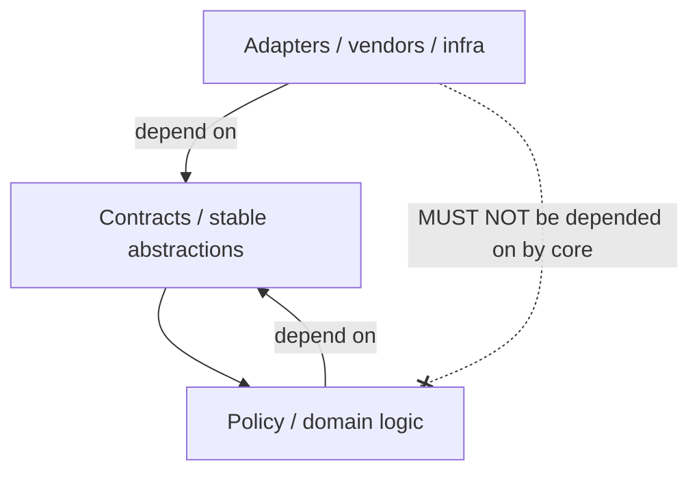
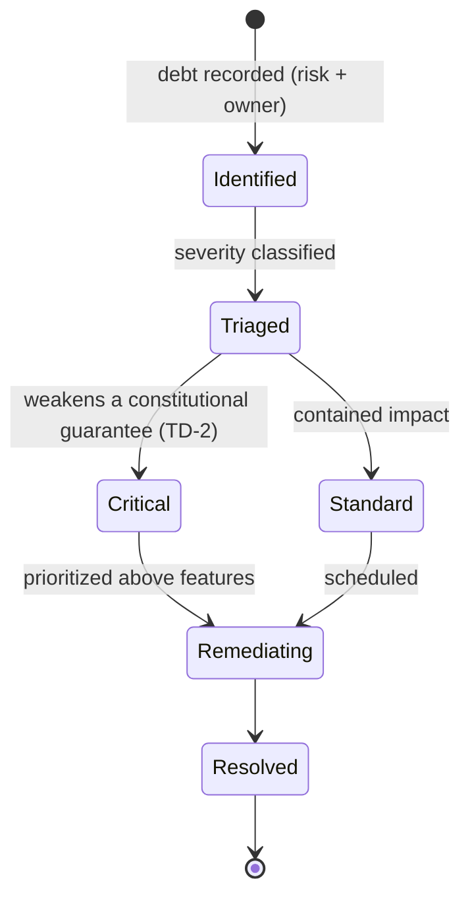

# Coding Standards Rulebook

| Field                            | Value                                                                                                                                      |
| -------------------------------- | ------------------------------------------------------------------------------------------------------------------------------------------ |
| **Rulebook ID**                  | RB-20                                                                                                                                      |
| **Framework code / rule prefix** | `CODE`                                                                                                                                     |
| **Tier**                         | 3 (Rulebook)                                                                                                                               |
| **Owner**                        | Principal Engineer / Engineering Standards Council (**PE**)                                                                                |
| **Co-signers**                   | Architecture Review Board (**ARB**), Head of Security (**CISO**, for security-coding sections), Head of AI (**HAI**, for AI-code sections) |
| **Version**                      | 1.0.0                                                                                                                                      |
| **Status**                       | PROPOSED (binding upon ARB ratification per Framework §10)                                                                                 |
| **Last Ratified**                | — (pending)                                                                                                                                |
| **Supersedes**                   | —                                                                                                                                          |

> **Location note.** The Rulebook Framework catalogs rulebooks under `docs/rulebooks/`. This document is placed at `docs/standards/coding_standards.md` per the authoring instruction; it is nonetheless the ratified content of **RB-20 · CODE** and is governed identically by the Framework. If the ARB later requires uniform placement, it moves to `docs/rulebooks/RB-20-coding_standards.md` with no content change.

> **Naming note.** `CLAUDE.md` defines constitutional Coding Standards `CS-1..CS-4` and Code Review `CR-1..CR-4`. This rulebook's own rule IDs use the prefix `CODE-`; references to `CS-*`/`CR-*` mean the constitutional rules.

> **Reading note.** Tier-3 operational law. Subordinate to `CLAUDE.md` and the Architecture Canon; supreme over Agent/Workflow Contracts and Source Code. Defines _how software is engineered_, not how to program in any language. It contains **no code, no snippets, no language/framework specifics** — only enforceable, technology-independent rules. Binds **every human developer, AI coding agent, automated system, and future contributor** equally.

---

## 2. Purpose

To define the immutable software-engineering governance that keeps the platform correct, maintainable, auditable, secure, and architecturally coherent over a ten-year horizon and across human and AI contributors. This rulebook is the single authority on **coding practices**: design and quality, architecture compliance, module boundaries and dependency direction, coupling/cohesion, type safety and validation, error handling, resource management, secure-coding practices, refactoring, technical-debt tracking, and **AI-generated-code coding governance** (Framework §5, §8 SSOT map, CODE row).

Its governing intent is `CLAUDE.md` CS-1..CS-4, SE-1..SE-5, and CP-1 (enforcement over intention): code is the lowest tier of authority and MUST faithfully implement the tiers above it; convenience never overrides maintainability, and security is never sacrificed for speed.

## 3. Scope & Boundaries

**In scope (this rulebook is the authority):**

- Coding philosophy, quality, maintainability, simplicity; separation of concerns; domain-driven design principles.
- Architecture compliance in code; module-boundary rules; dependency management and direction; coupling/cohesion.
- Type safety; data/input/output validation practices; error/exception handling; resource management.
- Secure-coding practices; determinism/stochastic separation in code; configuration/environment separation (coding side).
- Refactoring standards; technical-debt tracking (coding side); legacy-code handling.
- AI-generated / AI-assisted code coding rules; human-approval requirements for code changes.
- Coding-side requirements that integrate with testing, review, docs, git, naming, security, performance, observability.

**Out of scope (references only — Framework RBK-A2, RBK-DUP-1):**

- **Test methodology, coverage thresholds, golden-set/test-data governance** → **RB-21 · TEST**.
- **Review _process_, PR governance, approval mechanics** → **RB-22 · REVIEW** (this rulebook states coding-side review requirements).
- **Documentation standards; decision records (ADRs)** → **RB-23 · DOC**, **RB-25 · ADR**.
- **Git/branching/commit/history mechanics; version-compatibility policy** → **RB-24 · GIT**; **VER-_ / DEPR-_** (constitutional).
- **Naming conventions & repository-organization _authority_** → **RB-26 · NAME** (this rulebook references it).
- **Security controls, secrets/KMS, exfiltration, audit-trail integrity** → **RB-27 · SEC** (`P1-09`).
- **Performance/scalability budgets & scaling mechanics** → **RB-29 · PERF** (`P5-01/03/04`); **observability tooling/telemetry** → **RB-28 · OBS**.
- **AI role boundaries, capability class, trust, deterministic-engine mandate** → **RB-15 · AIGOV** (this rulebook applies them to code).
- **Reproducibility manifests / determinism capture** → **RB-05 · REPRO** (`P1-02`).

CODE states _how code must be built_; the owners define testing, review-process, docs, git, naming, security, performance, and AI-governance _mechanisms_. Requirements over out-of-scope items are **coding acceptance conditions** citing the owner.

## 4. Constitutional Basis (`CLAUDE.md`)

Traces to: **CS-1..CS-4** (coding standards), **SE-1..SE-5** (software engineering: SRP, no hidden coupling, replaceability, determinism boundaries, no undocumented assumptions), **CR-1..CR-4** (review), **AR-1..AR-4** (architecture principles), **TD-1..TD-3** (technical debt), **DEPR-1..DEPR-3, VER-1..VER-3** (deprecation/versioning), **NM-1..NM-4, RO-1..RO-4** (naming/repo), **AI-1..AI-8, DE-1..DE-4** (AI/determinism), **CP-1/4/8**, and Forbidden Practices **FB-10, FB-13, FB-14**.

## 5. Architectural Basis (Architecture Canon)

Grounded in ARCH **§0** (design philosophy), **§2.17** (contracts as the hourglass waist), **§8** (cross-cutting invariants), **§2.1** (clock injection); PATCH **P1-03** (determinism/stochastic separation), **P1-07** (capability contracts — no core asset-branching), **P5-02** (bounded contexts), **P1-02** (reproducibility); REVIEW **M1** (god-modules/SRP), **M2** (over-generic modules), **M3** (hidden coupling; contract-waist coupling), **C4** (reproducibility), **C3** (LLMs in deterministic paths).

## 6. Definitions

Constitutional and peer-rulebook glossary terms are **not** redefined. Coding-specific terms are in §Glossary. Higher tiers govern collisions.

---

# ABSOLUTE RULES (entrenched — non-waivable)

Restating the platform's engineering absolutes in operational form; each admits **no exception** (AM-2).

- **CODE-A1.** Code quality MUST be measurable and measured (CODE-6).
- **CODE-A2.** Architecture MUST be respected; code MUST NOT contradict the Architecture Canon (CODE-12, AR-1).
- **CODE-A3.** Security MUST NEVER be sacrificed for speed (CODE-45, SEC).
- **CODE-A4.** Convenience MUST NOT override maintainability (CODE-2).
- **CODE-A5.** Technical debt MUST be explicitly tracked; hidden debt is PROHIBITED (CODE-71, TD-1).
- **CODE-A6.** Every production change MUST be traceable (CODE-64, GIT).
- **CODE-A7.** Every critical change MUST have human approval (CODE-66, CR-1).
- **CODE-A8.** AI-generated code carries the same responsibility requirements as human-generated code (CODE-75).
- **CODE-A9.** No code MAY bypass a deterministic validation/governance system (CODE-16, DE-1, AI-4).

---

# RULES

## Coding Philosophy

- **CODE-1 (MUST).** Code MUST be written to be _read, audited, and safely changed_ by others (human and AI) years later; write-once cleverness is subordinate to long-term clarity. _Rationale:_ SE, 10-year horizon; the platform outlives any author. _Refs:_ CODE-8.
- **CODE-2 (MUST).** When quality and convenience conflict, quality MUST win; expedient shortcuts that degrade maintainability are PROHIBITED unless recorded as tracked debt (CODE-71). _Rationale:_ CODE-A4, TD-1. _Refs:_ CODE-71.
- **CODE-3 (MUST).** New code MUST read like the surrounding code — matching its structure, idiom, and conventions; gratuitous stylistic divergence is PROHIBITED. _Rationale:_ NM-3, consistency reduces cognitive load and defects. _Refs:_ RB-26 · NAME.

## Software Engineering Principles

- **CODE-4 (MUST).** Every module, component, and function MUST have a single, clearly stated responsibility; multi-responsibility units are PROHIBITED (SE-1). _Rationale:_ M1; SRP is the base defense against unmaintainable god-modules. _Acceptance:_ each unit's responsibility is expressible in one sentence. _Failure:_ a unit doing two unrelated jobs. _Refs:_ CODE-13.
- **CODE-5 (MUST).** Components MUST be replaceable behind a contract without modifying consumers (SE-3); code MUST depend on interfaces/contracts, not concrete implementations. _Rationale:_ AR-3, ARCH §2.17; replaceability is the platform's core requirement. _Refs:_ CODE-18.

## Code Quality Principles

- **CODE-6 (MUST).** Code quality MUST be measurable via objective, versioned metrics (e.g., complexity, coupling, coverage, defect density) with governed thresholds; unmeasured quality claims are inadmissible. _Rationale:_ CODE-A1, CP-1; you cannot govern what you do not measure. _Acceptance:_ quality metrics computed in CI with thresholds. _Failure:_ merging code that breaches a quality threshold without a tracked exception. _Refs:_ CODE-63.
- **CODE-7 (MUST).** Correctness-critical code MUST be covered by tests, including golden-set tests for any deterministic decision engine (owned by RB-21 · TEST; requirement here). _Rationale:_ CS-2, VS-1, DE-2. _Refs:_ RB-21 · TEST, CODE-52.

## Maintainability Principles

- **CODE-8 (MUST).** Code MUST minimize the cost of future change: low coupling, high cohesion, clear boundaries, and explicit contracts. _Rationale:_ SE-2/3; maintainability is a first-class, measured property. _Refs:_ CODE-19, CODE-20.
- **CODE-9 (SHOULD).** Code SHOULD prefer explicitness over implicitness where it aids auditability, even at the cost of brevity. _Rationale:_ auditability (CP-7) outranks terseness in a regulated research platform.

## Simplicity Principles

- **CODE-10 (MUST).** The simplest solution that satisfies the requirement and the contracts MUST be preferred; unnecessary complexity is PROHIBITED. _Rationale:_ complexity is defect surface and maintenance cost. _Refs:_ CODE-11.
- **CODE-11 (MUST NOT).** Abstractions MUST NOT be introduced speculatively ("just in case") or without documentation; premature or undocumented abstraction is PROHIBITED. _Rationale:_ SE-5; undocumented abstractions are hidden complexity and a named AI risk (CODE-80). _Refs:_ CODE-80.

## Separation of Concerns

- **CODE-12 (MUST).** Concerns MUST be separated along architectural boundaries (data, research, validation, portfolio, execution, risk, AI); a unit MUST NOT mix concerns from different layers. _Rationale:_ ARCH §1, SE-1; mixed concerns create hidden coupling (M3). _Refs:_ CODE-13.
- **CODE-13 (MUST).** Deterministic decision logic and stochastic (AI/LLM) logic MUST be physically separated into distinct, clearly named units; stochastic logic MUST NOT reside in a deterministic decision path (SE-4, `P1-03`). _Rationale:_ DE-1, REVIEW C3; co-locating them destroys reproducibility and testability. _Acceptance:_ deterministic engines contain no AI calls. _Failure:_ an LLM call inside a validation/risk/allocation engine. _Refs:_ CODE-16, RB-15 · AIGOV.

## Domain-Driven Design Principles

- **CODE-14 (MUST).** Code MUST use the domain vocabulary defined by the ontologies and glossaries (RB-10/09 · FAR, `CLAUDE.md` Glossary); ubiquitous language MUST be consistent across code, contracts, and docs. _Rationale:_ NM-1, KM-3; shared language prevents semantic drift. _Refs:_ RB-26 · NAME.
- **CODE-15 (MUST).** Bounded contexts MUST own their models and MUST NOT share mutable internal state across context boundaries; cross-context interaction is only through contracts (SE-2, `P5-02`). _Rationale:_ M3; shared internals are hidden coupling. _Refs:_ CODE-19.

## Architecture Compliance

- **CODE-16 (MUST).** Code MUST conform to the Architecture Canon and MUST NOT introduce designs that contradict it; architecture-affecting changes MUST trace to a PATCH Patch ID and, where applicable, an ADR (AR-1, ADR-3). No code may bypass a deterministic validation or governance system (CODE-A9, DE-1, AI-4). _Rationale:_ AR-1..AR-4; code is the lowest tier and MUST implement, not redefine, the architecture. _Acceptance:_ architecture-affecting PRs cite a Patch ID/ADR; no bypass paths exist. _Failure:_ code that reimplements or bypasses an architectural control. _Refs:_ CODE-64, RB-25 · ADR.
- **CODE-17 (MUST NOT).** Code MUST NOT weaken a cross-cutting invariant (reproducibility, point-in-time correctness, immutability, separation of powers, provenance) (AR-4). _Rationale:_ these are constitutional; violating them via code is PROHIBITED. _Refs:_ CODE-A9.

## Module Boundary Rules

- **CODE-18 (MUST).** Module boundaries MUST be explicit and enforced; a module MUST expose only its contract and MUST NOT allow consumers to reach around it into internals (SE-2). _Rationale:_ CS-1; reaching around contracts is hidden coupling. _Refs:_ CODE-19.
- **CODE-19 (MUST).** Core/shared modules MUST NOT branch on asset class or any capability-specific concern; asset specifics live behind capability contracts (CP-8, `P1-07`). _Rationale:_ the asset-agnostic core is the platform's multi-asset enabler; `if asset_type == …` in core is PROHIBITED. _Acceptance:_ no core module references a specific asset class. _Failure:_ asset-class branching in shared code. _Refs:_ CODE-16.

## Dependency Management

- **CODE-20 (MUST).** All dependencies (internal and third-party) MUST be explicit, declared, version-pinned, and supply-chain scanned (mechanism per RB-27 · SEC); undeclared or floating dependencies are PROHIBITED. _Rationale:_ CP-4, SEC; reproducibility and security require pinned, known dependencies. _Refs:_ CODE-45, RB-05 · REPRO.
- **CODE-21 (MUST NOT).** Code MUST NOT introduce hidden dependencies (implicit global state, ambient services, undocumented cross-module calls) (SE-2). _Rationale:_ M3; hidden dependencies break independently and defeat replaceability. _Refs:_ CODE-77.

## Dependency Direction Rules

- **CODE-22 (MUST).** Dependencies MUST point inward toward stable abstractions/contracts; higher-level policy MUST NOT depend on lower-level implementation detail, and the core MUST depend on contracts, not adapters (inversion of control). _Rationale:_ AR-3, ARCH §2.15; correct direction is what makes adapters swappable without touching the core. _Acceptance:_ no contract depends on an implementation; adapters depend on the contract. _Failure:_ core code importing a concrete adapter/vendor. _Refs:_ CODE-5.

## Coupling Management

- **CODE-23 (MUST).** Coupling MUST be minimized and measured; changes that materially increase coupling MUST be justified and MUST NOT create hidden coupling. _Rationale:_ SE-2, M3; coupling is the primary driver of change cost and fragility. _Refs:_ CODE-6.

## Cohesion Requirements

- **CODE-24 (MUST).** Units MUST be highly cohesive — everything in a unit serves its single responsibility; incohesive "utility grab-bags" are PROHIBITED for non-trivial logic. _Rationale:_ SE-1; low cohesion signals a hidden multi-responsibility unit. _Refs:_ CODE-4.

## Naming Standards

> **Boundary note.** Naming conventions and repository organization are owned by **RB-26 · NAME**. This rulebook requires conformance.

- **CODE-25 (MUST).** Names MUST reflect single responsibility and domain vocabulary and MUST conform to RB-26 · NAME; ambiguous, misleading, or abbreviation-heavy names are PROHIBITED. _Rationale:_ NM-1..NM-4; names are the primary readability interface. _Refs:_ CODE-14, RB-26 · NAME.

## File Organization & Project Structure

> **Boundary note.** Repository layout authority is **RB-26 · NAME** (RO-1..RO-4), conforming to ARCH §2.

- **CODE-26 (MUST).** Files and modules MUST be organized to match the architecture's layer/context structure (ARCH §2); deterministic engines and stochastic agents MUST reside in separate, clearly named locations (SE-4). _Rationale:_ RO-4; structure encodes and enforces boundaries. _Refs:_ CODE-13.

## Configuration Management

- **CODE-27 (MUST).** Configuration MUST be externalized (not hard-coded), environment-specific, and versioned; behavior MUST be changeable by configuration/injection without code edits where the architecture intends it (e.g., clock, execution mode). _Rationale:_ ARCH §2.18 config; enables research/paper/live modes from one codebase. _Refs:_ CODE-28, CODE-14-clock.
- **CODE-28 (MUST).** Environments (research / paper / live) MUST be separated; code MUST NOT assume a single environment, and environment-crossing (e.g., live credentials in research) is PROHIBITED. _Rationale:_ DEP, safety; environment bleed is a production-safety hazard. _Refs:_ RB-27 · SEC.

## Secret Management

- **CODE-29 (MUST NOT).** Secrets, credentials, tokens, and raw vendor data MUST NEVER be embedded in code, config committed to the repo, logs, or artifacts (FB-14); secrets are referenced via the secrets broker only (mechanism per RB-27 · SEC). _Rationale:_ SEC-3, FB-14; committed secrets are an existential leak. _Acceptance:_ secret-scanning passes on every change. _Failure:_ any secret in the repo. _Refs:_ CODE-45, RB-27 · SEC.

## Type Safety Rules

- **CODE-30 (MUST).** Data crossing a boundary (module, context, external) MUST be typed/validated against its contract; untyped or unvalidated boundary data is PROHIBITED for correctness-critical paths. _Rationale:_ CS-1; type/contract safety catches defects at the boundary. _Refs:_ CODE-31, RB-06/07 · DATA.

## Data Validation Rules

- **CODE-31 (MUST).** Inputs MUST be validated against their contracts before use; invalid data MUST fail closed (reject/quarantine), never pass silently (data-side owned by RB-06/07 · DATA). _Rationale:_ DI, CP-1; fail-closed validation prevents silent corruption. _Refs:_ CODE-34, DATA-66.
- **CODE-32 (MUST NOT).** Code MUST NOT remove, weaken, or bypass validation logic; validation is a control (AI code rule CODE-77). _Rationale:_ CODE-A9; removing validation defeats safety. _Refs:_ CODE-77.

## Error Handling & Exception Management

- **CODE-33 (MUST).** Errors MUST be handled explicitly; silent swallowing of errors is PROHIBITED. Failures in a control path (validation, risk, gate) MUST fail closed (deny/halt), never fail open. _Rationale:_ CP-1, RS; a control that fails open is worse than no control. _Acceptance:_ control-path failures deny by default. _Failure:_ an exception silently caught in a control path allowing continuation. _Refs:_ CODE-31.
- **CODE-34 (MUST).** Error handling MUST preserve auditability: consequential failures MUST be recorded with context sufficient for diagnosis (logging owned by RB-28 · OBS). _Rationale:_ CP-7. _Refs:_ CODE-35.

## Logging & Observability Requirements

> **Boundary note.** Logging/metrics/tracing standards and telemetry are owned by **RB-28 · OBS**. This rulebook states coding-side obligations.

- **CODE-35 (MUST).** Code MUST emit structured, audit-grade logs for consequential actions (per RB-28 · OBS) and MUST NOT log secrets, restricted data, or un-provenanced data (CODE-29). _Rationale:_ OB-1, CP-7; logs are part of the audit trail. _Refs:_ CODE-29, RB-28 · OBS.
- **CODE-36 (MUST).** Every consequential operation MUST be traceable to its inputs, code version, and (for AI-touched paths) model/prompt provenance (`P1-02`). _Rationale:_ CP-4/7; traceability is mandatory. _Refs:_ CODE-64.

## Performance Engineering & Scalability

> **Boundary note.** Performance/scalability budgets and scaling mechanics are owned by **RB-29 · PERF**. This rulebook states coding-side obligations.

- **CODE-37 (MUST).** Performance-critical code MUST respect the budgets set by RB-29 · PERF; optimizations MUST NOT weaken correctness, point-in-time, reproducibility, or security guarantees (PF-2). _Rationale:_ AR-4; correctness outranks speed. _Refs:_ CODE-A3, RB-29 · PERF.
- **CODE-38 (SHOULD).** Code SHOULD be written to scale independently per bounded context (SC-1); shared bottlenecks that couple scaling profiles SHOULD be avoided. _Rationale:_ SC-1; scalability is designed in.

## Resource Management

- **CODE-39 (MUST).** Resources (memory, connections, handles, compute) MUST be explicitly managed and released; leaks and unbounded resource growth are PROHIBITED in long-running components. _Rationale:_ reliability; leaks cause production failures. _Refs:_ CODE-37.

## Determinism & Injection

- **CODE-40 (MUST).** Non-determinism — current time, randomness, model/LLM calls, external I/O — MUST be injected, never accessed ambiently (CS-3, PIT-4). _Rationale:_ ambient time is a look-ahead bug; unseeded randomness breaks reproducibility (REVIEW C1/C4). _Acceptance:_ no ambient clock/RNG/model access in correctness-critical code. _Failure:_ a direct wall-clock or unseeded RNG call in a backtest/engine. _Refs:_ CODE-13, RB-05 · REPRO.
- **CODE-41 (MUST).** Randomness in correctness-critical code MUST be seeded and the seed captured in the Run Manifest (RB-05 · REPRO / `P1-02`). _Rationale:_ CP-4, RP-1. _Refs:_ CODE-40.

## Security Coding Standards

> **Boundary note.** Security controls, secrets/KMS, exfiltration, and audit-trail integrity are owned by **RB-27 · SEC** (`P1-09`). This rulebook states secure-coding _practices_.

- **CODE-42 (MUST).** Code MUST follow secure-coding practices: validate all inputs (CODE-31), encode/validate all outputs (CODE-44), least-privilege access, and default-deny for capabilities/tools. _Rationale:_ SEC; secure-by-default construction. _Refs:_ CODE-45.
- **CODE-43 (MUST NOT).** Code MUST NOT weaken, disable, or circumvent a security control; security MUST NEVER be traded for speed or convenience (CODE-A3). _Rationale:_ SEC-2, CP-1. _Refs:_ CODE-77.
- **CODE-44 (MUST).** Untrusted external content (data, text for AI, tool responses) MUST be treated as untrusted and passed through the trust/quarantine boundary before influencing logic or AI (mechanism per RB-27 · SEC / RB-15 · AIGOV / `P4-03`). _Rationale:_ REVIEW C3; injection/poisoning defense. _Refs:_ AIGOV-13.
- **CODE-45 (MUST).** Dependencies MUST be supply-chain scanned and kept current for security; known-vulnerable dependencies MUST be remediated within governed SLAs. _Rationale:_ SEC; supply chain is a real attack surface (REVIEW M6). _Refs:_ CODE-20.

## Privacy Requirements

- **CODE-46 (MUST).** Code MUST handle data per its sensitivity classification (RB-06/07 · DATA, RB-27 · SEC); restricted/licensed data MUST NOT be copied, logged, or emitted outside its permitted scope. _Rationale:_ SEC, compliance. _Refs:_ CODE-35.

## Input / Output Validation

- **CODE-47 (MUST).** All external inputs MUST be validated at the boundary (CODE-31); all outputs crossing a boundary MUST conform to the consumer's contract. _Rationale:_ CS-1; boundary validation is where correctness is enforced. _Refs:_ CODE-30.

## Testing (coding-side requirements)

> **Boundary note.** Test methodology, coverage thresholds, and test-data governance are owned by **RB-21 · TEST**. This rulebook requires that code be testable and accompanied by tests.

- **CODE-48 (MUST).** Correctness-critical code MUST ship with tests appropriate to its risk; **deterministic decision engines MUST have golden-set tests** (VS-1, DE-2). Merging correctness-critical code without required tests is PROHIBITED. _Rationale:_ CS-2; untested control code is unsafe. _Refs:_ RB-21 · TEST.
- **CODE-49 (MUST).** Code MUST be designed for testability (injected dependencies, no hidden state); untestable correctness-critical code is a rejection condition. _Rationale:_ CODE-40; testability follows from clean design. _Refs:_ CODE-40.
- **CODE-50 (SHOULD).** Integration and regression tests SHOULD accompany changes that cross boundaries or fix defects (methodology per RB-21 · TEST). _Rationale:_ prevents regressions and boundary breakage.

## Code Review (coding-side requirements)

> **Boundary note.** Review _process_, PR governance, and approval mechanics are owned by **RB-22 · REVIEW**. This rulebook states coding-side requirements.

- **CODE-51 (MUST).** Every change MUST be reviewed by at least one party independent of the author before merge; self-approval is PROHIBITED (CR-1). Reviewers MUST verify constitutional compliance (reproducibility, PIT, provenance, separation of powers, security, AI-code rules). _Rationale:_ CR-1/2; review is the human quality gate. _Acceptance:_ every merge shows independent, compliance-focused review. _Failure:_ a self-merged or unreviewed change. _Refs:_ CODE-66, RB-22 · REVIEW.
- **CODE-52 (MUST).** Reviewers MUST reject changes that add prose guarantees without enforcement, weaken a control, or violate an AI-code rule (CR-3). _Rationale:_ CP-1. _Refs:_ CODE-77.

**Code review compliance checklist (reviewer MUST verify):**

- [ ] Single responsibility; conforms to architecture; no asset-branching in core (CODE-4, CODE-16, CODE-19).
- [ ] No hidden coupling/dependencies; dependency direction correct (CODE-21, CODE-22).
- [ ] Non-determinism injected; seeds captured; determinism/stochastic separated (CODE-40, CODE-13).
- [ ] Validation present and not weakened; errors fail closed (CODE-31, CODE-33).
- [ ] No secrets; secure-coding practices; untrusted input quarantined (CODE-29, CODE-42, CODE-44).
- [ ] Required tests present; testable design (CODE-48, CODE-49).
- [ ] AI-generated sections identified with required disclosures (CODE-75, CODE-76).
- [ ] Debt tracked; references resolve; traceable to Patch ID/ADR if architectural (CODE-71, CODE-16).

## Pull Request & Change Approval

> **Boundary note.** Git/PR mechanics are owned by **RB-24 · GIT**; approval _process_ by **RB-22 · REVIEW**.

- **CODE-53 (MUST).** Every change MUST be an atomic, single-purpose PR referencing its rationale and (if architectural) its Patch ID/ADR; unrelated changes MUST NOT be combined (GIT-2). _Rationale:_ atomicity enables review and rollback. _Refs:_ RB-24 · GIT.
- **CODE-54 (MUST).** A failing or skipped required quality/security/test gate MUST block merge; overriding a red gate requires a counter-signed ADR (CR-4). _Rationale:_ CP-1; red gates are not advisory. _Refs:_ CODE-63.

## Refactoring Standards

- **CODE-55 (MUST).** Refactoring MUST preserve behavior (verified by tests) unless the behavior change is the explicit, reviewed purpose; behavior-changing "refactors" without disclosure are PROHIBITED. _Rationale:_ silent behavior change under the guise of refactoring is a defect and audit hazard. _Refs:_ CODE-48.
- **CODE-56 (SHOULD).** Refactoring to reduce coupling, raise cohesion, or pay down tracked debt SHOULD be prioritized when it de-risks correctness-critical code. _Rationale:_ TD-2; targeted refactoring reduces systemic risk.

## Technical Debt Management

- **CODE-57 (MUST).** All known technical debt MUST be recorded explicitly with its risk, scope, and remediation owner; hidden or unrecorded debt is PROHIBITED (TD-1). _Rationale:_ CODE-A5; undocumented debt compounds silently. _Acceptance:_ debt is tracked and visible. _Failure:_ undocumented shortcuts in the codebase. _Refs:_ CODE-2.
- **CODE-58 (MUST).** Debt that weakens a constitutional guarantee (reproducibility, PIT, separation of powers, statistical integrity, security) is **CRITICAL** and MUST be prioritized above feature work (TD-2). _Rationale:_ such debt threatens the platform's core promises. _Refs:_ CODE-17.

## Legacy Code Handling

- **CODE-59 (MUST).** Legacy/inherited code touched by a change MUST be brought up to these standards within the change's scope where feasible, or its debt recorded (CODE-57); changes MUST NOT increase legacy debt. _Rationale:_ the "boy scout rule" prevents rot. _Refs:_ CODE-57.
- **CODE-60 (MUST).** Before modifying or deleting existing code, its purpose MUST be understood; if reality contradicts how it was described, that MUST be surfaced rather than blindly changed. _Rationale:_ `CLAUDE.md` harness guidance; blind edits to misunderstood code cause regressions. _Refs:_ CODE-55.

## Deprecation & Version Compatibility

> **Boundary note.** Versioning/deprecation policy is constitutional (VER-_, DEPR-_) with mechanics in **RB-24 · GIT**.

- **CODE-61 (MUST).** Deprecations MUST be announced with a migration path and removal version; silent removal is PROHIBITED (DEPR-1). Deprecated code MUST NOT be deleted while live artifacts depend on it (DEPR-2). _Rationale:_ downstream stability and reproducibility. _Refs:_ CODE-62.
- **CODE-62 (MUST).** Public contracts/schemas MUST be semantically versioned; breaking changes MUST bump the major version and MUST NOT retroactively break historical artifacts (VER-1/2). _Rationale:_ the contract waist is the highest-coupling surface (REVIEW M3). _Refs:_ ARCH §2.17.

## Release Quality Standards

- **CODE-63 (MUST).** No change reaches production without passing all required quality gates: build, tests, coverage thresholds, static/complexity analysis, security scan, and constitutional-compliance checks. _Rationale:_ CP-1, CODE-A1; the release gate is where measured quality is enforced. _Acceptance:_ all gates green. _Failure:_ a production release with a red or skipped required gate. _Refs:_ CODE-54.

## Traceability & Documentation

> **Boundary note.** Documentation standards and ADRs are owned by **RB-23 · DOC** / **RB-25 · ADR**.

- **CODE-64 (MUST).** Every production change MUST be traceable end-to-end: authored via reviewed PR, linked to its rationale, referencing its Patch ID/ADR if architectural, with recorded provenance (CODE-A6, GIT-3/4). _Rationale:_ CP-7; untraceable production change is unauditable. _Refs:_ RB-24 · GIT, RB-25 · ADR.
- **CODE-65 (MUST).** Non-obvious decisions affecting correctness, architecture, or research validity MUST be documented (in code where local, in an ADR where architectural) (DOC-2, ADR-2); undocumented assumptions are PROHIBITED (SE-5). _Rationale:_ institutional memory of _why_. _Refs:_ RB-25 · ADR.

## Code Comment Standards

- **CODE-66 (MUST).** Comments MUST explain intent, rationale, and non-obvious constraints — not restate the code; comments MUST match the surrounding density and be kept truthful as code changes. _Rationale:_ stale/decorative comments mislead; intent comments aid safe change. _Refs:_ CODE-3.

## Change Approval Rules

- **CODE-67 (MUST).** Critical changes (to controls, deterministic engines, contracts, security, or production behavior) MUST have explicit human approval; capital-affecting changes require independent counter-sign (CODE-A7, CR-1, HO-2). _Rationale:_ human accountability for high-consequence code. _Refs:_ CODE-51.

## AI-Generated Code Governance

> **Boundary note.** AI role boundaries, capability class, trust, and the deterministic-engine mandate are owned by **RB-15 · AIGOV**. This rulebook applies them to code and adds coding-specific AI rules.

- **CODE-68 (MUST).** AI-generated code carries **the same responsibility, quality, testing, review, and traceability requirements as human-generated code** (CODE-A8); AI authorship is never grounds for reduced scrutiny. _Rationale:_ AIGOV; the output's risk is independent of its author. _Acceptance:_ AI code meets every standard herein. _Failure:_ AI code held to a lower bar. _Refs:_ CODE-51, CODE-63.

**AI coding — MUST (per authoring mandate + AIGOV):** AI systems MUST

- **CODE-69.** follow architecture rules and respect module boundaries (CODE-16, CODE-18);
- **CODE-70.** explain their assumptions and identify AI-generated sections;
- **CODE-71.** include a validation strategy and include tests where applicable (CODE-48);
- **CODE-72.** avoid undocumented behavior and record provenance (model/prompt/output, `P1-02`).

**AI coding — MUST NOT (per authoring mandate + AIGOV):** AI systems MUST NOT

- **CODE-73.** bypass architecture decisions or introduce hidden dependencies (CODE-16, CODE-21);
- **CODE-74.** modify critical systems, remove/weaken validation, or weaken security controls without approval (CODE-32, CODE-43, CODE-67);
- **CODE-75.** create undocumented abstractions (CODE-11);
- **CODE-76.** generate production-critical changes without human review (CODE-67, AI-3).

- **CODE-77 (MUST).** AI-generated changes MUST be clearly labeled as AI-generated in the change record, with the model/prompt provenance, so reviewers apply appropriate scrutiny. _Rationale:_ AIGOV-23; transparency enables review and audit. _Refs:_ CODE-64.
- **CODE-78 (MUST NOT).** AI MUST NOT write, modify, or bypass a deterministic validation/decision engine's decision logic in a way that alters its behavior without human review and golden-test verification (DE-1, AI-4). _Rationale:_ AIGOV-16; the deterministic core must not be silently AI-altered. _Refs:_ CODE-13, CODE-48.

## AI-Assisted Development & AI Code Review

- **CODE-79 (MAY).** AI MAY assist review (drafting findings, checking completeness) but MUST NOT be the approving authority for a change (CR, AI-3); approval is human. _Rationale:_ AIGOV-3; approval is an accountable human act. _Refs:_ CODE-51.
- **CODE-80 (MUST).** AI refactoring MUST preserve behavior and pass tests (CODE-55) and MUST NOT remove validation, weaken controls, or introduce undocumented abstractions. _Rationale:_ AI refactors are high-risk for silent control removal. _Refs:_ CODE-32, CODE-43.

## Continuous Improvement

- **CODE-81 (MUST).** Coding standards, quality thresholds, and gates MUST be reviewed and improved on a governed cadence using defect and incident data (CI-1); improvements MUST be ratified, not applied ad hoc. _Rationale:_ CI-3; standards must evolve with evidence. _Refs:_ CODE-6.

---

## Acceptance Criteria (change readiness for merge/production)

A change is **merge/production-ready** only when **all** hold (cumulative):

**Change readiness checklist:**

- [ ] Single-purpose, atomic; traceable; architectural changes cite Patch ID/ADR (CODE-53, CODE-64).
- [ ] Conforms to architecture; no asset-branching in core; correct dependency direction; no hidden coupling (CODE-16, CODE-19, CODE-22).
- [ ] SRP, high cohesion, low coupling; simplest viable design; no undocumented abstraction (CODE-4, CODE-10, CODE-11).
- [ ] Non-determinism injected + seeded; deterministic/stochastic separated (CODE-40, CODE-13).
- [ ] Inputs/outputs validated; errors fail closed; validation not weakened (CODE-31, CODE-33).
- [ ] No secrets; secure-coding practices; untrusted content quarantined; deps pinned+scanned (CODE-29, CODE-42, CODE-44, CODE-20).
- [ ] Required tests present incl. golden-set for decision engines; testable design (CODE-48, CODE-49).
- [ ] Independently reviewed for compliance; critical changes human-approved (CODE-51, CODE-67).
- [ ] AI-generated sections labeled with provenance + assumptions (CODE-70, CODE-77).
- [ ] Debt tracked; docs/ADRs updated; all quality/security/test gates green (CODE-57, CODE-63, CODE-65).

## Rejection Criteria

A change MUST be **rejected** if **any** hold:

- **CODE-82.** Contradicts or bypasses the architecture or a deterministic control (CODE-16, CODE-17, CODE-78).
- **CODE-83.** Introduces hidden coupling/dependencies or asset-branching in core (CODE-19, CODE-21).
- **CODE-84.** Ambient non-determinism, unseeded randomness, or determinism/stochastic mixing (CODE-40, CODE-13).
- **CODE-85.** Removes/weakens validation, error-handling, or security controls (CODE-32, CODE-43).
- **CODE-86.** Contains secrets, or unpinned/unscanned dependencies (CODE-29, CODE-20).
- **CODE-87.** Missing required tests or golden-set tests for a decision engine (CODE-48).
- **CODE-88.** Self-approved, unreviewed, or merged past a red required gate without counter-signed ADR (CODE-51, CODE-54).
- **CODE-89.** Untracked technical debt, undocumented assumptions/abstractions (CODE-11, CODE-57, CODE-65).
- **CODE-90.** AI-generated production-critical change without labeling, provenance, or human review (CODE-76, CODE-77).

## Anti-Patterns

Recognized coding failure modes that MUST be actively prevented (mirrors `CLAUDE.md` AP-\*, REVIEW):

- **CODE-AP-1.** God-modules / multi-responsibility units (CODE-4; M1).
- **CODE-AP-2.** Over-generic "universal" modules that leak specifics into the core (CODE-19; M2).
- **CODE-AP-3.** Hidden coupling: global state, ambient services, reach-around-the-contract (CODE-21, CODE-18; M3).
- **CODE-AP-4.** Ambient clock/RNG/model access; unseeded randomness (CODE-40; C1/C4).
- **CODE-AP-5.** LLM logic inside a deterministic decision engine (CODE-13; C3).
- **CODE-AP-6.** Silent error swallowing; fail-open controls (CODE-33).
- **CODE-AP-7.** Speculative/undocumented abstraction; convenience over maintainability (CODE-11, CODE-2).
- **CODE-AP-8.** Secrets/raw data in code, logs, or config (CODE-29).
- **CODE-AP-9.** Behavior-changing "refactors" without disclosure/tests (CODE-55).
- **CODE-AP-10.** Untracked debt; undocumented assumptions (CODE-57, CODE-65).
- **CODE-AP-11.** AI code held to a lower bar, unlabeled, or silently altering controls (CODE-68, CODE-77, CODE-78).

## Forbidden Coding Practices

Absolute prohibitions. Violation blocks merge and is a reportable engineering-integrity event (`CLAUDE.md` entrenched clauses):

- **CODE-F-1.** Bypassing or reimplementing a deterministic validation/governance control (CODE-16, CODE-78; DE-1/AI-4).
- **CODE-F-2.** Weakening or removing validation, error-handling-fail-closed, or security controls (CODE-32, CODE-43).
- **CODE-F-3.** Ambient non-determinism or unseeded randomness in correctness-critical code (CODE-40).
- **CODE-F-4.** Asset-class branching in shared/core code (CODE-19; CP-8).
- **CODE-F-5.** Committing secrets, credentials, or raw vendor data (CODE-29; FB-14).
- **CODE-F-6.** Introducing hidden coupling or undeclared dependencies (CODE-21).
- **CODE-F-7.** Self-approving, or merging correctness-critical code without required tests/review (CODE-48, CODE-51).
- **CODE-F-8.** Undocumented/hidden technical debt or undocumented assumptions (CODE-57, CODE-65).
- **CODE-F-9.** AI generating production-critical changes without labeling, provenance, and human review (CODE-76).
- **CODE-F-10.** Optimizing/tuning without a captured reproducibility manifest (FB-10; RB-05 · REPRO).

---

## Enforcement & Verification

| Rule group                                           | Enforcement mechanism                                         | Mechanism owner                        |
| ---------------------------------------------------- | ------------------------------------------------------------- | -------------------------------------- |
| Architecture compliance / boundaries (CODE-16–19,22) | Static analysis + architecture-fitness checks in CI; ADR gate | this rulebook; RB-25 · ADR, ARB        |
| SRP/coupling/cohesion/complexity (CODE-4,23,24)      | Quality-metric gates                                          | this rulebook (`P1-03`)                |
| Determinism/injection (CODE-13,40,41)                | Static checks (no ambient clock/RNG); manifest capture        | this rulebook; RB-05 · REPRO           |
| Validation/error/fail-closed (CODE-31,33)            | Boundary-validation + control-path checks                     | this rulebook; RB-06/07 · DATA         |
| Secrets/security/deps (CODE-29,42–45)                | Secret scan + SCA + secure-coding review                      | RB-27 · SEC                            |
| Tests (CODE-48,49)                                   | Coverage + golden-set gates                                   | RB-21 · TEST                           |
| Review/PR/gates (CODE-51–54,63,67)                   | Independent review + required-gate enforcement                | RB-22 · REVIEW, RB-24 · GIT            |
| Debt/deprecation/versioning (CODE-57,58,61,62)       | Debt register + version checks                                | this rulebook; RB-24 · GIT             |
| AI-code governance (CODE-68–80)                      | AI-label + provenance + review gate; no-decision-engine-alter | this rulebook; RB-15 · AIGOV (`P1-02`) |
| Forbidden practices (CODE-F-\*)                      | Fail-closed gate; integrity report                            | ARB / PE                               |

- **CODE-E-1 (MUST).** Every rule enforcing a Forbidden Coding Practice (CODE-F-_) or Absolute Rule (CODE-A_) MUST be CI-gated and fail-closed where technically possible (Framework RBK-E2). _Rationale:_ CP-1.
- **CODE-E-2 (MUST).** Enforcement of coding controls MUST be deterministic (static analysis, gates, human review); an AI MUST NOT be the sole authority approving code (CODE-79). _Rationale:_ DE-1, AIGOV-E-2.

## Exceptions & Waivers

- **CODE-W-1 (MUST).** No exception MAY be granted to any Forbidden Coding Practice (CODE-F-_), Absolute Rule (CODE-A_), or `CLAUDE.md` entrenched clause (AM-2). Non-waivable.
- **CODE-W-2 (MAY).** GRC/ARB/PE-governed engineering parameters (quality thresholds, coverage minimums, complexity limits, dependency-CVE SLAs) MAY be changed only by those bodies, recorded as a versioned parameter set with rationale, applied prospectively.
- **CODE-W-3 (MAY).** A time-boxed waiver of a non-entrenched rule MAY be granted only by PE + ARB, recorded in the audit trail with scope, expiry, and rationale, and MUST NOT weaken architecture compliance, determinism, validation/security controls, or traceability. _Rationale:_ these are the load-bearing engineering controls.
- **CODE-W-4 (MUST).** Active waivers MUST be recorded as tracked technical debt (CODE-57) and surfaced in review. _Rationale:_ no hidden exceptions.

## Rulebook Acceptance Criteria (ratification)

Ratifiable (Framework §10) only when: every rule has a stable ID, RFC 2119 phrasing, a constitutional basis, and an enforcement mechanism; no rule contradicts `CLAUDE.md`, the Architecture Canon, or peer rulebooks per the SSOT map (especially the TEST/REVIEW/DOC/GIT/NAME/SEC/PERF/OBS/AIGOV boundaries); all governed parameters have recorded defaults; all cross-references resolve; ARB approval with PE (+ CISO/HAI for security/AI sections) co-sign obtained.

## Success Metrics

- **SM-1.** 0 production changes bypassing a deterministic control or the architecture (CODE-16, CODE-F-1).
- **SM-2.** 0 secrets committed; dependency-CVE remediation within SLA (CODE-29, CODE-45).
- **SM-3.** 100% correctness-critical code covered; 100% deterministic decision engines with golden tests (CODE-48).
- **SM-4.** 0 self-merged / unreviewed changes; 100% critical changes human-approved (CODE-51, CODE-67).
- **SM-5.** 0 ambient-non-determinism findings in correctness-critical code (CODE-40).
- **SM-6.** 100% AI-generated changes labeled with provenance; 0 AI-altered decision engines without review (CODE-77, CODE-78).
- **SM-7.** Technical debt fully tracked; 0 undocumented-assumption findings in audit (CODE-57, CODE-65).

## Dependencies & Related Rulebooks

- **Integrates with (owners of referenced mechanisms):** RB-21 · TEST, RB-22 · REVIEW, RB-23 · DOC, RB-24 · GIT, RB-25 · ADR, RB-26 · NAME, RB-27 · SEC, RB-28 · OBS, RB-29 · PERF, RB-15 · AIGOV, RB-05 · REPRO.
- **Enforces coding-side of:** all constitutional invariants (ARCH §8) and the data/PIT/determinism requirements of RB-06/07 · DATA, RB-08 · PIT.
- **Architecture references:** ARCH §0, §2.1, §2.17, §8; PATCH `P1-03`, `P1-07`, `P5-02`, `P1-02`; REVIEW M1, M2, M3, C3, C4.

## Change Log & Version History

| Version | Date    | Author (role) | Change                                            | ADR |
| ------- | ------- | ------------- | ------------------------------------------------- | --- |
| 1.0.0   | pending | PE            | Initial Coding Standards rulebook (RB-20 · CODE). | —   |

---

## Glossary (coding-specific)

Terms in `CLAUDE.md` and peer-rulebook glossaries are not redefined.

- **Deterministic Engine (code sense)** — A versioned, golden-tested, reproducible unit that makes a consequential decision; contains no AI/LLM calls (CODE-13).
- **Injection (of non-determinism)** — Supplying time, randomness, model calls, and I/O as explicit inputs rather than accessing them ambiently (CODE-40).
- **Fail-Closed** — On error or ambiguity, a control-path denies/halts rather than allowing continuation (CODE-33).
- **Hidden Coupling** — An undeclared dependency (global state, ambient service, reach-around) that breaks independently and defeats replaceability (CODE-21).
- **Dependency Direction** — The rule that dependencies point inward toward stable contracts; core depends on contracts, not adapters (CODE-22).
- **Capability Contract** — The interface behind which asset-class or vendor specifics live, keeping the core asset-agnostic (CODE-19; `P1-07`).
- **Technical Debt (tracked)** — A recorded, risk-classified, owned shortcut; untracked debt is prohibited (CODE-57).
- **AI-Generated Section** — A code region produced by an AI system, labeled with model/prompt provenance and held to the same standards as human code (CODE-68, CODE-77).
- **Quality Gate** — A CI-enforced threshold (build/tests/coverage/complexity/security/compliance) that blocks merge/release on failure (CODE-63).

---

_End of Coding Standards Rulebook (RB-20 · CODE). This document owns coding practices — design, architecture compliance, boundaries, determinism, validation, secure coding, refactoring, debt, and AI-code governance. It references — never restates — RB-21 · TEST, RB-22 · REVIEW, RB-23 · DOC, RB-24 · GIT, RB-25 · ADR, RB-26 · NAME, RB-27 · SEC, RB-28 · OBS, RB-29 · PERF, and RB-15 · AIGOV for their mechanisms. AI-generated code bears the same responsibility as human code; no code may bypass a deterministic control. Binding upon ARB ratification._
